## 第 10 课

## 使用 OverDrive 阅读电子书

现在你已经学会了如何在线听音乐，让我们探索一下你还可以用电脑享受的另一项消遣活动：阅读图书！

安装并注册 OverDrive

添加可借阅的图书馆

登录图书馆

查找并借阅图书

搜索图书

搜索结果列表

浏览图书

借阅图书

下载图书

阅读图书

更改字体大小

关闭图书

归还图书

探索：有声书

呼，成功了！

OverDrive 是一个应用程序，允许你免费从当地图书馆借阅电子书，并通过你的电脑舒适地阅读。它的使用方式与借阅普通图书馆书籍相同：书籍会被借出一段时间，如果书籍已经被借走，你需要等待它归还。一个大优势是，OverDrive 会自动为你归还图书，因此你无需担心支付任何逾期费用！要使用 OverDrive 应用，你需要成为已注册 OverDrive 的图书馆的会员。超过 40 个国家的 30,000 多家图书馆都使用 OverDrive，你很可能能找到一个靠近你的图书馆。

### 安装并注册 OverDrive

你可以从商店下载 OverDrive。按照以下步骤操作：

1.  从开始菜单打开**商店**应用。你现在应该能看到商店的主屏幕。

1.  在商店右上角的搜索框中输入**OverDrive**，然后按回车键。

1.  你的 OverDrive 搜索结果应该会出现。点击应用程序部分下方的**OverDrive** - **图书馆电子书与有声书**图标，见下文高亮部分。

    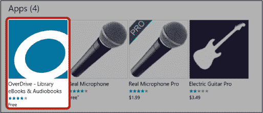

1.  点击下方高亮的**获取**按钮。

    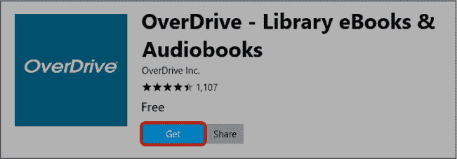

1.  应用程序应该会开始下载并安装。安装完成后，点击下方高亮的**启动**按钮，打开 OverDrive。

    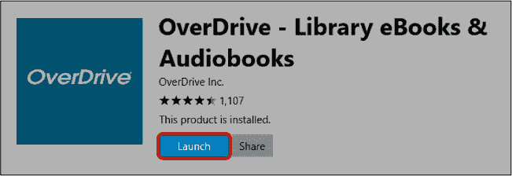

    ***** ***注意：**你可以通过在开始搜索框中输入**OverDrive**来再次打开 OverDrive 应用。*

1.  这应该会弹出一个注册界面。如果这是你第一次使用 OverDrive，你需要注册一个免费账户。点击下方高亮的**注册**按钮。

    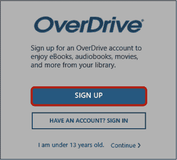

1.  向下滚动到“输入您的详细信息”部分。

1.  点击**姓名**框并输入你的全名。

1.  点击**电子邮件地址**框并输入你的电子邮件地址。你需要在下一个框中再次输入电子邮件地址，以确保没有输入错误。

1.  点击**密码**框，选择一个用于 OverDrive 的密码，然后在此处输入。您的密码需要至少包含八个字符。确保选择一个您下次使用 OverDrive 时能记住的密码。

1.  您填写的表单应该像这里显示的那样。点击蓝色的**注册**按钮以创建您的 OverDrive 账户。

    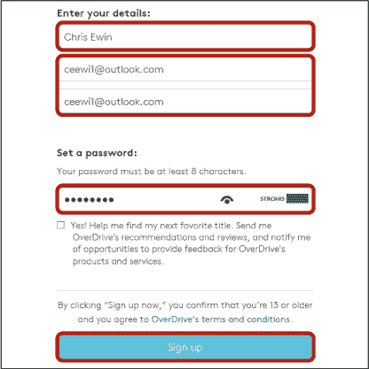

1.  OverDrive 会向您发送一封电子邮件，请求您验证账户，以确保您提供的电子邮件地址是正确的。收到此邮件后，点击邮件中的验证链接以确认您的账户。这将带您到 OverDrive 网站，您需要点击**验证**按钮。如果您遇到电子邮件问题，请查看第 4 课。

### 添加图书馆以进行借阅

现在您已经创建了 OverDrive 账户，接下来需要将您的图书馆添加到账户中。您可以添加多个图书馆，但必须是该图书馆的会员才能借阅电子书。添加图书馆后，每次打开 OverDrive 时，它都应该会显示。

添加图书馆，请按照以下步骤操作：

1.  点击**添加图书馆**按钮，如下所示。

    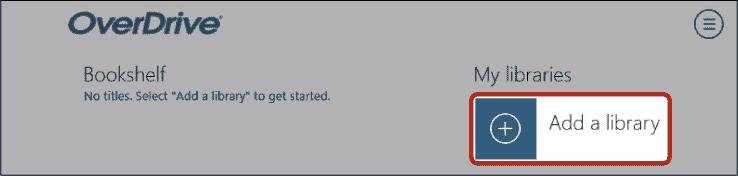

1.  这将弹出屏幕右侧的“添加图书馆”框。输入您是会员的图书馆名称，然后点击接下来高亮显示的**搜索**。如果您希望查看附近有哪些图书馆可以使用 OverDrive，请点击**浏览图书馆**。这将显示一个国家列表。从中找到您的国家并点击，然后会出现州列表，点击您的州。

    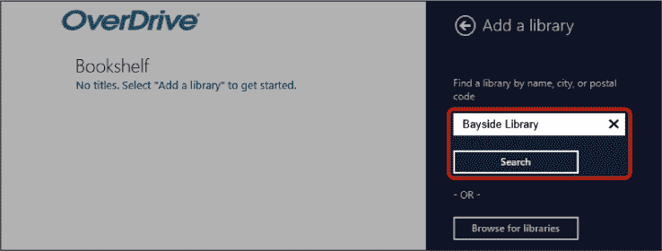

1.  您现在应该看到一个与您的搜索条件匹配的图书馆列表。此列表按字母顺序排列，可能非常长。当您找到您的图书馆时，点击它。

1.  再次点击图书馆以将其添加到您的列表中，如下所示。举个例子，我选择了澳大利亚的 Bayside Library Service。

    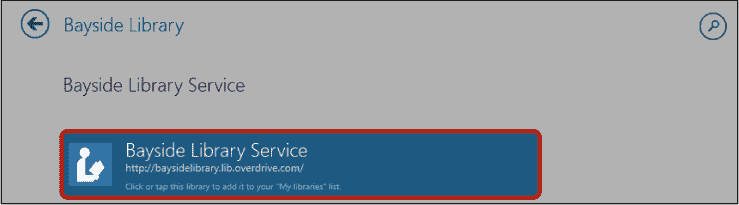

1.  这将打开您图书馆的主页，类似于这样：

    

    现在您已经添加了图书馆，每次打开 OverDrive 时，它都应该出现在您的图书馆列表中。您可以轻松地从列表中点击图书馆以打开它。

### 登录到图书馆

在您借书之前，需要使用图书馆卡号和 PIN 码登录您的图书馆。图书馆卡号应该在您的图书馆卡上，PIN 码是您与图书馆选择的一个数字。如果您不清楚这些信息或不确定自己是否有，请直接与您的图书馆联系。

要登录到您的图书馆，请按照以下步骤操作：

1.  点击**登录**按钮，如下所示。

    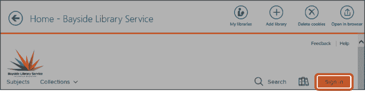

1.  这将带您进入登录页面，如下所示。请在屏幕左侧的相应框中输入您的卡号和密码。您还可以选择勾选**在此设备上记住我的卡号**框。这样，您每次借书时就无需重新输入卡号。

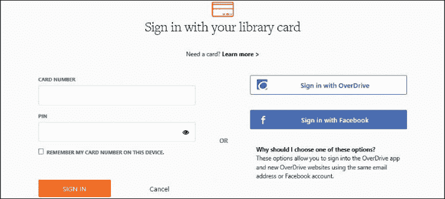

然后，您将被带回到图书馆的主页。

### 查找和借阅图书

OverDrive 提供了多种不同的借书方式，我们将在这里集中讨论两种简单的方法：搜索和浏览。一旦您找到了喜欢的书籍，就可以借阅并下载，借阅期间您可以随时阅读这本书。

#### 搜索书籍

如果您知道作者的名字或书名，可以使用搜索功能来查找它。请按照以下步骤操作：

1.  点击此处突出的**搜索**按钮，这将打开搜索框。

    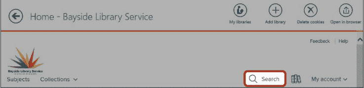

1.  在搜索框中输入您要查找的书名或作者名。输入时，OverDrive 会在搜索框下方的列表中提供一些建议。例如，在下图中，Michael Connelly 出现在建议列表中。您可以选择其中一个选项或直接按 ENTER 键。

输入搜索词后，应该会弹出搜索结果列表，接下来我们将讨论这些结果。

#### 搜索结果列表

您列出的搜索结果应该类似于下图所示。

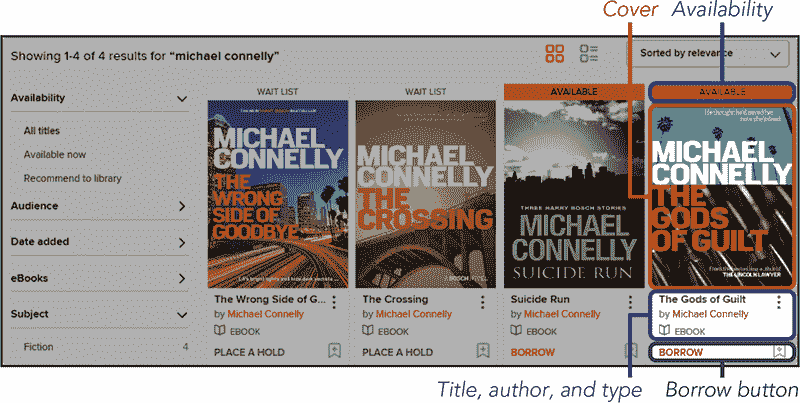

结果包含了很多有用的信息：

*****   **封面：** 每本书的封面都会显示出来。点击封面将带您进入一个页面，提供更多关于该书的信息。

*****   **可用性：** 当前可借的书籍应该在封面上方写上“可借”，而当前借出的书籍则显示“等待列表”。

*****   **书名：** 书名印刷在封面下方。

*****   **作者：** 此项显示了书籍的作者。点击作者的名字可以查看该作者的其他书籍。

*****   **类型：** 大多数项目应该是电子书，包含您可以在计算机上阅读的文本。您的图书馆也可能提供一些 *有声书*，它们是书籍的音频录制版，您可以听它们。这些也可以像电子书一样借阅和下载。

*****   **借阅按钮：** 此按钮让您可以直接从搜索结果页面借阅书籍，无需先阅读更多书籍信息。如果该书当前已被借出，此按钮将显示“预约”字样。点击**预约**按钮将让您预定此书，以便书籍归还后，您是下一个借阅者。如果您预约了某本书，您将收到一封电子邮件，通知您该书何时可借。

点击任何一本书的图片以获取更多信息。

#### 浏览图书

有时你可能并没有明确要借的书，而是想看看有哪些书籍可供选择。此时，你可以浏览你的图书馆提供的某个特定类别的书籍。OverDrive 提供了一个浏览功能，可以让你准确地做到这一点。浏览书籍的步骤如下：

1.  点击**主题**按钮，如下所示。

    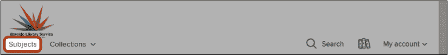

1.  这应该会显示出你可以浏览的主题列表，如惊悚、历史小说和技术等。根据图书馆的不同，主题列表可能会很长，所以你可能需要向下滚动才能看到所有选项。点击你想浏览的主题（例如，悬疑）。

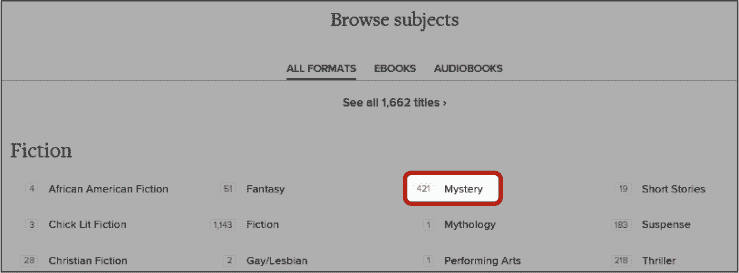

这应该会显示出该类别中所有可借的电子书列表，如下所示。

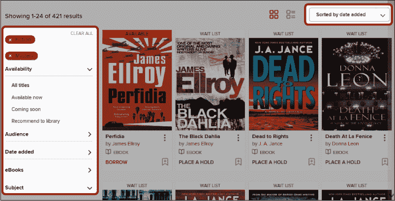

默认情况下，OverDrive 会按照添加日期对书籍进行排序。你可以将排序方式改为例如按**受欢迎程度**显示最受欢迎的书籍，方法是点击**按添加日期排序**，然后选择**受欢迎程度**，或者选择其他排序方式。你还可以使用左侧过滤栏中的选项来缩小结果范围。例如，点击**添加日期**，然后选择**过去 14 天**，仅查看最近两周内添加的书籍。注意，如果 OverDrive 窗口太小，这些选项可能会出现在一个名为“过滤器”的下拉菜单中，而不是在左侧。

点击你感兴趣的书籍，以查看更多信息。

#### 借阅一本书

点击一本书后，你应该会看到该书的描述页面，以及可能喜欢的相似书籍列表。如果这本书已经被借出，或者你决定不想借它，点击左下角的**返回按钮**，返回到你的搜索结果页面。不过要确保不要点击页面左上角的返回按钮，因为这会把你带回到选择图书馆的页面。

一旦找到你喜欢的书，就可以开始借阅它：

1.  要借阅这本书，请点击**借阅**按钮，如下所示。

    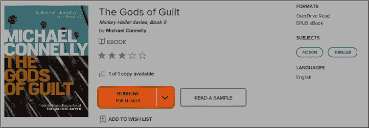

1.  你可能会注意到借阅按钮旁边有一个下拉箭头。有时，图书馆会提供将书籍借阅更长时间的选项，你可以点击下拉箭头选择你希望借阅的时长。

OverDrive 应该会在屏幕顶部显示一个橙色条，确认你已经借阅了这本书。

#### 下载一本书

既然你已经借了书，就需要下载它，以便在电脑上阅读。

1.  请注意，借书按钮现在显示为“前往借阅”。点击**前往借阅**，如下所示，以查看你的借阅页面。

    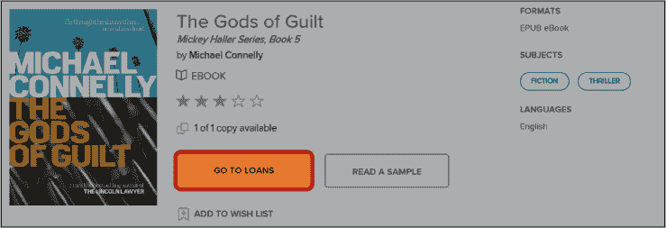

1.  现在你应该看到你的借阅页面，它列出了你从图书馆借阅的所有书籍。点击书名下方的**下载**按钮，如下所示，将电子书下载到你的电脑上。

    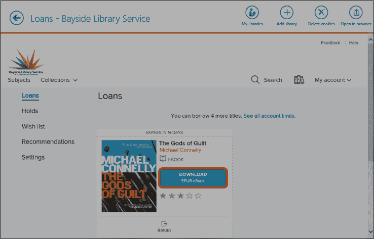

    ***** ***注意：** 有些书籍提供不同的下载选项，在这种情况下，你的下载按钮旁边会有一个下拉箭头。如果是这种情况，点击**下拉箭头**，然后从选项列表中选择**ePUB 电子书**。*

1.  系统会询问你是否希望前往你的 OverDrive 书架，或者继续浏览其他书籍以借阅。点击**前往书架**。

你应该能在“书架”标题下看到你刚借的书籍，如下所示。你可以随时通过点击页面左上角的**返回按钮**来访问你的书架。

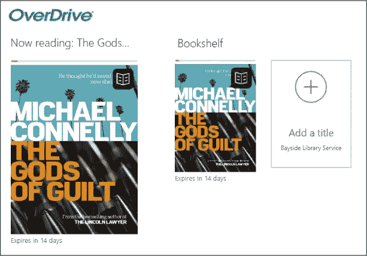

**活动 #24**

在此活动中，你将练习浏览电子书类别并借阅一本书。

1.  使用浏览功能定位到你喜欢类别中的书籍。

1.  借阅你找到的书籍。

1.  将书籍下载到你的电脑。

### 阅读书籍

现在你已经借了书，接下来就是阅读它的时候了！按照以下步骤阅读你借阅的书籍：

1.  从你的书架上，点击你想阅读的书籍。

    ***** ***注意：** 如果你还没有借书，你的书架将会显示为空，你需要点击**添加书名**，并使用前面介绍的方法查找、借阅并下载一本书后才能继续。*

1.  这应该会在你的电脑上打开书本。就像纸质书一样，你将首先看到封面和前言页面。你可以通过点击页面的最左边或最右边来翻动页面，也可以使用键盘上的左右箭头键在页面间移动。

#### 更改字体大小

如果你觉得字体太小，难以清晰阅读，你可以调整字体大小使其变大。按照以下步骤使文本变大（或变小）：

1.  点击屏幕中间。这将显示窗口顶部和底部的多种选项。

1.  点击**设置**按钮，如下图所示。

    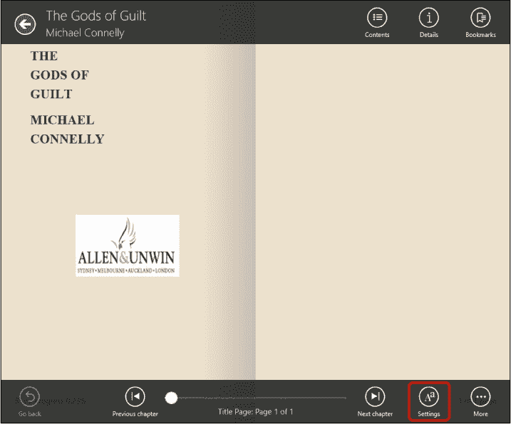

1.  这将打开页面右侧的设置界面。

1.  点击“字体大小”下方的下拉框，选择一个较大或较小的字体。你应该能看到页面上的文本大小发生变化。

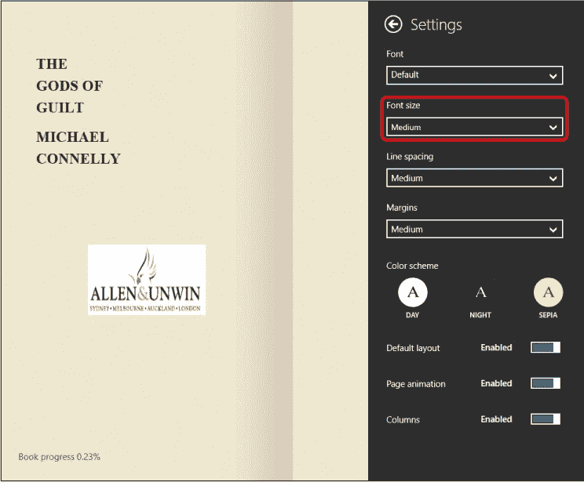

你可能会发现其他一些设置也很有用。特别是“配色方案”选项可以让你更改书本的页面颜色和文本颜色。更改设置后，要返回到书本页面，点击书页的任意地方。

#### 关闭书籍

在你阅读完书籍后，可以轻松返回到 OverDrive 的主页：

1.  点击页面中间。

1.  点击页面左上角的**返回按钮**。

系统会将你带回到 OverDrive 的主页，并自动为你标记上书本中的位置。这意味着当你再次打开这本书时，系统会带你回到你上次阅读的页面。

#### 归还书籍

一旦你借书的时间超过图书馆允许的最长借阅时长，OverDrive 会自动归还你的书籍。大多数图书馆还会限制一次借阅的书籍数量。这意味着，你可能需要归还已阅读完的书籍，以便借更多的书籍。

要归还一本书，按照以下步骤操作：

1.  打开你的书架。

1.  点击你想归还的书籍，然后点击书本中间。这应该会弹出你在调整字体大小时看到的相同选项。

1.  点击右下角的**更多**按钮，然后在出现的列表中点击**删除/归还**。

1.  系统会要求你确认是否要归还这本书。点击下面高亮显示的**删除并归还**按钮。

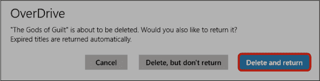

**活动 #25**

在本活动中，你将练习从 OverDrive 阅读电子书。

1.  打开你在活动 #24 中借的书。

1.  调整字体大小，以便轻松阅读书籍。

1.  阅读你借的书的前几页。

1.  归还你刚刚阅读的书籍。

### 探索：有声书

一些图书馆通过提供大量有声书来补充其电子书馆藏。在 OverDrive 中，有声书的列表会在作者名下显示 *audiobook*（有声书）字样，而不是 *ebook*（电子书）。你可以像借阅电子书一样借阅并下载有声书，它们会与任何你借的电子书一起出现在你的书架中。只要你的电脑连接了扬声器或耳机，你就可以通过点击书架中的有声书来听它。

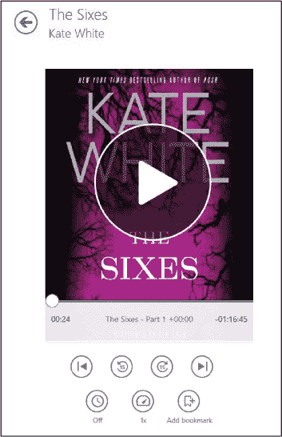

### 呼，成功了！

在本课程中，我们介绍了如何使用 OverDrive 应用免费在线阅读书籍。你学会了如何完成以下操作：

*****   在 OverDrive 上浏览和搜索书籍

*****   使用 OverDrive 从本地图书馆借阅电子书

*****   在电脑上下载并阅读电子书

*****   在 OverDrive 上归还电子书

在下一课中，你将学习如何使用免费的 Skype 应用与朋友和家人保持联系。

**课程回顾**

恭喜！你已经完成了第 10 课。利用这个机会，通过完成以下任务复习这一课。如果你能自信地完成这些任务，那么你已经准备好迎接第 11 课了。如果没有，不要灰心，继续练习！

1.  使用 OverDrive 搜索你喜欢的书籍。

1.  浏览你喜欢的书籍类型并借一本你喜欢的书。

1.  阅读并归还你刚刚借的书。
