## 课时 11

## 使用 Skype 拨打电话

欢迎使用 Skype！Skype 应用让你可以通过视频实时与朋友和家人通话，您可以从世界任何地方免费看到和听到他们。

什么是 Skype？

使用 Skype 需要什么？

设置 Skype

添加个人资料图片

将朋友添加为 Skype 联系人

接受联系人请求

让我们开始打电话吧！

语音通话

视频通话

接听电话

发送文字消息

发送笑脸和表情符号

删除 Skype 联系人

使用 Skype 保持安全

呼，完成了！

### 什么是 Skype？

Skype 是一个通讯应用，能让你和朋友及家人进行视频或语音通话。它已预装在你的 Windows 10 电脑上，且免费使用。它类似于电话，但有两个巨大的优点：你能看到你通话的人，而且你可以发送文字消息。例如，你可以发送生日祝福、安排午餐会，甚至计划在某个时间进行视频通话。

为了让 Skype 正常工作，你和你想联系的人都需要在电脑上安装 Skype 应用。幸运的是，所有使用最新版本 Windows 10 的人都会预装 Skype 应用。全球有数百万人使用 Skype，因此它是一个非常知名的应用，而且因为它是免费的，很多人都可以轻松获得或已经拥有它。

要与 Skype 上的人通话，你首先需要将他们添加为联系人，他们也需要添加你；这有助于保护 Skype 用户免受不需要的电话、陌生人来电或诈骗。

让我们开始吧！

### 使用 Skype 需要什么？

Skype 通过互联网运行，因此你必须有互联网连接才能拨打电话或发送消息。要拨打电话，你还需要扬声器和麦克风，如果你想在通话中使用视频，还需要一个*网络摄像头*（电脑用的摄像头）。所有的笔记本电脑和平板电脑都会内建这些设备，如果你没有为台式电脑配备扬声器、麦克风和摄像头，它们可以很容易地在本地的电脑或电子商店购买。

### 设置 Skype

让我们打开 Skype，看看它是什么样的。Skype 已经安装在你的电脑上，你可以像在前面课程中打开应用一样，从开始菜单打开它。

1.  点击屏幕左下角的**开始按钮**，然后输入**skype**。

1.  点击出现的列表中的**Skype**。

    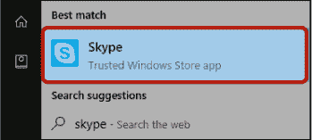

1.  如果这是你第一次在电脑上使用 Skype，你可能会被要求登录。输入你的 Microsoft 账户（即你在“设置你的电脑”第 17 页上创建的账户），然后点击**下一步**，如下所示。

    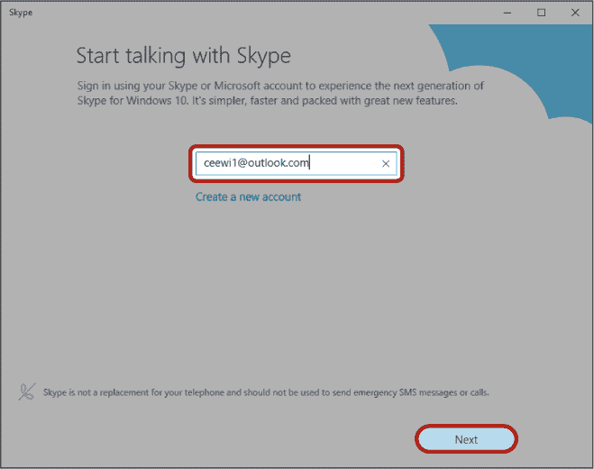

1.  然后，你会被要求输入密码。这是你用来登录电脑的相同密码。请输入密码到密码框中并点击**登录**。

    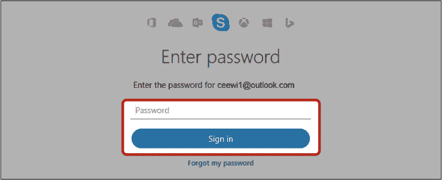

1.  如果你还没有提供你的姓名给 Microsoft，可能会要求你现在输入。这样有助于其他人在 Skype 上识别你，而且是完全安全的。请按照示例中的方式在**名字**和**姓氏**框中输入你的名字，然后点击**下一步**按钮。

    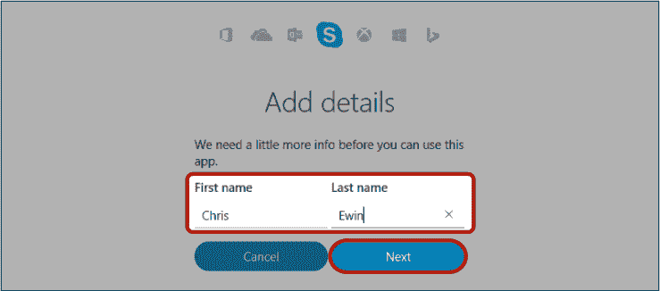

1.  你可能会被要求添加朋友和家人作为联系人。我们稍后会学习如何操作，所以现在点击**稍后再说**按钮。

    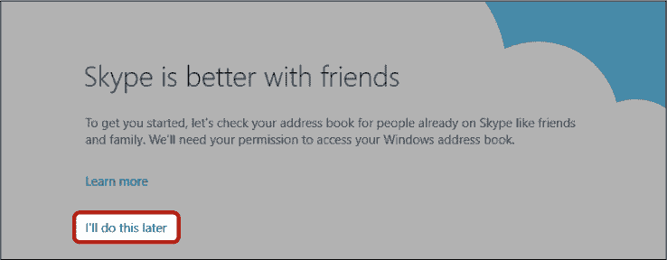

1.  你也可能被要求将你的电话号码添加到 Skype。这将允许知道你电话号码的人通过这个号码在 Skype 上找到你，但不用担心——你的号码不会对公众可见。如果你希望别人能够通过这个方式找到你，请输入你的号码并点击**下一步**。如果你不想提供这个信息，它是可选的，你可以直接点击**稍后再说**。

    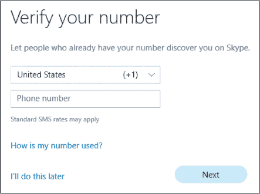

1.  最后，系统会告诉你 Skype 已经设置好了。点击**完成**开始使用 Skype。

现在你应该能看到主界面的 Skype，界面大致如下：

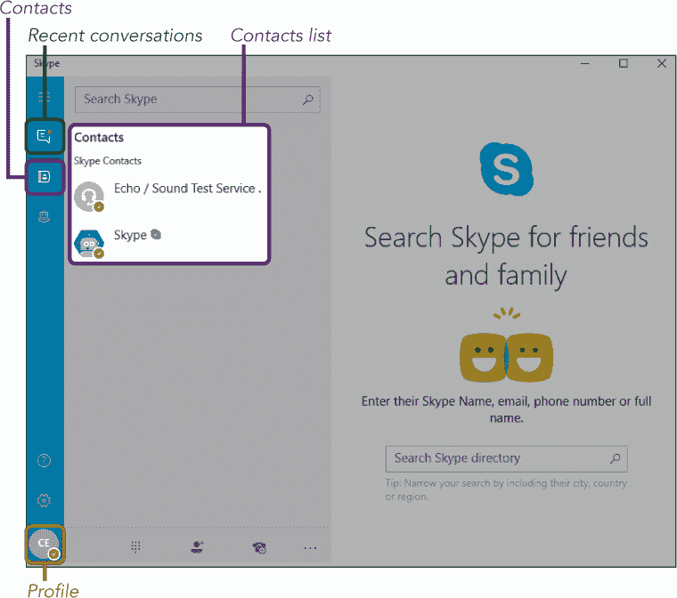

*****   **联系人：** 这个按钮会打开你的联系人列表。你将在本课的后面学习如何添加 Skype 联系人。

*****   **最近的对话：** 这个按钮会打开你最近的消息和通话列表。

*****   **个人资料：** 屏幕左下角带有你姓名首字母的圆形图标是个人资料按钮。点击此按钮可以打开个人资料页面，显示更多关于你账户的信息。

接下来，我们来仔细看看如何定制你的个人资料。

#### **添加个人资料图片**

在开始拨打电话之前，添加一张个人资料图片是个好主意。这张小图片会出现在别人尝试查找你并将你添加为 Skype 联系人时。添加你自己的照片可以帮助朋友和家人更容易地找到真正的你。如果你不愿意添加自己的照片，也可以选择添加一张与你的兴趣或爱好相关的图片。例如，你可以使用一张你的狗的照片！

要添加个人资料图片，请按照以下步骤操作：

1.  点击**个人资料按钮**。

1.  这将显示你的个人资料页面，您可以在此处添加其他人可以看到的个人信息。要使用摄像头拍摄照片并将其设置为你的头像，点击你名字首字母下方的小**相机图标**，如下所示。

    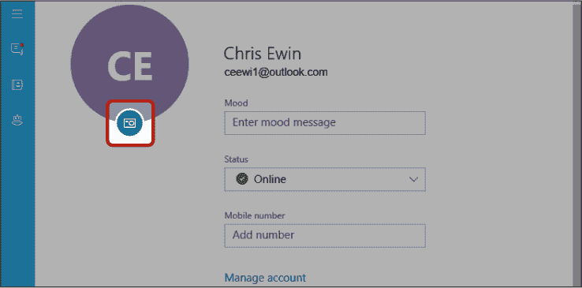

1.  你的摄像头将会开启，所以你现在应该能看到来自摄像头的画面。如果这是你第一次使用摄像头，系统可能会要求你允许 Skype 使用摄像头。这是完全安全的，所以点击**允许**继续。调整你的摄像头或自己，使你处于画面的中央。当你对拍摄效果满意时，点击下方突出显示的**相机图标**来捕捉图像。

    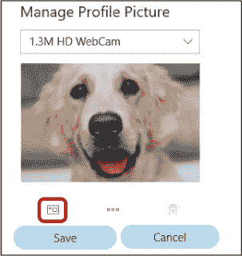

    如果你喜欢这张照片，点击**保存**按钮。否则，点击**垃圾桶图标**删除照片，然后再点击**相机图标**拍一张新的照片。

1.  你也可以点击相机和垃圾桶图标之间的三个点，从你的电脑中选择一张图片作为你的个人资料照片，而不是用摄像头拍摄。

现在你应该能看到你的头像出现在个人资料按钮的位置，代替了原来的首字母，像这样：

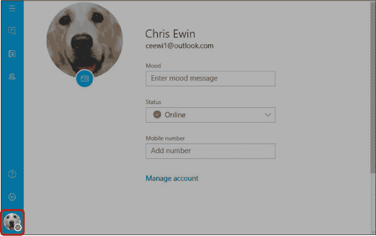

#### **添加好友为 Skype 联系人**

要联系某人，你需要先将他们添加为联系人。你可以请求朋友或家人成为你的联系人，然后他们必须接受你的请求，才能与你通话或发送消息。如果你之前将联系人添加到电子邮件通讯录中，你可能会看到他们也出现在 Skype 中。如果发生这种情况，不必惊慌。

有些人设置了他们的帐户，使得任何人都可以在不将他们添加为联系人之前打电话给他们，但无论如何，在打电话之前将某人添加为联系人是礼貌的。一旦他们被添加，他们将出现在你的联系人列表中，这将使将来与你们的交流变得更加方便。

你可以通过搜索他们的姓名、电子邮件地址或手机号码来添加联系人（如果他们选择提供了）。通过电子邮件地址搜索通常更准确，因为电子邮件地址必须是唯一的，而许多人可能有相同的名字。但如果你不知道某人的电子邮件地址，你可以通过他们的名字进行搜索，并通过他们的个人资料照片来辨认他们。或者，如果你的联系人有一个在微软收购 Skype 之前创建的帐户，他们可能有一个不同的用户名，称为*Skype 名称*，你也可以用这个来找到他们。

下面是如何将某人添加为联系人：

1.  点击屏幕左侧的**联系人按钮**。

    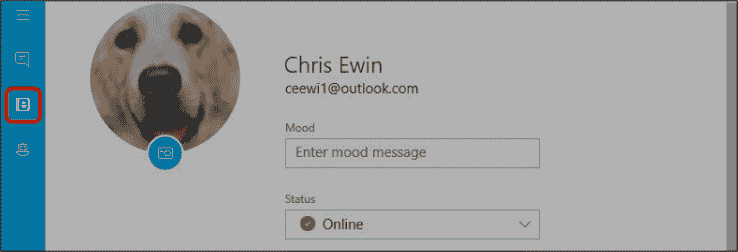

1.  点击页面顶部的**搜索 Skype**框，如下图所示，输入使用 Skype 的朋友或家人的姓名、电话号码或电子邮件地址。

    

1.  匹配的联系人及其头像应该会自动显示在搜索框下方。如果此人公开了他们的位置，你可以在他们的名字下看到。如果你与此人有共同的联系人，你会在他们的名字下看到这一信息。*共同联系人*是你和其他 Skype 用户共同拥有的联系人。这是非常有用的信息，因为你更可能认识与你共享联系人的人。

    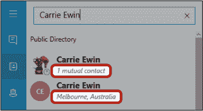

1.  找到你要寻找的人并点击他们的名字。

1.  点击页面右侧的**添加到联系人**按钮。

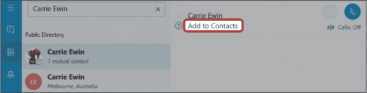

你添加的人应该会出现在你的联系人列表中，即使他们还没有接受你的联系请求。此人头像上会出现一个小灰色问号，接下来会被高亮显示，表示你的请求尚未被接受。当这个问号消失时，意味着他们已接受你的请求，你就可以给他们打电话了。

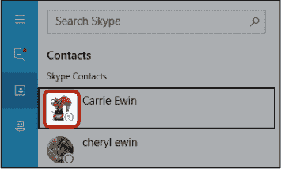

**活动 #26**

在这个活动中，你将练习将某人添加到你的联系人列表中。尝试将一两个使用 Skype 的朋友添加到你的联系人列表中。

#### **接受联系请求**

如果有人将你添加为联系人，你可以选择接受联系请求并进行沟通，或者拒绝请求。如果你拒绝请求，不用担心——他们不会收到通知！

如果你收到了联系请求，屏幕左侧的**最近的对话**按钮旁边会出现一个小红点。这表示你有未回复的消息或请求。你还会在屏幕右下角看到一个弹出框，告诉你有新消息，尽管它会在几秒钟后消失。下图展示了这两种通知。

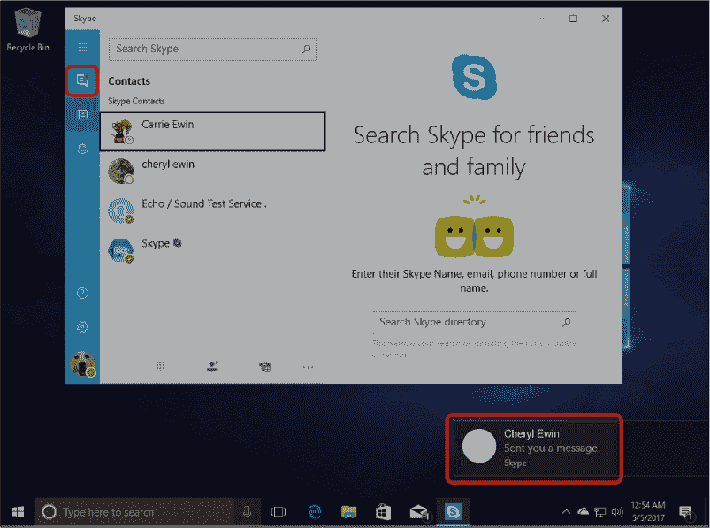

要回答联系请求，请按照以下步骤操作：

1.  点击**最近的对话按钮**，此按钮现在会显示一个小红点，用来查看任何未回复的消息。

1.  在这个例子中，Cheryl Ewin 给我发送了一条消息。

    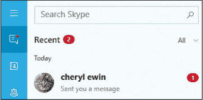

1.  点击发送联系请求的人的名字。

1.  这会显示他们的消息，并给你选择接受或拒绝请求的选项。

    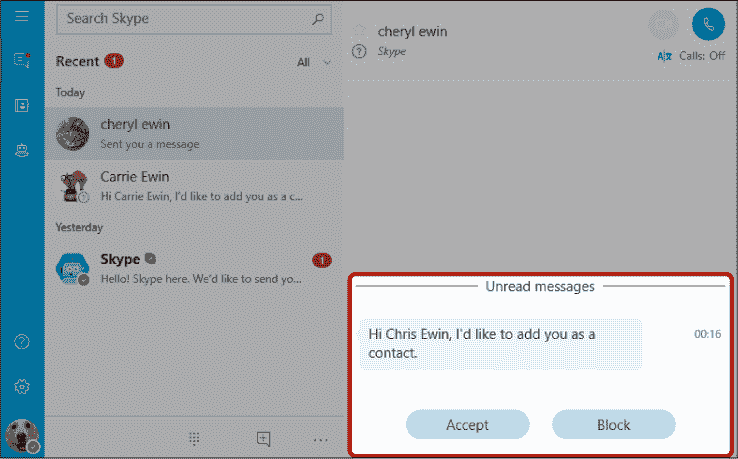

1.  点击**接受**按钮。如果你不希望此人通过 Skype 联系你，可以点击**屏蔽**按钮。这样将阻止他们将来联系你。

如果你接受请求，之前显示“接受”和“屏蔽”按钮的区域将会改变，允许你向此人发送消息。

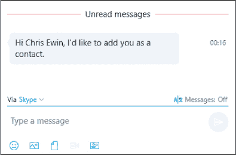

**活动 #27**

在这个活动中，你将接受一个联系请求：

1.  请让朋友在 Skype 上将你添加为联系人。

1.  当请求到达时，接受他们的联系请求。

### 让我们开始拨打电话吧！

一旦你将联系人添加到通讯录，你就可以开始拨打电话了。在这一节中，你将学习如何进行语音通话、视频通话以及发送书面消息给你的联系人。

#### **语音通话**

Skype 上的语音通话就像打电话一样：你可以听到对方的声音，但无法看到对方。我们来试试吧。

##### ***拨打语音电话***

要拨打仅包含音频（没有视频）的电话，请按照以下步骤操作：

1.  点击屏幕左侧的**联系人按钮**打开联系人列表。

1.  点击你想拨打电话的人的姓名。

1.  点击屏幕右上角的**拨打按钮**，如下面高亮显示的按钮。

当你拨打电话时，对方的屏幕上会弹出一个框，通知他们你正在呼叫。一旦他们接听，你将能听到对方的声音，他们也能听到你的声音！如果对方不在电脑前或未接听电话，你会看到“通话已结束”的提示。

##### ***语音通话界面***

如果通话已成功连接，你将看到如下所示的界面。

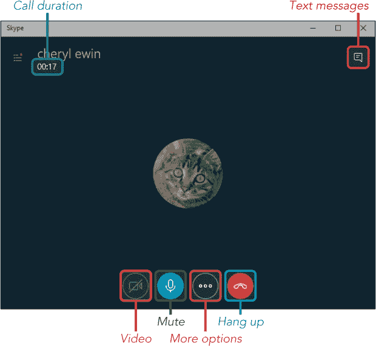

*****   **通话时长：** 这个显示框会告诉你通话的持续时间。

*****   **文本消息：** 这个选项允许你在通话时向联系人发送文本消息。如果你想发送一些难以准确表达的内容，比如一个长的网址，这个功能会非常有用。

*****   **视频：** 这个按钮可以打开和关闭你的摄像头，让你控制是否让别人看到你。它还将你的语音通话转换为视频通话，我们将在下一节中详细探讨。

*****   **静音：** 这个按钮可以关闭你的麦克风，防止对方听到你的声音，但你仍然可以听到对方的声音。如果你需要打喷嚏，可以使用这个功能！再次点击它可重新打开麦克风。

***** ***注意：** 如果你发现音量太低或太高，无法清楚地听到对方，你可以通过屏幕右下角系统托盘中的音量图标进行调整。要调整音量，点击**音量图标**  *然后调整滑块，直到音量合适为止。*

*****   **更多选项：** 这个选项可以让你访问一些其他功能，比如将第三人添加到通话中。我们在本书中不覆盖这个功能，但鼓励你自己探索。

*****   **挂断：** 这个按钮用于结束通话。

完成语音通话后，点击**挂断按钮**以返回到主 Skype 界面。

#### **视频通话**

视频通话让你不仅可以*看到*对方，还可以和对方交流——你需要在电脑上安装摄像头才能进行视频通话。需要注意的是，对方也能看到你！

1.  点击屏幕左侧的**联系人按钮**。

1.  点击你想拨打电话的人的姓名。

1.  点击屏幕右侧的**视频通话按钮**，如下面高亮显示的按钮。

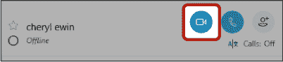

如果对方接听了你的电话，你将能够看到并听到对方，他们也会看到并听到你。你还会在屏幕的右下角看到你自己摄像头的画面缩略图。这样，如果需要，你可以调整你的摄像头（或头发！）。

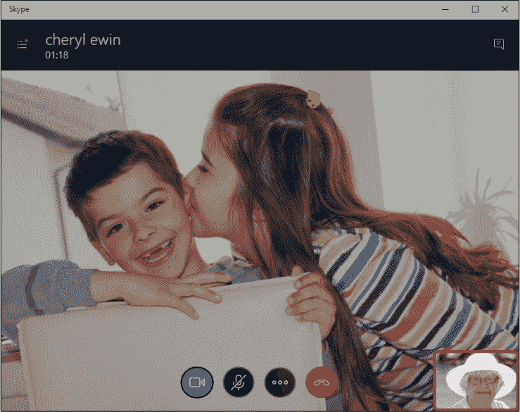

**活动 #28**

在这个活动中，你将练习进行视频通话。使用 Skype 向朋友发起视频通话。

#### **接听电话**

当然，你的朋友和家人也会想打电话给你！如果你接到电话，你会听到一声响铃（只要你打开了声音），并且屏幕上会弹出 Skype 消息。要接听电话，Skype 需要在你的电脑上设置，但你不需要正在使用它。这意味着你可以在玩游戏、上网、查看邮件或在电脑上做其他任何事情时，仍然能接收到 Skype 电话。

就像你可以选择仅用音频或视频呼叫某人一样，当朋友或家人呼叫你时，他们也可以做出这个选择。好消息是，你可以选择用音频或视频接听电话！这意味着你的联系人可以发起视频通话，而你可以选择仅用音频接听。你将享受通过视频看到他们的好处，同时只用音频接听。

这是如何接听电话的方法：

1.  当 Skype 消息告诉你有来电时，点击 **音频** 按钮以语音通话接听，或点击 **视频** 按钮以视频通话接听，如下图所示。

    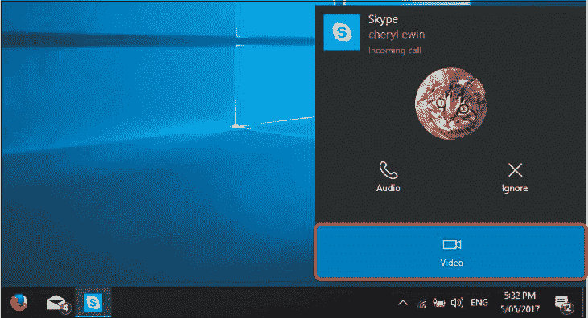

1.  然后你的电话将连接，你可以开始通话！

1.  当然，如果你很忙，你可以随时点击 **忽略** 按钮来拒接电话。

#### **发送文字信息**

当人们通过 Skype 发送消息时，通常是简短的文字消息，类似于手机上的短信。如果你想给不在线的人留言以便他们稍后回复，这种消息很方便发送。就像电话一样，Skype 上的文字消息完全免费。以下是如何发送消息：

1.  点击屏幕左侧的 **联系人按钮**。

1.  点击你希望发送消息的人的名字。

1.  点击右下角的 **输入信息** 框，如下图所示。

    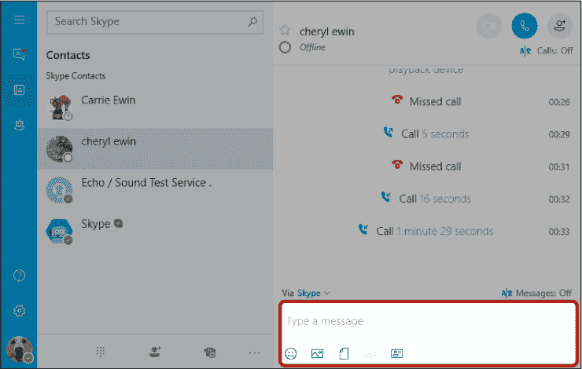

1.  输入你的信息，然后按 ENTER 键或点击右箭头的蓝色按钮发送信息。

    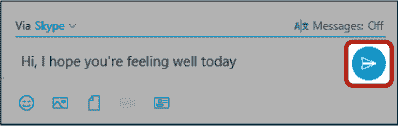

    你的信息现在应该会出现在屏幕右侧，如图所示。这个区域显示你与该联系人所有的消息和以前的 Skype 活动。当对方回复时，他们的消息也会出现在这里。

    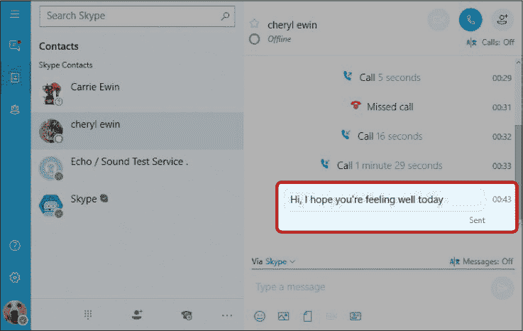

#### **发送表情符号和表情**

你还可以与书面消息一起发送笑脸或其他小图片，称为*表情符号*。这些可以很好地用来总结你对某人说的某件事的反应，或者只是为了增加一些乐趣！发送表情符号的步骤如下：

1.  点击下方消息框下方的**表情符号按钮**，如图所示。

    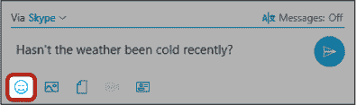

1.  一个表情符号的弹出框（如图所示）将出现。点击你喜欢的表情符号。

    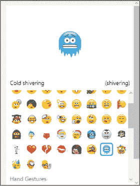

1.  表情符号将以文本的形式出现在你的消息框中，而不是图像，如下所示。例如，笑脸将显示为**:)**，而爱心则显示为**(heart)**。不过不用担心：当你发送消息时，它将显示为图片！

    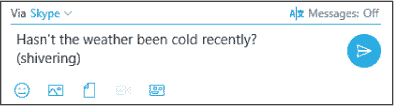

1.  按下 ENTER 键发送带有表情符号的消息。

    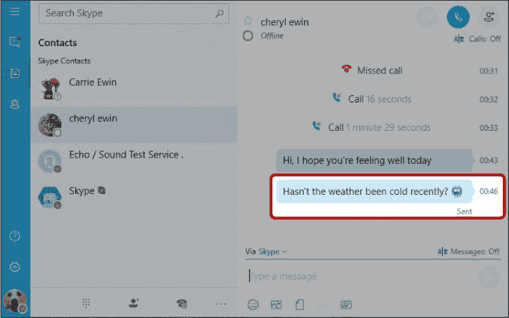

你现在应该能看到带有表情符号的消息：

你可以通过点击**最近对话**按钮查看别人发送给你的新消息。这个过程与接收联系人请求相同，如果你遇到困难，可以返回到“接受联系人请求”页面 227 查看。

**活动 #29**

在本活动中，你将练习向朋友发送书面消息。

1.  给你的朋友发送一条短信。

1.  一旦他们回复了，发送另一条消息。这次，包含一个表情符号。

### 删除 Skype 联系人

有时你可能想从联系人列表中删除某人——也许你添加了错误的人，或者你发现自己从未通过 Skype 与某个联系人互动。当你删除联系人时，对方不会收到通知，尽管如果他们懂 Skype，他们可能会注意到你的个人资料图片旁边出现灰色的问号，而不是你的实际状态，表示你不再是联系人。删除联系人，请按照以下步骤操作：

1.  点击**联系人按钮**，然后右键点击你想删除的联系人。

1.  一个小菜单会出现。点击**从联系人中删除**。

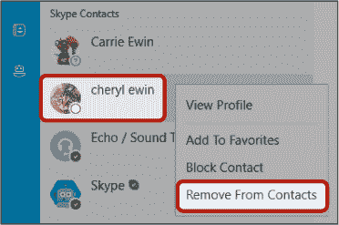

该联系人将从你的联系人列表中删除。你将无法联系他们，他们需要再次向你发送联系人请求，才能通过 Skype 与你交流。

### 使用 Skype 时保持安全

虽然 Skype 不像电子邮件那样容易受到安全威胁，但仍然有一些值得记住的小贴士，帮助你在使用 Skype 时保持安全：

*****   小心接受你不认识的人发送的联系人请求或回复他们的消息。他们可能是想诈骗你。

*****   如果联系人发送给你的链接没有任何讨论或解释，不要点击。你的联系人可能电脑上有病毒，正在发送这个链接。

### 呼，终于完成了！

在本课中，你学会了如何使用 Skype。你添加了联系人，进行了电话呼叫，发送了书面消息。在本课中，你学会了以下内容：

*****   在你的电脑上设置 Skype

*****   设置你的个人资料，包括添加个人头像

*****   将某人添加为 Skype 联系人

*****   进行一次语音通话

*****   进行一次视频通话

*****   发送书面信息，包括表情符号

*****   删除不需要的联系人

在下一课中，你将学习如何使用 WordPad 创建信件和文档。

**课程回顾**

恭喜！你已完成第 11 课。利用这个机会通过完成以下任务复习你学到的内容。如果你能自信地完成所有任务，那么你已经准备好进入第 12 课。如果没有，也不要灰心——继续练习吧！

1.  打开 Skype。

1.  搜索一个朋友并将其添加为 Skype 联系人。

1.  使用 Skype 给朋友打语音电话。

1.  使用 Skype 视频通话与另一位朋友联系。

1.  请朋友在预定的时间使用 Skype 联系你，并接听电话。

1.  使用 Skype 给朋友发送一条带有表情符号的书面信息。
