## 第 12 课

## 打字信件和文档

WordPad 是一个很棒的工具，你可以用它来创建各种类型的文档，如信件、邀请函，甚至海报。

为什么使用 WordPad？

会面 WordPad

输入你的第一份文档

修正文档中的错误

格式化你的文档

文本格式设置

段落格式设置

撤销错误

缩放视图

保存你的文档

打印你的文档

呼，终于完成了！

在本课中，你将学习如何输入文档，以及如何更改文本的颜色、大小和样式来定制你的文档。你还将学习如何保存文档，以便将来可以找到并再次编辑它，此外，你还将学会如何打印文档，以便得到文档的纸质副本，分发给你的朋友！

### 为什么使用 WordPad？

WordPad 可以帮助你创建各种不同类型的创意、吸引人、基本以及专业外观的文档，包括以下内容：

*****   信件

*****   报告

*****   邀请函

*****   海报

*****   卡片

*****   购物清单

WordPad 相比手写文档有许多优点。最重要的是，打字的信件更容易阅读（尤其是对年轻一代来说！），而且如果你犯了错误，可以简单地删除错误并重新输入，不会弄得一团糟。WordPad 还允许你更改文本的颜色、样式和大小，并且可以添加图片，使文档看起来更加专业，满足你的需求。你还可以保存文档，以便将来随时查看。

WordPad 可能是微软最被低估的秘密之一。这个有用的应用程序完全免费，且简单易用，用来写文档非常方便。虽然它没有像微软 Word 那样的全部功能，但它提供了简洁性。最重要的是，WordPad 是免费的，而 Microsoft Word 需要付费。WordPad 的所有功能也都出现在 Microsoft Word 中，因此如果你熟悉 WordPad，也能很容易上手 Microsoft Word。这意味着，WordPad 是一个很好的起点，如果你觉得需要更多功能，之后可以转向 Microsoft Word。

### 会面 WordPad

和其他应用程序一样，WordPad 可以使用之前课程中介绍的任何方法打开。要打开 WordPad，按照以下步骤操作：

1.  点击屏幕左下角的**开始按钮**，然后输入**wordpad**。

1.  从出现的列表中点击**WordPad**。

WordPad 会打开并自动创建一个新的空白文档。

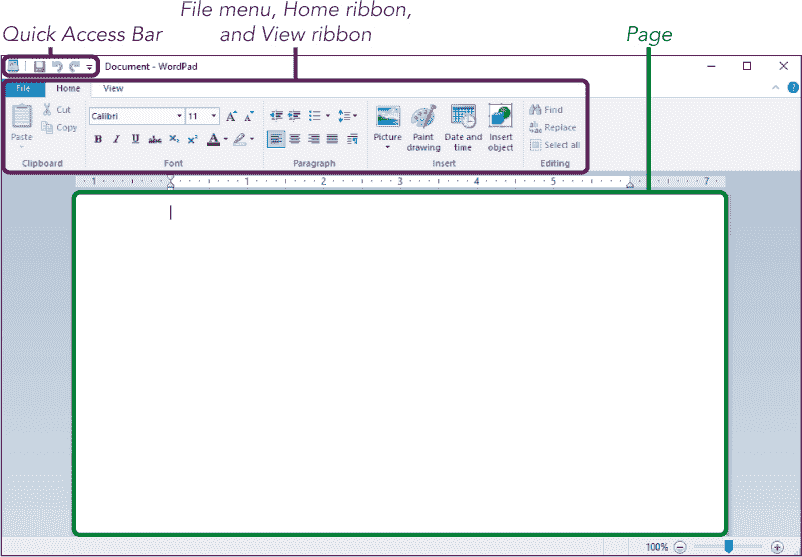

WordPad 有很多功能，因此熟悉各个功能的位置非常重要。工具和按钮显示在屏幕的顶部。它们被组织成文件菜单、快速访问栏以及包含主页工具和视图工具的两个功能区。让我们来看看 WordPad 的功能。

*****   **快速访问栏：** 快速访问栏提供了 WordPad 中最常用的工具。这些工具会永久显示在屏幕上。它们是你可以在其他功能区中找到的工具的快捷方式。默认情况下，快速访问栏包含可以让你快速保存文档、撤销刚才所做的错误操作，以及如果你决定该操作其实并不是错误，可以重新执行该操作的工具。

*****   **主页功能区：** 主页功能区包含了创建和更改文档外观所需的工具。包括用于更改文本大小、颜色、对齐方式和字体的工具，以及添加图片、绘图和日期的工具。

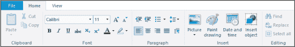

*****   **视图功能区：** 视图功能区包含了改变你*查看*文档方式的工具。例如，通过视图功能区，你可以缩放文档，使其看起来更大或更小。这不会影响文档中的任何文本，只是改变它在屏幕上的显示方式。

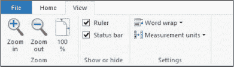

*****   **文件菜单：** 文件菜单以下拉菜单的形式出现在屏幕上。它包含了让你对整个文档进行操作的工具。例如，在你完成创建信件后，文件菜单将帮助你保存、打印或通过电子邮件发送信件。文件菜单还可以让你打开以前创建的文档、创建新文档，并了解更多关于 WordPad 的信息。

*****   **页面：** WordPad 为你提供了一张全新的白色“纸张”来进行写作。你可以在屏幕中央找到这张“纸”。

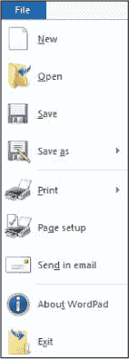

**活动 #30**

让我们看看你是否已经熟悉了 WordPad 的布局！在这个活动中，找到可以让你执行以下操作的工具。你不需要现在就能做到（你将在本课程的后面学到这些）。现在，只需看看你是否知道在哪里找到这些功能。

*****   更改文本的颜色。

*****   放大文档，使其显示得更大。

*****   打印你的文档。

*****   在文档中插入图片。

*****   撤销一个错误。

### 输入你的第一个文档

你已经打开了 WordPad，现在准备开始创建你的第一个文档！就像手写信件一样，你通过在页面上输入文字来开始文档。你应该能看到光标，这是页面上的一条小黑线，显示你输入的文字将出现在何处。

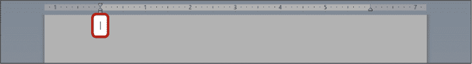

使用键盘上的任意字母键输入几个字母。如果你按住某个字母键，你应该会注意到它会在整行中重复，直到你松开它，接着它会移到下一行。这种自动跳到下一行的行为被称为*自动换行*，它是任何文字处理程序的标志。这意味着你可以专注于输入，WordPad 会在需要时将文本移到下一行。

**活动 #31**

在此活动中，你将练习在文档中输入内容。但首先，让我们从一张空白页面开始。如果你的屏幕上有任何文本，点击文本的末尾并按住退格键将其删除（请参阅“键盘”第 16 页的键位符号图）。

1.  输入句子**WordPad 是一个非常好的程序！！！**

1.  使用退格键删除除第一个感叹号外的所有字符。

### 修正文档中的错误

如果你想删除或添加文本，你需要将光标移动到文档中你想做更改的地方。假设你想在活动 #37 的句子中将“very good”改为“great”。按照以下步骤操作：

1.  点击文档中*good*一词后面。你应该看到光标跳到你点击的位置。你也可以使用键盘上的箭头键来移动光标。

1.  使用退格键删除*very good*这些词。

1.  输入单词**great**。

1.  点击句子的末尾，将光标放在那里并继续编写文档。

### 格式化你的文档

目前，你的文档看起来相当简单。我们希望通过更大的文本、五彩斑斓的词语、不同的文本样式以及更多的方式来使其更加生动！这就是所谓的*格式化*文档。

在你对文本应用任何格式化之前，必须先*高亮*它。这意味着选择文本，以便你可以格式化它。按照以下步骤高亮文本：

1.  点击你想选择的文本前面。

1.  按住左键并保持按住。

1.  将鼠标拖动到你想选择的文本的末尾。确保保持鼠标稳定；如果你拖得太远，可能会高亮整行。如果你高亮了错误的文本，可以点击文档中的其他地方释放高亮，然后再试一次。

1.  放开鼠标按钮。

例如，下面是如何高亮显示单词*great*：

1.  点击字母*g*前面。

1.  按住左键。

1.  将鼠标拖动到字母*t*的末尾。

1.  放开鼠标按钮。

高亮文本应该显示如下：

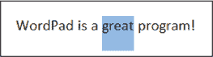

#### **文本格式化**

一旦文本被高亮显示，你可以更改其大小、颜色和样式。你将使用首页功能区上的字体框来应用这些文本格式化功能，接下来会高亮显示。

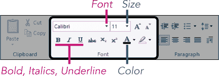

让我们看看这些工具的作用以及如何使用它们。

##### ***更改字体***

你的文本样式被称为*字体*。字体有很多不同的类型，从传统的*书法*风格到有趣的**粗体**风格。要更改文本的字体，请按照以下步骤操作：

1.  确保你已经选中了要格式化的文本（请参见前面的选择文本部分）。

1.  点击当前字体名称框中的箭头。

1.  从出现的列表中点击另一个字体名称。

只有你选中的文本会改变字体。

##### ***更改大小***

你的文本也可以变大或变小。再次选中一个单词或几个单词，然后按照以下步骤操作：

1.  点击当前字体大小旁边的箭头。

1.  点击不同的字体大小。较大的数字提供较大的字体大小。

##### ***更改颜色***

你还可以更改文本的颜色。为此，选中一个单词，然后按照以下步骤操作：

1.  点击所选颜色旁边的箭头。

1.  点击列表中出现的新颜色。

##### ***粗体、斜体和下划线***

粗体、斜体和下划线是强调特定单词或句子的三种常见方式。要使用它们，选中一些文本并点击以下按钮之一：

*****   **粗体** : 使文本变得**更粗**。

*****   **斜体**  **:** 使文本呈现*倾斜*效果。

*****   **下划线**  **:** 给选中的文本加上下划线。

在所有情况下，你可以重新选中文本，再次点击相同的按钮将文本恢复到正常格式。

**活动 #32**

在这个活动中，你将通过更改文本的大小和颜色来练习使用文本格式化工具。

1.  为*WordPad*这个单词添加下划线。记得先选中该单词。

1.  将整个句子的字体大小更改为 16。记得在选中文本之前，先通过点击屏幕的其他地方取消选择*WordPad*这个单词。

1.  将整个句子的字体颜色更改为蓝色。

#### **段落格式化**

段落格式化工具允许你调整整个段落的对齐方式。当你在现有段落末尾按下 ENTER 键时，新的段落就开始了。

1.  点击你想调整的段落中的任意位置。确保光标已经移动到段落内的某个地方。这次你不需要选中文本。

1.  段落格式化按钮位于主页功能区中的段落框中，如此处所示。

    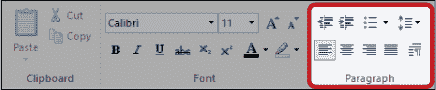

1.  点击这些按钮之一，将整个段落进行格式化。

你可以使用以下段落对齐按钮：

*****   **左对齐**  **:** 将文本对齐到页面的左侧。这是文档中文本的默认对齐方式。

*****   **居中对齐**  **:** 将文本对齐到页面的中央。

*****   **右对齐**  **:** 将文本对齐到页面的右侧。

***** **对齐**  **：**将文本像报纸排版一样从页面的左边对齐到右边，并自动调整间距，以便两边都整齐。如果你有至少一行完整的文本，它会像左右对齐一样工作，否则，它与左对齐相同！

你还会注意到段落框内的一些其他格式设置功能。我们这里不进行讲解，因为它们使用频率较低，但我们鼓励你自己探索这些功能。

**活动 #33**

在这个活动中，你将练习段落的定位。

1.  在文档的开头创建一个新段落。

1.  输入标题**我的第一个文档**。

1.  选中标题并将字体大小增加到 24。

1.  将标题居中。

1.  在标题下方开始一个新段落，并输入今天的日期。

1.  将日期右对齐。

### 撤销错误

*撤销*是一个非常有用的功能，可以让你在犯错时回到上一步。例如，如果你错误地斜体化了一个单词并想取消斜体，除了再次选中该单词并点击斜体按钮外，你还可以直接点击**撤销按钮**  在快速访问工具栏中。如果你不小心撤销了某个本应保留的操作，可以点击**重做按钮** 。

### 缩放

*缩放*让你放大屏幕上的文本，便于查看。它不会影响文档内文字的大小，只会改变文档在屏幕上的显示方式。要缩放，请按以下步骤操作：

1.  在页面右下角找到缩放滑块。

    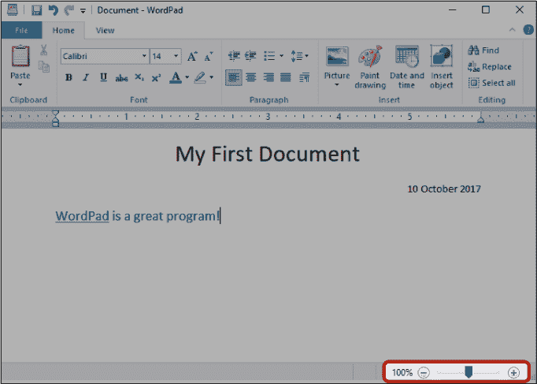

1.  点击按钮进行缩放。

1.  点击按钮进行缩小。

### 保存文档

*保存*文档可以让你以后再回来查看或继续编辑文档。要保存文档，请按照以下步骤操作：

1.  点击屏幕左上角的**文件**菜单。

1.  从出现的列表中点击**保存**按钮。如果这是你第一次保存文档，WordPad 会弹出下图所示的界面。你可以选择将文档保存在计算机上的位置，并为其命名。

    ***** ***注意：** 默认情况下，你的文档会保存在*文档*文件夹中。在第 13 课中，你将看到如何将文档保存到计算机上的其他位置，但现在，先将它保存在*文档*文件夹中，并专注于文件名。*

1.  点击**文件名**框。文本应该全部以蓝色高亮显示；如果没有，使用前面提到的点击并拖动鼠标的方法进行高亮。

1.  输入**我的第一个文档**作为文件名。这个名称可以帮助你以后找到这个文档。

1.  点击**保存**。

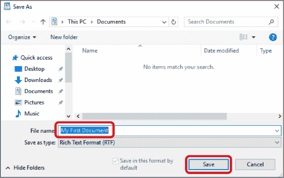

以后，当你点击保存按钮时，这个对话框将不会再次出现。WordPad 会记住你给文档命名的名称和保存的位置，并仅用最新版本替换旧版本。但你仍然需要记得首次保存文档——它不会自动保存！我们将在 第 13 课 中学习如何找到文档并重新打开它。

### 打印文档

打印文档需要安装打印机。如果你需要关于设置打印机的建议，请查看 “连接打印机、扫描仪、摄像头或其他设备”，它在 第 293 页。

打印文档，请按照以下步骤操作：

1.  点击屏幕左上角的 **文件** 菜单。

1.  从出现的菜单中点击 **打印** 按钮。这将打开打印对话框。

1.  确保在 **选择打印机** 标题下选择了正确的打印机。

1.  点击 **打印** 按钮。

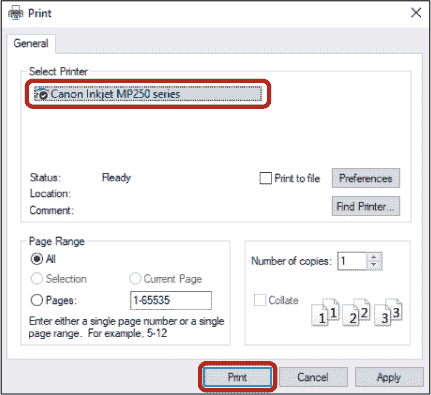

现在你的文档应该可以打印了。如果没有打印，检查打印机本身上的名称和型号，就像你在 第 3 课 中做的那样，并确保它与 **选择打印机** 区域中的信息匹配。

### 哇，我们做到了！

在本课程中，我们学习了如何使用 WordPad 创建文档。你学习了如何输入文档并格式化它，使其完全符合你的需求。在本课程中，你学习了如何完成以下操作：

*****   开始文本文档

*****   使用 WordPad 功能区

*****   格式化文本，包括更改其大小、颜色和字体

*****   将段落对齐到页面

*****   撤销错误

*****   放大或缩小文档

*****   保存文档

*****   打印文档

在下一个课程中，你将学习如何整理文件，以便你能轻松找到你的文档和图片。

**课程回顾**

恭喜你！你已经完成了 第 12 课。利用这个机会，通过完成以下任务来回顾你所学的内容。如果你能够自信地完成这些任务，那么你已经准备好学习 第 13 课了。如果没有，也不要灰心——继续输入吧！

1.  打开 WordPad。

1.  输入一份素食千层面的食谱。

1.  格式化文本，使食谱呈现出你想要的样式。

1.  将食谱保存到默认的 *文档* 文件夹。

1.  关闭文档。

1.  再次打开 WordPad。

1.  输入一份本周的待办事项清单，并在页面中间添加一个标题。

1.  将列表保存到 *文档* 文件夹。

1.  尝试一些按钮，看看如何将文档的文本格式化为列表。

1.  关闭文档。
