## 第 13 课

## 文件与文件夹

学习如何整理你的计算机！

探索文件资源管理器

打开文件夹

操作文件和文件夹

查看文件夹中的文件

打开文件

创建新文件夹

重命名文件或文件夹

删除文件或文件夹

恢复已删除的文件或文件夹

整理文件

将文件保存到文件夹中

将文件移动到文件夹中

关闭文件夹

搜索难以找到的文件

随时携带你的文件

探索：OneDrive 网站

呼，搞定了！

*文件*是保存在计算机上的一块信息。例如，每一封信件、文档、照片、歌曲和视频都被视为单独的文件。就像你将账单、CD 和信件存放在家中的某个地方一样，保存在计算机上的每个文件也都存储在一个文件夹中。文件夹的图标类似于文具店出售的文件夹，且它们的目的也类似。通常，最好将有某些共同点的文件一起存放在一个文件夹中，这样可以更方便地找到你想要的文件。

当你开始熟练操作电脑时，你会发现自己创建了更多的文件和文件夹。你需要一个简单的方式来记住*你将文件存储在哪里*以及*如何再次找到它们*。*文件管理*是组织你的文件，使它们可以轻松找到和恢复的艺术。

### 探索文件资源管理器

在整理文件时，你可以将计算机视为一个文件柜，里面包含了你保存的所有文件，这些文件都被组织到文件夹中。要定位一个文件，你需要打开柜子，找到正确的文件夹，然后找到正确的文件。简单吧！

要开始搜索，你必须打开文件资源管理器窗口。这是你开始浏览计算机中文件夹的地方。按照以下步骤打开文件资源管理器。

1.  单击桌面屏幕底部任务栏中的**文件资源管理器**图标，如图所示。如果你在任务栏中没有看到文件资源管理器图标，你可以通过点击开始按钮来访问它，左侧列表中会有文件资源管理器的图标。

    

1.  文件资源管理器窗口将会出现，显示**快速访问**文件夹。这个便捷的文件夹展示了你最常使用的文件夹。*快速访问*中的文件夹快捷方式如果长时间没有使用，会消失，以便只保留你最常用的文件夹。

    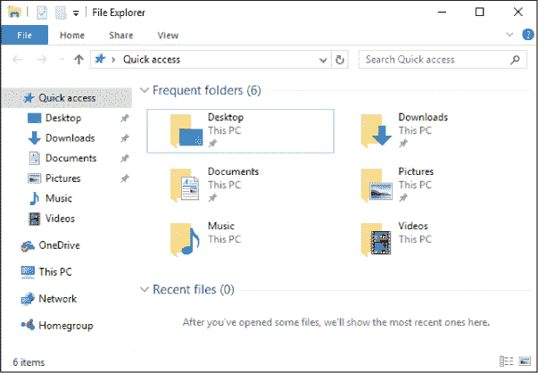

1.  要找到在*快速访问*中没有出现的其他文件夹，可以使用*此电脑*文件夹。要打开这个文件夹，只需从文件资源管理器窗口左侧的列表中点击**此电脑**，如下所示。这样就会打开存储在*此电脑*中的文件夹列表。

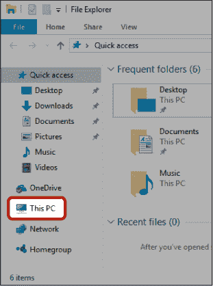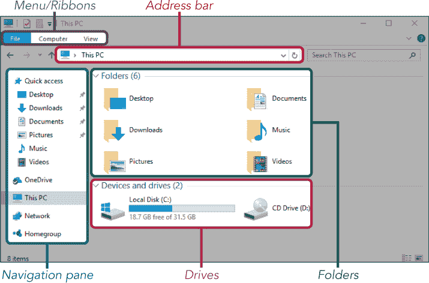

*****   **菜单/功能区：** 就像 WordPad 一样，文件夹中包含了一组有用的功能区，其中有一些最重要的按钮和工具。在*此电脑*文件夹内，你有一个计算机功能区和一个查看功能区。这些功能区的内容通常会隐藏以节省空间，你可以点击“计算机”或“查看”按钮来显示功能区。在本课中，我们将进一步了解这些功能区及其作用。

*****   **地址栏：** 这个栏位告诉你当前所在的文件夹。在这个例子中，我们在*此电脑*中。*图片*文件夹位于*此电脑*内。如果我们打开*图片*文件夹查看一些照片，地址栏会显示为此电脑 4 图片。这样我们就知道当前位于*图片*文件夹，它在*此电脑*内。地址栏可以帮助你避免迷路！

*****   **导航窗格：** 导航窗格出现在文件资源管理器窗口的左侧。这个侧边栏让你查看电脑上*所有*的文件夹或位置，而不仅仅是你常用的快捷文件夹。我们将在本课中进一步详细探讨导航窗格。

*****   **驱动器：** *驱动器*是存储设备的一种，里面存放着你的文件夹和文件。你的电脑很可能有*C:*驱动器，它是一个存储几乎所有内容的大驱动器。你还可以使用外部存储设备，比如 USB 闪存驱动器，插入电脑并在其中移动文件。这为你提供了文件传输的方式！我们将在本课后面讨论这个话题。

*****   **文件夹：** 你的 Windows 电脑将预设一些有用的文件夹，帮助你开始整理电脑。让我们认识一下这些文件夹：

*****   **桌面：** 这个文件夹显示你在桌面上保存的所有项目。

*****   **文档：** 你可以在这里存储文本文件。通常，这些文件是你在 WordPad 中创建的文档。可能包括信件、列表、报告、卡片、预算、发票或任何你想打字的内容。

*****   **下载：** 当你从互联网下载文档、照片或应用程序时，文件会自动放入下载文件夹。你可以将它们移动到其他文件夹，但默认情况下它们会首先出现在这里。

*****   **音乐：** 你可以将你所有喜爱的歌曲和有声书放入这个文件夹。

*****   **图片：** 你可以将你的照片和图像存储在这个文件夹中。

*****   **视频：** 你可以将所有的家庭视频或下载的视频放入这个文件夹。

### 打开文件夹

要查找存储在文件夹中的文件，你首先需要找到并*打开*那个文件夹。双击文件夹图标即可打开文件夹。

1.  选择你想要打开的文件夹。在这个示例中，我们将打开**图片**，如下所示。

    

1.  双击文件夹图标。

1.  文件夹会随之打开，你可以看到里面的文件和文件夹。记住，你可以使用地址栏来准确查看你打开了哪个文件夹。

随着时间的推移，你可能会发现自己在其他文件夹内创建了几十个文件夹，点击浏览找到你想要的文件夹可能需要一些时间。通过导航窗格打开文件夹可以快速打开*任何*文件夹，无论它深埋在哪个层级。虽然这稍微有点复杂，但绝对值得一试。按照以下步骤从导航窗格打开文件夹：

1.  如果文件资源管理器窗口还没有打开，请打开它。记住，导航窗格位于窗口的左侧。

1.  将鼠标悬停在导航窗格中的任何文件夹上，文件夹左侧应出现一个小三角图标。这表示该文件夹内还有其他文件夹。(一个包含在另一个文件夹中的文件夹叫做*子文件夹*。)

    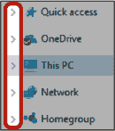

1.  点击文件夹旁的小三角图标——在这个例子中，是点击*此电脑*旁边的图标——里面的文件夹列表将会出现，如下所示。你可能会注意到，子文件夹并不是整齐地排在下面，而是略微偏向右边。这是一种快速且直观的方式来显示它们是子文件夹。

    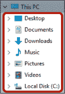

1.  要打开文件夹，只需在出现的列表中点击一次文件夹的图标。

    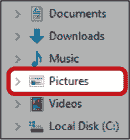

1.  文件夹会随之打开。打开文件夹后，三角图标将变为指向下方。点击该图标可以关闭文件夹，所有子文件夹也将从视图中消失。

恭喜！你现在可以打开并查看计算机上的任何文件夹了。

**活动 #34**

在这个练习中，你将练习使用文件资源管理器查找文件。

1.  返回到*此电脑*。

1.  打开*文档*文件夹。

你应该能看到我们在第 12 课中创建的文件*我的第一个文档*。

### 使用文件和文件夹

一旦你打开了文件夹，你需要能够查看并打开里面的文件。

#### **查看文件夹内的文件**

你文件夹中的文件图标可能显示为小图片，可能会很难看清楚。你可以更改文件夹视图，使图标变得更大或更小，有时还会显示文档或图片的预览。要更改视图，按照以下步骤操作：

1.  确保你已经打开了一个文件夹。

1.  点击文件资源管理器窗口顶部的**查看**。这将打开查看功能区。

1.  查看选项将随之出现，如下所示。

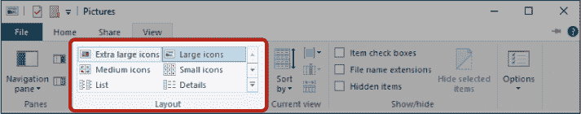

让我们来探索这些选项：

***** **超大图标、大图标和中等图标：** 这些视图提供三种不同大小的图标。对于照片和图片，这些视图会提供图片的预览。

***** **小图标和列表：** 这些视图使图标看起来更小，但也有助于将更多文件显示在屏幕上。照片和视频显示的是通用图标，而不是图片的预览。如果你想快速浏览长列表，这种方式非常理想。

***** **详细信息：** 这种视图会显示有关你的文件的更多信息，例如文件创建的日期以及文件类型。如果你需要更多的信息来查找特定的文件，这非常有用。

#### **打开文件**

一旦你找到了需要的文件，你就想要打开它们。这样，你可以检查内容，继续处理它们，或者分享它们。

1.  打开一个包含有用文件的文件夹。在这个示例中，我们将打开*文档*文件夹，它位于*此电脑*中。

    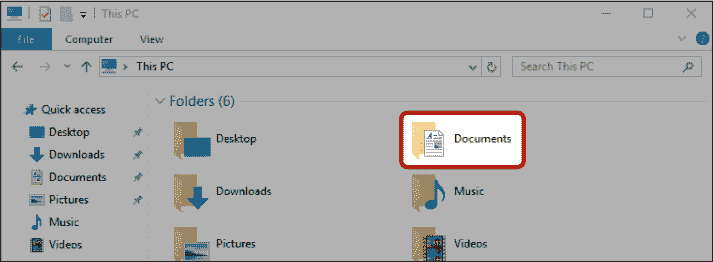

1.  找到你想要查看或打开的文件，例如接下来高亮显示的*我的第一个文档*。

    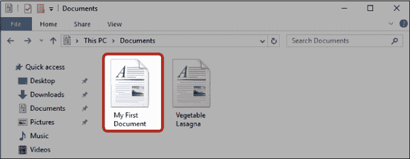

1.  双击文件图标以打开文件。

#### **创建新文件夹**

现在，为了真正整理文件，你将学习如何创建全新的文件夹，用于存放新文档、照片、歌曲、视频等。记住，你的计算机已经有了一些实用的文件夹来存放这些类型的文件：*文档、图片、音乐*和*视频*。我们不需要重新发明轮子，因此我们将仅在这些现有的文件夹内创建新文件夹，进一步帮助我们整理文件。

例如，假设你是一个热衷烹饪的人，拥有一整套食谱。由于你有条理，你希望将食谱根据菜肴类型分类存放成不同的文件夹。这样，当你想做你著名的巧克力蛋糕时，你可以轻松地取出食谱。在以下示例中，你将创建一个名为*蛋糕食谱*的文件夹。

1.  打开你想要在其中创建新文件夹的文件夹。在我们的示例中，我们将在*文档*文件夹内创建*蛋糕食谱*文件夹，因此请继续打开**文档**文件夹。

    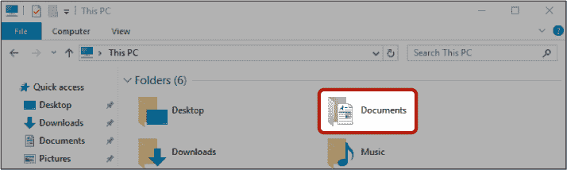

1.  进入*文档*文件夹后，点击**主页**功能区，该区域接下来会被高亮显示。

    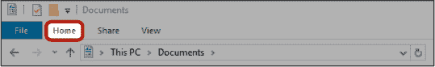

1.  点击**新建文件夹**按钮，该按钮位于“主页”功能区内。

    

1.  一个名为“新建文件夹”的新文件夹将出现，名字显得有些单调。

    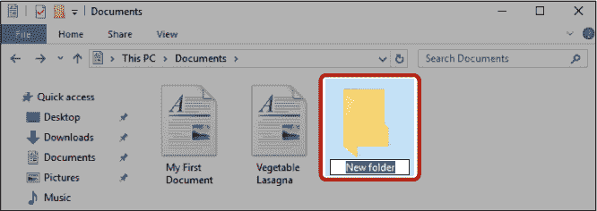

1.  文件夹的名称应该是蓝色高亮显示，表示你可以开始输入新的名称。如果你不小心点击了名称的其他地方，文本将不再被高亮显示。此时，你可以将光标移动到名称的末尾，按下退格键直到所有字母被删除，然后开始输入新的名称。

    ***** ***注意：** 如果你不小心在屏幕上点击了其他地方，无法看到文件夹名称中的光标，请参见第 268 页的 “重命名文件或文件夹” 以获取更多帮助。*

1.  输入新名称**Cake Recipes**。

    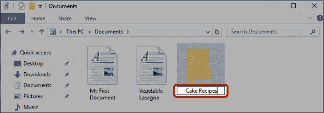

1.  按回车键。

你的新文件夹已经创建完成！

#### **重命名文件或文件夹**

即使文件已经创建，你也可以重命名它。例如，如果你拼写错误或发现名称不清晰，你可能需要重命名文件。你可以用与重命名文件完全相同的方法重命名文件夹。

1.  点击你想重命名的文件或文件夹。

1.  点击**主页**功能区。

1.  点击**重命名**，如下所示。

    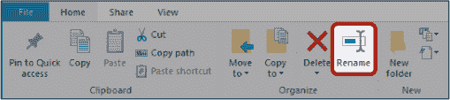

1.  现在文件或文件夹的名称应该已被高亮显示为蓝色。

1.  输入新名称并按回车键。

文件或文件夹现在将被重命名！

#### **删除文件或文件夹**

删除文件将其移动到回收站，帮助你保持计算机的整洁。你可以像删除文件一样删除文件夹。然而，如果你删除一个文件夹，文件夹中的所有文件也会被删除。

1.  点击你想删除的文件或文件夹。

1.  点击**主页**功能区。

1.  点击**删除**，如下所示。

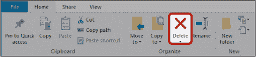

文件或文件夹现在将被移动到回收站。

#### **恢复已删除的文件或文件夹**

如果你不小心删除了文件或文件夹，或者决定需要恢复它，你可以去回收站恢复它。

1.  从桌面打开**回收站**——你可以通过最小化或关闭所有打开的文件、文件夹和应用来返回桌面。

    

1.  找到你删除的文件或文件夹（如果你删除了很多项，可能需要滚动一下），然后点击它。

1.  点击**管理**功能区，然后点击**恢复所选项目**。

你的文件或文件夹将返回你删除它的文件夹！

**活动 #35**

在这个活动中，你将练习使用文件资源管理器创建、重命名、删除和恢复文件夹。

1.  打开*文档*文件夹。

1.  创建一个名为*Curry Recipes*的新文件夹。

1.  将文件夹重命名为*Lasagna Recipes*。

1.  删除*Lasagna Recipes*文件夹。

1.  转到回收站并恢复该文件夹。

### 组织你的文件

现在你有一些文件和文件夹可以操作了，我们将看一些保持计算机整洁的方法。

#### **将文件保存到文件夹中**

保持整洁的最快方法是将文件直接保存到你想存储它的文件夹中。在这个例子中，我们将使用 WordPad 创建一个食谱，并将其直接保存到食谱文件夹中。

1.  打开 WordPad。记住，你可以通过点击开始按钮并键入**WordPad**来打开 WordPad。

1.  输入一个简短的巧克力蛋糕食谱。

1.  点击屏幕左上角的**文件**菜单。从出现的列表中点击**保存**按钮。这将弹出你在第 12 课中看到的“另存为”对话框。不过这次，你需要将食谱*直接*保存到*蛋糕食谱*文件夹中。

1.  打开**文档**文件夹。

1.  双击图标打开**Cake Recipes**文件夹。

    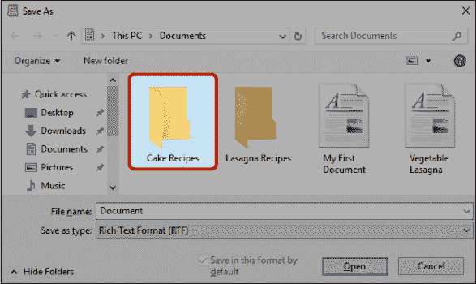

1.  你的食谱也需要一个名称，以便你可以轻松找到它。在文件名框中键入**巧克力蛋糕食谱**。

    

1.  点击**保存**。

恭喜！你的食谱已经保存到*蛋糕食谱*文件夹中。

**活动 #36**

在本活动中，你将练习在 WordPad 中创建文档，并直接将它们保存到文件夹中。

1.  打开 WordPad。

1.  输入一个苹果蛋糕食谱。

1.  将食谱保存为名为*苹果蛋糕*的文件，保存在*蛋糕食谱*文件夹中。

#### **将文件移动到文件夹中**

你可能已经保存了一些文件和图像，想要对它们进行整理。如果你没有直接将文件保存到你想要的文件夹中，现在还不晚！你仍然可以将零散的文件移动到有序的文件夹中；例如，你可以将一个蔬菜千层面食谱文件从*文档*文件夹中移动到名为*千层面食谱*的文件夹里。

***** ***注意：** 在接下来的部分，我们将使用在活动 #41 中创建的文件夹以及来自第 12 课的课后复习中的食谱。如果你跳过了这些活动，建议你现在回去完成它们。*

*剪切和粘贴*是将文件移动到文件夹中的一种非常好的方法。关键的概念是你先*剪切*文件，然后*粘贴*到另一个位置，移除原位置的文件。你可以将其想象成从报纸上剪下一篇文章并将其粘贴到剪贴本中。

1.  打开包含你要移动的文件的文件夹。在我们的示例中，这是*文档*文件夹。

1.  查找并点击文件。在我们的示例中，我们将选择*蔬菜千层面*。一旦你点击文件，文件将出现蓝色高亮显示。

    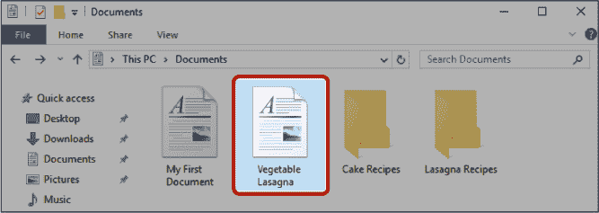

1.  点击**首页**功能区。

1.  点击接下来高亮显示的**剪切**按钮，看起来像一把剪刀。

    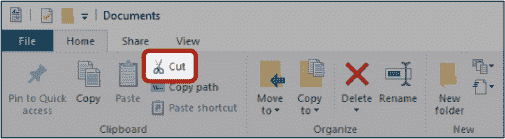

1.  请注意，文件被剪切后，它的图标会显示为淡出状态。这是剪切成功的标志！

1.  打开你想要将文件移动到的文件夹。在我们的示例中，我们将*蔬菜千层面*文件移到*千层面食谱*文件夹，所以我们会打开**千层面食谱**文件夹。

1.  在目标文件夹内，点击**首页**功能区，然后点击接下来高亮显示的**粘贴**按钮，看起来像一个剪贴板。

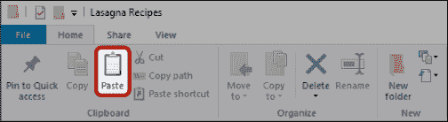

*蔬菜千层面*文件现在会出现在*千层面食谱*文件夹中！

**活动 #37**

在本活动中，你将练习使用剪切和粘贴的方法来移动计算机上的文件。

1.  打开 WordPad。

1.  创建一个*肉类千层面*文件。

1.  将食谱保存在*文档*文件夹中，然后关闭文档。

1.  打开*文档*文件夹。

1.  剪切*肉类千层面*文件并将其粘贴到*千层面食谱*文件夹中。

#### **关闭文件夹**

关闭文件夹的方式与关闭任何文档、应用程序或窗口相同。要关闭文件夹，点击文件夹右上角的**关闭按钮**。该窗口将消失。

### 查找难以找到的文件

了解文件和文件夹如何存储，可以让你对计算机有一种强大的掌控感！然而，你可能会发现你的文件丢失或遗忘，并且可能很难找到。搜索框是一个非常好的解决方案——它会在你计算机的所有区域中搜索与搜索词匹配的文件或文件夹。

1.  点击开始菜单旁边的**搜索**框，或者直接点击**开始按钮**。

1.  输入你正在搜索的文件或文件夹的名称。如果你在寻找一个文档但不记得名字，你可以搜索你知道文档中包含的某个词或短语。

1.  Windows 会提供一个匹配该搜索词的文件和文件夹列表，还包括应用程序，甚至是网页结果。文件会出现在列表的顶部，并且在文件名左侧会有一个彩色图标。所有在“Web”标题下的内容都会执行网页搜索。

1.  找到你的文件并点击它来打开丢失的文件。

### 携带文件

你保存的文件并不局限于你的计算机。你可以通过几种方式移动你的文件，包括像第 4 课中那样将文件作为附件通过电子邮件发送。你还可以将它们存储在一个小型便携存储设备——USB 闪存驱动器中，甚至存储在互联网上。将文件存储在计算机以外的地方有很多好理由：

*****   **携带文件：** 通常你会希望能够在其他计算机上访问你的文件。你可能想在度假时处理一个文档，或者在朋友和家人家里展示照片，甚至将你的照片交给商店进行专业打印。

*****   **备份：** 仅将文件存储在计算机上可能是危险的！例如，如果你是抢劫的受害者，你的计算机（以及你珍贵的文件）可能会被偷走，你将永远失去它们。你的计算机可能会损坏，或者可能会被病毒攻击，导致所有文件丢失。通过将文件存储在第二个位置，你可以放心地知道无论发生什么情况，你的文件都是安全的。

#### **将文件存储到 USB 闪存驱动器中**

一个*USB 闪存驱动器*是一个便携式的存储设备，具有足够的空间存储文件。它小巧到可以放进口袋，但又有足够的数字空间来存储数百或数千个文件。

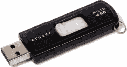

除了一些平板电脑外，你几乎可以将 USB 闪存驱动器插入任何类型的计算机*并且*它不需要连接互联网。所以无论你是去非洲还是南极洲，你的文件都可以通过 USB 闪存驱动器安全地随你旅行。

要将文件存储到 USB 闪存驱动器中，必须先将驱动器连接到计算机。一旦驱动器连接，你就可以像操作计算机中的任何其他文件夹一样打开它。要连接并打开 USB 闪存驱动器，按照以下步骤操作：

1.  在你的电脑上找到合适大小的连接口（或插孔！）（请参见下图）。连接口应该能够适配 USB 闪存驱动器，因此它将是矩形的，可能会有 USB 符号： 。

    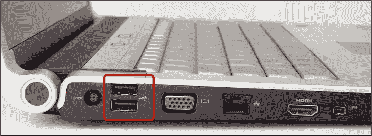

1.  将 USB 闪存驱动器（通常是银色的）连接器插入电脑上的正确接口。它只能以一种方式插入，所以如果你在连接时遇到问题，可能是插反了——或者你可能插错了接口！

1.  从任务栏或开始菜单中打开**文件资源管理器**。

1.  查看导航窗格，你应该能看到你的闪存驱动器，可以通过驱动器的品牌名称或者简单的“可移动磁盘”来识别它。无论它叫什么，都会是一个之前没有出现在你电脑上的新驱动器。

    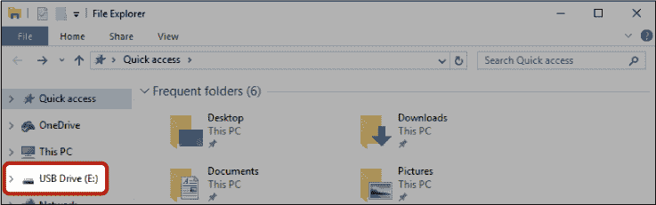

1.  点击 USB 闪存驱动器以在窗口中打开它。

1.  USB 闪存驱动器上的文件和文件夹将显示出来。如果你以前从未使用过该驱动器，它可能不包含任何文件，在这种情况下，它会显示“此文件夹为空”。

1.  双击一个文件或文件夹以打开 USB 闪存驱动器中的项目。你也可以像之前移动文件一样，将这些文件保存到你的电脑中。

你可以使用剪切和粘贴方法将文件移动到 USB 闪存驱动器上。通常最好在你的电脑上也保留文件的副本，以防丢失闪存驱动器时文件也丢失。你可以通过在移动文件时点击**复制**按钮，而不是**剪切**按钮来实现这一点。

**活动 #38**

这个活动将给你一个练习将文件和文件夹复制到 USB 闪存驱动器的机会。你可以像复制单个文件一样，复制整个文件夹。

1.  找到*Cake Recipes*文件夹。这个文件夹包含了你可能想带走的很多食谱。

1.  将文件夹复制并粘贴到 USB 闪存驱动器上。

1.  打开 USB 闪存驱动器文件夹。找到你添加到 USB 闪存驱动器上的*Cake Recipes*文件夹。

1.  打开*Cake Recipes*文件夹，查看里面的食谱。

1.  关闭 USB 闪存驱动器文件夹。

#### **使用 ONEDRIVE 远程存储文件**

OneDrive 是微软推出的一款极好的免费应用，它允许你将文件的副本存储在互联网上，这种存储方法被称为*云存储*。将文件存储在 OneDrive 中，允许你从世界任何地方访问它们（即使在度假时！）只要你有互联网连接，而且它提供了一个免受物理灾难或盗窃的保护存储空间。

OneDrive 将文件存储在互联网上，但通过将其显示为你电脑上的文件夹，应用让你的生活更加轻松。虽然文件实际存储在互联网上，但你仍然可以像访问其他文件夹一样，从你电脑上的 OneDrive 文件夹访问这些文件。真棒！

在使用 OneDrive 之前，你需要进行设置。幸运的是，这非常简单！按照以下步骤设置并打开 OneDrive 应用。

1.  点击系统托盘中的 OneDrive 图标，它看起来像一对云朵。

    

1.  如果你看不到 OneDrive 图标，请点击系统托盘中的显示隐藏图标箭头，如此处所示。然后你应该能在出现的框中看到该图标。

    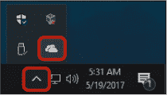

1.  如果出现消息通知你 OneDrive 是最新的，如此处所示，那么 OneDrive 已经在你的计算机上设置好。如果没有，按照屏幕上的说明设置 OneDrive。

    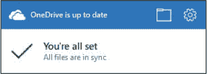

1.  打开**文件资源管理器**。

1.  在导航窗格中，点击**OneDrive**，如下面所示。

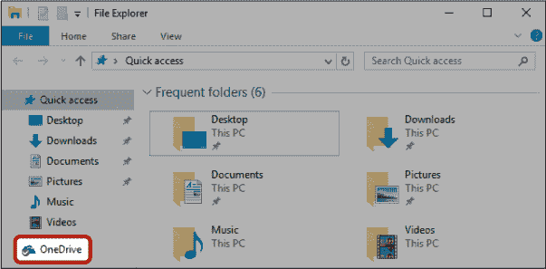

OneDrive 现在将作为文件资源管理器窗口打开！OneDrive 文件夹的工作方式与计算机上的其他文件夹完全相同。你可以使用复制和粘贴方法将文件移动到 OneDrive，OneDrive 中的文件也可以像其他文件一样打开。

### 探索：OneDrive 网站

OneDrive 网站让你可以从世界任何地方的计算机访问你放入 OneDrive 的文件！要访问 OneDrive 网站，请打开**Microsoft Edge**并在地址栏中输入**onedrive.live.com**。点击**登录**并输入你的 Microsoft 帐户信息，然后你应该能看到如下页面。它看起来与计算机上的文件和文件夹略有不同，但浏览它们的方式是相同的。

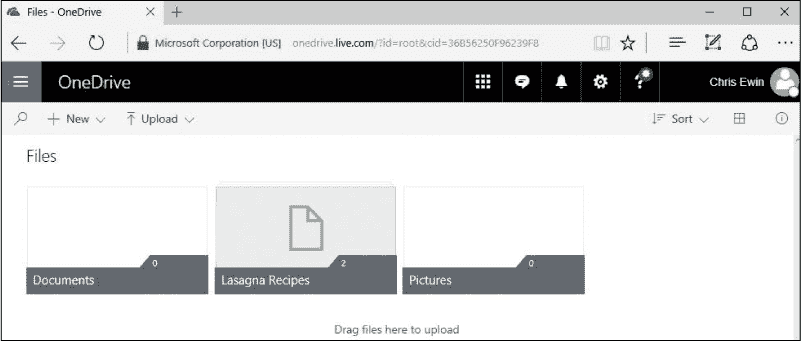

### 呼，成功了！

在本课中，我们介绍了创建和组织文件和文件夹。你学会了如何完成以下操作：

*****   使用文件资源管理器查找你创建的文件

*****   更改文件夹视图以调整图标大小

*****   重命名文件和文件夹

*****   删除和恢复文件

*****   将文件保存到文件夹中

*****   使用剪切和粘贴方法移动文件

*****   使用搜索功能查找丢失的文件

*****   将文件放到 USB 闪存驱动器或云存储中

下一课是我们的最后一课！你将学习如何在计算机和网络上保持安全。

**课程回顾**

恭喜！你已完成第 13 课。利用这个机会通过完成以下任务来复习你所学的内容。如果你能自信地完成所有这些任务，就继续学习第 14 课。如果不能，就继续练习你的文件和文件夹吧！

1.  使用 WordPad 创建一个汤谱并将其保存在*文档*文件夹中。

1.  使用文件资源管理器创建一个新的*汤谱*文件夹。

1.  使用剪切和粘贴方法将汤谱移动到*汤谱*文件夹中。

1.  将视图更改为大图标，以便清楚地看到每个食谱的图标。

1.  使用 WordPad 创建第二个汤谱。将其直接保存在*汤谱*文件夹中。

1.  将 USB 闪存驱动器插入计算机。

1.  将*汤谱*文件夹复制到 USB 闪存驱动器。
