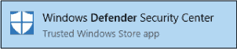
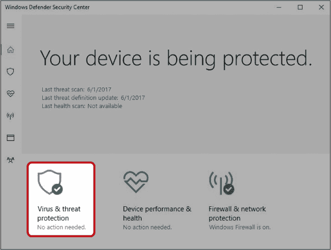
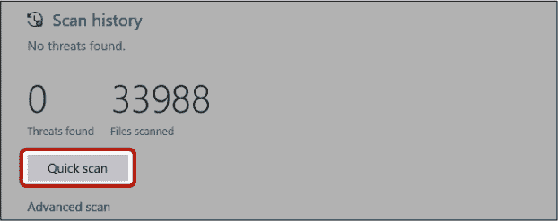
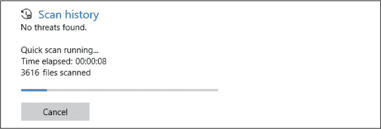
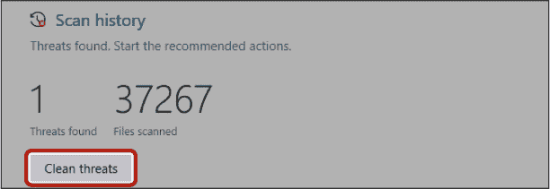
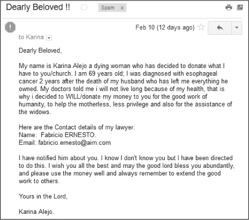
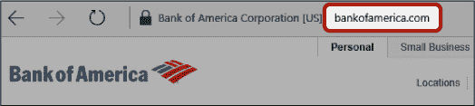
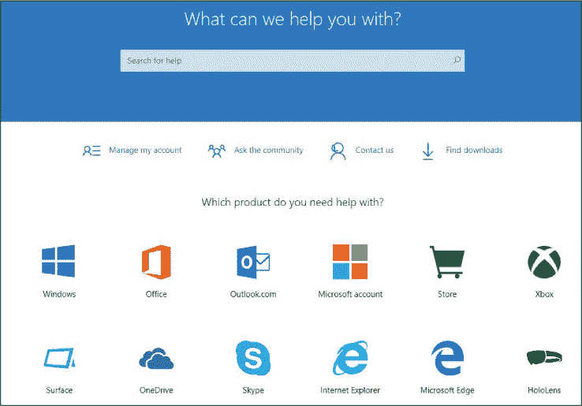
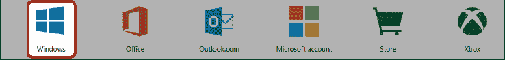

## 第 14 课

## 保持在线安全

在我们最后一课中，我们将讨论如何在线保护自己，并确保你的电脑在未来继续保持最佳运行状态。

保护免受病毒侵害

识别病毒症状

使用 Windows Defender 执行扫描

我还能如何保护自己？

我还应该注意什么？

避免诈骗

避免网络钓鱼攻击

寻求帮助

呼，成功了！

本课的目的是让你了解如何保护自己，而不是让你对使用电脑感到害怕。通过了解外界存在的威胁及如何防范它们，应该让你感到更安全。一旦你知道了如何做，你应该会更加自信！

### 保护免受病毒侵害

你在电脑上可能遇到的最大威胁之一是*病毒*，它是一种恶意的应用程序或程序，其目的是攻击你的电脑。病毒有很多种，它们的作用各不相同——从窃取你的密码和银行信息，到试图说服你购买假冒的电脑应用程序。你可能也听过*恶意软件、特洛伊木马、间谍软件*和*蠕虫*这些术语，但我们统称它们为病毒。幸运的是，有些措施可以保护你免受病毒威胁，如果你的电脑感染了病毒，也有方法可以与之作斗争。

#### **识别病毒症状**

首先，让我们讨论如何在病毒袭来时识别它。虽然这不是一个详尽无遗的列表，但以下是一些常见的病毒症状：

*****   **即使你没有浏览互联网，电脑上也会弹出意外信息：** 有时病毒甚至会以假应用程序或网站的形式出现，要求你支付费用以移除其他病毒！对于你不认识或不信任的网站或程序发出的弹窗信息要保持警惕。

*****   **互联网搜索结果引导你到错误的网站：** 有些病毒会干扰你的搜索结果，导致你被重定向到（通常是恶心的）网站。

*****   **意外的信用卡费用或银行账户资金丢失：** 有时你会通过银行的电话得知你的电脑感染了病毒。有些病毒会尝试窃取你在感染的电脑上输入的信用卡和银行账户信息。

*****   **电脑意外发送假邮件、Skype 消息或 Facebook 帖子给其他人：** 如果你的朋友告诉你，他们收到了你没发出的信息，那么你的电脑可能已经感染了病毒。病毒有时会通过发送这些信息来传播自己，有些病毒甚至会利用这些信息向你的朋友索要钱款，而这些钱最终是支付给病毒的制造者。

***** **您的计算机非常缓慢或出现大量错误：** 有些病毒会利用您的计算机为它们自己服务，从而使计算机变慢。当然，计算机变慢的原因有很多，并不只是病毒，因此不要仅凭这一症状就做出结论。

虽然这听起来可能有些可怕，但我们可以采取一些措施来保护自己免受病毒的侵害。也许最重要的工具之一就是*杀毒应用程序*，它会扫描您打开的每个文件和您访问的每个网站，寻找病毒的迹象。如果它发现病毒，或者甚至怀疑某些东西可能被感染，它会阻止该程序运行或该网站打开。杀毒应用程序还可以扫描您的计算机，查找已经存在的病毒并删除任何它找到的病毒。

有许多杀毒应用程序可供选择，一些是免费的，另一些则需要付费。您可能听说过像 Norton 和 McAfee 这样的杀毒应用程序，但这里我们将重点介绍微软的 Windows Defender 应用程序，它是免费的，并且随 Windows 10 一起提供。即使您使用的是其他杀毒应用程序，您仍然可以使用 Windows Defender 运行扫描，以获得第二个意见。

#### **使用 Windows Defender 执行扫描**

为了最大限度地减少感染病毒的风险，Windows Defender 会在每天凌晨 2 点自动对您的计算机进行全面扫描。如果您的计算机在凌晨 2 点未开机，它会重新安排扫描时间。

如果您怀疑计算机可能感染了病毒，或者您只是想确保自己没有被感染，您可以使用 Windows Defender 手动进行扫描。以下是您需要遵循的步骤：

1.  点击屏幕左下角的**开始按钮**并输入**defender**。

1.  从出现的列表中点击**Windows Defender 安全中心**，如图所示。

    

1.  现在您应该可以看到 Windows Defender 安全中心。Windows Defender 安全中心包含一些有用的功能，您可能会想自行探索。我们将重点关注“病毒与威胁防护”功能，它负责保护您免受病毒的侵害。点击**病毒与威胁防护**按钮。

    

1.  点击下图中突出显示的**快速扫描**按钮。

    

    ***** ***注意：** 如果您的计算机上安装了其他杀毒程序，您可能看不到“快速扫描”按钮。在这种情况下，点击**Windows Defender 杀毒选项**旁边的下拉箭头，然后点击**定期扫描**滑块，将其从关闭切换为开启。*

1.  现在将扫描您的计算机以查找病毒。根据您的计算机速度和文件数量，这可能需要几分钟。

    

1.  扫描完成后，您将看到结果，如下图所示。

    

1.  如果发现任何威胁，Windows Defender 会提供删除选项。点击下图所示的**清除威胁**按钮进行删除。

    

1.  Windows Defender 会删除威胁，这可能需要几秒钟。删除完成后，你将返回到病毒与威胁保护的主屏幕。

如果在使用 Windows Defender 删除威胁后仍然遇到问题，你可以尝试运行离线扫描。这会花费更长的时间，并且在扫描过程中无法使用计算机，但更可能去除任何存在的病毒。要运行离线扫描，请点击**高级扫描**按钮，勾选**Windows Defender 离线扫描**选项，然后选择**立即扫描**。

#### **我还能如何保护自己？**

即使你正在使用杀毒软件，一个保护自己的好方法是小心访问的网站和点击的链接。以下是一些保护自己的好策略：

*****   避免点击互联网上可疑的广告。有些广告会告诉你你赢得了奖品，提供帮助加速计算机，或者让你下载一个“重要”的程序。这些链接可能包含病毒，最好安全起见忽略它们。

*****   避免访问推广非法或可疑活动的网站，例如那些宣传版权侵犯的网站。

*****   如果弹出消息提示你的计算机被感染，不要点击它。这可能是一个广告，试图让你安装虚假的软件，或者是一个病毒，试图诱骗你让问题更严重。相反，寻找关闭按钮或关闭链接关闭消息；然后使用 Windows Defender 或你信任的杀毒软件进行扫描。

*****   永远不要打开你不认识的人的电子邮件或 Skype 消息中的附件或点击链接。

*****   如果你认识的人发来的电子邮件或 Skype 消息中有附件或链接，且你并未期待这些，或者消息内容不像他们的风格，请不要打开或点击。如果他们的计算机感染了病毒，它可能通过受感染的电子邮件试图传播到你的计算机。

*****   小心使用 USB 闪存驱动器。如果你将一个 USB 闪存驱动器插入一台感染病毒的计算机，它可能会将病毒传播到 USB 闪存驱动器中，然后再感染你插入的任何其他计算机。仅在你信任的计算机上使用闪存驱动器。

*****   避免在公共计算机上使用银行网站或输入信用卡信息，如图书馆或网吧的计算机，因为这些计算机可能含有病毒。

### 我还应该注意什么？

互联网的另外两大主要威胁是*骗局*和*钓鱼*。

#### **避免骗局**

互联网骗局通常以电子邮件的形式出现，内容是告诉你几乎不做任何事情就能赚到大钱，或者要求你支付一笔快速的钱，并承诺会连本带利返还。下一页显示了一个诈骗邮件的例子。

这只是一个诈骗邮件的例子。其他邮件可能声称你中了一个你从未参与的乐透，或者被指定为某个已故尼日利亚王子的唯一继承人，或者它们可能会要求你为某个紧急情况支付费用，并承诺会全额偿还——甚至还会多还些。

如果你回应了，通常会被告知你只需要支付一小笔钱来覆盖关税、处理费、手续费或其他费用。然后骗子会从你身上榨取尽可能多的钱，再继续进行下一步。如果你收到这类邮件，最好直接删除而不回应，即使你仅仅有最轻微的怀疑它是骗局。

#### **避免钓鱼攻击**

钓鱼攻击通常也以邮件的形式出现。在这种攻击中，骗子通常伪装成一个合法公司，比如你的银行，并试图让你点击邮件中的链接。这个链接通常会把你带到一个几乎与真实银行网站一模一样的网页，在那里他们会要求你提供登录信息。如果你提供了这些信息，骗子很可能会把你的银行账户里的钱转走！假冒银行的钓鱼邮件是最常见的，但骗子也会伪装成你的互联网服务提供商；像 Facebook、Amazon、eBay 和 PayPal 等流行网站；甚至是 IRS（美国国税局）！钓鱼攻击通常比其他类型的诈骗更隐蔽，因此更难识别。以下是一些帮助你识别钓鱼邮件的提示：

***** **像“亲爱的先生或女士”这样的泛泛问候语：** 来自银行和其他网站的真实邮件通常会称呼你为名字。

***** **发件人邮箱地址与其所声称身份不符：** 例如，你可能期望从美国银行收到的真实邮件来自**@bankofamerica.com**邮箱地址。因此，如果你收到一封来自**@gmail.com**的邮件，声称是美国银行的邮件，那很可能是假的。然而要注意：并非所有的伪造邮件都这么容易分辨。有些来自**@bankofannerica.com**的伪造邮件，乍一看可能会让你误以为它来自正确的地方！

***** **错误的网址：** 如果你点击了邮件中的链接，可以通过查看地址栏来检查你访问的是哪个网站。如果地址与你预期的不符，那可能是钓鱼邮件。例如，真正的美国银行网址是这样的：

***** **拼写和语法错误：** 很多钓鱼邮件都是从那些英语不是主要语言的国家发送的，因此它们通常包含拼写和语法错误。真实的公司通常会校对他们的邮件，因此任何错误都可能是钓鱼邮件的信号。

*****   **紧急语言：** 许多网络钓鱼邮件会通过使用诸如“如果不在 24 小时内完成，此账户将被禁用”的语言来施压你。真正的银行可能不会通过邮件告知如此重要的事情，而是会打电话给你！

就像对待诈骗邮件一样，如果你收到了网络钓鱼邮件，你应该在不回复的情况下将其删除。在任何情况下，你都不应该按照邮件中的指示操作。如果你不确定，可以尝试通过电话联系邮件所声称的公司，询问他们是否发送了这封邮件。我们还鼓励你访问 *[`www.sonicwall.com/phishing/`](http://www.sonicwall.com/phishing/)*，在这里你可以参加测验来测试你识别网络钓鱼邮件的能力，并了解更多关于网络钓鱼攻击的信息。

***** ***注意：** 你绝对*不要*通过电子邮件提供任何账户密码、银行或信用卡信息。银行永远不会要求你通过电子邮件发送这些信息，所以如果有邮件要求你提供，这几乎肯定是恶意的！*

### 获取帮助

随着我们的最后一课接近尾声，你现在应该已经对如何使用你的电脑有了很好的理解。但旅程并未就此结束！你的电脑还包含许多其他有用的功能，我们鼓励你继续探索电脑所提供的一切。随着你探索的深入，你可能会遇到新的问题或需要帮助。幸运的是，微软为此提供了一个出色的支持中心。微软支持中心包含了大量的主题信息和常见问题的解答。要打开微软支持，请按照以下步骤操作：

1.  打开 Microsoft Edge。

1.  在地址栏中输入 **support.microsoft.com**。这将带你到微软支持页面。

    

1.  如果你希望了解某个特定主题（例如从商店下载应用程序），可以在搜索框中输入你的问题并按下 ENTER 键。你的答案将会出现！

1.  如果你不太确定自己想要询问什么，或者想要更一般的 Windows 10 信息，你可以点击这里突出的 Windows 图标。

    

1.  这将带你到 Windows 10 帮助页面，你可以在这里找到信息、支持以及常见问题的答案。

### 呼，终于完成了！

在这一课中，我们学习了安全性和故障排除。你学会了如何保护自己免受病毒侵害并清除病毒，如何避免诈骗和网络钓鱼攻击。在这一课中，你学习了以下内容：

*****   打开 Windows Defender

*****   使用 Windows Defender 进行病毒扫描

*****   保护自己免受病毒、诈骗和网络钓鱼攻击

*****   获取微软支持的帮助

感谢阅读本书！我们希望你在阅读关于如何使用电脑的内容时，能像我们写这本书一样感到愉快。但不要停下来—继续探索你的电脑，发现更多值得喜爱的功能！祝你好运！

**课程回顾**

恭喜你！你已经完成了第 14 课。利用这个时间通过完成以下任务来复习你所学的内容。

1.  使用微软支持页面了解如何整理你的应用程序。

1.  查看你的电子邮件收件箱，查找任何诈骗或钓鱼邮件，并删除你发现的任何邮件。
