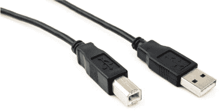
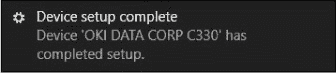
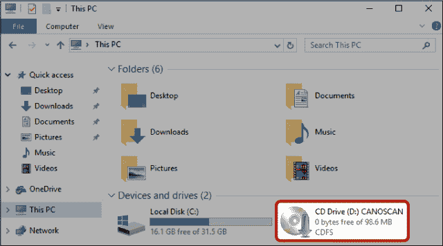
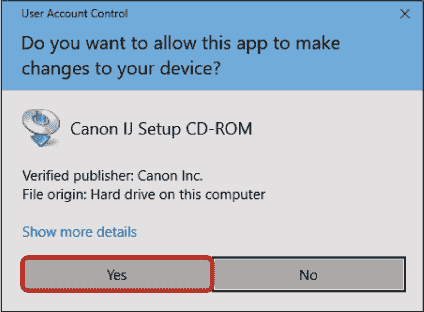

## 第十六章：连接打印机、扫描仪、网络摄像头或其他设备

有些计算机任务，如打印和扫描，需要额外的设备。您需要将这些设备连接到计算机，以便它们能够相互通信并协同工作。大多数现代打印机、扫描仪、网络摄像头和其他设备都通过 USB 连接进行连接。在 Windows 10 中，您只需插入这些设备，它们就可以开始使用了。然而，有时您需要安装设备驱动程序，以便计算机可以识别设备及其功能。我们将在这里介绍两种情况。幸运的是，安装不同设备的过程非常相似且相对简单。不过，如果您遇到任何问题，确保查阅设备的快速入门指南——通常是随设备附带的小册子——以获取更多细节。

### 连接您的设备

为了让设备与计算机正常工作，您首先需要将设备的 USB 电缆插入计算机的 USB 端口。以下是操作步骤：

1.  如果您的设备需要电源，请将电源线插入电源插座。电源线的另一端应该插入设备上的相应端口——通常在设备的背面或底部。如果不确定，请查看设备的说明。

1.  如果您的设备有可拆卸的 USB 电缆，请将电缆的一端连接到设备。

    

1.  将 USB 电缆的矩形端（如右图所示）插入计算机的正确接口。您可能会看到一个消息短暂地弹出在屏幕右下角，如此处所示。

大多数情况下，您的设备就可以开始使用了，但有时您需要安装一个应用程序来帮助它启动；我们接下来会介绍这一部分内容。

### 安装您的设备

连接设备后，您需要帮助计算机识别设备，以便它们可以互相通信。为此，您可能需要安装一个*驱动程序*，这是一种简单的软件，能够让计算机和设备使用相同的语言进行交流。

幸运的是，Windows 在您连接大多数设备到计算机时会自动安装驱动程序，您无需做任何操作。不过，如果 Windows 无法找到正确的驱动程序，您可能需要使用设备附带的光盘自行查找并安装驱动程序。要检查 Windows 是否已找到正确的驱动程序，您可以尝试使用新设备。如果设备正常工作，那么说明 Windows 已找到并安装了驱动程序，您就不需要再做其他操作了！如果设备无法工作，请按照以下步骤查找并添加驱动程序：

1.  将光盘插入计算机的光驱中，标签面朝上。您的软件安装应该会自动开始。

1.  如果没有，像在第 13 课中那样打开文件资源管理器，方法是点击任务栏中的**文件资源管理器**图标。

1.  在文件资源管理器窗口左侧的列表中，点击**此电脑**。

1.  双击*此电脑*中列出的**CD 驱动器**图标。驱动器的名称应更改为反映你插入的 CD。

    

1.  可能会要求你授权让驱动程序对你的计算机进行更改。这是完全安全的。点击下方突出显示的**是**以继续。

    

1.  设置过程现在应该开始。从这里开始，具体过程会根据你的设备和制造商有所不同，因此请尽量根据提示回答问题并点击完成安装。

一旦设备驱动程序安装完成，你就可以开始使用它。如果设备仍然无法正常工作，请查阅设备的用户手册。
