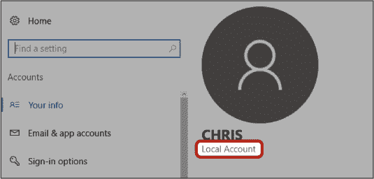
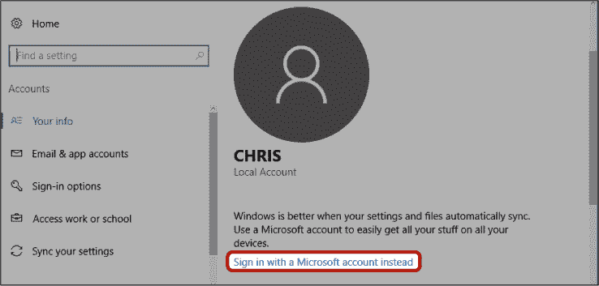
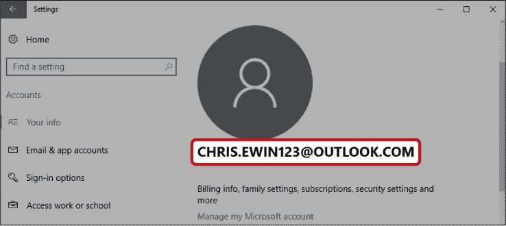

## 切换到微软账户

如果你发现你的计算机已经设置完毕，而无需按照《设置你的计算机》第 17 页中的步骤操作，那么可能是你使用的是*本地账户*而非微软账户。这种情况可能发生在你从较旧的操作系统（如 Windows 7）升级时，或者是商店在出售计算机时已经为你设置好了账户。使用本地账户你依然可以登录并使用计算机，但无法访问微软的在线服务，如商店、OneDrive、Skype 以及邮件应用，这些在本书中是必需的。以下是如何检查你是否拥有微软账户，以及如果没有，如何创建一个账户的步骤。

### 我有微软账户吗？

要检查你是使用微软账户还是本地账户，请按照以下步骤操作：

1.  点击屏幕左下角的**开始按钮**。

1.  点击这里突出显示的**设置按钮**。

    

1.  这将打开“设置”界面。点击**账户**选项。

1.  你应该可以看到你名字下方的一行文字。如果这行文字显示的是你的电子邮件地址，那就说明你拥有微软账户，无需继续设置。如果这行文字显示的是“本地账户”，则说明你没有微软账户，接下来继续下一部分创建微软账户。

### 创建微软账户

如果你使用的是本地账户，你需要切换到微软账户才能使用 Windows 10 中的所有功能。

1.  点击**改用微软账户登录**链接。

    

1.  按照屏幕上的步骤创建微软账户。这个过程与《创建微软账户》第 20 页中的步骤非常相似，如果需要帮助，可以翻回去查看更详细的信息。

1.  现在，你将返回到“设置”窗口中的账户屏幕，在那里你应该可以看到你新的微软账户。

现在你已经创建了微软账户，准备好按照本书中的各章节内容，深入探索 Windows 10 了。
