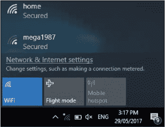
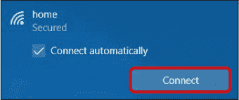
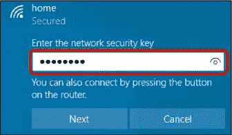
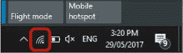

## 在家外连接 Wi-Fi

你可能在图书馆、咖啡馆或酒店听说过*免费 Wi-Fi*这个词。这意味着提供无线互联网接入服务且不收取费用。如果你有笔记本电脑或平板电脑，你可以按照以下步骤连接到 Wi-Fi。你也可以使用相同的过程连接到朋友或家人家的无线网络——只要他们提供给你密码！

按照以下步骤连接到免费的公共 Wi-Fi 网络：

1.  在屏幕右下角，你应该能看到一个小的互联网符号，看起来就像这里突出显示的那个。点击这个互联网图标。

    

1.  这应该会显示一份你电脑可连接的附近无线网络列表。点击你想要使用的无线连接。

    

1.  点击**连接**按钮。

    

1.  输入该无线网络连接的密码，注意精确输入大小写。如果你在咖啡馆或酒店，工作人员应该能提供密码给你。

    

1.  点击**下一步**按钮。

现在你应该已经连接上了。一旦连接成功，互联网符号会改变，显示信号强度，正如你在这里看到的。如果你再次点击互联网符号，你还应该能看到网络下方显示*已连接*字样。

如果你输入的密码不正确，你应该会看到一条消息，提示网络安全密钥不正确。此时，请尝试重新输入密码。注意，某些场所会加载一个网页，要求你接受其使用条款后才能连接。

通过公共 Wi-Fi 连接发送的信息可能会被他人截取，因此你应避免通过公共连接访问敏感网站，如在线银行。
