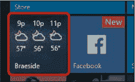
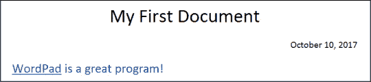

## 第十九章：解决方案

如果某个活动让你感到困惑，别担心——你来对地方了！这里是书中所有活动的解决方案。如果你真的卡住了，回顾活动所在的章节。如果你经常翻到解决方案，也不要灰心——继续练习就好！

**第 1 课**

***活动 #1***

1.  点击**开始按钮**。

1.  流行应用的瓷砖显示在“开始”菜单的右侧。天气应用看起来应该像这样：

    

1.  所有应用程序的完整列表显示在“开始”菜单的左侧。向下滚动，直到找到天气应用。

1.  点击**开始按钮**或点击开始菜单外的其他任何地方。

***活动 #2***

1.  点击**开始按钮**。点击**新闻**瓷砖，或点击搜索框，输入**news**，然后点击**新闻**。

1.  按照屏幕上的说明设置应用程序。点击一篇文章进行阅读。

1.  点击右上角的**最大化按钮**。

1.  点击右上角的**关闭按钮**。

***课程回顾***

1.  按下计算机上的电源按钮。

1.  输入你在“创建 Microsoft 帐户”中创建的用户名和密码，位于第 20 页。

1.  点击**开始按钮**。滚动浏览“开始”菜单中的应用列表，或点击搜索框，输入**计算器**。

1.  点击该应用以打开。

1.  按下计算器上的按钮，方法是用鼠标点击它们。

1.  点击右上角的**关闭按钮**。

**第 2 课**

***活动 #3***

1.  点击**开始按钮**。点击**Microsoft Solitaire Collection**瓷砖，或点击搜索框，输入**solitaire**，然后点击**Microsoft Solitaire Collection**。

1.  点击**蜘蛛**按钮。

1.  如果不确定如何进行游戏，请阅读指南并完成一场游戏。

1.  点击右上角的**关闭按钮**。

***活动 #4***

1.  点击**新建事件**按钮，填写事件详情，然后点击**保存并关闭**。

1.  点击**新建事件**按钮并填写事件详情。点击**提醒**框，选择你希望收到事件提醒的时间。点击**保存并关闭**。

1.  点击右上角的**关闭按钮**。

***课程回顾***

1.  使用“开始”菜单打开**Microsoft Solitaire Collection**应用，点击**FreeCell**，然后赢得一局游戏！

1.  使用“开始”菜单打开**天气**应用。查看明天的最高气温预报。

1.  使用“开始”菜单打开**日历**应用。点击**新建事件**按钮。在详情中，输入**完成 Lesson 3**，为事件分配下周的某一天，并调整时间段以确保至少有两个小时。

1.  点击**开始按钮**，浏览“开始”菜单，寻找新的应用程序进行探索。当你找到喜欢的应用时，点击该应用以打开。

**第 3 课**

***活动 #5***

1.  拍下你花园或房间的照片。

1.  将随相机附带的电缆插入相机和计算机。

1.  打开**照片**应用，点击**导入**，选择你想导入的照片，然后点击**继续**。确保未勾选标有**导入后从[你的设备]删除已导入项目**的框，然后点击**导入**按钮。

***活动 #6***

1.  打开**照片**应用并点击窗口顶部的**集合**按钮。点击你在活动 #5 中拍摄的照片集合。

1.  点击你想删除的照片，然后点击屏幕顶部的**删除按钮**。点击**删除**以确认。

***课程复习***

1.  用手机或相机拍几张照片。

1.  将相机随附的电缆插入相机和计算机。

1.  打开**照片**应用，点击**导入**，选择你想导入的照片，然后点击**继续**。确保未勾选标有**导入后从[你的设备]删除已导入项目**的框，然后点击**导入**按钮。

1.  点击你想编辑的照片。点击屏幕顶部的**编辑和创作**。点击**增强照片**并使用滑块改进照片。点击**调整**选项卡并使用滑块进一步改进照片。最后，点击**保存**，并使用左上角的**返回按钮**返回到照片列表。

1.  点击你想删除的照片。点击**删除按钮**，然后点击**删除**确认删除照片。

1.  点击你想打印的照片。点击**打印按钮**。确保打印机设置正确，然后点击**打印**按钮。

**课程 4**

***活动 #7***

***** 如果你看到电子邮件左侧有一条蓝色线条，表示你之前没有阅读过这封邮件。

***** 发件人名称显示在邮件顶部。

***** 邮件发送日期显示在右侧。

***活动 #8***

1.  点击**新邮件**，新邮件框应出现在右侧。点击**收件人**字段并输入收件人的电子邮件地址。点击**主题**字段并输入主题。点击主题下方的框并输入你的信息。点击**发送**。

1.  等待你在收件箱中收到回复。点击它，消息将在右侧打开。阅读消息。

1.  点击电子邮件顶部的**回复**按钮。输入你的消息并点击**发送**。

***活动 #9***

1.  点击**新邮件**，新邮件框应出现在右侧。点击**收件人**字段并输入收件人的电子邮件地址。点击**主题**字段并输入主题。点击主题下方的框并输入你的信息。

1.  点击**插入**，然后点击**文件**。点击屏幕左侧的**图片**文件夹。点击你想发送的照片，然后点击**打开**。

1.  点击**发送**。

***活动 #10***

1.  在收件箱中找到带有回形针图标的邮件（表示有附件）。

1.  点击邮件，然后点击消息顶部的附件。

1.  点击**关闭按钮**。

1.  点击邮件上方的**删除**按钮。

***课程复习***

1.  使用开始菜单找到并打开**邮件**应用。

1.  点击**新建邮件**，右侧应该会出现一个新的邮件框。在**收件人**字段点击并输入收件人的电子邮件地址。在**主题**字段点击并输入主题。

1.  在主题下方的框中点击并输入你的消息，包含要求朋友给你回复的请求。点击**发送**。

1.  等待直到你收到回复，出现在收件箱中。点击它，消息将在右侧打开。阅读消息。

1.  点击**回复**并输入你的消息。点击**插入**，然后点击**文件**。点击屏幕左侧的**图片**文件夹。点击你想发送的图片，然后点击**打开**。点击**发送**。

1.  点击你朋友的电子邮件，然后点击**删除**。

**课程 5**

***活动 #11***

该网站地址是* [www.nostarch.com](http://www.nostarch.com)*。

***活动 #12***

1.  在屏幕顶部的地址栏点击，输入**[www.washingtonpost.com](http://www.washingtonpost.com)**，然后按回车键。

1.  在地址栏点击，输入**[www.nytimes.com](http://www.nytimes.com)**，然后按回车键。

1.  在地址栏点击，输入**[www.nostarch.com](http://www.nostarch.com)**，然后按回车键。

***活动 #13***

1.  在地址栏点击，输入**[www.nostarch.com](http://www.nostarch.com)**，然后按回车键。

1.  点击书籍的标题或封面。

***活动 #14***

1.  如果你还没在 No Starch 网站上，点击地址栏，输入**[www.nostarch.com](http://www.nostarch.com)**，然后按回车键。点击 No Starch 网站上一部书的标题或封面，访问该书的网页。点击**返回按钮**返回到 No Starch 的主页面。

1.  点击**前进按钮**返回到书籍页面。

***活动 #15***

1.  点击**更多操作按钮**，然后点击**–按钮**直到缩放比例显示为 75%。

1.  点击**更多操作按钮**，然后点击**+按钮**直到缩放比例显示为 100%。

***活动 #16***

1.  在地址栏点击，输入**[www.nostarch.com](http://www.nostarch.com)**，然后按回车键。点击**添加到收藏夹按钮**，然后点击**添加**。

1.  在地址栏点击，输入**[www.washingtonpost.com](http://www.washingtonpost.com)**，然后按回车键。点击**添加到收藏夹按钮**，然后点击**添加**。

1.  点击**中心按钮**。确保你正在查看收藏夹列表；如果不是，点击列表上方的**星形按钮**。点击**No Starch Press**收藏夹。

1.  点击**中心按钮**。确保你正在查看收藏夹列表；如果不是，点击列表上方的**星形按钮**。右键点击**华盛顿邮报**收藏夹，然后点击**删除**。

***课程复习***

1.  从任务栏或开始菜单打开**Microsoft Edge**。

1.  在地址栏点击，输入**[www.latimes.com](http://www.latimes.com)**，然后按回车键。

1.  点击列表中的一篇文章阅读。

1.  点击**更多操作按钮**，然后点击**打印**。确保打印机设置正确，然后点击**打印**。

1.  点击**返回按钮**。

1.  点击**添加到收藏夹按钮**，然后点击**添加**。

1.  点击右上角的**关闭按钮**。

1.  从任务栏或开始菜单打开**Microsoft Edge**。点击**中心按钮**。确保你正在查看收藏夹列表；如果没有，点击列表上方的**星形按钮**。点击**洛杉矶时报**收藏夹。

**第 6 课**

***活动#17***

***** 使用地址栏搜索“澳大利亚最大城市”，然后点击链接，直到找到答案，答案是悉尼。

***** 搜索“亚伯拉罕·林肯之前的总统”可能有效，但结果可能会混杂。更具体的搜索，如“美国总统列表”，几乎肯定会给你更好的结果。你应该会发现答案是詹姆斯·布坎南。

***** 搜索“给兔子喂什么”，“兔子食物”和“健康的兔子食物”应该都能给你不错的结果。新鲜的干草、水果、蔬菜和高质量的颗粒饲料都是很好的答案。

***** 搜索“降低胆固醇的食物”应该能得到很好的结果。燕麦片、鱼、坚果和鳄梨都是很好的答案。

***活动#18***

1.  点击地址栏，输入搜索词，然后按回车。点击**图片**按钮。

1.  点击你想打印的图片以放大它。点击放大的图片以在新标签页中打开它。

1.  点击**更多操作按钮**，然后点击**打印**。确保打印机设置正确后，再点击**打印**。

1.  点击标签页右侧的**关闭按钮**。

1.  **查看页面**按钮位于图片下方的左侧。

***课后复习***

1.  打开**Microsoft Edge**。点击地址栏，输入**小狗定时排泄训练**或类似内容，然后按回车。点击一个结果查看页面并阅读。点击**返回按钮**，然后点击另一个结果以获得第二意见。

1.  点击地址栏，输入**在线安全提示**或类似内容，然后按回车。点击一个页面并阅读。点击**返回按钮**，再点击另一个结果以获得第二意见。

1.  点击地址栏，输入**生日蛋糕**或类似内容，然后按回车。点击**图片**。

1.  点击图片以放大它。再次点击图片以在新的标签页中打开它。点击**更多操作按钮**，然后点击**打印**。确保打印机设置正确后，再点击**打印**。点击标签页右侧的**关闭按钮**以返回图片列表。

**第 7 课**

***活动#19***

1.  点击 YouTube 页面上的一个视频。

1.  将鼠标移到视频屏幕上。将鼠标移到音量控制上，点击并拖动滑块左右调整音量。

1.  点击**暂停按钮**。

1.  点击播放按钮，它会取代暂停按钮的位置。

1.  点击**全屏按钮**。

1.  点击**退出全屏按钮**，该按钮会取代全屏按钮的位置。

1.  点击右侧“接下来”的视频列表中的一个视频。

1.  点击**返回按钮**两次。

***活动 #20***

1.  点击 YouTube 搜索框，输入一个搜索词，例如**如何更换汽车轮胎**，然后按 ENTER 键。

1.  点击其中一个结果观看。

***课程回顾***

1.  打开**Microsoft Edge**。点击地址栏，输入**[www.youtube.com](http://www.youtube.com)**，然后按 ENTER 键。点击一个视频。

1.  点击**返回按钮**。点击 YouTube 搜索框，输入你想搜索的电影名称，然后按 ENTER 键。点击结果列表中的预告片。

**课程 8**

***活动 #21***

1.  点击屏幕顶部的**应用**，滚动到页面底部找到类别部分，然后点击**教育**。

1.  点击**图表**框，然后点击列表中的**免费排行榜**。

***活动 #22***

1.  点击搜索框，输入**microsoft jigsaw**，然后按 ENTER 键。点击搜索结果中的**Microsoft Jigsaw**。

1.  点击**获取**。

1.  点击**播放**。

***课程回顾***

1.  从开始菜单打开**商店**。

1.  点击屏幕顶部的**游戏**，然后向下滚动至类别列表。点击**益智与问答**，点击**Microsoft Mahjong**，然后点击**获取**。

1.  点击**播放**开始游戏。关闭任何弹出的窗口。点击**选择拼图**按钮，然后选择难度和拼图。点击**确定**按钮并选择跟随或跳过教程。配对拼图块来赢得游戏。

1.  关闭游戏。点击**开始按钮**，然后向下滚动应用列表找到 Microsoft 麻将。右键点击**Microsoft Mahjong**，然后点击**卸载**。再点击一次**卸载**。

**课程 9**

***活动 #23***

1.  点击**搜索**按钮，输入**billy joel**到搜索框中，然后按 ENTER 键。点击列表中其中一首歌旁的**播放按钮**。

1.  点击**浏览**按钮，然后点击**类型与情绪**标题。点击**爵士**，然后点击其中一个播放列表。点击**播放**按钮。

***课程回顾***

1.  打开**Microsoft Edge**，在地址栏输入**[play.spotify.com](http://play.spotify.com)**，然后按 ENTER 键进入 Spotify 播放网站。如果系统要求你再次登录，点击**已有账户？点击这里登录**。输入你的电子邮件地址和密码，勾选**我不是机器人**，然后点击**登录**。点击**搜索**按钮，输入你想找的艺术家名称，然后按 ENTER 键。

1.  点击**浏览**按钮，然后点击**类型与情绪**标题。点击你喜欢的音乐类型，然后点击一个播放列表。点击**播放**按钮。

**课程 10**

***活动 #24***

1.  点击**学科**按钮，然后点击你喜欢的类型。点击一本看起来有趣的书的封面图片。

1.  点击**借阅**以借阅这本书。

1.  点击**前往借阅**，然后点击**下载**。

***活动 #25***

1.  点击左上角的**返回按钮**返回到你的书架。点击在活动 #24 中下载的书籍。

1.  点击屏幕中间，然后点击**设置**。点击**字体大小**框并选择合适的字体大小。

1.  点击书本的右边翻到下一页。

1.  点击屏幕中间，然后点击**更多**。在出现的列表中，点击**删除/返回**。点击**删除并返回**确认。

***课程回顾***

1.  从开始菜单打开**OverDrive**。点击右侧列表中的本地图书馆，然后点击**搜索**。输入你想要的书名并按回车键。

1.  点击**主题**按钮，然后点击你喜欢的书籍类型。点击你想借阅的书本封面，然后点击**借阅**。点击**前往借阅**，然后点击**下载**。

1.  点击左上角的**返回按钮**返回到你的书架，点击你刚下载的书籍。点击书本的右边翻页。点击屏幕中间，然后点击**更多**。在出现的列表中，点击**删除/返回**。点击**删除并返回**确认。

**课程 11**

***活动 #26***

点击**联系人按钮**，然后点击**搜索 Skype**框。在搜索框中输入朋友的姓名、电子邮件地址或手机号码。从列表中点击你的朋友，然后点击**添加到联系人**。

***活动 #27***

1.  请朋友将你添加到 Skype。你可以给他们你的电子邮件地址，帮助他们更容易找到你。

1.  点击**最近的对话**，然后点击你朋友的名字。点击**接受**确认他们的联系人请求。

***活动 #28***

从你的联系人列表中，点击你想要通话的朋友，然后点击**视频通话按钮**。

***活动 #29***

1.  从你的联系人列表中，点击你想要发送消息的朋友。点击**输入消息**框并输入你的消息。按回车键发送。

1.  当你的朋友回复时，输入一条新消息。点击**表情按钮**，然后点击你想要发送的表情符号。按回车键发送消息。

***课程回顾***

1.  从开始菜单打开**Skype**。

1.  点击**联系人按钮**，然后点击**搜索 Skype**框。在搜索框中输入朋友的姓名、电子邮件地址或手机号码。从列表中点击你的朋友，然后点击**添加到联系人**。

1.  点击**联系人按钮**，点击你想要通话的朋友，然后点击**通话按钮**。

1.  从你的联系人列表中，点击你想要通话的朋友，然后点击**视频通话按钮**。

1.  当你收到朋友的来电时，点击**音频**或**视频**按钮接听电话。

1.  点击**联系人按钮**，然后点击你想要发送消息的朋友。点击**输入消息**框并输入你的消息。点击**表情按钮**，然后点击你想要发送的表情符号。按回车键发送消息。

**课程 12**

***活动 #30***

***** 主页功能区

***** 查看功能区

***** 文件菜单

***** 主页功能区

***** 快速访问栏

***活动 #31***

1.  点击页面并使用键盘输入句子。

1.  按两次退格键，删除两个感叹号。

***活动 #32***

1.  在*WordPad*前点击，然后点击并拖动鼠标选择它。点击首页功能区的**下划线按钮**。

1.  点击屏幕上的任何位置以取消选择*WordPad*。点击句子的第一个单词前，然后点击并拖动鼠标选择整个句子。点击字体大小框旁边的箭头，选择出现列表中的**16**。

1.  点击文本颜色按钮旁边的箭头，从出现的列表中选择蓝色。

***活动 #33***

1.  点击第一行的开头，在*WordPad*前面，按回车键。

1.  点击*WordPad*上方的行并使用键盘输入。

1.  在*My*前点击，然后点击并拖动鼠标选择标题。点击字体大小框旁边的箭头，选择出现列表中的**24**。

1.  点击首页功能区中的**居中对齐按钮**。

1.  点击*Document*后面的空白处取消选择标题。按回车键并输入日期。

1.  点击首页功能区中的**右对齐按钮**。你的文档现在应该看起来像这样：

***课程回顾***

1.  从开始菜单打开**WordPad**。

1.  使用键盘输入一个食谱。

1.  通过点击并拖动鼠标选择你想格式化的单词或句子，然后使用首页功能区中的格式化功能。

1.  点击**文件**，然后点击**保存**。确保你的文档有一个合理的名称，如*蔬菜千层面食谱*。点击**保存**。

1.  点击右上角的**关闭按钮**。

1.  从开始菜单打开**WordPad**。

1.  使用键盘输入一个标题和待办事项列表。将光标放在标题中，并点击首页功能区中的**居中对齐按钮**。

1.  点击**文件**，然后点击**保存**。确保你的文档有一个合理的名称，如*待办事项列表*。点击**保存**。

1.  高亮显示你的待办事项列表，然后点击首页功能区中的**列表按钮**（位于右对齐按钮上方）。

1.  点击右上角的**关闭按钮**。

**第 13 课**

***活动 #34***

1.  点击任务栏中的**文件资源管理器**，然后点击导航窗格中的**这台电脑**。

1.  双击**文档**文件夹。

***活动 #35***

1.  点击任务栏中的**文件资源管理器**，然后点击导航窗格中的**文档**文件夹。

1.  点击**首页**功能区，然后点击**新建文件夹**。输入**Curry Recipes**作为文件夹名称，然后按回车。

1.  点击*Curry Recipes*文件夹。点击**首页**功能区，然后点击**重命名**。输入**Lasagna Recipes**作为文件夹名称，然后按回车。

1.  点击*Lasagna Recipes*文件夹。点击**首页**功能区，然后点击**删除**。

1.  点击右上角的**关闭按钮**。双击桌面上的**回收站**图标，然后点击*千层面食谱*文件夹。点击**管理**功能区，然后点击**恢复所选项目**。

***活动 #36***

1.  从开始菜单打开**WordPad**。

1.  输入一个苹果蛋糕的食谱。

1.  点击**文件**，然后点击**保存**。双击**蛋糕食谱**文件夹。点击**文件名**框，输入**苹果蛋糕**，然后点击**保存**。

***活动 #37***

1.  从开始菜单打开**WordPad**。

1.  输入一个肉酱千层面的食谱。

1.  点击**文件**，然后点击**保存**。点击**文件名**框，输入**肉酱千层面**，然后点击**保存**。点击右上角的**关闭按钮**。

1.  点击任务栏上的**文件资源管理器**，然后点击导航窗格中的**文档**文件夹。

1.  点击**肉酱千层面**文件。点击**首页**功能区，然后点击**剪切**。双击**千层面食谱**文件夹。点击**首页**功能区，然后点击**粘贴**。

***活动 #38***

1.  点击任务栏上的**文件资源管理器**，然后点击导航窗格中的**文档**文件夹。

1.  点击**蛋糕食谱**文件夹。点击**首页**功能区，然后点击**复制**。点击导航窗格中的**USB 闪存驱动器文件夹**。点击**首页**功能区，然后点击**粘贴**。

1.  点击导航窗格中的**USB 闪存驱动器**文件夹。

1.  双击**蛋糕食谱**文件夹。

1.  点击右上角的**关闭按钮**。

***课后复习***

1.  从开始菜单打开**WordPad**。输入一份汤的食谱。点击**文件**，然后点击**保存**。输入食谱名称并点击**保存**。关闭文档。

1.  点击任务栏上的**文件资源管理器**，然后点击导航窗格中的**文档**文件夹。点击**首页**功能区，然后点击**新建文件夹**。输入**汤食谱**作为文件夹名称，然后按 ENTER 键。

1.  点击你刚创建的食谱。点击**首页**功能区，然后点击**剪切**。双击**汤食谱**文件夹。点击**首页**功能区，然后点击**粘贴**。

1.  点击**视图**，然后点击**大图标**。

1.  从开始菜单打开**WordPad**。输入一份汤的食谱。点击**文件**，然后点击**保存**。打开**文档**文件夹，然后打开**汤食谱**文件夹。为你的食谱输入一个名字并点击**保存**。关闭文档。

1.  将 USB 闪存驱动器插入计算机的任意空闲 USB 端口。

1.  点击任务栏上的**文件资源管理器**，然后点击导航窗格中的**文档**文件夹。点击**汤食谱**文件夹。点击**首页**功能区，然后点击**复制**。点击导航窗格中的**USB 闪存驱动器文件夹**。点击**首页**功能区，然后点击**粘贴**。

**第 14 课**

***课后复习***

1.  打开**Microsoft Edge**并在地址栏中输入**[support.microsoft.com](http://support.microsoft.com)**。点击搜索框，输入**如何组织应用**，然后点击第一个结果。

1.  打开**邮件**应用程序。检查收件箱中是否有任何诈骗或钓鱼邮件。如果某封邮件看起来可疑，点击它然后点击**删除**。
