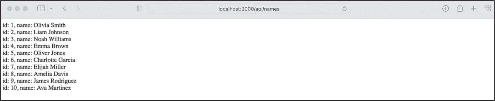

## 第二章：2 现代 JavaScript


在第一章中，你使用了基础的 JavaScript 通过 Node.js 创建了一个 Web 服务器。现在，我们将更深入地探讨语言的高级特性，以及如何有效地使用这些特性来创建全栈 Web 应用程序。

你有时会听到*ES.Next*这个术语，它指的是 JavaScript 的新版本。在本书中，我们使用 ES.Next 作为现代 JavaScript 及其概念的广义标签。大多数运行时环境都已经实现了这里讨论的特性。如果没有，你可以通过 Babel.js 进行转译，生成与旧版运行时兼容的 JavaScript，从而模拟新特性。

### ES.Next 模块

ES.Next 模块允许你将代码分离到不同的文件中，以提高可维护性和可测试性。它们将一段逻辑封装成易于重用的代码，并且因为变量和函数的作用域仅限于模块本身，你可以在不同的模块中使用相同的变量名而不会发生冲突。（我们在“声明变量”一节中讨论了作用域的概念，见第 17 页。）

官方的 ES.Next 模块取代了各种非官方的模块格式，如 UMD 和 AMD，这些格式会通过require语句加载。例如，你在第一章中使用了require来包含 Express.js 包，供 Node.js 服务器代码使用。相反，ES.Next 模块使用export和import语句来从一个模块的作用域中导出函数，并在其他地方导入它们。换句话说，模块允许你创建函数和变量，并将它们暴露到一个新的作用域。

#### 使用命名导出和默认导出

Next.js 导出有两种类型：*命名导出*和*默认导出*。当你稍后导入它们时，这些导出使用略有不同的语法。默认导出要求你在导入时定义新的函数名称。对于命名导出，重命名是可选的，可以使用as语句完成。

被认为是最佳实践的是使用命名导出，而不是默认导出，因为命名导出为模块的功能定义了一个清晰且唯一的接口。当我们使用默认导出时，用户可能会在不同的名称下导入相同的函数。TypeScript（我们将在第三章中讨论）推荐在模块有一个明确的用途和单个导出时使用默认导出。相反，当模块导出多个项时，它推荐使用命名导出。

你应该了解默认导出的语法，这样你才能与使用它们的第三方模块一起工作。与命名导出不同，每个文件只能有一个默认导出，并由default关键字标记（列表 2-1）。

```
const getFoo = function () {
    return 'foo';
};

export default getFoo; 
```

列表 2-1：默认导出

在这个列表中，我们定义了一个匿名函数并将其存储在常量getFoo中。然后，我们使用default关键字导出常量，使其成为模块的默认导出。

你可以在文件的开头或结尾导出命名导出，使用大括号（{}）。列表 2-2 展示了几个命名导出。

```
export const getFooBar = function () {
    return 'foo bar';
};

const getBar = function () {
    return 'bar';
};

const getBaz = function () {
    return 'baz';
};

export {getBar, getBaz}; 
```

列表 2-2：命名导出

在这里，我们定义了一个匿名函数，将其存储在常量getFooBar中，并立即将其作为getFooBar导出。然后，我们定义了另外两个匿名函数，并将它们作为命名导出在大括号中导出。

#### 导入模块

导入一个 ES.Next 模块的语法取决于你创建的导出类型。命名导出需要使用大括号导入，而默认导出则不需要。在列表 2-3 中，我们通过使用import语句并后跟分配给它的本地名称来导入默认导出getFoo。最后，我们通过引用包含代码的文件来结束导入。

```
import getFoo from "default.js";
```

列表 2-3：导入默认导出

我们在列表 2-4 中遵循了类似的模式来进行命名导出，唯一不同的是我们需要在大括号内引用原始函数名。要在本地重命名函数，我们需要明确地使用as语句，通常没有必要这样做。

```
import {getFooBar, getBar, getBaz} from "named.js";
```

列表 2-4：导入命名导出

现在，你可以在代码中使用导入的函数，因为它们在导入的作用域内是可用的。

### 声明变量

JavaScript 提供了三种不同的声明变量的方式：var、let 和 const。本节讨论了它们的使用场景。通常，你会被建议避免使用var，因为它“过时了”。你可以放心，它并没有过时，你必须理解这三种变量声明方式，以便选择适合工作的工具。

这些变量在它们的 *作用域* 上有所不同，作用域定义了我们可以访问和使用它们的代码区域。JavaScript 有多个级别的作用域：全局作用域、模块作用域、函数作用域和块作用域。适用于任何用花括号括起来的代码块的 *块* 作用域是作用域的最小单元。每次你使用花括号时，你都会创建一个新的块作用域。相比之下，当你定义一个函数时，你会创建一个 *函数* 作用域。该作用域仅限于特定函数内部的代码区域。*模块* 作用域仅适用于特定模块，而 *全局* 作用域适用于整个程序。定义在全局作用域中的变量在代码的任何部分都是可用的。

如你在以下代码清单中看到的，一个变量在其所在的作用域及其所有子作用域中始终可用。因此，你应记住，例如，一个函数作用域可以包含多个块作用域。同样的变量名可以在一个程序中定义两次，只要每个变量出现在不同的作用域中。

#### 提升的变量

传统的 JavaScript 使用 var 关键字声明变量。这些变量的作用域是当前的执行上下文（通常是封闭的函数）。如果在任何函数外部声明，则变量的作用域是全局的，并且该变量会在全局对象上创建一个属性。

与所有其他变量不同，运行时环境会在执行时将 var 的声明提升到作用域的顶部。因此，你可以在代码中先调用这些变量再定义它们。清单 2-5 展示了提升的简短示例。

```
function scope() {
    foo = 1;
    var foo;
} 
```

清单 2-5：在定义变量之前使用提升的变量

在这个代码清单中，我们在下一行声明变量之前给变量赋了一个值。在像 Java 和 C 这样的语言中，我们不能在声明之前使用变量，任何尝试这么做都会抛出错误。然而，由于 JavaScript 中的提升机制，解析器会将所有使用 var 关键字定义的变量声明提升到作用域的顶部。因此，代码等价于 清单 2-6 中的代码。

```
function scope() {
    var foo;
    foo = 1;
} 
```

清单 2-6：在使用变量之前定义变量

由于提升机制，块作用域不适用于使用 var 关键字声明的变量。它们总是被提升。为了说明这一点，看看 清单 2-7，我们在其中声明了一个全局变量 globalVar、一个函数作用域内的变量 foo 和一个块作用域内的变量 bar，所有这些变量都使用了 var 关键字。

```
var globalVar = "global";
function scope() {
    var foo = "1";
    if (true) {
        var bar = "2";
    }
    console.log(globalVar);
    console.log(window.globalVar);
    console.log(foo);
    console.log(bar);
}
scope(); 
```

示例 2-7：var的作用域

我们运行scope函数，并看到globalVar和window.globalVar是相同的；解析器将foo和bar这两个变量提升到函数作用域的顶部。因此，变量bar可以在块作用域外使用，且函数作用域会将这两个变量的值1和2打印到控制台。

#### 作用域变量

现代 JavaScript 引入了let关键字来补充var。使用let，我们可以声明块级作用域的变量，且这些变量只能在声明后访问。因此，它们被认为是*非提升*变量。块级作用域的变量仅限于其定义所在的块语句的作用域内。与使用var定义的全局变量不同，全局的let变量不会被添加到window对象中。

让我们看看使用let声明的变量的作用域。在示例 2-8 中，我们在一个函数作用域内声明了变量foo，在一个块作用域内声明了变量bar，以及一个全局变量globalVar。

```
let globalVar = "global";
function scope() {
    let foo = "1";
    if (true) {
        let bar = "2";
    }
    console.log(globalVar);
    console.log(window.globalVar);
    console.log(foo);
    console.log(bar);
}
scope(); 
```

示例 2-8：let的作用域

每个变量仅在其各自的作用域内可用。解析器不会提升它们，因此变量bar在块语句外不可用。如果你尝试在其他地方引用它，解析器会抛出一个错误并通知你bar未定义。

我们执行该函数，与 var 代码不同，它只会将 foo 的值写入控制台。当我们尝试访问 bar 时，会收到错误 Uncaught ReferenceError: bar is not defined。对于 globalVar，我们看到控制台打印出值 global，而 window.globalVar 的值为 undefined。

#### 常量型数据

现代 JavaScript 引入了另一个新的关键字，const，用于声明常量，如数据类型。与 let 类似，const 在全局声明时不会创建全局对象的属性。它们也被视为非提升的，因为在声明之前无法访问。

JavaScript 中的常量与许多其他语言中的常量不同，在那些语言中，常量是不可变的数据类型。在 JavaScript 中，常量仅仅是*看起来*不可变。实际上，它们是对其值的只读引用。因此，你不能直接为原始数据类型的变量标识符重新赋值。然而，对象或数组是非原始数据类型，因此即使使用 const，你仍然可以通过方法或直接访问属性来修改它们的值。

在 列表 2-9 中，我们用 const 关键字声明了原始数据类型和非原始数据类型，并尝试修改它们的内容。

```
const primitiveDataType = 1;
try {
    primitiveDataType = 2;
} catch (err) {
    console.log(err);
}

const nonPrimitiveDataType = [];
nonPrimitiveDataType.push(1);

console.log(nonPrimitiveDataType); 
```

列表 2-9：使用 const 声明原始类型和非原始类型

我们声明并为两个常量型数据结构赋值。当我们尝试重新为原始数据结构赋值时，运行时会抛出错误 Attempted to assign to readonly property。由于我们使用了 const，我们无法重新赋值。相反，我们可以修改 nonPrimitiveDataType 数组（这里使用 push 方法）并追加一个值，而不会遇到错误。现在该数组应包含一个值为 1 的项；因此，我们在控制台看到 [1]。

### 箭头函数

现代 JavaScript 引入了箭头函数，作为常规函数的替代方案。你需要了解箭头函数的两个概念。首先，它们使用与常规函数不同的语法。定义一个箭头函数要快得多，只需几个字符和一行代码。第二个重要但不那么明显的变化是它们使用被称为词法作用域的东西，使得箭头函数更加直观且不容易出错。

#### 编写箭头函数

我们不是使用function关键字来声明箭头函数，而是使用等号和大于号组成箭头（=>）。这种语法，也叫做*胖箭头*，减少了冗余，使代码更简洁。因此，现代 JavaScript 在将函数作为参数传递时倾向于使用这种语法。

此外，如果一个箭头函数只有一个参数和一条语句，我们可以省略花括号和return关键字。在这种紧凑的形式中，我们称该函数为*简洁函数体*函数。列表 2-10 显示了传统函数的定义，随后是箭头函数的定义。

```
const traditional = function (x) {
    return x * x;
}

const conciseBody = x => x * x; 
```

列表 2-10：一个传统函数和一个具有简洁函数体语法的箭头函数

我们首先使用function关键字和常见的return语句定义一个标准函数。然后，我们以简洁的函数体语法编写相同的功能。这里我们省略了花括号，使用隐式的return语句，而不使用return关键字。

#### 理解词法作用域

与常规函数不同，箭头函数不会将它们的作用域绑定到调用函数的对象上。相反，它们使用一种*词法作用域*，其中周围的作用域决定了this关键字的值。因此，在箭头函数中，this所指代的作用域始终表示*定义*箭头函数的对象，而不是*调用*该函数的对象。列表 2-11 说明了词法作用域和定义作用域的概念。

```
❶ this.scope = "lexical scope";

const scopeOf = {
  ❷ scope: "defining scope",

    traditional: function () {
      ❸ return this.scope;
    },

    arrow: () => {
        return this.scope;
    },
};

console.log(scopeOf.traditional());
console.log(scopeOf.arrow()); 
```

列表 2-11：箭头函数的作用域

我们首先在词法作用域❶上声明scope属性；这是定义对象。然后我们在定义作用域❷内部创建一个具有相同名称属性的对象。接下来，我们定义两个函数，它们都使用this来返回this.scope的值❸。

在调用它们时，您可以看到两者引用之间的区别。箭头函数中的this.scope指的是词法作用域中定义的属性，而传统函数的this指的是我们定义的第二个属性。因此，scopeOf.traditional函数输出定义作用域，而scopeOf.arrow函数输出词法作用域。

#### 探索实际应用场景

由于函数是 JavaScript 中的头等公民，我们可以将它们作为参数传递给其他函数。在第一章中，您使用这种模式在 Node.js 中定义回调，或者之前在浏览器中处理事件处理程序时也使用过。当您将常规函数作为回调时，即使回调中的实际代码非常简单，代码也会迅速被函数语句和花括号弄得杂乱无章。箭头函数在回调中提供了干净简洁的语法。在列表 2-12 中，我们使用回调来处理数组的filter方法，并将其定义为传统函数和箭头函数。

```
let numbers = [-2, -1, 0, 1, 2];

let traditional = numbers.filter(function(num) {
 return num >= 0;
 }
);

let arrow = numbers.filter(num => num >= 0);

console.log(traditional);
console.log(arrow); 
```

列表 2-12：将胖箭头函数作为参数传递

回调的第一个版本是传统函数，而第二个实现使用了具有简洁主体语法的箭头函数。两者都返回相同的数组：[0, 1, 2]。我们看到，实际功能是从数组中删除所有负数，这只是简单地检查当前项是否大于或等于零。传统函数较难理解，因为它需要额外的字符。一旦您完全掌握箭头语法，您将提高代码的可读性，从而提升代码质量。

### 创建字符串

现代 JavaScript 引入了未标记和标记的模板字面量。*模板字面量* 是一种简单的方法，可以将变量和表达式添加到字符串中。这个字符串插值可以跨越多行，并且可以包含单引号和双引号，而无需进行转义。我们使用反引号 (`) 将模板字面量括起来，并使用美元符号 ($) 和大括号来表示模板中的变量或表达式。

*未标记* 模板字面量只是一个用反引号括起来的字符串。解析器会进行变量和表达式的插值并返回一个字符串。作为全栈开发者，每次需要将变量添加到字符串中或连接多个字符串时，你都会使用这种模式。清单 2-13 展示了一个未标记模板字面量的示例。它们可以跨越多行，而无需任何控制字符。

```
let a = 1;
let b = 2;
let string = `${a} + ${b} = ${a + b}`;
console.log(string); 
```

清单 2-13：一个未标记的模板字面量

解析器会替换占位符并计算模板字面量中的表达式，结果是字符串 1 + 2 = 3。

一旦一个表达式出现在模板字面量之前，它就变成了*标记模板字面量*。在这些情况下，函数接收模板字面量和替换值作为参数，然后对它们进行处理并返回一个值。这个返回值可以是任何原始类型或非原始类型。在清单 2-14 中，我们使用带有自定义函数的标记模板字面量来加减数字，并通过文字解释这个过程。

```
function tag(literal, ...values) {
 console.log("literal", literal);
 console.log("values", values);

 let result;
  switch (literal[1]) {
 case " plus ":
 result = values[0] + values[1];
 break;
 case " minus ":
 result = values[0] - values[1];
 break;
 }
 return `${values[0]}${literal[1]}${values[1]} is ${result}`;
}

let a = 1;
let b = 2;
let output = tag`What is ${a} plus ${b}?`;

console.log(output); 
```

清单 2-14：一个基础的标记模板字面量

在这里，解析器调用了 tag 表达式，然后将模板字面量和替换值作为参数传递给函数。该函数根据这些参数构建字符串并返回它。

让我们更深入地看看我们的代码。在我们的tag表达式中，第一个参数literal是一个数组，数组在变量处被分割，如下所示：['What is ', ' minus ', '?']。参数value也是一个数组，包含我们传递给函数的模板字面量变量的值：[1, 2]。我们使用一个简单的switch/case语句来根据字面量和数值计算结果。最后，我们返回一个新字符串，显示“问题”的答案，并在控制台上看到1 plus 2 is 3。

通过其简洁的界面来进行复杂的字符串替换，标签模板字面量为在 JavaScript 中创建*领域特定语言（DSL）*提供了一种优雅的方法。DSL 是一种针对特定领域中解决某一任务的语言。与之相对的是通用语言，比如 JavaScript，我们可以用它来解决各种软件相关问题。一个常见的 DSL 示例是 HTML，它用于 web 开发领域标记文本，但我们不能用它进行数学运算或读取文件内容。你将为全栈开发定义自己的 DSL，通过 GraphQL 模式。在第六章中定义第一个 GraphQL 模式时，你会明白它的 DSL 其实不过是一个标签模板字面量。

### 异步脚本

JavaScript 是单线程的，这意味着它一次只能执行一个任务。因此，长时间运行的任务可能会阻塞应用程序。一种简单的解决方案是*异步*编程，这是一种在不阻塞整个应用程序的情况下启动长时间运行任务的模式。当你的脚本等待结果时，应用程序的其余部分仍然可以响应交互或用户界面事件并执行其他计算。

#### 避免传统的回调函数

传统的 JavaScript 使用回调函数来实现异步代码，在另一个函数返回结果后执行回调函数。你可能已经在需要对事件作出反应而不是立即执行代码时使用过回调函数。这种技术在全栈 web 开发中的一个常见使用场景是执行 Node.js 中的 I/O 操作或调用远程 API。列表 2-15 提供了一个 I/O 操作的示例。我们导入 Node.js 的fs模块，它处理文件系统操作，并使用回调函数在操作完成后立即显示文件内容。

```
const fs = require("fs");

const callback = (err, data) => {
    if (err) {
        return console.log("error");
    }
    console.log(`File content ${data}`);
};

fs.readFile(" file.txt", callback); 
```

列表 2-15：使用回调函数在 Node.js 中读取文件

读取文件是异步脚本的一个常见示例。我们不希望在等待文件内容准备好时应用程序被阻塞；但是，我们也需要在应用程序的特定部分使用文件内容。

在这里，我们创建回调函数并将其作为参数传递给 fs.readFile 函数。此函数从文件系统中读取文件，并在 I/O 操作失败或成功时执行回调。回调接收文件数据和一个可选的错误对象，暂时将其写入控制台。

回调函数是处理异步脚本的一个笨重解决方案。一旦你有多个依赖回调函数，就会陷入所谓的回调地狱，在这种情况下，每个回调函数都将另一个回调函数作为参数。结果就是一个难以阅读、容易出错的函数金字塔。现代 JavaScript 引入了 promises 和 async/await，作为回调函数的替代方案。

#### 使用 Promises

*Promises* 提供了一个更简洁的语法，用于链式异步任务。与回调类似，它们会将后续任务推迟，直到前一个操作完成或失败。实际上，promises 是不立即返回结果的函数调用。相反，它们承诺在稍后的某个时间点返回结果。如果发生错误，promise 会被拒绝，而不是被解决。

Promise 对象有两个属性：状态和结果。当状态为 pending 时，结果是未定义的。然而，一旦 promise 被解决，状态会变为 fulfilled，结果会反映返回值。如果 promise 被拒绝，状态也会设置为 rejected，结果将包含一个错误对象。

Promise 遵循独特的语法规则。要使用它们，首先需要创建一个新的 Promise，或者调用返回 Promise 的函数。然后你消费这个 Promise 对象，最后进行清理。清理工作通过注册消费函数 then、catch 和 finally 来完成。当状态从待处理变为已完成时，Promise 最初会调用 then 并将返回的数据传递给它。随后的每个 then 方法都接收前一个方法的返回值，这样你就可以创建一个任务链来处理和操作这些返回值。

Promise 链仅在任务链中的某个地方发生错误时才会调用 catch 方法，或者在此 Promise 状态变化为 rejected 时也会触发它。在任何情况下，解析器会在所有 then 方法完成或 catch 方法被调用之后，调用 finally 方法。你可以使用 finally 方法来进行清理工作，比如解锁用户界面或关闭数据库连接。它类似于 try...catch 语句中的 finally 调用。

你可以在任何函数中使用 Promise。在 列表 2-16 中，我们使用原生的 fetch API 请求 JSON 数据。

```
function fetchData(url) {
    fetch(url)
        .then((response) => response.json())
        .then((json) => console.log(json))
        .catch((error) => {
            console.error(`Error : ${error}`);
        });
}
fetchData("https://www.usemodernfullstack.dev/api/v1/users"); 
```

列表 2-16：使用 Promise 获取远程数据

与文件系统上的 I/O 操作类似，网络请求是长期运行的任务，会阻塞应用程序。因此，我们应当使用异步模式来加载远程数据集。如 列表 2-15 所示，我们需要等待操作完成后，才能处理请求的数据或处理错误。

fetch API 默认是基于 Promise 的。只要 Promise 解决并且状态变为 fulfilled，接下来的 then 函数就会接收到响应对象。我们接着解析数据，并将 JSON 对象传递给下一个函数，这个函数位于 *Promise 链* 中，这是由点（.then）连接的函数序列。如果出现错误，Promise 会被拒绝。在这种情况下，我们会 catch 错误并将其输出到控制台。

#### 简化异步脚本

现代 JavaScript 引入了一种新的、更简单的模式来处理异步请求：async/await 关键字。我们不再依赖链式函数，而是通过使用这些关键字编写与常规同步代码结构相似的代码。

使用这种模式时，你需要显式地将函数标记为异步函数，使用 async。然后，你使用 await，而不是基于 Promise 的语法来处理异步代码。在示例 2-17 中，我们使用本地的 fetch API 配合 async/await 来执行另一个长时间运行的任务，并从远程位置获取 JSON 数据。此代码在功能上与示例 2-16 相同，你会发现它的语法比一系列 then 调用更直观、更简洁。

```
async function fetchData (url) {
    try {
        const response = await fetch(url);
        const json = await response.json();
        console.log(json);
    } catch (error) {
        console.error(`Error : ${error}`);
    }
}

fetchData("https://www.usemodernfullstack.dev/api/v1/users"); 
```

示例 2-17：使用 async/await 获取远程数据

首先，我们将函数声明为 async，以启用函数内部的 await 关键字。然后，我们使用 await 来等待 fetch 调用的响应。与我们之前使用的 Promise 语法不同，await 简化了代码。它等待响应对象并返回它。因此，代码块看起来与常规的同步代码相似。

这种模式要求我们手动处理错误。与 Promise 不同，这里没有默认的拒绝函数。因此，我们必须将await语句包裹在try...catch块中，以优雅地处理错误状态。

### 遍历数组

现代 JavaScript 引入了一整套新的数组函数。对于全栈 Web 开发，最重要的一个是array.map。它允许我们对每个数组项执行一个函数，并返回一个包含修改后项的新数组，同时保留原始数组。开发人员通常在 React 中使用它来生成列表或使用数组中的数据集填充 JSX。我们将在第四章引入 React 后，你将广泛使用这种模式。

在示例 2-18 中，我们使用array.map来遍历一个数字数组，并创建一个箭头函数作为回调函数。

```
const original = [1,2,3,4];
const multiplied = original.map((item) => item * 10);
console.log(`original array: ${original}`);
console.log(`multiplied array: ${multiplied}`); 
```

示例 2-18：使用array.map来操作数组的每一项

我们遍历数组中的每一项，并将它们传递给回调函数。在这里，我们将每个元素乘以 10，然后array.map返回一个包含乘法结果的新数组。

当我们记录初始数组和返回的数组时，我们会看到原始数组仍然包含实际的、未更改的数字（1,2,3,4）。只有乘法数组包含新的、已修改的项（10,20,30,40）。

### 分散数组和对象

现代 JavaScript 的展开运算符用三个点（...）表示。它*展开*了数组的值或对象的属性，将它们扩展到各自的变量或常量中。

从技术上讲，展开运算符将其内容复制到为各自分配内存的变量中。在示例 2-19 中，我们使用展开运算符将对象的多个值赋给多个常量。在几乎所有的 React 代码中，你都会使用这种模式来访问组件属性。

```
let object = {fruit: "apple", color: "green"};
let {fruit, color} = {...object};

console.log(`fruit: ${fruit}, color: ${color}`);

color = "red";
console.log(`object.color: ${object.color}, color: ${color}`); 
```

示例 2-19：使用展开运算符将对象分散到常量中

我们首先创建一个包含两个属性的对象，fruit 和 color。然后我们使用扩展运算符将对象展开为变量，并将它们打印到控制台。变量的名称与对象属性的名称相同。然而，现在我们可以直接通过变量访问这些值，而不需要引用对象。我们在模板字面量中这样做，并看到控制台输出 fruit: apple, color: green。

另外，由于这些变量分配了自己的内存，因此它们是完整的克隆。因此，将变量 color 修改为 red 不会改变原始值：object.color 在我们将两个变量打印到控制台时仍然返回 green。

使用扩展运算符克隆数组或对象非常有用，因为 JavaScript 将数组视为对其值的引用。当你将一个数组或对象赋值给一个新变量或常量时，这仅仅是复制了对原始数组或对象的引用，并没有通过分配内存来克隆数组或对象。因此，修改副本也会改变原始值。使用扩展运算符代替等号操作符 (=) 会分配内存并不再保持对原始值的引用。因此，它是克隆数组或对象的一个极好解决方案，如列表 2-20 所示。

```
let originalArray = [1,2,3];
let clonedArray = [...originalArray];

clonedArray[0] = "one";
clonedArray[1] = "two";
clonedArray[2] = "three";

console.log (`originalArray: ${originalArray}, clonedArray: ${clonedArray}`); 
```

列表 2-20：使用扩展运算符克隆数组

在这里，我们使用扩展运算符将原始数组的值复制到克隆数组中，并修改克隆数组的项。最后，我们将这两个数组输出到控制台，看到原始数组与克隆数组有所不同。

练习 2：用现代 JavaScript 扩展 Express.js

现代 JavaScript 提供了编写干净且高效代码所需的工具。在第二部分中，你将在“食品查找器”应用程序中使用这些工具。现在，让我们将你新学到的知识应用到优化你在第一章中创建的简单 Express.js 服务器上。

#### 编辑 package.json 文件

我们将用命名模块替换服务器的 require 调用，用于不同的路由。为此，我们需要明确指定我们的项目使用本地模块，否则，Node.js 会抛出错误。修改你的 *package.json* 文件，使其看起来像列表 2-21。

```
{
    "name": "sample-express",
    "version": "1.0.0",
    "description": "sample express server",
    "license": "ISC",
    **"type": "module",**
    "dependencies": {
        "express":"⁴.18.2",
        **"node-fetch": "³.2.6"**
    },
    "devDependencies": {}
} 
```

列表 2-21：修改后的 package.json 文件

添加属性type，值为module。另外，您需要安装*node-fetch*包，以便在某个路由中进行异步 API 调用。运行npm install node-fetch来实现。

#### 编写具有异步代码的 ES.Next 模块

在*sample-express*文件夹中创建文件*routes.js*，与*index.js*文件位于同一目录，并添加清单 2-22 中的代码。

```
import fetch from "node-fetch";

const routeHello = () => "Hello World!";

const routeAPINames = async () => {
    const url = "https://www.usemodernfullstack.dev/api/v1/users";
    let data;
    try {
        const response = await fetch(url);
        data = await response.json();
    } catch (err) {
        return err;
    }
    const names = data
        .map((item) => `id: ${item.id}, name: ${item.name}`)
        .join("<br>");
    return names;
};

export {routeHello, routeAPINames}; 
```

清单 2-22：routes.js 文件中的route模块

首先，我们导入fetch模块，以进行异步请求。接着我们创建第一个路由，处理我们现有的*/hello*端点。其行为应与之前相同；使用简洁的箭头函数语法，它返回字符串Hello World!

接下来，我们为新的*/api/names*端点创建一个路由。这个端点将向我们的 Web 服务器添加一个页面，显示用户名和 ID 的列表。但首先，我们显式定义一个async函数，以便我们可以在fetch调用中使用await语法。然后我们在常量中定义 API 端点，并使用另一个变量存储异步数据。我们需要在使用它们之前定义这些变量，因为await调用发生在try...catch块内，而这些变量是块作用域的。如果我们在块内定义它们，后续将无法使用。

我们调用 API 并等待响应数据，当调用成功时，我们立即将数据转换为 JSON。data变量现在保存的是一个对象数组。我们使用array.map来遍历数据，并创建我们想要显示的字符串。然后我们用换行标签(<br>)将所有数组项连接起来，并返回该字符串。

最后，我们根据路由名称导出这两个路由。

#### 将模块添加到服务器

修改*index.js*文件，位于*sample-express*文件夹中，使其与清单 2-23 匹配。我们使用原生模块导入`require`模块，以及我们在清单 2-22 中创建的路由。

```
**import {routeHello, routeAPINames} from "./routes.js";**
**import express from "express";**

const server = express();
const port = 3000;

server.get("/hello", function (req, res) {
    **const response = routeHello(req, res);**
    res.send(response);
});

server.get("/api/names", **async** function (req, res) {
    let response;
    try {
        **response = await routeAPINames(req, res);**
    } catch (err) {
        console.log(err);
    }
    res.send(response);
});

server.listen(port, function () {
    console.log("Listening on " + port);
}); 
```

清单 2-23：使用现代 JavaScript 的基本 Express.js 服务器

首先，我们使用命名导入的语法导入 routes。然后，我们用 import 语句替代了对 *express* 包的 require 调用。我们之前创建的 */hello* 端点调用了我们导入的路由，服务器向浏览器发送了 Hello World! 作为响应。

最后，我们创建了一个新的端点 */api/names*，其中包含异步代码。因此，我们将处理程序标记为 *async*，并在 try...catch 块中等待路由。

从命令行启动服务器：

```
$ **node index.js**
Listening on 3000 
```

现在，在浏览器中访问 *http://localhost:3000/api/names*，如 图 2-1 所示。



图 2-1：浏览器从 Node.js Web 服务器接收到的响应

你应该能看到新的用户 ID 和姓名列表。

### 总结

本章教会了你足够的现代 JavaScript 和 ES.Next 知识，以便创建一个全栈应用程序。我们涵盖了如何使用 JavaScript 模块创建可维护的包，并导入和导出代码，声明变量和常量的不同方式，箭头函数，以及带标签和不带标签的模板字面量。我们使用 Promise 和 async/await 编写了异步代码。我们还涵盖了 array.map、展开运算符及其在全栈代码中的实用性。最后，你使用新学到的知识更新了 第一章 中的示例 Node.js 服务器，加入了现代 JavaScript 概念。

现代 JavaScript 有许多本章未涵盖的功能。根据公开的资源，我推荐 [*https://<wbr>www<wbr>.javascripttutorial<wbr>.net*](https://www.javascripttutorial.net) 上的 JavaScript 教程。

在下一章，我们将介绍 TypeScript，这是 JavaScript 的超集，支持类型。
