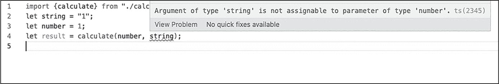
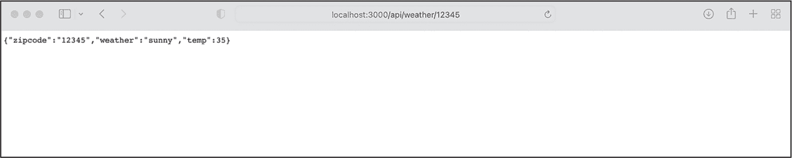

<hgroup>

## <samp class="SANS_Futura_Std_Bold_Condensed_B_11">3</samp> <samp class="SANS_Dogma_OT_Bold_B_11">TYPESCRIPT</samp>

</hgroup>


TypeScript 是一种为动态类型的 JavaScript 语言添加静态类型的编程语言。它是 JavaScript 的严格语法超集，这意味着所有现有的 JavaScript 都是有效的 TypeScript。相比之下，TypeScript 不是有效的 JavaScript，因为它提供了额外的功能。

本章将介绍使用 JavaScript 动态类型时可能遇到的陷阱，并解释 TypeScript 的静态类型如何帮助尽早捕捉错误，从而提高代码的稳定性。全栈开发者已广泛采用 TypeScript：它在最近的 Stack Overflow 开发者调查中获得了 *最受欢迎* 类别的亚军，并且在 *State of JS* 调查中有 78% 的参与者报告使用它。根据 [*https://<wbr>builtwith<wbr>.com*](https://builtwith.com)，TypeScript 是 7% 的前 10,000 个网站的基础。

我们将涵盖构建全栈应用程序所需的基础和高级 TypeScript 概念。在此过程中，你将了解语言中最常见的配置选项、最重要的类型，以及如何以及何时使用 TypeScript 的静态类型特性。

### <samp class="SANS_Futura_Std_Bold_B_11">TypeScript 的优势</samp>

TypeScript 使得使用 JavaScript 的类型系统时更少出错，因为它的编译器帮助我们立即看到类型错误。由于 JavaScript 是 *动态类型*，你在声明变量时不需要指定类型。只要运行时执行脚本，它就会根据使用情况检查这些类型。然而，这也意味着由于无效类型（例如，在一个存储数字而不是数组的变量上调用 <samp class="SANS_TheSansMonoCd_W5Regular_11">array.map</samp>）导致的错误，直到运行时才会被发现，而此时整个程序将失败。

除了是动态类型的，JavaScript 还是 *弱类型*，这意味着它会隐式地将变量转换为最合理的值。列表 3-1 显示了从数字到字符串的隐式转换。

```
let string = "1";
let number = 1;
let result;

result = number + number;
console.log("value: ", result, " type of ", typeof(result));

result = number + string;
console.log("value: ", result, " type of ", typeof(result)); 
```

列表 3-1：JavaScript 中的隐式数字到字符串的转换

我们声明了三个变量，首先为第一个变量赋值一个字符串，第二个变量赋值一个数字，第三个变量则是使用算术加法（<samp class="SANS_TheSansMonoCd_W5Regular_11">+</samp>）运算符将数字与自身相加的结果。然后，我们将这个加法运算的结果及其类型输出到控制台。如果你执行了这段代码，你会看到值是数字类型，并且运行时将类型指定为 <samp class="SANS_TheSansMonoCd_W5Regular_11">number</samp>。

接下来，我们再次使用相同的运算符，但这次我们不是将数值添加到<samp class="SANS_TheSansMonoCd_W5Regular_11">number</samp>变量中，而是将一个字符串添加到它上面。你应该看到日志中的值是<samp class="SANS_TheSansMonoCd_W5Regular_11">11</samp>，而不是<samp class="SANS_TheSansMonoCd_W5Regular_11">2</samp>，这是你可能预期的结果。此外，变量的赋值类型已变为<samp class="SANS_TheSansMonoCd_W5Regular_11">string</samp>。这发生是因为运行时环境需要处理一个不可能完成的任务：将数字与字符串相加。它通过隐式将数字转换为字符串，然后使用加号运算符将两个字符串连接起来，来解决这个问题。如果没有 TypeScript，我们只有在运行代码时才会注意到这种转换。

另一个由未指定类型的变量引起的常见问题与函数和 API *契约*（即代码接受和返回内容的约定）有关。当函数接受一个参数时，它隐式地期望该参数是特定类型的。但是没有 TypeScript，就无法确保参数类型正确。函数返回值也存在相同的问题。为了说明这一点，列表 3-2 将列表 3-1 中的代码进行了修改，使其使用一个函数来计算<sup class="SANS_TheSansMonoCd_W5Regular_11">result</sup>变量的值。

```
let string = "1";
let number = 1;
let result;

const calculate = (a, b) => a + b;

result = calculate(number, number);
console.log("value: ", result, " type of ", typeof(result));

result = calculate(number, string);
console.log("value: ", result, " type of ", typeof(result)); 
```

列表 3-2：由于隐式类型转换可能返回无效类型的函数

新的<samp class="SANS_TheSansMonoCd_W5Regular_11">calculate</samp>函数接受两个参数，<samp class="SANS_TheSansMonoCd_W5Regular_11">a</samp>和<samp class="SANS_TheSansMonoCd_W5Regular_11">b</samp>，并像之前一样将两个值相加。就像在列表 3-1 中一样，一旦我们将一个数字和一个字符串作为参数传递，函数就会返回一个字符串而不是数字。我们的函数可能期望两个参数都是数字，但在没有 TypeScript 的情况下，我们无法在不手动检查类型的情况下验证这一点，检查逻辑类似于列表 3-3 中的代码。

```
let string = "1";
let number = 1;
let result;

const calculate = (a, b) => {
    if (Number.isInteger(a) === false || Number.isInteger(b) === false) {
        throw new Error("Invalid type: a parameter is not an integer");
    } else {
        return a + b;
    }
};

result = calculate(number, number);
console.log("value: ", result, " type of ", typeof(result));

result = calculate(number, string);
console.log("value: ", result, " type of ", typeof(result)); 
```

列表 3-3：重构后的类型安全函数

在这里，我们使用原生的<samp class="SANS_TheSansMonoCd_W5Regular_11">isInteger</samp>函数来验证参数<samp class="SANS_TheSansMonoCd_W5Regular_11">a</samp>和<samp class="SANS_TheSansMonoCd_W5Regular_11">b</samp>是否为整数。第一次调用该函数时，我们传递两个整数，应该能按预期计算出结果。第二次调用时，我们传递了一个整数和一个字符串，在编辑器中看起来没问题。然而，当我们运行代码时，运行时环境应抛出错误<samp class="SANS_TheSansMonoCd_W5Regular_11">Invalid type: a parameter is not an integer</samp>。

手动检查类型有两个主要问题。首先，它会为我们的代码添加大量噪音，因为每次处理函数或 API 契约时，我们都需要检查所有可能的类型，例如在接收参数或返回值时。其次，我们在开发过程中无法收到问题的通知。为了查看动态类型语言中的错误，我们需要执行代码，以便解释器在运行时通知我们错误。

与动态类型语言不同，*静态*类型语言在代码编译时进行类型检查，而不是在运行时。TypeScript 编译器（TSC）负责这个任务；它可以在我们的代码编辑器或集成开发环境（IDE）的后台运行，并根据无效的类型使用即时报告所有错误。因此，你可以提前捕获错误，并查看每个变量的赋值类型和数据结构。

即使你没有设置即时反馈，在将代码投入使用之前运行 TSC 也是必要的，这样可以确保这些类型错误在它们可能出现之前就被捕获。检查这些错误的能力是使用 TypeScript 相较于 JavaScript 的最大优势之一。我们将在第 38 页的“类型注解”中讨论如何利用类型注解以及何时使用它们。

### <samp class="SANS_Futura_Std_Bold_B_11">设置 TypeScript</samp>

TypeScript 的语法不是有效的 JavaScript，因此常规的 JavaScript 运行时环境无法执行它。要在 Node.js 或浏览器中运行 TypeScript，我们需要首先使用 TSC 将其转换为常规的、向后兼容的 JavaScript。然后，我们可以执行生成的 JavaScript。

尽管被称为编译器，TSC 实际上并不会将 TypeScript 编译成 JavaScript。相反，它会将其*转译*。二者的区别在于抽象级别。编译器创建低级代码，而转译器是源代码到源代码的编译器，它生成的是大致相同抽象级别的语言的等效源代码。例如，你可以将 ES.Next 转译为传统的 JavaScript，或将 Python 2 转译为 Python 3。（话虽如此，*转译*和*编译*这两个术语经常被交替使用。）

除了将 TypeScript 转换为 JavaScript，TSC 还会检查你的代码是否存在类型错误，并验证函数之间的契约。转换和类型检查是独立进行的，TSC 会生成 JavaScript，无论你定义了什么类型。TypeScript 错误只是构建过程中发出的警告，它们不会阻止转换步骤，只要生成的 JavaScript 本身没有错误。

使用 TypeScript 不会影响你的代码性能。编译器会在转译步骤中移除类型和类型操作，本质上将所有 TypeScript 语法从实际的 JavaScript 代码中剥离。因此，它们不会影响运行时或最终代码的大小。尽管转译过程可能需要一些时间，但 TypeScript 的运行速度不会慢于 JavaScript。

#### <samp class="SANS_Futura_Std_Bold_Condensed_Oblique_BI_11">在 Node.js 中安装</samp>

如果你使用的是 Node.js，应该在项目的 *package.json* 文件中使用 <samp class="SANS_TheSansMonoCd_W5Regular_11">-</samp><samp class="SANS_TheSansMonoCd_W5Regular_11">-save-dev</samp> 标志将 TypeScript 和所有类型定义定义为开发依赖。无需全局安装 TypeScript。只需通过以下 npm 命令将 TypeScript 直接添加到你的项目中：

```
$ **npm install** **-****-save-dev typescript**
```

TypeScript 文件使用扩展名 *.ts*，因为 TypeScript 是 JavaScript 的超集，所有有效的 JavaScript 代码也自动是有效的 TypeScript 代码。因此，你可以将 *.js* 文件重命名为 *.ts*，并立即在现有代码中使用静态类型检查器。

*tsconfig.json* 文件定义了 TSC 配置选项。我们将在下一部分介绍最重要的选项。目前，运行以下命令以使用默认配置生成一个新的文件：

```
$ **npx tsc -init**
```

TSC 会在当前路径和所有父目录中查找这个文件。可选的 <samp class="SANS_TheSansMonoCd_W5Regular_11">-p</samp> 标志将 TypeScript 编译器直接指向该文件。然后，TSC 从该文件读取配置信息，并将其文件夹视为 TypeScript 的根目录。

> <samp class="SANS_Dogma_OT_Bold_B_21">注意</samp>

*如果你想在没有创建专用项目的情况下跟随本章示例，你可以在在线 playground 上运行代码，访问链接：* [`<wbr>www<wbr>.typescriptlang<wbr>.org<wbr>/play`](https://www.typescriptlang.org/play) *，而不是在本地安装 TypeScript。*

#### <samp class="SANS_Futura_Std_Bold_Condensed_Oblique_BI_11">tsconfig.json 文件</samp>

看一下 *tsconfig.json* 文件的基本结构。生成的文件内容取决于你安装的 TypeScript 版本，配置项大约有 100 个，但对于大多数项目，只有以下几个是相关的：

```
{
    "extends": "@tsconfig/recommended/tsconfig.json",
    "compilerOptions": {},
    "include": [],
    "exclude": []
} 
```

<samp class="SANS_TheSansMonoCd_W5Regular_11">extends</samp> 选项是一个字符串，用于配置指向另一个类似配置文件的路径。通常，此属性会扩展你用作模板的预设，并做一些小的、特定于项目的调整。它的工作方式类似于面向对象编程中的基于类的继承。预设会覆盖基础配置，而配置中的键值对会覆盖预设。这里的示例使用了推荐的 TypeScript 配置文件来覆盖默认设置。

<samp class="SANS_TheSansMonoCd_W5Regular_11">compilerOptions</samp> 字段配置了转译步骤。我们在 附录 A 中列出了其选项。<samp class="SANS_TheSansMonoCd_W5Regular_11">include</samp> 的值是一个字符串数组，指定了要包含在转译中的模式或文件名。<samp class="SANS_TheSansMonoCd_W5Regular_11">exclude</samp> 的值是一个字符串数组，指定了要排除的模式或文件名。请记住，TSC 会将这些模式应用于通过包含的模式找到的文件列表。通常，我们不需要包含或排除文件，因为整个项目将由 TypeScript 代码组成。因此，我们可以将这些数组留空。

#### <samp class="SANS_Futura_Std_Bold_Condensed_Oblique_BI_11">使用 TypeScript 进行动态反馈</samp>

大多数现代代码编辑器都支持 TypeScript，并且它们可以直接在代码中显示由 TSC 生成的错误。还记得我们用来解释 TypeScript 如何验证函数契约的 <samp class="SANS_TheSansMonoCd_W5Regular_11">calculate</samp> 函数吗？图 3-1 是来自 Visual Studio Code 的截图，突出了类型错误并提示了解决方案。



<samp class="SANS_Futura_Std_Book_Oblique_BI_11">图 3-1：在 Visual Studio Code 中使用 TypeScript</samp>

你可以使用任何代码编辑器或 IDE 来编写 TypeScript 代码，尽管建议使用像这样的能够提供动态反馈的编辑器。

### <samp class="SANS_Futura_Std_Bold_B_11">类型注解</samp>

类型注解是一种可选的方式，用于明确告诉运行时环境应该期待哪些类型。你可以按照以下模式添加它们：<samp class="SANS_TheSansMonoCd_W5Regular_Italic_I_11">变量: 类型</samp>。以下示例展示了一个版本的 <samp class="SANS_TheSansMonoCd_W5Regular_11">calculate</samp> 函数，在其中我们将两个参数的类型都标注为数字：

```
const calculate = (a: number, b: number) => a + b;
```

一些开发者倾向于在代码中的每一部分都添加类型，结果是增加了噪音，导致代码可读性降低。这种反模式被称为 *过度类型化*，源于对类型注解如何工作的错误理解。TypeScript 编译器会根据使用情况推断类型。因此，你不需要明确地为每个元素添加类型。相反，代码编辑器会在后台运行 TSC，并利用其结果显示推断出的类型信息和编译器错误，正如你在“使用 TypeScript 进行动态反馈”部分看到的那样。

类型注解的目的是确保代码遵守 API 契约。你会遇到三种需要验证契约的情况，其中只有一种特别重要。第一种情况是在声明变量时，通常不推荐使用；第二种情况是注解函数的返回值，这是可选的；而第三种情况是注解函数的参数，这是至关重要的。接下来我们将详细探讨这三种情况。

#### <samp class="SANS_Futura_Std_Bold_Condensed_Oblique_BI_11">声明变量</samp>

类型化变量的最直接方法是赋值或声明时。清单 3-4 通过显式地将变量 <samp class="SANS_TheSansMonoCd_W5Regular_11">weather</samp> 类型化为字符串，并将其赋值为字符串值来展示这一点。

```
let weather: string = "sunny";
```

清单 3-4：在变量声明时进行过度类型化

然而，在大多数情况下，这是一种过度类型声明，因为你可以利用编译器的类型推断。清单 3-5 展示了使用类型推断的替代模式。

```
let weather = "sunny";
```

清单 3-5：根据变量的值推断类型

由于 TSC 会自动推断该变量的类型，代码编辑器应该在你悬停在变量上时显示类型信息。如果没有显式注解，我们将拥有更简洁的语法，并避免冗余的类型声明给代码带来的杂音。这提高了代码的可读性，这也是为什么通常应该避免这种过度类型化。

#### <samp class="SANS_Futura_Std_Bold_Condensed_Oblique_BI_11">声明返回值</samp>

虽然 TypeScript 可以推断函数的返回类型，但你通常会希望显式地注解它。这种代码模式确保函数契约得到遵守，因为编译器会在函数定义的位置而不是使用位置显示实现错误。

在这种情况下使用类型注解的另一个原因是，作为程序员，你必须明确地定义函数的作用。通过澄清函数的输入和输出类型，你将更好地理解你实际上希望函数执行什么。清单 3-6 展示了如何在声明时声明函数的返回类型。

```
function getWeather(): string {
    const weather = "sunny";
    return weather;
} 
```

清单 3-6：在声明时类型化函数的返回值

我们创建一个返回先前声明的 <samp class="SANS_TheSansMonoCd_W5Regular_11">weather</samp> 变量的函数。<samp class="SANS_TheSansMonoCd_W5Regular_11">weather</samp> 变量具有推断出的字符串类型。因此，函数返回一个字符串。我们的类型定义显式地设置了函数的返回类型。

#### <samp class="SANS_Futura_Std_Bold_Condensed_Oblique_BI_11">声明函数的参数</samp>

注解函数的参数是至关重要的，因为 TypeScript 在大多数情况下没有足够的信息来推断函数参数。通过类型化这些参数，你告诉编译器在调用函数并传递参数时检查类型。请查看 清单 3-7 以查看此模式的实际应用。

```
const weather = "sunny";
function getWeather(weather: string): string {
    return weather;
};
getWeather(weather); 
```

清单 3-7：类型化函数的参数

我们不再将 <samp class="SANS_TheSansMonoCd_W5Regular_11">weather</samp> 变量声明为函数内部的常量，而是希望返回值动态变化。因此，我们修改函数以接受一个参数并立即返回它。然后，我们用 <samp class="SANS_TheSansMonoCd_W5Regular_11">weather</samp> 常量作为参数来调用该函数。

良好的 TypeScript 代码避免冗余，并依赖于类型推断注解。它始终对函数的参数进行注解，并选择注解返回值，但从不注解局部变量。

### <samp class="SANS_Futura_Std_Bold_B_11">内建类型</samp>

在使用 TypeScript 及其注解之前，你需要了解可用的类型。TypeScript 的主要优点之一是，它允许你显式声明 JavaScript 的任何原始类型。此外，TypeScript 还添加了自己的类型，其中最重要的包括 <samp class="SANS_TheSansMonoCd_W5Regular_11">联合类型</samp>、<samp class="SANS_TheSansMonoCd_W5Regular_11">元组</samp>、<samp class="SANS_TheSansMonoCd_W5Regular_11">any</samp> 和 <samp class="SANS_TheSansMonoCd_W5Regular_11">void</samp>。你还可以定义自定义类型和接口。

#### <samp class="SANS_Futura_Std_Bold_Condensed_Oblique_BI_11">原始 JavaScript 类型</samp>

JavaScript 有五种原始类型：字符串、数字、布尔值、undefined 和 null。语言中的其他所有内容都被视为对象。列表 3-8 展示了使用额外的 TypeScript 类型注解定义这些原始 JavaScript 类型的语法。（记住，大多数时候，你可以依赖编译器的类型推断来处理这种情况。）

```
let stringType: string = "bar";
let booleanType: boolean = true;
let integerType: number = 1;
let floatType: number = 1.5;
let nullType: null = null;
let undefinedType: undefined = undefined; 
```

列表 3-8：带有 TypeScript 类型注解的 JavaScript 原始类型

首先，我们定义一个字符串变量和一个布尔值，并使用 TypeScript 注解。这些类型与 JavaScript 中的字符串和布尔值相同。然后，我们定义两个数字。像 JavaScript 一样，TypeScript 使用一个通用类型来表示数字，不区分整数和浮点数。最后，我们来看 TypeScript 的 null 和 undefined 类型。它们的行为与 JavaScript 中同名的原始类型相同。*Null* 表示一个为空或不存在的值，表示故意缺少一个值。相比之下，*undefined* 表示一个值的无意缺失。在 列表 3-5 中，我们没有为 undefined 类型赋值，因为我们并不知道它的值。

#### <samp class="SANS_Futura_Std_Bold_Condensed_Oblique_BI_11">联合类型</samp>

你需要了解一些额外的类型，因为类型注解越精确，TSC 越能提供更多帮助。TypeScript 将 <samp class="SANS_TheSansMonoCd_W5Regular_11">union</samp> 类型引入了 JavaScript 生态系统。*联合类型*是可以拥有多种数据类型的变量或参数。列表 3-9 展示了一个示例，说明了一个可以是字符串或数字的 <samp class="SANS_TheSansMonoCd_W5Regular_11">union</samp> 类型。

```
let stringOrNumberUnionType: string | number;
stringOrNumberUnionType = "bar";
stringOrNumberUnionType = 1;
stringOrNumberUnionType = true; 
```

列表 3-9：TypeScript 的 <samp class="SANS_TheSansMonoCd_W5Regular_Italic_I_11">union</samp> 类型

我们声明了一个 <samp class="SANS_TheSansMonoCd_W5Regular_11">union</samp> 类型的变量，该变量可以包含一个字符串或一个数字，但不能包含其他类型。只要我们赋值一个布尔变量，TSC 就会抛出错误，IDE 会显示消息 <samp class="SANS_TheSansMonoCd_W5Regular_11">Type 'boolean' is not assignable to type 'string | number'</samp>。

尽管你可能会发现 <samp class="SANS_TheSansMonoCd_W5Regular_11">union</samp> 类型在标注可以包含不同类型的函数参数和数组时很有用，但你应该谨慎使用它们，并尽量避免使用。这是因为，在处理 <samp class="SANS_TheSansMonoCd_W5Regular_11">union</samp> 类型的项之前，你需要进行额外的手动类型检查，否则它们可能会导致错误。例如，如果你遍历一个字符串或数字数组并尝试对所有项求和，你首先需要将所有字符串转换为数字。否则，JavaScript 会隐式地将数字转换为字符串，就像本章前面所示的那样。

#### <samp class="SANS_Futura_Std_Bold_Condensed_Oblique_BI_11">数组类型</samp>

TypeScript 提供了一个通用的 <samp class="SANS_TheSansMonoCd_W5Regular_11">array</samp> 类型，提供类似 JavaScript 数组的数组函数。然而，仔细查看数组类型注解的语法，见列表 3-10。你会注意到，数组的类型取决于数组项的类型。

```
let genericArray: [] = [];
genericArray.push(1);

let numberArray: number[] = [];
numberArray.push(1); 
```

列表 3-10：已标注类型的数组

首先，我们定义了一个没有指定项类型的数组。不幸的是，看似通用数组的定义，实际上会在后续出现问题。只要我们尝试添加一个值，TSC 就会抛出错误 <samp class="SANS_TheSansMonoCd_W5Regular_11">Argument of type 'number' is not assignable to parameter of type 'never'</samp>，因为该数组没有类型标注。

因此，我们需要为数组中的项指定类型。因此，我们创建了一个数组 <samp class="SANS_TheSansMonoCd_W5Regular_11">numberArray</samp>，其中每个项的类型都是数字。现在，我们可以向数组中添加数值，而不会遇到错误。

#### <samp class="SANS_Futura_Std_Bold_Condensed_Oblique_BI_11">对象类型</samp>

TypeScript 的内置 <samp class="SANS_TheSansMonoCd_W5Regular_11">object</samp> 类型与 JavaScript 的 object 类型相同。尽管可以为 TSC 定义属性类型以进行类型检查，但编译器无法确保属性的顺序。尽管如此，它仍然会对它们进行类型检查，如 列表 3-11 所示。

```
let weatherDetail: {
    weather: string,
    zipcode: string,
    temp: number
} = {weather: "sunny", zipcode: "00000", temp: 1};
weatherDetail.weather = 2; 
```

列表 3-11：已类型化的对象

这里我们定义了一个包含三个属性的对象：两个属性为字符串类型，另一个属性为数字类型。然后我们尝试将一个数字赋值给被注解为字符串类型的属性 <samp class="SANS_TheSansMonoCd_W5Regular_11">weather</samp>。现在 TSC 会提示我们错误，解释说我们赋值的类型不正确。

请注意，通常应避免像这个例子中那样内联为对象指定类型。相反，最好创建一个自定义类型，它是可重用的，能够避免代码混乱，从而提高代码的可读性。我们在第 44 页的“自定义类型和接口”中讨论如何创建和使用它们。

#### <samp class="SANS_Futura_Std_Bold_Condensed_Oblique_BI_11">The</samp> <samp class="SANS_Futura_Std_Bold_Condensed_Oblique_BI_11">tuple</samp> <samp class="SANS_Futura_Std_Bold_Condensed_Oblique_BI_11">Type</samp>

TypeScript 为 JavaScript 添加的另一个常见类型是 <samp class="SANS_TheSansMonoCd_W5Regular_11">tuple</samp> 类型。如 列表 3-12 所示，*元组* 是具有指定类型项数量的数组。TypeScript 的元组与您可能在 Python 和 C# 等编程语言中遇到的类似。

```
let validTuple: [string, number] = ["bar", 1];
let invalidTuple: [string, number] = [1, "bar"]; 
```

列表 3-12：TypeScript 的 <samp class="SANS_TheSansMonoCd_W5Regular_Italic_I_11">tuple</samp> 类型

我们定义了两个元组。在这两个元组中，第一个数组项是一个字符串，第二个是一个数字。如果添加到元组中的类型、顺序或项数与元组声明不符，TSC 会抛出错误。这里，第一个赋值是可以接受的，而第二个赋值会抛出两个错误，表明类型不匹配。

#### <samp class="SANS_Futura_Std_Bold_Condensed_Oblique_BI_11">The</samp> <samp class="SANS_Futura_Std_Bold_Condensed_Oblique_BI_11">any</samp> <samp class="SANS_Futura_Std_Bold_Condensed_Oblique_BI_11">Type</samp>

TypeScript 的 <samp class="SANS_TheSansMonoCd_W5Regular_11">any</samp> 类型是通用的，这意味着它可以接受任何值，因此应避免使用它。正如在 列表 3-13 中所示，它接受所有值而不抛出错误，这违背了静态类型检查的目的。

```
let indifferent: any = true;
indifferent = 1;
indifferent = []; 
```

列表 3-13：TypeScript 的 <samp class="SANS_TheSansMonoCd_W5Regular_Italic_I_11">any</samp> 类型

使用 <samp class="SANS_TheSansMonoCd_W5Regular_11">any</samp> 可能看起来是一个简单的选择，且它确实很诱人作为一种逃生路径。但必须避免这样做。当你将 <samp class="SANS_TheSansMonoCd_W5Regular_11">any</samp> 作为值传递给某个函数时，你打破了函数声明中所指定的契约，而当你使用 <samp class="SANS_TheSansMonoCd_W5Regular_11">any</samp> 来定义契约时，实际上根本没有契约。

若要查看使用 <samp class="SANS_TheSansMonoCd_W5Regular_11">any</samp> 类型导致问题的场景，请参见 Listing 3-14。

```
const calculate = (a**: any**, b**: any**)**: any** => a + b;
console.log(calculate (1,1));
console.log(calculate (**"1"**,1)); 
```

Listing 3-14：使用 <samp class="SANS_TheSansMonoCd_W5Regular_Italic_I_11">any</samp> 类型带来的问题

我们复用了 <samp class="SANS_TheSansMonoCd_W5Regular_11">calculate</samp> 函数，它用于加法运算。当我们传递两个数字值时，我们得到了预期的输出 <samp class="SANS_TheSansMonoCd_W5Regular_11">2</samp>。在之前的示例中，我们将参数类型指定为数字，从而避免了使用无效类型作为参数。

然而，当我们用 <samp class="SANS_TheSansMonoCd_W5Regular_11">any</samp> 替代数字并传递一个字符串给函数时，TSC 并不会抛出错误。JavaScript 会隐式地将数字转换为字符串并返回一个意外的值 <samp class="SANS_TheSansMonoCd_W5Regular_11">11</samp>。我们在本章开始时的无类型版本函数中看到了这种行为。如你所见，使用 <samp class="SANS_TheSansMonoCd_W5Regular_11">any</samp> 就等同于根本没有使用任何类型。

尽管 <samp class="SANS_TheSansMonoCd_W5Regular_11">any</samp> 类型很方便，但它会在编程时掩盖错误，隐藏你的类型设计，使得类型检查失去意义。它还会阻止你的 IDE 显示错误和无效类型。

#### <samp class="SANS_Futura_Std_Bold_Condensed_Oblique_BI_11">The</samp> <samp class="SANS_Futura_Std_Bold_Condensed_Oblique_BI_11">void</samp> <samp class="SANS_Futura_Std_Bold_Condensed_Oblique_BI_11">Type</samp>

TypeScript 的 <samp class="SANS_TheSansMonoCd_W5Regular_11">void</samp> 类型与 <samp class="SANS_TheSansMonoCd_W5Regular_11">any</samp> 类型相反：它表示没有类型。它唯一的使用场景是注释那些不应返回值的函数的返回值，如 Listing 3-15 所示。

```
function log(msg: string)**: void** {
    console.log(msg);
} 
```

Listing 3-15：TypeScript 的 <samp class="SANS_TheSansMonoCd_W5Regular_Italic_I_11">void</samp> 类型

我们在这里定义的自定义日志函数向控制台传递一个参数。它没有返回任何值，因此我们将 <samp class="SANS_TheSansMonoCd_W5Regular_11">void</samp> 作为返回类型。

要了解更多 TypeScript 类型和其他语言的重要细节，请查看 *TypeScript 手册*，访问 [*https://<wbr>www<wbr>.typescriptlang<wbr>.org<wbr>/docs<wbr>/handbook<wbr>/intro<wbr>.html*](https://www.typescriptlang.org/docs/handbook/intro.html)。

### <samp class="SANS_Futura_Std_Bold_B_11">自定义类型和接口</samp>

之前的章节已经介绍了足够的 TypeScript 内容，可以开始使用该语言。然而，了解一些更高级的概念会对你有帮助。本节将向你展示如何在 TypeScript 代码中创建自定义类型和使用未类型化的第三方库。你还将学习何时创建新类型以及何时使用自定义接口。

在使用 TypeScript 时，请记住，*没有*顶级导入或导出的 TypeScript 文件不是一个模块；因此，它在 *全局* 范围内运行。因此，它的所有声明在其他模块中都可以访问。相比之下，*有*顶级导入或导出的 TypeScript 文件是其自己的模块，所有声明都限制在 *模块* 范围内，意味着它们只在此模块的范围内可用。

#### <samp class="SANS_Futura_Std_Bold_Condensed_Oblique_BI_11">定义自定义类型</samp>

TypeScript 允许你使用 <samp class="SANS_TheSansMonoCd_W5Regular_11">type</samp> 关键字定义自定义类型。自定义类型是简化代码的好方法。为了了解如何简化代码，可以再次查看 列表 3-8 中的代码，在那里你创建了一个类型化对象。现在看看 列表 3-16，它通过自定义类型定义优化了代码。你应该会发现它更简洁、更易读。

```
**type** WeatherDetailType **= {**
    weather: string;
    zipcode: string;
    temp?: number;
};

let weatherDetail: WeatherDetailType = {
    weather: "sunny",
    zipcode: "00000",
    temp: 30
};
const getWeatherDetail = (data: WeatherDetailType): WeatherDetailType => data; 
```

列表 3-16：使用 TypeScript 定义的类型化对象的自定义类型

我们使用 <samp class="SANS_TheSansMonoCd_W5Regular_11">type</samp> 关键字创建了一个自定义类型 <samp class="SANS_TheSansMonoCd_W5Regular_11">WeatherDetailType</samp>。请注意，整体语法类似于定义一个对象；我们使用等号（<samp class="SANS_TheSansMonoCd_W5Regular_11">=</samp>）将定义赋值给自定义类型。

自定义类型有两个必需的属性：<samp class="SANS_TheSansMonoCd_W5Regular_11">weather</samp> 和 <samp class="SANS_TheSansMonoCd_W5Regular_11">zipcode</samp>。此外，它还有一个可选的 <samp class="SANS_TheSansMonoCd_W5Regular_11">temp</samp> 属性，如问号（<samp class="SANS_TheSansMonoCd_W5Regular_11">?</samp>）所示。现在，当我们创建 <samp class="SANS_TheSansMonoCd_W5Regular_11">getWeatherDetail</samp> 函数时，我们可以将参数 <samp class="SANS_TheSansMonoCd_W5Regular_11">weatherDetail</samp> 注解为类型为 <samp class="SANS_TheSansMonoCd_W5Regular_11">WeatherDetailType</samp> 的对象。使用这种技巧，我们避免了使用内联注解，并且可以在以后重用我们的自定义类型，例如注解函数的返回类型。

#### <samp class="SANS_Futura_Std_Bold_Condensed_Oblique_BI_11">定义接口</samp>

除了类型，TypeScript 还有接口。然而，类型和接口之间的区别并不明确。只要你在代码中遵循一种约定，可以自由选择使用其中之一。

一般来说，我们认为 *类型* 定义回答了这样一个问题：“这个数据是什么类型？”一个可能的答案是联合类型或元组。*接口* 是一种描述某些数据形状的方式，比如一个对象的属性。它回答了这样一个问题：“这个对象有哪些属性？”最实际的区别是，与接口不同，类型在声明后不能直接修改。有关这一区别的深入了解，请参考 *TypeScript 手册*。

作为一种经验法则，使用接口来定义一个新对象或对象的方法。更一般来说，考虑使用接口而不是类型，因为接口提供了更精确的错误信息。一个经典的 React 接口用例是定义特定组件的属性。列表 3-17 展示了如何使用 `<samp class="SANS_TheSansMonoCd_W5Regular_11">interface</samp>` 关键字创建一个新接口，替代 列表 3-16 中的类型。

```
**interface** WeatherProps **{**
    weather: string;
    zipcode: string;
    temp?: number;
}

const weatherComponent = (props: WeatherProps): string => props.weather; 
```

列表 3-17：TypeScript 函数的自定义接口

在这里，我们使用 `<samp class="SANS_TheSansMonoCd_W5Regular_11">interface</samp>` 关键字来定义一个新的接口。与自定义类型的定义不同，接口定义不会使用等号将接口的属性分配给其名称。然后，我们使用自定义接口来类型化 `<samp class="SANS_TheSansMonoCd_W5Regular_11">weatherComponent</samp>` 的属性对象 `<samp class="SANS_TheSansMonoCd_W5Regular_11">props</samp>`，它返回一个字符串。

#### <samp class="SANS_Futura_Std_Bold_Condensed_Oblique_BI_11">使用类型声明文件</samp>

要普遍使用自定义类型，你可以将它们定义在 *类型声明文件* 中，这些文件的扩展名是 *.d.ts*。与常规的 TypeScript 文件（*.ts* 或 *.tsx* 扩展名）不同，类型声明文件不应包含任何实现代码。相反，TSC 使用这些类型定义来理解自定义类型并进行类型检查。它们不会被转译为 JavaScript，也永远不会成为执行脚本的一部分。

当你需要与外部代码库合作时，类型声明文件非常有用。通常，第三方库不是用 TypeScript 编写的，因此它们没有为其代码库提供类型声明文件。幸运的是，DefinitelyTyped 仓库在 [*http://<wbr>definitelytyped<wbr>.github<wbr>.io*](http://definitelytyped.github.io) 提供了超过 7,000 个库的类型声明文件。使用这些文件，你可以为这些库添加 TypeScript 支持。

类型声明文件被集中在 npm 的 <samp class="SANS_TheSansMonoCd_W5Regular_11">@types</samp> 范围内。这个范围包含了来自 DefinitelyTyped 的所有声明。因此，它们易于查找，并且在你的 *package.json* 文件中被分组在一起。所有来自 <samp class="SANS_TheSansMonoCd_W5Regular_11">@types</samp> 范围的类型声明文件应视为项目的开发依赖。因此，我们在 <samp class="SANS_TheSansMonoCd_W5Regular_11">npm install</samp> 命令中使用 <samp class="SANS_TheSansMonoCd_W5Regular_11">--save-dev</samp> 标志来添加它们。

列表 3-18 显示了一个最小化的类型声明文件示例，该文件导出了一个 API 的类型和接口。

```
interface WeatherQueryInterface {
    zipcode: string;
}

type WeatherDetailType = {
    weather: string;
    zipcode: string;
    temp?: number;
}; 
```

列表 3-18：定义自定义类型和接口

将这些定义保存在名为 *custom.d.ts* 的文件中，放在你的根目录下。TSC 应该会自动加载这些定义。现在，你可以在 TypeScript 模块中使用来自该文件的类型和接口。

<samp class="SANS_Futura_Std_Heavy_B_21">练习 3：使用 TypeScript 扩展 Express.js</samp>

让我们运用你对 TypeScript 的新知识，重写你在练习 1 和 2 中创建的 Express.js 服务器。除了添加类型注解，我们还将通过使用自定义类型向服务器添加一个新路由。

#### <samp class="SANS_Futura_Std_Bold_Condensed_Oblique_BI_11">设置</samp>

首先按照第 36 页“设置 TypeScript”中描述的步骤将 TypeScript 添加到项目中。接着，因为 Express.js 没有类型定义，运行以下命令从 DefinitelyTyped 向项目中添加类型定义：

```
$ **npm install --save-dev @types/express**
```

你的 *package.json* 文件现在应该如下所示：

```
{
    "name": "sample-express",
    "version": "1.0.0",
    "description": "sample express server",
    "license": "ISC",
    "type": "module",
    "dependencies": {
        "express": "⁴.18.2",
        "node-fetch": "³.2.6"
    },
    "devDependencies": {
        **"@types/express": "⁴.17.15",**
        **"typescript": "⁴.9.4"**
    }
} 
```

现在你可以为项目创建配置文件和类型声明文件了。

#### <samp class="SANS_Futura_Std_Bold_Condensed_Oblique_BI_11">创建 tsconfig.json 文件</samp>

在 *sample-express* 文件夹中创建一个新的 *tsconfig.json* 文件，紧挨着 *index.ts* 文件，或者打开你之前创建的文件。然后将其内容添加或替换为以下代码：

```
{
    "compilerOptions": {
        "esModuleInterop": true,
        "module": "es6",
        "moduleResolution": "node",
        "target": "es6",
        "noImplicitAny": true
    }
} 
```

我们为我们的简单 Express.js 服务器配置 TypeScript，这只需要一些设置。我们为 TypeScript 代码使用 ES.Next 模块，并且因为我们希望在将 TypeScript 转换为 JavaScript 后仍然保留这些模块，我们将 <samp class="SANS_TheSansMonoCd_W5Regular_11">module</samp> 和 <samp class="SANS_TheSansMonoCd_W5Regular_11">target</samp> 设置为 <samp class="SANS_TheSansMonoCd_W5Regular_11">es6</samp>。*express* 包是一个 CommonJS 模块。因此，我们需要使用 <samp class="SANS_TheSansMonoCd_W5Regular_11">esModuleInterop</samp> 选项，并将 <samp class="SANS_TheSansMonoCd_W5Regular_11">moduleResolution</samp> 设置为 <samp class="SANS_TheSansMonoCd_W5Regular_11">node</samp>。最后，我们使用 <samp class="SANS_TheSansMonoCd_W5Regular_11">noImplicitAny</samp> 选项，禁止隐式使用 <samp class="SANS_TheSansMonoCd_W5Regular_11">any</samp> 类型，并要求显式指定类型。附录 A 更详细地描述了这些配置选项。

#### <samp class="SANS_Futura_Std_Bold_Condensed_Oblique_BI_11">定义自定义类型</samp>

对于我们的服务器，我们将遵循一个简单的经验法则：每次使用一个对象时，我们应该考虑向项目中添加自定义类型或接口。如果对象是函数参数，我们将创建一个自定义接口。如果我们多次使用这个特定的对象，我们将创建一个自定义类型。

为了为这个示例项目定义自定义类型，我们在 *sample-express* 文件夹中创建一个名为 *custom.d.ts* 的文件，并添加来自 Listing 3-19 的代码。

```
type responseItemType = {
    id: string;
    name: string;
};

type WeatherDetailType = {
    zipcode: string;
    weather: string;
    temp?: number;
};

interface WeatherQueryInterface {
    zipcode: string;
} 
```

Listing 3-19：custom.d.ts 文件

我们创建了两个自定义类型和一个接口。一个定义了异步 API 调用的响应项。另一个类型和接口类似于本章前面显示的示例。它们对于我们即将创建的新天气路由是必要的。

#### <samp class="SANS_Futura_Std_Bold_Condensed_Oblique_BI_11">向 routes.ts 文件添加类型注解</samp>

接下来，我们必须向服务器代码添加类型注解。将 *sample-express* 文件夹中的 *routes.js* 文件重命名为 *routes.ts*，以便为该文件启用 TSC。你应该立即看到错误和警告出现在编辑器中。花些时间查看这些错误，然后调整内容以匹配 Listing 3-20 中的代码。我们已将所有类型注解加粗。

```
import fetch from "node-fetch";

const routeHello = ()**: string** => "Hello World!";

const routeAPINames = async ()**: Promise<string>** => {
    const url = "https://www.usemodernfullstack.dev/api/v1/users";
    let data**: responseItemType[];**
    try {
        const response = await fetch(url);
        data = **(**await response.json()**) as responseItemType[];**
    } catch (err) {
        return "Error";
    }
    const names = data
        .map((item) => `id: ${item.id}, name: ${item.name}`)
        .join("<br>");
    return names;
};

const routeWeather = (query**: WeatherQueryInterface**)**: WeatherDetailType** =>
    queryWeatherData(query);

const queryWeatherData = (query**: WeatherQueryInterface**)**: WeatherDetailType** => {
    return {
        zipcode: query.zipcode,
        weather: "sunny",
        temp: 35
    };
};

export {routeHello, routeAPINames, routeWeather}; 
```

Listing 3-20：typed routes.ts 文件

根据第 38 页“类型注解”部分讨论的原则，我们只注解函数的参数和返回类型。当局部变量的类型无法推断时，我们才对其进行注解，例如在将<samp class="SANS_TheSansMonoCd_W5Regular_11">fetch</samp>响应转换为 JSON 时。在这里，我们需要显式地为变量指定自定义类型<samp class="SANS_TheSansMonoCd_W5Regular_11">responseItemType</samp>，并将转换的返回值强制转换为<samp class="SANS_TheSansMonoCd_W5Regular_11">responseItemType</samp>数组。

在清单的其余部分，我们为额外的天气路由创建函数。我们使用自定义接口为两个函数的参数类型注解，并使用自定义类型为它们的返回类型注解。在这个基本示例中，查询函数返回大多数静态数据，唯一不同的是邮政编码，它是从传递的参数中获取的。常规实现会使用邮政编码查询数据库并检索实际数据。

最后，我们将新的天气端点路由添加到<sup class="SANS_TheSansMonoCd_W5Regular_11">export</sup>语句中。

#### <samp class="SANS_Futura_Std_Bold_Condensed_Oblique_BI_11">为 index.ts 文件添加类型注解</samp>

将*sample-express*文件夹中的文件*index.js*重命名为*index.ts*，并调整代码以匹配清单 3-20。除了必要的类型注解，还需要创建一个新的端点，并按照 TypeScript 约定，为未使用的参数加上下划线前缀（<samp class="SANS_TheSansMonoCd_W5Regular_11">_</samp>），如清单 3-21 所示。

```
import {routeHello, routeAPINames, **routeWeather**} from "./routes.js";
import express, {**Request, Response**} from "express";

const server = express();
const port = 3000;

server.get("/hello", function (**_req: Request**, res**: Response**): void {
    const response = routeHello();
    res.send(response);
});

server.get("/api/names",
    async function (**_req: Request**, res**: Response): Promise<void>** {
        let response: string;
        try {
            response = await routeAPINames();
            res.send(response);
        } catch (err) {
            console.log(err);
        }
    }
);

server.get(
    "/api/weather/**:zipcode**",
    function (req**: Request**, res**: Response**): **void** {
        const response = routeWeather({zipcode: **req.params.zipcode**});
        res.send(response);
    }
);

server.listen(port, function (): void {
    console.log("Listening on " + port);
}); 
```

清单 3-21：带有类型注解的 index.ts 文件

首先，我们从可用的路由中导入新的天气路由，并从*express*包中导入<Request>和<Response>类型。这些都是具名导出。因此，我们使用花括号（<samp class="SANS_TheSansMonoCd_W5Regular_11">{}</samp>）。

然后，按照最佳实践，我们添加代码注解，并同时为未使用的<sup class="SANS_TheSansMonoCd_W5Regular_11">req</sup>参数加上下划线前缀。TSC 会遵循函数式编程语言的约定，忽略这些参数。*api/names*入口点被标记为异步函数，因此它需要返回一个包裹在 Promise 中的值。因此，什么也不返回，我们将<sup class="SANS_TheSansMonoCd_W5Regular_11">void</sup>作为 Promise 的值返回。

在以下代码行中，我们为新的 */api/weather/:zipcode* 端点创建了一个额外的路由。冒号 (<samp class="SANS_TheSansMonoCd_W5Regular_11">:</samp>) 在请求的 <samp class="SANS_TheSansMonoCd_W5Regular_11">params</samp> 对象上创建了一个参数。我们通过 <samp class="SANS_TheSansMonoCd_W5Regular_11">req.params.zipcode</samp> 获取 <samp class="SANS_TheSansMonoCd_W5Regular_11">zipcode</samp> 的值，并将其传递给 <samp class="SANS_TheSansMonoCd_W5Regular_11">routeWeather</samp> 函数。请注意，这次请求参数中没有下划线。最后，我们使用与之前相同的函数启动 Express.js 服务器并监听 3000 端口。

#### <samp class="SANS_Futura_Std_Bold_Condensed_Oblique_BI_11">转译并运行代码</samp>

要使用 TypeScript 编译器将代码转译为 JavaScript，请在命令行中使用 <samp class="SANS_TheSansMonoCd_W5Regular_11">npx</samp> 运行 TSC：

```
$ **npx tsc**
```

TSC 从 TypeScript 文件生成了两个新文件，*index.js* 和 *routes.js*。通过命令行使用常规的 Node.js 调用启动服务器：

```
$ **node index.js**
Listening on 3000 
```

现在在浏览器中访问 *http://localhost:3000/api/weather/12345*。你应该能看到 ZIP 代码 12345 的天气详情，如图 3-2 所示。



<samp class="SANS_Futura_Std_Book_Oblique_BI_11">图 3-2：来自 Node.js Web 服务器的浏览器响应</samp>

成功！你写出了你的第一个 TypeScript 应用程序。

### <samp class="SANS_Futura_Std_Bold_B_11">总结</samp>

本章介绍了你需要了解的关于 TypeScript 的知识，以便创建一个全栈应用程序。我们在一个新项目中设置了 TypeScript 和 TSC，然后讨论了其最重要的配置选项。接下来，你学习了如何高效使用 TypeScript，利用类型注解推断来避免过度输入。

我们还讨论了原始类型和高级内置类型，并讲解了如何创建自定义类型和接口。最后，你利用新学到的知识将 TypeScript 添加到之前练习中构建的 Express.js 服务器，并使用类型注解、自定义类型和接口重构了代码。

如果你想成为 TypeScript 专家，我推荐阅读 *TypeScript 手册* 和 [*https://<wbr>www<wbr>.typescripttutorial<wbr>.net*](https://www.typescripttutorial.net) 上的教程。在下一章，你将了解 React，这是一种用于构建用户界面的声明式 JavaScript 库。
