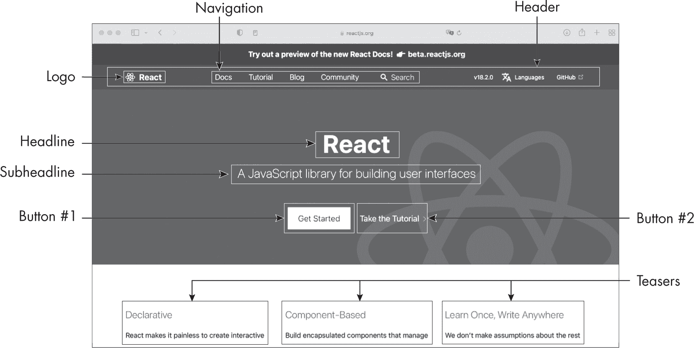
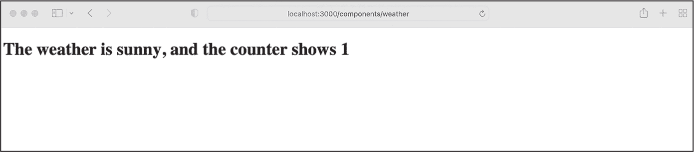

<hgroup>

## <samp class="SANS_Futura_Std_Bold_Condensed_B_11">4</samp> <samp class="SANS_Dogma_OT_Bold_B_11">REACT</samp>

</hgroup>


开发人员可以使用 React 库来创建全栈应用程序的用户界面。React 基于 Node.js 生态系统构建，作为最常用的 Web 框架之一，目前它是超过百分之多少最受欢迎网站的基础。

要有效地使用 React，必须理解用于定义用户界面元素外观的语法，并将这些语法组合成可以动态更新的 React 组件。本章涵盖了开始使用此库开发全栈应用程序所需了解的所有内容。

### <samp class="SANS_Futura_Std_Bold_B_11">React 的作用</samp>

现代前端架构将应用程序的用户界面拆分成小的、独立的和可重用的项目。其中一些，如标题、导航和徽标，可能每个页面只出现一次，而其他一些则是重复出现的元素，形成页面的内容，如标题、按钮和广告。 图 4-1 显示了其中的一些项目。React 的语法遵循这一模式；该库专注于构建这些独立的组件，并通过这样做，帮助我们更高效地开发应用程序。



<samp class="SANS_Futura_Std_Book_Oblique_BI_11">图 4-1：用户界面组件</samp>

React 使用*声明式*编程范式，通过这种方式，你可以通过描述期望的结果来创建用户界面，而不是像在*命令式*编程中那样明确列出创建它所需的所有步骤。声明式范式的经典例子是 HTML。使用 HTML，你描述网页的元素，然后浏览器渲染页面。相比之下，你可以使用 JavaScript 编写一个命令式程序来创建每个 HTML 元素，在此过程中，你需要明确列出构建网站的步骤。

此外，这些用户界面组件是*响应式*的。这意味着两件事：一是它们处理自己独立的状态，二是每个组件在其状态变化后立即更新页面的 HTML。对 React 代码的修改会立刻影响浏览器的*文档对象模型（DOM）*，DOM 将网站表示为一棵树，每个 HTML 元素都是一个节点。DOM 还为每个节点和网站本身提供 API，使得脚本能够修改网站或特定的节点。

DOM 操作，如重新渲染一个组件，是比较昂贵的。为了更新 DOM，React 使用*虚拟 DOM*，这是实际浏览器 DOM 的内存中克隆版本，稍后会与真实 DOM 进行同步。这个虚拟 DOM 允许增量更新，从而减少浏览器中耗费资源的操作次数。虚拟 DOM 是 React 的一个关键原则。React 通过每次调用其渲染函数来计算虚拟 DOM 与真实 DOM 之间的差异，然后决定更新什么内容。通常，React 会执行批量更新，以进一步降低性能影响。这个协调过程使 React 能够提供快速且响应迅速的用户界面。

虽然 React 主要是一个用户界面库，但开发者也可以用它来构建不需要中间件或后端的单页面应用。这些应用无非是一个在浏览器中渲染的视图层。它们在某种程度上是动态的：例如，我们可以更改页面的语言、打开图片画廊或切换某个元素的可见性。然而，所有这些都发生在浏览器中，通过额外的 React 模块，而不是在服务器上。

我们还可以执行更高级的功能，比如通过 React 的 Router 模块，仅在浏览器内更新浏览器的地址栏位置，以模拟不同页面的存在。这个模块允许我们在前端定义路由，类似于我们在 Express.js 服务器中定义的路由。一旦用户点击一个内部链接，路由组件就会更新视图并更改浏览器的地址。这让用户感觉他们加载了另一个 HTML 页面。实际上，我们只是更改了当前页面的内容。通过这样做，我们避免了另一轮服务器请求，因此模拟的页面加载得更快。此外，因为我们的 JavaScript 代码控制了页面之间的过渡，我们可以为这些过渡添加效果和动画。

### <samp class="SANS_Futura_Std_Bold_B_11">设置 React</samp>

与你在第 13 页的练习 1 中创建的基本 Express.js 服务器不同，后者使用标准的 JavaScript 并可以直接在 Node.js 上运行，React 依赖于一个完整的构建工具链进行高级设置。例如，它使用自定义的 JavaScript 语法扩展（JSX）来描述 HTML 元素，并使用 TypeScript 进行静态类型检查，这两者都需要一个转译器将代码转换为 JavaScript。因此，React 的手动设置过程相当复杂。

因此，我们通常依赖其他工具。在单页应用的情况下，我们使用代码生成器，例如 <samp class="SANS_TheSansMonoCd_W5Regular_11">create-react-app</samp> 来搭建项目。在此搭建过程中，<samp class="SANS_TheSansMonoCd_W5Regular_11">create-react-app</samp> 为新的 React 应用程序生成基础代码，以及项目的构建链和文件夹结构。它还提供了一个一致的项目布局，帮助我们轻松理解其他 React 项目。

要运行本章中的示例，一种方法是使用 <samp class="SANS_TheSansMonoCd_W5Regular_11">create-react-app</samp> 创建一个简单的 TypeScript React 应用程序，按照 [*https://<wbr>create<wbr>-react<wbr>-app<wbr>.dev<wbr>/docs<wbr>/getting<wbr>-started<wbr>/*](https://create-react-app.dev/docs/getting-started/) 上的步骤操作。如果你不想创建一个专门的项目，可以选择使用 React 和 TypeScript 模板，在在线游乐场中运行代码，例如 [*https://<wbr>codesandbox<wbr>.io*](https://codesandbox.io) 或 [*https://<wbr>stackblitz<wbr>.com*](https://stackblitz.com)。这些游乐场和 <samp class="SANS_TheSansMonoCd_W5Regular_11">create-react-app</samp> 使用相同的文件结构。在这两种情况下，你应该将代码保存到默认的 *App.tsx* 文件中。

对于更复杂的应用程序，我们将使用完整的 web 应用框架，例如 Next.js，它提供了开箱即用的必要设置。如 第五章 中所述，Next.js 是最流行的用于 React 的全栈 web 应用框架。内部，Next.js 使用了 <samp class="SANS_TheSansMonoCd_W5Regular_11">create-react-app</samp> 的变种来进行搭建。我们将在后续章节中依赖它来处理 React。

### <samp class="SANS_Futura_Std_Bold_B_11">JavaScript 语法扩展</samp>

React 使用 JSX 来定义用户界面组件的外观。JSX 是 JavaScript 的一种扩展，浏览器渲染到 DOM 之前，必须通过转译器进行转换。虽然它的语法类似于 HTML，但它不仅仅是一个简单的模板语言。相反，它允许我们使用任何 JavaScript 特性来描述 React 元素。例如，我们可以在条件语句中使用 JSX 语法，将其赋值给变量，并从函数中返回。编译器会将任何包裹在大括号 (<samp class="SANS_TheSansMonoCd_W5Regular_11">{}</samp>) 中的变量或有效 JavaScript 表达式嵌入到 HTML 中。

这种逻辑使我们能够，例如，使用 <samp class="SANS_TheSansMonoCd_W5Regular_11">array.map</samp> 遍历数组，检查每个项是否满足某个条件，将该项传递给另一个函数，并根据该函数的返回值直接在页面模板中创建一组 JSX 元素。虽然这听起来有些抽象，但当我们在 第二部分 中构建 Food Finder 应用程序时，将广泛使用这种模式来创建 React 组件。

#### <samp class="SANS_Futura_Std_Bold_Condensed_Oblique_BI_11">一个 JSX 表达式示例</samp>

JSX 表达式，如 列表 4-1 中的表达式，是 React 用户界面中最基本的部分。此 JavaScript 代码定义了一个 JSX 函数表达式，<samp class="SANS_TheSansMonoCd_W5Regular_11">getElement</samp>，它接受一个字符串作为参数并返回一个 <samp class="SANS_TheSansMonoCd_W5Regular_11">JSX.Element</samp>。

```
import React from "react";

export default function App() {
    const getElement = (weather: string): JSX.Element => {
        const element = <h1>The weather is {weather}</h1>;
        return element;
    };
    return getElement("sunny");
} 
```

列表 4-1：一个简单的 JSX 表达式示例

每个 React 应用程序的入口点是 <samp class="SANS_TheSansMonoCd_W5Regular_11">App</samp> 函数。就像我们的 Express.js 服务器的 *index.js* 文件一样，这个函数在应用程序启动时执行。在这里，我们通常会设置全局元素，如样式表和整体页面布局。

React 将函数的返回值渲染到浏览器中。在 列表 4-1 中，我们立即返回一个元素。作为 React 用户界面的最小构建块，*元素* 描述了你将在屏幕上看到的内容，正如 HTML 元素所做的那样。元素的例子包括自定义按钮、标题和图片。

在导入 React 包之后，我们创建 JSX 元素并将其存储在 <samp class="SANS_TheSansMonoCd_W5Regular_11">element</samp> 常量中。乍一看，你可能会想它为什么没有用引号括起来，因为它包含了一个看起来像普通 HTML 的 <samp class="SANS_TheSansMonoCd_W5Regular_11">h1</samp> 元素，并且看起来像一个字符串。答案是，它不是一个字符串，而是一个 JSX 元素，React 库通过它来程序化地创建 HTML 元素。因此，代码会在页面上显示一条关于天气的消息。

一旦我们调用 JSX 表达式，React 库会将其转译成一个常规的 JavaScript 函数调用，并从浏览器中显示的 JSX 元素创建一个 HTML 字符串。在 第三章 中，你学到了所有有效的 JavaScript 也是有效的 TypeScript。因此，我们也可以将 JSX 与 TypeScript 一起使用。JSX 文件使用 .*jsx*（JavaScript）或 *.tsx*（TypeScript）扩展名。将这段代码粘贴到你创建的项目的 *App.tsx* 文件中，浏览器应该会在在线开发环境的预览窗格中或在浏览器中渲染一个带有文本 <samp class="SANS_TheSansMonoCd_W5Regular_11">The weather is sunny</samp> 的 <samp class="SANS_TheSansMonoCd_W5Regular_11">h1</samp> HTML 元素。

#### <samp class="SANS_Futura_Std_Bold_Condensed_Oblique_BI_11">ReactDOM 包</samp>

与元素打交道的一种简单方法是使用 ReactDOM 包，它包含了用于处理 DOM 的 API。请注意，你创建的元素不是浏览器的 DOM 元素。相反，它们是普通的 JavaScript 对象，使用 React 的 <samp class="SANS_TheSansMonoCd_W5Regular_11">render</samp> 函数渲染到虚拟 DOM 的根元素，并随后附加到浏览器的 DOM 上。

React 元素是*不可变的*：一旦创建，它们就不能更改。如果你修改了元素的任何部分，React 会创建一个新元素并重新渲染虚拟 DOM，然后将虚拟 DOM 与浏览器 DOM 进行比较，决定浏览器 DOM 是否需要更新。我们将使用 JSX 抽象来完成这些任务；尽管如此，了解 React 如何在后台工作仍然是有益的。如果你想深入了解，可以查阅官方文档：[*https://react.dev/learn*](https://react.dev/learn)。

### <samp class="SANS_Futura_Std_Bold_B_11">将代码组织成组件</samp>

我们提到过，组件是由 React 元素构建的独立、可重用的代码块。元素是可以包含其他元素的对象。一旦渲染到虚拟 DOM 或浏览器 DOM，它们会创建 DOM 节点或整个 DOM 子树。同时，React 的*组件*是输出元素并将其渲染到虚拟 DOM 的类或函数。我们将使用 React 组件构建用户界面。关于这种区别的更多信息，请阅读官方 React 博客中的深度文章：[*https://reactjs.org/blog/2015/12/18/react-components-elements-and-instances.html*](https://reactjs.org/blog/2015/12/18/react-components-elements-and-instances.html)。

虽然其他框架可能会按照技术划分用户界面的代码，将其分为 HTML、CSS 和 JavaScript 文件，但 React 则将代码划分为这些逻辑构建块。因此，一个物理文件包含了组件所需的所有信息，而不管底层技术如何。

更具体地说，React 组件是一个 JavaScript 函数，按照约定，它的名称以大写字母开头。此外，它接收一个名为 <samp class="SANS_TheSansMonoCd_W5Regular_11">props</samp> 的对象参数，并返回一个 React 元素。这个 <samp class="SANS_TheSansMonoCd_W5Regular_11">props</samp> 参数在组件内部不应被修改，在 React 代码中被视为不可变。

清单 4-2 展示了一个基础的 React 组件，该组件显示与前面列表相同的天气字符串。此外，我们还添加了一个自定义接口和一个点击事件处理程序。自定义接口使我们能够在 JSX 组件上设置属性，并在 TypeScript 代码中读取其值。这是将值传递给函数组件的一种常见方式，无需全局状态管理库。

在这里，我们只是将与前面列表中相同的字符串传递给组件，并将其渲染到 DOM 中，但在实际应用中，天气字符串可能是 API 响应的一部分。为了获取天气数据，父组件可能会查询 API，然后通过组件的属性将数据传递给组件的代码，或者应用程序中的每个组件都需要查询 API 来访问数据，这会影响整个应用的性能。

点击处理程序使我们能够对用户交互做出反应。在 JSX 中，点击处理程序与 HTML 中的名称相同，我们通过添加它们的方式，就像我们添加内联 DOM 事件一样。例如，为了响应用户点击一个元素，我们添加一个 <samp class="SANS_TheSansMonoCd_W5Regular_11">onClick</samp> 属性，并指定一个回调函数。

```
import React from "react";

export default function App() {

    interface WeatherProps {
        weather: string;
    }

    const clickHandler = (text: string): void => {
        alert(text);
    };

    const WeatherComponent = (props: WeatherProps): JSX.Element => {
        const text = `The weather is ${props.weather}`;
        return (<h1 onClick={() => clickHandler(text)}>{text}</h1>);
    };

    return (<WeatherComponent weather="sunny" />);
} 
```

列表 4-2：一个基本的 React 组件

首先，我们为新组件的属性创建一个自定义接口。稍后我们将在组件的 <samp class="SANS_TheSansMonoCd_W5Regular_11">prop</samp> 参数中使用这个接口。因为我们在组件上设置了一个 <samp class="SANS_TheSansMonoCd_W5Regular_11">weather</samp> 属性，并在接口上定义了匹配的 <samp class="SANS_TheSansMonoCd_W5Regular_11">weather</samp> 属性，所以我们可以通过 <samp class="SANS_TheSansMonoCd_W5Regular_11">props.weather</samp> 在 TypeScript 代码中访问 <samp class="SANS_TheSansMonoCd_W5Regular_11">weather</samp> 属性的值。

然后，我们创建事件处理器作为一个箭头函数，接受一个字符串参数。我们使用一个类似于内联 DOM 事件的 <samp class="SANS_TheSansMonoCd_W5Regular_11">onClick</samp> 事件属性，并分配一个回调函数 <samp class="SANS_TheSansMonoCd_W5Regular_11">clickHandler</samp>。一旦用户点击页面的标题，我们就会显示一个简单的警告框。

接下来，我们定义组件。如你所见，这是一个实现了 <samp class="SANS_TheSansMonoCd_W5Regular_11">WeatherProps</samp> 接口并返回 JSX 元素的 JSX 表达式。在组件内部，我们使用一个没有标签的模板字面量来创建文本，并通过 <samp class="SANS_TheSansMonoCd_W5Regular_11">props.weather</samp> 动态添加来自 <samp class="SANS_TheSansMonoCd_W5Regular_11">weather</samp> 属性的天气信息。然后我们返回 JSX 元素，最后返回并渲染天气组件，并将 <samp class="SANS_TheSansMonoCd_W5Regular_11">sunny</samp> 设置为该属性的值。

将这段代码粘贴到 *App.tsx* 文件中。浏览器应在预览窗格中渲染一个带有文本 <samp class="SANS_TheSansMonoCd_W5Regular_11">The weather is sunny</samp> 的 <samp class="SANS_TheSansMonoCd_W5Regular_11">h1</samp> HTML 元素。当你点击文本时，一个警告框会再次显示它。更改 <samp class="SANS_TheSansMonoCd_W5Regular_11">weather</samp> 属性的值，以显示不同的天气字符串。

#### <samp class="SANS_Futura_Std_Bold_Condensed_Oblique_BI_11">编写类组件</samp>

React 中有两种类型的组件：类组件和函数组件。清单 4-2 中的组件是一个 *函数组件*，它大量借鉴了函数式编程的思想。特别是，这些组件遵循纯函数的模式：它们根据一些输入（<samp class="SANS_TheSansMonoCd_W5Regular_11">props</samp> 参数和 JSX 组件的属性）创建一些输出（JSX 元素）。尽管我们在本章中强调了这种类型的组件，但你也应该了解类组件的基础知识。

*类组件*遵循面向对象编程的典型模式：它被定义为一个类，并继承自其父类 <samp class="SANS_TheSansMonoCd_W5Regular_11">React.Component</samp> 类。像所有组件一样，它有一个名为 <samp class="SANS_TheSansMonoCd_W5Regular_11">props</samp> 的参数，并返回一个 JSX 元素。类组件还具有 <samp class="SANS_TheSansMonoCd_W5Regular_11">constructor</samp> 和 <samp class="SANS_TheSansMonoCd_W5Regular_11">super</samp> 函数，并且可以使用 <samp class="SANS_TheSansMonoCd_W5Regular_11">this</samp> 关键字来引用当前组件的实例。

特别有价值的是，内部属性 <samp class="SANS_TheSansMonoCd_W5Regular_11">this.state</samp> 提供了一个接口，用于存储和访问有关组件内部状态的信息，例如打开的元素、图像画廊中的当前图像，或者像下一个示例中的简单点击计数器。类似重要的是类的 *生命周期* 方法，这些方法在特定生命周期步骤中运行：例如，组件挂载、渲染、更新或卸载时。 在清单 4-3 中，我们使用了 <samp class="SANS_TheSansMonoCd_W5Regular_11">componentDidMount</samp> 生命周期方法。React 在组件成为 DOM 的一部分后立即运行此方法。这类似于浏览器的 <samp class="SANS_TheSansMonoCd_W5Regular_11">DOMReady</samp> 事件，您可能已经熟悉它。

清单 4-3 展示了之前创建的天气组件，它被定义为一个类组件。为了练习访问组件的状态，我们添加了一个计数器，用于统计点击标题元素的次数。因为它记录了组件的内部状态，所以计数器会在页面重新加载时重置。将此代码粘贴到 *App.tsx* 文件中，点击标题即可进行计数。

```
import React from "react";

export default function App() {
    interface WeatherProps {
        weather: string;
    }

 type WeatherState = {
        count: number;
    };

    class WeatherComponent extends React.Component<WeatherProps, WeatherState> {
        constructor(props: WeatherProps) {
            super(props);
            this.state = {
                count: 0
            };
        }

        componentDidMount() {
            this.setState({count: 1});
        }

        clickHandler(): void {
            this.setState({count: this.state.count + 1});
        }

        render() {
            return (
                <h1 onClick={() => this.clickHandler()}>
                    The weather is {this.props.weather}, and the counter shows{" "}
                    {this.state.count}
                </h1>
            );
        }
    }

    return (<WeatherComponent weather="sunny" />);
} 
```

清单 4-3：一个基本的 React 类组件

首先，我们定义一个自定义接口来用于组件的属性。我们还定义了一个类型，以便在稍后创建计数器时使用。

接下来，我们定义类组件，扩展基类 <samp class="SANS_TheSansMonoCd_W5Regular_11">React.Component</samp>。遵循面向对象编程模式，构造函数调用了 <samp class="SANS_TheSansMonoCd_W5Regular_11">super</samp> 函数并初始化了组件的状态。我们将计数器设置为 <samp class="SANS_TheSansMonoCd_W5Regular_11">0</samp>。一旦浏览器挂载组件，它就会调用生命周期方法 <samp class="SANS_TheSansMonoCd_W5Regular_11">componentDidMount</samp>，将组件的 <samp class="SANS_TheSansMonoCd_W5Regular_11">count</samp> 变量更改为 <samp class="SANS_TheSansMonoCd_W5Regular_11">1</samp>。我们修改点击处理程序以计算点击次数而不是显示警告框，并调用 <samp class="SANS_TheSansMonoCd_W5Regular_11">render</samp> 函数。在这里，我们返回显示天气属性和当前状态的 JSX 元素作为 HTML。

最后，我们返回 <samp class="SANS_TheSansMonoCd_W5Regular_11">WeatherComponent</samp>，然后 React 进行初始化。预览窗格显示字符串 <samp class="SANS_TheSansMonoCd_W5Regular_11">The weather is sunny, and the counter shows 1</samp>。从数字 <samp class="SANS_TheSansMonoCd_W5Regular_11">1</samp> 我们可以看出生命周期方法确实被调用了。每次点击标题都会立即增加数字，这是因为组件状态的响应性特性。状态一旦改变，React 就会重新渲染组件并更新视图显示当前状态值。

#### <samp class="SANS_Futura_Std_Bold_Condensed_Oblique_BI_11">使用 Hooks 提供可重用行为</samp>

函数组件可以使用 *hooks* 提供可重用的行为，例如访问组件的状态。Hooks 是提供简单和可重用接口以访问状态和生命周期特性的函数。列表 4-4 展示了我们在 列表 4-3 中创建的同一个天气组件，这次是作为函数组件编写的。它使用 hooks 替代生命周期方法来更新组件的计数器。

```
import React, {useState,useEffect} from "react";

export default function App() {

    interface WeatherProps {
        weather: string;
    }

    const WeatherComponent = (props: WeatherProps): JSX.Element => {

        const [count, setCount] = useState(0);
        useEffect(() => {setCount(1)},[]);

        return (
            <h1 onClick={() => setCount(count + 1)}>
                The weather is {props.weather},
                and the counter shows {count}
            </h1>
        );
    };

    return (<WeatherComponent weather="sunny" />);
} 
```

列表 4-4：使用 hooks 的 React 函数组件

我们向这个组件添加了两个新特性：一个组件状态指示器和一种在组件挂载时立即运行代码的方式。因此，我们通过从 React 模块中以命名导入的方式，使用两个钩子：<samp class="SANS_TheSansMonoCd_W5Regular_11">useState</samp> 和 <samp class="SANS_TheSansMonoCd_W5Regular_11">useEffect</samp>，然后将它们添加到函数组件中。<samp class="SANS_TheSansMonoCd_W5Regular_11">useState</samp> 钩子取代了类组件中的 <samp class="SANS_TheSansMonoCd_W5Regular_11">this.state</samp> 属性，而 <samp class="SANS_TheSansMonoCd_W5Regular_11">useEffect</samp> 则挂载了 <samp class="SANS_TheSansMonoCd_W5Regular_11">componentDidMount</samp> 生命周期方法。此外，我们将前一个示例中的 <samp class="SANS_TheSansMonoCd_W5Regular_11">clickHandler</samp> 替换为一个简单的内联函数来更新计数器。

每次调用钩子都会生成一个完全隔离的状态，因此我们可以在同一个组件中多次使用相同的钩子，并且可以放心地认为状态会更新。这个模式保持了钩子回调函数的简洁性和聚焦性。还要注意，运行时并不会提升钩子。它们会按我们在代码中定义的顺序被调用。

当你比较 Listings 4-3 和 4-4 时，你应该能立刻看到，函数组件更具可读性且更易于理解。正因如此，我们将在本书的其余部分中专门使用函数组件。

### <samp class="SANS_Futura_Std_Bold_B_11">使用内置钩子</samp>

React 提供了一组内置钩子。你刚才看到的最常用的钩子是 <samp class="SANS_TheSansMonoCd_W5Regular_11">useState</samp> 和 <samp class="SANS_TheSansMonoCd_W5Regular_11">useEffect</samp>。另一个有用的钩子是 <samp class="SANS_TheSansMonoCd_W5Regular_11">useContext</samp>，用于在组件之间共享数据。其他内置钩子涵盖了更具体的使用场景，用于提高应用程序性能或处理特定的边界情况。你可以根据需要查阅 React 文档来了解更多。

每当你需要将一个庞大的组件拆分为更小、更可复用的模块时，你也可以创建自定义钩子。自定义钩子遵循特定的命名约定。它们以 <samp class="SANS_TheSansMonoCd_W5Regular_11">use</samp> 开头，后面跟着一个以大写字母开头的动作。你应该为每个钩子定义一个功能，以便于测试。

本节将引导你了解三种最常见的钩子以及使用它们的好处。

#### <samp class="SANS_Futura_Std_Bold_Condensed_Oblique_BI_11">使用 useState 管理内部状态</samp>

纯函数只使用函数内部可用的数据。尽管如此，它仍然可以对局部状态的变化作出反应，比如我们创建的天气组件中的计数器。<samp class="SANS_TheSansMonoCd_W5Regular_11">useState</samp> 钩子可能是最常用的处理区域状态的钩子。这个内部组件的状态仅在组件内部可用，永远不会暴露给外部。

因为组件的状态是反应式的，React 会在我们更新状态后立即重新渲染组件，改变整个组件中的值。然而，React 保证状态是稳定的，并且在重新渲染时不会发生变化。

<samp class="SANS_TheSansMonoCd_W5Regular_11">useState</samp> 钩子返回反应式的状态变量和一个用于设置状态的 setter 函数，如 列表 4-5 中所示。

```
const [**count**, **setCount**] = useState(**0**);
```

列表 4-5：单独查看的 <samp class="SANS_TheSansMonoCd_W5Regular_Italic_I_11">useState</samp> 钩子

我们使用默认值初始化 <samp class="SANS_TheSansMonoCd_W5Regular_11">useState</samp> 钩子。钩子本身返回状态变量 <samp class="SANS_TheSansMonoCd_W5Regular_11">count</samp> 和我们用来修改状态变量值的 setter 函数，因为我们不能直接修改该变量。例如，要将 列表 4-5 中创建的状态变量 <samp class="SANS_TheSansMonoCd_W5Regular_11">count</samp> 设置为 <samp class="SANS_TheSansMonoCd_W5Regular_11">1</samp>，我们需要调用 <samp class="SANS_TheSansMonoCd_W5Regular_11">setCount</samp> 函数，并将新值作为参数传入，像这样： <samp class="SANS_TheSansMonoCd_W5Regular_11">setCount(1)</samp>。根据惯例，setter 函数以 <samp class="SANS_TheSansMonoCd_W5Regular_11">set</samp> 开头，后跟状态变量的名称。

#### <samp class="SANS_Futura_Std_Bold_Condensed_Oblique_BI_11">使用 useEffect 处理副作用</samp>

纯函数应该只依赖于传递给它们的数据。当一个函数使用或修改其局部作用域外的数据时，我们称之为 *副作用*。副作用的最简单示例是修改全局变量。这在 JavaScript 和函数式编程中都被认为是不好的做法。

然而，有时我们的组件需要与“外部世界”交互或具有外部依赖。在这些情况下，我们可以使用 <samp class="SANS_TheSansMonoCd_W5Regular_11">useEffect</samp> 钩子，它处理副作用，为组件的函数式部分提供了一个逃生通道。例如，<samp class="SANS_TheSansMonoCd_W5Regular_11">useEffect</samp> 可以管理依赖项、调用 API 和获取组件所需的数据。

这个钩子在 React 将组件挂载到布局并完成组件的渲染过程后运行。它有一个可选的返回对象，在组件卸载之前运行。你可以使用它来进行清理操作，例如移除事件监听器。

使用这个钩子的一种方法是观察并响应依赖关系。为此，我们可以传递一个可选的依赖项数组。任何依赖项的变化都会触发钩子的重新运行。如果依赖项数组为空，钩子将不依赖任何外部值并且永不重新运行。在我们的天气组件中就是这种情况，<samp class="SANS_TheSansMonoCd_W5Regular_11">useEffect</samp> 仅在组件挂载和卸载后执行。它没有外部依赖项，因此依赖项数组保持为空，钩子只运行一次。

#### <samp class="SANS_Futura_Std_Bold_Condensed_Oblique_BI_11">使用 useContext 和上下文提供者共享全局数据</samp>

理想情况下，React 的函数组件应为纯函数，仅操作通过 <samp class="SANS_TheSansMonoCd_W5Regular_11">props</samp> 参数传递的数据。遗憾的是，组件有时可能需要消耗共享的全局状态。在这种情况下，React 实现了 *上下文提供者* 来与子组件树共享全局数据。

上下文提供者将子组件包裹起来，我们可以通过 <samp class="SANS_TheSansMonoCd_W5Regular_11">useContext</samp> 钩子访问共享的数据。随着上下文值的变化，React 会自动重新渲染所有子组件。因此，这是一个相对昂贵的钩子。你不应该将其用于频繁变化的数据集。

在你将在 第二部分 中构建的全栈应用中，你将使用 <samp class="SANS_TheSansMonoCd_W5Regular_11">useContext</samp> 来与子组件共享会话数据。共享上下文也经常用于跟踪颜色方案和主题。清单 4-6 展示了如何通过上下文提供者来消费主题。

```
import React, {useState, createContext, useContext} from "react";

export default function App() {
    const ThemeContext = createContext("");

    const ContextComponent = (): JSX.Element => {

        const [theme, setTheme] = useState("dark");

        return (
            <div>
                <ThemeContext.Provider value={theme}>
                    <button onClick={() => setTheme(theme == "dark" ? "light" : "dark")}>
                        Toggle theme
                    </button>
                    <Headline />
 </ThemeContext.Provider>
            </div>
        );
    };

    const Headline = (): JSX.Element => {
        const theme = useContext(ThemeContext);
        return (<h1 className={theme}>Current theme: {theme}</h1>);
    };

    return (<ContextComponent />);
} 
```

清单 4-6：完整的上下文提供者示例

首先，我们从 React 包中导入必要的函数，并使用 <samp class="SANS_TheSansMonoCd_W5Regular_11">createContext</samp> 函数初始化 <samp class="SANS_TheSansMonoCd_W5Regular_11">ThemeContext</samp>。接下来，我们创建父组件并命名为 <samp class="SANS_TheSansMonoCd_W5Regular_11">ContextComponent</samp>。这是一个包含上下文提供者和所有子组件的包装器。

在 <samp class="SANS_TheSansMonoCd_W5Regular_11">ContextComponent</samp> 中，我们使用 <samp class="SANS_TheSansMonoCd_W5Regular_11">useState</samp> 创建局部 <samp class="SANS_TheSansMonoCd_W5Regular_11">theme</samp> 变量，并将有状态的变量设置为上下文提供的内容。这使我们能够从子组件内部更改上下文中的变量。由于我们使用了反应式的有状态变量作为值，所有 <samp class="SANS_TheSansMonoCd_W5Regular_11">theme</samp> 变量的实例将在所有子组件中即时更新。

我们添加了一个按钮元素，并且每当用户点击按钮时，切换状态变量的值，在明亮和黑暗模式之间切换。最后，我们创建了 <samp class="SANS_TheSansMonoCd_W5Regular_11">Headline</samp> 组件，它调用 <samp class="SANS_TheSansMonoCd_W5Regular_11">useContext</samp> 钩子来获取由 <samp class="SANS_TheSansMonoCd_W5Regular_11">ThemeContext</samp> 提供的 <samp class="SANS_TheSansMonoCd_W5Regular_11">theme</samp> 值，并将其传递给所有子组件。<samp class="SANS_TheSansMonoCd_W5Regular_11">Headline</samp> 组件使用 <samp class="SANS_TheSansMonoCd_W5Regular_11">theme</samp> 值来设置 HTML 类，并显示当前的 <samp class="SANS_TheSansMonoCd_W5Regular_11">theme</samp>。

<samp class="SANS_Futura_Std_Heavy_B_21">练习 4：为 Express.js 服务器创建一个响应式用户界面</samp>

让我们利用你学到的新知识和我们的天气组件，为 Express.js 服务器创建一个响应式用户界面。新的 React 组件将允许我们通过点击页面上的文本来更新网页内容。

#### <samp class="SANS_Futura_Std_Bold_Condensed_Oblique_BI_11">将 React 添加到服务器</samp>

首先，我们将在项目中包含 React。为了进行实验，你可以将 React 库和 Babel.js 转译器的独立版本直接添加到 HTML 的 <samp class="SANS_TheSansMonoCd_W5Regular_11">head</samp> 标签中。不过要注意，这种方法不适合用于生产环境。因为在浏览器中转译代码是一个非常慢的过程，而且我们在这里添加的 JavaScript 库并未进行优化。使用 React 和骨架 Express.js 服务器需要相当多的繁琐设置步骤和一定的维护工作。我们将在第五章中使用 Next.js 来简化开发 React 应用程序的过程。

在 *package.json* 文件旁边创建一个名为 *public* 的文件夹，然后在其中创建一个空的 *weather.html* 文件。添加 列表 4-7 中的代码，其中包含我们的 React 示例和天气组件。稍后，我们将创建一个新的端点 */components/weather*，直接返回该 HTML 文件。

```
<!DOCTYPE html>
<html>
    <head>
        <meta charset="UTF-8" />
        **<title>Weather Component</title>**
        **<script src="https://unpkg.com/react@18/umd/react.development.js"></script>**
        **<script src="https://unpkg.com/react-dom@18/umd/react-dom.development.js"></script>**
        **<script src="https://unpkg.com/@babel/standalone/babel.min.js"></script>**
    </head>
    <body>
        <div id="root"></div>

        <script type="text/babel">
            function App() {

                **const WeatherComponent = (props) => {**

                    const [count, setCount] = **React.useState**(0);
                    **React.useEffect**(() => {
                        setCount(1);
                    }, []);

                    return (
                        <h1 onClick={() => setCount(count + 1)}>
                            The weather is {props.weather}, 
                            and the counter shows {count}
                        </h1>
                    );
                };
                return (<WeatherComponent weather="sunny" />);
          }

            const container = document.getElementById("root");
            const root = ReactDOM.createRoot(container);
            root.render(<App />);
        </script>
    </body>
</html> 
```

列表 4-7：静态文件 /public/weather.html 在浏览器中渲染 React。

首先，我们向 *weather.html* 文件中添加三个 React 脚本：它们分别是 *react.development*、*react.dom.development* 和独立的 *babel.js*，这些都类似于我们之前在 *App.tsx* 文件中使用的 React 引入方式。然后我们添加 ReactDOM，以便 React 能够与 DOM 进行交互。这三个文件会向 <samp class="SANS_TheSansMonoCd_W5Regular_11">window.object</samp> 添加一个全局属性 <samp class="SANS_TheSansMonoCd_W5Regular_11">React</samp>。我们使用这个属性作为全局变量来引用 React 函数。独立的 Babel 脚本添加了 Babel.js 转译器，我们需要它来将代码从 JSX 转换为 JavaScript。

接下来，我们添加之前开发的天气组件代码。我们不再引用 *App.tsx* 文件，而是将应用函数直接放入 HTML 文件中，并将脚本块标记为 <samp class="SANS_TheSansMonoCd_W5Regular_11">text/babel</samp>。此类型告诉 Babel 将脚本标签中的代码转译为标准 JavaScript。

我们对天气组件的代码进行了几个简单的修改。首先，我们删除了类型注解，因为它们仅在 TypeScript 文件中允许使用。然后，由于我们使用的是浏览器环境，我们在钩子前添加了全局属性名称 <samp class="SANS_TheSansMonoCd_W5Regular_11">React</samp>。最后，我们使用 ReactDOM 创建 React 根容器，并在那里渲染 <samp class="SANS_TheSansMonoCd_W5Regular_11"><</samp><samp class="SANS_TheSansMonoCd_W5Regular_11">App /></samp> 组件。

#### <samp class="SANS_Futura_Std_Bold_Condensed_Oblique_BI_11">为静态 HTML 文件创建端点</samp>

我们要编辑的第二个文件是根目录中的 *index.ts* 文件。我们将 列表 4-8 中突出显示的代码添加到文件中，以添加新的入口点 */components/weather*。

```
import {routeHello, routeAPINames, routeWeather} from "./routes.js";
import express, {Request, Response} from "express";

**import path from "path";**

const server = express();
const port = 3000;

`--snip--`
**server.get("/components/weather", function (req: Request, res: Response): void {**
    **const filePath = path.join(process.cwd(), "public", "weather.html");**
    **res.setHeader("Content-Type", "text/html");**
    **res.sendFile(filePath);**
**});**

server.listen(port, function (): void {
    console.log("Listening on " + port);
}); 
```

列表 4-8：重构后的 index.ts

为了加载静态 HTML 文件，我们从 Node.js 的默认路径模块导入 <samp class="SANS_TheSansMonoCd_W5Regular_11">path</samp>。路径模块提供了用于处理文件和目录的各种工具。特别是，我们将使用 <samp class="SANS_TheSansMonoCd_W5Regular_11">join</samp> 函数来创建符合操作系统格式的有效路径。

我们使用默认的全局函数 <samp class="SANS_TheSansMonoCd_W5Regular_11">process.cwd</samp> 获取当前工作目录，并从那里创建到 HTML 文件的路径。然后，我们添加天气组件的入口点，并将响应的 <samp class="SANS_TheSansMonoCd_W5Regular_11">Content-Type</samp> 头设置为 *text/html*。最后，我们使用 <samp class="SANS_TheSansMonoCd_W5Regular_11">sendFile</samp> 函数将之前创建的 *weather.html* 文件发送到浏览器。

#### <samp class="SANS_Futura_Std_Bold_Condensed_Oblique_BI_11">运行服务器</samp>

我们需要将服务器代码转译为 JavaScript，因此我们在命令行中使用 <samp class="SANS_TheSansMonoCd_W5Regular_11">npx</samp> 运行 TSC：

```
$ **npx tsc**
```

生成的文件 *index.js* 和 *routes.js* 与之前创建的文件类似。TSC 不会处理静态 HTML 文件。独立的 Babel.js 脚本在浏览器中运行时将 JSX 代码转换。通过命令行启动服务器：

```
$ **node index.js**
Listening on 3000 
```

现在在浏览器中访问 *http://localhost:3000/components/weather-component*。你会看到与在 React 游乐场渲染天气组件时看到的相同文本，如 图 4-2 所示。一旦点击该文本，点击处理程序将增加响应式状态变量，计数器会显示新的值。



<samp class="SANS_Futura_Std_Book_Oblique_BI_11">图 4-2：来自 Node.js Web 服务器的浏览器响应</samp>

你成功创建了你的第一个 React 应用。为了获得更多 React 经验，尝试为点击计数器添加一个自定义按钮组件，使用 style 属性，并通过 JSX 表达式根据奇数和偶数计数值改变背景色。

### <samp class="SANS_Futura_Std_Bold_B_11">总结</samp>

现在你应该已经有了坚实的基础，可以开始创建你的 React 应用了。JSX 元素是 React 组件的构建块，这些组件返回 JSX，通过 React 的虚拟 DOM 渲染为 HTML 到 DOM 中。你还探讨了类组件和现代函数组件之间的区别，深入了解了 React hooks，并使用这些 hooks 构建了一个函数组件。

如果你想探索 React 的全部潜力，可以查看 W3Schools 提供的 React 教程，网址是 [*https://<wbr>www<wbr>.w3schools<wbr>.com<wbr>/REACT<wbr>/DEFAULT<wbr>.ASP*](https://www.w3schools.com/REACT/DEFAULT.ASP)，以及 React 团队创建的教程，网址是 [*https://<wbr>react<wbr>.dev<wbr>/learn<wbr>/tutorial<wbr>-tic<wbr>-tac<wbr>-toe*](https://react.dev/learn/tutorial-tic-tac-toe)。

在下一章，我们将学习 Next.js。Next.js 是基于 React 构建的，作为一个生产级的全栈网页开发框架，专为单页面应用而设计。
