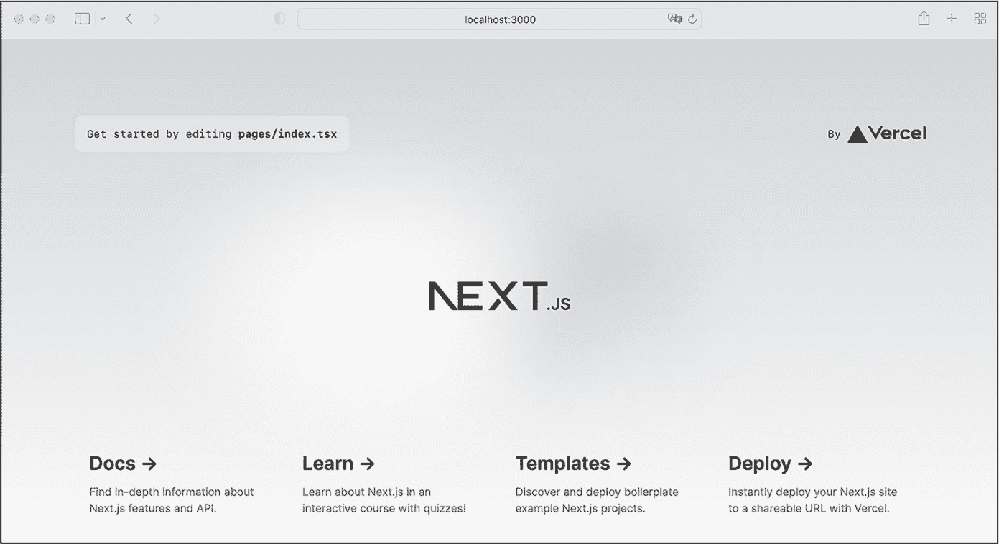
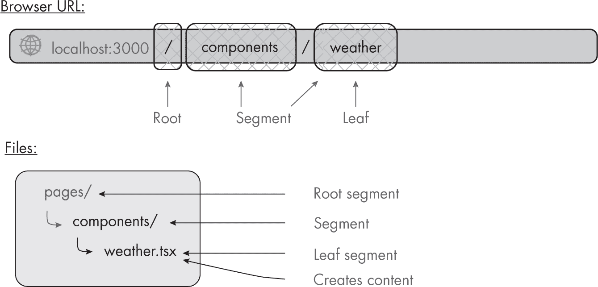
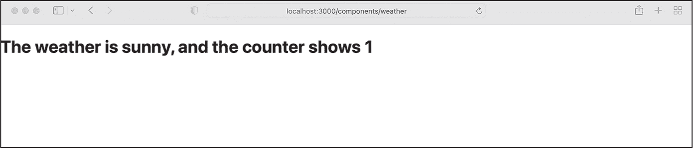
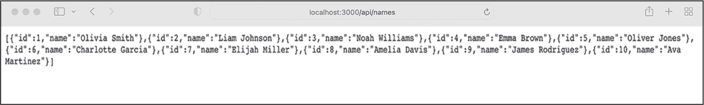

## 5 NEXT.JS


在第四章中，你使用了 React 来创建响应式用户界面组件。但是，由于 React 只是一个库，构建全栈应用程序需要额外的工具。在本章中，我们将使用 Next.js，这是一个构建在 React 之上的领先 Web 应用程序框架。要使用 Next.js 创建应用程序，你只需要了解几个基本概念。本章将介绍这些概念。

Next.js 简化了应用程序前端、中间件和后端的创建。在前端，它使用 React。它还添加了本地的 CSS 模块来定义样式，并使用自定义的 Next.js 模块来执行路由、图像处理和其他前端任务。至于中间件和后端，Next.js 使用内置服务器来提供 HTTP 请求的入口点，并提供一个干净的 API 以便处理请求和响应对象。

我们将讨论其基于文件系统的路由方法，讨论构建和渲染交付给客户端的网页的方式，探索如何添加 CSS 文件来为页面添加样式，并重构我们的 Express.js 服务器以与 Next.js 一起使用。本章使用传统的*pages*目录来教授这些基本概念。要了解 Next.js 的替代*app*目录，请参见附录 B。

### 设置 Next.js

Next.js 是 npm 生态系统的一部分。虽然你可以通过运行 npm install next react react-dom 手动安装所有必需的模块，并随后自己创建项目的所有文件和文件夹，但有一个更简单的方式来设置：运行 create-next-app 命令。

让我们创建一个示例应用程序，以便在本章中使用。按照以下步骤设置一个名为*sample-next*的新空文件夹，并在其中构建你的第一个 Next.js 应用程序。保持设置向导中的默认答案，并选择使用传统的*pages*目录，而不是*app*目录：

```
$ **mkdir sample-next**
$ **cd ./sample-next**
$ **npx create-next-app@latest** **-****-typescript** **-****-use-npm**
--`snip`--
What is your project named? ... **my-app**
--`snip`--
Creating a new Next.js app in /Users/.../my-app.

Installing dependencies:
- react
- react-dom
- next

Installing devDependencies:
- eslint
- eslint-config-next
- typescript
- @types/react
- @types/node
- @types/react-dom 
```

我们创建一个新文件夹，切换到该文件夹，然后初始化一个新的 Next.js 项目。我们使用 npx 命令，而不是 npm，因为正如你在第一章中学到的，npx 不需要我们安装任何东西作为依赖项或开发依赖项。我们提到过它的典型用途是脚手架工具，这正是我们在这里所做的。

create-react-app 命令有几个选项，其中只有两个与我们相关：--typescript 选项创建一个支持 TypeScript 的 Next.js 项目，而 --use-npm 标志选择 npm 作为包管理器。

我们接受默认的项目名称 my-app，以及所有其他默认设置。脚本会根据项目名称创建一个包含*package.json*文件和一个完整示例项目的文件夹，里面有所有必需的文件和文件夹。最后，脚本通过 npm 安装依赖和开发依赖。

> 注意

*如果不想设置一个新项目，你可以使用在线的沙盒环境，如* [`<wbr>codesandbox<wbr>.io<wbr>/s<wbr>/`](https://codesandbox.io/s/) *或者* [`<wbr>stackblitz<wbr>.com`](https://stackblitz.com) *来运行本章的 Next.js 代码示例。只需选择* pages *目录设置，而不是* app *目录即可。*

#### 项目结构

让我们来探索一下 Next.js 应用程序的项目结构。输入以下命令来运行它：

```
$ **cd my-app**
$ **npm run dev**

> my-app@0.1.0 dev
> next dev

ready - started server on 0.0.0.0:3000, url: http://localhost:3000 
```

在浏览器中访问提供的 URL。你应该能看到一个默认页面，类似于图 5-1 中所示的页面（这个欢迎页面可能会根据你的 Next.js 版本有所不同）。



图 5-1：在浏览器中查看的 Next.js 基本应用

现在打开*my-app*文件夹，这是脚手架脚本创建的，并浏览其中的内容。*my-app*文件夹包含了许多文件夹，但目前只有三个对你来说比较重要：*public*、*styles* 和 *pages*。

*public* 文件夹保存所有静态资源，如自定义字体文件、所有图像以及应用程序提供下载的文件。我们将在应用程序的 HTML 和 CSS 文件中链接这些资源。*pages* 文件夹包含了应用程序的所有路由。它的每个文件都是一个属于页面路由或 API 路由（在 *api* 子文件夹中的）端点。

> 注意

*Next.js 的最新版本还包含了一个* app *目录，你可以选择使用它进行路由设置，作为* pages *目录的替代方案。由于* app *目录使用了更先进的概念，本章将讲解更简单的* pages *架构风格。不过，你可以在附录 B 中进一步了解* app *目录，我们将在那里详细介绍它的使用。*

在 *my-app* 文件夹中，我们还可以找到 *_app.tsx* 文件，这是 Next.js 对我们在第四章中使用的 *App.tsx* 文件的等价物。它是整个应用程序的入口点，也是我们将添加全局样式、组件和上下文提供者的地方。最后，*styles* 文件夹包含全局 CSS 文件以及用于本地作用域、组件特定的模块文件。

#### 开发脚本

我们的应用程序使用的技术，包括 TypeScript、React 和 JSX，并不能直接在浏览器中运行。它们都需要一个包含合理复杂转译器的构建管道。Next.js 提供了四个命令行脚本，以简化开发过程。

npx next dev 和 npm run dev 命令以开发模式启动应用程序，地址是 *http://localhost:3000*。因此，每当我们更改一个文件时，Next.js 会在浏览器窗口中重新构建并重新加载渲染后的应用程序。除了这种 *热代码* 重载外，开发服务器还会显示错误和警告信息，以帮助应用程序的开发。安装向导会将服务器添加到 *package.json* 的脚本部分，因此我们也可以通过运行 npm run dev 来启动它。

npx next build 和 npm run build 命令创建了我们应用程序的优化构建版本。它们会移除未使用的代码，并减少脚本、样式和其他资源文件的大小。你将在实时部署时使用这些命令。npx next start 和 npm run start 命令将在内置服务器或无服务器环境中，以生产模式运行优化后的应用程序，地址是 *http://localhost:3000*。此生产构建依赖于之前创建的构建版本，因此，我们必须首先运行 build 命令。

最后，npx next export 和 npm run export 命令创建了一个独立版本的应用程序，该版本不依赖于内置的 Next.js 服务器，可以在任何基础设施上运行。然而，此版本的应用程序将无法使用需要 Next.js 服务器端功能的特性。请参考官方 Next.js 文档 [*https://<wbr>nextjs<wbr>.org*](https://nextjs.org)，获取使用指南。

### 路由应用程序

当我们构建我们的示例 Express.js 服务器时，我们创建了一个明确的路由文件，将应用程序的每个端点映射到执行相应行为的不同函数。Next.js 提供了一个不同的、也许更简单的路由系统；它基于 *pages* 目录中的文件自动创建应用程序的路由。如果该文件导出了一个 React 组件（对于网页）或一个异步函数（对于 API），它就成为一个有效的端点，既可以是一个 HTML 页面，也可以是一个 API。

在本节中，我们将重新审视我们在 Express.js 服务器中创建的路由，并使用 Next.js 的路由技术重新构建它们。

#### 简单页面路由

对于我们的 Express.js 服务器，我们在 *index.ts* 文件中手动创建了一个 */hello* 路由。当访问该路由时，它返回了 Hello World!。现在让我们将此路由转换为 Next.js 中基于页面的路由。最简单的页面路由类型是将文件直接放置在 *pages* 目录中。例如，默认创建的 *pages/index.tsx* 文件映射到 *http://localhost:3000*。要创建一个简单的 */hello* 路由，只需在该目录下创建一个新文件 *hello.tsx*。然后，将列表 5-1 中的代码添加到该文件中。

```
import type {NextPage} from "next";

const Hello: NextPage = () => {
    return (<>Hello World!</>);
}

export default Hello; 
```

列表 5-1：pages/hello.tsx 文件

我们的 Express.js 服务器使用 routeHello 函数返回 Hello World! 字符串。在这里，我们需要添加更多代码来导出一个 React 组件。首先，我们从 Next.js 模块导入自定义类型 NextPage，并用它创建一个常量 Hello。我们将常量赋值为一个返回 NextPage 的箭头函数，NextPage 实际上是 React 组件的一个自定义包装器。在这种情况下，我们返回 JSX 渲染 Hello World! 字符串。最后，我们将 NextPage 作为文件的默认导出。

运行服务器并导航到 *http://localhost:3000/hello*。您看到的页面应该显示 Hello World! 作为其内容。

该页面与示例 Express.js 服务器中的页面看起来不同。这是因为 Next.js 会自动将 *_app.tsx* 文件中定义的所有全局样式应用到每个页面。因此，即使我们在 *hello.tsx* 文件中没有显式定义任何样式，字体看起来也会不同。

#### 嵌套路由页面

*嵌套路由*，如示例中的*/components/weather*，是其他路由的逻辑子路由。换句话说，*weather*是嵌套在*components*入口点下的。你可能已经猜到我们如何使用 Next.js 的页面路由模式来创建嵌套路由了。没错，我们只需要创建一个子文件夹，Next.js 会将文件夹结构映射到 URL 模式。

在*pages*文件夹内创建一个新的文件夹*components*，并在其中添加一个新的文件*weather.tsx*。图 5-2 展示了 URL *components/weather* 与文件结构 *pages/components/weather.tsx* 之间的关系。



图 5-2：URL components/weather 与文件结构之间的关系 pages/components/weather.tsx

我们的*pages*文件夹是 URL 的根目录，每个嵌套文件夹都成为 URL 的一部分。导出NextPage的文件是*叶子节点*，即 URL 的最终部分。对于这个文件，我们重用了在第四章中编写的天气组件代码，见清单 5-2。

```
import type {NextPage} from "next";
import React, {useState, useEffect} from "react";

const PageComponentWeather: NextPage = () => {

    interface WeatherProps {
        weather: string;
    }

    const WeatherComponent = (props: WeatherProps) => {

        const [count, setCount] = useState(0);
        useEffect(() => {
            setCount(1);
        }, []);

        return (
            <h1 onClick={() => setCount(count + 1)}>
                The weather is {props.weather},
                and the counter shows {count}
            </h1>
        );
    };

 return (<WeatherComponent weather="sunny" />);
};

export default PageComponentWeather; 
```

清单 5-2：pages/components/weather.tsx 文件

与第四章中创建的功能组件的唯一区别是，我们将代码包装在一个返回NextPage的函数中，然后将其作为默认导出。这与我们在清单 5-1 中创建的页面一致，并遵循 Next.js 的模式要求。

在浏览器中访问新的页面 *http://localhost:3000/components/weather*，它应该与图 5-3 相似。



图 5-3：该 pages/components/weather.tsx 文件在 /components/weather URL 中渲染。

你应该能认出在第四章中看到的点击处理器功能。

#### API 路由

除了用户友好的界面外，完整栈应用程序可能还需要一个机器可读的接口。例如，在第二部分中，你将创建的 Food Finder 应用程序将为外部服务提供一个 API，以便移动应用或第三方小部件可以显示我们的愿望清单。作为 JavaScript 驱动的全栈开发者，我们最常用的 API 格式是 GraphQL 和 REST，我们将在第六章中深入讨论这两种格式。在这里，我们将创建 REST API，因为它们简洁易用。

使用 Next.js，我们可以通过与页面相同的模式设计和创建 API。*pages/api/* 文件夹中的每个文件都是一个单独的 API 端点，我们可以像定义嵌套路由一样定义嵌套的 API 路由。然而，与页面路由不同，API 路由不是 React 组件。相反，它们是异步函数，接受两个参数，NextApiRequest 和 NextApiResponse，并返回一个 NextApiResponse 和 JSON 数据。

在处理 API 路由时，有两个需要记住的注意事项。首先，默认情况下，它们不会指定 *跨域资源共享（CORS）* 头部。这组 HTTP 头部，尤其是 Access-Control-Allow-Origin 头部，允许服务器定义客户端脚本可以请求资源的源。如果你希望在第三方域名上的网站中的客户端脚本访问你的 API 端点，你需要添加额外的中间件，在 Next.js 服务器中直接启用 CORS。否则，外部请求将触发 CORS 错误。这不仅仅是 Next.js 的问题；Express.js 和大多数其他服务器框架也要求你做同样的事情。

第二个注意事项是，通过运行 next export 进行的静态导出不支持 API 路由。它们依赖于内置的 Next.js 服务器，无法作为静态文件运行。

我们在 Express.js 服务器中使用了一个 API 路由，*api/names*。现在，让我们重构代码并将其转换为 Next.js API 路由。如之前所述，创建一个新文件，*names.ts*，并将其放置在 *api* 文件夹中。因为 API 路由返回的是一个异步函数，而不是 JSX，所以我们使用 *.ts* 扩展名，而不是用于 JSX 代码的 *.tsx* 扩展名。将列表 5-3 中的代码粘贴到该文件中。

```
import type {NextApiRequest, NextApiResponse} from "next";

type responseItemType = {
    id: string;
    name: string;
};

export default async function handler(
    req: NextApiRequest,
    res: NextApiResponse
): Promise<NextApiResponse<responseItemType[]> | void> {
    const url = "https://www.usemodernfullstack.dev/api/v1/users";
    let data;
    try {
        const response = await fetch(url);
        data = (await response.json()) as responseItemType[];
    } catch (err) {
        return res.status(500);
    }
    const names = data.map((item) => {
        return {id: item.id, name: item.name};
    });
    return res.status(200).json(names);
} 
```

列表 5-3：pages/api/names.ts 文件

首先，我们从 Next.js 包中导入 API 请求和响应的自定义类型。然后，我们定义 API 响应的自定义类型。在第三章中，我们为 *routes.ts* 文件中的 await 调用创建了相同的类型。我们在这里也使用相同的代码和 await 调用，因此我们也复用了该类型。接着，我们创建并直接导出前面提到的 API 处理函数。你在第二章中学到，异步函数需要返回一个 promise 作为返回类型。因此，我们将这个 API 响应包装在一个 promise 中。

函数主体中的代码与第四章中的 routeAPINames 函数中的代码类似。它发出 API 请求来获取用户数据，将接收到的数据转换为所需的返回格式，最后返回数据。然而，我们需要做一些修改。首先，我们不再返回一个错误字符串，而是返回一个没有内容的 API 响应，并附上通用的状态码 *500*，表示 *内部服务器错误*。

第二个调整涉及数据映射。之前，我们返回的是一个在浏览器中呈现的字符串。现在，我们不再返回这个字符串，而是返回一个 JSON 对象。因此，我们修改了 array.map 函数，以创建一个对象数组。最后，我们修改 return 语句，将 API 响应以 JSON 格式返回，并附上状态码 *200: OK*。

现在在浏览器中打开新的 API 路径 *http://localhost:3000/api/names*。你应该能看到在图 5-4 中显示的 API 响应。



图 5-4：从 pages/api/names.ts 文件在浏览器中呈现的 /api/names 

#### 动态 URL

现在你已经知道如何创建页面和 API 路径，这些是任何全栈应用的基础。然而，你可能在想如何创建 *动态* URL，它们会根据输入发生变化。我们通常使用动态 URL 来展示个人资料页面，其中用户的姓名成为 URL 的一部分。事实上，当我们在 *index.ts* 文件中定义路由 */api/weather/:zipcode* 时，我们就实现了一个动态 URL。在那里，*zipcode* 是一个动态参数，或者说是一个动态叶子段，其值是由 req.params.zipcode 函数提供的。

Next.js 对动态 URL 使用了稍有不同的模式。由于它是基于文件夹和文件来创建路由的，我们需要通过将变量部分包裹在方括号（[]）中来定义动态片段。Express.js 服务器中的动态路由 */api/weather/:zipcode* 因此会转化为文件 */api/weather/[zipcode].ts*。

让我们在示例 Next.js 应用程序中创建一个动态路由，模拟来自 Express.js 服务器的 */api/weather/:zipcode* 路由。在 *api* 文件夹中创建一个新的文件夹 *weather*，并在其中放置一个名为 *[zipcode].ts* 的文件。然后将列表 5-4 中的代码粘贴到该文件中。

```
import type {NextApiRequest, NextApiResponse} from "next";

type WeatherDetailType = {
    zipcode: string;
    weather: string;
    temp?: number;
};

export default async function handler(
    req: NextApiRequest,
    res: NextApiResponse
): Promise<NextApiResponse<WeatherDetailType> | void> {

    return res.status(200).json({
        zipcode: req.query.zipcode,
        weather: "sunny",
        temp: 35
    });

} 
```

列表 5-4：api/weather/[zipcode].ts 文件

这段代码应该对你来说很熟悉，因为它遵循了 Next.js 中 API 路由的基本框架。我们导入了必要的类型，然后定义了一个自定义类型 WeatherDetailType，并将其用作函数返回数据的类型。（顺便说一下，这正是我们在第三章中创建的类型定义。）在函数的主体中，我们返回状态码为 *200: OK* 的响应和一个 JSON 对象。我们用从动态 URL 参数中获取的邮政编码填充 zipcode 属性，获取方式为 req.query .zipcode。

当你运行服务器时，浏览器应显示带有动态 URL 参数的 JSON 响应。如果你访问 *http://localhost:3000/api/weather/12345*，你应该能看到 API 响应。如果你更改 URL 中的“12345”部分并重新请求数据，响应数据应相应地变化。

请注意，动态路由 */api/weather/[zipcode].ts* 匹配 */api/weather/12345* 和 */api/weather/54321*，但不匹配这些路由的子路径，例如 */api/weather/location/12345* 或 */api/weather/location/54321*。为此，你需要使用 *catch all* API 路由，它包括当前路径内的所有路径。你可以通过在文件名前添加三个点（...）来创建一个 catch all 路由。例如，catch all 路由 */api/weather/[...zipcode].ts* 可以处理本文中提到的所有四个 API 端点。

### 样式化应用程序

为了向我们的 Next.js 应用程序添加样式，我们创建常规的 CSS 文件，这些文件没有使用其他框架中常见的供应商前缀。稍后，Next.js 的后处理器将添加必要的属性，以生成向后兼容的样式。虽然 CSS 语法超出了本书的范围，但本节将介绍如何使用 Next.js 的两种 CSS 样式：全局样式和在 CSS 模块中定义的局部作用域组件样式。

#### 全局样式

全球样式影响应用的所有页面。当我们渲染 *hello.tsx* 文件时，我们遇到了这种行为；尽管我们没有自己添加任何样式信息，页面还是使用了 CSS。

从实际角度来看，全球样式只是常规的 CSS 文件。它们在构建过程中不会被修改，并且它们的类名保证保持不变。因此，我们可以在整个应用程序中将它们作为常规 CSS 类使用。我们将这些 CSS 文件导入到应用的入口文件 *pages/_app.tsx* 中。看看模板项目中的代码，你应该能看到类似于 Listing 5-5 的一行代码。

```
import "@/styles/globals.css";
```

Listing 5-5：在 _app.tsx 文件中导入全球样式

当然，你可以调整导入样式的文件名和位置，或者导入多个文件。试着通过在 *global.css* 文件中添加一些样式，并在 *hello.tsx* 文件中的 HTML 元素上添加一些常规 CSS 类来进行实验。然后访问 *htttp://localhost:3000/hello* 页面，看看它的变化。

#### 组件样式

在 第四章 中，你看到 React 允许我们通过独立的、可重用的组件来创建用户界面。全球样式并不是为独立组件提供样式的最佳方法，因为它们要求我们跟踪已经在各种组件中使用过的类名，如果我们从先前的项目中导入组件，还可能会导致 CSS 类名发生冲突。

我们需要将 CSS 类作用域限定到单独的模块，以便与模块化组件高效协作。实现这一目标有多种架构模式。例如，使用块元素修饰符（Block Element Modifier）方法，你可以手动将样式作用域限定到某个组件或用户界面块。

幸运的是，我们不需要为这种笨重的解决方案烦恼。Next.js 允许我们使用在构建过程中作用域限定的 CSS 模块。这些 CSS 模块遵循命名约定 <*component*>.*module.css*。编译器会自动在模块内部的每个 CSS 类名上添加组件的名称和唯一标识符前缀。这使得我们能够在多个组件中使用相同的样式名称而不会出现问题。

实际编写的 CSS 不会包含这些前缀。例如，查看 *styles* 文件夹中的 *Home.module.css* 文件，见 Listing 5-6。

```
.container {
    padding: 0 2rem;
} 
```

Listing 5-6：styles/Home.module.css 中的常规 CSS 代码

一个问题是，由于构建过程会修改类名并为其添加前缀，我们不能直接在其他文件中使用这些样式。相反，我们必须导入样式，并将其当作 JavaScript 对象来处理。然后，我们可以将其作为 `styles` 对象的属性来引用。例如，列表 5-7 中的 *pages/index.tsx* 文件使用了来自列表 5-6 的 `container` 类，展示了如何使用作用域样式的示例。

```
import styles from "../styles/Home.module.css"
--`snip`--
const Home: NextPage = () => {
    return (
        <div className={styles.container}>
        --`snip`--
        </div>
    );
}; 
```

列表 5-7：在 index.tsx 文件中使用来自 CSS 模块样式/Home.module.css 的样式

这段代码将 CSS 文件导入到一个名为 `styles` 的常量中。现在，所有的 CSS 类名都可以作为 `styles` 对象的属性使用。在 JSX 中，我们使用被大括号包裹的变量（`{}`），因此我们将对 `container` 类的引用写为 `{styles.container}`。

你现在可以根据 React 组件构建 API 和自定义样式页面。下一部分介绍了 Next.js 提供的一些有用的自定义组件，帮助增强你的全栈应用程序。

### 内置的 Next.js 组件

Next.js 提供了一组自定义组件。每个组件针对一个特定的使用场景：例如，访问内部页面属性，如页面标题或 SEO 元数据（`next/head`），提升应用程序整体渲染性能和用户体验（`next/image`），或启用应用程序的路由功能（`next/link`）。我们将在第二部分的全栈应用程序中使用本章涉及的 Next.js 组件，你可以在实际应用中看到它们的使用。有关其他属性和细分的使用案例，请参考 Next.js 文档。

#### next/head 组件

`next/head` 组件导出了一个自定义的 Next.js 特有的 `Head` 组件。我们使用它来设置页面的 HTML 标题和 meta 元素，这些元素位于 HTML 的 `head` 组件内。为了提高 SEO 排名和增强可用性，每个页面都应该拥有自己的元数据。列表 5-8 显示了来自列表 5-1 的 *hello.tsx* 页面示例，包含了自定义的标题和 meta 元素。

需要记住的是，Head 元素不会跨页面合并。Next.js 的客户端路由在页面过渡时会移除 Head 元素的内容。

```
import type {NextPage} from "next";
**import Head from "next/head";**

const Hello: NextPage = () => {
    return (
        <div>
            **<Head>**
                **<title>Hello World Page Title</title>**
                **<meta property="og:title" content="Hello World" key="title" />**
            **</Head>**
            <div>Hello World!</div>
        </div>
    );
};

export default Hello; 
```

清单 5-8：包含自定义标题和 meta 元素的 pages/hello.tsx 文件

我们从 next/head 组件中导入 Head 元素，并将其添加到返回的 JSX 元素中，将其放置在现有内容之上，并将两者包裹在另一个 div 元素中，因为我们需要返回一个元素而不是两个。

#### next/link 组件

next/link 组件导出了一个 Link 组件。这个组件是建立在 React 的 Link 元素之上的。当我们想要在应用中链接到另一个页面时，我们使用它来替代 HTML 锚点标签，从而启用客户端之间的页面过渡。点击时，Link 组件会更新浏览器 DOM，显示新的 DOM，滚动到新页面的顶部，并调整浏览器历史记录。此外，它提供了内置的性能优化，当 Link 组件进入 *视口*（网站当前可见部分）时，会预取链接的页面及其数据。这种后台预取使得页面过渡更加流畅。清单 5-9 将上一个清单中的 Next.js Link 元素添加到页面中。

```
import type {NextPage} from "next";
import Head from "next/head";
**import Link from "next/link";**

const Hello: NextPage = () => {
    return (
        <div>
            <Head>
                <title>Hello World Page Title</title>
                <meta property="og:title" content="Hello World" key="title" />
            </Head>
            <div>Hello World!</div>
            <div>
                Use the HTML anchor for an
                **<a href="https://nostarch.com" > external link</a>**
                and the Link component for an
                **<Link href=****"/components/weather"> internal page**
                **</Link>**
                .
            </div>
        </div>
    );
};

export default Hello; 
```

清单 5-9：包含外部链接和内部 next/link 元素的 pages/hello.tsx 文件

我们导入该组件，然后将其添加到返回的 JSX 元素中。为了进行比较，我们使用常规的 HTML 锚点链接到 No Starch Press 首页，并使用自定义的 Link 连接到我们的 Next.js 应用中的天气组件页面。在应用中，尝试点击这两个链接，看看它们的区别。

#### next/image 组件

next/image 组件导出了一个 Image 组件，用于显示图像。该组件是基于原生 HTML 中的  元素构建的。它处理常见的布局需求，如填充所有可用空间和缩放图像。该组件可以加载现代图像格式，如 *AVIF* 和 *WebP*，并根据客户端的屏幕显示合适大小的图像。此外，你可以选择使用模糊的占位图像，并在图像进入视口时延迟加载实际图像；这可以通过防止 *累积布局位移* 来强制网站的视觉稳定性，累积布局位移发生在图像在页面之后渲染时，导致页面内容向下移动。累积布局位移被认为是糟糕的用户体验，它会使用户失去注意力。Listing 5-10 提供了 next/image 组件的基本示例。

```
import type {NextPage} from "next";
import Head from "next/head";
import Link from "next/link";
**import Image from "next/image";**

const Hello: NextPage = () => {
    return (
        <div>
            <Head>
                <title>Hello World Page Title</title>
                <meta property="og:title" content="Hello World" key="title" />
            </Head>
            <div>Hello World!</div>
            <div>
                Use the HTML anchor for an <a href="https://nostarch.com">
                external link</a> and the Link component for an
                <Link href="/components/weather"> internal page</Link>.
                **<Image**
                    **src****="/vercel.svg"**
                    **alt="Vercel Logo"**
                    **width={72}**
                    **height={16}**
                **/>**
            </div>
        </div>
    );
};
export default Hello; 
```

Listing 5-10: 使用 next/image 元素的 pages/hello.tsx 文件

在这里，我们展示了来自应用程序的 Vercel logo，它位于 *public* 文件夹中。首先，我们从 *next/image* 包中导入该组件。然后我们将其添加到页面内容中。我们的最小示例的语法和属性类似于 HTML 中的 img 元素。你可以在官方文档中了解更多关于该组件的高级属性，链接为 [*https://<wbr>nextjs<wbr>.org<wbr>/docs<wbr>/api<wbr>-reference<wbr>/next<wbr>/image*](https://nextjs.org/docs/api-reference/next/image)。

### 预渲染和发布

虽然你可以根据目前所学的内容开始构建全栈的 Next.js 应用程序，但了解一个更高级的话题会很有帮助：不同的渲染和发布方式及其对性能的影响。

Next.js 提供了三种预渲染应用程序的选项，利用其内置的服务器。第一种，*静态网站生成（SSG）*，在构建时生成 HTML。因此，每次请求都会返回相同的 HTML，它是静态的且永远不会被重新创建。第二种选项，*服务器端渲染（SSR）*，在每次请求时生成新的 HTML 文件，第三种，*增量静态再生（ISR）*，将两者的优点结合起来。

Next.js 允许我们根据每个页面选择不同的预渲染选项，这意味着全栈应用可以包含使用 SSG、SSR、ISR 的页面，以及一些 React 组件的客户端渲染。你还可以通过运行 next export 来创建网站的完整静态导出。导出的应用将独立运行在所有基础设施上，因为它不需要内置的 Next.js 服务器。

为了体验这些渲染方法，我们将创建一个新页面，展示来自我们的名称 API 的数据，针对每种渲染选项。创建一个新文件夹 *utils*，与 *pages* 文件夹并列，并在其中添加一个空文件 *fetch-names.ts*。然后将 Listing 5-11 中的代码添加进去。这个工具函数调用远程 API 并返回数据集。

```
type responseItemType = {
    id: string;
    name: string;
};

export const fetchNames = async () => {
    const url = "https://www.usemodernfullstack.dev/api/v1/users";
    let data: responseItemType[] | [] = [];
    let names: responseItemType[] | [];
    try {
        const response = await fetch(url);
        data = (await response.json()) as responseItemType[];
    } catch (err) {
        names = [];
    }
    names = data.map((item) => {return {id: item.id, name: item.name}});

    return names;
}; 
```

Listing 5-11: 位于 utils/fetch-names.ts 中的异步工具函数

在定义了自定义类型之后，我们创建一个函数并直接导出它。这个函数包含了之前创建的 *names.ts* 文件中的代码，做了两处调整：首先我们需要将数据数组定义为可能为空；接着，如果 API 调用失败，我们返回一个空数组而不是错误字符串。这个改变意味着，在生成 JSX 字符串时，我们不需要在遍历数组之前验证类型。

#### 服务器端渲染

使用 SSR 时，Next.js 内置的 Node.js 服务器会根据每个请求生成应用的 HTML。如果你的页面依赖外部 API 提供的新鲜数据，你应该使用这种技术。不幸的是，SSR 在生产环境中较慢，因为页面不容易缓存。

要为页面使用 SSR，从该页面导出一个额外的异步函数 getServerSideProps。Next.js 会在每个请求时调用该函数，并将获取的数据传递给页面的 props 参数，在将其发送到客户端之前进行预渲染。

尝试通过在 *pages* 文件夹中创建一个新文件 *names-ssr.tsx* 来实现这一点。将 Listing 5-12 中的代码粘贴到该文件中。

```
import type {
    **GetServerSideProps,**
    **GetServerSidePropsContext,**
    **InferGetServerSidePropsType,**
    NextPage,
    PreviewData
} from "next";
import {ParsedUrlQuery} from "querystring";
import {fetchNames} from "../utils/fetch-names";

type responseItemType = {
    id: string;
    name: string;
};

const NamesSSR: NextPage = **(props: InferGetServerSidePropsType<typeof getServerSideProps>****)** => {

    const output = props.names.map((item: responseItemType, idx: number) => {
        return (
            <li key={`name-${idx}`}>
                {item.id} : {item.name}
            </li>
        );
    });

    return (
        <ul>
            {output}
        </ul>
    );
};

**export const getServerSideProps: GetServerSideProps** = async (
    context: GetServerSidePropsContext<ParsedUrlQuery, PreviewData>
) => {

    let names: responseItemType[] | [] = [];
    try {
        names = await fetchNames();
    } catch(err) {}
    return {
        props: {
          names
        }
    };
};

export default NamesSSR; 
```

Listing 5-12: 使用 SSR 显示数据的基础页面，page/names-ssr.tsx

要使用 Next.js 的 SSR，我们需要导出额外的异步函数 getServerSideProps。我们还需要从 *next* 和 *querystring* 包中导入必要的功能，以及之前创建的 fetchNames 函数。然后我们定义 API 请求响应的自定义类型。这与我们在 第三章 中使用的自定义类型相同。

接下来，我们创建页面并将导出作为默认选项。页面返回一个 NextPage 并采用该页面类型的默认属性。我们遍历 props 参数的 names 数组，创建一个 JSX 字符串并将其渲染返回到浏览器。然后我们定义 getServerSideProps 函数，它从 API 获取数据。我们从异步函数返回创建的数据集，并将其传递给页面属性中的 NextPage。

导航到新页面 *http://localhost:3000/names-ssr*。你应该能够看到用户名列表。

#### 静态站点生成

SSG 只创建一次 HTML 文件，并在每个请求中重复使用它们。这是推荐的选项，因为预渲染的页面易于缓存并且传递速度快。例如，内容分发网络可以轻松获取你的静态文件。

通常，SSG 应用程序具有更低的 *首次绘制时间*，即用户请求页面（例如，通过点击链接）到内容在浏览器中出现之间的时间。SSG 还可以减少 *阻塞时间*，即用户实际与页面内容交互前的时间。这些指标的良好得分表明网站响应迅速，且它们是 Google 打分算法的一部分。因此，这些页面的 SEO 排名更高。

如果你的页面依赖外部数据，你仍然可以通过从页面文件中导出一个额外的异步函数 getStaticProps 来使用 SSG。Next.js 会在构建时调用此函数，将获取的数据传递给页面的 props 参数，并使用 SSG 预渲染页面。当然，只有在外部数据不是动态的情况下，这种方法才有效。

尝试创建与 SSR 示例中相同的页面，这次使用 SSG。首先在 *pages* 文件夹中添加一个新文件，*names-ssg.tsx*，然后粘贴 示例 5-13 中显示的代码。

```
import type {
    **GetStaticProps,**
    **GetStaticPropsContext,**
    **InferGetStaticPropsType,**
    NextPage,
    PreviewData,
} from "next";
import {ParsedUrlQuery} from "querystring";
import {fetchNames} from "../utils/fetch-names";

type responseItemType = {
    id: string,
    name: string,
};

const **NamesSSG**: NextPage = **(props: InferGetStaticPropsType<typeof getStaticProps>)** => {

    const output = props.names.map((item: responseItemType, idx: number) => {
        return (
            <li key={`name-${idx}`}>
                {item.id} : {item.name}
            </li>
        );
    });

    return (
        <ul>
            {output}
        </ul>
    );
};

**export const getStaticProps: GetStaticProps = async (**
    context: **GetStaticPropsContext<ParsedUrlQuery, PreviewData>**
) => {

    let names: responseItemType[] | [] = [];
    try {
        **names = await fetchNames();**
    } catch (err) {}

    return {
        props: {
            names
        }
    };
};

export default NamesSSG; 
```

示例 5-13：使用 SSG 显示数据的页面，page/names-ssg.tsx

代码与 示例 5-9 基本相同。我们只需要将特定于 SSR 的代码更改为使用 SSG。因此，我们导出 getStaticProps 而不是 getServerSideProps，并相应调整类型。

当你访问该页面时，它应该与 SSR 页面类似。但与每次访问 *http://localhost:3000/names-ssg* 都请求新数据不同，数据只在页面构建时请求一次。

#### 增量静态再生

ISR 是 SSG 和 SSR 的混合体，完全在服务器端运行。在初次构建时，它在服务器上生成 HTML，并在第一次请求页面时发送这个预生成的 HTML。在指定时间过后，Next.js 会获取数据并在后台重新生成页面。在此过程中，它会使内部服务器缓存失效，并用新页面更新缓存。每个后续请求将收到最新的页面。与 SSG 类似，ISR 比 SSR 成本更低，并能提升页面的 SEO 排名。

要在 SSG 页面中启用 ISR，我们需要向 `getStaticProp` 的返回对象添加一个属性以重新验证。我们以秒为单位定义数据的有效性，如 列表 5-14 所示。

```
return {
        props: {
        names,
        revalidate: 30
    }
}; 
```

列表 5-14：更改 `getServerSideProps` 以启用 ISR

我们添加了 `revalidate` 属性，值为 `30`。因此，定制的 Next.js 服务器将在第一次页面请求后 30 秒使当前 HTML 失效。

#### 客户端渲染

完全不同的方法，*客户端渲染* 首先使用 SSR 或 SSG 生成 HTML 并发送到客户端。然后客户端在运行时获取额外的数据，并在浏览器的 DOM 中渲染。客户端渲染是处理高度灵活、不断变化的数据集（如实时股票市场或货币价格）的好选择。其他网站使用它将页面的骨架版本发送到客户端，然后用更多内容进行增强。然而，客户端渲染会降低你的 SEO 性能，因为其数据无法被索引。

列表 5-15 显示了我们之前创建的页面，已配置为客户端渲染。请在 *pages* 文件夹中创建一个新文件，命名为 *names-csr.tsx*，然后将代码添加到其中。

```
import type {
    NextPage
} from "next";
import {**useEffect, useState**} from "react";
import {fetchNames} from "../utils/fetch-names";

type responseItemType = {
    id: string,
    name: string,
};

const NamesCSR: NextPage = () => {
    const [data, setData] = **useState<responseItemType[] | []>**();
    **useEffect**(() => {
        const fetchData = async () => {
            let names;
            try {
                names = await fetchNames();
            } catch (err) {
                console.log("ERR", err);
            }
            setData(names);
        };
        fetchData();
    }**);**

    const output = data?.map((item: responseItemType, idx: number) => {
        return (
            <li key={`name-${idx}`}>
                {item.id} : {item.name}
            </li>
        );
    });

    return (
        <ul>
            {output}
        </ul>
    );

};

export default NamesCSR; 
```

列表 5-15：客户端渲染页面，page/names-csr.tsx

这段代码与之前的示例有很大不同。这里我们导入了 `useState` 和 `useEffect` 钩子。后者会在页面可用后获取数据。一旦 `fetchNames` 函数返回数据，我们使用 `useState` 钩子和响应式的 `data` 状态变量来更新浏览器的 DOM。

我们不能将 useEffect 钩子声明为一个异步函数，因为它返回的是一个未定义的值或一个函数，而异步函数返回的是一个 Promise，因此 TSC 会抛出错误。为避免这种情况，我们需要将 await 调用封装在一个异步函数 fetchData 中，然后调用该函数。

配置为客户端渲染的页面应该与其他版本相似。但是，当你访问 *http://localhost:3000/names-csr* 时，可能会看到一闪而过的空白页面。这是因为页面正在等待异步 API 请求。

为了更好地了解不同的渲染类型，可以修改本节中每个示例的代码，使用*API [`www.usemodernfullstack.dev/api/v1/now`](https://www.usemodernfullstack.dev/api/v1/now)*，该 API 返回一个包含请求时间戳的对象。

#### 静态 HTML 导出

next export 命令生成一个静态的 HTML 版本的网页应用。这个版本独立于内置的基于 Node.js 的 Next.js Web 服务器，可以在任何基础设施上运行，比如 Apache、NGINX 或 IIS 服务器。

要使用此命令，您的页面必须实现 getStaticProps，就像在 SSG 中一样。此命令不支持 getServerSideProps 函数、ISR 或 API 路由。

练习 5：将 Express.js 和 React 重构为 Next.js

让我们将前几章中的 React 和 Express.js 应用重构为一个 Next.js 应用，在接下来的章节中我们将对其进行扩展。第一步，我们总结一下需要构建的功能。我们的应用有一个 API 路由 *api/names*，返回用户名；另一个 API 路由 *api/weather/:zipcode*，返回一个静态 JSON 对象和 URL 参数。我们使用它来理解动态 URL。此外，我们还创建了 */hello* 和 *component/weather* 页面。

在本章中，我们已经将这些不同的元素重构为与 Next.js 的路由风格兼容。在本练习中，我们将所有内容整合在一起。按照第 70 页中“设置 Next.js”部分的步骤初始化 Next.js 应用。在*sample-next*文件夹中，将应用命名为*refactored-app*。

#### 存储自定义接口和类型

我们在项目的根目录创建了一个新的文件*custom.d.ts*，用于存储自定义接口和类型定义（列表 5-16）。它与我们在第三章和第四章中使用的类似，主要的区别在于我们为 Next.js 应用添加了自定义类型。

```
interface WeatherProps {
    weather: string;
}

type WeatherDetailType = {
    zipcode: string;
    weather: string;
    temp?: number;
};

type responseItemType = {
    id: string;
    name: string;
}; 
```

列表 5-16：custom.d.ts 文件

我们将使用自定义接口WeatherProps作为显示天气组件的页面*components/weather*的props参数。WeatherDetailType用于 API 路由*api/weather/:zipcode*，它使用动态获取的 ZIP 代码。最后，我们在 API 路由*api/names*中使用responseItemType来为 fetch 响应类型化。

#### 创建 API 路由

接下来，我们重新创建 Express.js 服务器中的两个 API 路由。本章前面的部分展示了此重构代码。对于*api/names*路由，首先在*api*文件夹中创建一个新文件*nimes.ts*，然后添加列表 5-3 中的代码。请参考该部分以获取代码的详细解释。

通过在*api*文件夹中创建一个*[zipcode].js*文件，并添加列表 5-4 中的代码（见第 77 页的“动态 URL”部分），将动态路由*api/weather/:zipcode*从 Express.js 服务器迁移到 Next.js 应用程序。您可以参考该部分获取更多详细信息。

#### 创建页面路由

现在我们开始处理页面。首先，对于简单页面*hello.tsx*，我们在*pages*文件夹中创建一个新文件，并添加列表 5-10 中的代码。此代码渲染了Hello World!示例，并使用了自定义的 Next.js 组件Head、Link和Image，这些组件在第 80 页的“内建 Next.js 组件”部分中有详细说明。

第二个页面是嵌套路由*pages/components/weather.tsx*。与之前一样，我们在*pages*文件夹内的*components*文件夹中创建一个新文件*weather.tsx*。添加列表 5-2 中的代码。此列表使用了useState和useEffect钩子来创建一个响应式的用户界面。我们可以从此文件中移除自定义接口定义WeatherProps，因为*custom.d.ts*文件已经将它们添加到 TSC 中。

#### 运行应用程序

使用 npm run dev 命令启动应用程序。现在，你可以访问我们为 Express.js 服务器创建的相同路由，并看到它们在功能上完全相同。恭喜！你创建了第一个基于 Next.js 的全栈应用程序。可以尝试修改代码，使用全局 CSS 和组件 CSS 来为页面添加样式。

### 总结

Next.js 增加了创建全栈应用所需的缺失功能，帮助你与 React 一起构建应用。在搭建一个示例项目并探索默认文件结构后，你学习了如何在框架中创建页面和 API 路由。你还了解了全局和组件级 CSS、Next.js 的四个内置命令行脚本以及它的最有用的自定义组件。

我们还讨论了使用 Next.js 渲染内容和页面的不同方式，以及何时选择每种选项。最后，你使用本章的代码将之前章节中构建的 Express.js 应用程序快速迁移到 Next.js。为了继续探索这个有用的框架，我推荐访问官方教程：[*https://<wbr>nextjs<wbr>.org*](https://nextjs.org)。

在下一章，我们将探讨两种类型的 Web API：标准的 RESTful API 和现代的 GraphQL。
