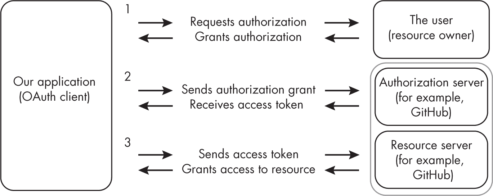
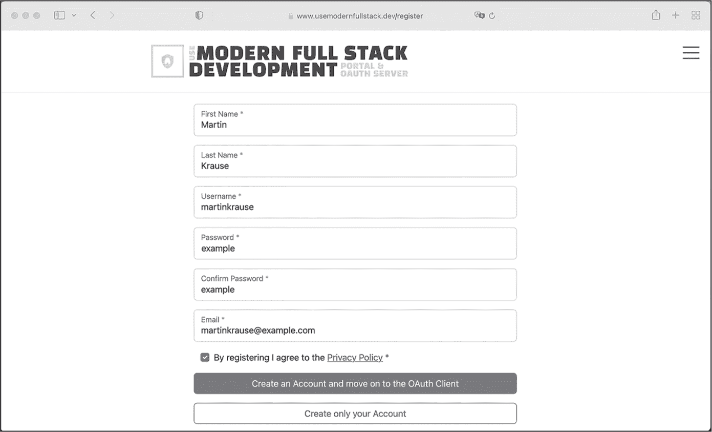
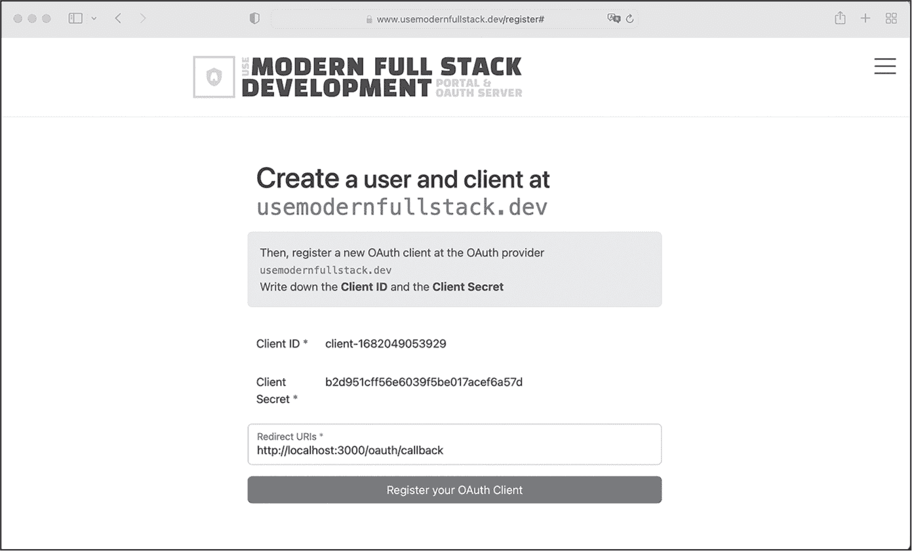

## 第九章：9 使用 OAuth 进行授权


某些应用程序会在登录工作流中存储有关用户的数据。实现此身份验证和授权的方法有很多种，但最简单的方法之一是使用 OAuth2，借用知名公司现有账户进行登录。*OAuth2*，简称*OAuth*，是一种开放的访问委托标准，如果你曾使用过某个应用的“用 Facebook、GitHub 或 Google 账户登录”功能，可能已经遇到过它。

OAuth 协议本质上允许我们的 Web 应用访问另一个应用的登录数据，而无需第三方与我们共享用户凭证。为了实现这一点，用户通过创建访问令牌授予我们的应用其第三方账户的访问权限。OAuth 是授权访问委托的公认标准，亚马逊、谷歌、Facebook、微软和 GitHub 都支持 OAuth 工作流。

本章将介绍 OAuth 工作流，然后探讨用于访问委托的持有者令牌的结构，为在第二部分中将 OAuth2 集成到你的“食物查找器”应用中奠定基础。在第 168 页的练习 9 中，我们不会通过 OAuth 流程更新我们的示例 Next.js 应用，而是手动演示 OAuth 授权过程。

### OAuth 如何工作

在我们探讨 OAuth 之前，你需要理解身份验证和授权之间的区别。简而言之，我们使用身份验证来验证用户的身份，而授权则指定经过身份验证的用户所拥有的权限，并强制执行这些权限。OAuth 允许将这一过程委托给用户已经拥有账户的第三方，从而简化了用户的登录过程。

#### 身份验证与授权

每次应用收到登录请求时，都会在允许访问之前检查用户的凭证，这个过程叫做*身份验证*。通常，这些凭证包括用户名和密码，但也可能是硬件令牌，或者涉及生物特征因素，如指纹或面部识别。然后，应用验证凭证是否与数据库中存储的匹配。

最简单的认证方式是*单因素认证*，只需要一个因素，通常是密码。不幸的是，它也是实施认证的最不安全的方法。更强大且推荐的方式是*多因素认证*，在这种方式中，用户必须提供至少两个因素。这些因素可能是用户*知道*的东西，比如密码，或者是用户*拥有*的东西，比如实体令牌，或是用户*具备*的东西，比如指纹拥有者。你在登录 PayPal 或 Google 时可能会使用多因素认证，这两个平台都要求你提供密码和一个额外的一次性密码（OTP）。

OTP 是一个基于你与应用程序在注册账户时共享的秘密生成的代码。两个参与方会在短时间间隔内重新生成这一对代码。你的 OTP 可能是通过类似 Google Authenticator 的身份验证器应用生成，或者通过短信接收。你拥有账户的应用程序（例如 PayPal 或 Google）会生成自己的 OTP 代码并将其保存在服务器上。你发送的 OTP 一旦到达服务器，服务器就会加密验证这些代码是否匹配。

我们在验证用户身份后执行授权。广义上说，这涉及查看用户的数据并决定他们是否拥有访问资源所需的权限。一个典型的全栈应用程序要么处理用户数据，要么允许用户在不提供用户数据的情况下登录。后者的做法有其优势，因为处理和存储用户数据可能不方便。它还伴随着额外的责任，比如需要遵守更严格的隐私和数据保留法律，并且要求用户创建另一个账户。

假设你为用户提供通过授权提供者使用现有账户登录的选项，那么你就移除了一个进入门槛。同时，你也无需担心处理他们的数据。如果你需要用户数据——例如，用于向客户收费——你可以使用 OAuth 工作流，并在必要时将从提供者接收到的数据（如用户的支付信息）保存在你自己的数据库中。

#### OAuth 的作用

每当一个 Web 应用程序允许你通过第三方提供者（如 Facebook、GitHub 或 Google）登录时，它背后使用的是 OAuth 授权码流。OAuth 并不是认证；它是一种授权你使用的 Web 应用程序代你执行操作或访问资源的方式。常见的操作包括发布到你的 Facebook 动态和访问诸如姓名、头像或电子邮件地址等数据。因此，每次你使用基于 OAuth 的登录功能时，应用程序会请求特定的权限，并且只能使用你授予的权限。

要理解 OAuth，你必须了解它的术语。每种 OAuth 流程都使用一组 RESTful API 授权*客户端*（即应用程序）从*资源提供者*（如 Facebook、GitHub 或 Google）获取资源（例如用户的个人信息），而这些资源是客户端希望访问的受保护资源。此外，我们将提供 OAuth API 端点的服务器称为*授权服务器*，将拥有访问权限（因此能够授权应用访问资源）的方称为*资源所有者*。在大多数情况下，资源所有者是应用的最终用户。

为了获取资源所有者的授权，客户端应用将其客户端凭证（包括 ID、密钥和用户凭证）发送到授权服务器，授权服务器通常是与资源提供者相同系统的一部分。授权服务器验证资源所有者的身份，并处理 OAuth 流程，从而授予其*访问令牌*，该令牌允许用户访问资源提供者上的受保护资源。授权服务器和资源提供者都是同一系统上的两组 API。

*客户端 ID*是客户端应用的公共标识符；你可以将其公开并存储在代码中。与客户端 ID 不同，*客户端密钥*应该保持私密；它是应用程序专用的密码，绝不应该存储在代码中。相反，应该使用 Next.js 的环境文件或服务器的环境变量来处理它。

#### 授权类型

OAuth 流程有多个变体。每种*授权类型*都覆盖一个特定的用例，但所有类型都最终生成访问令牌。OAuth 定义了四种授权类型：客户端凭证流程、隐式流程、授权码流程和资源所有者密码凭证流程。

*客户端凭证流程*涵盖机器对机器的通信；当不需要实际的最终用户授权时（例如自动化任务连接到 API 时），我们使用它。在这种情况下，任务本身既是客户端也是资源所有者。它知道资源所有者的凭证、客户端 ID 和客户端密钥，并将这些信息传递给授权服务器以获取访问令牌。

完整栈网页开发中最常见的授权类型是*授权码流程*。在这种情况下，我们的网页应用是一个客户端，它会分别调用两个不同的 API 端点。第一个是接收授权授权码，第二个是用该授权码交换访问令牌。第 161 页的“授权码流程”深入讲解了这一过程。

最后两种授权类型不应该使用。*隐式流程*类似于授权代码流程，但不同之处在于，客户端直接接收访问令牌，而不需要分别发送请求以接收授权许可和访问令牌。这个流程跳过了授权步骤，不包含客户端认证，并且已经被弃用。*资源所有者密码凭证流程*应该避免使用，因为它涉及终端用户将自己的凭据传递给客户端，然后客户端将这些凭据发送给 OAuth 服务器以交换访问令牌。虽然这听起来很直接，但将实际用户凭据发送给远程授权服务器是一个巨大的安全风险。

#### 承载令牌

客户端应用程序启动 OAuth 流程后，会收到一个共享访问令牌，最常见的是容易实现的*承载令牌*。这个访问令牌替代了用户的凭据；因此，任何拥有该令牌的人都可以访问数据。为了防止因令牌被盗而导致的安全漏洞，承载令牌通常有一个定义的有效期。过期后，令牌只能通过有效的*刷新令牌*进行刷新。这些是长期有效的令牌，我们用它们来生成新的承载令牌。

刷新令牌可以通过隐式或显式方式进行，并且有多种策略可以防止被盗的刷新令牌危及 OAuth 访问。例如，OAuth 提供者可以要求一个唯一的 ID 或客户端密钥来发放新令牌。每次发放新的承载令牌时，提供者通常会旋转刷新令牌，并且每个刷新令牌只能使用一次。从我们作为 OAuth 客户端的角度来看，刷新令牌的细节并不重要，因为 OAuth 提供者会处理这个令牌。

包含用户会话和认证数据的承载令牌是*JSON Web Token（JWT）*。JWT 是一个开放标准，用于安全地传输 JSON 对象中的数据。由于 JSON 格式相对紧凑，JWT 可以作为 URL 参数、POST 数据的一部分，甚至嵌入 HTTP 头中发送，且不会影响应用程序的性能。

JWT 令牌既可以签名也可以加密，从而避免应用程序需要额外请求来验证或获取额外数据。*加密令牌*将其中的数据隐藏起来，防止其他方访问。这种方式在 OAuth 中不常见，因为它带有额外的开销，所以我们现在可以忽略它们。*签名令牌*保证了其中数据的完整性，因为对令牌的任何修改都会改变其签名。因此，应用程序可以信任其中存储的信息。

签名 JWT 最常用的加密算法是*基于哈希的消息认证码（HMAC）*，并使用 SHA-256 哈希算法。HMAC 是一种消息认证码（MAC）。MAC 的主要特点是，它能够通过从消息中计算校验和来验证消息的真实性。校验和使用数学函数根据初始消息生成唯一且可重现的值或数据字符串。如果消息发生变化，校验和也会发生变化。通过这种方式，我们可以快速验证数据的完整性。对于 JWT 令牌，我们使用两个检查：真实性检查确认实际发送者确实发送了消息，而数据完整性检查则验证消息的内容未发生变化。

与其他类型的 MAC 不同，HMAC 使用加密哈希函数和密钥。你可以自由选择加密哈希函数，但 HMAC 实现的强度取决于所选函数的加密强度。JWT 通常使用 SHA-256 哈希函数，这是 SHA-2 集合中的一种快速且抗碰撞的加密函数，广泛应用于 Debian 软件包认证和比特币交易验证。在加密学中，*碰撞*指的是两个不同的输入产生相同的输出。当碰撞的可能性较高时，我们就无法信任哈希函数的校验和。如果发生碰撞，我们的消息可能被替换为不同的内容，但哈希函数却可能表明消息没有变化。因此，我们希望使用抗碰撞的加密函数。

### 授权码流程

为了理解如何使用前面提到的授权码流程进行 OAuth 交互，我们回到我们的虚拟天气服务。假设你希望通过 API 授予气象站向应用程序写入数据的权限，但一个气象站只能修改它自己的邮政编码。你还希望应用程序能够显示气象站的位置及其其他详细信息。此外，你更倾向于不处理用户账户的维护或为每个站点手动设置权限，因此使用 OAuth 是最佳选择。

假设每个气象站已经拥有一个用于发布天气更新的社交媒体账户。这些账户包含典型的用户信息和气象站的邮政编码。我们可以轻松地使用社交媒体提供商作为 OAuth 授权提供者来访问这些数据。气象站会使用社交媒体提供商登录到天气应用，应用则请求访问气象站的用户资料。然后，我们可以检查 OAuth 会话中存储的邮政编码与我们数据集中的邮政编码是否匹配，从而提供适当的写入权限，并检索所需的其他数据。

实现这个授权码流程只需要几个步骤。图 9-1 是这些步骤的简化描述。通常，开发者使用 SDK 或 Node.js 模块来实现这些步骤，只需要提供几个属性，例如客户端 ID、客户端密钥和回调 URL。



图 9-1：简化的 OAuth 授权码流程

为了将我们的应用注册为 OAuth 客户端，我们需要向 GitHub 提供一个*回调 URL*，该 URL 会在授权请求后将用户重定向到我们的应用程序。我们应用程序中的此端点接收授权码。最近的 OAuth 实现要求回调 URL 使用 HTTPS，以保护令牌免受拦截。

我们的应用程序必须使用资源所有者的凭据和客户端凭据（ID 和密钥）与 GitHub 的授权服务器进行通信。ID 用于标识客户端，密钥用于验证客户端身份。然后，应用程序可以请求授权以访问特定资源，例如天气站的个人资料数据。为此，天气站用户需要登录到 GitHub 的授权服务器。他们将看到一个提示，概述请求的访问资源，例如读取和写入个人资料或流数据。如果用户使用其凭据授权请求，OAuth 客户端将在回调 URL 中以 GET 参数形式接收授权码，并且我们在应用程序中使用的 OAuth SDK 将在流程的下一步中将授权码交换为访问令牌。

在这里，OAuth 客户端使用客户端凭据（客户端 ID 和客户端密钥），并结合先前收到的授权码向 OAuth 提供者的授权服务器请求访问令牌。它是 GitHub 基础设施的一部分，为了完成授权流程，授权服务器会验证身份并确认该授权码对该身份有效。最后，应用程序从此处接收承载令牌并将其存储在用户会话中。

使用从 OAuth 提供者接收到的令牌和用户会话，我们的应用程序现在可以代表用户行动并访问他们的受保护资源，例如来自资源服务器的个人资料数据。为了代表他们行动，我们在 HTTP 请求的Authorization头中添加承载令牌；OAuth 提供者检查我们的授权权限，并通过该令牌验证我们的身份。为了访问用户的数据，我们只需从会话数据中提取并在应用程序的代码中使用它。

对于天气应用程序，我们可以使用第二种选项从数据库中查询特定位置的天气数据。我们需要从用户的会话数据中读取位置属性，并将该值作为 ZIP 代码传递给我们的 API 端点。此外，我们还可以访问其他属性，如描述、姓名或个人资料图片，并将其显示在天气应用程序的每个站点状态页面上。

### 创建 JWT 令牌

大多数持有者令牌都是 JWT，虽然授权服务器会自动发布它们，但了解其中包含的信息是很有帮助的。本节将引导您通过为天气服务应用创建示例 OAuth JWT 的过程。JWT 是由三部分组成的字符串，这三部分通过句点 (.) 分隔：头部、有效负载和签名。前两部分是 Base64 编码的 JSON 对象，而签名则是前两部分的校验和。

#### 头部

我们创建的第一个字符串是*头部*，它定义了基本的元数据，如令牌的类型和用于签名算法的签名。列表 9-1 展示了在 JavaScript 中创建一个简单头部的过程，其中包含最基本的元数据。

```
const headerObject = {
    "typ": "JWT",
    "alg": "HS256"
} 
```

列表 9-1：OAuth2 天气服务的 JWT 头部

我们将天气服务的令牌类型设置为 JWT，并指定后续使用 HMAC-SHA-256 算法来计算签名。最后，我们将 JSON 对象存储在常量中，以便后续使用。

#### 有效负载

接下来，我们创建第二个字符串，*有效负载*，它存储令牌的数据。有效负载的每个属性称为*声明*。在 OAuth 中，声明描述用户对象，通常也描述会话数据。JWT 规范包含三种类型的声明：注册声明、公共声明和私有声明。

##### 注册声明

有七个注册声明，每个声明由三个字母组成。虽然在一般的 JWT 中不必要，但 iss、sub、auth 和 exp 这些注册声明是 OAuth JWT 中必须的。

*发行者声明*，iss，包含一个唯一的标识符，用于标识发布 JWT 的实体。一个好的值可能是应用程序的 URL，如 列表 9-2 所示。

```
{
    "iss": "https://www.usemodernfullstack.dev/
} 
```

列表 9-2：一个注册的发行者声明

*主题声明*，sub，标识 JWT 所属的主体。对于 OAuth 客户端认证流程，主题声明必须是 OAuth 客户端的客户端 ID；而对于 OAuth 授权授权，主题应该标识资源所有者，或者以化名标识匿名用户。我们在清单 9-3 中创建了一个示例主题声明。

```
{
    "sub": "`THE_CLIENT_ID`"
} 
```

清单 9-3：已注册的主题声明

*受众声明*，aud，标识令牌的接收者。它的值可以是授权服务器上的令牌端点 URL，也可以是其他任何标识接收者的内容，例如应用 ID。请参见清单 9-4 中的示例。

```
{
    "aud": "api://endpoint"
} 
```

清单 9-4：已注册的受众声明

*过期声明*，exp，标识令牌有效的时间窗口。超过该时间段后，授权服务器将拒绝该令牌，您需要请求一个新的令牌。过期声明的值是一个数字，其日期以“自 Unix 纪元以来的秒数”定义，这是一个常见的时间戳格式。它通过计算自 1970 年 1 月 1 日以来经过的秒数来确定。清单 9-5 展示了一个示例。

```
{
    "exp":  1134156400
} 
```

清单 9-5：已注册的过期声明

*颁发时间声明*，iat，是可选的，用于标识授权服务器颁发令牌的时间。您可以从此声明中确定令牌的年龄，它也是自 Unix 纪元以来的秒数，如清单 9-6 所示。

```
{
    "iat": 1134156200
} 
```

清单 9-6：已注册的颁发时间声明

*不早于声明*，nfb，是可选的，用于标识授权服务器应开始接受令牌的时间。授权服务器将拒绝未来带有 nfb 声明的每个令牌。我们将其定义为自 Unix 纪元以来的秒数，正如在清单 9-7 中所示。

```
{
    "nfb": 1134156100
} 
```

清单 9-7：已注册的“不早于”声明

*JWT 声明*，jti，是可选的，为令牌设置一个唯一的 ID（参见清单 9-8）。

```
{
    "jti": "b5f8f86f-82ab-451e-b391-bf6a07041787"
} 
```

清单 9-8：已注册的 JWT 声明

授权服务器可能会保留一个最近令牌及其过期日期的列表，以检查令牌是否在 *重放攻击* 中被重复使用，重放攻击发生在攻击者试图通过重新使用先前颁发的令牌访问数据时。

##### 公共声明

令牌的发布者可以定义公共声明，用于添加特定于应用程序的公共 API。与私有声明不同，这些是为公共访问定义的自定义属性。发布者应将这些声明注册到 JWT 声明注册表中，或使用具有自定义命名空间的防碰撞名称——例如 UUID 或应用程序的名称。此外，由于公共声明是供公众使用的，它们永远不应包含私密或敏感信息。

我们虚构的天气服务的 OAuth JWT 的公共声明可能包括邮政编码，以直接提供每个站点的位置数据。通过将邮政编码作为公共声明，我们无需解析用户对象并手动提取邮政编码。此外，由于位置是社交媒体个人资料上公开的信息，因此它并不敏感。

##### 私有声明

私有声明是自定义声明，它们既不是已注册声明也不是公共声明。我们可以根据需要定义它们，它们可以是特定于我们的应用程序或用例的。尽管它们不需要防止碰撞，但建议使用私有命名空间。与公共声明不同，私有声明包含特定于应用程序的信息，并且仅供内部使用。而公共声明存储的是诸如姓名等通用信息，私有声明则包含应用程序的用户 ID 和角色。例如，我们可以为虚构天气服务的 OAuth JWT 定义一个私有声明，以指定我们使用的服务类型。

现在你已经理解了有效载荷对象可能的属性，你可以创建一个完整的有效载荷，比如在清单 9-9 中展示的那样，它指定了 GitHub 作为服务。

```
const payloadObject = {
    "exp": 234133423,
    "weather_public_zip": "96815",
    "weather_private_type": "GitHub"
} 
```

清单 9-9：OAuth 天气服务的 JWT 有效载荷

再次，我们创建一个常量并将对象存储在那里。我们的有效载荷包含三个声明，每个声明的类型不同。由 JWT 令牌的发布者决定包含哪些声明；对于这个例子，我们将令牌的大小限制为每种类型一个声明。已注册的声明exp设置过期日期和时间，zip是一个公共声明，role是一个私有声明。它们都使用自定义命名空间weather来减少碰撞的风险。

#### 签名

在头部和负载就位后，我们使用头部中指定的算法来计算校验和，从而创建 JWT 签名。我们将头部和负载作为 Base64 编码字符串，并传递自定义密钥给校验和函数。作为练习，我们将使用 列表 9-10 中的代码在 TypeScript 中创建签名。你会看到这里的密钥是硬编码的，为了简单起见。生产代码中，这个密钥应存储在环境变量中。

将代码保存为*index.ts*，放入 TypeScript 项目中，或者使用 npx ts-node index.ts 在本地运行。如果你愿意，也可以使用 TypeScript 沙盒在[*https://<wbr>codesandbox<wbr>.io*](https://codesandbox.io) 或 [*https://<wbr>stackblitz<wbr>.com*](https://stackblitz.com) 进行运行。生成一个新的密钥 (*[`www.usemodernfullstack.dev/generate-secret`](https://www.usemodernfullstack.dev/generate-secret)*) 并使用它替换列表中的密钥，以查看令牌如何变化。

```
import {createHmac} from "crypto";

const base64UrlEncode = (data: string): string => {
    return Buffer.from(data, "utf-8").toString("base64");
};

const headerObject = {
    typ: "JWT",
    alg: "HS256"
};

const payloadObject = {
    exp: 234133423,
    weather_public_zip: "96815",
    weather_private_type: "GitHub"
};

const createJWT = () => {
    const base64Header = base64UrlEncode(JSON.stringify(headerObject));
    const base64Payload = base64UrlEncode(JSON.stringify(payloadObject));

    const secret = "59c4b48eac7e9ac37c046ba88964870d";

    const signature: string = createHmac("sha256", secret)
        .update(`${base64Header}.${base64Payload}`)
        .digest("hex");

        return [base64Header, base64Payload, signature].join(".");
};

console.log(createJWT()); 
```

列表 9-10：一个用于计算 OAuth2 天气服务 JWT 签名的 index.ts 文件

我们使用 Node.js 的标准 crypto 模块，然后创建一个库，通过缓冲区将 JSON 对象转换为 Base64 编码字符串。我们将这些字符串和 secret 传递给 crypto 模块的 createHmac 函数，以 sha256 作为哈希算法来初始化 HMAC 对象。然后，我们将 Base64 编码的头部和负载字符串（用点分隔）传递给 HMAC 对象。最后，我们将结果转换为十六进制格式。

为了获取 JWT 字符串，我们创建一个数组，包含来自头部和负载对象的 Base64 编码字符串，以及 Base64 编码的签名。为了将数组转换为一个使用点（.）分隔各部分的字符串，我们调用 Array.join，并使用点作为分隔符，返回结果的 JWT。

为了生成 JWT，我们运行脚本。最终在控制台中记录的 JWT 令牌应该与 列表 9-11 中的类似。

```
eyJ0eXAiOiJKV1QiLCJhbGciOiJIUzI1NiJ9.eyJleHAiOjIzNDEzMzQyMywid2VhdGhlcl9wdWJsa
WNfemlwIjoiOTY4MTUiLCJ3ZWF0aGVyX3ByaXZhdGVfdHlwZSI6IkdpdEh1YiJ9.f667c81749886e
e01831376a38fbdba4d7f59a14c14f3a60e1bbee977c993ac9 
```

列表 9-11：OAuth2 天气服务的最终 JWT 令牌

在下一节中，我们将运用新学的知识，走一遍实际的 OAuth 流程。

练习 9：访问受保护资源

现在你已经了解了 OAuth 的组件和授权码流的理论，让我们通过一个实际的例子来操作。我们将尝试访问由 OAuth 服务器托管的受保护资源，地址为 *[`www.usemodernfullstack.dev/protected/resource`](https://www.usemodernfullstack.dev/protected/resource)*。从终端运行本练习的 cURL 命令，跟着操作。

首先，尝试在没有访问令牌的情况下访问受保护的资源，通过发送 GET 请求：

```
$ **curl -i \**
 **-X GET 'https://www.usemodernfullstack.dev/protected/resource' \**
 **-H 'Accept: text/html'**
`--snip--`
HTTP/2 401
Content-Type: text/html; charset=utf-8
`--snip--`
<h1>Unauthorized request: no authentication given</h1> 
```

我们使用 -i 标志输出头部信息，当我们在响应中搜索 HTTP 代码时，我们看到 *401* 状态码，这告诉我们我们没有权限访问该资源，必须获取访问令牌。

要获取访问令牌，我们将通过创建一个用户帐户并将其注册到提供者来设置一个 OAuth 客户端，以接收客户端 ID 和客户端密钥。然后，我们将向 */oauth/authorize* 端点发起请求，使用用户凭证登录，并在回调 URL 上接收授权凭证。接下来，我们将在 */oauth/access_token* 端点将授权凭证交换为访问令牌。最后，我们将再次发起相同的请求，在头部提供访问令牌。

回调 URL 在这里可以是任何 URL，因为我们不会向其发送任何实际数据。但对于一个真实的授权凭证流程，它需要是你应用中的一个端点。通常，OAuth SDK 会提供这些，因为它处理响应和令牌。

#### 设置客户端

在开始 OAuth 流程之前，我们需要创建一个用户并注册一个 OAuth 客户端。在浏览器中打开 [*https://<wbr>www<wbr>.usemodernfullstack<wbr>.dev<wbr>/register*](https://www.usemodernfullstack.dev/register)。在 图 9-2 中显示的表单上，创建一个用户名和密码自定义的用户帐户。



图 9-2：与 OAuth 提供者创建用户帐户

然后继续注册一个客户端，通过提供回调 URL（图 9-3）。这个回调 URL 指向我们应用中的 OAuth 回调端点。通常，SDK 或 OAuth 提供者会提供如何设置此 URL 的说明。



图 9-3：向 OAuth 服务器注册客户端应用以接收客户端凭证

表单预填充了类似于典型 OAuth 回调结构的回调 URL。通常，你可以在 SDK 的文档中找到这些 URL。不要担心 URL *http://localhost:3000/oauth/callback* 在你的应用中不存在。对于这次练习，我们不会向其发送任何实际数据；相反，我们将在进行 API 调用时看到它是请求和响应流程的一部分。点击按钮进入下一步，在那里你将创建 OAuth 客户端。确保记下你的用户名、密码、客户端 ID 和客户端密钥。你将在接下来的步骤中需要这些信息。然后点击 **注册你的 OAuth 客户端** 来完成这个过程。

#### 登录以接收授权凭证

现在，我们注册的用户必须使用他们的凭据登录到 OAuth 提供者，以允许客户端应用程序访问他们的资源。我们调用 OAuth REST API 端点 */oauth/authorize* 并（作为资源所有者）使用我们的用户凭据登录，这是流程的第一步。API 响应返回一个重定向到回调 URL，该 URL 参数 code 中包含授权码。

在实际应用中，资源所有者会点击某个“使用 OAuth 登录”按钮并输入他们的凭据，API 调用会在后台进行。但为了本练习的目的，我们将手动执行所有 API 请求。通过使用原始 API 调用，我们将看到 SDK 通常会抽象的操作。直接使用以下 cURL 命令调用 REST 端点：

```
$ **curl -i \**
 **-X POST 'https://www.usemodernfullstack.dev/oauth/authenticate' \**
 **-H 'Accept: text/html' \**
 **-H 'Content-Type: application/x-www-form-urlencoded' \**
 **-d "response_type****=code\**
**&client_id=<OAUTH_CLIENT_ID>\**
**&state=4nBjkh31\**
**&scope=read\**
**&redirect_uri=http://localhost:3000/oauth/callback\**
**&username=<OAUTH_USER>\**
**&password=<OAUTH_PASSWORD>"**
`--snip--`
HTTP/2 302
Content-Type: text/html; charset=utf-8
location: http://localhost:3000/oauth/callback?code=**<AUTHORIZATION_GRANT>**&state=4nBjkh31 
```

此 POST 请求用于登录 OAuth 提供者。我们将 URL 设置为 *oauth/authenticate* 端点，并设置 Accept 头以及适当的 Content-Type 头，application/x-www-form-urlencoded，用于表单数据。

我们使用 -d 标志发送 POST 数据，指示我们正在寻找授权码。为了将 POST 数据拆分为可读的块，我们需要使用双引号 (") 将其括起来，并使用反斜杠 (\) 进行换行。我们添加了从 OAuth 提供者获得的客户端 ID 和之前讨论的回调 URL。scope 参数指定我们请求的权限，而 state 参数包含一个独特的随机字符串，以缓解跨站请求伪造（CSRF）攻击。OAuth 提供者应该返回此 state 参数以及授权码，以便我们验证其值未发生变化，证明响应来源于正确的 API，而不是第三方。此外，我们发送了之前注册的用户凭据。

响应头告诉我们一切按预期工作。OAuth API 以 *302* 状态码响应并重定向到我们提供的回调 URL。正如你在 location 头中看到的，重定向到回调 URL 包含 code 参数中的授权码，以及我们发送的 state 参数。与仅被反射的 state 不同，授权码是唯一的，取决于请求数据。

#### 使用授权授权获取访问令牌

接下来，我们使用授权授权从 OAuth 服务器请求访问令牌。复制前一步收到的代码，并使用它通过客户端凭据请求 bearer 访问令牌，API 端点为*/oauth/access_token*：

```
$ **curl -i \**
 **-X POST 'https://www.usemodernfullstack.dev/oauth/access_token' \**
 **-H 'Accept: text/html, application/json' \**
 **-H 'Content-Type: application/x-www-form-urlencoded' \**
 **-d "code=<AUTHORIZATION_GRANT>\**
**&grant_type=authorization_code\**
**&redirect_uri=http://localhost:3000/oauth/callback\**
**&client_id=<****OAUTH_CLIENT_ID>\**
**&client_secret=<OAUTH_CLIENT_SECRET>"**
`--snip--`
HTTP/2 200 OK
Content-Type: application/json; charset=utf-8

{
    **"access_token":"9bd55e2acf046128a54b76eada1ea6e0f909ca53"**,
    "token_type":"Bearer",
    "expires_in":3599,
    "refresh_token":"79a22d2b37c635a6095f5548ca08ea632deae573",
    "scope":"read"
} 
```

向 OAuth 服务器发送的 POST 请求使用Accept头部接受 JSON 响应，并将Content-Type头部设置为 POST 表单数据的值。我们通过data-raw标志发送表单数据。数据包含我们在code参数中收到的授权授权、一个grant_type参数，告诉 API 端点预期收到授权授权流程，以及与之前相同的重定向 URL。我们还传递了客户端 ID 和密钥。

响应的 HTTP 状态码为*200*，这意味着请求成功。在响应体中，我们收到了访问令牌及其他详细信息。复制访问令牌的值以进行下一步操作。

#### 使用访问令牌获取受保护的资源

现在，我们已经从 OAuth 服务器获得了访问令牌，可以用来检索之前无法访问的受保护资源。使用相同的 cURL 命令请求*[`www.usemodernfullstack.dev/protected/resource`](https://www.usemodernfullstack.dev/protected/resource)*，并将ACCESS_TOKEN占位符替换为访问令牌：

```
$ **curl -i \**
 **-X GET 'https://www.usemodernfullstack.dev/protected/resource' \**
 **-H 'Accept: text/html' \**
 **-H 'Authorization: Bearer** **`<ACCESS_TOKEN>`****'**
`--snip--`
**HTTP/2 200 OK**
Content-Type: text/html; charset=utf-8
`--snip--`
<h1>This page is secured.</h1>
`--snip--` 
```

我们使用包含Authorization头部、带有Bearer关键字以及我们从授权授权流程中收到的访问令牌（位于access_token属性）的 HTTP 请求。当我们查看 HTTP 状态码时，发现收到的状态码是*200*，而不是*401*。仔细检查后，我们还发现响应体中包含了安全内容。

我们手动完成了接收有效访问令牌所需的所有步骤。此练习仅适用于教育目的；正如本章前面提到的，我们通常使用 SDK 或库（如*next-auth*）来实现 OAuth 流程。

### 总结

身份验证涉及使用凭证来授权访问，而授权则定义并授予访问权限。本章介绍了如何使用 OAuth2 协议实现授权。你已经熟悉了授权授权流，这是在全栈 web 应用程序中最常用的 OAuth 流程，并学习了如何创建 JWT。接着，你实践了手动操作 OAuth，获取和使用 JWT 承载令牌，并从鸟瞰图的角度将 OAuth 流程应用到你的应用程序中。

你可以在[*https://<wbr>oauth<wbr>.net*](https://oauth.net)找到更多资源、教程和规范。下一章将介绍 Docker，一个容器化平台，它将你的开发环境与本地机器解耦。
