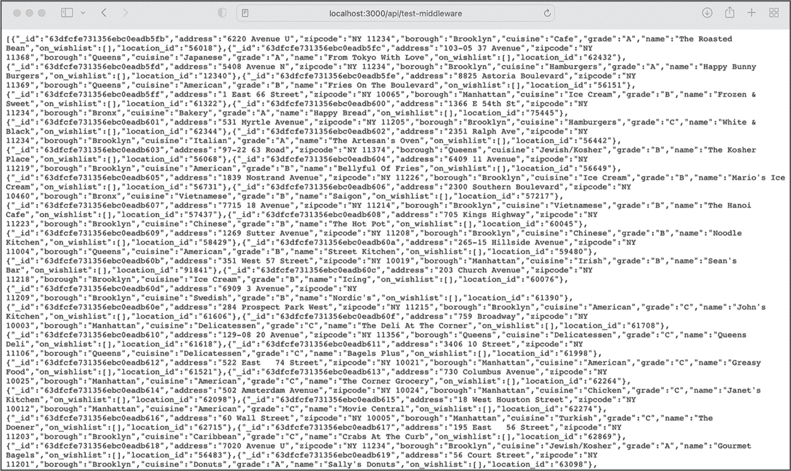

## 12 构建中间件


中间件是将我们稍后创建的前端与后端容器中现有的 MongoDB 实例连接的“软件胶水”。在本章中，我们将设置 Mongoose，将其连接到我们的数据库，并为应用程序创建一个 Mongoose 模型。在下一章中，我们将通过编写 GraphQL API 来完成中间件的构建。

这个中间件是 Next.js 的一部分，因此我们将与应用程序容器一起工作。但由于 Docker 守护进程确保我们本地应用程序目录中的文件会即时在应用程序容器内的工作目录中可用，我们可以使用本地代码编辑器或 IDE 修改本地机器上的文件。无需连接到容器的 shell，更不需要与 docker compose 交互；你应该可以在 *http://localhost:3000* 上立即看到所有更改。

### 配置 Next.js 以使用绝对导入

在我们编写 Next.js 中的第一行代码之前，让我们对 Next.js 配置做一个小的调整。我们希望任何模块的导入路径都是 *绝对的*，也就是说，它们应该从应用程序的根文件夹开始，而不是从导入它们的文件的位置开始。在 清单 12-1 中的导入，来自我们在 第六章 创建的 *pages/api/graphql.ts* 文件，是相对导入的例子。

```
import {resolvers} from "../../graphql/resolvers";
import {typeDefs} from "../../graphql/schema"; 
```

清单 12-1：pages/api/graphql.ts 中的导入语句

你应该看到它们是从文件所在的位置开始的，然后向上移动两级到根文件夹，最后找到包含 *resolvers* 和 *schema* TypeScript 文件的 *graphql* 文件夹。

随着我们的应用程序变得越来越复杂，我们将拥有更多层次的嵌套，而且手动向上遍历目录直到根文件夹会变得越来越不方便。这就是为什么我们希望使用从根文件夹直接开始的绝对导入，如 清单 12-2 所示。

```
import {resolvers} from "graphql/resolvers";
import {typeDefs} from "graphql/schema"; 
```

清单 12-2：pages/api/graphql.ts 的绝对导入语句

请注意，我们不需要在导入文件之前先遍历到根目录。为此，请打开 *tsconfig.json* 文件，该文件由 create-next-app 在应用程序的代码根目录 *code/foodfinder-application* 下创建，并添加一行代码，将 baseUrl 设置为根文件夹 (清单 12-3)。

```
{
"compilerOptions": {
 **"baseUrl": ".",**
`--snip--`
}
} 
```

清单 12-3：使用绝对 URL

使用 docker compose restart foodfinder-application 在新命令行标签页中重启应用程序的容器和 Next.js 应用程序。

### 连接 Mongoose

现在是时候开始编写中间件了。我们将从将 Mongoose 添加到应用程序开始。连接到应用程序的容器终端：

```
$ **docker exec -it foodfinder-application npm install mongoose**
```

在这里，我们使用npm install mongoose来安装包。只要容器正在运行，我们就不需要立即重建前端镜像，因为我们已经将包直接安装到了运行中的容器中。

#### 编写数据库连接

为了将 Next.js 应用程序连接到 MongoDB 实例，我们需要定义环境变量MONGO_URI并为其分配一个连接字符串，该字符串必须与后端暴露的端口和位置匹配。在应用程序的根目录中创建一个新的*.env.local*文件，位于*tsconfig.json*文件旁边，并向其中添加以下内容：

```
MONGO_URI=mongodb://backend:27017/foodfinder
```

现在我们可以将应用程序连接到 Docker 容器在 27017 端口上暴露的 MongoDB 实例。创建一个名为*middleware*的文件夹，放置在根文件夹*code/foodfinder-application*中。我们将在此文件夹中放置所有与中间件相关的 TypeScript 文件。创建一个新的文件，*db-connect.ts*，并将清单 12-4 中的代码粘贴到该文件中。

```
import mongoose, {ConnectOptions} from "mongoose";

const MONGO_URI = process.env.MONGO_URI || " ";

if (!MONGO_URI.length) {
    throw new Error(
        "Please define the MONGO_URI environment variable (.env.local)"
    );
}
let cached = global.mongoose;

if (!cached) {
    cached = global.mongoose = {conn: null, promise: null};
}

async function dbConnect(): Promise<any> {

    if (cached.conn) {
        return cached.conn;
    }

    if (!cached.promise) {

        const opts: ConnectOptions = {
            bufferCommands: false,
            maxIdleTimeMS: 10000,
            serverSelectionTimeoutMS: 10000,
            socketTimeoutMS: 20000,
        };

 cached.promise = mongoose
            .connect(MONGO_URI, opts)
            .then((mongoose) => mongoose)
            .catch((err) => {
                throw new Error(String(err));
            });
    }

    try {
        cached.conn = await cached.promise;
    } catch (err) {
        throw new Error(String(err));
    }

    return cached.conn;
}

export default dbConnect; 
```

清单 12-4：在 db-connect.ts 中将应用程序连接到数据库的 TypeScript 代码

我们导入了*mongoose*包和ConnectOptions类型，它们都是连接数据库所必需的。然后，我们从环境变量中加载连接字符串，并验证该字符串是否为空。

接下来，我们设置连接缓存。我们使用一个全局变量来保持连接，以便在热重载期间维持连接，并确保多次调用我们的dbConnect函数时始终返回相同的连接。否则，我们的应用程序可能会在每次热重载或每次函数调用时创建新的连接，这样会迅速占满内存。如果没有缓存的连接，我们会使用一个虚拟对象来初始化它。

我们创建了异步函数dbConnect，该函数实际打开并处理连接。由于数据库是远程的，并且不能立即访问，因此我们使用一个异步函数，并将其作为模块的默认函数进行导出。在函数体内，我们首先检查是否已经存在缓存的连接，并直接返回任何已存在的连接。否则，我们创建一个新的连接。因此，我们定义连接选项，然后创建一个新的连接；在这里，我们使用promise模式来提醒我们如何处理异步调用的两种可能方式。最后，我们await连接可用后，返回 Mongoose 实例。

要通过 Mongoose 打开一个缓存的 MongoDB 连接，我们现在可以从*middleware/db-connect*模块导入dbConnect函数，并等待 Mongoose 连接。

#### 修复 TypeScript 警告

在你的 IDE 中，你应该会立刻看到 TSC 警告我们使用了global.mongoose。对信息的仔细查看，Element implicitly has an 'any' type because type 'typeof globalThis' has no index signature.ts (7017)，告诉我们需要将mongoose属性添加到globalThis对象中。

正如我们在第三章中讨论的那样，我们使用*custom.d.ts*文件来定义自定义全局类型。创建一个新的文件*custom.d.ts*，并将其放在根目录下的*middleware*文件夹旁边。一旦将清单 12-5 中的代码粘贴到该文件中，全局命名空间应包含类型为mongoose的mongoose属性，并且 TSC 可以找到它。

```
import mongoose from "mongoose";

declare global {
    var mongoose: mongoose;
} 
```

清单 12-5：在 custom.d.ts 文件中定义自定义全局类型mongoose的代码

配置了自定义全局类型定义后，TSC 应该不再抱怨找不到global.mongoose的类型定义。我们可以继续创建适用于我们全栈应用的 Mongoose 模型。

### Mongoose 模型

我们的应用程序包含一个数据库，其中包含表示位置数据的文档集合，正如您在 第十一章 的种子脚本中看到的那样。我们将为这个位置集合创建一个 Mongoose 模型。在 第七章 中，您已经学习过，创建模型时需要一个接口来为 TypeScript 类型化文档，一个用于描述文档的模式，一个类型定义，以及一组自定义类型来定义 Mongoose 模型。此外，我们还将创建一组自定义类型来执行应用程序中对位置模型的 CRUD 操作。

在 Next.js 根目录下，创建一个名为 *mongoose* 的文件夹，并在其中创建一个名为 *locations* 的子文件夹，放置在 *middleware* 文件夹旁边。*mongoose* 文件夹将包含所有与 Mongoose 相关的文件，而 *locations* 文件夹将包含与位置模型相关的所有文件。

#### 创建模式

在 第七章 中，您已经学到模式描述了数据库文档的结构，并且在创建模式之前，您需要先创建 TypeScript 接口，这样您才能为模式和模型类型化。从技术上讲，在 Mongoose 版本 6.3.1 之后，我们不需要自己定义这个接口。相反，我们可以直接从模式中自动推断出接口类型。请在 *mongoose/locations* 文件夹中创建一个名为 *schema.ts* 的文件，并将 列表 12-6 中的代码粘贴到其中。

```
import {Schema, InferSchemaType} from "mongoose";

export const LocationSchema: Schema = new Schema<LocationType>({
    address: {
        type: "String",
        required: true,
    },
    street: {
        type: "String",
        required: true,
    },
    zipcode: {
        type: "String",
        required: true,
    },
    borough: {
        type: "String",
        required: true,
    },
    cuisine: {
        type: "String",
        required: true,
    },
    grade: {
        type: "String",
        required: true,
    },
    name: {
        type: "String",
        required: true,
    },
    on_wishlist: {
        type: ["String"],
        required: true,
    },
    location_id: {
        type: "String",
        required: true,
    },
});

export declare type LocationType = InferSchemaType<typeof LocationSchema>; 
```

列表 12-6：mongoose/locations/schema.ts 文件

我们导入了 Schema 构造函数和 InferSchemaType，这是用于推断模式类型的函数，它们都是 Mongoose 模块的一部分。然后我们定义并直接导出模式。该模式本身是直接明了的。位置集合中的文档包含一些自解释的属性，除了 on_wishlist 属性是一个字符串数组外，其他属性都是字符串类型。为了保持应用程序的简洁，我们将直接在位置文档中存储将某个位置添加到愿望清单中的用户 ID，而不是为每个用户的愿望清单创建新的 Mongoose 模型和 MongoDB 文档。这对于真实的应用程序来说不是一个很好的设计，但对我们的目的来说是足够的。最后，我们直接从模式中推断并导出 LocationType，而不是手动创建接口。

#### 创建位置模型

在模式和所需接口完成后，接下来是创建模型。请在 *mongoose/location* 文件夹中创建一个名为 *model.ts* 的文件，并将 列表 12-7 中的代码粘贴到其中。

```
import mongoose, {model} from "mongoose";
import {LocationSchema, LocationType} from "mongoose/locations/schema";

export default mongoose.models.locations ||
    model<LocationType>("locations", LocationSchema); 
```

列表 12-7：mongoose/locations/model.ts 文件

在导入 Mongoose 包所需的依赖后，我们从之前创建的 *schema.ts* 文件中导入 LocationSchema 和 LocationType。然后，我们使用这些来创建并导出我们的 locations 模型，除非已经存在一个名为 *locations* 的模型被初始化并存在。如果是这种情况，我们将返回现有的模型。

到此为止，我们已经成功创建了 Mongoose 模型并将其连接到数据库。现在我们可以访问 MongoDB 实例，并通过 Mongoose 的 API 在 locations 集合中进行创建、读取、更新和删除文档操作。

为了测试一切是否正常工作，尝试创建一个临时的 REST API，初始化与数据库的连接，然后通过模型查询所有文档。你可以在应用程序的*pages/api*文件夹中创建这个新文件 *test-middleware.ts*，并将 Listing 12-8 中的代码粘贴进去。

```
import type {NextApiRequest, NextApiResponse} from "next";

import dbConnect from "middleware/db-connect";
import Locations from "mongoose/locations/model";

export default async function handler(
    req: NextApiRequest, res: NextApiResponse<any>
) {
    await dbConnect();
    const locations = await Locations.find({});
    res.status(200).json(locations);
} 
```

Listing 12-8: 测试数据库连接的临时 REST API

这个 API 导入了 Next.js 所需的依赖，dbConnect 函数，以及我们之前创建的 Locations 模型。在异步的 API 处理程序中，它调用 dbConnect 函数，并等待 Mongoose 连接到数据库。然后，它在 Locations 模型上调用 Mongoose 的 find API，传入一个空的过滤对象。一旦接收到位置数据，API 处理程序将其发送给客户端。

如果你打开 *http://localhost:3000/api/test-middleware*，你应该会看到一个包含所有可用位置的 JSON 对象，类似于图 12-1。



图 12-1：测试中间件的 API 返回一个包含数据库中所有位置的 JSON 对象。

你已经成功创建了 Mongoose 模型并执行了第一次数据库查询。

### 模型的服务

第六章讨论了我们通常如何将数据库的 CRUD 操作抽象为服务调用，以简化后续实现 GraphQL API 的过程。这正是我们接下来要做的，首先，让我们概述所需的功能。

我们需要一个公共服务来查询所有可用位置，以便它们可以显示在应用程序的概览页面中。为了显示位置的详细信息，我们需要另一个公共服务来查找特定位置。我们选择使用位置的 ID 作为服务的参数，然后通过 ID 查找位置。为了处理愿望清单功能，我们需要一个服务来更新用户的愿望清单，以及另一个可以用来判断给定位置是否当前在用户愿望清单中的服务；根据结果，我们将显示“添加到”或“从中移除”按钮。

为了设计查找并返回位置的服务调用，我们将为每个公共 API 创建一个公共函数，并创建一个统一的内部函数 findLocations，该函数调用 Mongoose 的 find 函数。公共 API 构造 Mongoose 用于筛选集合中文档的过滤器对象。换句话说，它创建了数据库查询。同时，它设置了我们将传递给 Mongoose API 的附加选项。这种设计应该能减少我们需要编写的代码量，并防止重复。

#### 创建位置服务的自定义类型

你可能已经注意到，我们需要两个自定义类型作为统一的 findLocations 函数的参数。一个参数定义了与愿望清单相关的 find 操作的属性，另一个是位置的 ID。创建一个 *custom.d.ts* 文件，在 *mongoose/location* 文件夹中定义这些类型，如 Listing 12-9 所示。

```
export declare type FilterLocationType = {
    location_id: string | string[];
};

export declare type FilterWishlistType = {
    on_wishlist: {
        $in: string[];
    };
}; 
```

Listing 12-9: mongoose/locations/custom.d.ts 文件

我们定义并直接导出这两个自定义类型。FilterLocationType 是直接的，它定义了一个包含位置 ID 的对象，ID 可以是一个字符串或一个字符串数组。我们用它根据 ID 查找位置。第二个类型是 FilterWishlistType，我们将用它来查找所有包含用户 ID 在其 on_wishlist 属性中的位置。我们将 Mongoose 的 $in 操作符的值设置为字符串数组。

#### 创建位置服务

现在我们已经为服务创建了自定义类型，可以开始实现它们。像往常一样，我们在 *mongoose/location* 文件夹中创建一个 *services.ts* 文件，并将 Listing 12-10 中的代码添加到其中。

```
import Locations from "mongoose/locations/model";
import {
    FilterWishlistType,
    FilterLocationType,
} from "mongoose/locations/custom";
import {LocationType} from "mongoose/locations/schema";
import {QueryOptions} from "mongoose";

async function findLocations(
    filter: FilterLocationType | FilterWishlistType | {}
): Promise<LocationType[] | []> {
    try {
    let result: Array<LocationType | undefined> = await Locations.find(
            filter
        );
        return result as LocationType[];
    } catch (err) {
        console.log(err);
    }
    return [];
}

export async function findAllLocations(): Promise<LocationType[] | []> {
    let filter = {};
    return await findLocations(filter);
}

export async function findLocationsById(
    location_ids: string[]
): Promise<LocationType[] | []> {
    let filter = {location_id: location_ids};
    return await findLocations(filter);
}

export async function onUserWishlist(
    user_id: string
): Promise<LocationType[] | []> {
    let filter: FilterWishlistType = {
        on_wishlist: {
            $in: [user_id],
        },
    };
    return await findLocations(filter);
}

export async function updateWishlist(
    location_id: string,
    user_id: string,
    action: string
) : Promise<LocationType | null | {}>
 {
    let filter = {location_id: location_id};
    let options: QueryOptions = {upsert: true, returnDocument: "after"};
    let update = {};

    switch (action) {
        case "add":
            update = {$push: {on_wishlist: user_id}};
            break;
        case "remove":
            update = {$pull: {on_wishlist: user_id}};
            break;
    }

    try {
        let result: LocationType | null = await Locations.findOneAndUpdate(
            filter,
            update,
            options
        );
        return result;
    } catch (err) {
        console.log(err);
    }
    return {};
} 
```

Listing 12-10: mongoose/locations/services.ts 文件

在导入依赖项后，我们创建了一个实际调用 Mongoose 的 `find` API 的函数，并等待来自数据库的数据。这个函数将查询数据库中所有使用 `find` 的公共服务，因此它是所有服务的基础。它的一个参数 `filter` 对象，可以传递给模型的 `find` 函数，以检索与过滤器匹配的文档。该过滤器可以是一个空对象，返回所有位置，或者是我们的自定义类型之一，`FilterLocationType` 或 `FilterWishlistType`。一旦我们从数据库中获得数据，就将其转换为 `LocationType`，然后返回。如果出现错误，我们会记录错误，并返回一个空数组，以匹配已定义的返回类型：要么是 `LocationTypes` 数组，要么是空数组。

以下三个功能是公共服务，它们将为其他 TypeScript 模块和用户界面提供数据库访问。这些功能都遵循相同的结构。首先，在 `findLocationsById` 函数中，我们将 `filter` 对象设置为特定的参数。然后我们使用此特定服务的 `filter` 对象调用 `findLocations` 函数。因为每个服务都调用相同的函数，所以各个服务也有相同的返回签名，并且每个服务返回的是一个位置数组或一个空数组。第一个使用的是一个空对象。因此，它不会过滤任何内容，而是返回集合中的所有文档。函数 `findLocationsById` 使用 `FilterLocationType` 并返回与给定位置 ID 匹配的文档。

下一个函数onUserWishlist使用了一个稍微复杂的filter对象。它的类型是FilterWishlistType，我们将其传递给findLocations函数，以获取所有其on_wishlist数组中包含给定用户 ID 的位置。注意，我们在声明时明确指定了filter对象的类型。这与第三章中的建议有所不同，但我们这么做是为了确保 TSC 验证对象的属性，因为在这种情况下它无法从使用方式推断出类型。

最后，我们实现了updateWishlist函数。它与之前的函数稍有不同，但整体结构应该很熟悉。我们再次从第一个参数构建filter对象，使用第二个参数——用户 ID——来更新on_wishlist数组。不过，与之前的函数不同，我们使用另一个参数来指定是否要将用户 ID添加到数组中或移除。在这里使用switch/case语句是一种便捷的方式，能减少暴露的服务数量。根据操作参数，我们用$push操作符填充更新对象，该操作符将用户 ID 添加到on_wishlist数组中，或者用$pull操作符将用户 ID 移除。我们将该对象传递给 Mongoose 的findOneAndUpdate API，查找第一个匹配筛选条件的文档，直接更新记录，然后返回更新后的文档或空对象。

#### 测试服务

让我们使用临时的 REST API 来评估这些服务。打开我们之前创建的*test-middleware.ts*文件，并用列表 12-11 中的代码更新它。

```
import type {NextApiRequest, NextApiResponse} from "next";
import dbConnect from "middleware/db-connect";

import {findAllLocations} from "mongoose/locations/services";

export default async function handler(
    req: NextApiRequest,
    res: NextApiResponse<any>
) {
    await dbConnect();
    const locations = await findAllLocations();
    res.status(200).json(locations);
} 
```

列表 12-11：使用服务的 pages/api/test-middleware.ts 文件

我们没有直接导入模型并使用 Mongoose 的 find 方法，而是导入了位置服务，并通过 findAllLocations 服务查询所有位置。如果你在浏览器中打开 *http://localhost:3000/api/test-middleware* 的 API，你应该再次看到一个包含所有可用位置的 JSON 对象。

### 总结

我们成功创建了中间件的第一部分。通过本章的代码，我们可以使用 Mongoose 模型在 MongoDB 集合中创建、读取、更新和删除文档。为了执行这些操作，我们设置了将与即将到来的 GraphQL API 连接的服务。在下一章中，我们将删除临时的测试 API 中间件，并用一个正式的 GraphQL API 替换它。
