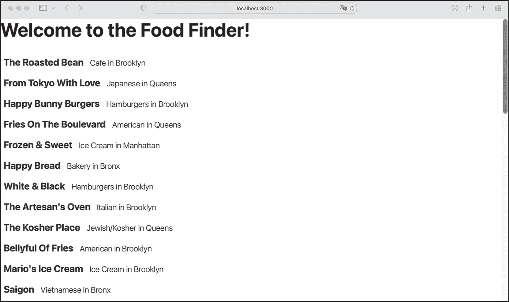
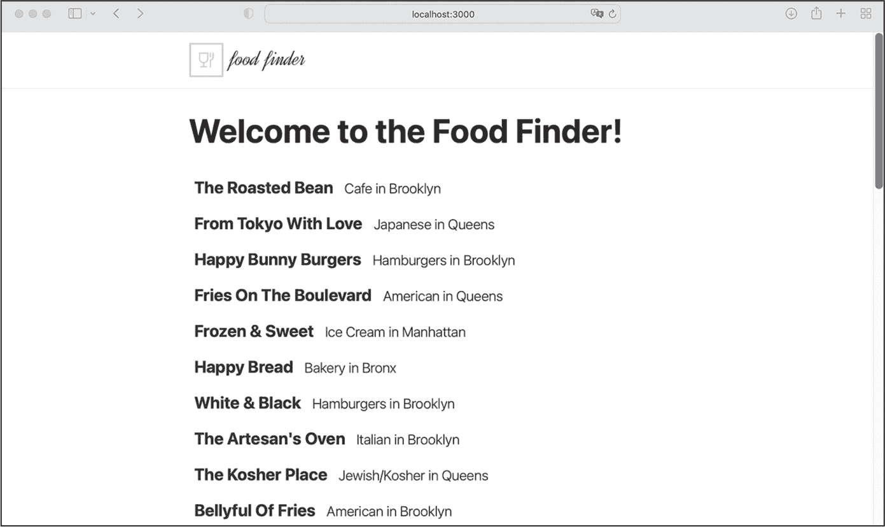

## 14 构建前端


在本章中，您将使用 React 组件和 Next.js 页面构建前端，这些内容将在第四章和第五章中讨论。到最后，您将拥有一个初始版本的应用程序，可以在其中添加 OAuth 认证。

### 用户界面概览

我们的应用程序将由三个 Next.js 页面组成。*启动页面*将显示从数据库中获取的地点列表。列表中的每个项目将链接到各自的*地点详情页面*，其 URL 将通过地点的 ID 构建，如：*/location/:location_id*。第三个页面是用户的*愿望清单页面*。它与启动页面相似，并遵循与地点详情页面相同的动态 URL 模式，只不过它提供的是用户的 ID，而不是地点的 ID。该页面仅显示已经添加到愿望清单中的地点。

我们还必须考虑每个页面使用哪种渲染策略。由于启动页面的内容永远不会改变，我们将使用静态站点生成（SSG）在构建时渲染 HTML。由于详情页面和愿望清单页面将根据用户的操作发生变化，我们将使用静态站点渲染（SSR）在每次请求时重新生成它们。

最后，所有三个页面应具有包含徽标和指向启动页面链接的头部。当我们在下一章添加 OAuth 数据时，我们将在头部显示用户的姓名、指向用户愿望清单的链接以及登录/注销按钮。

为了实现这一点，我们需要创建以下 React 组件：

+   位置列表组件，它将使用位置列表项组件来渲染启动页面上的位置列表。稍后，我们将使用这些相同的组件来实现用户愿望清单页面上的位置列表。

+   整体布局组件、头部组件和徽标组件，它们定义了每个页面的全局布局。

+   身份验证元素组件，允许用户在头部登录或注销。

+   一个我们将用于不同任务的通用按钮组件。

让我们从启动页面所需的组件开始。

### 启动页面

我们将从构建用户界面中最小的部分开始，然后使用这些部分构建更复杂的组件和页面。在启动页面上，我们需要布局组件、位置列表组件和位置列表项组件，位置列表项是最小的构建块，因此我们将从这里开始。

在应用程序的根目录中创建*components*文件夹，放在*middleware*文件夹旁边。这是我们将所有 React 组件放在各自文件夹中的地方。

#### 列表项

位置列表项组件表示位置列表中的单个项。创建 *locations-list-item* 文件夹，并根据我们在 第五章 中讨论的模式添加两个文件，*index.tsx* 和 *index.module.css*。然后，将 Listing 14-1 中的代码添加到 *index.module.css* 文件中。我们将使用此 CSS 样式来设计该组件。

```
.root {
    background-color: #fff;
    border-radius: 5px;
    color: #1d1f21;
    cursor: pointer;
    list-style: none;
    margin: 0.5rem 0;
    padding: 0.5rem;
    transition: background-color 0.25s ease-in, color 0.25s ease-in;
    will-change: background-color, color;
}

.root:hover {
    background-color: rgba(0, 118, 255, 0.9);
    color: #fff;
}

.root h2 {
    margin: 0;
    padding: 0;
}

.root small {
    font-weight: 300;
    padding: 0 1rem;
} 
```

Listing 14-1: The components/locations-list-item/index.module.css 文件

CSS 模块使用白色背景上的深色文字。此外，它添加了一个简单的悬停效果，使得当用户将鼠标悬停时，背景变为蓝色，字体颜色变为白色。我们去除了列表标记并相应地设置了边距和内边距。

现在将 Listing 14-2 中的代码添加到 *index.tsx* 文件中。

```
import Link from "next/link";
import styles from "./index.module.css";
import {LocationType} from "mongoose/locations/schema";

interface PropsInterface {
    location: LocationType;
}

const LocationsListItem = (props: PropsInterface): JSX.Element => {
    const location = props.location;
    return (
        <>
            {location && (
                <li className={styles.root}>
                    <Link href={`/location/${location.location_id}`}>
                        <h2>
                            {location.name}
                            <small className={styles.details}>
                                {location.cuisine} in {location.borough}
                            </small>
                        </h2>
                    </Link>
                </li>
            )}
        </>
    );
};

export default LocationsListItem; 
```

Listing 14-2: The components/locations-list-item/index.tsx 文件

你应该对这个文件的结构已经非常熟悉，来自 第五章。首先，我们导入 *next/link* 组件，它是我们创建指向详细页面链接所必需的，接着导入我们刚刚添加的样式，以及来自 Mongoose 模式的 LocationType。

然后，我们定义了 PropsInterface，这是一个私有接口，用于组件的属性对象。组件具有常规的 props 参数，其结构定义了 PropsInterface，并返回一个 JSX 元素。这些 props 包含 location 属性中的数据，我们通过其 location 属性将其传递给组件。最后，我们定义了 LocationsListItem 组件，并将其存储在一个常量中，最后将其导出到文件的末尾。

在组件本身，我们有一个包含 Next.js Link 元素的列表项，该元素链接到位置的详细页面。这些链接使用动态 URL 模式，其中包含相应位置的 ID，因此我们创建链接目标以匹配 */location/:location_id*。此外，我们将位置的 name、cuisine 和 borough 值渲染到组件中。请记住，直到我们为路由 */location/:location_id* 创建页面之前，点击这些链接将会导致 *404* 错误页面。

#### 位置列表

使用列表项组件，我们将构建地点列表。这个组件会循环遍历地点数组，并在启动页面和愿望清单页面上显示这些地点。创建 *components/locations-list* 文件夹，并将文件 *index.tsx* 和 *index.module.css* 添加进去。将 列表 14-3 中的代码复制到 *index.module.css* 文件。

```
.root {
    margin: 0;
    padding: 0;
} 
```

列表 14-3：components/locations-list/index.module.css 文件

地点列表组件的样式很简单；我们从组件的根元素中移除边距和内边距。我们在 列表 14-4 中创建了该组件，你应当将其复制到 *index.tsx* 文件中。

```
import LocationsListItem from "components/locations-list-item";
import styles from "./index.module.css";
import {LocationType} from "mongoose/locations/schema";

interface PropsInterface {
    locations: LocationType[];
}

const LocationsList = (props: PropsInterface): JSX.Element => {
    return (
        <ul className={styles.root}>
            {props.locations.map((location) => {
                return (
                    <LocationsListItem
                        location={location}
                        key={location.location_id}
                    />
                );
            })}
        </ul>
    );
};

export default LocationsList; 
```

列表 14-4：components/locations-list/index.tsx 文件

我们导入刚刚实现的 LocationsListItem，以及模块的样式和 Mongoose 模式中的 LocationType。然后，我们定义组件的 PropsInterface 来描述组件的 props 对象。在 LocationsList 组件中，我们使用数组的 map 函数遍历 location 对象，为每个数组项渲染一个 LocationsListItem 组件，并使用 location 属性将地点详情传递给组件。React 要求在循环中渲染的每一项都具有唯一的 ID。我们使用地点 ID 来实现这个目的。

我们现在可以创建启动页面，并将所有可用的地点传递给该组件。稍后，我们将使用相同的组件来显示用户愿望清单页面上的地点。

#### 页面

此时，我们已经具备了启动页面所需的组件，这个页面是一个基本的 Next.js 页面。将该页面的全局样式保存在 *styles/globals.css* 文件中，代码保存在 *pages/index.tsx* 文件中。列表 14-5 包含了样式。删除 *styles* 目录中的其他文件，这些是我们应用程序不需要的默认样式。

```
html,
body {
    font-family: -apple-system, Segoe UI, Roboto, sans-serif;
    margin: 0;
    padding: 0;
}

* {
    box-sizing: border-box;
}

h1 {
    font-size: 3rem;
}

a {
    color: inherit;
    text-decoration: none;
} 
```

列表 14-5：styles/globals.css 文件

我们设置了一些全局样式，例如默认字体，并将盒子模型更改为所有元素更直观的 border-box。通过使用 border-box 代替 content-box，元素会采用我们用 width 属性指定的宽度。否则，width 属性只会定义内容的宽度，我们还需要加上边框和内边距，才能计算元素在页面上的实际尺寸。我们将字体设置为每个操作系统的默认值，以确保可读性。

现在，用列表 14-6 中的代码替换现有的 *pages/index.tsx* 文件内容。

```
import Head from "next/head";
import type {GetStaticProps, InferGetStaticPropsType, NextPage} from "next";

import LocationsList from "components/locations-list";
import dbConnect from "middleware/db-connect";
import {findAllLocations} from "mongoose/locations/services";
import {LocationType} from "mongoose/locations/schema";

❶ const Home: NextPage = (
    props: InferGetStaticPropsType<typeof getStaticProps>
) => {

  ❷ const locations: LocationType[] = JSON.parse(props.data?.locations);
    let title = `The Food Finder - Home`;

    return (
        <div>
            <Head>
                <title>{title}</title>
                <meta name="description" content="The Food Finder - Home" />
            </Head>

            <h1>Welcome to the Food Finder!</h1>
            <LocationsList locations={locations} />
        </div>
    );
};

❸ export const getStaticProps: GetStaticProps = async () => {
    let locations: LocationType[] | [];
    try {
        await dbConnect();
      ❹ locations = await findAllLocations();
    } catch (err: any) {
        return {notFound: true};
    }
  ❺ return {
        props: {
            data: {locations: JSON.stringify(locations)},
        },
    };
};

export default Home; 
```

列表 14-6：`pages/index.tsx` 文件

我们实现了 Next.js 页面，结构类似于第五章中讨论的内容。首先，我们导入所有依赖项；然后，我们创建 NextPage，并将其存储在常量中，最终在文件末尾导出 ❶。

Next.js 页面中的 props 对象，即页面属性，包含我们从 getStaticProps 函数 ❺ 返回的数据，详见第五章。在这个异步函数中，我们连接到数据库 ❸。一旦连接准备就绪，我们调用服务方法来获取所有位置 ❹，然后将它们作为 JSON 字符串传递给 NextPage，并作为 props 对象中的 data.locations 属性。Next.js 在构建时调用 getStaticProps 函数，并只生成一次该页面的 HTML。我们可以使用这种渲染方式，因为可用位置的列表是静态的，永远不会改变。

然后我们从页面属性 ❷ 中获取位置数据，解析 JSON 字符串为数组，并将页面标题存储在一个变量中。我们显式地输入 locations 常量，因为 TSC 无法轻易推断其类型。接着我们构建 JSX。在第一步中，我们使用 next/head 组件设置页面特定的元数据。然后，我们调用之前实现的 LocationList 组件，并将 locations 数组作为 locations 属性传入。通过这样做，LocationList 组件将所有位置呈现为概览列表。

一旦你保存文件，你应该能够在 Docker 命令行中看到 Next.js 正在重新编译应用程序。打开浏览器中的网页应用程序 *http://localhost:3000*，你会看到类似于 图 14-1 的位置列表。



图 14-1：显示所有可用位置的开始页面

接下来我们将开始为前端进行样式设计，并添加一些基础的全局组件，比如带有 Food Finder 标志的应用程序头部。

### 全局布局组件

现在是时候创建三个全局组件了。这些组件包括整体布局组件，我们将用它来格式化开始页和愿望清单页的内容，一个 *粘性* 头部（它始终可见，“粘”在浏览器的顶部边缘），以及放在头部的 Food Finder 标志。我们将从最小的单元开始，然后使用这些单元作为整体组件的构建模块。

#### 标志

最小的组件，标志，只不过是一个 next/image 组件，外面包裹着一个 next/link 元素；当用户点击标志图像时，他们将被重定向到开始页面。添加一个 *header* 文件夹到 *components* 文件夹中，然后在 *header* 文件夹里添加一个 *logo* 文件夹，并在其中创建两个文件，*index.tsx* 和 *index.module.css*，将 清单 14-7 中的代码粘贴到这两个文件中。

```
.root {
    display: inline-block;
    height: 35px;
    position: relative;
    width: 119px;
}

@media (min-width: 600px) {
    .root {
        height: 50px;
        width: 169px;
    }
} 
```

清单 14-7：components/header/logo/index.module.css 文件

这些基本样式用于组件的 根 元素，设置图像的尺寸。我们使用 *移动优先设计模式*，首先定义用于小屏幕的样式，然后通过标准的 CSS 媒体查询，修改大于 600px 屏幕的样式。我们将在更大的屏幕上使用更大的图像。

现在，让我们创建 logo 组件。在 Next.js *public* 文件夹中创建一个 *assets* 子文件夹，并将从 *assets.zip* 中提取的 *logo.svg* 文件放入其中。然后将 列表 14-8 中的代码添加到 logo 的 *index.tsx* 文件中。

```
import Image from "next/image";
import Link from "next/link";
import logo from "/public/assets/logo.svg";
import styles from "./index.module.css";

const Logo = (): JSX.Element => {
    return (
        <Link href="/" passHref className={styles.root}>
            <Image
                src={logo}
                alt="Logo: Food Finder"
                sizes="100vw"
                fill
                priority
            />
        </Link>
    );
};

export default Logo; 
```

列表 14-8：components/header/logo/index.tsx 文件

和往常一样，我们导入依赖项，然后创建一个导出的常量，包含 JSX 代码。我们没有通过属性或子元素传递任何数据给它；因此，我们不需要在此处定义组件的 props 对象。

我们在 next/image 中使用了一个基本的 next/link 元素来链接回起始页面，并将 next/image 的属性设置为填充在 CSS 文件中定义的可用空间。

#### 头部

头部组件将包裹我们刚刚创建的 logo 组件。在 *header* 文件夹中创建 *index.tsx* 文件和 *index.module.css* 文件，然后将 列表 14-9 中的代码添加到 CSS 文件中。

```
.root {
    background: white;
    border-bottom: 1px solid #eaeaea;
    padding: 1rem 0;
    position: sticky;
    top: 0;
    width: 100%;
    z-index: 1;
} 
```

列表 14-9：components/header/index.module.css 文件

我们使用 CSS 定义 position: sticky 和 top: 0 将头部固定在浏览器的上边缘。现在，即使用户向下滚动页面，头部也会自动停留在那里；页面的内容应该在头部下方滚动，因为我们设置了头部的 z-index，将头部置于其他元素前面。你可以把 z-index 想象成决定一个元素所在楼层的方式。

列表 14-10 显示了头部组件的代码。将它复制到组件的 *index.tsx* 文件中。

```
import styles from "./index.module.css";
import Logo from "components/header/logo";

const Header = (): JSX.Element => {
    return (
        <header className={styles.root}>
            <div className="layout-grid">
                <Logo />
            </div>
        </header>
    );
};

export default Header; 
```

列表 14-10：components/header/index.tsx 文件

我们定义了一个基本组件来显示 logo。然后，我们将导入的 Logo 组件包裹在一个具有全局 layout-grid 类的元素中，接下来我们将在下一节定义这个类。

#### 布局

目前，我们有一个 Next.js 页面（起始页面）和一个头部组件。将头部添加到页面的最简单方法是将其导入到 Next.js 页面并直接放入 JSX 中。然而，我们还将向应用程序中添加两个页面，愿望清单页面和位置详情页面，所以我们希望避免将头部导入三次。

为了简化整个应用程序的设计，Next.js 提供了 *layout* 的概念，实际上这只是另一个组件，我们可以用它将头部组件添加为页面内容的兄弟元素。让我们创建一个新的布局组件。首先，为了创建该组件的 CSS 文件，将 *layout.css* 添加到 *styles* 文件夹，并将 Listing 14-11 中的代码粘贴到其中。

```
.layout-grid {
    align-items: center;
    display: flex;
    flex-direction: column;
    justify-content: space-between;
    margin: 0 auto;
    max-width: 800px;
    padding: 0 1rem;
    width: 100%;
}

@media (min-width: 600px) {
    .layout-grid {
        flex-direction: row;
        padding: 0 2rem;
    }
} 
```

Listing 14-11: The styles/layout.css file

我们再次使用移动优先模式来定义一个基本的网格包装器，设置内容区域的全局内边距和最大宽度。我们将包装器的左右 margin 设置为 auto，这样可以使容器居中，因为边距会占用固定宽度的包装器和窗口边缘之间的所有可用空间。

我们使用 flexbox 设置包装器的直接子元素的排列方向为 column，使它们一个接一个地垂直排列。由于 logo 和所有接下来的头部元素都是带有 layout-grid 类的元素的直接子元素，因此它们会受到 flexbox 布局的影响。相反，位置项不是直接的兄弟元素，因此它们在切换屏幕尺寸时不会改变方向。

然后，我们使用媒体查询来调整宽度大于 600px 的屏幕的样式。在这里，我们增加了内边距，并改变了直接子元素的布局顺序。我们不再使用 column，而是将其设置为 row，这样就能立即将元素并排显示。

由于这是一个全局样式文件，而不是 CSS 模块，Next.js 不会自动作用域类名。因此，我们为类名前添加了 layout- 前缀，并且在使用这些样式之前不会将它们导入到组件中。

现在在 *components* 文件夹内创建一个 *layout* 文件夹，并添加 *index.tsx* 文件，将 Listing 14-12 中的组件代码粘贴到其中。

```
import Header from "components/header";

interface PropsInterface {
    children: React.ReactNode;
}

const Layout = (props: PropsInterface): JSX.Element => {
    return (
        <>
            <Header />
            <main className="layout-grid">
                {props.children}
            </main>
        </>
    );
};
export default Layout; 
```

Listing 14-12: The components/layout/index.tsx file

在布局组件中，我们定义了一个私有接口和一个具有常规结构的组件。在组件内部，我们添加了 Header 和使用全局布局样式的 main 元素，它作为包装器，包含了我们将在 *_app.tsx* 文件中传递给该组件的 children 元素。

打开 *_app.tsx* 文件并按 Listing 14-13 中所示进行修改。

```
import "../styles/globals.css";
**import "../styles/layout.css";**
import type {AppProps} from "next/app";
**import Layout from "components/layout";**

export default function App({Component, pageProps}: AppProps) {
    return (
 **<Layout>**
            <Component {...pageProps} />
 **<****/Layout>**
    );
} 
```

Listing 14-13: The pages/_app.tsx file

首先，我们添加 *layout.css* 作为全局样式。至于布局，我们只有一个 layout 组件，将用于所有页面，并在此处导入。然后，我们将应用程序的页面包裹在布局中，并将当前页面传递给组件的 children 属性。

现在，所有我们的 Next.js 页面都将遵循相同的结构：它们将在 Header 组件旁边，包含页面内容的 main 元素。遵循这种模式的一个好处是，组件的状态将在页面变化和 React 组件重新渲染之间保持不变。

一旦 Next.js 重新编译应用程序，请尝试在浏览器中重新加载应用程序 *http://localhost:3000*。它应该看起来像 图 14-2。



图 14-2: 带有标题和布局组件的起始页面

现在你应该能看到标题，而新的布局组件使内容居中。

### 位置详情页面

我们的应用程序现在有一个带有标题的起始页面，并列出所有可用的位置。列表项链接到其特定位置的详情页，因为我们在它们中添加了 next/link 组件，但这些页面还不存在。如果点击其中一个链接，你将遇到 *404* 错误。为了显示位置详情页面，我们首先需要实现列出特定位置详情的组件，然后创建一个新的 Next.js 页面。

#### 组件

让我们从详情组件开始。在 *components* 目录中创建 *location-details* 文件夹，并向其中添加 *index.module.css* 和 *index.tsx* 文件。然后将 列表 14-14 中的代码添加到 CSS 模块中。

```
.root {
    margin: 0 0 2rem 0;
    padding: 0;
}
.root li {
    list-style: none;
    margin: 0 0 0.5rem 0;
} 
```

列表 14-14: components/locations-details/index.module.css 文件

该组件的样式比较基础。我们去掉了默认的边距和填充以及列表样式，然后在每个列表项和根元素的末尾添加了自定义边距。

要实现位置详情组件，将 列表 14-15 中的代码添加到 *components/locations-details* 文件夹中的 *index.tsx* 文件。

```
import {LocationType} from "mongoose/locations/schema";
import styles from "./index.module.css";

interface PropsInterface {
    location: LocationType;
}

const LocationDetail = (props: PropsInterface): JSX.Element => {
    let location = props.location;
    return (
        <div>
            {location && (
                <ul className={styles.root}>
                    <li>
                        <b>Address: </b>
                        {location.address}
                    </li>
                    <li>
                        <b>Zipcode: </b>
                        {location.zipcode}
                    </li>
                    <li>
                        <b>Borough: </b>
                        {location.borough}
                    </li>
                    <li>
                        <b>Cuisine: </b>
                        {location.cuisine}
                    </li>
                    <li>
                        <b>Grade: </b>
                        {location.grade}
                    </li>
                </ul>
            )}
        </div>
    );
};
export default LocationDetail; 
```

列表 14-15: components/locations-details/index.tsx 文件

位置详情组件在结构上与位置列表项类似。两者都接收一个包含位置数据的对象，并为返回的 JSX 元素添加一组特定的属性。主要的区别在于我们创建的 JSX 结构。除此之外，我们遵循已知的模式，导入所需的样式和类型，使用LocationType定义组件的props接口，然后返回一个包含位置详情的 JSX 元素。

#### 页面

我们在第 215 页的“用户界面概述”中提到，位置的详情页面应位于动态 URL*location/:location"ePub-I">location*文件夹下，位于*pages*目录中，并添加包含列表 14-16 代码的*[locationId].tsx*文件。

```
import Head from "next/head";
import type {
    GetServerSideProps,
    GetServerSidePropsContext,
    InferGetServerSidePropsType,
    PreviewData,
    NextPage,
} from "next";
import LocationDetail from "components/location-details";
import dbConnect from "middleware/db-connect";
import {findLocationsById} from "mongoose/locations/services";
import {LocationType} from "mongoose/locations/schema";
import {ParsedUrlQuery} from "querystring";

const Location: NextPage = (
    props: InferGetServerSidePropsType<typeof getServerSideProps>
) => {
    let location: LocationType = JSON.parse(props.data?.location);
  ❶ let title = `The Food Finder - Details for ${location?.name}`;
    return (
        <div>
            <Head>
                <title>{title}</title>
                <meta
                    name="description"
                    content={`The Food Finder. 
                        Details for ${location?.name}`}
                />
            </Head>
            <h1>{location?.name}</h1>
          ❷ <LocationDetail location={location} />
        </div>
    );
};

❸ export const getServerSideProps: GetServerSideProps = async (
    context: GetServerSidePropsContext<ParsedUrlQuery, PreviewData>
) => {
     let locations: LocationType[] | [];
  ❹ let {locationId} = context.query;
     try {
        await dbConnect();
        locations = await findLocationsById([locationId as string]);
      ❺ if (!locations.length) {
            throw new Error(`Locations ${locationId} not found`);
        }
    } catch (err: any) {
        return {
            notFound: true,
        };
    }
    return {
      ❻ props: {data: {location: JSON.stringify(locations.pop())}},
    };
}; 
```

列表 14-16：pages/location/[locationId].tsx 文件

起始页面和位置详情页面看起来非常相似。唯一的视觉差异是页面的标题，它是通过位置名称构建的❶，并且我们不再使用LocationsList组件，而是使用带有单个位置对象的LocationDetail组件❷。

然而，从功能角度来看，两个页面并不相似。与使用 SSG 的起始页面不同，位置详情页面使用 SSR，并配合使用getServerSideProp ❸。这是因为一旦我们添加了愿望清单功能并实现了添加/移除按钮，页面的内容应该随着用户的操作而变化。因此，我们需要在每次请求时重新生成 HTML。我们在第五章中深入讨论了 SSR 与 SSG 的区别。

我们使用页面的context及其query属性，从动态 URL 中获取位置 ID❹。然后，我们使用该 ID 从数据库中获取匹配的位置。如前所述，我们直接使用服务，而不是调用公开的 API，因为 Next.js 在服务器端运行get...Prop函数，并且可以直接访问我们应用程序中间件中的服务。

我们还实现了两种退出场景。首先，如果没有结果，我们会抛出一个错误，进入catch块❺，这样会将用户重定向到*404 未找到*错误页面。否则，我们将从结果中存储第一个位置到 location 属性❻，并将其传递给我们在最后一行导出的 Next.js 页面函数。

### 总结

我们已经成功构建了 Food Finder 应用程序的前端。到目前为止，你已经实现了一个全栈网页应用，它从 MongoDB 数据库读取数据，并在 Next.js 中以 React 用户界面组件的形式渲染结果。接下来，我们将添加一个 GitHub 的 OAuth 认证流程，以便用户可以使用 GitHub 账户登录并保存个性化的愿望清单。
