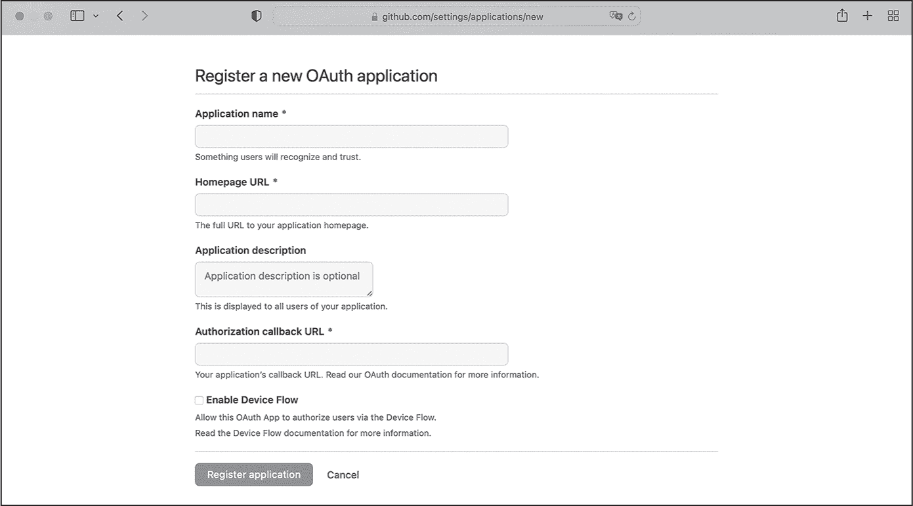
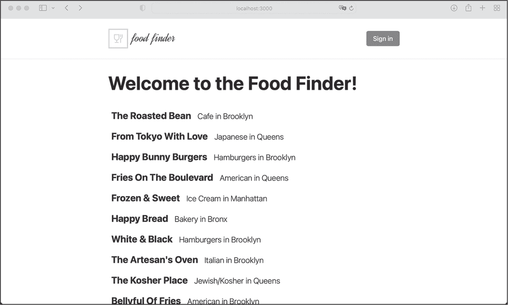
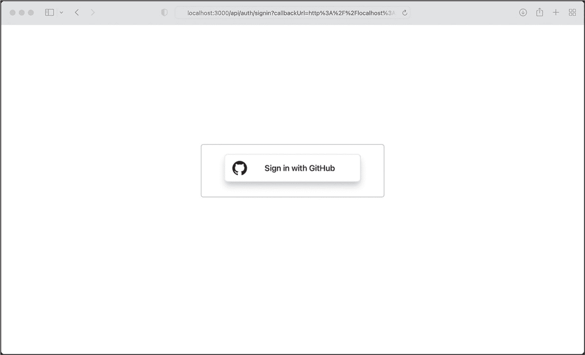
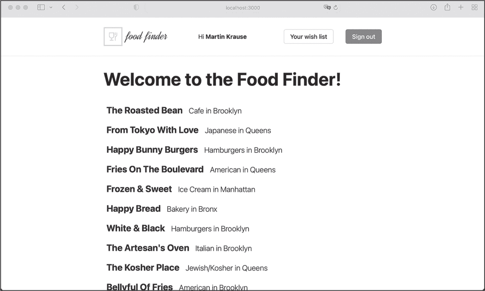

## 第十五章：15 添加 OAuth


在本章中，你将为 Food Finder 应用添加 OAuth 身份验证，为用户提供使用其 GitHub 帐户登录的机会。你还将实现愿望清单页面，经过身份验证的用户可以在该页面上添加和移除位置，以及完成此操作所需的按钮组件。最后，你将学习如何保护你的 GraphQL 变更免受未经身份验证用户的访问。

### 使用 next-auth 添加 OAuth

开发人员通常使用第三方库或 SDK 来实现 OAuth。对于 Food Finder 应用程序，我们将使用来自 Auth.js 的 *next-auth* 包，该包包含一整套预配置的模板，允许我们轻松连接到 OAuth 服务。这些模板被称为 *providers*，我们将使用其中一个：GitHub provider，它为我们的应用添加了一个通过 GitHub 登录的按钮。有关 OAuth 身份验证过程的复习，请返回 第九章。

#### 创建 GitHub OAuth 应用

首先，我们需要使用 GitHub 创建一个 OAuth 应用程序。这将为 Food Finder 应用提供连接 GitHub 所需的客户端 ID 和客户端密钥。如果你还没有 GitHub 帐号，可以现在在 [*https://<wbr>github<wbr>.com*](https://github.com) 创建一个帐号并登录。然后导航至 [*https://<wbr>github<wbr>.com<wbr>/settings<wbr>/developers*](https://github.com/settings/developers)，在 OAuth 应用程序部分创建一个新的 OAuth 应用。在生成的表单中输入 Food Finder 应用的详细信息，表单应类似于 图 15-1。



图 15-1：GitHub 用户界面用于添加新的 OAuth 应用

输入 **Food Finder** 作为名称，将主页 URL 设置为 **http://localhost:3000/**，并将授权回调 URL 设置为 **http://localhost:3000/api/auth/callback/github**。注册应用程序后，GitHub 应该会显示客户端 ID，并让我们生成客户端密钥。

#### 添加客户端凭证

现在将这些凭证复制为 GITHUB_CLIENT_ID 和 GITHUB_CLIENT_SECRET，并粘贴到应用程序代码根目录中的 *env.local* 文件中。该文件如下所示：

```
MONGO_URI=mongodb://backend:27017/foodfinder
GITHUB_CLIENT_ID=`ADD_YOUR_CLIENT_ID_HERE`
GITHUB_CLIENT_SECRET=`ADD_YOUR_CLIENT_SECRET_HERE` 
```

用你的凭证填写占位符。

#### 安装 next-auth

要将 Auth.js 的 OAuth SDK 添加到 *next-auth* 中并将其配置为连接到 provider，请运行以下命令：

```
$ **docker exec -it foodfinder_application npm install next-auth**
```

默认情况下，该 SDK 使用加密的 JWT 来存储并将会话信息附加到 API 请求中。只要我们提供密钥，库将自动处理加密和解密。要添加这样的密钥，请打开 *env.local* 文件，并在文件末尾添加以下行：

```
NEXTAUTH_SECRET=78f6cc4bf633b1102f4ca4d72602c60f
```

使用您喜欢的任何密钥。此处使用的字符串是通过 *OpenSSL* 在 *[`www.usemodernfullstack.dev/api/v1/generate-secret`](https://www.usemodernfullstack.dev/api/v1/generate-secret)* 上随机生成的，您应该为每个应用程序使用一个新的密钥。

#### 创建认证回调

现在，我们将开发 *api/auth* 路由，用于我们在注册 OAuth 应用时提供给 GitHub 的授权回调 URL。在 *pages/api* 目录下创建 *auth* 文件夹，并在其中创建文件 *[...nextauth].ts*。文件名中的 ... 告诉 Next.js 路由器这是一个“捕获所有”路由，意味着它处理所有指向 */auth* 下端点的 API 调用；例如，*auth/signin* 或 *auth/callback/github*。将 列表 15-1 中的代码添加到该文件中。

```
import GithubProvider from "next-auth/providers/github";
import {NextApiRequest, NextApiResponse} from "next";
import NextAuth from "next-auth";
import {createHash} from "crypto";

const createUserId = (base: string): string => {
    return createHash("sha256").update(base).digest("hex");
};

export default async function auth(req: NextApiRequest, res: NextApiResponse) {
    return await NextAuth(req, res, {
        providers: [
            GithubProvider({
                clientId: process.env.GITHUB_CLIENT_ID || " ",
                clientSecret: process.env.GITHUB_CLIENT_SECRET || " ",
            }),

        ],
        callbacks: {
            async jwt({token}) {
                if (token?.email && !token.fdlst_private_userId) {
                    token.fdlst_private_userId = createUserId(token.email);
                }
                return token;
            },
 async session({session}) {
                if (
                    session?.user?.email &&
                    !session?.user.fdlst_private_userId
                ) {
                    session.user.fdlst_private_userId = createUserId(
                        session?.user?.email
                    );
                }
                return session;
            },
        },
    });
} 
```

列表 15-1：pages/api/auth/[...nextauth].ts 文件

我们导入依赖项，包括内置的 GithubProvider 和默认的 crypto 模块。然后，我们创建一个简单的 createUserId 函数，它接受一个字符串作为参数，并调用 crypto 模块的 createHash 函数，以从该字符串返回哈希的用户 ID。

接下来，我们创建并导出默认的异步 auth 函数。为此，我们初始化 NextAuth 模块，并将 GithubProvider 添加到 providers 数组中。我们将其配置为使用我们存储在环境变量中的 clientId 和 clientSecret。

由于我们希望保持应用程序尽可能简单，因此我们将其保持无状态；因此，我们使用 jwt 和 session 回调，每次 *next-auth* 创建新的会话或 JWT 时都会使用这些回调。在回调中，我们通过 createId 函数计算用户的电子邮件的哈希用户 ID（如果它当前的令牌或会话对象中尚不可用）。最后，我们将其存储在一个私有声明中。

我们刚刚在*next-auth*会话中的user对象上创建了一个新的属性fdlst_private_userId。正如预期的那样，TSC 警告我们该属性在Session类型中不存在。我们需要通过调整应用程序根目录中的*customs.d.ts*文件来增强类型接口，使其与清单 15-2 相匹配。

```
import mongoose from "mongoose";
**import {DefaultSession} from "next-auth";**

declare global {
    var mongoose: mongoose;
}

**declare module "next-auth" {**
 **interface Session {**
 **user: {**
 **fdlst_private_userId: string;**
 **} & DefaultSession["user"];**
 **}**
**}** 
```

清单 15-2：更新后的 customs.d.ts 文件，其中增强了Session接口

在更新后的代码中，我们导入了*next-auth*包的DefaultSession，它定义了默认的会话对象，然后创建并重新声明了Session接口的user对象，并为其添加了新的fdlst_private_userId属性。由于 TypeScript 会覆盖现有的user对象，我们显式地从DefaultSession对象中添加它。换句话说，我们将新的fdlst_private_userId属性添加到Session接口中。

#### 跨页面和组件共享会话

设置好回调 URL 后，我们需要确保用户的会话在所有 Next.js 页面和 React 组件中共享。我们可以使用 s 第四章中讨论的*next-auth*提供的useContext钩子。在*pages/_app.tsx*文件中，如清单 15-3 所示，将应用程序包装在SessionProvider中。

```
import "../styles/globals.css";
import "../styles/layout.css";
import type {AppProps} from "next/app";
import Layout from "components/layout";
**import {SessionProvider} from "next-auth/react";**

export default function App({
    Component, **pageProps: {session, ...pageProps}**}: AppProps) {
    return (
 **<SessionProvider session={session}>**
            <Layout>
                <Component {...pageProps} />
            </Layout>
 **</SessionProvider>**
    );
} 
```

清单 15-3：修改后的 pages/_app.tsx 文件

我们从*next-auth*包中导入了SessionProvider，并通过session对象增强了pageProps。我们将当前的session存储在提供者的session属性中，使其在整个 Next.js 应用程序中都可用。

在我们能够访问前端和中间件中的会话之前，我们需要添加带有“登录”按钮的auth-element，这样用户才能登录。

### 通用按钮组件

现在是时候实现我们之前提到的通用按钮组件了。从技术角度来看，这个组件将是一个通用的 div 元素，我们将为其添加样式使其看起来像一个按钮，并具有一些变化。它将作为 auth-element 中的登录/退出按钮，以及位置详情组件中的添加到/从中移除按钮。请在 *components* 文件夹中创建一个新的文件夹 *button*，并添加一个名为 *index.module.css* 的文件，文件内容参见 Listing 15-4，同时创建一个 *index.tsx* 文件。

```
.root {
    align-items: center;
    border-radius: 5px;
    color: #1d1f21;
    cursor: pointer;
    display: inline-flex;
    font-weight: 500;
    height: 35px;
    letter-spacing: 0;
    margin: 0;
    overflow: hidden;
    place-content: flex-start;
    position: relative;
    white-space: nowrap;
}

.root > a,
.root > span {
    padding: 0 1rem;
    white-space: nowrap;
}

.root {
    transition: border-color 0.25s ease-in, background-color 0.25s ease-in,
        color 0.25s ease-in;
    will-change: border-color, background-color, color;
}

.root.default,
.root.default:link,
.root.default:visited {
    background-color: transparent;
    border: 1px solid transparent;
    color: #1d1f21;
}

.root.default:hover,
.root.default:active {
    background-color: transparent;
    border: 1px solid #dbd8e3;
    color: #1d1f21;
}

.root.blue,
.root.blue:link,
.root.blue:visited {
    background-color: rgba(0, 118, 255, 0.9);
    border: 1px solid rgba(0, 118, 255, 0.9);
    color: #fff;
    text-decoration: none;
}

.root.blue:hover,
.root.blue:active {
    background-color: transparent;
    border: 1px solid #1d1f21;
    color: #1d1f21;
    text-decoration: none;
}

.root.outline,
.root.outline:link,
.root.outline:visited {
    background-color: transparent;
    border: 1px solid #dbd8e3;
    color: #1d1f21;
    text-decoration: none;
}

.root.outline:hover,
.root.outline:active {
    background-color: transparent;
    border: 1px solid rgba(0, 118, 255, 0.9);
    color: rgba(0, 118, 255, 0.9);
    text-decoration: none;
}

.root.disabled,
.root.disabled:link,
.root.disabled:visited {
    background-color: transparent;
    border: 1px solid #dbd8e3;
    color: #dbd8e3;
    text-decoration: none;
}

.root.disabled:hover,
.root.disabled:active {
    background-color: transparent;
    border: 1px solid #dbd8e3;
    color: #dbd8e3;
    text-decoration: none;
} 
```

Listing 15-4: components/button/index.module.css 文件

我们为每种希望创建的按钮变体添加样式。所有按钮的高度均为 35 像素，并且具有圆角。我们定义了一个默认样式，一个蓝色背景和白色文字的变体，以及一个背景为白色的轮廓版本。此外，我们还定义了用于禁用按钮的样式。

在样式就绪后，我们可以为组件编写代码。将 Listing 15-5 中的内容复制到组件的 *index.tsx* 文件中。

```
import React from "react";
import styles from "./index.module.css";

interface PropsInterface {
    disabled?: boolean;
    children?: React.ReactNode;
    variant?: "blue" | "outline";
    clickHandler?: () => any;
}

const Button = (props: PropsInterface): JSX.Element => {
    const {children, variant, disabled, clickHandler} = props;

    const renderContent = (children: React.ReactNode) => {
        if (disabled) {
            return (
                <span className={styles.span}>
                    {children}
                </span>
            );
        } else {
            return (
                <span className={styles.span} onClick={clickHandler}>
                    {children}
                </span>
            );
        }
    };

    return (
        <div
            className={[
                styles.root,
                disabled ? styles.disabled : " ",
                styles[variant || "default"],
            ].join(" ")}
        >
            {renderContent(children)}
        </div>
    );
};

export default Button; 
```

Listing 15-5: components/button/index.tsx 文件

在导入依赖项之后，我们定义组件的 prop 参数的接口。我们还将 Button 组件定义为一个返回 JSX 元素的函数，并使用对象解构语法将 props 对象分解为表示对象键值对的常量。我们定义了内部的 renderContent 函数，该函数有一个参数 children，其类型为 ReactNode，并将其包裹在一个 span 元素中进行渲染。根据 disabled 属性的状态，我们还会从 props 对象中添加点击处理程序。该组件本身返回一个我们已经设置了样式使其看起来像按钮的 div 元素。

### AuthElement 组件

尽管我们已经将 *next-auth* 包添加到项目中，创建了 OAuth API 路由并配置了 OAuth 提供者，但我们仍然无法访问会话信息，因为没有登录按钮。让我们创建这个 AuthElement 组件，然后将其添加到页面头部。该组件使用我们默认的按钮组件，一旦用户登录，它会显示用户的全名，并提供指向用户愿望清单的链接。

在 *components/header* 目录中创建 *auth-element* 文件夹，然后添加一个名为 *index.module.css* 的文件，文件内容参见 Listing 15-6。

```
.root {
    align-items: center;
    display: flex;
    justify-content: space-between;
    margin: 0;
    padding: 1rem 0;
    width: auto;
}

.root > * {
    margin: 0 0 0 2rem;
}

.name {
    margin: 1rem 0 0 0;
}

@media (min-width: 600px) {
    .name {
        margin: 0 0 0 1rem;
    }
} 
```

Listing 15-6：components/header/auth-element/index.module.css 文件

我们为组件定义了一组基本样式，使用 flexbox 和边距将它们垂直对齐，并为小屏幕更改它们的布局。

要编写组件本身，请在*auth-element*文件夹中添加一个*index.tsx*文件，并将 Listing 15-7 中的代码输入其中。

```
import Link from "next/link";
import {signIn, signOut, useSession} from "next-auth/react";
import Button from "components/button";
import styles from "./index.module.css";

const AuthElement = (): JSX.Element => {
    const {data: session, status} = useSession();

    return (
        <>
            {status === "authenticated" (
                <span className={styles.name}>
                    Hi <b>{session?.user?.name}</b>
                </span>
            )}

 <nav className={styles.root}>
                {status === "authenticated" && (
                    <>
                        <Button variant="outline">
                            <Link
href={`/list/${session?.user.fdlst_private_userId}`}
                            >
                                Your wish list
                            </Link>
                        </Button>

                        <Button variant="blue" clickHandler={() => signOut()}>
                            Sign out
                        </Button>
                    </>
                )}
                {status == "unauthenticated" && (
                    <>
                        <Button variant="blue" clickHandler={() => signIn()}>
                            Sign in
                        </Button>
                    </>
                )}
            </nav>
        </>
    );
};
export default AuthElement; 
```

Listing 15-7：components/header/auth-element/index.tsx 文件

最显著的导入项是来自*next-auth*的signIn和signOut函数以及useSession钩子。后者使我们能够轻松访问会话信息，而这两个函数则触发登录流程或终止会话。

然后我们定义AuthElement组件，并从useSession钩子中获取session data和session status。我们需要这两者来构造我们从组件返回的 JSX 元素。在客户端，我们可以通过useSession钩子直接访问会话信息。然而，在服务器端，我们需要通过 JWT 访问，因为会话信息是 API 请求的 HTTP cookies 的一部分。

当会话状态被认证时，我们从会话数据中呈现用户的姓名，并将“您的愿望清单”和“登出”按钮添加到导航的nav元素中。否则，我们将添加“登录”按钮以启动 OAuth 流程。对于所有这些，我们使用通用按钮组件和从*next-auth*模块导入的signIn和signOut函数，它们都自动处理 OAuth 流程。

我们使用next/link元素来链接到用户的愿望清单。（这是我们稍后会实现的另一个 Next.js 页面。）愿望清单通过动态路由*/list/:userId*提供，该路由使用我们通过哈希化用户的电子邮件地址并将其存储在fdlst_private_userId中的用户 ID。

### 将 AuthElement 组件添加到 Header 中

现在我们必须将新组件添加到头部。打开*components/header*目录中的*index.tsx*文件，并进行调整，使其与 Listing 15-8 匹配。

```
import styles from "./index.module.css";
import Logo from "components/header/logo";
**import AuthElement from "components/header/auth-element";**
const Header = (): JSX.Element => {
    return (
        <header className={styles.root}>
            <div className="**layout-grid**">
                <Logo />
 **<AuthElement />**
            </div>
        </header>
    );
};

export default Header; 
```

Listing 15-8：修改后的 components/header/index.tsx 文件

更新很简单；我们导入 AuthElement 组件，并将其添加到 Logo 旁边，放在 header 内。

测试 OAuth 工作流程，看看我们的会话管理实践。当你打开 *http://localhost:3000* 时，登录按钮应该出现在头部，如图 15-2 所示。



图 15-2：登出状态下的头部，显示登录按钮

让我们使用 OAuth 登录。点击 **登录** 按钮，*next-auth* 应该会将你重定向到登录屏幕，在那里你可以选择使用配置的 OAuth 提供者登录（见图 15-3）。



图 15-3：OAuth 要求我们选择一个提供者。

点击按钮进行登录。OAuth 应该会将你重定向到应用程序，在那里 AuthElement 根据会话信息渲染你的名字和新的按钮。屏幕应该与图 15-4 相似。



图 15-4：登录状态下的头部，显示会话信息

头部元素已经根据会话状态发生变化。我们显示了从 OAuth 提供者获取的当前用户的名字、指向他们公共愿望清单的链接以及注销按钮。

### 愿望清单 Next.js 页面

头部中的愿望清单按钮应链接到动态 URL *list/:userId* 的愿望清单页面。这个常规的 Next.js 页面应该显示所有其 on_wishlist 属性包含在动态 URL 中指定的用户 ID 的位置。它看起来会与起始页非常相似，我们可以利用现有组件构建它。

要创建页面路由，在 *pages* 目录下创建 *list* 文件夹，并在其中创建 *[userId].tsx* 文件。然后将 Listing 15-9 中的代码添加到这个 *.tsx* 文件中。

```
import type {
    GetServerSideProps,
    GetServerSidePropsContext,
    NextPage,
    PreviewData,
    InferGetServerSidePropsType,
} from "next";
import Head from "next/head";
import {ParsedUrlQuery} from "querystring";

import dbConnect from "middleware/db-connect";
import {onUserWishlist} from "mongoose/locations/services";
import {LocationType} from "mongoose/locations/schema";
import LocationsList from "components/locations-list";

import {useSession} from "next-auth/react";

const List: NextPage = (
    props: InferGetServerSidePropsType<typeof getServerSideProps>
) => {
    const locations: LocationType[] = JSON.parse(props.data?.locations);
    const userId: string | undefined = props.data?.userId;
    const {data: session} = useSession();
    let title = `The Food Finder- A personal wish list`;
    let isCurrentUsers =
        userId && session?.user.fdlst_private_userId === userId;
    return (
        <div>
            <Head>
                <title>{title}</title>
                content={`The Food Finder. A personal wish list.`}
            </Head>
            <h1>
                {isCurrentUsers ? " Your " : " A "}
                wish list!
            </h1>
            {isCurrentUsers && locations?.length === 0 && (
                <>
                    <h2>Your list is currently empty! :(</h2>
                    <p>Start adding locations to your wish list!</p>
                </>
            )}
            <LocationsList locations={locations} />
        </div>
    );
};

export const getServerSideProps: GetServerSideProps = async (
    context: GetServerSidePropsContext<ParsedUrlQuery, PreviewData>
) => {
    let {userId} = context.query;
    let locations: LocationType[] | [] = [];
    try {
        await dbConnect();
        locations = await onUserWishlist(userId as string);
    } catch (err: any) {}
    return {
        // the props will be received by the page component
        props: {
            data: {locations: JSON.stringify(locations), userId: userId},
        },
    };
};
export default List; 
```

Listing 15-9: 页面/list/[userId].tsx 文件

虽然我们希望愿望清单页面看起来与起始页相似，但我们使用 SSR，并结合 getServerSideProps，就像我们在位置详情页面中做的那样。愿望清单页面是高度动态的；因此，我们需要在每次请求时重新生成 HTML。

另一种方法是使用客户端渲染，然后通过 GraphQL API 在 useEffect 钩子请求用户的位置。然而，这会导致用户每次打开愿望清单页面时看到加载页面。我们可以通过 SSR 完全避免这种较差的用户体验。

在页面代码的服务器端部分，我们首先从上下文的查询对象中提取 URL 参数userId。我们使用用户的 ID 和onUsersWishlist服务获取用户愿望单中的所有位置。如果发生错误，我们会继续执行，而不是重定向到*404*错误页面，呈现一个空列表。

然后我们将位置数组和用户 ID 传递给 Next.js 页面，在那里我们像往常一样提取位置以及userId。我们将 URL 中的用户 ID 与当前会话中的用户 ID 进行比较。如果它们匹配，我们就知道当前登录的用户访问了自己的愿望单，并相应地调整用户界面。

### 将按钮添加到位置详情组件

现在我们可以访问愿望单页面，但它始终为空。我们还没有提供用户将项目添加到其中的方式。为了改变这一点，我们将在位置详情组件中放置一个按钮，允许用户添加或删除特定位置。我们将使用通用按钮组件和会话信息。打开*index.ts*文件，位于*components/location-details.tsx*目录中，并修改代码以匹配 Listing 15-10。

```
import {LocationType} from "mongoose/locations/schema";
import styles from "./index.module.css";

**import {useSession} from "next-auth/react";**
**import {useEffect, useState} from "react";**
**import Button from "components/button";**

interface PropsInterface {
    location: LocationType;
}

**interface WishlistInterface {**
 **locationId: string;**
 **userId: string;**
**}**

const LocationDetail = (props: PropsInterface): JSX.Element => {
    let location: LocationType = props.location;

    **const {data: session} = useSession();**
 **const [onWishlist, setOnWishlist] = useState<Boolean****>(false);**
 **const [loading, setLoading] = useState<Boolean>(false);**

  **useEffect(() => {**
 **let userId = session?.user.fdlst_private_userId;**
 **setOnWishlist(**
 **userId && location.on_wishlist.includes(userId) ? true : false**
 **);**
 **}, [session]);**

    **const wishlistAction = (props: WishlistInterface) => {**

 **const {locationId, userId} = props;**

 **if (loading) {return false;}**
 **setLoading(true);**

 **let action = !onWishlist ? "addWishlist" : "removeWishlist";**

  **fetch("/api/graphql", {**
 **method: "POST",**
 **headers: {**
 **"Content-Type": "application/json",**
 **},**
 **body: JSON.stringify({**
                **query: `mutation wishlist {**
 **${action}(**
 **location_id: "${locationId}",**
 **user_id: "${userId}"**
 **) {**
 **on_wishlist**
 **}**
 **}`,**
 **}),**
 **})**
 **.then((result) => {**
 **if (result.status === 200) {**
 **setOnWishlist(action === "addWishlist" ? true : false);**
 **}**
 **})**
 **.finally(() => {**
 **setLoading(false);**
 **});**
 **};**

    return (
        <div>
            {location && (
                <ul className={styles.root}>
                    <li>
                        <b>Address: </b>
                        {location.address}
                    </li>
                    <li>
                        <b>Zipcode: </b>
                        {location.zipcode}
                    </li>
                    <li>
                        <b>Borough: </b>
                        {location.borough}
                    </li>
                    <li>
                        <b>Cuisine: </b>
                        {location.cuisine}
                    </li>
                    <li>
                        <b>Grade: </b>
                        {location.grade}
                    </li>
                </ul>
            )}

            **{session?.user.fdlst_private_userId && (**
 **<Button**
 **variant={!onWishlist ? "outline" : "blue"}**
 **disabled={loading ? true : false}**
 **clickHandler={() =>**
 **wishlistAction({**
 **locationId: session?.user.fdlst_private_userId,**
 **userId: session?.user?.userId,**
 **})**
 **}**
 **>**
 **{onWishlist && <>Remove from your Wishlist</>}**
 **{!onWishlist && <>Add to your Wishlist</>}**
 **</Button>**
 **)}**

        </div>
    );
};
export default LocationDetail; 
```

Listing 15-10: 修改后的 components/location-details/index.tsx 文件

首先我们从next-auth导入useSession，从 React 导入useEffect和useState，以及通用的Button组件。然后我们定义WishlistInterface，这是我们稍后将实现的<wishlistAction函数的接口。

在组件内部，我们通过useSession钩子获取session，然后使用useState创建onWishlist和loading状态变量，作为布尔值。我们使用第一个状态变量来指定某个位置当前是否在用户的愿望单中，然后相应地更新用户界面。我们基于位置的on_wishlist属性，在useEffect钩子中计算初始状态。一旦成功将位置添加或移除到愿望单中，我们就会更新状态变量和按钮的文本。

我们实现了 wishlistAction 函数来更新 on_wishlist 属性。首先，我们解构参数对象，然后检查 loading 状态，以查看是否当前有请求在进行。如果有，我们退出函数。否则，我们将加载状态设置为 true，以阻止用户界面，计算 GraphQL mutation 的操作，并用它来调用 wishlist mutation。在成功修改数据库中的文档后，我们更新 onWishlist 状态，并解除用户界面的阻塞。

我们检查当前会话，以查看用户是否已登录。如果是，我们渲染 Button 组件，并根据加载状态设置 disabled 和类名属性，并绑定点击事件。每次点击按钮时，我们调用 wishlistAction 函数，并将当前地点 ID 和用户 ID 作为参数传递。最后，我们根据 onWishlist 状态设置按钮的文本，决定是将当前地点添加到愿望列表中，还是将其移除。

在继续之前，尝试向愿望列表中添加和移除几个地点。检查按钮的文本是否相应变化，并且在愿望列表页面上是否出现与起始页面类似的地点列表。

### 保护 GraphQL Mutation

还有一件事我们必须做才能完成应用程序：保护 GraphQL API。虽然查询应该是公开可用的，但 mutation 应仅供登录用户访问，且用户只能为 on_wishlist 属性添加或移除自己的用户 ID。

但是如果你使用 curl 命令测试 API，你会看到当前每个人都可以访问该 API。请注意，你必须将提供给 -d 标志的值输入在同一行上，否则服务器可能会返回错误：

```
$ **curl -v \**
 **-X POST \**
 **-H "Accept: application/json" \**
 **-H "Content-Type: application/json" \**
 **-d '{"query":"mutation wishlist {removeWishlist(location_id: \"12340\",**
 **user_id: \"exampleid\") {on_wishlist}}"}' \**
 **http://localhost:3000/api/graphql**

< HTTP/1.1 200 OK
<
{"data":{"removeWishlist":{"on_wishlist":[]}}} 
```

作为测试，我们发送一个简单的 mutation 请求，试图将 ID 为 12340 的地点从一个不存在的用户的愿望列表中移除。（mutation 不会生效，这没关系；我们只是想验证 API 是否对公众开放。）该命令收到 *200* 响应和预期的 JSON，证明 mutation 是公开的。

让我们实现一个 authGuard 来保护我们的变更操作。*guard* 是一种模式，它检查一个条件，如果条件不满足，则抛出错误，而 *auth guard* 保护一个路由或 API 防止未经授权的访问。

我们从在 *middleware* 文件夹中创建 *auth-guards.ts* 文件开始，并将列表 15-11 中的代码添加到该文件。

```
import {GraphQLError} from "graphql/error";
import {JWT} from "next-auth/jwt";

interface paramInterface {
    user_id: string;
    location_id: string;
}
interface contextInterface {
    token: JWT;
}

export const authGuard = (
    param: paramInterface,
    context: contextInterface
): boolean | Error => {

 ❶ if (!context || !context.token || !context.token.fdlst_private_userId) {
        return new GraphQLError("User is not authenticated", {
            extensions: {
                http: {status: 500},
                code: "UNAUTHENTICATED",
            },
        });
    }

 ❷ if (context?.token?.fdlst_private_userId !== param.user_id) {
        return new GraphQLError("User is not authorized", {
            extensions: {
                http: {status: 500},
                code: "UNAUTHORIZED",
            },
        });
    }
    return true;
}; 
```

列表 15-11：middleware/auth-guards.ts 文件

我们还从 next-auth 导入 JWT，并从 graphql 导入 GraphQLError 构造函数。如果身份验证失败，我们将使用后者创建返回给用户的错误对象。接下来，我们为 authGuard 函数的参数定义接口，并导出该函数本身。

我们将在变更解析器中调用认证守卫，并传递两个参数：一个包含用户 ID 和位置 ID 的对象，我们为此定义了 paramInterface，以及包含令牌的上下文对象，contextInterface。认证守卫返回一个布尔值，表示认证是否成功，或者返回一个错误。在 authGuard 函数中，我们验证每次访问变更操作时，是否带有包含私有声明 ❶ 的令牌，并且私有声明中的用户 ID 是否与我们传递给变更操作的用户 ID 匹配 ❷。换句话说，我们验证的是，一个已登录的用户发出了 API 请求，并且他们正在修改自己的愿望清单。

如果检查失败，我们会创建一个带有消息和代码的错误。此外，我们将 HTTP 状态码设置为*500*。请记住，与依赖精确的 HTTP 状态码列表与调用方进行通信的 REST API 不同，GraphQL API 通常使用*200*或*500*作为错误的状态码。广义上来说，当 GraphQL 完全无法执行查询时，我们发送*500*状态码；当查询可以执行时，发送*200*状态码。在这两种情况下，GraphQL API 都应该包含关于错误发生的详细信息。

现在，我们必须将用户的 OAuth 令牌传递给解析器，然后它们会将令牌传递给认证守卫。为此，我们将使用在 startServerAndCreateNextHandler 函数中实现的上下文函数，该函数位于 *pages/api/graphql.ts* 文件中。打开该文件，并根据列表 15-12 中的代码进行调整。

```
import {ApolloServer, BaseContext} from "@apollo/server";
import {startServerAndCreateNextHandler} from "@as-integrations/next";

import {resolvers} from "graphql/resolvers";
import {typeDefs} from "graphql/schema";
import dbConnect from "middleware/db-connect";

import {NextApiHandler, NextApiRequest, NextApiResponse} from "next";

**import {getToken} from "next-auth/jwt";**

const server = new ApolloServer<BaseContext>({
    resolvers,
    typeDefs,
});

const handler = startServerAndCreateNextHandler(server, {
    context: async (**req:** **NextApiRequest**) => {
        **const token = await getToken({req});**
        return {**token**};
    },
});

const allowCors =
    (fn: NextApiHandler) =>
    async (req: NextApiRequest, res: NextApiResponse) => {
        res.setHeader("Allow", "POST");
        res.setHeader("Access-Control-Allow-Origin", "*");
        res.setHeader("Access-Control-Allow-Methods", "POST");
        res.setHeader("Access-Control-Allow-Headers", "*");
        res.setHeader("Access-Control-Allow-Credentials", "true");

        if (req.method === "OPTIONS") {
            res.status(200).end();
        }
        return await fn(req, res);
    };

const connectDB =
    (fn: NextApiHandler) =>
    async (req: NextApiRequest, res: NextApiResponse) => {
        await dbConnect();
        return await fn(req, res);
    };

export default connectDB(allowCors(handler)); 
```

列表 15-12：修改后的 pages/api/graphql.ts 文件，包含 JWT 令牌

与客户端不同，在客户端我们可以通过 useSession hook 直接访问会话信息，在这里我们需要通过服务器端的 JWT 来访问会话信息。这是因为会话信息作为 API 请求的 HTTP cookies 存储在服务器上，而不是 SessionProvider 的共享会话状态中，我们需要从请求中提取它。为此，我们从 *next-auth* 的 jwt 模块导入 getToken 函数。然后，我们将从 context 函数接收到的请求对象传递给 getToken 并等待解码后的 JWT。接下来，我们从 context 函数返回该 token，以便在解析器函数中访问该 token。

最后，让我们使用 token 将 authGuard 添加到我们的解析器中，以保护它们免受未经身份验证和未经授权的访问。打开 *graphql/locations/mutations.ts* 文件，并使用 Listing 15-13 中的代码进行更新。

```
import {updateWishlist} from "mongoose/locations/services";
**import {authGuard} from "middleware/auth-guard";**
**import {JWT} from "next-auth/jwt";**

interface UpdateWishlistInterface {
    user_id: string;
    location_id: string;
}

**interface contextInterface {**
 **token: JWT;**
**}**

export const locationMutations = {
    removeWishlist: async (
        _: any,
        param: UpdateWishlistInterface,
        **context: contextInterface**
    ) => {

 **const guard = authGuard(param, context);**
 **if (guard !== true) {return guard;}**

        return await updateWishlist(param.location_id, param.user_id, "remove");
    },

    addWishlist: async (
        _: any,
        param: UpdateWishlistInterface,
        **context: contextInterface**
    ) => {

 **const guard = authGuard(param, context);**
 **if (guard !== true) {return guard;}**

        return await updateWishlist(param.location_id, param.user_id, "add");
    },
}; 
```

Listing 15-13: 添加了 authGuard 的 graphql/locations/mutations.ts 文件

我们为上下文定义了一个新接口，并更新了上下文参数以包含 JWT。接下来，我们将 authGuard 函数添加到我们的 mutations 中，并遵循守卫模式，立即返回错误，而不是继续执行代码。

要测试 authGuard 功能，再次运行 curl。命令行输出应该类似于 Listing 15-14。

```
$ **curl -v \**
 **-X POST \**
 **-H "Accept: application/json" \**
 **-H "Content-Type: application/json" \**
 **-d '{"query":"mutation wishlist {removeWishlist(location_id: \"12340\",**
 **user_id: \"exampleid\") {on_wishlist}}"}' \**
 **http://localhost:3000/api/graphql**

< HTTP/1.1 500 Internal Server Error
<
{
    "errors":[
        {
            "message":"User is not authenticated",
            "locations": [{"line":1,"column":20}],
            "path": ["removeWishlist"],
            "extensions": {"code":"UNAUTHENTICATED","data":null}
        }
    ]
} 
```

Listing 15-14: 用于测试我们 API 的 curl 命令

与之前的 curl 调用不同，GraphQL API 现在返回 HTTP/1.1 500 Internal Server Error 和一个详细的错误信息，这个错误信息是在我们创建 GraphQLError 时定义的，位于 *auth-guards.ts* 文件中。

### 总结

我们已经成功地在 Food Finder 应用中添加了 OAuth 身份验证流程。现在，用户可以使用他们的 GitHub 账号登录。一旦登录，他们可以维护个人的公开愿望清单。此外，我们还保护了 GraphQL 的变更操作，这意味着它们不再对任何人开放；相反，只有登录用户才能访问这些变更操作。在最后一章，我们将使用 Jest 添加自动化测试来评估该应用。
