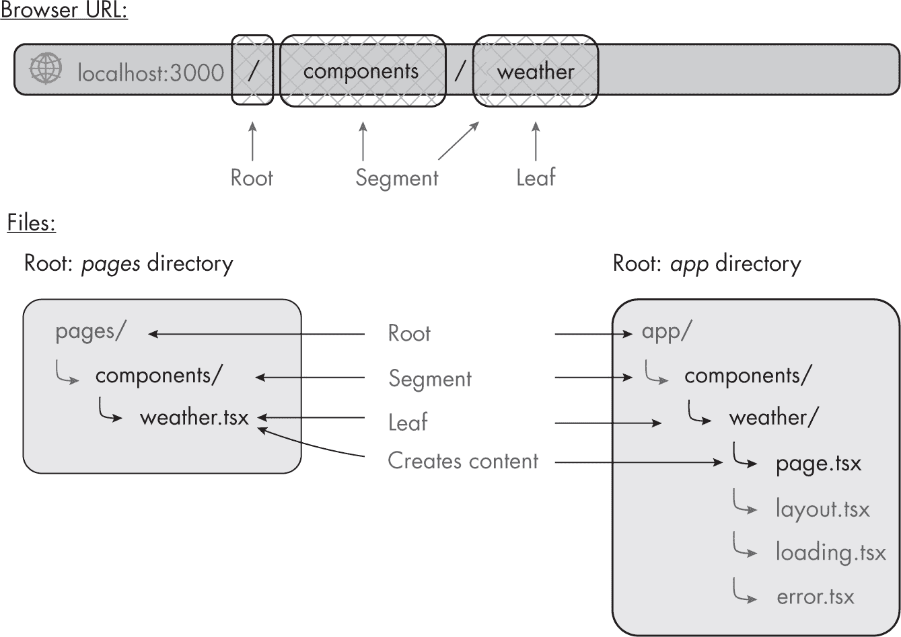
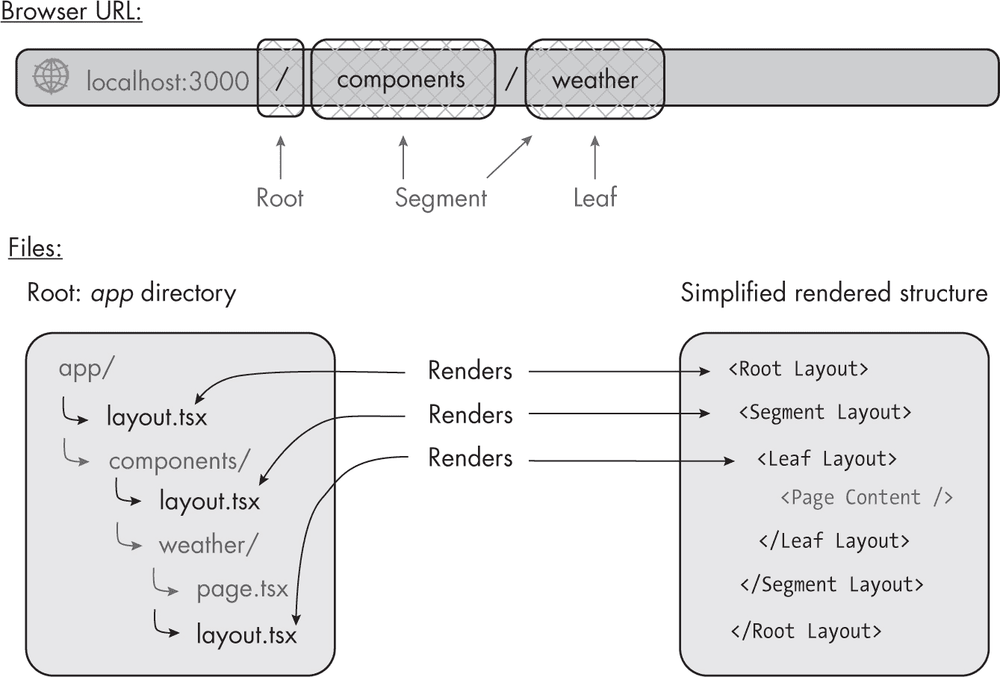
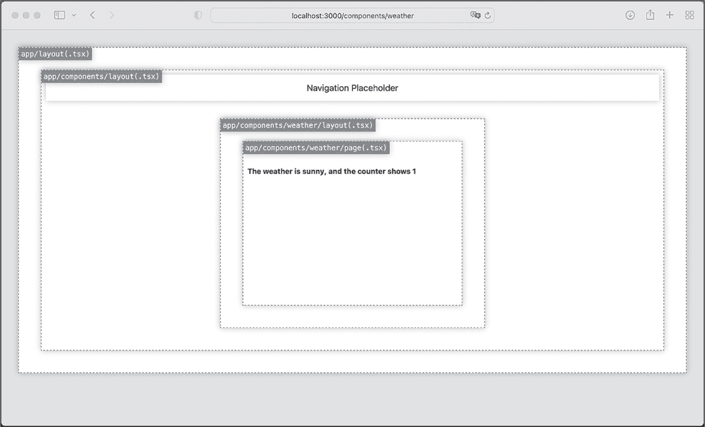
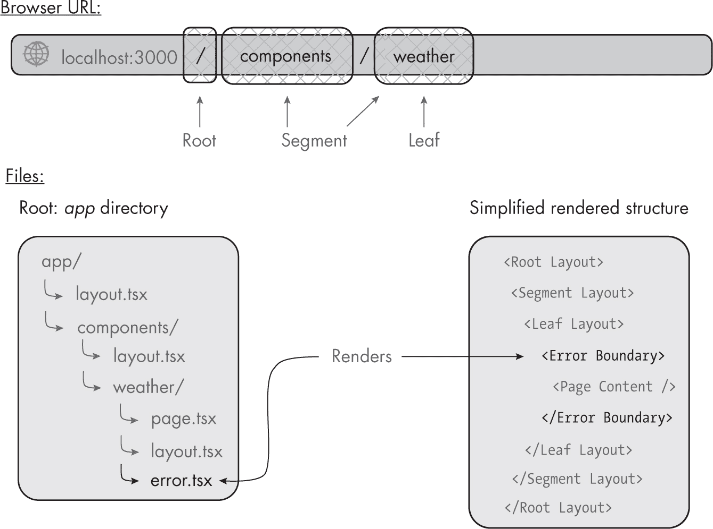
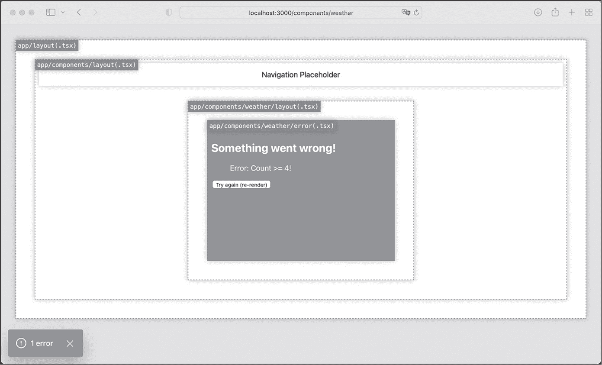
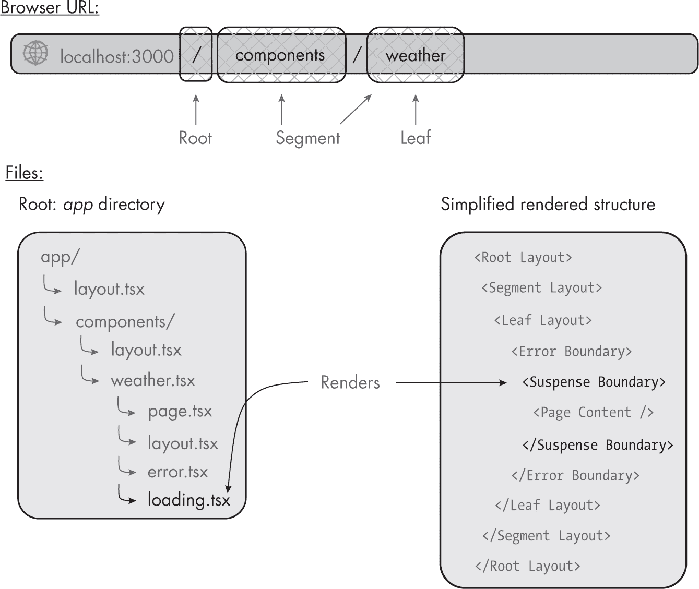
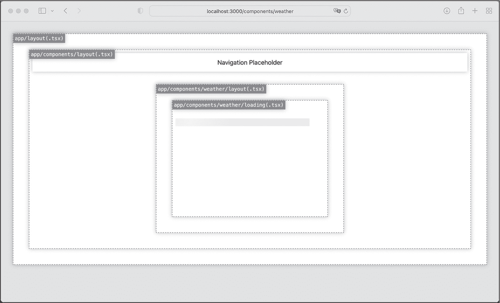
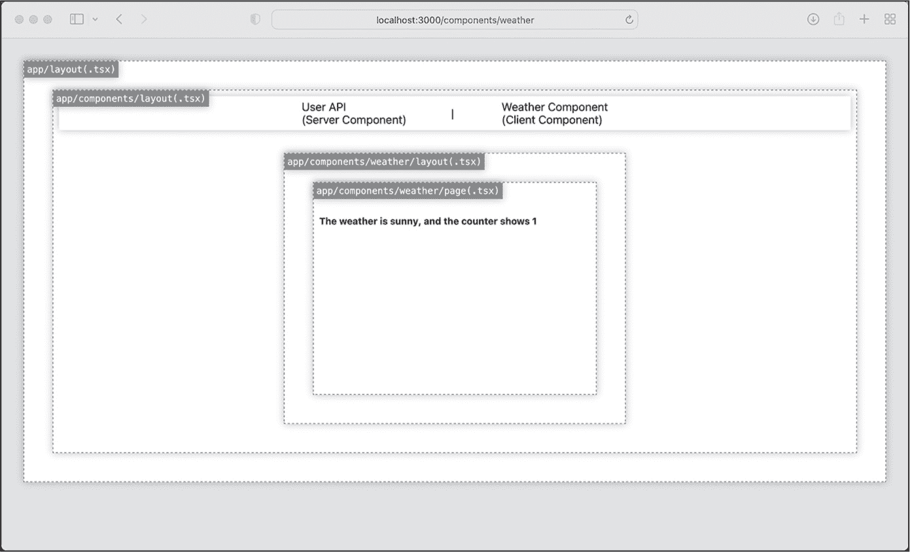

<hgroup>

## <samp class="SANS_Futura_Std_Bold_Condensed_B_11">B</samp> <samp class="SANS_Dogma_OT_Bold_B_11">NEXT.JS 应用目录</samp>

</hgroup>


在第 13 版中，Next.js 引入了一种新的路由范式，使用 *app* 目录替代 *pages* 目录。本附录讨论了这一新特性，以便您能进一步探索。由于没有计划废弃 *pages* 目录，您仍然可以继续使用在第五章中学习的路由方法。您甚至可以同时使用这两个目录；只需小心不要在两个目录中添加相同路由的文件夹和文件，因为这可能会导致错误。

*app* 目录和 *pages* 目录都使用文件夹和文件来创建路由。然而，*app* 目录区分了服务器组件和客户端组件。在 *pages* 文件夹中，一切都是 *客户端组件*，这意味着所有代码都是 Next.js 发送给客户端的 JavaScript 包的一部分。但是，*app* 目录中的每个文件默认都是 *服务器组件*，其代码从未发送到客户端。

本附录将介绍新方法的基本概念，然后使用新结构初始化一个 Next.js 应用程序。

### <samp class="SANS_Futura_Std_Bold_B_11">服务器组件与客户端组件</samp>

在此上下文中，*客户端*和*服务器*这两个术语指的是 Next.js 运行时渲染组件的环境。客户端环境是用户的环境（通常是浏览器），而服务器则指 Next.js 服务器，它接收来自客户端的请求，无论它是在本地主机上运行还是在远程位置。

随着服务器组件的引入，Next.js 不再纯粹使用客户端路由。在 *以服务器为中心* 的路由中，服务器渲染组件并将渲染后的代码发送给客户端。这意味着客户端不需要下载路由映射，从而减少了初始页面大小。此外，用户不必等到所有资源加载完毕后才可以与页面互动。Next.js 服务器组件利用 React 的流式架构，逐步渲染每个组件的内容。在这种模式下，页面在加载完成之前就变得可互动。

#### <samp class="SANS_Futura_Std_Bold_Condensed_Oblique_BI_11">服务器组件</samp>

Next.js 服务器组件基于自 React 18 版本以来提供的 React 服务器组件。由于这些组件由服务器渲染，它们不会向客户端添加任何 JavaScript，从而减少了整体页面大小并提高了页面性能分数。此外，JavaScript 包是可缓存的，因此客户端不会在我们添加新的额外服务器组件时重新下载它，而只有在我们通过额外的客户端组件添加新的客户端脚本时，才会重新下载。

此外，由于这些组件完全在服务器上渲染，它们可以包含敏感的服务器信息，如访问令牌和 API 密钥。（为了增加额外的保护层，Next.js 的渲染引擎将所有未显式以 <samp class="SANS_TheSansMonoCd_W5Regular_11">NEXT_PUBLIC</samp> 前缀的环境变量替换为空字符串。）最后，我们可以使用大规模的依赖项和额外的框架，而不会使客户端脚本臃肿，并可以直接访问后端资源，从而提高应用程序的性能。

列表 B-1 展示了一个服务器组件的基本结构。

```
export default async function ServerComponent(props: WeatherProps): Promise<JSX.Element> {

    return (
      <h1>The weather is {props.weather}</h1>
    );
} 
```

列表 B-1：一个基本的服务器组件

在第四章中，你学到 React 组件是一个返回 React 元素的 JavaScript 函数；Next.js 服务器组件遵循相同的结构，不同之处在于它们是异步函数，因此我们可以使用 <samp class="SANS_TheSansMonoCd_W5Regular_11">async</samp>/<samp class="SANS_TheSansMonoCd_W5Regular_11">await</samp> 模式与 <samp class="SANS_TheSansMonoCd_W5Regular_11">fetch</samp>。因此，它返回的不是 React 元素，而是该元素的一个 Promise。 列表 B-1 中的代码应该让你想起前面章节中创建的 <samp class="SANS_TheSansMonoCd_W5Regular_11">WeatherComponent</samp>，不过它不包含任何客户端代码。

#### <samp class="SANS_Futura_Std_Bold_Condensed_Oblique_BI_11">客户端组件</samp>

相比之下，客户端组件是由浏览器而非服务器渲染的组件。你已经知道如何编写客户端组件，因为所有 React 和 Next.js 组件传统上都是客户端组件。

为了渲染这些组件，客户端需要接收所有必需的脚本及其依赖项。每个组件都会增加打包文件的大小，从而降低应用程序的性能。为此，Next.js 提供了优化应用性能的选项，如服务器端渲染（SSR），它在服务器上预渲染页面，然后让客户端为页面添加交互元素。

*app* 目录中的所有组件默认为服务器组件。然而，客户端组件可以存在于任何地方（例如，我们之前使用的 *components* 目录中）。列表 B-2 展示了 列表 5-4 中创建的 <samp class="SANS_TheSansMonoCd_W5Regular_11">WeatherComponent</samp>，它被重构为一个可以与 *app* 目录一起使用的客户端组件。

```
"use client";

import React, {useState, useEffect} from "react";

export default function ClientComponent (props: WeatherProps): JSX.Element {

    const [count, setCount] = useState(0);
    useEffect(() => {setCount(1);}, []);

    return (
        <h1
          onClick={() => setCount(count + 1)} >
          The weather is {props.weather},
          and the counter shows {count}
        </h1>
    );
} 
```

列表 B-2：一个基本的客户端组件，类似于在 列表 5-4 中创建的 <samp class="SANS_TheSansMonoCd_W5Regular_Italic_I_11">WeatherComponent</samp>

我们将组件作为默认函数导出，名称为 <samp class="SANS_TheSansMonoCd_W5Regular_11">ClientComponent</samp>。因为我们使用了客户端钩子 <samp class="SANS_TheSansMonoCd_W5Regular_11">useEffect</samp> 和 <samp class="SANS_TheSansMonoCd_W5Regular_11">useState</samp>，以及 <samp class="SANS_TheSansMonoCd_W5Regular_11">onClick</samp> 事件处理器，我们需要在文件顶部用 <samp class="SANS_TheSansMonoCd_W5Regular_11">"use client"</samp> 指令声明该组件为客户端组件。否则，Next.js 会抛出错误。

### <samp class="SANS_Futura_Std_Bold_B_11">渲染组件</samp>

在第五章中，我们使用 <samp class="SANS_TheSansMonoCd_W5Regular_11">getServerSideProps</samp> 函数进行了服务器端渲染，并使用 <samp class="SANS_TheSansMonoCd_W5Regular_11">getStaticProps</samp> 函数进行了静态站点生成（SSG）。在 *app* 目录中，这两个函数已被废弃。如果我们希望优化应用程序，可以改为使用 Next.js 内置的 <samp class="SANS_TheSansMonoCd_W5Regular_11">fetch</samp> API，它在组件级别控制数据获取和渲染。

#### <samp class="SANS_Futura_Std_Bold_Condensed_Oblique_BI_11">获取数据</samp>

新的异步 <samp class="SANS_TheSansMonoCd_W5Regular_11">fetch</samp> API 扩展了原生的 fetch 网络 API，并返回一个 promise。由于服务器组件只是导出的返回 JSX 元素的函数，我们可以将其声明为异步函数，然后使用 <samp class="SANS_TheSansMonoCd_W5Regular_11">fetch</samp> 配合 <samp class="SANS_TheSansMonoCd_W5Regular_11">async</samp>/<samp class="SANS_TheSansMonoCd_W5Regular_11">await</samp> 模式。

这种模式很有优势，因为它允许我们仅为使用数据的部分获取数据，而不是为整个页面获取数据。这使我们能够利用 React 的特性，自动显示加载状态并优雅地捕获错误，正如在第 269 页的“探索项目结构”中讨论的那样。如果我们遵循这种模式，加载状态只会阻止特定服务器组件及其用户界面的渲染；页面的其余部分将完全功能化并可交互。

> <samp class="SANS_Dogma_OT_Bold_B_21">注意</samp>

*客户端组件不应为异步函数，因为 JavaScript 处理异步调用的方式可能会导致多次重新渲染，从而减慢整个应用程序的速度。Next.js 开发者曾讨论过添加一个通用的钩子，使我们能够通过缓存结果在客户端组件中使用异步函数，但这个钩子尚未最终确定。如果您绝对需要客户端数据获取，建议使用像 SWR 这样的专用库，您可以在* [`<wbr>swr<wbr>.vercel<wbr>.app`](https://swr.vercel.app)* 找到。*

你可能会担心，当每个服务器组件加载自己的数据时，最终会产生大量的请求。那么，这些请求的数量会如何影响整体页面性能呢？其实，Next.js 的 <samp class="SANS_TheSansMonoCd_W5Regular_11">fetch</samp> 提供了多项优化，帮助加速应用程序。例如，它会自动缓存从服务器组件发送到同一 API 的 GET 请求的响应数据，从而减少请求的数量。

然而，POST 请求通常是不可缓存的，因为它们包含的数据可能会发生变化，因此 <samp class="SANS_TheSansMonoCd_W5Regular_11">fetch</samp> 不会自动缓存这些请求。这对我们来说是一个问题，因为 GraphQL 通常使用 POST 请求。幸运的是，React 提供了一个 <samp class="SANS_TheSansMonoCd_W5Regular_11">cache</samp> 函数，可以记住它所包装的函数的结果。列表 B-3 展示了如何使用 <samp class="SANS_TheSansMonoCd_W5Regular_11">cache</samp> 与 GraphQL API 的示例。

```
import {cache} from 'react';

export const getUserFromGraphQL = cache(**async** (id:string) => {
    **return await fetch**("/graphql," {method: "POST", body: "query":" "});
}); 
```

列表 B-3：一个简单的缓存 POST API 调用大纲

我们将 API 调用包装在从 React 导入的 <samp class="SANS_TheSansMonoCd_W5Regular_11">cache</samp> 函数中，并返回 API 的响应对象。需要注意的是，缓存的参数只能使用原始值，因为 <samp class="SANS_TheSansMonoCd_W5Regular_11">cache</samp> 函数不会对参数进行深度比较。

我们可以实现的另一个优化是利用 <samp class="SANS_TheSansMonoCd_W5Regular_11">fetch</samp> 的异步特性，以并行的方式请求服务器组件的数据，而不是按顺序请求。这里，最常见的模式是使用 <samp class="SANS_TheSansMonoCd_W5Regular_11">Promise.all</samp> 同时启动所有请求，并阻塞渲染，直到所有请求完成。列表 B-4 展示了这种模式的相关代码。

```
const userPromiseOne = getUserFromGraphQL ("0001");
const userPromiseTwo = getUserFromGraphQL ("0002");

const [userDataOne, userDataTwo] = await Promise.all([userPromiseOne, userPromiseTwo]); 
```

列表 B-4：使用 <samp class="SANS_TheSansMonoCd_W5Regular_Italic_I_11">Promise.all</samp> 的两个并行 API 调用

我们设置了两个请求，它们都返回一个 promise 用户对象。然后我们等待这两个 promise 的结果，并使用一个包含先前创建的异步 API 调用的数组来调用 <samp class="SANS_TheSansMonoCd_W5Regular_11">Promise.all</samp>。当两个 promise 返回数据时，<samp class="SANS_TheSansMonoCd_W5Regular_11">Promise.all</samp> 函数会解析，然后服务器组件的代码继续执行。

#### <samp class="SANS_Futura_Std_Bold_Condensed_Oblique_BI_11">静态渲染</samp>

静态渲染是服务器和客户端组件的默认设置。它类似于静态网站生成，我们在第五章中使用了 <samp class="SANS_TheSansMonoCd_W5Regular_11">getStaticProps</samp>。此渲染选项在构建时预渲染服务器环境中的客户端和服务器组件。因此，请求将始终返回相同的 HTML，该 HTML 保持静态且永远不会重新创建。

每种组件类型的渲染方式略有不同。对于客户端组件，服务器会预渲染 HTML 和 JSON 数据；客户端然后接收预渲染的数据，包括客户端脚本，以便为 HTML 添加交互性。对于服务器组件，浏览器仅接收渲染后的有效负载来激活组件。它们既没有客户端 JavaScript，也不使用 JavaScript 来进行激活；因此，它们不会向客户端发送任何 JavaScript，从而避免了打包脚本的膨胀。

列表 B-5 显示了如何静态渲染来自 列表 5-8 的 *utils/fetch-names.ts* 文件。

```
export default async function ServerComponentUserList(): Promise<JSX.Element> {
    const url = "https://www.usemodernfullstack.dev/api/v1/users";
    let data: responseItemType[] | [] = [];
    let names: responseItemType[] | [];
    try {
 **const response = await fetch(url, {cache: "force-cache"});**
        data = (await response.json()) as responseItemType[];
 } catch (err) {
        throw new Error("Failed to fetch data");
    }
    names = data.map((item) => {
        return {id: item.id, name: item.name};
    });

    return (
        <ul>
            {names.map((item) => (
                <li key="{item.id}">{item.name}</li>
            ))}
        </ul>
    );
} 
```

列表 B-5：使用静态渲染的服务器组件

首先，我们将服务器组件定义为一个异步函数，直接返回一个包装在 Promise 中的 <samp class="SANS_TheSansMonoCd_W5Regular_11">JSX.Element</samp>。

在第五章中，我们返回了页面的数据，并使用页面的 <samp class="SANS_TheSansMonoCd_W5Regular_11">props</samp> 将其传递给 <samp class="SANS_TheSansMonoCd_W5Regular_11">NextPage</samp> 函数，在那里我们生成了元素。在这里，设置 <samp class="SANS_TheSansMonoCd_W5Regular_11">url</samp> 后，我们使用异步的 <samp class="SANS_TheSansMonoCd_W5Regular_11">fetch</samp> 函数从远程 API 获取数据。Next.js 会缓存 API 调用的结果和渲染后的组件，服务器将重用已生成的代码而不重新创建它。

如果你在没有显式缓存设置的情况下使用 <samp class="SANS_TheSansMonoCd_W5Regular_11">fetch</samp>，它将使用 <samp class="SANS_TheSansMonoCd_W5Regular_11">force-cache</samp> 作为默认设置进行静态渲染。要切换到增量静态再生，只需将 列表 B-5 中的 <samp class="SANS_TheSansMonoCd_W5Regular_11">fetch</samp> 调用替换为 列表 B-6 中的调用。

```
 const response = await fetch(url, {**next: {revalidate: 20}**});
```

列表 B-6：用于 ISR 风格渲染的修改版 <samp class="SANS_TheSansMonoCd_W5Regular_Italic_I_11">fetch</samp> 调用

我们只需添加 <samp class="SANS_TheSansMonoCd_W5Regular_11">revalidate</samp> 属性，并将其值设置为 <samp class="SANS_TheSansMonoCd_W5Regular_11">30</samp>。服务器将静态渲染组件，但会在首次页面请求后的 30 秒内使当前 HTML 失效，并重新渲染它。

#### <samp class="SANS_Futura_Std_Bold_Condensed_Oblique_BI_11">动态渲染</samp>

动态渲染取代了 Next.js 传统的服务器端渲染（SSR），我们在第五章中通过导出页面路由中的 <samp class="SANS_TheSansMonoCd_W5Regular_11">getServerSideProps</samp> 函数来实现 SSR。由于 Next.js 默认使用静态渲染，我们必须通过两种方式之一来主动选择使用动态渲染：要么在我们的 fetch 请求中禁用缓存，要么使用动态函数。在列表 B-7 中，我们禁用了缓存。

```
export default async function ServerComponentUserList(): Promise<JSX.Element> {
    const url = "https://www.usemodernfullstack.dev/api/v1/users";
    let data: responseItemType[] | [] = [];
    let names: responseItemType[] | [];
 try {
 **const response = await fetch(url, {cache: "no-cache"});**
        data = (await response.json()) as responseItemType[];
    } catch (err) {
        throw new Error("Failed to fetch data");
    }
    names = data.map((item) => {
        return {id: item.id, name: item.name};
    });

    return (
        <ul>
            {names.map((item) => (
                <li key="{item.id}">{item.name}</li>
            ))}
        </ul>
    );
} 
```

列表 B-7：通过禁用缓存使用动态渲染的服务器组件

我们显式地将 <samp class="SANS_TheSansMonoCd_W5Regular_11">cache</samp> 属性设置为 <samp class="SANS_TheSansMonoCd_W5Regular_11">no-cache</samp>。现在，服务器将在每次请求时重新获取该组件的数据。

除了禁用缓存外，我们还可以使用动态函数，包括在服务器组件中使用的 <samp class="SANS_TheSansMonoCd_W5Regular_11">header</samp> 函数或 <samp class="SANS_TheSansMonoCd_W5Regular_11">cookies</samp> 函数，以及在客户端组件中使用的 <samp class="SANS_TheSansMonoCd_W5Regular_11">useSearchParams</samp> 钩子。这些函数使用在构建时未知的动态数据，如请求头、Cookies 和查询参数，这些数据是我们传递给函数的请求对象的一部分。服务器需要为每个请求运行这些函数，因为所需的数据依赖于请求。

请记住，动态渲染会影响整个路由。如果路由中的一个服务器组件选择使用动态渲染，Next.js 将在请求时动态渲染整个路由。

### <samp class="SANS_Futura_Std_Bold_B_11">探索项目结构</samp>

让我们设置一个新的 Next.js 应用来探索我们已经讨论过的特性。首先，使用 <samp class="SANS_TheSansMonoCd_W5Regular_11">npx create-next-app@latest</samp> 命令，并加上 <samp class="SANS_TheSansMonoCd_W5Regular_11">--typescript --use-npm</samp> 标志来创建一个示例应用。在回答设置向导的问题时，选择使用 *app* 目录而不是 *pages* 目录。

> <samp class="SANS_Dogma_OT_Bold_B_21">注意</samp>

*你也可以使用在线 Playground 在* [`<wbr>codesandbox<wbr>.io<wbr>/s<wbr>/`](https://codesandbox.io/s/) *上运行本附录中的 Next.js 代码示例。在那里创建新代码沙盒时，搜索官方的* Next.js (App router) *模板。*

现在输入 <samp class="SANS_TheSansMonoCd_W7Bold_B_11">npm run dev</samp> 命令以启动应用的开发模式。你应该能在浏览器中看到一个 Next.js 欢迎页面，网址是 *http://localhost:3000*。与第五章中你看到的欢迎页面不同，后者建议我们编辑 *pages/index.tsx* 文件，而这里的欢迎页面则指引我们去编辑 *app/page.tsx* 文件。

查看向导创建的文件和文件夹，并将它们与第五章中的文件进行对比。你应该会看到*pages*和*styles*目录不再是新结构的一部分。相反，路由器将它们替换为*app*目录。在其中，你应该看不到*_app.tsx*文件和*_document.tsx*文件。而是使用根布局文件*layout.tsx*来定义所有渲染页面的 HTML 包装器，并使用*page.tsx*文件来渲染根段（主页）。

*pages*目录仅使用一个文件来创建页面路由的最终内容。相比之下，*app*目录使用多个文件来创建页面路由并添加额外的行为。

*page.tsx*文件生成用户界面和路由内容，其父文件夹定义了叶段。如果没有*page.tsx*文件，URL 路径将无法访问。然后，我们可以向页面的文件夹中添加其他特殊文件。Next.js 会自动将它们应用于该 URL 段及其子段。最重要的特殊文件包括*layout.tsx*，它创建通用用户界面；*loading.tsx*，它使用 React 悬挂边界在页面加载时自动创建一个“加载”用户界面；以及*error.tsx*，它使用 React 错误边界捕获错误，并显示自定义错误界面。

Figure B-1 比较了使用*pages*目录和*app*目录时，*components/weather*页面路由的文件和文件夹。



<samp class="SANS_Futura_Std_Book_Oblique_BI_11">Figure B-1: 比较页面路由</samp> <samp class="SANS_Futura_Std_Book_11">components/weather</samp> <samp class="SANS_Futura_Std_Book_Oblique_BI_11">在 pages 和 app 目录结构中的比较</samp>

当*app*目录是根文件夹时，其子文件夹仍然对应 URL 段，但现在包含*page.tsx*文件的文件夹定义了 URL 的最终叶段。旁边的可选特殊文件只会影响*components/weather*页面的内容。

让我们用*app*目录重建你在 Listing 5-1 中创建的*components/weather*页面路由。在*app*目录下创建*components*文件夹和*weather*子文件夹，然后将之前代码练习中的*custom.d.ts*文件复制到根文件夹。

#### <samp class="SANS_Futura_Std_Bold_Condensed_Oblique_BI_11">更新 CSS</samp>

首先打开现有的*app/globals.css*文件，并将其内容替换为 Listing B-8 中的代码。我们需要做一些修改，以便在我们的组件中使用特殊文件。

```
html,
body {
    background-color: rgb(230, 230, 230);
    font-family: -apple-system, BlinkMacSystemFont, Segoe UI, Roboto, Oxygen,
        Ubuntu, Cantarell, Fira Sans, Droid Sans, Helvetica Neue, sans-serif;
    margin: 0;
    padding: 0;
}

a {
    color: inherit;
    text-decoration: none;
}

* {
    box-sizing: border-box;
}

nav {
    align-items: center;
    background-color: #fff;
    box-shadow: 0 0 10px rgba(0, 0, 0, 0.25);
    display: flex;
    height: 3rem;
    justify-content: space-evenly;
    padding: 0 25%;
}

main {
    display: flex;
    justify-content: center;
}

main .content {
    height: 300px;
    padding-top: 1.5rem;
    width: 400px;
}

main .content li {
    height: 1.25rem;
    margin: 0.25rem;
}

main .loading {
    animation: 1s loading linear infinite;
    background: #ddd linear-gradient(110deg, #eeeeee 0%, #f5f5f5 15%, #eeeeee 30%);
    background-size: 200% 100%;
    min-height: 1.25rem;
    width: 90%;
}

@keyframes loading {
    to {
        background-position-x: -200%;
    }
}
main .error {
    background: #ff5656;
    color: #fff;
}

section {
    background: #fff;
    border: 1px dashed #888;
    box-shadow: 0 0 10px rgba(0, 0, 0, 0.25);
    margin: 2rem;
    padding: 0.5rem;
    position: relative;
}

section .flag {
    background: #888;
    box-shadow: 0 0 10px rgba(0, 0, 0, 0.25);
    color: #fff;
    font-family: monospace;
    left: 0;
    padding: 0.25rem;
    position: absolute;
    top: 0;
    white-space: nowrap;
} 
```

Listing B-8: 包含基本样式的 app/globals.css 文件，用于我们的代码示例

我们创建一个<samp class="SANS_TheSansMonoCd_W5Regular_11">nav</samp>元素用于导航，并在其下方定义一个<samp class="SANS_TheSansMonoCd_W5Regular_11">main</samp>内容区域。然后，我们为稍后创建的加载和错误状态添加样式。此外，我们使用<samp class="SANS_TheSansMonoCd_W5Regular_11">section</samp>元素来划定文件的边界，并使用<samp class="SANS_TheSansMonoCd_W5Regular_11">flag</samp>样式为各部分添加标签。

#### <samp class="SANS_Futura_Std_Bold_Condensed_Oblique_BI_11">定义布局</samp>

布局是服务器组件，用于定义特定路由段的用户界面。当该路由段处于活动状态时，Next.js 会渲染这个布局。布局是跨所有页面共享的，因此可以相互嵌套，且特定路由及其子路由的所有布局将在该路由段活动时一并渲染。图 B-2 显示了 URL、文件和*components/weather*路由组件层次之间的关系。



<samp class="SANS_Futura_Std_Book_Oblique_BI_11">图 B-2：简化的布局组件层次结构</samp>

在这个示例中，每个文件夹包含一个*layout.tsx*文件。Next.js 会以嵌套的方式渲染这些布局，并将页面内容作为最终渲染的组件。

尽管我们可以在布局中获取数据，但无法在父布局和子布局之间共享数据。相反，我们可以利用<samp class="SANS_TheSansMonoCd_W5Regular_11">fetch</samp> API 的自动去重功能，在每个子路由段或组件中重用数据。当我们从一个页面导航到另一个页面时，只有变化的布局会重新渲染。共享布局在其子路由段发生变化时不会被重新渲染。

根布局返回页面的骨架结构，包括<samp class="SANS_TheSansMonoCd_W5Regular_11">html</samp>和<samp class="SANS_TheSansMonoCd_W5Regular_11">body</samp>元素，这是必须的，而我们创建的所有其他布局都是可选的。让我们创建一个根布局。首先，在*custom.d.ts*文件的末尾添加一个新接口，该文件是我们从上一个练习中复制的。我们将使用<samp class="SANS_TheSansMonoCd_W5Regular_11">LayoutProps</samp>接口来为布局的属性对象类型：

```
interface LayoutProps {
    children: React.ReactNode;
} 
```

现在打开*app/layout.tsx*文件，并将其内容替换为 Listing B-9 中的代码。

```
import "./globals.css";

export const metadata = {
    title: "Appendix C",
    description: "The Example Code",
};

export default function RootLayout(props: LayoutProps): JSX.Element {
    return (
        <html lang="en">
            <body>
                <section>
                    <span className="flag">app/layout(.tsx)</span>
                    {props.children}
                </section>
            </body>
        </html>
    );
} 
```

Listing B-9：文件 app/layout.tsx 定义了根布局。

我们导入了之前创建的*global.css*文件，然后通过<samp class="SANS_TheSansMonoCd_W5Regular_11">metadata</samp>对象定义默认的 SEO 元数据、页面标题和页面描述。这替代了我们在*pages*目录中为所有页面使用的<samp class="SANS_TheSansMonoCd_W5Regular_11">next/head</samp>组件。

然后我们定义了 `<samp class="SANS_TheSansMonoCd_W5Regular_11">RootLayout</samp>` 组件，它接受一个 `<samp class="SANS_TheSansMonoCd_W5Regular_11">LayoutProps</samp>` 类型的对象，并返回一个 `<samp class="SANS_TheSansMonoCd_W5Regular_11">JSX.Element</samp>`。我们还创建了 `<samp class="SANS_TheSansMonoCd_W5Regular_11">JSX.Element</samp>`，显式地添加了 `<samp class="SANS_TheSansMonoCd_W5Regular_11">html</samp>` 和 `<samp class="SANS_TheSansMonoCd_W5Regular_11">body</samp>` 元素，然后使用 `<samp class="SANS_TheSansMonoCd_W5Regular_11">section</samp>` 和一个带有 CSS 类 `<samp class="SANS_TheSansMonoCd_W5Regular_11">flag</samp>` 的 `<samp class="SANS_TheSansMonoCd_W5Regular_11">span</samp>` 来勾画页面结构。我们从 `<samp class="SANS_TheSansMonoCd_W5Regular_11">LayoutProps</samp>` 对象中添加了 `children` 属性，将它们包装在我们的根 HTML 结构中。

现在让我们在 *app/components* 和 *app/components/weather* 文件夹中添加可选布局。在每个文件夹中创建一个 *layout.tsx* 文件，然后将 Listing B-10 中的代码放入 *app/components/layout.tsx* 文件中。

```
export default function ComponentsLayout(props: LayoutProps): JSX.Element {
    return (
        <section>
            <span className="flag">app/components/layout(.tsx)</span>
            <nav>Navigation Placeholder</nav>
            <main>{props.children}</main>
        </section>
    );
} 
```

Listing B-10: 文件 *app/components/layout.tsx* 定义了段落布局。

该段落布局文件遵循与根布局相同的基本结构。我们定义了一个布局组件，它接收包含 `children` 属性的 `<samp class="SANS_TheSansMonoCd_W5Regular_11">LayoutProps</samp>` 对象，并返回一个 `<samp class="SANS_TheSansMonoCd_W5Regular_11">JSX.Element</samp>`。与根布局不同，我们只设置了内部结构，即带有导航占位符的 `<samp class="SANS_TheSansMonoCd_W5Regular_11">nav</samp>` 元素，以及 `<samp class="SANS_TheSansMonoCd_W5Regular_11">main</samp>` 内容区，在此区我们渲染来自 `<samp class="SANS_TheSansMonoCd_W5Regular_11">LayoutProps</samp>` 对象的子元素，表示该段的子内容（叶子）。

最后，通过将 Listing B-11 中的代码添加到 *app/components/weather/layout.tsx* 文件中，创建叶子布局。

```
export default function WeatherLayout(props: LayoutProps): JSX.Element {
    return (
        <section>
            <span className="flag">app/components/weather/layout(.tsx)</span>
            {props.children}
        </section>
    );
} 
```

Listing B-11: 文件 *app/components/weather/layout.tsx* 定义了叶子布局。

叶子的布局类似于 Listing B-10 中的段落布局，但它返回的是一个更简单的 HTML 结构，因为 `children` 属性不包含另一个布局；而是包含页面的内容（在 *page.tsx* 中），以及来自 *loading.tsx* 和 *error.tsx* 的 suspense 边界和错误边界。

#### <samp class="SANS_Futura_Std_Bold_Condensed_Oblique_BI_11">添加内容和路由</samp>

为了暴露页面路由，我们需要创建*page.tsx*文件；否则，如果我们尝试访问*components/weather*页面路由，网址为*http://localhost:3000/components/weather*，我们将看到 Next.js 的默认*404*错误页面。为了重新创建清单 5-1 中的页面内容，我们将创建两个文件。一个是*component.tsx*，它包含了<samp class="SANS_TheSansMonoCd_W5Regular_11">WeatherComponent</samp>，另一个是*page.tsx*，它类似于我们在清单 5-1 中使用的<samp class="SANS_TheSansMonoCd_W5Regular_11">NextPage</samp>包装器。当然，页面可以包含位于其他文件夹中的额外组件。

我们首先在*apps/components/weather*文件夹中创建*component.tsx*文件，并将清单 B-12 中的代码添加到其中。

```
"use client";

import {useState, useEffect} from "react";

export default function WeatherComponent(props: WeatherProps): JSX.Element {

    const [count, setCount] = useState(0);

    useEffect(() => {
        setCount(1);
    }, []);
    return (
        <h1 onClick={() => {setCount(count + 1)}} >
            The weather is {props.weather}, and the counter shows {count}
        </h1>
    );
} 
```

清单 B-12：文件 app/components/weather/component.tsx 定义了<samp class="SANS_TheSansMonoCd_W5Regular_Italic_I_11">WeatherComponent</samp>。

这段代码与清单 5-1 中定义的<samp class="SANS_TheSansMonoCd_W5Regular_11">WeatherComponent</samp>常量的代码相似，唯一不同的是我们添加了<samp class="SANS_TheSansMonoCd_W5Regular_11">"use client"</samp>声明，明确将其设置为客户端组件，并将其作为默认函数导出，而不是存储在常量中。该组件本身与之前一样具有相同的功能：我们创建一个标题来显示天气字符串，并且可以通过点击标题来增加计数器。

现在我们添加*page.tsx*文件，并将清单 B-13 中的代码添加进去，以创建页面路由并将路由暴露给用户。

```
import WeatherComponent from "./component";

export const metadata = {
    title: "Appendix C - The Weather Component (Weather & Count)",
    description: "The Example Code For The Weather Component (Weather & Count)",
};

export default async function WeatherPage() {
    return (
        <section className="content">
            <span className="flag">app/components/weather/page(.tsx)</span>
            <WeatherComponent weather="sunny" />
        </section>
    );
} 
```

清单 B-13：文件 app/components/weather/page.tsx 定义了页面路由。

我们导入刚刚创建的<samp class="SANS_TheSansMonoCd_W5Regular_11">WeatherComponent</samp>，然后在页面级别设置 SEO 元数据。接着，我们将页面路由作为默认的异步函数进行导出。当我们与清单 5-1 中的类似页面进行比较时，我们发现不再需要导出<samp class="SANS_TheSansMonoCd_W5Regular_11">NextPage</samp>；相反，我们使用一个基本函数。*app*目录简化了代码结构。

现在在浏览器中访问我们的*components/weather*页面路由，网址为*http://localhost:3000/components/weather*。你应该看到一个页面，看起来类似于图 B-3。

请注意这里的两件事。首先，你应该能够认出来自第五章的组件，当我们点击标题时，它的计数器会增加。此外，我们在每个*.tsx*文件中添加的样式和<samp class="SANS_TheSansMonoCd_W5Regular_11">span</samp>元素展示了文件之间的关系。我们可以看到，嵌套的布局文件类似于图 B-3 中的简化组件层次结构。



<samp class="SANS_Futura_Std_Book_Oblique_BI_11">图 B-3：该</samp> <samp class="SANS_Futura_Std_Book_11">components/weather</samp> <samp class="SANS_Futura_Std_Book_Oblique_BI_11">页面显示嵌套组件</samp>

#### <samp class="SANS_Futura_Std_Bold_Condensed_Oblique_BI_11">捕获错误</samp>

一旦我们向文件夹中添加了 *error.tsx* 文件，Next.js 会用一个 React 错误边界包装我们页面的内容。图 B-4 展示了添加了 *error.tsx* 文件的 *components/weather* 路由的简化组件层次结构。



<samp class="SANS_Futura_Std_Book_Oblique_BI_11">图 B-4：简化的布局组件层次结构包括了错误边界。</samp>

我们看到 *error.tsx* 文件会自动在页面内容周围创建一个错误边界。通过这样做，Next.js 使我们能够在页面级别捕获错误，并优雅地处理这些错误，而不是冻结整个用户界面或将用户重定向到通用错误页面。可以把它看作是组件级别的 <samp class="SANS_TheSansMonoCd_W5Regular_11">try...catch</samp> 块。现在，我们可以显示定制的错误信息，并展示一个按钮，让用户在不重新加载整个应用的情况下重新渲染页面内容到之前的正常状态。

*error.tsx* 文件导出了一个客户端组件，错误边界使用该组件作为回退界面。换句话说，当代码抛出错误并激活错误边界时，该组件会替换内容。一旦激活，它就会包含错误，确保边界上方的布局保持活动状态并维护其内部状态。错误组件接收 <samp class="SANS_TheSansMonoCd_W5Regular_11">error</samp> 对象和 <samp class="SANS_TheSansMonoCd_W5Regular_11">reset</samp> 函数作为参数。

让我们在 *components/weather* 路由中添加一个错误边界。从在 *customs.d.ts* 文件中添加一个新的 <samp class="SANS_TheSansMonoCd_W5Regular_11">ErrorProps</samp> 接口开始，用于为组件的属性类型化：

```
interface ErrorProps {
    error: Error;
    reset: () => void;
} 
```

接下来，在 *app/components/weather* 目录中创建 *error.tsx* 文件，紧挨着 *page.tsx* 文件，并添加来自 列表 B-14 的代码。

```
"use client";

export default function WeatherError(props: ErrorProps): JSX.Element {
    return (
        <section className="content error">
            <span className="flag">app/components/weather/error(.tsx)</span>
            <h2>Something went wrong!</h2>
            <blockquote>{props.error?.toString()}</blockquote>
            <button onClick={() => props.reset()}>Try again (re-render)</button>
        </section>
    );
} 
```

列表 B-14：文件 app/components/weather/error.tsx 添加了错误边界和回退 UI。

因为我们知道错误组件需要是客户端组件，所以我们在文件顶部添加了 <samp class="SANS_TheSansMonoCd_W5Regular_11">"use client"</samp> 指令，然后定义并导出该组件。我们使用刚才创建的 <samp class="SANS_TheSansMonoCd_W5Regular_11">ErrorProps</samp> 接口来定义组件的属性类型。接着，我们将 <samp class="SANS_TheSansMonoCd_W5Regular_11">error</samp> 属性转换为字符串，并将其显示出来，以便告知用户发生了什么类型的错误。最后，我们渲染了一个按钮，调用组件通过属性对象传递的 <samp class="SANS_TheSansMonoCd_W5Regular_11">reset</samp> 函数。用户可以通过点击按钮将组件重新渲染到之前的正常状态。

现在，错误边界已经设置好，我们将修改 *component.tsx*，使其在计数器达到 4 或更多时抛出错误。打开该文件，并在第一个 <samp class="SANS_TheSansMonoCd_W5Regular_11">useEffect</samp> 钩子下添加 列表 B-15 中的代码。

```
 useEffect(() => {
        if (count && count >= 4) {
            throw new Error("Count >= 4! ");
        }
    }, [count]); 
```

列表 B-15：app/components/weather/component.tsx 的额外 <samp class="SANS_TheSansMonoCd_W5Regular_Italic_I_11">useEffect</samp> 钩子

我们为组件添加的额外 <samp class="SANS_TheSansMonoCd_W5Regular_11">useEffect</samp> 钩子非常简单；每当 <samp class="SANS_TheSansMonoCd_W5Regular_11">count</samp> 变量发生变化时，我们会验证错误条件，一旦变量值达到 4 或更多，我们就会抛出一个错误，信息为 <samp class="SANS_TheSansMonoCd_W5Regular_11">Count</samp> <samp class="SANS_TheSansMonoCd_W5Regular_11">>=</samp> <samp class="SANS_TheSansMonoCd_W5Regular_11">4!</samp>，该错误被错误边界捕获，并通过显示 *error.tsx* 文件导出的回退用户界面优雅地处理。

要测试此功能，请在浏览器中打开 *http://localhost:3000/components/weather* 并点击标题，直到触发错误。你应该看到错误组件而非天气组件，如同 图 B-5 所示。



<samp class="SANS_Futura_Std_Book_Oblique_BI_11">图 B-5：</samp> <samp class="SANS_Futura_Std_Book_11">components/weather</samp> <samp class="SANS_Futura_Std_Book_Oblique_BI_11">页面的错误状态</samp>

布局标记告诉我们，*error.tsx* 已经替代了 *page.tsx*。我们还看到了字符串 <samp class="SANS_TheSansMonoCd_W5Regular_11">Error: Count</samp> <samp class="SANS_TheSansMonoCd_W5Regular_11">>=4!</samp>，这是我们传递给错误构造函数的内容。当我们点击重新渲染按钮时，*page.tsx* 应该替代 *error.tsx*，屏幕会恢复到 图 B-4 的状态。

#### <samp class="SANS_Futura_Std_Bold_Condensed_Oblique_BI_11">显示可选加载界面</samp>

现在我们将创建*loading.tsx*文件。通过这个功能，Next.js 会自动将页面内容包装在一个 React 悬挂组件中，创建一个类似于图 B-6 的组件层次结构。



<samp class="SANS_Futura_Std_Book_Oblique_BI_11">图 B-6：带有加载界面的简化布局组件层次结构</samp>

*loading.tsx*文件是一个基本的服务器组件，返回预渲染的加载用户界面。当我们加载页面或在页面之间导航时，Next.js 会在加载新内容时立即显示此组件。一旦渲染完成，运行时会将加载状态替换为新内容。通过这种方式，我们可以轻松显示有意义的加载状态，例如骨架屏或自定义动画。

让我们通过将清单 B-16 中的代码添加到*loading.tsx*文件中，向天气组件路由添加一个基本的加载用户界面。

```
export default function WeatherLoading(): JSX.Element {
    return (
        <section className="content">
            <span className="flag">app/components/weather/loading(.tsx)</span>
            <h1 className="loading"></h1>
        </section>
    );
} 
```

清单 B-16：文件 app/components/weather/loading.tsx 添加了一个带有加载用户界面的悬挂边界。

我们定义并导出了<samp class="SANS_TheSansMonoCd_W5Regular_11">WeatherLoading</samp>组件，该组件返回一个<samp class="SANS_TheSansMonoCd_W5Regular_11">JSX.Element</samp>。在 HTML 中，我们添加了一个类似于*page.tsx*中的标题元素，唯一不同的是，这个标题元素添加了我们在*global.css*文件中创建的加载类，并显示一个动画占位符。

当我们在浏览器中打开*http://localhost:3000/components/weather*时，我们应该会看到一个类似于图 B-7 的加载界面。



<samp class="SANS_Futura_Std_Book_Oblique_BI_11">图 B-7：加载页面内容时的</samp> <samp class="SANS_Futura_Std_Book_11">components/weather</samp> <samp class="SANS_Futura_Std_Book_Oblique_BI_11">页面</samp>

如果你没有看到动画占位符，这意味着 Next.js 已经缓存了你的段内容。

#### <samp class="SANS_Futura_Std_Bold_Condensed_Oblique_BI_11">添加一个获取远程数据的服务器组件</samp>

现在你已经理解了*app*目录中的文件夹和文件，让我们添加一个使用<samp class="SANS_TheSansMonoCd_W5Regular_11">fetch</samp> API 从远程 API *https://www.usemodernfullstack.dev/api/v1/users* 获取用户列表并将其渲染到浏览器的服务器组件。我们在第五章中编写了此代码的一个版本。

创建文件夹*app/components/server-component*，并在其中添加特殊文件*component.tsx*、*loading.tsx*、*error.tsx*、*layout.tsx*和*page.tsx*。然后，通过将清单 B-17 中的代码添加到*component.tsx*文件中，设置组件的功能。

```
export default async function ServerComponentUserList(): Promise<JSX.Element|Error> {
    const url = "https://www.usemodernfullstack.dev/api/v1/users";
    let data: responseItemType[] | [] = [];
    let names: responseItemType[] | [];
    try {
        const response = await fetch(url, {cache: "force-cache"});
        data = (await response.json()) as responseItemType[];
 } catch (err) {
        throw new Error("Failed to fetch data");
    }
    names = data.map((item) => {
        return {id: item.id, name: item.name};
    });

    return (
        <ul>
            {names.map((item) => (
                <li id="{item.id}" key="{item.id}">
                    {item.name}
                </li>
            ))}
        </ul>
    );
} 
```

清单 B-17：app/components/server-component/component.tsx 文件

在这里，我们创建了一个默认的服务器组件，使用<samp class="SANS_TheSansMonoCd_W5Regular_11">fetch</samp> API 来<samp class="SANS_TheSansMonoCd_W5Regular_11">await</samp> API 响应。为了实现这一点，我们将其定义为一个异步函数，该函数返回一个<samp class="SANS_TheSansMonoCd_W5Regular_11">JSX.Element</samp>或一个<samp class="SANS_TheSansMonoCd_W5Regular_11">Error</samp>。接着，我们将 API 端点存储在常量中，并定义后续需要的变量。我们将 API 调用包装在<samp class="SANS_TheSansMonoCd_W5Regular_11">try...catch</samp>语句中，以便在 API 请求失败时激活<samp class="SANS_TheSansMonoCd_W5Regular_11">Error Boundary</samp>。然后，我们以类似于第五章中处理数据的方式进行数据转换，并返回一个显示用户列表的<samp class="SANS_TheSansMonoCd_W5Regular_11">JSX.Element</samp>。

现在，我们添加 Next.js 在等待 API 响应和组件的 JSX 响应时自动显示的加载用户界面。将清单 B-18 中的代码放入*loading.tsx*文件中。

```
export default function ServerComponentLoading(): JSX.Element {
    return (
        <section className="content">
            <span className="flag">
                app/components/server-component/loading(.tsx)
            </span>
            <ul id="load">
                {[...new Array(10)].map((item, i) => (
                    <li className="loading"></li>
                ))}
            </ul>
        </section>
    );
} 
```

清单 B-18：app/components/server-component/loading.tsx 文件

与之前一样，加载组件是一个服务器组件，返回一个<samp class="SANS_TheSansMonoCd_W5Regular_11">JSX.Element</samp>。这次，加载骨架是一个包含 10 个项的列表，类似于组件呈现的 HTML 结构。你会发现，这可以给用户一个良好的预期内容印象，并应当改善用户体验。

接下来，我们通过将清单 B-19 中的代码添加到*error.tsx*文件中来创建错误边界。

```
"use client"; // Error components must be Client components

export default function ServerComponentError(props: ErrorProps): JSX.Element {
    return (
        <section className="content">
            <span className="flag">app/components/server-component/error(.tsx)</span>
            <h2>Something went wrong!</h2>
            <code>{props.error?.toString()}</code>
            <button onClick={() => props.reset()}>Try again (re-render)</button>
        </section>
    );
} 
```

清单 B-19：app/components/server-component/error.tsx 文件

除了概述文件结构的标志外，错误边界与我们在天气组件中使用的类似。

然后，我们将清单 B-20 中的代码添加到*layout.tsx*文件中。

```
export default function ServerComponentLayout(props: LayoutProps): JSX.Element {
    return (
        <section>
            <span className="flag">app/components/server-component/layout(.tsx)</span>
            {props.children}
        </section>
    );
} 
```

清单 B-20：app/components/server-component/layout.tsx 文件

再次强调，代码与我们在天气组件中使用的代码类似。我们只调整了概述组件层次结构的标志。

最后，所有部分就位后，我们将清单 B-21 中的代码添加到*page.tsx*文件中，以暴露页面路由。

```
import ServerComponentUserList from "./component";

export const metadata = {
    title: "Appendix C - Server Side Component (User API)",
    description: "The Example Code For A Server Side Component (User API)",
};

export default async function ServerComponentUserListPage(): JSX.Element {
    return (
        <section className="content">
            <span className="flag">app/components/server-component/page(.tsx)</span>
            {/* @ts-expect-error Async Server Component */}
 <ServerComponentUserList />
        </section>
    );
} 
```

清单 B-21：app/components/server-component/page.tsx 文件

#### <samp class="SANS_Futura_Std_Bold_Condensed_Oblique_BI_11">完成带有导航的应用程序</samp>

在应用程序中有了两个页面后，我们现在可以使用<samp class="SANS_TheSansMonoCd_W5Regular_11">next/link</samp>组件来替换<nav>元素中的导航占位符。这应该会创建一个完全功能的应用程序原型，使我们能够在页面之间导航。打开*app/components/layout.tsx*文件，将文件中的代码替换为清单 B-22 中的代码。

```
import Link from "next/link";

export default function ComponentsLayout(props: LayoutProps): JSX.Element {
    return (
        <section>
            <span className="flag">app/components/layout(.tsx)</span>
            **<nav>**
 **<Link href="/components/server-component">**
 **User API <br />**
 **(Server Component)**
 **</Link>****{" "}**
 **|**
 **<Link href="/components/weather">**
 **Weather Component <br />**
 **(Client Component)**
**</Link>**
 **</nav>**
            <main>{props.children}</main>
        </section>
    );
} 
```

列表 B-22：更新后的 app/components/layout.tsx 文件

我们导入了 <samp class="SANS_TheSansMonoCd_W5Regular_11">next/link</samp> 组件，然后在我们的导航中添加了两个链接，一个指向我们刚刚创建的用户列表服务器组件，另一个指向天气客户端组件。

让我们访问应用程序的天气组件页面，网址为 *http://localhost:3000/components/weather*。你应该会看到一个类似于 图 B-8 中屏幕截图的应用程序。

一旦你在页面之间进行导航，你应该会看到加载用户界面。通过我们添加到所有文件中的大纲，我们可以轻松地追踪 Next.js 用来渲染当前页面的文件。



<samp class="SANS_Futura_Std_Book_Oblique_BI_11">图 B-8：带有功能导航的</samp> <samp class="SANS_Futura_Std_Book_11">组件/天气</samp> <samp class="SANS_Futura_Std_Book_Oblique_BI_11">页面</samp>

#### <samp class="SANS_Futura_Std_Bold_Condensed_Oblique_BI_11">用路由处理程序替换 API 路由</samp>

如果你查看 Next.js 为你创建的文件夹结构，你应该会看到 *app* 目录中包含一个 *api* 子文件夹。你可能已经猜到，我们使用这个文件夹来定义 API。但与 第五章 中讨论的 API 路由（它们是普通函数）不同，*app* 目录使用 *路由处理程序*，这些函数需要特定的命名约定。

这些路由处理程序应放置在名为 *route.ts* 的特殊文件中，这些文件通常位于 *app/api* 文件夹的子文件夹中。它们是异步函数，接收一个 <samp class="SANS_TheSansMonoCd_W5Regular_11">Request</samp> 对象和一个可选的上下文对象作为参数。我们根据它们应响应的 HTTP 方法来命名每个函数。例如，列表 B-23 中的代码演示了如何定义处理 GET 和 POST 请求的路由处理程序。

```
import {NextRequest, NextResponse} from 'next/server';
export async function GET(request: NextRequest): Promise<NextResponse> {
    return NextResponse.json({});
}

export async function POST(request: NextRequest): Promise<NextResponse {
    return NextResponse.json({});
} 
```

列表 B-23：定义路由处理程序的 route.ts 文件框架结构

为了创建路由处理程序，我们从 Next.js 的服务器包中导入 <samp class="SANS_TheSansMonoCd_W5Regular_11">NextRequest</samp> 和 <samp class="SANS_TheSansMonoCd_W5Regular_11">NextResponse</samp> 对象。Next.js 为 cookie 处理、重定向和重写添加了额外的便捷方法。你可以在官方文档中阅读更多关于它们的信息，网址：[*https://<wbr>nextjs<wbr>.org*](https://nextjs.org)。

然后，我们定义了两个异步函数，它们都接收一个 <samp class="SANS_TheSansMonoCd_W5Regular_11">NextRequest</samp> 并返回一个 <samp class="SANS_TheSansMonoCd_W5Regular_11">NextResponse</samp> 的 Promise。函数名对应它们应该响应的 HTTP 方法。Next.js 支持使用 GET、POST、PUT、PATCH、DELETE、HEAD 和 OPTIONS 方法作为函数名。

在定义页面路由和路由处理器时，记住这些文件会接管给定段的所有请求。这意味着 *route.ts* 文件不能与 *page.tsx* 文件位于同一文件夹中。此外，路由处理器是定义 API 的唯一方式，如果你使用的是 *app* 目录：你不能在 *pages* 目录和 *app* 目录中同时存在 *api* 文件夹。

Next.js 具有静态和动态评估的路由处理器。静态评估的路由处理器会被缓存并在每次请求时重用，而动态评估的路由处理器则必须在每次请求时请求数据。默认情况下，运行时会静态评估所有不使用动态函数或 <samp class="SANS_TheSansMonoCd_W5Regular_11">Response</samp> 对象的 GET 路由处理器。一旦我们使用了不同的 HTTP 方法、动态 <samp class="SANS_TheSansMonoCd_W5Regular_11">cookies</samp> 或 <samp class="SANS_TheSansMonoCd_W5Regular_11">headers</samp> 函数，或者 <samp class="SANS_TheSansMonoCd_W5Regular_11">Response</samp> 对象，路由处理器就会变成动态评估。同样，带有动态段的 API 也适用此规则，它们通过 <samp class="SANS_TheSansMonoCd_W5Regular_11">context</samp> 对象接收动态参数。

让我们从列表 5-1 重新创建 API 路由 *api/v1/weather/[zipcode].ts*，作为我们可以在 *app* 目录中使用的路由处理器。将 列表 B-24 中的代码添加到 *app/api/v1/weather/[zipcode]* 文件夹结构中的 *route.ts* 文件中。

```
import {NextResponse, NextRequest} from "next/server";

interface ReqContext {
    params: {
        zipcode: number;
    }
}

export async function GET(req: NextRequest, context: ReqContext): Promise<NextResponse> {
    return NextResponse.json(
        {
            zipcode: context.params.zipcode,
            weather: "sunny",
            temp: 35,
        },
        {status: 200}
    );
} 
```

列表 B-24：位于 `app/api/v1/weather/[zipcode]/route.ts` 中的路由处理器

请注意，我们在文件夹结构中使用了方括号模式，通过函数的第二个参数 <samp class="SANS_TheSansMonoCd_W5Regular_11">context</samp> 对象来访问动态段。

在文件中，我们从服务器包导入了 Next.js 的 <samp class="SANS_TheSansMonoCd_W5Regular_11">Response</samp> 和 <samp class="SANS_TheSansMonoCd_W5Regular_11">NextRequest</samp> 对象，然后定义了路由处理程序的接口。在 <samp class="SANS_TheSansMonoCd_W5Regular_11">RequestContext</samp> 接口上，我们将 <samp class="SANS_TheSansMonoCd_W5Regular_11">zipcode</samp> 属性添加到 <samp class="SANS_TheSansMonoCd_W5Regular_11">params</samp> 中，表示 API 的动态段。最后，我们导出了异步的 GET 函数，这个 API 路由处理程序会响应所有对该 API 端点的 GET 请求。它将请求对象和请求上下文作为参数接收，并使用 <samp class="SANS_TheSansMonoCd_W5Regular_11">NextResponse</samp> 的 <samp class="SANS_TheSansMonoCd_W5Regular_11">json</samp> 函数返回响应数据。我们通过 <samp class="SANS_TheSansMonoCd_W5Regular_11">context</samp> 对象的 <samp class="SANS_TheSansMonoCd_W5Regular_11">params</samp> 对象访问 URL 参数 <samp class="SANS_TheSansMonoCd_W5Regular_11">zipcode</samp>，然后将其添加到响应数据中。我们通过 <samp class="SANS_TheSansMonoCd_W5Regular_11">json</samp> 函数的第二个参数设置额外的响应选项，明确设置 HTTP 状态码为 *200*。

现在尝试使用 <samp class="SANS_TheSansMonoCd_W5Regular_11">curl</samp> 查询 API：

```
$ **curl -i \**
 **-X GET \**
 **-H "Accept: application/json" \**
 **http://localhost:3000/api/v1/weather/12345** 
```

你应该收到以下 JSON 响应：

```
HTTP/1.1 200 OK
content-type: application/json
`--snip--`
{"zipcode":"12345","weather":"sunny","temp":35} 
```

这是在 第五章 中收到的相同响应，我们在其中通过浏览器访问了 API。
