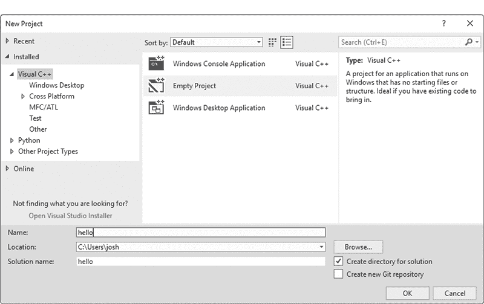
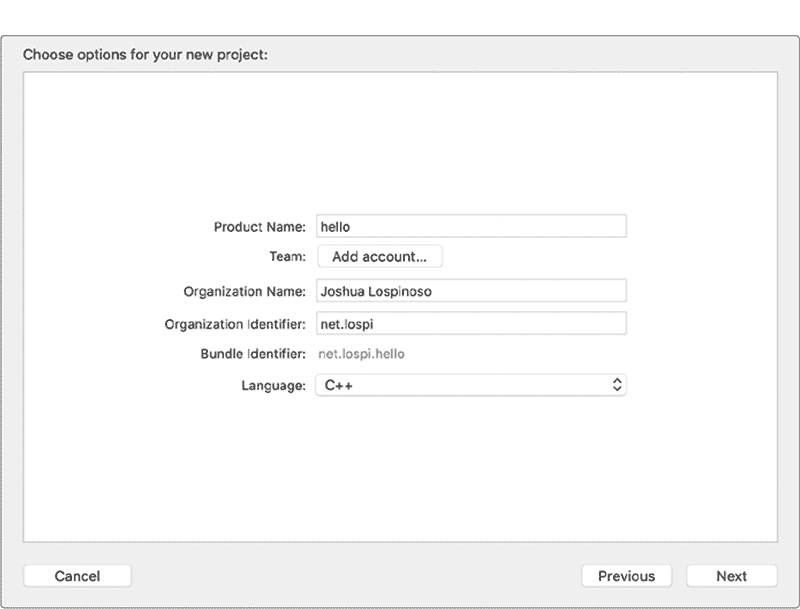
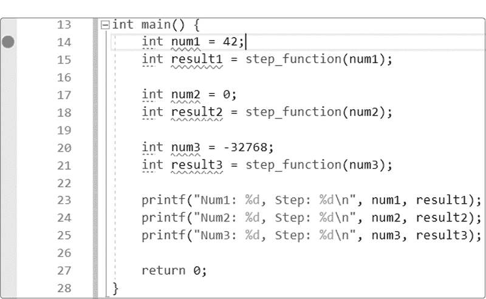
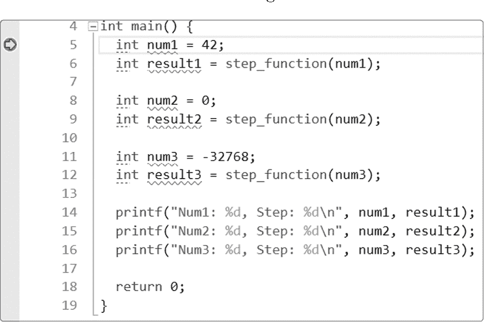
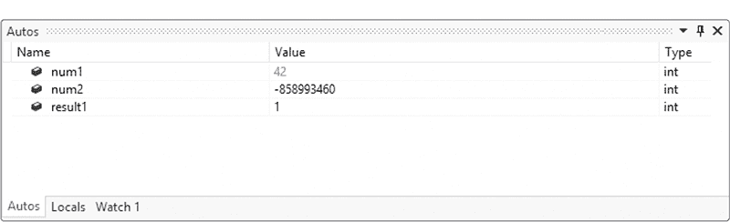
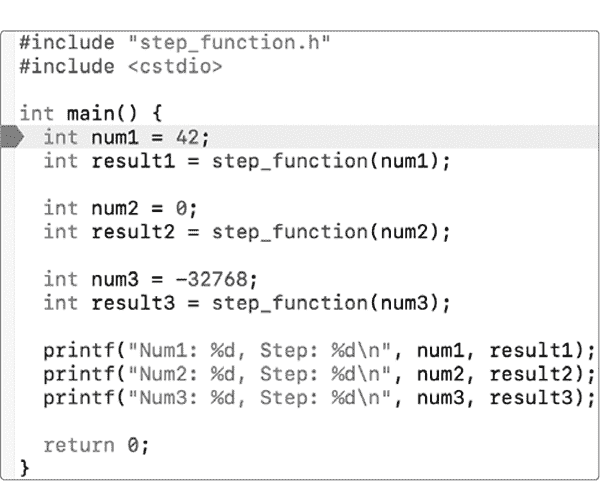
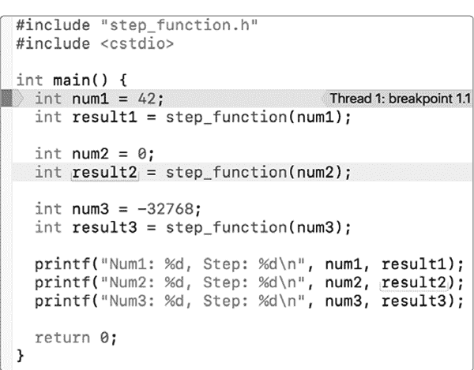
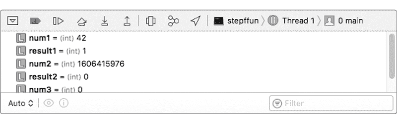

## **1

启动并运行**

*. . . 由于如此猛烈的冲击，我摔倒在地，发现自己昏迷不醒，跌入草地下九寻深的坑中。. . . 低头一看，我发现自己穿着一双结实的靴子，带有异常坚固的绑带。我牢牢地抓住它们，用尽全力一再拉扯。*

—鲁道夫·拉斯佩，《缪特豪森男爵的独特冒险》


在本章中，你将首先设置一个 C++ *开发环境*，这是一个工具集合，使你能够开发 C++软件。你将使用开发环境编译你的第一个 C++ *控制台应用程序*，这是一个可以从命令行运行的程序。接下来，你将了解开发环境的主要组件及其在生成你编写的应用程序中的作用。接下来的章节将涵盖足够的 C++基础内容，帮助你构建有用的示例程序。

C++因其学习难度较大而声名显赫。的确，C++是一门庞大、复杂且富有雄心的语言，即便是经验丰富的 C++程序员也经常学习新的模式、特性和用法。

一个主要的细微差别在于，C++特性紧密结合在一起。不幸的是，这常常给新手带来困扰。由于 C++概念之间紧密耦合，初学者很难明确从何处入手。本书的第一部分通过有条理、系统化的方式引导你穿越这些复杂的内容，但它必须从某个地方开始。本章将介绍足够的内容，帮助你入门。不要过于担心细节！

### **一个基本 C++程序的结构**

在这一节中，你将编写一个简单的 C++程序，并进行编译和运行。你将 C++源代码写入人类可读的文本文件中，这些文件称为*源文件*。然后，使用编译器将你的 C++代码转换为可执行的机器代码，这就是计算机可以运行的程序。

让我们开始吧，创建你的第一个 C++源文件。

#### ***创建你的第一个 C++源文件***

打开你最喜欢的文本编辑器。如果你还没有偏好的编辑器，可以尝试 Linux 上的 Vim、Emacs 或 gedit；Mac 上的 TextEdit；或者 Windows 上的 Notepad。输入列表 1-1 中的代码，并将文件保存到桌面，命名为*main.cpp*。

```
#include <cstdio> ➊

int main➋(){
  printf("Hello, world!"); ➌
  return 0; ➍
}
--------------------------------------------------------------------------
Hello, world! ➌
```

*列表 1-1：你的第一个 C++程序将`Hello, world!`输出到屏幕上。*

列表 1-1 源文件编译成一个程序，该程序会将字符`Hello, world!`输出到屏幕上。根据惯例，C++源文件的扩展名为*.cpp*。

**注意**

*在本书中，代码列表会在程序源代码之后立即展示程序输出；输出部分将以灰色显示。数字标注将与产生输出的行对应。例如，列表 1-1 中的`printf`语句负责输出`Hello, world!`，因此它们共享相同的标注* ➌。

#### ***主程序：C++程序的起点***

如 列表 1-1 所示，C++ 程序有一个单一的入口点，叫做 `main` 函数 ➋。*入口点* 是在用户运行程序时执行的函数。*函数* 是一段代码，它可以接受输入、执行一些指令并返回结果。

在 `main` 中，你调用了 `printf` 函数，它将字符 `Hello, world!` 打印到控制台 ➌。然后程序通过返回退出码 `0` 给操作系统退出 ➍。*退出码* 是操作系统用来确定程序运行状况的整数值。通常，退出码 `0` 表示程序运行成功。其他退出码可能表示出现了问题。在 `main` 中包含返回语句是可选的；默认情况下，退出码为 `0`。

`printf` 函数在程序中没有定义；它在 `cstdio` 库中 ➊。

#### ***库：引入外部代码***

*库* 是可以导入到程序中的有用代码集合，避免重新发明轮子。几乎所有的编程语言都有某种方式将库功能集成到程序中：

+   Python、Go 和 Java 有 `import`。

+   Rust、PHP 和 C# 有 `use`/`using`。

+   JavaScript、Lua、R 和 Perl 有 `require`/`requires`。

+   C 和 C++ 有 `#include`。

列表 1-1 包含了 `cstdio` ➊，这是一个执行输入/输出操作的库，例如打印到控制台。

### **编译器工具链**

在编写完 C++ 程序的源代码后，下一步是将源代码转化为可执行程序。*编译器工具链*（或 *工具链*）是由三个元素组成的集合，它们依次运行，将源代码转换为程序：

1.  **预处理器** 执行基本的源代码处理。例如，`#include <cstdio>` ➊ 是一个指令，告诉预处理器将 `cstdio` 库的相关信息直接包含到程序的源代码中。当预处理器完成源文件的处理后，它会生成一个单一的翻译单元。每个翻译单元会被传递给编译器进行进一步处理。

1.  **编译器** 读取翻译单元并生成 *目标文件*。目标文件包含一种称为目标代码的中间格式。这些文件包含数据和指令的中间格式，大多数人无法理解。编译器一次处理一个翻译单元，因此每个翻译单元对应一个单独的目标文件。

1.  **链接器**从目标文件生成程序。链接器还负责查找你在源代码中包含的库。例如，当你编译列表 1-1 时，链接器会找到`cstdio`库，并包括程序所需的所有内容来使用`printf`函数。请注意，`cstdio`头文件与`cstdio`库是不同的。头文件包含了如何使用该库的信息。你将在第二十一章中进一步了解库和源代码的组织。

#### ***设置你的开发环境***

所有 C++ 开发环境都包含编辑源代码的方法和将源代码转化为程序的编译器工具链。通常，开发环境还包含一个*调试器*——一个非常有价值的程序，它允许你逐行跟踪程序，以找到错误。

当所有这些工具——文本编辑器、编译器工具链和调试器——被捆绑到一个程序中时，这个程序被称为*集成开发环境（IDE）*。对于初学者和老手来说，IDE 都能大大提高生产力。

**注意**

*不幸的是，C++没有一个可以用来交互式执行 C++ 代码片段的解释器。这与其他语言如 Python、Ruby 和 JavaScript 不同，它们有解释器。一些网络应用程序可以让你测试并共享小型 C++ 代码片段。比如 Wandbox（*[`wandbox.org/`](https://wandbox.org/)*），它允许你编译并运行代码，以及 Matt Godbolt 的 Compiler Explorer（*[`www.godbolt.org/`](https://www.godbolt.org/)*），它允许你检查代码生成的汇编代码。这两者都支持多种编译器和系统。*

每个操作系统都有自己的源代码编辑器和编译器工具链，因此本节按操作系统划分。跳到与你相关的部分。

#### ***Windows 10 及更高版本：Visual Studio***

截至目前，微软 Windows 上最流行的 C++ 编译器是 Microsoft Visual C++ 编译器（MSVC）。获取 MSVC 的最简单方法是按照以下步骤安装 Visual Studio 2017 IDE：

1.  下载 Visual Studio 2017 的社区版。链接可以在[*https://ccc.codes/*](https://ccc.codes/)找到。

1.  运行安装程序，如果需要，允许其进行更新。

1.  在安装 Visual Studio 屏幕中，确保选择了**C++ 桌面开发工作负载**。

1.  点击**安装**以安装 Visual Studio 2017 和 MSVC。

1.  点击**启动**以启动 Visual Studio 2017。整个过程可能需要几小时，具体取决于你的机器速度和所选内容。典型的安装需要 20GB 到 50GB 的空间。

设置一个新项目：

1.  选择**文件 ▸ 新建 ▸ 项目**。

1.  在**已安装**中，点击**Visual C++**并选择**常规**。在中间面板中选择**空项目**。

1.  输入 hello 作为项目名称。您的窗口应该像图 1-1 一样，但位置会根据您的用户名有所不同。点击**确定**。

    *图 1-1：Visual Studio 2017 新建项目向导*

1.  在工作区左侧的**解决方案资源管理器**窗格中，右键点击**源文件**文件夹并选择**添加 ▸ 现有项**。请参见图 1-2。

    *图 1-2：将现有源文件添加到 Visual Studio 2017 项目中*

1.  选择您之前在清单 1-1 中创建的*main.cpp*文件。（或者，如果您尚未创建此文件，请选择**新建项**而不是**现有项**。将文件命名为*main.cpp*，并将清单 1-1 中的内容输入到编辑窗口中。）

1.  选择**生成 ▸ 生成解决方案**。如果输出框中出现任何错误信息，请确保您正确输入了清单 1-1。如果仍然收到错误信息，请仔细阅读以寻找提示。

1.  选择**调试 ▸ 无调试启动**，或按 CTRL-F5 来运行您的程序。字母`Hello, world!`应该会打印到控制台上（接着会出现`Press Any Key to Continue`）。

#### ***macOS: Xcode***

如果您使用的是 macOS，应该安装 Xcode 开发环境。

1.  打开**App Store**。

1.  搜索并安装**Xcode** IDE。根据您的机器和网络连接的速度，安装可能需要超过一小时。安装完成后，打开**终端**并导航到您保存*main.cpp*的目录。

1.  在终端中输入`clang++ main.cpp -o hello`来编译您的程序。`-o`选项告诉工具链输出结果的位置。（如果出现编译器错误，请检查您是否正确输入了程序。）

1.  在终端中输入`./hello`来运行您的程序。屏幕上应该会显示文本`Hello, world!`。

要编译并运行程序，请打开 Xcode IDE 并按照以下步骤操作：

1.  选择**文件 ▸ 新建 ▸ 项目**。

1.  选择**macOS ▸ 命令行工具**，然后点击**下一步**。在下一个对话框中，您可以修改创建项目文件目录的位置。现在接受默认设置并点击**创建**。

1.  将项目命名为 hello，并将其**类型**设置为**C++**。请参见图 1-3。

1.  现在，您需要将代码从清单 1-1 导入到您的项目中。一种简单的方法是将*main.cpp*的内容复制并粘贴到您的项目的*main.cpp*中。另一种方法是使用 Finder 将您的*main.cpp*替换为项目中的*main.cpp*。（通常在创建新项目时不需要处理此问题。这只是本教程需要处理多种操作环境的一个产物。）

1.  点击**运行**。



*图 1-3：Xcode 中的新建项目对话框*

#### ***Linux 和 GCC***

在 Linux 上，您可以选择两种主要的 C++编译器：GCC 和 Clang。截止目前，最新的稳定版是 9.1，而最新的 Clang 主要版本是 8.0.0。在本节中，您将安装这两种编译器。一些用户发现其中一个的错误信息比另一个更有帮助。

**注意**

GCC *是 GNU 编译器集合*（GNU Compiler Collection）的缩写。*GNU 发音为“guh-NEW”，是“GNU’s Not Unix!”的递归缩写。GNU 是一个类 Unix 操作系统和一套计算机软件。*

尝试通过操作系统的包管理器安装 GCC 和 Clang，但要小心。您的默认仓库可能包含旧版本，这些版本可能没有 C++ 17 的支持。如果您的版本不支持 C++ 17，您将无法编译书中的某些示例，因此您需要安装更新版本的 GCC 或 Clang。为了简洁起见，本章介绍了如何在 Debian 上以及从源代码进行安装。您可以调查如何在您选择的 Linux 版本上执行类似操作，或者设置与本章列出的操作系统之一的开发环境。

##### **在 Debian 上安装 GCC 和 Clang**

根据您在阅读本章节时，个人软件包档案（Personal Package Archives）中包含的软件，您可能能够直接使用 Debian 的高级包工具（APT）安装 GCC 8.1 和 Clang 6.0.0。本节展示了如何在 Ubuntu 18.04（截至本书出版时的最新 LTS 版本）上安装 GCC 和 Clang。

1.  打开终端。

1.  更新并升级当前安装的软件包：

    ```
    $ sudo apt update && sudo apt upgrade
    ```

1.  安装 GCC 8 和 Clang 6.0：

    ```
    $ sudo apt install g++-8 clang-6.0
    ```

1.  测试 GCC 和 Clang：

    ```
    $ g++-8 --version
    g++-8 (Ubuntu 8-20180414-1ubuntu2) 8.0.1 20180414 (experimental) [trunk revision 259383]
    Copyright (C) 2018 Free Software Foundation, Inc.
    This is free software; see the source for copying conditions.There is NO
    warranty; not even for MERCHANTABILITY or FITNESS FOR A PARTICULAR
    PURPOSE.
    $ clang++-6.0 --version
    clang version 6.0.0-1ubuntu2 (tags/RELEASE_600/final)
    Target: x86_64-pc-linux-gnu
    Thread model: posix
    InstalledDir: /usr/bin
    ```

如果任何命令返回错误，提示命令未找到，则说明相应的编译器未正确安装。尝试搜索有关您收到的错误信息，尤其是在您的包管理器的文档和论坛中查找相关信息。

##### **从源代码安装 GCC**

如果您无法通过包管理器找到最新的 GCC 或 Clang 版本（或您的 Unix 变种没有包管理器），您始终可以从源代码安装 GCC。请注意，这需要很长时间（可能长达几个小时），而且您可能需要动手解决安装过程中出现的错误。这些错误通常需要您自己进行研究来解决。要安装 GCC，请按照[`gcc.gnu.org/`](https://gcc.gnu.org/)上的说明操作。本节总结了该网站上更为详细的文档。

**注意**

*为了简洁起见，本教程没有详细说明 Clang 的安装。有关更多信息，请参考* [`clang.llvm.org/`](https://clang.llvm.org/) *。*

要从源代码安装 GCC 8.1，请执行以下操作：

1.  打开终端。

1.  更新并升级当前安装的软件包。例如，使用 APT 时，您可以执行以下命令：

    ```
    $ sudo apt update && sudo apt upgrade
    ```

1.  从[`gcc.gnu.org/mirrors.html`](https://gcc.gnu.org/mirrors.html)上的可用镜像站点下载文件 *gcc-8.1.0.tar.gz* 和 *gcc-8.1.0.tar.gz.sig*。这些文件可以在 *releases/gcc-8.1.0* 中找到。

1.  （可选）验证包的完整性。首先，导入相关的 GnuPG 密钥。你可以在镜像站点上找到这些密钥。例如：

    ```
    $ gpg --keyserver keyserver.ubuntu.com --recv C3C45C06
    gpg: requesting key C3C45C06 from hkp server keyserver.ubuntu.com
    gpg: key C3C45C06: public key "Jakub Jelinek <jakub@redhat.com>" imported
    gpg: key C3C45C06: public key "Jakub Jelinek <jakub@redhat.com>" imported
    gpg: no ultimately trusted keys found
    gpg: Total number processed: 2
    gpg:               imported: 2  (RSA: 1)
    ```

    验证你下载的内容：

    ```
    $ gpg --verify gcc-8.1.0.tar.gz.sig gcc-8.1.0.tar.gz
    gpg: Signature made Wed 02 May 2018 06:41:51 AM DST using DSA key ID C3C45C06
    gpg: Good signature from "Jakub Jelinek <jakub@redhat.com>"
    gpg: WARNING: This key is not certified with a trusted signature!
    gpg:          There is no indication that the signature belongs to the
    owner.
    Primary key fingerprint: 33C2 35A3 4C46 AA3F FB29  3709 A328 C3A2 C3C4
    5C06
    ```

    你看到的警告意味着我没有在我的机器上将签名者的证书标记为可信。为了验证签名确实属于所有者，你需要通过其他方式验证签名密钥（例如，亲自见面或通过其他途径验证主密钥指纹）。有关 GNU 隐私保护（GPG）的更多信息，请参考 Michael W. Lucas 的 *PGP & GPG: Email for the Practical Paranoid*，或者访问 [*https://gnupg.org/download/integrity_check.html*](https://gnupg.org/download/integrity_check.html) 获取关于 GPG 完整性检查功能的具体信息。

1.  解压缩包（此命令可能需要几分钟）：

    ```
    $ tar xzf gcc-8.1.0.tar.gz
    ```

1.  导航到新创建的 *gcc-8.1.0* 目录：

    ```
    $ cd gcc-8.1.0
    ```

1.  下载 GCC 的先决条件：

    ```
    $ ./contrib/download_prerequisites
    --snip--
    gmp-6.1.0.tar.bz2: OK
    mpfr-3.1.4.tar.bz2: OK
    mpc-1.0.3.tar.gz: OK
    isl-0.18.tar.bz2: OK
    All prerequisites downloaded successfully.
    ```

1.  使用以下命令配置 GCC：

    ```
    $ mkdir objdir
    $ cd objdir
    $ ../configure --disable-multilib
    checking build system type... x86_64-pc-linux-gnu
    checking host system type... x86_64-pc-linux-gnu
    --snip--
    configure: creating ./config.status
    config.status: creating Makefile
    ```

    说明文档可以在 *[`gcc.gnu.org/install/configure.html`](https://gcc.gnu.org/install/configure.html)* 上找到。

1.  构建 GCC 二进制文件（可能需要整晚时间，因为这可能需要几个小时）：

    ```
    $ make
    ```

    完整的说明文档可以在 *[`gcc.gnu.org/install/build.html`](https://gcc.gnu.org/install/build.html)* 上找到。

1.  测试你的 GCC 二进制文件是否正确构建：

    ```
    $ make -k check
    ```

    完整的说明文档可以在 *[`gcc.gnu.org/install/test.html`](https://gcc.gnu.org/install/test.html)* 上找到。

1.  安装 GCC：

    ```
    $ make install
    ```

    此命令将一批二进制文件放入操作系统的默认可执行目录，通常是 */usr/local/bin*。完整的说明文档可以在 *[`gcc.gnu.org/install/`](https://gcc.gnu.org/install/)* 上找到。

1.  通过执行以下命令验证 GCC 是否正确安装：

    ```
    $ x86_64-pc-linux-gnu-gcc-8.1.0 --version
    ```

    如果你收到一个错误，指示找不到命令，说明你的安装没有成功。请参考 gcc-help 邮件列表，网址是 *[`gcc.gnu.org/ml/gcc-help/`](https://gcc.gnu.org/ml/gcc-help/)*。

    **注意**

    *你可能想将繁琐的 `x86_64-pc-linux-gnu-gcc-8.1.0` 别名为类似 `g++8` 的简短名称，例如，可以使用以下命令：*

    ```
    $ sudo ln -s /usr/local/bin/x86_64-pc-linux-gnu-gcc-8.1.0 /usr/local/bin/g++8
    ```

1.  导航到你保存 *main.cpp* 的目录，并使用 GCC 编译你的程序：

    ```
    $ x86_64-pc-linux-gnu-gcc-8.1.0 main.cpp -o hello
    ```

1.  `-o` 标志是可选的；它告诉编译器输出程序的名称。因为你指定了程序名称为 `hello`，你应该可以通过输入 ./hello 来运行你的程序。如果出现编译错误，确保你正确输入了程序的代码。（编译错误应该能帮助你找出问题所在。）

#### ***文本编辑器***

如果你不想使用前面提到的 IDE，你可以使用简单的文本编辑器来编写 C++ 代码，比如 Notepad（Windows）、TextEdit（Mac）或 Vim（Linux）；不过，也有一些优秀的编辑器是专门为 C++ 开发设计的。选择一个让你最有效率的开发环境。

如果你正在使用 Windows 或 macOS，你已经有了一个高质量、功能齐全的 IDE，即 Visual Studio 或 Xcode。Linux 系统的选择包括 Qt Creator (*[`www.qt.io/ide/`](https://www.qt.io/ide/)*), Eclipse CDT (*[`eclipse.org/cdt/`](https://eclipse.org/cdt/)*), 和 JetBrains 的 CLion (*[`www.jetbrains.com/clion/`](https://www.jetbrains.com/clion/)*). 如果你是 Vim 或 Emacs 用户，你会发现有很多 C++ 插件。

**注意**

*如果跨平台 C++ 对你很重要，我强烈推荐你看看 JetBrains 的 CLion。虽然 CLion 是一款付费产品，但与许多竞争对手不同，JetBrains 在发布时确实为学生和开源项目维护者提供了折扣和免费许可证。*

### **引导 C++**

本节为你提供了足够的上下文，以支持接下来的章节中的示例代码。你可能会有关于细节的问题，接下来的章节会为你解答。在此之前，不必慌张！

#### ***C++ 类型系统***

C++ 是一种面向对象的语言。对象是具有状态和行为的抽象。想象一个现实世界中的物体，比如开关。你可以描述它的 *状态*，例如开关当前的状态。它是开着还是关着？它能承受的最大电压是多少？它在房子的哪个房间？你还可以描述开关的 *行为*。它是从一种状态（开）切换到另一种状态（关）吗？还是它是一个调光开关，可以在开和关之间设定多个状态？

描述一个对象的行为和状态的集合称为它的 *类型*。C++ 是一种 *强类型语言*，意味着每个对象都有一个预定义的数据类型。

C++ 有一种内建的整数类型，叫做 `int`。一个 `int` 对象可以存储整数（它的状态），并且支持许多数学运算（它的行为）。

要使用 `int` 类型执行任何有意义的任务，你需要创建一些 `int` 对象并命名它们。命名的对象称为 *变量*。

#### ***声明变量***

你通过提供变量的类型，然后是变量名，最后加上分号来声明变量。以下示例声明了一个名为 `the_answer` 的变量，类型为 `int`：

```
int➊ the_answer➋;
```

类型 `int` ➊ 后面跟着变量名 `the_answer` ➋。

#### ***初始化变量的状态***

当你声明变量时，你是在初始化它们。*对象初始化* 确定了对象的初始状态，例如设置它的值。我们将在第二章中详细讨论初始化的细节。现在，你可以使用等号 (`=`) 在变量声明后面设置变量的初始值。例如，你可以在一行中声明并赋值 `the_answer`：

```
int the_answer = 42;
```

运行这一行代码后，你将得到一个名为 `the_answer` 的变量，类型为 `int`，值为 42。你可以将变量赋值为数学表达式的结果，例如：

```
int lucky_number = the_answer / 6;
```

这一行计算表达式 `the_answer / 6` 并将结果赋值给 `lucky_number`。`int` 类型支持许多其他操作，如加法 `+`、减法 `-`、乘法 `*` 和模除运算 `%`。

**注意**

*如果你不熟悉模除运算，或者想知道当你将两个整数相除并且有余数时会发生什么，说明你提出了很好的问题。这些问题将在第七章中详细解答。*

#### ***条件语句***

*条件语句* 允许你在程序中做出决策。这些决策依赖于布尔表达式，布尔表达式的值为真或假。例如，你可以使用 *比较运算符*，例如“大于”或“不等于”，来构建布尔表达式。

一些与 `int` 类型配合使用的基本比较运算符出现在清单 1-2 中的程序里。

```
int main() {
  int x = 0;
  42  == x;  // Equality
  42  != x;  // Inequality
  100 >  x;  // Greater than
  123 >= x;  // Greater than or equal to
  -10 <  x;  // Less than
  -99 <= x;  // Less than or equal to
}
```

*清单 1-2：使用比较运算符的程序*

该程序没有输出（编译并运行清单 1-2 来验证这一点）。虽然程序没有输出，但编译它有助于验证你编写了有效的 C++ 代码。要生成更有趣的程序，你可以使用条件语句，如 `if`。

一个 `if` 语句包含一个布尔表达式和一个或多个嵌套语句。根据布尔表达式的值是为真还是为假，程序决定执行哪个嵌套语句。`if` 语句有几种形式，但基本用法如下：

```
if (➊boolean-expression) ➋statement
```

如果布尔表达式 ➊ 为真，则执行嵌套语句 ➋；否则不执行。

有时候，你会希望一组语句一起执行，而不是单个语句。这样的语句组称为 *复合语句*。要声明一个复合语句，只需将语句组用大括号 `{ }` 包围即可。你可以在 `if` 语句中使用复合语句，如下所示：

```
if (➊boolean-expression) { ➋
  statement1;
  statement2;
  --snip--
}
```

如果布尔表达式 ➊ 为真，则复合语句 ➋ 中的所有语句都执行；否则，它们都不执行。

你可以通过 `else if` 和 `else` 语句来扩展 `if` 语句。这些可选的附加语句让你可以描述更复杂的分支行为，如清单 1-3 所示。

```
➊ if (boolean-expression-1) statement-1
➋ else if (boolean-expression-2) statement-2
➌ else statement-3
```

*清单 1-3：带有 `else if` 和 `else` 分支的 `if` 语句*

首先，布尔表达式 ➊ 会被求值。如果布尔表达式 ➊ 为真，则求值语句 1，`if` 语句停止执行。如果布尔表达式 ➊ 为假，则布尔表达式 ➋ 被求值。如果为真，则求值语句 2。否则，求值语句 3。请注意，语句 1、语句 2 和语句 3 是互斥的，它们共同覆盖了 `if` 语句的所有可能结果。三者中只会执行一个。

你可以包含任何数量的`else if`子句，也可以完全省略它们。与最初的`if`语句一样，评估每个`else if`子句时的布尔表达式按顺序进行。当某个布尔表达式评估为`true`时，评估停止，执行相应的语句。如果没有`else if`表达式评估为`true`，则`else`子句中的语句-3*总是*执行。（与`else if`子句一样，`else`也是可选的。）

考虑示例 1-4，它使用`if`语句来确定打印哪一条语句。

```
#include <cstdio>

int main() {
  int x = 0; ➊
  if (x > 0) printf("Positive.");
  else if (x < 0) printf("Negative.");
  else printf("Zero.");
}
-----------------------------------------------------------------------
Zero.
```

*示例 1-4：一个具有条件行为的程序*

编译程序并运行。你的结果应该是`Zero`。现在改变`x`的值 ➊。程序现在打印什么？

**注意**

*注意，示例 1-4 中的`main`函数省略了返回语句。由于`main`是一个特殊函数，返回语句是可选的。*

#### ***函数***

函数是接受任意数量输入对象的代码块，这些输入对象被称为*参数*或*实参*，并且可以向调用者返回输出对象。

你按照示例 1-5 中展示的一般语法声明函数。

```
return-type➊ function_name➋(par-type1 par_name1➌, par-type2 par_name2➍) {
  --snip--
  return➎ return-value;
}
```

*示例 1-5：C++ 函数的一般语法*

该函数声明的第一部分是返回变量的类型 ➊，例如`int`。当函数返回一个值 ➎ 时，`return-value`的类型必须与`return-type`匹配。

然后，在声明返回类型之后，声明函数的名称 ➋。紧跟在函数名称后的圆括号中包含了函数所需的任何数量的以逗号分隔的输入参数。每个参数也都有类型和名称。

示例 1-5 有两个参数。第一个参数 ➌ 的类型是`par-type1`，名称为`par_name1`，第二个参数 ➍ 的类型是`par-type2`，名称为`par_name2`。参数表示传递给函数的对象。

紧随其后的花括号包含函数的主体。这是一个复合语句，包含函数的逻辑。在该逻辑中，函数可能会决定向调用者返回一个值。返回值的函数会有一个或多个`return`语句。一旦函数返回，执行停止，程序的控制流返回到调用该函数的地方。让我们看一个例子。

##### **示例：阶跃函数**

为了演示，本节展示了如何构建一个名为`step_function`的数学函数，该函数对于所有负数参数返回`-1`，对于零值参数返回`0`，对于所有正数参数返回`1`。示例 1-6 展示了你如何编写`step_function`。

```
int step_function(int ➊x) {
  int result = 0; ➋
  if (x < 0) {
    result = -1; ➌
  } else if (x > 0) {
    result = 1; ➍
  }
  return result; ➎
}
```

*示例 1-6：一个阶跃函数，对于负值返回 `-1`，对于零返回 `0`，对于正值返回 `1`*

`step_function`接受一个单一的参数`x` ➊。`result`变量被声明并初始化为`0` ➋。接下来，`if`语句会将`result`设置为`-1` ➌，如果`x`小于`0`。如果`x`大于`0`，`if`语句会将`result`设置为`1` ➍。最后，`result`被返回给调用者 ➎。

##### **调用函数**

要调用（或*调用*）一个函数，你需要使用所需函数的名称、括号和以逗号分隔的所需参数列表。编译器按从上到下的顺序读取文件，因此函数的声明必须出现在第一次使用它之前。

考虑清单 1-7 中的程序，它使用了`step_function`。

```
int step_function(int x) {
  --snip--
}

int main() {
  int value1 = step_function(100); // value1 is  1
  int value2 = step_function(0);   // value2 is  0
  int value3 = step_function(-10); // value3 is -1
}
```

*清单 1-7：使用`step_function`的程序。（该程序没有输出。）*

清单 1-7 调用`step_function`三次，传入不同的参数，并将结果赋给`value1`、`value2`和`value3`变量。

如果你能打印这些值，那该有多好呢？幸运的是，你可以使用`printf`函数通过不同的变量构建输出。诀窍在于使用`printf`格式说明符。

#### ***printf 格式说明符***

除了打印常量字符串（如清单 1-1 中的`Hello, world!`），`printf`还可以将多个值组合成格式良好的字符串；它是一种特殊的函数，可以接受一个或多个参数。

`printf`的第一个参数始终是*格式字符串*。格式字符串为要打印的字符串提供了模板，并且包含任意数量的特殊*格式说明符*。格式说明符告诉`printf`如何解释和格式化跟随在格式字符串后的参数。所有格式说明符都以`%`开头。

例如，`int`的格式说明符是`%d`。每当`printf`在格式字符串中看到`%d`时，它就知道格式说明符后面需要一个`int`类型的参数。然后，`printf`会用参数的实际值替换格式说明符。

**注意**

*`printf`函数是`writef`函数的衍生版，`writef`函数最初出现在 BCPL 中，这是一种已废弃的编程语言，由 Martin Richards 于 1967 年设计。向`writef`提供`%H`、`%I`和`%O`说明符会通过`WRITEHEX`、`WRITED`和`WRITEOCT`函数输出十六进制、十进制和八进制。`%d`说明符的来源尚不清楚（也许来自`WRITED`中的 D？），但我们只能使用它。*

考虑以下`printf`调用，它打印字符串`Ten 10, Twenty 20, Thirty 30`：

```
printf("Ten %d➊, Twenty %d➋, Thirty %d➌", 10➍, 20➎, 30➏);
```

第一个参数`"Ten %d, Twenty %d, Thirty %d"`是格式字符串。请注意，这里有三个格式说明符`%d` ➊ ➋ ➌。格式字符串后面也有三个参数 ➍ ➎ ➏。当`printf`构建输出时，它会将位置➊的参数替换为位置➍的参数，将位置➋的参数替换为位置➎的参数，将位置➌的参数替换为位置➏的参数。

**IOSTREAMS、PRINTF 和输入输出教学法**

人们对教 C++新手使用哪种标准输出方法有非常强烈的意见。一个选择是`printf`，它的历史可以追溯到 C 语言。另一个选择是`cout`，它是 C++标准库中`iostream`库的一部分。本书教授两者：在第一部分中讲解`printf`，在第二部分中讲解`cout`。原因如下。

这本书是通过一点一点地建立你的 C++知识的。每一章都是按顺序设计的，因此你无需凭空猜测就能理解代码示例。或多或少，你会清楚每一行代码的作用。因为`printf`相当原始，到了第三章，你会有足够的知识来准确了解它是如何工作的。

相比之下，`cout`涉及大量的 C++概念，直到第一部分的结尾，你才有足够的背景知识理解它是如何工作的。（什么是流缓冲区？什么是`operator<<`？什么是方法？`flush()`是如何工作的？等一下，`cout`在析构函数中自动刷新？什么是析构函数？什么是`setf`？实际上，什么是格式标志？`BitmaskType`是什么？天哪，什么是操控器？等等。）

当然，`printf`有一些问题，一旦你学会了`cout`，你应该更倾向于使用它。使用`printf`时，容易在格式说明符和参数之间引入不匹配，这可能导致奇怪的行为、程序崩溃，甚至安全漏洞。使用`cout`意味着你不需要格式化字符串，因此无需记住格式说明符。你再也不会遇到格式字符串和参数之间的不匹配。I/O 流也是*可扩展的*，这意味着你可以将输入和输出功能集成到你自己的类型中。

本书直接教授现代 C++，但在这一特定话题上，它有意稍微妥协了一些现代主义的教条，以采取一种有条理的线性方法。作为附带的好处，你将为遇到`printf`说明符做好准备，而这在你的编程生涯中很可能会发生。大多数语言，如 C、Python、Java 和 Ruby，都有`printf`说明符的功能，而 C#、JavaScript 等语言中也有类似的功能。

#### ***重新审视 step_function***

让我们看另一个使用`step_function`的例子。清单 1-8 包含了变量声明、函数调用和`printf`格式说明符。

```
#include <cstdio> ➊

int step_function(int x) { ➋
  --snip--
}

int main() { ➌
    int num1 = 42; ➍
    int result1 = step_function(num1); ➎

    int num2 = 0;
    int result2 = step_function(num2);

    int num3 = -32767;
    int result3 = step_function(num3);

    printf("Num1: %d, Step: %d\n", num1, result1); ➏
    printf("Num2: %d, Step: %d\n", num2, result2);
    printf("Num3: %d, Step: %d\n", num3, result3);

    return 0;
}
--------------------------------------------------------------------------
Num1: 42, Step: 1 ➏
Num2: 0, Step: 0
Num3: -32767, Step: -1
```

*清单 1-8：一个应用`step_function`处理多个整数并打印结果的程序*

由于程序使用了`printf`，因此包含了`cstdio` ➊。`step_function` ➋已经定义好，可以在程序后续使用，而`main` ➌则定义了程序的入口点。

**注意**

*本书中的某些清单将相互依赖。为了节省纸张，你将看到使用`--snip--`符号来表示重复部分没有更改。*

在`main`函数中，你初始化了一些`int`类型的变量，比如`num1` ➍。接着，你将这些变量传递给`step_function`，并初始化结果变量来存储返回的值，比如`result1` ➎。

最后，您通过调用 `printf` 打印返回的值。每次调用都以格式字符串开始，例如 `"Num1: %d, Step: %d\n"` ➏。每个格式字符串中都嵌入了两个 `%d` 格式说明符。根据 `printf` 的要求，格式字符串后面有两个参数，`num1` 和 `result1`，它们分别对应这两个格式说明符。

#### ***注释***

*注释* 是人类可读的注释，您可以将其添加到源代码中。您可以使用 `//` 或 `/**/` 符号来添加注释。`//` 符号告诉编译器忽略从第一个斜杠到下一个换行符之间的所有内容，这意味着您可以将注释嵌入到代码行内或单独放在新的一行：

```
// This comment is on its own line
int the_answer = 42; // This is an in-line comment
```

您可以使用 `/**/` 符号在代码中包含多行注释：

```
/*
 *  This is a comment
 *  That lives on multiple lines
 *  Don’t forget to close
 */
```

注释以 `/*` 开始，以 `*/` 结束。（起始和结束斜杠之间的星号是可选的，但通常会使用它们。）

何时使用注释是一个永恒的争论话题。一些编程界的名人建议，代码应当具有足够的表现力和自解释性，以至于注释几乎不再必要。他们可能会说，描述性的变量名、简短的函数和良好的测试通常就是您所需的所有文档。其他程序员则喜欢到处放置注释。

您可以培养自己的哲学。编译器会完全忽略您所做的任何事情，因为它从不解释注释。

### **调试**

软件工程师最重要的技能之一就是高效、有效的调试。大多数开发环境都有调试工具。在 Windows、macOS 和 Linux 上，调试工具都非常优秀。学会好好使用它们是一项快速回报的投资。本节提供了如何使用调试器逐步执行程序的快速指南，您可以参考清单 1-8。您可以跳到最相关的环境。

#### ***Visual Studio***

Visual Studio 拥有一款优秀的内置调试器。我建议您在 *Debug* 配置下调试程序。这会导致工具链构建一个增强调试体验的目标。唯一需要在 *Release* 模式下调试的原因是诊断一些仅在 Release 模式下发生，而在 Debug 模式下不会发生的罕见情况。

1.  打开 *main.cpp* 并找到 `main` 的第一行。

1.  单击 `main` 的第一行对应的行号左侧的边距以插入断点。您点击的位置会出现一个红色圆圈，如图 1-4 所示。

    *图 1-4：插入断点*

1.  选择 **调试 ▸ 开始调试**。程序将运行到您插入断点的那一行。调试器将暂停程序执行，并出现一个黄色箭头指示下一条将要执行的指令，如图 1-5 所示。

    *图 1-5：调试器在断点处暂停执行。*

1.  选择**调试 ▸ 步过**。步过操作执行指令而不“进入”任何函数调用。默认情况下，步过的快捷键是 F10。

1.  因为下一行调用了`step_function`，选择**调试 ▸ 步入**来调用`step_function`并在第一行处中断。你可以通过进入/跳过它的指令继续调试这个函数。默认情况下，步入的快捷键是 F11。

1.  要使执行返回到`main`，请选择**调试 ▸ 步出**。默认情况下，这个操作的快捷键是 SHIFT-F11。

1.  通过选择**调试 ▸ 窗口 ▸ Autos**来检查 Autos 窗口。你可以看到一些重要变量的当前值，如图 1-6 所示。

    *图 1-6：Autos 窗口显示当前断点处变量的值。*

    你可以看到`num1`被设置为 42，`result1`被设置为 1。为什么`num2`有一个乱码值？因为初始化为 0 的操作还没有发生：它是下一个要执行的指令。

**注意**

*调试器刚刚强调了一个非常重要的低级细节：分配对象的存储和初始化对象的值是两个不同的步骤。你将在第四章中了解更多关于存储分配和对象初始化的内容。*

Visual Studio 调试器支持更多的功能。欲了解更多信息，请查看*Visual Studio 文档链接：[`ccc.codes/`](https://ccc.codes/)*。

#### ***Xcode***

Xcode 也有一个优秀的内置调试器，完全集成到 IDE 中。

1.  打开*main.cpp*并定位到`main`的第一行。

1.  点击第一行，然后选择**调试 ▸ 断点 ▸ 在当前行添加断点**。断点出现，如图 1-7 所示。

    *图 1-7：插入断点*

1.  选择**运行**。程序将运行到插入的断点所在的行。调试器将暂停程序执行，出现一个绿色箭头表示下一个要执行的指令，如图 1-8 所示。

    *图 1-8：调试器在断点处暂停执行。*

1.  选择**调试 ▸ 步过**来执行指令，而不“进入”任何函数调用。默认情况下，步过的快捷键是 F6。

1.  因为下一行调用了`step_function`，选择**调试 ▸ 步入**来调用`step_function`并在第一行处中断。你可以通过进入/跳过它的指令继续调试这个函数。默认情况下，步入的快捷键是 F7。

1.  要使执行返回到`main`，请选择**调试 ▸ 步出**。默认情况下，步出的快捷键是 F8。

1.  在*main.cpp*屏幕底部检查 Autos 窗口。你可以看到一些重要变量的当前值，如图 1-9 所示。

    *图 1-9：自动窗口显示当前断点处变量的值。*

    你可以看到 `num1` 被设置为 42，`result1` 被设置为 1。为什么 `num2` 有一个乱码值？因为初始化为 0 的操作还没有发生：它是下一个要执行的指令。

Xcode 调试器支持更多功能。欲了解更多信息，请查看 Xcode 文档链接 *[`ccc.codes/`](https://ccc.codes/)*。

#### ***使用 GDB 和 LLDB 调试 GCC 和 Clang***

GNU 项目调试器（GDB）是一个强大的调试器（*[`www.gnu.org/software/gdb/`](https://www.gnu.org/software/gdb/)*）。你可以使用命令行与 GDB 交互。要在编译时启用调试支持，使用 `g++` 或 `clang++` 编译时，必须添加 `-g` 标志。

你的包管理器很可能已经包含 GDB。例如，要使用高级包工具（APT）安装 GDB，可以输入以下命令：

```
$ sudo apt install gdb
```

Clang 还拥有一个出色的调试器，称为低级调试器（LLDB），你可以在 *[`lldb.llvm.org/`](https://lldb.llvm.org/)* 下载。它被设计用来与本节中的 GDB 命令一起使用，因此为了简洁起见，我不会详细介绍 LLDB。你可以使用 LLDB 调试使用 GCC 调试支持编译的程序，也可以使用 GDB 调试使用 Clang 调试支持编译的程序。

**注意**

*Xcode 在后台使用 LLDB。*

要使用 GDB 调试 Listing 1-8（在 page 20 页）中的程序，按照以下步骤操作：

1.  在命令行中，导航到你存储头文件和源文件的文件夹。

1.  使用调试支持编译程序：

    ```
    $ g++-8 main.cpp -o stepfun -g
    ```

1.  使用 `gdb` 调试程序，你应该会看到以下交互式控制台会话：

    ```
    $ gdb stepfun
    GNU gdb (Ubuntu 7.7.1-0ubuntu5~14.04.2) 7.7.1
    Copyright (C) 2014 Free Software Foundation, Inc.
    License GPLv3+: GNU GPL version 3 or later <http://gnu.org/licenses/gpl.
    html>
    This is free software: you are free to change and redistribute it.
    There is NO WARRANTY, to the extent permitted by law.  Type "show copying"
    and "show warranty" for details.
    This GDB was configured as "x86_64-linux-gnu".
    Type "show configuration" for configuration details.
    For bug reporting instructions, please see:
    <http://www.gnu.org/software/gdb/bugs/>.
    Find the GDB manual and other documentation resources online at:
    <http://www.gnu.org/software/gdb/documentation/>.
    For help, type "help".
    Type "apropos word" to search for commands related to "word"...
    Reading symbols from stepfun...done.
    (gdb)
    ```

1.  要插入断点，可以使用 `break` 命令，它接受一个参数，该参数是源文件的名称和你想要断点的行号，两者之间用冒号（`:`）分隔。例如，假设你想要在 *main.cpp* 的第一行设置断点。在 Listing 1-8 中，这在第 5 行（虽然你可能需要根据你的源代码位置调整）。你可以在（`gdb`）提示符下使用以下命令设置断点：

    ```
    (gdb) break main.cpp:5
    ```

1.  你还可以告诉 `gdb` 在特定函数处按名称设置断点：

    ```
    (gdb) break main
    ```

1.  无论哪种方式，你现在都可以执行你的程序：

    ```
    (gdb) run
    Starting program: /home/josh/stepfun
    Breakpoint 1, main () at main.cpp:5
    5         int num1 = 42;
    (gdb)
    ```

1.  要单步执行一条指令，可以使用 `step` 命令逐行跟踪程序的执行，包括进入函数：

    ```
    (gdb) step
    6         int result1 = step_function(num1);
    ```

1.  要继续单步执行，按 ENTER 重复上一个命令：

    ```
    (gdb)
    step_function (x=42) at step_function.cpp:4
    ```

1.  要从函数调用中回退出来，可以使用 `finish` 命令：

    ```
    (gdb) finish
    Run till exit from #0  step_function (x=42) at step_function.cpp:7
    0x0000000000400546 in main () at main.cpp:6
    6         int result1 = step_function(num1);
    Value returned is $1 = 1
    ```

1.  要执行一条指令而不进入函数调用，可以使用 `next` 命令：

    ```
    (gdb) next
    8         int num2 = 0;
    ```

1.  要检查当前变量的值，可以使用 `info locals` 命令：

    ```
    (gdb) info locals
    num2 = -648029488
    result2 = 32767
    num1 = 42
    result1 = 1
    num3 = 0
    result3 = 0
    ```

    请注意，任何尚未初始化的变量将没有合理的值。

1.  要继续执行直到下一个断点（或者程序完成），可以使用 `continue` 命令：

    ```
    (gdb) continue
    Continuing.
    Num1: 42, Step: 1
    Num2: 0, Step: 0
    Num3: -32768, Step: -1
    [Inferior 1 (process 1322) exited normally]
    ```

1.  使用 `quit` 命令可以随时退出 `gdb`。

GDB 支持更多功能。有关详细信息，请查阅文档：[*https://sourceware.org/gdb/current/onlinedocs/gdb/*](https://sourceware.org/gdb/current/onlinedocs/gdb/)。

### **总结**

本章带你搭建了一个有效的 C++开发环境，并编译了你的第一个 C++程序。你了解了构建工具链的组成部分以及它们在编译过程中的作用。接着，你探索了一些 C++的基本主题，如数据类型、声明变量、语句、条件语句、函数和`printf`。本章最后通过一个教程指导你设置调试器，并逐步调试你的项目。

**注意**

*如果你在设置环境时遇到问题，可以在线搜索错误信息。如果仍然无法解决，可以将问题发布到 Stack Overflow：[`stackoverflow.com/`](https://stackoverflow.com/)，C++子版块：[`www.reddit.com/r/cpp_questions/`](https://www.reddit.com/r/cpp_questions/)，或 C++ Slack 频道：[`cpplang.now.sh/`](https://cpplang.now.sh/)。*

**练习**

尝试这些练习来巩固本章所学内容。（本书的配套代码可在[`ccc.codes`](https://ccc.codes)获取。）

**1-1.** 创建一个名为`absolute_value`的函数，它返回其单个参数的绝对值。整数`x`的绝对值定义为：如果`x`大于或等于 0，则返回`x`本身；否则，返回`x`乘以−1。你可以使用清单 1-9 中的程序作为模板：

```
#include <cstdio>

int absolute_value(int x) {
  // Your code here
}

int main() {
  int my_num = -10;
  printf("The absolute value of %d is %d.\n", my_num,
         absolute_value(my_num));
}
```

*清单 1-9：使用`absolute_value`函数的程序模板*

**1-2.** 尝试使用不同的值运行程序。你是否看到了预期的结果？

**1-3.** 使用调试器运行程序，逐步执行每条指令。

**1-4.** 编写另一个名为`sum`的函数，它接受两个`int`类型的参数并返回它们的和。你如何修改清单 1-9 中的模板来测试你的新函数？

**1-5.** C++拥有一个活跃的在线社区，互联网上充满了许多优秀的 C++相关资源。可以查看 CppCast 播客：[*http://cppcast.com/*](http://cppcast.com/)。搜索 CppCon 和 C++Now 的 YouTube 视频。将[*https://cppreference.com/*](https://cppreference.com/)和[*http://www.cplusplus.com/*](http://www.cplusplus.com/)添加到浏览器的书签中。

**1-6.** 最后，从[*https://isocpp.org/std/the-standard/*](https://isocpp.org/std/the-standard/)下载国际标准化组织（ISO）C++ 17 标准的副本。不幸的是，官方 ISO 标准是有版权的，需要购买。幸运的是，你可以免费下载“草案”版本，它与正式版的唯一区别是外观上的。

**注意** *由于 ISO 标准的页码会因版本不同而有所差异，本书将使用与标准本身相同的命名规则来引用特定章节。该命名规则通过将章节名称用方括号括起来来引用章节。子章节则通过句点分隔。例如，要引用包含在引言部分的 C++对象模型章节，应写作 [intro.object]。*

**进一步阅读**

+   *实用程序员：从学徒到大师* 由 Andrew Hunt 和 David Thomas 编写（Addison-Wesley Professional, 2000）

+   *使用 GDB、DDD 和 Eclipse 进行调试艺术* 由 Norman Matloff 和 Peter Jay Salzman 编写（No Starch Press, 2008）

+   *PGP 与 GPG: 实用偏执者的电子邮件* 由 Michael W. Lucas 编写（No Starch Press, 2006）

+   *GNU Make 书籍* 由 John Graham-Cumming 编写（No Starch Press, 2015）
