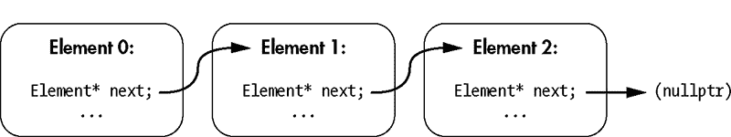
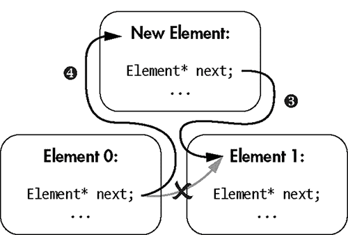

## **3

引用类型**

*每个人都知道，调试比写程序要难两倍。那么，如果你在编写程序时已经尽可能聪明，那你怎么可能调试它呢？*

—布赖恩·肯尼汉*


*引用类型*存储对象的内存地址。这些类型使得高效编程成为可能，许多优雅的设计模式也包含它们。在本章中，我将讨论两种引用类型：指针和引用。我还会讨论`this`、`const`和`auto`。

### 指针

*指针*是用来引用内存地址的基本机制。指针编码了与另一个对象交互所需的两部分信息——即对象的地址和对象的类型。

你可以通过在指向类型后面加一个星号（`*`）来声明一个指针的类型。例如，你可以如下声明一个指向`int`的指针`my_ptr`：

```
int* my_ptr;
```

指针的格式说明符是`%p`。例如，要打印`my_ptr`中的值，你可以使用如下代码：

```
printf("The value of my_ptr is %p.", my_ptr);
```

指针是非常低级的对象。尽管它们在大多数 C 程序中扮演着核心角色，但 C++提供了更高级的构造， 有时更高效，可以避免直接处理内存地址的需要。尽管如此，指针仍然是一个基础概念，你无疑会在系统编程中遇到它。

在本节中，你将学习如何找到一个对象的地址，并将结果赋值给一个指针变量。你还将学习如何执行相反的操作，这称为*解引用*：给定一个指针，你可以获取位于相应地址的对象。

你将进一步了解*数组*，这是管理对象集合的最简单构造，以及数组如何与指针相关联。作为低级构造，数组和指针相对危险。你将了解指针和数组相关程序出错时可能会发生的情况。

本章介绍了两种特殊类型的指针：`void`指针和`std::byte`指针。这些非常有用的类型具有一些特殊的行为，您需要记住这些行为。此外，您还将学习如何使用`nullptr`编码空指针，并学习如何在布尔表达式中使用指针来判断它们是否为空。

#### *变量地址*

你可以通过在变量前加上*取地址操作符*（`&`）来获取变量的地址。你可能想用这个操作符来初始化一个指针，使其“指向”相应的变量。这样的编程需求在操作系统编程中非常常见。例如，主要的操作系统，如 Windows、Linux 和 FreeBSD，都有大量使用指针的接口。

列表 3-1 演示了如何获取一个`int`的地址。

```
#include <cstdio>

int main() {
  int gettysburg{}; ➊
  printf("gettysburg: %d\n", gettysburg); ➋
  int *gettysburg_address = &gettysburg; ➌
  printf("&gettysburg: %p\n", gettysburg_address); ➍
}
```

*列表 3-1：一个包含取地址操作符`&`和一个糟糕双关语的程序*

首先，你声明整数`gettysburg` ➊并打印其值 ➋。然后你声明一个指针，名为`gettysburg_address`，指向该整数的地址 ➌；注意，星号（`*`）出现在指针前面，而&符号出现在`gettysburg`前面。最后，你打印指针到屏幕上 ➍，以显示`gettysburg`整数的地址。

如果你在 Windows 10（x86）上运行示例 3-1，你应该看到以下输出：

```
gettysburg: 0
&gettysburg: 0053FBA8
```

在 Windows 10 x64 上运行相同的代码会产生以下输出：

```
gettysburg: 0
&gettysburg: 0000007DAB53F594
```

你的输出应当在`gettysburg`上具有相同的值，但`gettysburg_address`每次应有所不同。这种变化是由于*地址空间布局随机化*，这是一种安全特性，旨在通过打乱重要内存区域的基础地址来防止攻击者利用漏洞。

**地址空间布局随机化**

为什么地址空间布局随机化能有效阻止攻击？当黑客在程序中发现可利用的漏洞时，他们有时会将恶意负载塞入用户提供的输入中。为了防止黑客让恶意负载执行，设计的第一个安全特性是将所有数据区域设置为不可执行。如果计算机试图将数据作为代码执行，那么理论上它会发现异常并通过异常终止程序。

一些极为聪明的黑客通过精心设计包含所谓的*返回导向程序*的漏洞，找到了以完全出乎意料的方式重新利用可执行代码指令的方法。这些漏洞可以安排调用相关的系统 API，使它们的负载能够被标记为可执行，从而突破非可执行内存的防护措施。

地址空间布局随机化通过随机化内存地址来对抗返回导向编程，使得攻击者难以重新利用现有代码，因为他们不知道代码在内存中的具体位置。

另外请注意，在示例 3-1 的输出中，`gettysburg_address`在 x86 架构下包含 8 个十六进制数字（4 字节），而在 x64 架构下包含 16 个十六进制数字（8 字节）。这应该是有道理的，因为在现代桌面系统上，指针的大小与 CPU 的通用寄存器相同。x86 架构具有 32 位（4 字节）的通用寄存器，而 x64 架构具有 64 位（8 字节）的通用寄存器。

#### *解引用指针*

*解引用操作符*（`*`）是一个一元操作符，用于访问指针所指向的对象。这是地址操作符的逆操作。给定一个地址，你可以获得驻留在该地址的对象。像地址操作符一样，系统程序员常常使用解引用操作符。许多操作系统 API 会返回指针，如果你想访问指针所指向的对象，你就需要使用解引用操作符。

不幸的是，解引用运算符可能会给初学者带来很多符号上的困惑，因为解引用运算符、指针声明和乘法都使用星号。请记住，你在声明指针时，应该在指向对象的类型后加上星号；但是，你在指针前加上解引用运算符——一个星号——像这样：

```
*gettysburg_address
```

在通过在指针前加解引用运算符来访问一个对象后，你可以像对待任何其他指向类型的对象一样对待该结果。例如，因为`gettysburg`是一个整数，你可以使用`gettysburg_address`将值 17325 写入`gettysburg`。正确的语法如下：

```
*gettysburg_address = 17325;
```

因为解引用指针——也就是`*gettysburg_address`——出现在等号的左侧，所以你正在向存储`gettysburg`的地址写入数据。

如果解引用指针出现在等号的右侧或其他地方，你就是在从该地址读取数据。要获取`gettysburg_address`指向的`int`，只需加上解引用运算符。例如，以下语句将打印`gettysburg`中存储的值：

```
printf("%d", *gettysburg_address);
```

清单 3-2 使用解引用运算符进行读写操作。

```
#include <cstdio>

int main() {
  int gettysburg{};
  int* gettysburg_address = &gettysburg; ➊
  printf("Value at gettysburg_address: %d\n", *gettysburg_address); ➋
  printf("Gettysburg Address: %p\n", gettysburg_address); ➌
  *gettysburg_address = 17325; ➍
  printf("Value at gettysburg_address: %d\n", *gettysburg_address); ➎
  printf("Gettysburg Address: %p\n", gettysburg_address); ➏
--------------------------------------------------------------------------
Value at gettysburg_address: 0 ➋
Gettysburg Address: 000000B9EEEFFB04 ➌
Value at gettysburg_address: 17325 ➎
Gettysburg Address: 000000B9EEEFFB04 ➏
```

*清单 3-2：一个使用指针进行读写操作的示例程序（输出来自 Windows 10 x64 机器）*

首先，你将`gettysburg`初始化为零。然后，你将指针`gettysburg_address`初始化为`gettysburg`的地址 ➊。接着，你打印`gettysburg_address`指向的`int` ➋以及`gettysburg_address`本身的值 ➌。

你将值 17325 写入`gettysburg_address`指向的内存 ➍，然后再次打印该指针指向的值 ➎ 和地址 ➏。

如果你直接将值 17325 赋给`gettysburg`而不是`gettysburg_address`指针，像这样，清单 3-2 在功能上是完全相同的：

```
  gettysburg = 17325;
```

本示例说明了指向对象（`gettysburg`）与指向该对象的解引用指针（`*gettysburg_address`）之间的密切关系。

#### *成员指针运算符*

*成员指针运算符*，或称为*箭头运算符*（`->`），执行两个同时的操作：

+   它解引用一个指针。

+   它访问指向对象的成员。

你可以使用这个运算符来减少*符号摩擦*，也就是程序员在编写代码时表达意图时遇到的阻力，尤其是在处理指向类的指针时。你将在各种设计模式中处理指向类的指针。例如，你可能需要将指向类的指针作为函数参数传递。如果接收函数需要与该类的成员进行交互，成员指针运算符就是完成该任务的工具。

清单 3-3 使用箭头运算符从`ClockOfTheLongNow`对象中读取`year`（该对象在清单 2-22 中实现，位于第 58 页）。

```
#include <cstdio>

struct ClockOfTheLongNow {
  --snip--
};

int main() {
  ClockOfTheLongNow clock;
  ClockOfTheLongNow* clock_ptr = &clock; ➊
  clock_ptr->set_year(2020); ➋
 printf("Address of clock: %p\n", clock_ptr); ➌
  printf("Value of clock's year: %d", clock_ptr->get_year()); ➍
}
--------------------------------------------------------------------------
Address of clock: 000000C6D3D5FBE4 ➌
Value of clock's year: 2020 ➍
```

*列表 3-3：使用指针和箭头操作符操作`ClockOfTheLongNow`对象（输出来自一台 Windows 10 x64 机器）*

你声明一个`clock`，然后将其地址存储在`clock_ptr`中➊。接着，你使用箭头操作符将`clock`的`year`成员设置为 2020➋。最后，你打印`clock`的地址➌以及`year`的值➍。

你可以使用解引用（`*`）和成员访问（`.`）操作符来实现相同的结果。例如，你可以将列表 3-3 的最后一行写成如下：

```
  printf("Value of clock's year: %d", (*clock_ptr).get_year());
```

首先，你解引用`clock_ptr`，然后访问`year`。虽然这与调用指向成员的操作符等效，但它是一种冗长的语法，并且没有比更简单的替代方式带来额外的好处。

**注意**

*现在，使用括号来强调运算顺序。第七章会详细讲解操作符的优先级规则。*

#### *指针与数组*

指针与数组有几个相似之处。指针表示对象的位置，而数组则表示连续对象的起始位置和长度。

只要有一点触发，数组就会*退化*为指针。退化后的数组会失去长度信息，并转换为指向数组第一个元素的指针。例如：

```
int key_to_the_universe[]{ 3, 6, 9 };
int* key_ptr = key_to_the_universe; // Points to 3
```

首先，你初始化一个包含三个元素的`int`数组`key_to_the_universe`。接下来，你将`int`指针`key_ptr`初始化为指向`key_to_the_universe`，此时`key_ptr`会退化为一个指向数组的指针。初始化后，`key_ptr`指向`key_to_the_universe`的第一个元素。

列表 3-4 初始化一个包含`College`对象的数组，并将该数组作为指针传递给一个函数。

```
#include <cstdio>

struct College {
  char name[256];
};
void print_name(College* college_ptr➊) {
  printf("%s College\n", college_ptr->name➋);
}

int main() {
  College best_colleges[] = { "Magdalen", "Nuffield", "Kellogg" };
  print_name(best_colleges);
}
--------------------------------------------------------------------------
Magdalen College ➋
```

*列表 3-4：展示数组退化为指针的程序*

`print_name`函数接受一个指向`College`的指针作为参数➊，因此在调用`print_name`时，`best_colleges`数组会退化为指向其第一个元素的指针。因为数组退化成指向第一个元素的指针，所以➊处的`college_ptr`指向`best_colleges`中的第一个`College`。

列表 3-4 中也有另一个数组退化➋。你使用箭头操作符（`->`）访问`college_ptr`指向的`College`的`name`成员，而`college_ptr`本身是一个`char`数组。`printf`的格式说明符`%s`期望一个 C 风格的字符串，它是一个`char`指针，`name`退化为一个指针来满足`printf`的要求。

##### 处理退化

通常，你会将数组作为两个参数传递：

+   指向第一个数组元素的指针

+   数组的长度

使这种模式得以实现的机制是方括号（`[]`），它们与指针的作用与数组相同。列表 3-5 中使用了这种技术。

```
#include <cstdio>

struct College {
  char name[256];
};

void print_names(College* colleges➊, size_t n_colleges➋) {
  for (size_t i = 0; i < n_colleges; i++) { ➌
    printf("%s College\n", colleges[i]➍.name➎);
  }
}

int main() {
  College oxford[] = { "Magdalen", "Nuffield", "Kellogg" };
  print_names(oxford, sizeof(oxford) / sizeof(College));
}
--------------------------------------------------------------------------
Magdalen College
Nuffield College
Kellogg College
```

*列表 3-5：展示将数组传递给函数的常见用法的程序*

`print_names`函数接受两个参数的数组：指向第一个`College`元素的指针➊和元素数量`n_colleges`➋。在`print_names`内部，你使用`for`循环和索引`i`进行迭代。`i`的值从`0`迭代到`n_colleges-1`➌。

你通过访问第`i`个元素➍来提取对应的学院名称，然后获取`name`成员➎。

这种将指针与大小相结合的数组传递方法在 C 风格的 API 中无处不在，例如在 Windows 或 Linux 系统编程中。

##### 指针运算

要获取数组中第`n`个元素的地址，你有两种选择。首先，你可以采取直接的方式，通过方括号（`[]`）获取第`n`个元素，然后使用取地址（`&`）运算符：

```
College* third_college_ptr = &oxford[2];
```

*指针运算*，即对指针进行加法和减法的规则，提供了一种替代方法。当你对指针进行加法或减法操作时，编译器会根据指向类型的大小计算出正确的字节偏移。例如，将 4 加到一个`uint64_t`指针上会增加 32 个字节：`uint64_t`占用 8 个字节，因此 4 个`uint64_t`占用 32 个字节。因此，下面的操作等同于前一种获取数组中第`n`个元素地址的方法：

```
College* third_college_ptr = oxford + 2;
```

#### *指针是危险的*

无法将指针转换为数组，这是件好事。你不应该需要这么做，而且一般来说，编译器也不可能从指针恢复数组的大小。但编译器无法阻止你尝试做所有危险的事情。

##### 缓冲区溢出

对于数组和指针，你可以通过括号运算符（`[]`）或指针运算来访问任意的数组元素。这些是低级编程中非常强大的工具，因为你可以或多或少不经过抽象直接与内存交互。这让你对系统拥有精细的控制，某些环境（例如在系统编程环境中实现网络协议或嵌入式控制器时）中是必需的。然而，强大的能力伴随着巨大的责任，你必须非常小心。指针的简单错误可能会导致灾难性且神秘的后果。

清单 3-6 对两个字符串执行低级别操作。

```
#include <cstdio>
int main() {
  char lower[] = "abc?e";
  char upper[] = "ABC?E";
  char* upper_ptr = upper;     ➊ // Equivalent: &upper[0]

  lower[3] = 'd';              ➋ // lower now contains a b c d e \0
  upper_ptr[3] = 'D';             // upper now contains A B C D E \0

  char letter_d = lower[3];    ➌ // letter_d equals 'd'
  char letter_D = upper_ptr[3];   // letter_D equals 'D'

  printf("lower: %s\nupper: %s", lower, upper); ➍

  lower[7] = 'g';              ➎ // Super bad. You must never do this.
}
--------------------------------------------------------------------------
lower: abcde ➍
upper: ABCDE
The time is 2:14 a.m. Eastern time, August 29th. Skynet is now online. ➎
```

*清单 3-6：包含缓冲区溢出的程序*

在初始化`lower`和`upper`字符串后，你初始化`upper_ptr`指向`upper`中的第一个元素➊。然后，你将`lower`和`upper`的第四个元素（问号）重新赋值为`d`和`D`➋ ➌。注意，`lower`是一个数组，而`upper_ptr`是一个指针，但机制是相同的。到目前为止，一切顺利。

最后，你犯了一个大错，写出了超出边界的内存➎。通过访问索引为`7`的元素➍，你已经越过了分配给`lower`的存储空间。没有进行边界检查；这段代码可以在没有警告的情况下编译。

在运行时，你会遇到 *未定义行为*。未定义行为意味着 C++ 语言规范没有规定会发生什么，因此你的程序可能会崩溃、暴露安全漏洞或启动一个人工通用智能 ➎。

##### 括号和指针算术之间的关系

要理解越界访问的影响，你必须理解括号操作符和指针算术之间的关系。考虑到你可以用指针算术和解引用操作符，而不是括号操作符来编写示例 3-6，正如在示例 3-7 中所示。

```
#include <cstdio>
int main() {
 char lower[] = "abc?e";
  char upper[] = "ABC?E";
  char* upper_ptr = &upper[0];

  *(lower + 3) = 'd';
  *(upper_ptr + 3) = 'D';

  char letter_d = *(lower + 3); // lower decays into a pointer when we add
  char letter_D = *(upper_ptr + 3);

  printf("lower: %s\nupper: %s", lower, upper);

  *(lower + 7) = 'g'; ➊
}
```

*示例 3-7：一个使用指针算术的与 示例 3-6 等效的程序*

`lower` 数组的长度为 6（包括字母 *a*–*e* 和一个空终止符）。现在应该清楚为什么给 `lower[7]` 赋值 ➊ 是危险的了。在这种情况下，你正在写入一些不属于 `lower` 的内存。这可能导致访问违规、程序崩溃、安全漏洞和数据损坏。这些错误可能非常隐蔽，因为错误发生的点和 bug 显现出来的点可能相距甚远。

#### *空指针和 std::byte 指针*

有时，指向的类型并不重要。在这种情况下，你使用 *void 指针* `void*`。`void` 指针有重要的限制，其中最主要的是你不能解引用一个 `void*`。因为指向的类型已被删除，解引用没有意义（回想一下 `void` 对象的值集是空的）。出于类似的原因，C++ 禁止 `void` 指针算术。

有时，你希望在字节级别与原始内存进行交互。举例来说，这包括低级操作，如在文件和内存之间复制原始数据、加密和压缩。你不能使用 `void` 指针来执行这些操作，因为位运算和算术操作被禁用了。在这种情况下，你可以使用 `std::byte` 指针。

#### *nullptr 和布尔表达式*

指针可以有一个特殊的字面值，`nullptr`。通常，等于 `nullptr` 的指针不指向任何东西。例如，你可以使用 `nullptr` 来表示没有更多内存可以分配，或者某个错误发生了。

指针有一个隐式转换为 `bool` 的机制。任何不等于 `nullptr` 的值会隐式转换为 `true`，而 `nullptr` 会隐式转换为 `false`。这在一个返回指针的函数成功执行时非常有用。一个常见的惯用法是，函数在失败时返回 `nullptr`。一个经典例子是内存分配。

### 引用

*引用* 是比指针更安全、更方便的版本。你通过在类型名后附加 `&` 声明引用。引用不能轻易赋值为 null，且不能被 *重新定位*（或重新赋值）。这些特性消除了指针中一些常见的错误。

处理引用的语法比指针更简洁。你无需使用指针的成员操作符和解引用操作符，引用就像是指向类型一样直接使用。

清单 3-8 特征是一个引用参数。

```
#include <cstdio>

struct ClockOfTheLongNow {
  --snip--
};

void add_year(ClockOfTheLongNow&➊ clock) {
  clock.set_year(clock.get_year() + 1); ➋ // No deref operator needed
}

int main() {
  ClockOfTheLongNow clock;
  printf("The year is %d.\n", clock.get_year()); ➌
  add_year(clock); ➍ // Clock is implicitly passed by reference!
  printf("The year is %d.\n", clock.get_year()); ➎
}
--------------------------------------------------------------------------
The year is 2019\. ➌
The year is 2020\. ➎
```

*清单 3-8：使用引用的程序*

你通过使用与星号不同的`&`符号将`clock`参数声明为`ClockOfTheLongNow`的引用 ➊。在`add_year`中，你像使用`ClockOfTheLongNow`类型一样使用`clock` ➋：无需使用笨拙的解引用和指针到引用操作符。首先，你打印`year`的值 ➌。接着，在调用点，你直接将一个`ClockOfTheLongNow`对象传入`add_year` ➍：无需获取它的地址。最后，你再次打印`year`的值，说明它已经增加 ➎。

### 指针和引用的使用

指针和引用在很大程度上是可以互换的，但两者各有优缺点。如果你有时必须改变引用类型的值——也就是说，如果你必须改变引用类型所指向的内容——你必须使用指针。许多数据结构（包括下一节将介绍的前向链表）要求你能够更改指针的值。由于引用不能重新指向并且通常不应赋值为`nullptr`，因此它们有时不适用。

#### *前向链表：典型的基于指针的数据结构*

*前向链表*是一种由一系列元素组成的简单数据结构。每个元素保存一个指向下一个元素的指针。链表中的最后一个元素保存一个`nullptr`。将元素插入链表非常高效，并且元素在内存中可以是不连续的。图 3-1 说明了它们的布局。



*图 3-1：链表*

清单 3-9 演示了单向链表元素的一种可能实现。

```
struct Element {
  Element* next{}; ➊
  void insert_after(Element* new_element) { ➋
    new_element->next = next; ➌
    next = new_element; ➍
  }
  char prefix[2]; ➎
  short operating_number; ➏
};
```

*清单 3-9：具有操作编号的链表 `Element` 实现*

每个`element`都有一个指向链表中`next`元素的指针 ➊，并初始化为`nullptr`。你通过`insert_after`方法插入一个新元素 ➋。它将`new_element`的`next`成员设置为`this`的`next` ➌，然后将`this`的`next`设置为`new_element` ➍。图 3-2 演示了这个插入过程。你并没有改变任何`Element`对象的内存位置；你只是修改了指针的值。



*图 3-2：插入元素到链表中*

每个`Element`还包含一个`prefix`数组 ➎和一个`operating_number`短整数 ➏。

清单 3-10 遍历一个`Element`类型的风暴兵链表，并沿途打印其操作编号。

```
#include <cstdio>

struct Element {
  --snip--
};

int main() {
  Element trooper1, trooper2, trooper3; ➊
  trooper1.prefix[0] = 'T';
  trooper1.prefix[1] = 'K';
  trooper1.operating_number = 421;
  trooper1.insert_after(&trooper2); ➋
  trooper2.prefix[0] = 'F';
  trooper2.prefix[1] = 'N';
  trooper2.operating_number = 2187;
  trooper2.insert_after(&trooper3); ➌
  trooper3.prefix[0] = 'L';
  trooper3.prefix[1] = 'S';
  trooper3.operating_number = 005; ➍

  for (Element *cursor = &trooper1➎; cursor➏; cursor = cursor->next➐) {
    printf("stormtrooper %c%c-%d\n",
           cursor->prefix[0],
           cursor->prefix[1],
           cursor->operating_number); ➑
  }
}
--------------------------------------------------------------------------
stormtrooper TK-421 ➑
stormtrooper FN-2187 ➑
stormtrooper LS-5 ➑
```

*清单 3-10：演示前向链表的程序*

清单 3-10 初始化了三个暴风兵 ➊。元素`trooper1`被赋予操作编号 TK-421，然后你将其作为链表中的下一个元素插入 ➋。元素`trooper2`和`trooper3`的操作编号分别为 FN-2187 和 LS-005，也被插入到链表中 ➌➍。

`for`循环遍历链表。首先，你将光标指针分配给`trooper1`的地址 ➎。这是链表的起始位置。在每次迭代之前，你确保`cursor`不是`nullptr` ➏。每次迭代后，你将`cursor`设置为`next`元素 ➐。在循环内，你打印每个暴风兵的操作编号 ➑。

#### *使用引用*

指针提供了很大的灵活性，但这种灵活性是以安全性为代价的。如果你不需要重定向和`nullptr`的灵活性，引用是首选的引用类型。

让我们再强调一次，引用不能被重新设置。清单 3-11 初始化了一个`int`引用，然后尝试用`new_value`重新设置它。

```
#include <cstdio>

int main() {
  int original = 100;
  int& original_ref = original;
  printf("Original:  %d\n", original); ➊
  printf("Reference: %d\n", original_ref); ➋

  int new_value = 200;
  original_ref = new_value; ➌
  printf("Original:  %d\n", original); ➍
  printf("New Value: %d\n", new_value); ➎
  printf("Reference: %d\n", original_ref); ➏
}
--------------------------------------------------------------------------
Original:  100 ➊
Reference: 100 ➋
Original:  200 ➍
New Value: 200 ➎
Reference: 200 ➏
```

*清单 3-11：演示无法重新设置引用的程序*

该程序初始化一个名为`original`的`int`变量为 100。然后声明一个对`original`的引用，称为`original_ref`。从此以后，`original_ref`将*始终*指向`original`。这一点通过打印`original`的值 ➊ 和`original_ref`所引用的值 ➋ 来说明。它们是相同的。

接下来，你初始化另一个`int`变量`new_value`为 200，并将其赋值给`original` ➌。仔细阅读：此赋值 ➌ 并不会重新设置`original_ref`指向`new_value`。而是将`new_value`的值赋给它所指向的对象（即`original`）。

结果是，这些变量——`original`、`original_ref`和`new_value`——的值都为 200 ➍➎➏。

#### *this 指针*

记住，方法与类相关，类的实例是对象。当你编写方法时，有时你需要访问*当前对象*，即正在执行该方法的对象。

在方法定义中，你可以使用`this`指针访问当前对象。通常不需要`this`，因为在访问成员时`this`是隐式的。但是有时你可能需要消除歧义——例如，如果你声明了一个与成员变量同名的方法参数。例如，你可以重写清单 3-9，明确指出你指的是哪个`Element`，如清单 3-12 所示。

```
struct Element {
  Element* next{};
  void insert_after(Element* new_element) {
 new_element->next = this->next; ➊
    this->next ➋ = new_element;
  }
  char prefix[2];
  short operating_number;
};
```

*清单 3-12：使用`this`指针重写清单 3-9*

在这里，`next`被替换为`this->next` ➊➋。这些清单在功能上是相同的。

有时，你需要`this`来解决成员与参数之间的歧义，正如清单 3-13 所示。

```
struct ClockOfTheLongNow {
  bool set_year(int year➊) {
    if (year < 2019) return false;
    this->year = year; ➋
    return true;
  }
--snip--
private:
  int year; ➌
};
```

*清单 3-13：使用`this`的冗长`ClockOfTheLongNow`定义*

`year` 参数 ➊ 与 `year` 成员 ➌ 同名。方法参数总是会遮蔽成员，这意味着当你在该方法中输入 `year` 时，它指的是 `year` 参数 ➊，而不是 `year` 成员 ➌。这没问题：你可以通过 `this` ➋ 来消除歧义。

#### *const 正确性*

`const` 关键字（常用作“常量”的缩写）大致意味着“我承诺不会修改”。它是一种安全机制，防止无意中（以及潜在的灾难性）修改成员变量。你将在函数和类的定义中使用 `const` 来指定一个变量（通常是引用或指针）在该函数或类中不会被修改。如果代码试图修改一个 `const` 变量，编译器将发出错误。当正确使用时，`const` 是所有现代编程语言中最强大的语言特性之一，因为它有助于你在编译时消除许多常见的编程错误。

让我们看看 `const` 的一些常见用法。

##### const 参数

将参数标记为 `const` 使得它不能在函数的作用域内被修改。`const` 指针或引用为你提供了一种高效的机制，可以将对象传递给函数进行只读使用。列表 3-14 中的函数接受一个 `const` 指针。

```
void petruchio(const char* shrew➊) {
  printf("Fear not, sweet wench, they shall not touch thee, %s.", shrew➋);
  shrew[0] = "K"; ➌ // Compiler error! The shrew cannot be tamed.
}
```

*列表 3-14：一个接受 `const` 指针的函数（此代码无法编译。）*

`petruchio` 函数通过 `const` 引用 ➊ 接受一个 `shrew` 字符串。你可以从 `shrew` ➋ 中读取，但尝试写入它会导致编译错误 ➌。

##### const 方法

将方法标记为 `const` 表示你承诺在该 `const` 方法中不会修改当前对象的状态。换句话说，这些方法是只读的。

要将方法标记为 `const`，请将 `const` 关键字放在参数列表之后但在方法体之前。例如，你可以像 列表 3-15 中演示的那样更新 `ClockOfTheLongNow` 对象的 `get_year` 方法，添加 `const`。

```
struct ClockOfTheLongNow {
  --snip--
  int get_year() const ➊{
      return year;
  }
private:
  int year;
};
```

*列表 3-15：使用 `const` 更新 `ClockOfTheLongNow`*

你只需要将 `const` 放在参数列表和方法体之间 ➊。如果你尝试在 `get_year` 中修改 `year`，编译器将生成一个错误。

持有 `const` 引用和指针的对象不能调用非 `const` 方法，因为非 `const` 方法可能会修改对象的状态。

列表 3-16 中的 `is_leap_year` 函数接受一个 `const ClockOfTheLongNow` 引用，并判断其是否为闰年。

```
bool is_leap_year(const ClockOfTheLongNow& clock) {
  if (clock.get_year() % 4 > 0) return false;
  if (clock.get_year() % 100 > 0) return true;
  if (clock.get_year() % 400 > 0) return false;
  return true;
}
```

*列表 3-16：一个判断是否为闰年的函数*

如果 `get_year` 没有被标记为 `const` 方法，列表 3-16 将无法编译，因为 `clock` 是一个 `const` 引用，不能在 `is_leap_year` 中被修改。

#### *const 成员变量*

你可以通过将 `const` 关键字添加到成员的类型中来标记成员变量为 `const`。这些 `const` 成员变量在初始化后不能被修改。

在清单 3-17 中，`Avout`类包含两个成员变量，一个是`const`类型，一个不是`const`类型。

```
struct Avout {
  const➊ char* name = "Erasmas";
  ClockOfTheLongNow apert; ➋
};
```

*清单 3-17：具有`const`成员的`Avout`类*

`name`成员是`const`，这意味着指向的值无法修改 ➊。另一方面，`apert`不是`const` ➋。

当然，`const Avout`引用不能被修改，因此通常的规则仍然适用于`apert`：

```
void does_not_compile(const Avout& avout) {
  avout.apert.add_year(); // Compiler error: avout is const
}
```

有时你想标记一个成员变量为`const`，但又希望使用传入构造函数的参数来初始化该成员。为此，你可以使用成员初始化列表。

#### *成员初始化列表*

*成员初始化列表*是初始化类成员的主要机制。要声明一个成员初始化列表，在构造函数的参数列表后加上冒号，然后插入一个或多个逗号分隔的*成员初始化器*。成员初始化器是成员的名称，后面跟着一个大括号初始化`{ }`。成员初始化器允许你在运行时设置`const`字段的值。

清单 3-18 中的示例通过引入成员初始化列表改进了清单 3-17。

```
#include <cstdio>

struct ClockOfTheLongNow {
  --snip--
};

struct Avout {
  Avout(const char* name, long year_of_apert) ➊
    :➋ name➌{ name }➍, apert➎{ year_of_apert }➏ {
  }
  void announce() const { ➐
    printf("My name is %s and my next apert is %d.\n", name, apert.get_year());
  }
 const char* name;
  ClockOfTheLongNow apert;
};

int main() {
  Avout raz{ "Erasmas", 3010 };
  Avout jad{ "Jad", 4000 };
  raz.announce();
  jad.announce();
}
--------------------------------------------------------------------------
My name is Erasmas and my next apert is 3010.
My name is Jad and my next apert is 4000.
```

*清单 3-18：声明并初始化两个`Avout`对象的程序*

`Avout`构造函数接受两个参数，一个是`name`，另一个是`year_of_apert` ➊。通过插入一个冒号 ➋ 来添加成员初始化列表，接着列出你要初始化的每个成员的名称 ➌➎ 和大括号初始化 ➍➏。还添加了一个`const`类型的`announce`方法，用于打印`Avout`构造函数的状态 ➐。

所有成员初始化在构造函数体执行之前都会被执行。这有两个优点：

+   它确保在构造函数执行之前所有成员都有效，因此你可以专注于初始化逻辑，而不是成员错误检查。

+   成员只会初始化一次。如果你在构造函数中重新赋值成员，可能会做一些额外的工作。

**注意**

*你应该按它们在类定义中出现的顺序排列成员初始化器，因为它们的构造函数将按此顺序被调用。*

说到消除额外的工作，是时候介绍`auto`了。

### auto 类型推导

作为一种强类型语言，C++为其编译器提供了大量信息。当你初始化元素或从函数返回时，编译器可以根据上下文推断出类型信息。`auto`关键字告诉编译器为你执行这样的推断，从而免去你输入冗余的类型信息。

#### *使用 auto 初始化*

在几乎所有情况下，编译器可以根据初始化值确定对象的正确类型。这种赋值包含冗余信息：

```
int answer = 42;
```

编译器知道`answer`是`int`类型，因为 42 是`int`类型。

你也可以使用`auto`代替：

```
auto the_answer { 42 };            // int
auto foot { 12L };                 // long
auto rootbeer { 5.0F };            // float
auto cheeseburger { 10.0 };        // double
auto politifact_claims { false };  // bool
auto cheese { "string" };          // char[7]
```

当你使用括号`()`和单独的`=`进行初始化时，这种方式同样适用：

```
auto the_answer = 42;
auto foot(12L);
--snip--
```

因为你尽可能使用`{}`进行统一初始化，本节将不再讨论这些替代方法。

单独使用这些简单的初始化帮助并不能给你带来太多好处；然而，当类型变得更加复杂时——例如，处理来自标准库容器的迭代器——它确实节省了很多输入工作量。它还使你的代码在重构时更具弹性。

#### *auto 和引用类型*

通常会在 `auto` 上添加修饰符，如 `&`、`*` 和 `const`。这些修饰符分别添加了预期的含义（引用、指针和 `const`）：

```
auto year { 2019 };              // int
auto& year_ref = year;           // int&
const auto& year_cref = year;    // const int&
auto* year_ptr = &year;          // int*
const auto* year_cptr = &year;   // const int*
```

向 `auto` 声明中添加修饰符的行为如你所预期：如果你添加了修饰符，结果类型将确保包含该修饰符。

#### *auto 和代码重构*

`auto` 关键字有助于简化代码并提高代码在重构时的弹性。考虑示例 3-19 中的基于范围的 `for` 循环示例。

```
struct Dwarf {
  --snip--
};

Dwarf dwarves[13];

struct Contract {
  void add(const Dwarf&);
};
 void form_company(Contract &contract) {
  for (const auto& dwarf : dwarves) { ➊
    contract.add(dwarf);
  }
}
```

*示例 3-19：在基于范围的 `for` 循环中使用 `auto` 的示例*

如果 `dwarves` 的类型发生变化，基于范围的 `for` 循环中的赋值 ➊ 不需要修改。`dwarf` 类型将根据其环境自适应，就像中土世界的矮人一样。

一般来说，始终使用 `auto`。

**注意**

*使用大括号初始化时，可能会出现一些边缘情况，导致你得到意想不到的结果，但这种情况很少，特别是在 C++17 修复了一些过于苛刻的行为后。在 C++17 之前，使用带大括号 `{}` 的 `auto` 会指定一个特殊对象 `std::initializer_list`，你将在第十三章中遇到它。*

### 总结

本章介绍了两种引用类型：引用和指针。在此过程中，你学习了成员指针操作符、指针与数组的相互作用以及 `void`/`byte` 指针。你还了解了 `const` 的含义及其基本用法、`this` 指针和成员初始化列表。此外，本章还介绍了 `auto` 类型推导。

**练习**

**3-1.** 阅读有关 CVE-2001-0500 的内容，这是微软 Internet 信息服务中的一个缓冲区溢出漏洞。（此漏洞通常被称为 Code Red 蠕虫漏洞。）

**3-2.** 向示例 3-6 中添加一个 `read_from` 和一个 `write_to` 函数。这些函数应根据需要读取或写入 `upper` 或 `lower`。进行边界检查以防止缓冲区溢出。

**3-3.** 向示例 3-9 中添加一个 `Element* previous`，以创建一个*双向链表*。向 `Element` 添加一个 `insert_before` 方法。使用两个独立的 `for` 循环从前向后遍历列表，再从后向前遍历。打印每个循环中的 `operating_number`。

**3-4.** 使用没有显式类型的方式重新实现示例 3-11。 （提示：使用 `auto`。）

**3-5.** 浏览第二章中的示例。哪些方法可以标记为 `const`？你在哪里可以使用 `auto`？

**进一步阅读**

+   *《C++ 编程语言》*，第 4 版，Bjarne Stroustrup 著（Pearson Education，2013）

+   《C++ 核心准则》由 Bjarne Stroustrup 和 Herb Sutter 编著（* [`github.com/isocpp/CppCoreGuidelines/`](https://github.com/isocpp/CppCoreGuidelines/) *）

+   《East End Functions》由 Phil Nash 编著（2018 年；* [`levelofindirection.com/blog/east-end-functions.html`](https://levelofindirection.com/blog/east-end-functions.html) *）

+   《引用常见问题解答》由标准 C++基金会编写（* [`isocpp.org/wiki/faq/references/`](https://isocpp.org/wiki/faq/references/) *）
