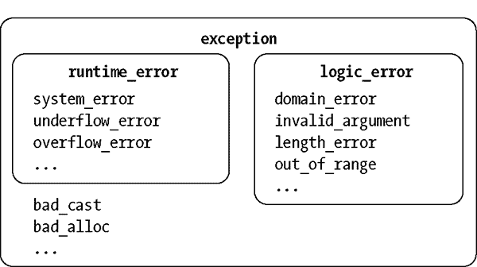
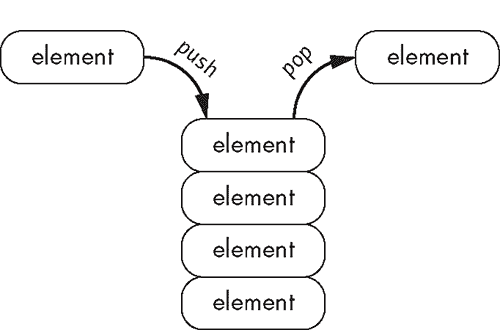
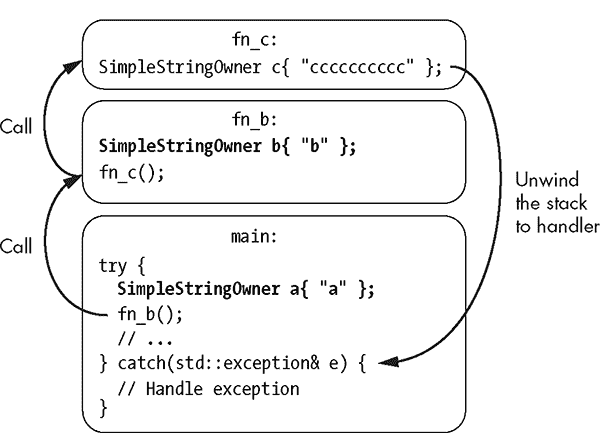
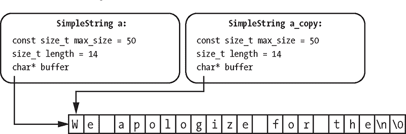
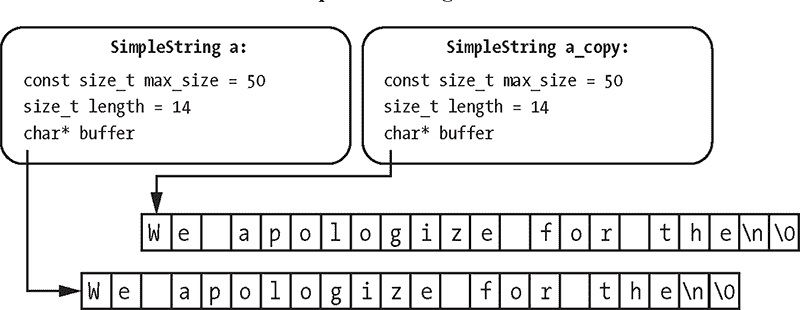
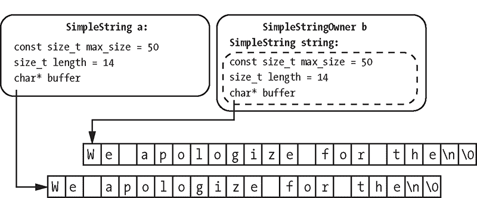
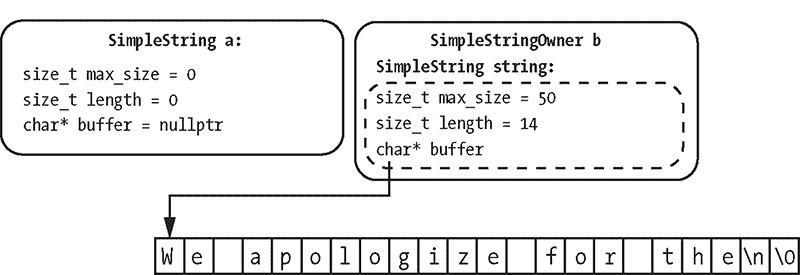
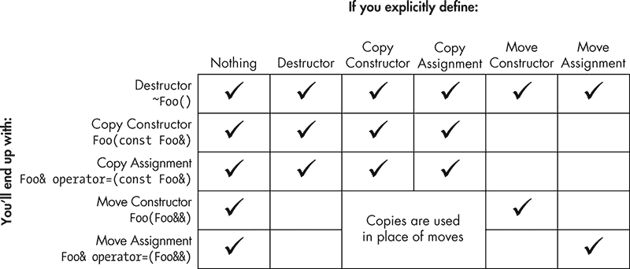

## **4

**对象生命周期**

*你曾经拥有的东西，现在它们拥有你。*

—Chuck Palahniuk, *搏击俱乐部*


对象生命周期是 C++对象在其生命周期中经历的一系列阶段。本章从讨论对象的存储持续时间开始，即为对象分配存储的时间。你将学习对象生命周期如何与异常处理结合，以一种稳健、安全和优雅的方式处理错误和清理工作。章节的最后讨论了移动和拷贝语义，帮助你对对象的生命周期进行细粒度的控制。

### 对象的存储持续时间

*对象*是一个具有类型和值的存储区域。当你声明一个变量时，你就创建了一个对象。变量只是一个有名字的对象。

#### *分配、释放和生命周期*

每个对象都需要存储。你通过*分配*过程为对象保留存储。当你不再使用对象时，你通过*释放*过程释放对象的存储。

对象的*存储持续时间*从对象分配开始，到对象被释放结束。对象的*生命周期*是一个运行时属性，受对象存储持续时间的约束。对象的生命周期从构造函数完成时开始，到析构函数被调用前结束。总的来说，每个对象都会经历以下几个阶段：

1.  对象的存储持续时间开始，存储被分配。

1.  对象的构造函数被调用。

1.  对象的生命周期开始。

1.  你可以在程序中使用该对象。

1.  对象的生命周期结束。

1.  对象的析构函数被调用。

1.  对象的存储持续时间结束，存储被释放。

#### *内存管理*

如果你曾经在应用程序语言中编程过，你很可能使用过*自动内存管理器*或*垃圾回收器*。在运行时，程序会创建对象。垃圾回收器会定期检查哪些对象不再被程序需要，并安全地释放它们。这个方法让程序员不必担心管理对象的生命周期，但它也带来了几个成本，包括运行时性能问题，并且需要一些强大的编程技巧，比如确定性的资源管理。

C++采用了一种更高效的方法。其折衷之处在于，C++程序员必须深入了解存储持续时间。*这*是我们的工作，而不是垃圾回收器的工作，我们需要设计对象的生命周期。

#### *自动存储持续时间*

*自动对象*会在一个代码块开始时分配，并在代码块结束时释放。这个代码块是自动对象的*作用域*。自动对象被认为具有*自动存储持续时间*。请注意，即使函数参数的符号上看起来在函数体外部，函数参数也是自动的。

在清单 4-1 中，函数`power_up_rat_thing`是自动变量`nuclear_isotopes`和`waste_heat`的作用域。

```
void power_up_rat_thing(int nuclear_isotopes) {
  int waste_heat = 0;
  --snip--
}
```

*清单 4-1：一个包含两个自动变量`nuclear_isotopes`和`waste_heat`的函数*

每次调用`power_up_rat_thing`时，`nuclear_isotopes`和`waste_heat`都会被分配。在`power_up_rat_thing`返回之前，这些变量会被释放。

由于你无法在`power_up_rat_thing`之外访问这些变量，自动变量也被称为*局部变量*。

#### *静态存储持续时间*

使用`static`或`extern`关键字声明一个*静态对象*。你在声明函数的同一层次上声明静态变量——在全局作用域（或*命名空间作用域*）中。具有全局作用域的静态对象具有*静态存储持续时间*，它们在程序启动时分配，并在程序停止时释放。

在清单 4-2 中的程序通过调用`power_up_rat_thing`函数来为 Rat Thing 提供能量。当这样做时，Rat Thing 的能量增加，变量`rat_things_power`在每次能量提升之间跟踪能量水平。

```
#include <cstdio>

static int rat_things_power = 200; ➊

void power_up_rat_thing(int nuclear_isotopes) {
  rat_things_power = rat_things_power + nuclear_isotopes; ➋
  const auto waste_heat = rat_things_power * 20; ➌
  if (waste_heat > 10000) { ➍
    printf("Warning! Hot doggie!\n"); ➎
  }
}

int main() {
  printf("Rat-thing power: %d\n", rat_things_power); ➏
  power_up_rat_thing(100); ➐
  printf("Rat-thing power: %d\n", rat_things_power);
  power_up_rat_thing(500);
  printf("Rat-thing power: %d\n", rat_things_power);
}
--------------------------------------------------------------------------
Rat-thing power: 200
Rat-thing power: 300
Warning! Hot doggie! ➑
Rat-thing power: 800
```

*清单 4-2：一个包含静态变量和多个自动变量的程序*

变量`rat_things_power`➊是静态变量，因为它在全局作用域中使用`static`关键字声明。作为在全局作用域中声明的另一个特点是，`rat_things_power`可以从翻译单元中的任何函数访问。（回想一下第一章，翻译单元是预处理器处理单个源文件后产生的内容。）在➋处，你看到`power_up_rat_thing`通过`nuclear_isotopes`的数量增加`rat_things_power`。由于`rat_things_power`是静态变量——因此它的生命周期是程序的生命周期——每次调用`power_up_rat_thing`时，`rat_things_power`的值都会延续到下一次调用。

接下来，你根据新的`rat_things_power`值计算产生的废热，并将结果存储在自动变量`waste_heat`中➌。它的存储持续时间从调用`power_up_rat_thing`开始，到`power_up_rat_thing`返回时结束，因此它的值不会在函数调用之间保存。最后，你检查`waste_heat`是否超过`1000`的阈值➍。如果是，你打印警告信息➎。

在`main`中，你交替打印`rat_things_power`的值➏并调用`power_up_rat_thing`➐。

一旦你将 Rat Thing 的能量从`300`增加到`800`，你将在输出中看到警告信息➑。由于`rat_things_power`具有静态存储持续时间，因此修改`rat_things_power`的效果会持续到程序的生命周期。

当你使用`static`关键字时，你指定了*内部链接*。内部链接意味着一个变量对其他翻译单元不可访问。你也可以指定*外部链接*，使变量对其他翻译单元可访问。对于外部链接，你使用`extern`关键字而不是`static`。

你可以像下面这样修改清单 4-2 以实现外部链接：

```
#include <cstdio>

extern int rat_things_power = 200; // External linkage
--snip--
```

使用`extern`而不是`static`，你可以从其他翻译单元访问`rat_things_power`。

##### 局部静态变量

*局部静态变量*是一种特殊的静态变量，它是局部的——而不是全局的——变量。局部静态变量在函数作用域内声明，就像自动变量一样。但它们的生命周期从包含函数第一次调用开始，直到程序退出时结束。

例如，你可以将清单 4-2 重构，使`rat_things_power`成为一个局部静态变量，如清单 4-3 所示。

```
#include <cstdio>

void power_up_rat_thing(int nuclear_isotopes) {
  static int rat_things_power = 200;
  rat_things_power = rat_things_power + nuclear_isotopes;
  const auto waste_heat = rat_things_power * 20;
  if (waste_heat > 10000) {
    printf("Warning! Hot doggie!\n");
  }
  printf("Rat-thing power: %d\n", rat_things_power);
}
int main() {
  power_up_rat_thing(100);
  power_up_rat_thing(500);
}
```

*清单 4-3：使用局部静态变量重构清单 4-2。*

与清单 4-2 不同，由于`rat_things_power`的局部作用域，你不能从`power_up_rat_thing`函数外部引用它。这是一个被称为*封装*的编程模式的例子，封装是将数据与操作该数据的函数捆绑在一起。它有助于防止意外修改。

##### 静态成员

*静态成员*是类的成员，不与类的特定实例关联。正常的类成员生命周期嵌套在类的生命周期内，但静态成员具有静态存储持续时间。

这些成员本质上与在全局作用域声明的静态变量和函数类似；然而，你必须使用包含类的名称来引用它们，使用作用域解析运算符`::`。事实上，你必须在全局作用域初始化静态成员。你不能在包含类定义内初始化静态成员。

**注意**

*静态成员初始化规则有一个例外：你可以在类定义中声明并定义整型类型，只要它们也是`const`。*

像其他静态变量一样，静态成员只有一个实例。所有包含静态成员的类实例共享相同的成员，因此如果你修改了静态成员，*所有*类实例都会看到这个修改。为了说明这一点，你可以将清单 4-2 中的`power_up_rat_thing`和`rat_things_power`转换为`RatThing`类的静态成员，如清单 4-4 所示。

```
#include <cstdio>

struct RatThing {
  static int rat_things_power; ➊
  static➋ void power_up_rat_thing(int nuclear_isotopes) {
    rat_things_power➌ = rat_things_power + nuclear_isotopes;
    const auto waste_heat = rat_things_power * 20;
    if (waste_heat > 10000) {
      printf("Warning! Hot doggie!\n");
    }
    printf("Rat-thing power: %d\n", rat_things_power);
  }
};

int RatThing::rat_things_power = 200; ➍

int main() {
 RatThing::power_up_rat_thing(100); ➎
  RatThing::power_up_rat_thing(500);
}
```

*清单 4-4：使用静态成员重构清单 4-2*

`RatThing`类包含作为静态成员变量的`rat_things_power` ➊ 和作为静态方法的`power_up_rat_thing` ➋。由于`rat_things_power`是`RatThing`的成员，你无需使用作用域解析符号 ➌；你可以像访问其他成员一样访问它。

你可以看到作用域解析符号的作用，在这里`rat_things_power`被初始化 ➍，并在这里调用了静态方法`power_up_rat_thing` ➎。

#### *线程局部存储持续时间*

并发程序中的一个基本概念是*线程*。每个程序有一个或多个线程，可以执行独立的操作。线程执行的指令序列称为它的*执行线程*。

程序员在使用多个执行线程时必须格外小心。多个线程可以安全执行的代码称为*线程安全代码*。可变的全局变量是许多线程安全问题的根源。有时，你可以通过为每个线程提供自己的一份变量副本来避免这些问题。你可以通过指定对象具有*线程存储持续时间*来实现这一点。

你可以通过在`static`或`extern`关键字前添加`thread_local`关键字，将任何具有静态存储持续时间的变量修改为线程局部存储持续时间。如果仅指定`thread_local`，则默认使用`static`。变量的连接性保持不变。

Listing 4-3 不是线程安全的。根据读写的顺序，`rat_things_power`可能会被破坏。你可以通过将`rat_things_power`指定为`thread_local`，使 Listing 4-3 变得线程安全，如下所示：

```
#include <cstdio>

void power_up_rat_thing(int nuclear_isotopes) {
  static thread_local int rat_things_power = 200; ➊
  --snip--
}
```

现在，每个线程都会代表它自己的鼠标物体（Rat Thing）；如果一个线程修改了它的`rat_things_power`，该修改不会影响其他线程。每个`rat_things_power`的副本初始化为 200 ➊。

**注意**

*并发编程在第十九章中有更详细的讨论。线程存储持续时间在此处列出，以补充完整。*

#### *动态存储持续时间*

具有*动态存储持续时间*的对象会根据请求进行分配和解除分配。你可以手动控制*动态对象*的生命周期何时开始，何时结束。由于这个原因，动态对象也被称为*分配对象*。

分配动态对象的主要方式是使用*new 表达式*。new 表达式以`new`关键字开始，后面跟着所需的动态对象类型。new 表达式创建给定类型的对象，并返回指向新创建对象的指针。

考虑以下示例，其中你创建了一个具有动态存储持续时间的`int`类型，并将其保存在一个名为`my_int_ptr`的指针中：

```
int*➊ my_int_ptr = new➋ int➌;
```

你声明了一个指向`int`的指针，并用右侧等号的 new 表达式的结果对其进行初始化 ➊。new 表达式由`new`关键字 ➋ 和所需类型`int` ➌ 组成。当 new 表达式执行时，C++运行时分配内存来存储一个`int`，然后返回其指针。

你也可以在新表达式中初始化一个动态对象，如下所示：

```
int* my_int_ptr = new int{ 42 }; // Initializes dynamic object to 42
```

在为 `int` 分配存储空间后，动态对象将像往常一样初始化。初始化完成后，动态对象的生命周期开始。

你通过 *删除表达式* 来释放动态对象，该表达式由 `delete` 关键字和指向动态对象的指针组成。删除表达式始终返回 `void`。

要释放由 `my_int_ptr` 指向的对象，可以使用以下删除表达式：

```
delete my_int_ptr;
```

删除对象所在内存的值是未定义的，这意味着编译器可以生成留下任何内容的代码。实际上，主要编译器会尽可能高效，因此通常对象的内存会保持不变，直到程序为其他用途重新使用它。你需要实现一个自定义析构函数，例如将一些敏感内容清零。

**注意**

*由于编译器通常不会在删除对象后清理内存，可能会发生一种微妙且潜在严重的错误，称为 *释放后使用*。如果你删除了一个对象并意外地重新使用它，程序可能看起来正常工作，因为释放的内存可能仍然包含合理的值。在某些情况下，问题直到程序投入生产很长时间后才会显现出来，或者直到安全研究人员找到漏洞的利用方式并公开披露！*

##### 动态数组

*动态数组* 是具有动态存储持续时间的数组。你可以通过 *数组新表达式* 来创建动态数组。数组新表达式的形式如下：

```
new MyType[n_elements] { init-list }
```

`MyType` 是数组元素的期望类型，`n_elements` 是所需数组的长度，`init-list` 是一个可选的初始化列表，用于初始化数组。数组新表达式返回一个指向新分配数组第一个元素的指针。

在以下示例中，你分配一个长度为 100 的 `int` 数组，并将结果保存到一个名为 `my_int_array_ptr` 的指针中：

```
int* my_int_array_ptr = new int[100➊];
```

元素的数量 ➊ 不需要保持不变：数组的大小可以在运行时确定，这意味着括号中的值 ➊ 可以是一个变量，而不是字面量。

要释放动态数组，使用 *数组删除表达式*。与数组新表达式不同，数组删除表达式不需要指定长度：

```
delete[] my_int_array_ptr
```

像删除表达式一样，数组删除表达式返回 `void`。

##### 内存泄漏

权力伴随着责任，因此你必须确保分配的动态对象也被释放。如果不这样做，会导致 *内存泄漏*，即程序不再需要的内存没有被释放。当内存泄漏发生时，你消耗了一个环境中的资源，且永远无法恢复。这可能会导致性能问题，甚至更严重的后果。

**注意**

*实际上，你程序的操作环境可能会为你清理泄漏的资源。例如，如果你编写的是用户模式代码，现代操作系统将在程序退出时清理资源。然而，如果你编写的是内核代码，这些操作系统则不会清理资源。你只有在计算机重新启动时才会回收它们。*

### 追踪对象生命周期

对象生命周期对新手来说既令人生畏又强大。让我们通过一个例子来澄清它，探索每种存储持续时间。

请参考 清单 4-5 中的 `Tracer` 类，每当一个 `Tracer` 对象被构造或析构时，它都会打印一条消息。你可以使用这个类来调查对象生命周期，因为每个 `Tracer` 清楚地指示了它的生命周期何时开始和结束。

```
#include <cstdio>

struct Tracer {
  Tracer(const char* name➊) : name{ name }➋ {
    printf("%s constructed.\n", name); ➌
  }
  ~Tracer() {
    printf("%s destructed.\n", name); ➍
  }
private:
  const char* const name;
};
```

*清单 4-5：一个 `Tracer` 类，用于宣布构造和析构*

构造函数接受一个参数 ➊ 并将其保存到成员 `name` ➋ 中。然后，它打印包含 `name` 的消息 ➌。析构函数 ➍ 也打印包含 `name` 的消息。

请参考 清单 4-6 中的程序。四个不同的 `Tracer` 对象有不同的存储持续时间。通过查看程序中 `Tracer` 输出的顺序，你可以验证你学到的关于存储持续时间的知识。

```
#include <cstdio>

struct Tracer {
  --snip--
};

static Tracer t1{ "Static variable" }; ➊
thread_local Tracer t2{ "Thread-local variable" }; ➋

int main() {
const auto t2_ptr = &t2;
  printf("A\n"); ➌
  Tracer t3{ "Automatic variable" }; ➍
  printf("B\n");
  const auto* t4 = new Tracer{ "Dynamic variable" }; ➎
  printf("C\n");
}
```

*清单 4-6：一个使用 清单 4-5 中的 `Tracer` 类来说明存储持续时间的程序*

清单 4-6 包含一个具有静态持续时间 ➊、线程局部持续时间 ➋、自动持续时间 ➍ 和动态持续时间 ➎ 的 `Tracer`。在 `main` 中的每一行之间，你会打印字符 `A`、`B` 或 `C` 作为参考 ➌。

运行程序会生成 清单 4-7 中的输出。

```
Static variable constructed.
Thread-local variable constructed.
A ➌
Automatic variable constructed.
B
Dynamic variable constructed.
C
Automatic variable destructed.
Thread-local variable destructed.
Static variable destructed.
```

*清单 4-7：运行 清单 4-6 的示例输出*

在 `main` 的第一行 ➌ 之前，静态和线程局部变量 `t1` 和 `t2` 已经初始化 ➊ ➋。你可以在 清单 4-7 中看到：在打印 `A` 之前，这两个变量已经打印了它们的初始化消息。作为一个自动变量，`t3` 的作用域由封闭的函数 `main` 限制。因此，`t3` 在初始化时构造，紧接着在 `A` 后面。

在 `B` 之后，你会看到与 `t4` 初始化对应的消息 ➎。注意，没有由 `Tracer` 的动态析构函数生成相应的消息。原因是你（故意）泄漏了 `t4` 指向的对象。由于没有 `delete t4` 的命令，析构函数永远不会被调用。

在 `main` 返回之前，`C` 会打印。因为 `t3` 是一个自动变量，其作用域为 `main`，所以在此时它会被销毁，因为 `main` 正在返回。

最后，静态和线程局部变量 `t1` 和 `t2` 在程序退出前被销毁，从而输出了 清单 4-7 中的最后两条消息。

### 异常

*异常*是用来传达错误条件的类型。当错误条件发生时，你*抛出*一个异常。在你抛出异常后，异常处于*处理中*状态。当异常处于处理中时，程序停止正常执行，并搜索一个可以处理该异常的*异常处理器*。在这个过程中，超出作用域的对象将被销毁。

在无法局部处理错误的情况下，比如在构造函数中，你通常会使用异常。异常在这种情况下在管理对象生命周期中发挥着至关重要的作用。

另一种传达错误条件的方式是将错误代码作为函数原型的一部分返回。这两种方法是互补的。在发生可以局部处理的错误，或者在程序正常执行过程中预期会发生的错误时，通常会返回错误代码。

#### *`throw`关键字*

要抛出异常，使用`throw`关键字，后跟一个可抛出的对象。

大多数对象都是可抛出的。但遵循一个好习惯是使用`<stdexcept>`头文件中可用的异常之一，如`std::runtime_error`。`runtime_error`构造函数接受一个以空字符结尾的`const char*`，用于描述错误条件的性质。你可以通过`what`方法来获取这个消息，`what`方法不接受任何参数。

在清单 4-8 中的`Groucho`类，每当你使用参数`0xFACE`调用`forget`方法时，它都会抛出异常。

```
#include <stdexcept>
#include <cstdio>

struct Groucho {
  void forget(int x) {
    if (x == 0xFACE) {
      throw➊ std::runtime_error➋{ "I'd be glad to make an exception." };
    }
    printf("Forgot 0x%x\n", x);
  }
};
```

*清单 4-8：`Groucho`类*

要抛出异常，清单 4-8 使用`throw`关键字 ➊，后跟一个`std::runtime_error`对象 ➋。

#### *使用`try`-`catch`块*

你使用`try`-`catch`块来为一段代码建立异常处理程序。在`try`块内，放置可能抛出异常的代码。在`catch`块内，你指定一个处理程序来处理每种可以处理的异常类型。

清单 4-9 演示了使用`try`-`catch`块来处理`Groucho`对象抛出的异常。

```
#include <stdexcept>
#include <cstdio>

struct Groucho {
  --snip--
};

int main() {
  Groucho groucho;
  try { ➊
    groucho.forget(0xC0DE); ➋
    groucho.forget(0xFACE); ➌
    groucho.forget(0xC0FFEE); ➍
  } catch (const std::runtime_error& e➎) {
    printf("exception caught with message: %s\n", e.what()); ➏
  }
}
```

*清单 4-9：使用`try`-`catch`来处理`Groucho`类的异常*

在`main`中，你构造了一个`Groucho`对象，并建立了一个`try`-`catch`块 ➊。在`try`部分，你调用了`groucho`类的`forget`方法，并传入了几个不同的参数：`0xC0DE` ➋、`0xFACE` ➌和`0xC0FFEE` ➍。在`catch`部分，你通过打印消息到控制台 ➏来处理任何`std::runtime_error`异常 ➎。

当你运行清单 4-9 中的程序时，输出如下：

```
Forgot 0xc0de
exception caught with message: I'd be glad to make an exception.
```

当你用参数`0xC0DE` ➋调用`forget`时，`groucho`打印了`Forgot 0xc0de`并返回。当你用参数`0xFACE` ➌调用`forget`时，`groucho`抛出了异常。这个异常中断了正常的程序执行，因此`forget`再也没有被调用 ➍。相反，正在处理中异常被捕获 ➎，并打印了它的消息 ➏。

**继承的速成课程**

在介绍 std 库异常之前，你需要在一个非常高的层次上理解简单的 C++类继承。类可以有子类，子类继承父类的功能。清单 4-10 中的语法定义了这种关系。

```
struct Superclass {
  int x;
};

struct Subclass : Superclass { ➊
  int y;
  int foo() {
    return x + y; ➋
}
};
```

*清单 4-10：定义超类和子类*

`Superclass`没有什么特别之处。但`Subclass`的声明 ➊ 是特殊的。它使用`: Superclass`语法定义了继承关系。`Subclass`继承了`Superclass`中未标记为私有的成员。你可以看到它的作用，`Subclass`使用字段 x ➋。这个字段属于`Superclass`，但是由于`Subclass`继承自`Superclass`，所以 x 是可以访问的。

异常使用这些继承关系来判断一个处理程序是否捕获某个异常。处理程序将捕获给定类型及其任何子类型的异常。

#### *stdlib 异常类*

你可以使用*继承*将类安排成父子关系。继承对代码如何处理异常有很大影响。std 库提供了一个简洁明了的现有异常类型层次结构，供你使用。对于简单的程序，你应该尝试使用这些类型。为什么要重新发明轮子呢？

##### 标准异常类

std 库在`<stdexcept>`头文件中为你提供了*标准异常类*。当你编程处理异常时，这些应该是你首先参考的内容。所有标准异常类的超类是`std::exception`类。`std::exception`中的所有子类可以分为三组：逻辑错误、运行时错误和语言支持错误。虽然语言支持错误通常与作为程序员的你无关，但你肯定会遇到逻辑错误和运行时错误。图 4-1 总结了它们之间的关系。



*图 4-1：std 库异常如何嵌套在 std::exception 下*

##### 逻辑错误

*逻辑错误*源自`logic_error`类。一般来说，通过更小心的编程，你可以避免这些异常。一个主要的例子是，当一个类的逻辑前置条件未被满足时，例如当类的不变式无法建立时。（回想一下第二章中提到的类不变式，它是类的一个特性，总是为真。）

由于类不变式是由程序员定义的，编译器和运行时环境无法在没有帮助的情况下强制执行它。你可以使用类构造函数检查各种条件，如果无法建立类的不变式，可以抛出异常。如果失败是由于例如传递给构造函数的参数不正确，则抛出`logic_error`是一个合适的选择。

`logic_error`有几个子类，你需要了解它们：

+   `domain_error`报告与有效输入范围相关的错误，特别是在数学函数中。例如，平方根函数只支持非负数（在实数情况下）。如果传递一个负数作为参数，平方根函数可能会抛出`domain_error`异常。

+   `invalid_argument`异常报告一般性的无效参数。

+   `length_error`异常报告某些操作会违反最大大小限制。

+   `out_of_range`异常报告某个值不在预期的范围内。经典的例子是对数据结构进行边界检查的索引。

##### 运行时错误

*运行时错误*派生自`runtime_error`类。这些异常帮助你报告程序范围外的错误条件。类似于`logic_error`，`runtime_error`也有一些子类，你可能会发现它们有用：

+   `system_error`报告操作系统遇到错误。你可以从这种异常中获取很多信息。在`<system_error>`头文件中，有大量的*错误代码*和*错误条件*。当构造一个`system_error`时，关于错误的信息会被打包进去，便于你判断错误的性质。`.code()`方法返回一个类型为`std::errc`的`enum class`，它有大量的值，例如`bad_file_descriptor`、`timed_out`和`permission_denied`。

+   `overflow_error`和`underflow_error`分别报告算术溢出和下溢错误。

其他错误直接继承自`exception`。一个常见的错误是`bad_alloc`异常，它报告`new`操作未能分配所需的动态存储内存。

##### 语言支持错误

你不会直接使用语言支持错误。它们存在的目的是表示某些核心语言特性在运行时失败。

#### *处理异常*

异常处理的规则基于类继承。当异常被抛出时，如果抛出的异常类型与`catch`处理程序的异常类型匹配，或者抛出的异常类型*继承自*`catch`处理程序的异常类型，`catch`块就会处理该异常。

例如，以下处理程序捕获任何继承自`std::exception`的异常，包括`std::logic_error`：

```
try {
  throw std::logic_error{ "It's not about who wrong "
                        "it's not about who right" };
} catch (std::exception& ex) {
  // Handles std::logic_error as it inherits from std::exception
}
```

以下特殊处理程序捕获*任何*异常，不论其类型：

```
try {
  throw 'z'; // Don't do this.
} catch (...) {
  // Handles any exception, even a 'z'
}
```

特殊的处理程序通常作为安全机制，用于记录程序因未能捕获特定类型异常而导致的灾难性失败。

你可以通过将多个`catch`语句链在一起，处理来自同一`try`块的不同类型异常，如下所示：

```
try {
  // Code that might throw an exception
  --snip--
} catch (const std::logic_error& ex) {
  // Log exception and terminate the program; there is a programming error!
  --snip--
} catch (const std::runtime_error& ex) {
  // Do our best to recover gracefully
  --snip--
} catch (const std::exception& ex) {
  // This will handle any exception that derives from std:exception
  // that is not a logic_error or a runtime_error.
  --snip--
} catch (...) {
  // Panic; an unforeseen exception type was thrown
  --snip--
}
```

在程序的入口点中常见这样的代码。

**重新抛出异常**

在`catch`块中，你可以使用 throw 关键字继续查找合适的异常处理程序。这被称为重新抛出异常。有一些不寻常但重要的情况，你可能想在决定如何处理异常之前进一步检查它，如 Listing 4-11 所示。

```
try {
  // Some code that might throw a system_error
  --snip--
} catch(const std::system_error& ex) {
  if(ex.code()!= std::errc::permission_denied){
    // Not a permission denied error
    throw; ➊
  }
  // Recover from a permission denied
  --snip--
}
```

*Listing 4-11：重新抛出错误*

在这个例子中，可能抛出`system_error`的代码被包装在`try-catch`块中。所有的`system_error`都被处理，但除非是`EACCES (权限被拒绝)`错误，否则你会重新抛出异常 ➊。这种方法会带来一些性能损失，且最终的代码通常不必要地复杂。

你可以定义一个新的异常类型，而不是重新抛出异常，并为`EACCES`错误创建一个单独的`catch`处理程序，如 Listing 4-12 所示。

```
try {
  // Throw a PermissionDenied instead
  --snip--
} catch(const PermissionDenied& ex) {
  // Recover from an EACCES error (Permission Denied) ..
  --snip--
}
```

*Listing 4-12：捕获特定异常而非重新抛出*

如果抛出`std::system_error`，`PermissionDenied`处理程序 ➊将不会捕获它。（当然，如果你愿意，仍然可以保留`std::system_error`处理程序来捕获此类异常。）

#### *用户定义的异常*

你可以随时定义自己的异常；通常，这些*用户定义的异常*继承自`std::exception`。std 库中的所有类使用的是从`std::exception`派生的异常类型。这使得你可以使用一个`catch`块捕获所有异常，无论是来自你的代码还是 std 库。

#### *noexcept 关键字*

关键字`noexcept`是另一个与异常相关的术语，你应该了解它。你可以并且应该标记任何不可能抛出异常的函数为`noexcept`，如下所示：

```
bool is_odd(int x) noexcept {
  return 1 == (x % 2);
}
```

被标记为`noexcept`的函数具有严格的契约。当你使用标记为`noexcept`的函数时，你可以放心，它不能抛出异常。作为交换，你必须在标记自己的函数为`noexcept`时格外小心，因为编译器不会为你检查。如果你的代码在标记为`noexcept`的函数中抛出异常，那就非常糟糕。C++运行时将调用`std::terminate`函数，默认情况下会通过`abort`退出程序。你的程序无法恢复：

```
void hari_kari() noexcept {
  throw std::runtime_error{ "Goodbye, cruel world." };
}
```

标记一个函数为`noexcept`可以启用一些依赖于函数无法抛出异常的代码优化。实质上，编译器可以使用移动语义，这可能会更快（更多内容请参见“移动语义”部分，第 122 页）。

**注意**

*查看 Scott Meyers 的《Effective Modern C++》第 14 条，详细讨论`noexcept`。核心思想是，有些移动构造函数和移动赋值操作符可能会抛出异常，例如，如果它们需要分配内存，而系统内存不足。除非移动构造函数或移动赋值操作符另有说明，否则编译器必须假设移动操作可能会导致异常。这会禁用某些优化。*

#### *调用栈与异常*

*调用栈* 是一个运行时结构，存储有关活动函数的信息。当一段代码（*调用者*）调用一个函数（*被调用者*）时，机器通过将信息压入调用栈来跟踪谁调用了谁。这允许程序有许多相互嵌套的函数调用。被调用者随后可以通过调用另一个函数，反过来成为调用者。

##### 栈

栈是一个灵活的数据容器，可以容纳动态数量的元素。所有栈都支持两个基本操作：*压入* 元素到栈顶和 *弹出* 这些元素。它是一个后进先出（LIFO）数据结构，如 *图 4-2* 所示。



*图 4-2：元素被压入和弹出栈的过程*

正如其名字所示，调用栈在功能上类似于同名的数据容器。每次调用一个函数时，关于该函数调用的信息会被安排成一个 *栈帧* 并压入调用栈。由于每次函数调用都会将一个新的栈帧压入栈中，被调用者可以自由地调用其他函数，形成任意深度的调用链。每当一个函数返回时，它的栈帧会从调用栈的顶部弹出，执行控制权将恢复到上一个栈帧所指示的位置。

##### 调用栈与异常处理

运行时会寻找离抛出的异常最近的异常处理程序。如果当前栈帧中有匹配的异常处理程序，它将处理该异常。如果没有找到匹配的处理程序，运行时会展开调用栈，直到找到一个合适的处理程序。任何生命周期结束的对象都会按常规方式销毁。

##### 在析构函数中抛出异常

如果在析构函数中抛出异常，那么你就像在玩链锯。这类异常必须在析构函数内部被捕获。

假设抛出了一个异常，在展开栈的过程中，析构函数在正常清理时抛出了另一个异常。现在你就有了 *两个* 正在发生的异常。C++ 运行时应该如何处理这种情况？

你可以对这个问题有自己的看法，但运行时会调用 `terminate`。考虑 *列表 4-13*，它演示了当你从析构函数抛出异常时可能发生的情况：

```
#include <cstdio>
#include <stdexcept>

struct CyberdyneSeries800 {
  CyberdyneSeries800() {
    printf("I'm a friend of Sarah Connor."); ➊
  }
  ~CyberdyneSeries800() {
    throw std::runtime_error{ "I'll be back." }; ➋
  }
};

int main() {
  try {
    CyberdyneSeries800 t800; ➌
    throw std::runtime_error{ "Come with me if you want to live." }; ➍
  } catch(const std::exception& e) { ➎
    printf("Caught exception: %s\n", e.what()); ➏
  }
}
--------------------------------------------------------------------------
I'm a friend of Sarah Connor. ➊
```

*列表 4-13：一个程序，演示了在析构函数中抛出异常的危险性*

**注意**

*列表 4-13 调用了 `std::terminate`，因此根据你的环境，你可能会看到一个讨厌的弹窗提示。*

首先，你声明了`CyberdyneSeries800`类，它有一个简单的构造函数，打印一条消息➊，还有一个彻底好斗的析构函数，抛出一个未捕获的异常➋。在`main`中，你设置了一个`try`块，其中初始化了一个名为`t800`的`CyberdyneSeries800`对象➌，并抛出了一个`runtime_error`异常➍。在更好的情况下，`catch`块➎会处理这个异常，打印其消息➏，并优雅地退出。因为`t800`是`try`块中的自动变量，它会在查找异常处理程序的正常过程中被析构➒。由于`t800`在其析构函数中抛出了异常➋，你的程序调用了`std::terminate`并突然结束。

一般来说，将析构函数视为`noexcept`。

### 一个 SimpleString 类

通过一个扩展的示例，让我们探索构造函数、析构函数、成员和异常如何协同工作。示例 4-14 中的`SimpleString`类允许你将 C 风格的字符串连接起来，并打印结果。

```
#include <stdexcept>

struct SimpleString {
  SimpleString(size_t max_size) ➊
    : max_size{ max_size }, ➋
      length{} { ➌
    if (max_size == 0) {
      throw std::runtime_error{ "Max size must be at least 1." }; ➍
    }
    buffer = new char[max_size]; ➎
    buffer[0] = 0; ➏
  }

  ~SimpleString() {
    delete[] buffer; ➐
  }
--snip--
private:
  size_t max_size;
  char* buffer;
  size_t length;
};
```

*示例 4-14：`SimpleString`类的构造函数和析构函数*

构造函数➊接受一个`max_size`参数。这个值是你的字符串的最大长度，包括一个空字符终止符。成员初始化器➋将这个长度保存到`max_size`成员变量中。这个值还用于数组 new 表达式来分配一个缓冲区，用于存储你的字符串➎。得到的指针被存储在`buffer`中。你将长度初始化为零➌，并确保至少为一个空字节分配足够的大小➍。由于字符串最初是空的，你将缓冲区的第一个字节赋值为零➏。

**注意**

*因为`max_size`是一个`size_t`，它是无符号的，不能为负数，所以你不需要检查这个虚假的条件。*

`SimpleString`类拥有一个资源——由`buffer`指向的内存——当不再需要时，必须释放。析构函数包含一行代码➐，用于释放`buffer`。因为你已经将`buffer`的分配和释放与`SimpleString`的构造函数和析构函数配对，所以你永远不会泄露存储。

这种模式称为*资源获取即初始化（RAII）*或*构造函数获取，析构函数释放（CADRe）*。

**注意**

*`SimpleString`类仍然有一个隐式定义的拷贝构造函数。尽管它可能永远不会泄露存储，但如果被拷贝，它可能会导致双重释放。你将在“拷贝语义”章节中学习拷贝构造函数，见第 115 页。只需注意，示例 4-14 是一个教学工具，而不是生产级的代码。*

#### *追加和打印*

`SimpleString`类还不太有用。示例 4-15 添加了打印字符串和向字符串末尾追加一行的功能。

```
#include <cstdio>
#include <cstring>
#include <stdexcept>

struct SimpleString {
  --snip--
  void print(const char* tag) const { ➊
    printf("%s: %s", tag, buffer);
  }

  bool append_line(const char* x) { ➋
    const auto x_len = strlen➌(x);
    if (x_len + length + 2 > max_size) return false; ➍
    std::strncpy➎(buffer + length, x, max_size - length);
    length += x_len;
    buffer[length++] = '\n';
    buffer[length] = 0;
    return true;
  }
--snip--
};
```

*示例 4-15：`SimpleString`的`print`和`append_line`方法*

第一个方法`print` ➊打印你的字符串。为方便起见，你可以提供一个`tag`字符串，这样你就能将`print`的调用与结果对应起来。这个方法是`const`的，因为它不需要修改`SimpleString`的状态。

`append_line`方法 ➋接受一个以空字符结尾的字符串`x`，并将其内容——加上一个换行符——追加到`buffer`中。如果`x`成功追加，返回`true`；如果空间不足，则返回`false`。首先，`append_line`必须确定`x`的长度。为此，你使用`<cstring>`头文件中的`strlen`函数 ➌，该函数接受一个以空字符结尾的字符串并返回其长度：

```
size_t strlen(const char* str);
```

你使用`strlen`来计算`x`的长度，并用结果初始化`x_len`。这个结果用于计算将`x`（一个换行符）和一个空字节追加到当前字符串后是否会导致字符串长度超过`max_size` ➍。如果会，`append_line`返回`false`。

如果有足够的空间追加`x`，你需要将它的字节复制到`buffer`中的正确位置。`std::strncpy`函数 ➎（来自`<cstring>`头文件）是完成此工作的一个可能工具。它接受三个参数：`destination`地址、`source`地址和要复制的字符数`num`：

```
char* std::strncpy(char* destination, const char* source, std::size_t num);
```

`strncpy`函数会将最多`num`个字节从`source`复制到`destination`中。复制完成后，它将返回`destination`（你会丢弃这个返回值）。

在将复制到`buffer`中的字节数`x_len`加到`length`后，你通过在`buffer`末尾添加换行符`\n`和空字节来完成操作。你返回`true`以表明已成功将输入`x`作为一行追加到`buffer`末尾。

**警告**

*请非常小心使用`strncpy`。很容易忘记在`source`字符串中添加空字符，或者在`destination`字符串中分配不够的空间。这两种错误都会导致未定义的行为。我们将在本书的第二部分中介绍一个更安全的替代方案。*

#### *使用 SimpleString*

列表 4-16 展示了一个使用`SimpleString`的示例，你可以在其中追加多个字符串并打印中间结果到控制台。

```
#include <cstdio>
#include <cstring>
#include <exception>

struct SimpleString {
  --snip--
}
int main() {
  SimpleString string{ 115 }; ➊
  string.append_line("Starbuck, whaddya hear?");
  string.append_line("Nothin' but the rain."); ➋
  string.print("A") ➌
  string.append_line("Grab your gun and bring the cat in.");
  string.append_line("Aye-aye sir, coming home."); ➍
  string.print("B") ➎
  if (!string.append_line("Galactica!")) { ➏
    printf("String was not big enough to append another message."); ➐
  }
}
```

*列表 4-16：`SimpleString`的方法*

首先，你创建一个`SimpleString`，其`max_length=115` ➊。你使用`append_line`方法两次 ➋将一些数据添加到`string`中，然后打印内容并附上标签`A` ➌。接着你追加更多的文本 ➍并再次打印内容，这次附上标签`B` ➎。当`append_line`判断`SimpleString`已经没有足够的空间 ➏时，它返回`false` ➐。（作为`SimpleString`的用户，检查这种情况是你的责任。）

列表 4-17 包含了运行该程序的输出结果。

```
A: Starbuck, whaddya hear? ➊
Nothin' but the rain.
B: Starbuck, whaddya hear? ➋
Nothin' but the rain.
Grab your gun and bring the cat in.
Aye-aye sir, coming home.
String was not big enough to append another message. ➌
```

*列表 4-17：运行列表 4-16 中的程序输出结果*

如预期的那样，字符串在 `A` ➊ 处包含 `Starbuck, whaddya hear?\nNothin' but the rain.\n`。（回想一下 第二章，`\n` 是换行符。）在附加了 `Grab your gun and bring the cat in.` 和 `Aye-aye sir, coming home.` 后，您会在 `B` ➋ 处得到预期的输出。

当 Listing 4-17 尝试将 `Galactica!` 附加到 `string` 时，`append_line` 返回 `false`，因为 `buffer` 中没有足够的空间。这导致打印出消息 `String was not big enough to append another message` ➌。

#### *组合一个 SimpleString*

考虑在 Listing 4-18 中演示的，当你定义一个包含 `SimpleString` 成员的类时，会发生什么。

```
#include <stdexcept>

struct SimpleStringOwner {
  SimpleStringOwner(const char* x)
    : string{ 10 } { ➊
    if (!string.append_line(x)) {
      throw std::runtime_error{ "Not enough memory!" };
 }
    string.print("Constructed");
  }
  ~SimpleStringOwner() {
    string.print("About to destroy"); ➋
  }
private:
  SimpleString string;
};
```

*Listing 4-18: `SimpleStringOwner` 的实现*

如成员初始化器➊所示，`string` 在 `SimpleStringOwner` 的构造函数执行后完全构造，并且其类的不变式已建立。这说明了对象成员在构造过程中的顺序：*成员在封闭对象的构造函数之前被构造*。这很有道理：如果你不了解成员的不变式，怎么能确立类的不变式呢？

析构函数的工作方式恰好相反。在 `~SimpleStringOwner()` ➋ 中，你需要确保 `string` 的类不变式成立，这样你才能打印其内容。*所有成员在对象的析构函数被调用后才会被析构*。

Listing 4-19 演示了 `SimpleStringOwner` 的使用。

```
--snip--
int main() {
  SimpleStringOwner x{ "x" };
  printf("x is alive\n");
}
--------------------------------------------------------------------------
Constructed: x ➊
x is alive
About to destroy: x ➋
```

*Listing 4-19: 一个包含 `SimpleStringOwner` 的程序*

如预期的那样，`x` 的成员 `string` 被适当地创建，因为 *对象的成员构造函数在对象的构造函数之前被调用*，因此输出消息 `Constructed: x` ➊。作为自动变量，`x` 会在 `main` 返回之前销毁，你会看到 `About to destroy: x` ➋。此时，成员 `string` 仍然有效，因为成员析构函数在封闭对象的析构函数之后被调用。

#### *调用栈展开*

Listing 4-20 演示了异常处理和栈展开是如何协同工作的。你在 `main` 中建立了一个 `try`-`catch` 块，然后进行了一系列的函数调用，其中一个调用导致了异常。

```
--snip--
void fn_c() {
  SimpleStringOwner c{ "cccccccccc" }; ➊
}
void fn_b() {
  SimpleStringOwner b{ "b" };
  fn_c(); ➋
}

int main() {
  try { ➌
    SimpleStringOwner a{ "a" };
    fn_b(); ➍
    SimpleStringOwner d{ "d" }; ➎
  } catch(const std::exception& e) { ➏
    printf("Exception: %s\n", e.what());
  }
}
```

*Listing 4-20: 一个演示如何使用 `SimpleStringOwner` 和调用栈展开的程序*

Listing 4-21 显示了运行 Listing 4-20 程序的结果。

```
Constructed: a
Constructed: b
About to destroy: b
About to destroy: a
Exception: Not enough memory!
```

*Listing 4-21: 运行 Listing 4-20 程序的输出*

你已经设置了一个 `try`-`catch` 块 ➌。第一个 `SimpleStringOwner`，`a`，成功构造并且你看到 `Constructed: a` 被打印到控制台。接着，调用了 `fn_b` ➍。注意，你仍然在 `try`-`catch` 块中，因此任何抛出的 `exception` 都*会*被处理。在 `fn_b` 中，另一个 `SimpleStringOwner`，`b`，成功构造，且 `Constructed: b` 被打印到控制台。接着，又调用了另一个函数 `fn_c` ➋。

让我们暂停一下，看看调用栈的样子，哪些对象仍然存活，异常处理情况如何。你有两个 `SimpleStringOwner` 对象存活且有效：`a` 和 `b`。调用栈的情况是 `main() → fn_b() → fn_c()`，并且你在 `main` 中设置了异常处理器来处理任何异常。图 4-3 总结了这种情况。

在 ➊ 处，你遇到了一个小问题。回想一下，`SimpleStringOwner` 有一个成员 `SimpleString`，它的 `max_size` 始终初始化为 10。当你尝试构造 `c` 时，`SimpleStringOwner` 的构造函数抛出了一个 `exception`，因为你试图附加 `"cccccccccc"`，它的长度是 10，且太大，无法与换行符和空字符一起放入。

现在，异常正在飞行中。栈将会展开，直到找到合适的处理程序，所有由于此展开而超出作用域的对象都会被销毁。处理程序位于栈的最上方 ➏，因此 `fn_c` 和 `fn_b` 会被展开。由于 `SimpleStringOwner b` 是 `fn_b` 中的自动变量，它会被销毁，且你会看到 `About to destroy: b` 被打印到控制台。在 `fn_b` 之后，`try{}` 中的自动变量会被销毁。这包括 `SimpleStringOwner a`，因此你会看到 `About to destroy: a` 被打印到控制台。



*图 4-3: 当 `fn_c` 调用 `SimpleStringOwner c` 的构造函数时的调用栈*

一旦在 `try{}` 块中发生异常，后续语句将不再执行。因此，`d` 永远不会被初始化 ➎，你也不会看到 `d` 的构造函数打印到控制台。在调用栈被展开后，执行会立即转到 `catch` 块。最终，你会将 `Exception: Not enough memory!` 的消息打印到控制台 ➏。

#### *异常与性能*

在你的程序中，你必须处理错误；错误是不可避免的。当你正确使用异常且没有发生错误时，你的代码比手动进行错误检查的代码更快。如果发生错误，异常处理有时可能会更慢，但相较于替代方案，你在程序的健壮性和可维护性上会获得巨大的提升。*《优化 C++》*的作者库尔特·冈瑟罗斯说得好：“使用异常处理会让程序在正常执行时更快，在失败时表现得更好。”当 C++ 程序正常执行时（没有抛出异常），检查异常不会带来运行时开销。只有在抛出异常时，你才会支付额外的开销。

希望你已经认识到异常在惯用 C++ 程序中的核心作用。不幸的是，有时你可能无法使用异常。一个例子是嵌入式开发，那里需要实时保证。在这种情况下，工具（目前）根本不存在。幸运的话，这种情况很快会有所改变，但目前，在大多数嵌入式环境中，你只能在没有异常的情况下工作。另一个例子是一些遗留代码。异常因为它们与 RAII 对象的结合方式而显得非常优雅。当析构函数负责清理资源时，堆栈展开是确保资源不会泄漏的直接有效方式。在遗留代码中，你可能会发现手动资源管理和错误处理，而不是使用 RAII 对象。这使得使用异常非常危险，因为堆栈展开只有在 RAII 对象存在时才是安全的。没有它们，你可能会轻易泄漏资源。

#### *异常的替代方案*

在无法使用异常的情况下，并非一切都失去希望。尽管你需要手动跟踪错误，但仍有一些有用的 C++ 特性可以帮助你稍微减轻负担。首先，你可以通过暴露一些方法来手动强制类的不变性，从而传达是否能够建立类的不变性，示例如下：

```
struct HumptyDumpty {
   HumptyDumpty();
   bool is_together_again();
  --snip--
};
```

在惯用的 C++ 编程中，你可能会在构造函数中直接抛出异常，但在这里，你必须记得在调用代码中检查并将这种情况视为错误条件来处理：

```
bool send_kings_horses_and_men() {
  HumptyDumpty hd{};
  if (hd.is_together_again()) return false;
  // Class invariants of hd are now guaranteed.
  // Humpty Dumpty had a great fall.
  --snip--
  return true;
}
```

第二种补充的应对策略是使用 *结构化绑定声明* 来返回多个值，这是一个语言特性，允许你从函数调用中返回多个值。你可以利用这个特性来返回成功标志和通常的返回值，如 列表 4-22 中所示。

```
struct Result { ➊
  HumptyDumpty hd;
  bool success;
};

Result make_humpty() { ➋
  HumptyDumpty hd{};
  bool is_valid;
  // Check that hd is valid and set is_valid appropriately
  return { hd, is_valid };
}

bool send_kings_horses_and_men() {
  auto [hd, success] = make_humpty(); ➌
  if(!success) return false;
  // Class invariants established
  --snip--
  return true;
}
```

*列表 4-22：展示结构化绑定声明的代码片段*

首先，声明一个包含`HumptyDumpty`和`success`标志的 POD ➊。接下来，定义函数`make_humpty` ➋，该函数构建并验证一个`HumptyDumpty`。此类方法被称为*工厂方法*，因为它们的目的是初始化对象。`make_humpty`函数将该对象和成功标志打包成一个`Result`并返回。调用站点的语法 ➌ 演示了如何将`Result`解包成多个由`auto`类型推导的变量。

**注意**

*你将在“结构绑定”章节中更详细地了解结构绑定，参见第 222 页。*

### 复制语义

*复制语义*是“复制的含义”。在实践中，程序员使用这个术语来表示复制对象的规则：在`x`被*复制到*`y`之后，它们是*等价的*和*独立的*。也就是说，复制后`x == y`为真（等价性），并且修改`x`不会导致`y`的修改（独立性）。

复制是非常常见的，特别是在按值传递对象给函数时，如清单 4-23 所示。

```
#include <cstdio>

int add_one_to(int x) {
  x++; ➊
  return x;
}

int main() {
  auto original = 1;
  auto result = add_one_to(original); ➋
  printf("Original: %d; Result: %d", original, result);
}
--------------------------------------------------------------------------
Original: 1; Result: 2
```

*清单 4-23：一个示例程序，说明按值传递会生成副本*

这里，`add_one_to`按值传递其参数`x`。然后它修改`x`的值 ➊。这个修改与调用者是隔离的 ➋；`original`不受影响，因为`add_one_to`接收到的是副本。

对于用户定义的 POD 类型，情况类似。按值传递导致每个成员值被复制到参数中（*逐成员复制*），如清单 4-24 所示。

```
struct Point {
  int x, y;
};

Point make_transpose(Point p) {
  int tmp = p.x;
  p.x = p.y;
 p.y = tmp;
  return p;
}
```

*清单 4-24：函数`make_transpose`生成 POD 类型`Point`的副本。*

当调用`make_transpose`时，它接收到`Point`的副本`p`，而原始数据不受影响。

对于基本类型和 POD 类型，情况非常简单。复制这些类型是逐成员复制，这意味着每个成员都会被复制到对应的目标位置。这实际上是从一个内存地址到另一个内存地址的按位复制。

完整特性的类则需要更多的思考。完整特性的类的默认复制语义也是逐成员复制，这可能非常危险。再考虑一下`SimpleString`类。如果你允许用户对一个活跃的`SimpleString`类进行逐成员复制，那将是灾难性的。两个`SimpleString`类将指向同一个`buffer`，当这两个副本都向同一个`buffer`中添加内容时，它们将相互覆盖。图 4-4 总结了这种情况。



*图 4-4：`SimpleString`类默认复制语义的示意图*

这个结果很糟糕，但更糟糕的是当`SimpleString`类开始析构时发生的事情。当其中一个`SimpleString`类被析构时，`buffer`会被释放。当剩余的`SimpleString`类尝试写入它的`buffer`时——砰！——你会遇到未定义的行为。最终，剩余的`SimpleString`类将被析构并再次释放`buffer`，从而导致通常所说的*双重释放*。

**注意**

*与它的恶名昭著的表兄“使用后释放”类似，双重释放可能导致微妙且难以诊断的错误，这些错误很少出现。双重释放发生在你两次释放一个对象时。请回想一下，一旦你释放了一个对象，它的存储生命周期就结束了。此时，这块内存处于未定义状态，如果你析构一个已经被析构的对象，你就会遇到未定义的行为。在某些情况下，这可能会导致严重的安全漏洞。*

你可以通过控制拷贝语义来避免这种灾难。你可以指定拷贝构造函数和拷贝赋值运算符，具体内容将在以下章节中介绍。

#### *拷贝构造函数*

有两种方法可以复制一个对象。一种是使用*拷贝构造*，它创建一个副本并将其分配给一个全新的对象。拷贝构造函数与其他构造函数类似：

```
struct SimpleString {
  --snip--
  SimpleString(const SimpleString& other);
};
```

请注意，`other`是`const`。你正在从某个原始的`SimpleString`对象进行拷贝，且没有修改它的理由。你像使用其他构造函数一样使用拷贝构造函数，采用统一初始化语法和大括号初始化器：

```
SimpleString a;
SimpleString a_copy{ a };
```

第二行调用了`SimpleString`的拷贝构造函数，使用`a`生成`a_copy`。

让我们实现`SimpleString`的拷贝构造函数。你需要的是一种被称为*深拷贝*的方法，即将原始`buffer`指向的数据复制到一个新的`buffer`中，如图 4-5 所示。



*图 4-5：`SimpleString`类的深拷贝示意图*

与其拷贝指针`buffer`，不如在自由存储区上进行新的分配，然后复制原始`buffer`指向的所有数据。这将给你两个独立的`SimpleString`类。清单 4-25 实现了`SimpleString`的拷贝构造函数：

```
SimpleString(const SimpleString& other)
  : max_size{ other.max_size }, ➊
    buffer{ new char[other.max_size] }, ➋
    length{ other.length } { ➌
    std::strncpy(buffer, other.buffer, max_size); ➍
}
```

*清单 4-25：`SimpleString`类的拷贝构造函数*

你为`max_size` ➊、`buffer` ➋ 和 `length` ➌ 使用成员初始化器，并传递`other`上的相应字段。你可以使用数组`new` ➋ 来初始化`buffer`，因为你知道`other.max_size`大于 0。拷贝构造函数的主体包含一个语句 ➍，该语句将`other.buffer`指向的内容复制到`buffer`指向的数组中。

清单 4-26 通过使用现有的`SimpleString`来初始化一个`SimpleString`，从而使用了这个拷贝构造函数：

```
--snip--
int main() {
  SimpleString a{ 50 };
  a.append_line("We apologize for the");
  SimpleString a_copy{ a }; ➊
  a.append_line("inconvenience."); ➋
  a_copy.append_line("incontinence."); ➌
  a.print("a");
  a_copy.print("a_copy");
}
--------------------------------------------------------------------------
a: We apologize for the
inconvenience.
a_copy: We apologize for the
incontinence.
```

*清单 4-26：使用`SimpleString`类的拷贝构造函数的程序*

在程序中，`SimpleString a_copy` ➊ 是通过复制构造从 `a` 创建的。它等同于并独立于原始对象。你可以将不同的消息追加到 `a` ➋ 和 `a_copy` ➌ 的末尾，且这些更改是相互独立的。

当将 `SimpleString` 作为值传递到函数中时，会调用复制构造函数，如 列表 4-27 所示。

```
--snip--
void foo(SimpleString x) {
  x.append_line("Change lost.");
}

int main() {
  SimpleString a { 20 };
  foo(a); // Invokes copy constructor
  a.print("Still empty");
}
--------------------------------------------------------------------------
Still empty:
```

*列表 4-27：一个示例程序，说明通过值传递对象时会调用复制构造函数*

**注意**

*你不应该通过值传递以避免修改。使用 `const` 引用。*

复制的性能影响可能很大，特别是在涉及到自由存储区分配和缓冲区复制的情况下。例如，假设你有一个管理 gigabyte 数据生命周期的类。每次复制对象时，都需要分配并复制一 gigabyte 的数据。这可能需要很长时间，所以你应该确保确实需要进行复制。如果可以通过传递 `const` 引用来避免复制，强烈建议这么做。

#### *复制赋值*

另一种在 C++ 中进行复制的方法是使用 *复制赋值运算符*。你可以创建对象的副本并将其赋值给另一个已存在的对象，如 列表 4-28 所示。

```
--snip--
void dont_do_this() {
  SimpleString a{ 50 };
  a.append_line("We apologize for the");
  SimpleString b{ 50 };
  b.append_line("Last message");
  b = a; ➊
}
```

*列表 4-28：使用默认的复制赋值运算符创建对象的副本并将其赋值给另一个已存在的对象*

**注意**

*列表 4-28 中的代码会导致未定义行为，因为它没有用户定义的复制赋值运算符。*

第 ➊ 行 *复制赋值* 将 `a` 赋值给 `b`。复制赋值与复制构造的主要区别在于，在复制赋值中，`b` 可能已经有一个值。在复制 `a` 之前，必须清理 `b` 的资源。

**警告**

*简单类型的默认复制赋值运算符只是将源对象的成员复制到目标对象。在 `*SimpleString*` 的情况下，这非常危险，原因有二。首先，原始的 `*SimpleString*` 类的缓冲区被重写，而没有释放动态分配的 `*char*` 数组。其次，现在两个 `*SimpleString*` 类拥有相同的缓冲区，这可能导致悬空指针和双重释放。你必须实现一个复制赋值运算符，确保资源的干净交接。*

复制赋值运算符使用 `operator=` 语法，如 列表 4-29 所示。

```
struct SimpleString {
  --snip--
  SimpleString& operator=(const SimpleString& other) {
    if (this == &other) return *this; ➊
    --snip--
    return *this; ➋
  }
}
```

*列表 4-29：一个用户定义的 `SimpleString` 类的复制赋值运算符*

复制赋值运算符返回结果的引用，这个引用总是 `*this` ➋。通常的好做法是检查 `other` 是否引用了 `this` ➊。

你可以按照以下准则为 `SimpleString` 实现复制赋值：释放当前 `buffer` 的资源，然后像复制构造一样复制 `other`，如 列表 4-30 所示。

```
  SimpleString& operator=(const SimpleString& other) {
    if (this == &other) return *this;
    const auto new_buffer = new char[other.max_size]; ➊
    delete[] buffer; ➋
    buffer = new_buffer; ➌
    length = other.length; ➍
    max_size = other.max_size; ➎
    std::strncpy(buffer, other.buffer, max_size); ➏
    return *this;
  }
```

*列表 4-30：`SimpleString` 的复制赋值运算符*

复制赋值操作符首先会分配一个适当大小的`new_buffer` ➊。接着，你清理`buffer` ➋。其余部分与清单 4-25 中的复制构造函数基本相同。你复制`buffer` ➌，`length` ➍和`max_size` ➎，然后将`other.buffer`中的内容复制到你自己的`buffer` ➏。

清单 4-31 演示了`SimpleString`复制赋值如何工作（如清单 4-30 中实现的那样）。

```
--snip--
int main() {
  SimpleString a{ 50 };
  a.append_line("We apologize for the"); ➊
  SimpleString b{ 50 };
  b.append_line("Last message"); ➋
  a.print("a"); ➌
  b.print("b"); ➍
  b = a; ➎
  a.print("a"); ➏
  b.print("b"); ➐
}
--------------------------------------------------------------------------
a: We apologize for the ➌
b: Last message ➍
a: We apologize for the ➏
b: We apologize for the ➐
```

*清单 4-31：一个展示`SimpleString`类复制赋值的程序*

你首先声明两个`SimpleString`类，分别包含不同的消息：字符串`a`包含`We apologize for the` ➊，而`b`包含`Last` `message` ➋。你打印这些字符串以验证它们包含你指定的文本 ➌➍。接下来，你将`b`复制赋值为`a` ➎。此时，`a`和`b`包含相同消息的副本，即`We apologize for the` ➏➐。但——这很重要——这个消息位于两个不同的内存位置。

#### *默认复制*

通常，编译器会为复制构造和复制赋值生成默认实现。默认实现是对每个类成员调用复制构造函数或复制赋值操作符。

任何时候一个类管理资源时，你必须非常小心默认的复制语义；它们很可能是错误的（就像你在`SimpleString`中看到的那样）。最佳实践是明确声明默认的复制赋值和复制构造对这样的类是可接受的，可以使用`default`关键字。比如，`Replicant`类具有默认的复制语义，正如这里展示的那样：

```
struct Replicant {
  Replicant(const Replicant&) = default;
  Replicant& operator=(const Replicant&) = default;
  --snip--
};
```

有些类根本不能或不应该被复制——例如，如果你的类管理一个文件，或者它代表了一个用于并发编程的互斥锁。你可以使用`delete`关键字来抑制编译器生成复制构造函数和复制赋值操作符。例如，`Highlander`类就不能被复制：

```
struct Highlander {
  Highlander(const Highlander&) = delete;
  Highlander& operator=(const Highlander&) = delete;
  --snip--
};
```

任何试图复制`Highlander`的操作都会导致编译错误：

```
--snip--
int main() {
  Highlander a;
  Highlander b{ a }; // Bang! There can be only one.
}
```

我强烈建议你为*任何*拥有资源的类（如打印机、网络连接或文件）显式定义复制赋值操作符和复制构造函数。如果不需要自定义行为，可以使用`default`或`delete`。这将帮助你避免许多棘手且难以调试的错误。

#### *复制指南*

当你实现复制行为时，请考虑以下标准：

**正确性** 你必须确保类的不变性得到维护。`SimpleString`类演示了默认的复制构造函数如何违反不变性。

**独立性** 复制赋值或复制构造后，原始对象和复制品在修改时不应该相互改变对方的状态。如果你只是将一个`SimpleString`的`buffer`复制到另一个，写入一个`buffer`可能会覆盖另一个`buffer`的数据。

**等价性** 原始对象和副本应该是*相同的*。相同性的语义取决于上下文。但通常，对原始对象应用的操作，在副本上应用时应该得到相同的结果。

### 移动语义

在处理大量数据时，复制可能会非常耗时。通常，你只想将资源的*所有权*从一个对象转移到另一个对象。你可以进行复制并销毁原始对象，但这通常效率低下。相反，你可以*移动*。

*移动语义*是移动对复制语义的补充，它要求在将对象`y`*移动到*对象`x`之后，`x`等价于`y`的原始值。移动之后，`y`进入一个特殊状态，称为*移动后*状态。对于移动后的对象，你只能进行两种操作：（重新）赋值或销毁它们。请注意，将对象`y`移动到对象`x`并不只是重新命名：这些是独立的对象，具有独立的存储和可能独立的生命周期。

类似于你指定复制行为的方式，你可以使用*移动构造函数*和*移动赋值运算符*来指定对象的移动方式。

#### *复制可能是浪费的*

假设你想通过以下方式将`SimpleString`移动到`SimpleStringOwner`中：

```
--snip--
void own_a_string() {
  SimpleString a{ 50 };
  a.append_line("We apologize for the");
  a.append_line("inconvenience.");
  SimpleStringOwner b{ a };
  --snip--
}
```

你可以为`SimpleStringOwner`添加一个构造函数，然后像示例 4-32 中演示的那样，复制构造它的`SimpleString`成员。

```
struct SimpleStringOwner {
  SimpleStringOwner(const SimpleString& my_string) : string{ my_string }➊ { }
  --snip--
private:
  SimpleString string; ➋
};
```

*示例 4-32：包含浪费复制的成员初始化的简单方法*

这种方法中隐藏了浪费。你有一个复制构造 ➊，但调用者在构造`string` ➋后，再也不会使用指向的对象。图 4-6 说明了这个问题。



*图 4-6：使用`string`的复制构造函数是浪费的。*

你应该将`SimpleString a`的核心内容移到`SimpleStringOwner`的`string`字段中。图 4-7 展示了你想要实现的目标：`SimpleString Owner b`偷走了`buffer`并将`SimpleString a`置于可销毁状态。



*图 4-7：将`a`的缓冲区交换到`b`中*

移动`a`后，`b`的`SimpleString`等价于`a`的原始状态，而`a`处于可销毁状态。

移动可能是危险的。如果你不小心使用了移动后的`a`，将引发灾难。当`a`被移动后，`SimpleString`的类不变量不再满足。

幸运的是，编译器内置了保护机制：*左值*和*右值*。

#### *值类别*

每个表达式有两个重要特性：它的 *类型* 和 *值类别*。值类别描述了该表达式可以进行哪些操作。得益于 C++ 的演化特性，值类别是复杂的：一个表达式可以是“广义左值”(*glvalue*)、“纯右值”(*prvalue*)、 “过期值”(*xvalue*)、*左值*（一个不是 xvalue 的 glvalue），或者*右值*（一个 prvalue 或 xvalue）。幸运的是，对于初学者来说，你不需要了解大多数值类别的细节。

我们将考虑值类别的一个简化视图。目前，你只需要对左值和右值有一个大致的理解。*左值* 是任何有名字的值，而 *右值* 是任何不是左值的东西。

考虑以下初始化：

```
SimpleString a{ 50 };
SimpleStringOwner b{ a };                   // a is an lvalue
SimpleStringOwner c{ SimpleString{ 50 } };  // SimpleString{ 50 } is an rvalue
```

这些术语的词源是 *右值* 和 *左值*，指的是它们在构造中相对于等号的位置。在语句 `int x = 50;` 中，`x` 位于等号左侧（左值），而 `50` 位于等号右侧（右值）。这些术语并不完全准确，因为你也可以在等号的右侧使用左值（例如在复制赋值中）。

**注意**

*ISO C++ 标准在 [basic] 和 [expr] 中详细说明了值类别。*

#### *左值和右值引用*

你可以通过 *左值引用* 和 *右值引用* 向编译器传达一个函数接受左值或右值。到目前为止，本书中的每个引用参数都是左值引用，这些由单个 `&` 表示。你也可以通过 `&&` 来接受一个右值引用参数。

幸运的是，编译器在判断对象是左值还是右值时表现得非常出色。实际上，你可以定义多个具有相同名称但参数不同的函数，编译器会根据你调用函数时传入的参数自动调用正确的版本。

清单 4-33 包含了两个名为 `ref_type` 的函数，用于辨别调用者传递的是左值还是右值引用。

```
#include <cstdio>
void ref_type(int &x) { ➊
  printf("lvalue reference %d\n", x);
}
void ref_type(int &&x) { ➋
  printf("rvalue reference %d\n", x);
}

int main() {
  auto x = 1;
  ref_type(x); ➌
  ref_type(2); ➍
  ref_type(x + 2); ➎
}
--------------------------------------------------------------------------
lvalue reference 1 ➌
rvalue reference 2 ➍
rvalue reference 3 ➎
```

*清单 4-33：包含左值和右值引用重载函数的程序*

`int &x` 版本 ➊ 接受一个左值引用，而 `int &&x` 版本 ➋ 接受一个右值引用。你调用 `ref_type` 三次。首先，调用左值引用版本，因为 `x` 是一个左值（它有名字） ➌。第二，调用右值引用版本，因为 `2` 是一个没有名字的整数常量 ➍。第三，`x` 加 2 的结果没有绑定到一个名字，因此它是一个右值 ➎。

**注意**

*定义多个具有相同名称但不同参数的函数称为 *函数重载*，这是你将在第九章中详细探讨的内容。*

#### *std::move 函数*

你可以使用来自`<utility>`头文件的`std::move`函数将左值引用转换为右值引用。清单 4-34 更新了清单 4-33，以说明`std::move`函数的使用。

```
#include <utility>
--snip--
int main() {
  auto x = 1;
  ref_type(std::move(x)); ➊
  ref_type(2);
  ref_type(x + 2);
}
--------------------------------------------------------------------------
rvalue reference 1 ➊
rvalue reference 2
rvalue reference 3
```

*清单 4-34：使用`std::move`将`x`转换为右值，更新清单 4-33*

如预期的那样，`std::move`将左值`x`转换为右值➊。你永远不会调用左值`ref_type`重载。

**注意**

*C++委员会本应将`std::move`命名为`std::rvalue`，但我们只能使用现有的名称。`std::move`函数实际上并不移动任何东西——它只是进行类型转换。*

使用`std::move`时要非常小心，因为它移除了保护措施，使你可以与一个已移动的对象交互。你只能对一个已移动的对象执行两种操作：销毁它或重新赋值。

现在应该可以清楚地理解左值和右值语义如何支持移动语义。如果是左值，则移动被抑制；如果是右值，则启用移动。

#### *移动构造*

移动构造函数看起来像复制构造函数，只不过它们接受右值引用而不是左值引用。

请参阅清单 4-35 中的`SimpleString`移动构造函数。

```
SimpleString(SimpleString&& other) noexcept
  : max_size{ other.max_size }, ➊
  buffer(other.buffer),
  length(other.length) {
  other.length = 0; ➋
  other.buffer = nullptr;
  other.max_size = 0;
}
```

*清单 4-35：`SimpleString`的移动构造函数*

因为`other`是右值引用，所以你可以对其进行“自食其力”。在`SimpleString`的情况下，这很容易：将`other`的所有字段复制到`this`➊，然后将`other`的字段清零➋。后一步很重要：它将`other`置于一个已移动的状态。（考虑一下，如果你没有清除`other`的成员，当`other`销毁时会发生什么。）

执行此移动构造函数的成本比执行复制构造函数要*低*得多。

移动构造函数设计为*不*抛出异常，因此你会将其标记为`noexcept`。你的首选应为使用`noexcept`的移动构造函数；通常，编译器无法使用会抛出异常的移动构造函数，而会使用复制构造函数。编译器更喜欢慢而正确的代码，而不是快而不正确的代码。

#### *移动赋值*

你还可以通过`operator=`创建类似于复制赋值的移动赋值运算符。移动赋值运算符采用右值引用，而不是`const`左值引用，通常会标记为`noexcept`。清单 4-36 实现了`SimpleString`的移动赋值运算符。

```
SimpleString& operator=(SimpleString&& other) noexcept { ➊
  if (this == &other) return *this; ➋
  delete[] buffer; ➌
 buffer = other.buffer; ➍
  length = other.length;
  max_size = other.max_size;
  other.buffer = nullptr; ➎
  other.length = 0;
  other.max_size = 0;
  return *this;
}
```

*清单 4-36：`SimpleString`的移动赋值运算符*

你通过右值引用语法和`noexcept`限定符声明移动赋值运算符，就像移动构造函数➊一样。自引用检查➋处理将`SimpleString`移动赋值给自身的情况。在将`this`的字段赋值给`other`的字段之前，你会清理`buffer`➌，并将`other`的字段清零➎。除了自引用检查➋和清理➌之外，移动赋值运算符和移动构造函数在功能上是相同的。

现在`SimpleString`是可移动的，你可以完成`SimpleStringOwner`的`SimpleString`构造函数：

```
SimpleStringOwner(SimpleString&& x) : string{ std::move(x)➊ } { }
```

`x`是一个左值，所以你必须将`std::move x`传入`string`的移动构造函数 ➊。你可能会觉得`std::move`很奇怪，因为`x`是一个右值引用。请记住，左值/右值和左值引用/右值引用是不同的描述符。

考虑一下如果这里不需要`std::move`会怎么样：假设你从`x`移动了内容然后在构造函数内部使用它？这可能会导致难以诊断的错误。记住，除非重新赋值或析构，否则你不能使用已移动的对象。做任何其他操作都会导致未定义的行为。

列表 4-37 展示了`SimpleString`的移动赋值。

```
--snip--
int main() {
  SimpleString a{ 50 };
  a.append_line("We apologize for the"); ➊
  SimpleString b{ 50 };
  b.append_line("Last message"); ➋
  a.print("a"); ➌
  b.print("b"); ➍
  b = std::move(a); ➎
  // a is "moved-from"
  b.print("b"); ➏
}
--------------------------------------------------------------------------
a: We apologize for the ➌
b: Last message ➍
b: We apologize for the ➏
```

*列表 4-37：一个展示`SimpleString`类移动赋值的程序*

如同列表 4-31 中所示，你首先声明两个具有不同消息的`SimpleString`类：字符串`a`包含`We apologize for the` ➊，`b`包含`Last message` ➋。你打印这些字符串以验证它们是否包含你指定的字符串 ➌➍。接下来，你将`b`移赋给`a` ➎。注意，你需要使用`std::move`将`a`强制转换为右值。移赋后，`a`进入已移动状态，你不能在不重新赋值的情况下使用它。现在，`b`拥有了原来属于`a`的消息`We apologize for the` ➏。

#### *最终产品*

现在你有了一个完整实现的`SimpleString`，它支持移动和复制语义。列表 4-38 将这些都汇总在一起供你参考。

```
#include <cstdio>
#include <cstring>
#include <stdexcept>
#include <utility>

struct SimpleString {
  SimpleString(size_t max_size)
    : max_size{ max_size },
    length{} {
    if (max_size == 0) {
      throw std::runtime_error{ "Max size must be at least 1." };
    }
    buffer = new char[max_size];
    buffer[0] = 0;
  }
  ~SimpleString() {
    delete[] buffer;
  }
  SimpleString(const SimpleString& other)
    : max_size{ other.max_size },
    buffer{ new char[other.max_size] },
    length{ other.length } {
    std::strncpy(buffer, other.buffer, max_size);
  }
  SimpleString(SimpleString&& other) noexcept
    : max_size(other.max_size),
    buffer(other.buffer),
    length(other.length) {
    other.length = 0;
    other.buffer = nullptr;
    other.max_size = 0;
  }
  SimpleString& operator=(const SimpleString& other) {
    if (this == &other) return *this;
    const auto new_buffer = new char[other.max_size];
    delete[] buffer;
    buffer = new_buffer;
    length = other.length;
    max_size = other.max_size;
    std::strncpy(buffer, other.buffer, max_size);
 return *this;
  }
  SimpleString& operator=(SimpleString&& other) noexcept {
    if (this == &other) return *this;
    delete[] buffer;
    buffer = other.buffer;
    length = other.length;
    max_size = other.max_size;
    other.buffer = nullptr;
    other.length = 0;
    other.max_size = 0;
    return *this;
  }
  void print(const char* tag) const {
    printf("%s: %s", tag, buffer);
  }
  bool append_line(const char* x) {
    const auto x_len = strlen(x);
    if (x_len + length + 2 > max_size) return false;
    std::strncpy(buffer + length, x, max_size - length);
    length += x_len;
    buffer[length++] = '\n';
    buffer[length] = 0;
    return true;
  }
private:
  size_t max_size;
  char* buffer;
  size_t length;
};
```

*列表 4-38：一个完整的`SimpleString`类，支持复制和移动语义*

#### *编译器生成的方法*

五个方法控制着移动和复制行为：

+   析构函数

+   复制构造函数

+   移动构造函数

+   复制赋值运算符

+   移动赋值运算符

编译器在某些情况下可以为每个方法生成默认实现。不幸的是，哪些方法会被生成的规则是复杂的，而且在不同的编译器中可能不一致。

你可以通过将这些方法设置为`default`/`delete`，或者根据需要实现它们，来消除这种复杂性。这个通用规则被称为*五法则*，因为有五个方法需要指定。明确地指定这些方法虽然花费一些时间，但可以避免未来的许多麻烦。

另一种方式是记住图 4-8，它总结了你实现的五个函数和编译器为你生成的每个函数之间的交互。



*图 4-8：一张图表，展示了在不同输入下编译器生成的方法*

如果你什么都不提供，编译器将会生成所有五个析构/复制/移动函数。这就是*零规则*。

如果你显式地定义了析构函数/复制构造函数/复制赋值操作符，你会得到所有三个。这是危险的，正如之前通过`SimpleString`所演示的那样：很容易陷入编译器实际上将所有的移动操作都转换为复制操作的意外情况。

最后，如果你只为你的类提供移动语义，编译器将不会自动生成任何东西，除了析构函数。

### 总结

你已经完成了对对象生命周期的探索。你的旅程从存储持续时间开始，在那里你看到了从构造到析构的对象生命周期。随后研究异常处理展示了灵活的、生命周期感知的错误处理，并加深了你对 RAII 的理解。最后，你看到了复制和移动语义如何让你对对象生命周期进行细粒度的控制。

**习题**

**4-1.** 创建一个`struct TimerClass`。在它的构造函数中，记录当前时间到一个名为`timestamp`的字段（与 POSIX 函数`gettimeofday`进行比较）。

**4-2.** 在`TimerClass`的析构函数中，记录当前时间并减去构造时的时间。这个时间大致是定时器的*年龄*。打印这个值。

**4-3.** 为`TimerClass`实现一个复制构造函数和复制赋值操作符。复制应共享时间戳值。

**4-4.** 为`TimerClass`实现一个移动构造函数和一个移动赋值操作符。一个被移动的`TimerClass`在析构时不应向控制台打印任何输出。

**4-5.** 扩展`TimerClass`的构造函数，接受一个额外的`const char* name`参数。当`TimerClass`被析构并打印到标准输出时，包含定时器的名称。

**4-6.** 尝试你的`TimerClass`。创建一个定时器并将它传入一个执行一些计算密集型操作的函数中（例如，在循环中进行大量数学运算）。验证你的定时器是否按预期工作。

**4-7.** 找出`SimpleString`类中的每个方法（清单 4-38）。尝试从头开始重新实现它，而不参考书中的内容。

**进一步阅读**

+   *优化的 C++：提升性能的验证技巧*，作者：Kurt Guntheroth（O'Reilly Media，2016）

+   *Effective Modern C++: 提升你使用 C++11 和 C++14 的 42 个具体方法*，作者：Scott Meyers（O'Reilly Media，2015）
