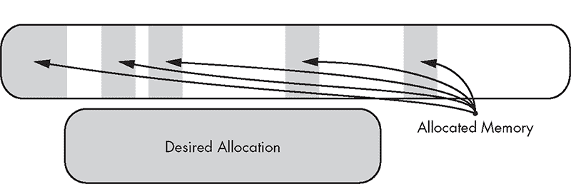

## **7

表达式**

*这就是人类创造性天才的本质：不是文明的建筑物，也不是可以终结一切的闪光武器，而是像精子攻击卵子的过程一样，滋养新概念的语言。*

—Dan Simmons,* 《超越人类》


*表达式*是产生结果和副作用的计算。通常，表达式包含操作数和对其进行操作的运算符。许多运算符被内置在核心语言中，你将在本章中看到大多数运算符。本章开始讨论内置运算符，然后介绍重载运算符`new`、用户定义字面量，并进一步探讨类型转换。当你创建自己的用户定义类型时，通常需要描述这些类型如何转换为其他类型。在学习`constexpr`常量表达式和广泛误解的`volatile`关键字之前，你将探讨这些用户定义的转换。

### **运算符**

运算符，如加法（`+`）和取地址（`&`）运算符，会对称为操作数的参数进行操作，这些操作数可以是数值或对象。在本节中，我们将介绍逻辑运算符、算术运算符、赋值运算符、增量/减量运算符、比较运算符、成员访问运算符、三元条件运算符和逗号运算符。

#### ***逻辑运算符***

C++表达式套件包括完整的逻辑运算符。在这一类别中，有（常规）运算符与（`&&`）、或（`||`）和非（`!`），它们接受可转换为`bool`的操作数并返回`bool`类型的对象。此外，*按位逻辑运算符*适用于像`bool`、`int`和`unsigned long`这样的整数类型。这些运算符包括与（`&`）、或（`|`）、异或（`^`）、取反（`~`）、左移（`<<`）和右移（`>>`）。每个运算符在位级别执行布尔操作，并返回与其操作数匹配的整数类型。

表 7-1 列出了所有这些逻辑运算符，并附有一些示例。

**表 7-1：** 逻辑运算符

| **运算符** | **名称** | **示例表达式** | **结果** |
| --- | --- | --- | --- |
| `x & y` | 按位与 | `0b1100 & 0b1010` | `0b1000` |
| `x &#124; y` | 按位或 | `0b1100 &#124; 0b1010` | `0b1110` |
| `x ^ y` | 按位异或 | `0b1100 ^ 0b1010` | `0b0110` |
| `~x` | 按位取反 | `~0b1010` | `0b0101` |
| `x << y` | 按位左移 | `0b1010 << 2``0b0011 << 4` | `0b101000``0b110000` |
| `x >> y` | 按位右移 | `0b1010 >> 2``0b10110011 >> 4` | `0b10``0b1011` |
| `x && y` | 与 | `true && false``true && true` | `false``true` |
| `x &#124;&#124; y` | 或 | `true &#124;&#124; false``false &#124;&#124; false` | `true``false` |
| `!x` | 非 | `!true``!false` | `false``true` |

#### ***算术运算符***

额外的 Unary 和 Binary *算术运算符* 适用于整数和浮动点类型（也称为 *算术类型*）。在你需要执行数学计算的地方，你会使用内建的算术运算符。它们执行一些最基本的工作元素，无论是递增索引变量还是执行计算密集型的统计模拟。

##### **一元算术运算符**

*一元加* `+` 和 *一元减* `-` 运算符接受一个算术操作数。两个运算符都将其操作数*提升*为 `int`。因此，如果操作数的类型是 `bool`、`char` 或 `short int`，则表达式的结果为 `int`。

一元加除了提升之外没有太多作用；而一元减则会翻转操作数的符号。例如，给定 `char x = 10`，`+x` 会得到一个值为 10 的 `int`，而 `-x` 会得到一个值为-10 的 `int`。

##### **二元算术运算符**

除了两个一元算术运算符外，还有五个*二元*算术运算符：*加法* `+`、*减法* `-`、*乘法* `*`、*除法* `/` 和 *取模* `%`。这些运算符接受两个操作数并执行相应的数学运算。和它们的一元运算符一样，这些二元运算符会对它们的操作数进行整数提升。例如，两个 `char` 操作数相加将得到一个 `int`。同样也有浮动点提升规则：

+   如果一个操作数是 `long double`，则另一个操作数将提升为 `long double`。

+   如果一个操作数是 `double`，则另一个操作数将提升为 `double`。

+   如果一个操作数是 `float`，则另一个操作数将提升为 `float`。

如果没有浮动点提升规则适用，则接下来检查任一操作数是否为带符号。如果是，则两个操作数都变为带符号。最后，和浮动点类型的提升规则一样，较大的操作数的大小将用于提升另一个操作数：

+   如果一个操作数是 `long long`，则另一个操作数将提升为 `long long`。

+   如果一个操作数是 `long`，则另一个操作数将提升为 `long`。

+   如果一个操作数是 `int`，则另一个操作数将提升为 `int`。

尽管这些规则并不太复杂以至于难以记忆，但我建议通过依赖 `auto` 类型推导来检查你的工作。只需将表达式的结果赋值给一个 `auto` 声明的变量，并检查推导出的类型。

不要混淆类型转换和提升。类型转换是当你有一个某种类型的对象，并需要将其转换为另一种类型时。而提升则是一组规则，用于解释字面值。例如，如果你有一个 2 字节的 `short` 类型的平台，并对一个值为 40000 的 `unsigned short` 进行了有符号转换，结果会是整数溢出和未定义行为。这与对字面量 40000 进行提升规则处理完全不同。如果它需要带符号，则字面量的类型是带符号的 `int`，因为带符号的 `short` 不能容纳这么大的值。

**注意**

*你可以使用你的 IDE，甚至是 RTTI 的`*typeid*`来打印类型到控制台。*

表格 7-2 总结了算术运算符。

**表格 7-2：** 算术运算符

| **运算符** | **名称** | **示例** | **结果** |
| --- | --- | --- | --- |
| `+x` | 一元加法 | `+10` | `10` |
| `-x` | 一元减法 | `-10` | `-10` |
| `x + y` | 二进制加法 | `1 + 2` | `3` |
| `x - y` | 二进制减法 | `1 - 2` | `-1` |
| `x * y` | 二进制乘法 | `10 * 20` | `200` |
| `x / y` | 二进制除法 | `300 / 15` | `20` |
| `x % y` | 二进制模运算 | `42 % 5` | `2` |

在表格 7-1 和表格 7-2 中，许多二进制运算符也有相应的*赋值运算符*。

#### ***赋值运算符***

赋值运算符执行指定的操作，然后将结果赋值给第一个操作数。例如，*加法赋值* `x += y` 计算值 `x + y` 并将 `x` 赋值为结果。你也可以使用表达式 `x = x + y` 达到类似的效果，但*赋值运算符*语法更简洁，且至少在运行时效率更高。表格 7-3 总结了所有可用的赋值运算符。

**表格 7-3：** 赋值运算符

| **运算符** | **名称** | **示例** | **结果（x 的值）** |
| --- | --- | --- | --- |
| `x = y` | 简单赋值 | `x = 10` | `10` |
| `x += y` | 加法赋值 | `x += 10` | `15` |
| `x -= y` | 减法赋值 | `x -= 10` | `-5` |
| `x *= y` | 乘法赋值 | `x *= 10` | `50` |
| `x /= y` | 除法赋值 | `x /= 2` | `2` |
| `x %= y` | 模运算赋值 | `x %= 2` | `1` |
| `x &= y` | 位运算*与*赋值 | `x &= 0b1100` | `0b0100` |
| `x &#124;= y` | 位运算*或*赋值 | `x &#124;= 0b1100` | `0b1101` |
| `x ^= y` | 位运算*异或*赋值 | `x ^= 0b1100` | `0b1001` |
| `x <<= y` | 位运算*左移*赋值 | `x <<= 2` | `0b10100` |
| `x >>= y` | 位运算*右移*赋值 | `x >>= 2` | `0b0001` |

**注意**

*在使用赋值运算符时，提升规则并不适用；被赋值操作数的类型不会改变。例如，给定 `int x = 5`，在 `x /= 2.0f` 之后，`x` 的类型仍然是 `int`。*

#### ***增量和减量运算符***

在表格 7-4 中列出了四个（一元）*增量*/*减量*运算符。

**表格 7-4：** 增量和减量运算符（给定 `x=5` 的值）

| 运算符 | 名称 | 计算后 x 的值 | 表达式的结果 |
| --- | --- | --- | --- |
| `++x` | 前缀增量 | `6` | `6` |
| `x++` | 后缀增量 | `6` | `5` |
| `--x` | 前缀减量 | `4` | `4` |
| `x--` | 后缀减量 | `4` | `5` |

如 表 7-4 所示，自增运算符将操作数的值增加 1，而自减运算符则减少 1。运算符返回的值取决于它是前缀还是后缀运算符。前缀运算符将在修改后返回操作数的值，而后缀运算符则会在修改前返回操作数的值。

#### ***比较运算符***

六个比较运算符比较给定的操作数并计算为 `bool`，如 表 7-5 所述。对于算术操作数，与算术运算符相同的类型转换（提升）会发生。比较运算符也适用于指针，并且它们的工作方式大致符合你的预期。

**注意**

*指针比较有一些细微差别。有兴趣的读者可以参阅 [expr.rel].*

**表 7-5：** 比较运算符

| **运算符** | **名称** | **示例（均评估为真）** |
| --- | --- | --- |
| `x == y` | 等于运算符 | `100 == 100` |
| `x != y` | 不等于运算符 | `100 != 101` |
| `x < y` | 小于运算符 | `10 < 20` |
| `x > y` | 大于运算符 | `-10 > -20` |
| `x <= y` | 小于或等于运算符 | `10 <= 10` |
| `x >= y` | 大于或等于运算符 | `20 >= 10` |

#### ***成员访问运算符***

你使用 *成员访问运算符* 与指针、数组及你将在 第二部分 中遇到的许多类进行交互。六个这样的运算符包括 *下标* `[]`、*间接* `*`、*取地址* `&`、*对象成员* `.` 和 *指针成员* `->`。你在 第三章 中已经遇到过这些运算符，但本节提供了简要总结。

**注意**

*也有* 指向对象成员的指针。*和* 指向指针成员的指针 ->* *运算符，但这些并不常见。请参阅 [expr.mptr.oper]*。

下标运算符 `x[y]` 提供对由 `x` 指向的数组的第 `y` 个元素的访问，而间接运算符 `*x` 提供对 `x` 指向的元素的访问。你可以使用取地址运算符 `&x` 创建一个指向元素 `x` 的指针。这本质上是间接运算符的反操作。对于有成员 `y` 的元素 `x`，你使用对象成员运算符 `x.y`。你也可以访问指向对象的成员；给定一个指针 `x`，你使用指针成员运算符 `x->y` 访问 `x` 指向的对象。

#### ***三元条件运算符***

*三元条件运算符* `x ? y : z` 是一种语法糖，接受三个操作数（因此是“三元”）。它将第一个操作数 `x` 作为布尔表达式进行求值，并根据布尔值是否为 `true` 或 `false`（分别）返回第二个操作数 `y` 或第三个操作数 `z`。考虑以下返回 1 的步进函数，当参数 `input` 为正时；否则返回零：

```
int step(int input) {
  return input > 0 ? 1 : 0;
}
```

使用等效的 if-then 语句，你也可以以下列方式实现 `step`：

```
int step(int input) {
  if (input > 0) {
    return 1;
  } else {
    return 0;
  }
}
```

这两种方法在运行时是等效的，但三元条件运算符需要的输入较少，通常会产生更简洁的代码。请大胆使用它。

**注意**

*条件三元运算符有一个更时髦的名字：* Elvis 运算符。*如果你将书顺时针旋转 90 度并眯起眼睛，你会明白为什么：`?:`*

#### ***逗号运算符***

*逗号运算符*，另一方面，通常不会促进更简洁的代码。它允许在一个更大的表达式内，多个由逗号分隔的表达式进行求值。这些表达式从左到右求值，最右边的表达式是返回值，正如清单 7-1 所示。

```
#include <cstdio>

int confusing(int &x) {
  return x = 9, x++, x / 2;
}

int main() {
  int x{}; ➊
  auto y = confusing(x); ➋
  printf("x: %d\ny: %d", x, y);
}
--------------------------------------------------------------------------
x: 10
y: 5
```

*清单 7-1：一个使用逗号运算符的令人困惑的函数*

在调用`confusing`后，`x`等于`10` ➊，`y`等于`5` ➋。

**注意**

*这是 C 语言在大学时代更加狂野、没有拘束的结构遗留物，逗号运算符允许一种特定类型的面向表达式的编程。避免使用逗号运算符；它的使用非常罕见，且容易引起混乱。*

#### ***运算符重载***

对于每种基本类型，本节中涵盖的某些运算符将可用。对于用户定义的类型，你可以通过使用*运算符重载*来指定这些运算符的自定义行为。要为用户定义的类指定运算符的行为，只需将方法命名为`operator`后面紧跟运算符；确保返回类型和参数与要处理的操作数类型匹配。

清单 7-2 定义了一个`CheckedInteger`。

```
#include <stdexcept>

struct CheckedInteger {
  CheckedInteger(unsigned int value) : value{ value } ➊ { }

  CheckedInteger operator+(unsigned int other) const { ➋
    CheckedInteger result{ value + other }; ➌
    if (result.value < value) throw std::runtime_error{ "Overflow!" }; ➍
    return result;
  }

  const unsigned int value; ➎
};
```

*清单 7-2：一个`CheckedInteger`类，它在运行时检测溢出*

在这个类中，你定义了一个构造函数，它接受一个`unsigned int`。这个参数被用来➊初始化公共字段`value` ➎。因为`value`是`const`，`CheckedInteger`是*不可变的*——构造后，不能修改`CheckedInteger`的状态。这里感兴趣的方法是`operator+` ➋，它允许你将一个普通的`unsigned int`加到`CheckedInteger`上，从而生成一个具有正确`value`的新`CheckedInteger`。`operator+`的返回值在➌构造。每当加法导致`unsigned int`溢出时，结果将小于原始值。你在➍检查这个条件。如果检测到溢出，就会抛出异常。

第六章描述了`type_traits`，它允许你在编译时确定类型的特征。一个相关的类型支持家族可以在`<limits>`头文件中找到，它允许你查询算术类型的各种属性。

在 `<limits>` 中，模板类 `numeric_limits` 提供了多个成员常量，用于获取模板参数的相关信息。其中一个例子是 `max()` 方法，它返回给定类型的最大有限值。你可以使用这个方法来测试 `CheckedInteger` 类。列表 7-3 展示了 `CheckedInteger` 的行为。

```
#include <limits>
#include <cstdio>
#include <stdexcept>

struct CheckedInteger {
  --snip--
};

int main() {
  CheckedInteger a{ 100 }; ➊
  auto b = a + 200; ➋
  printf("a + 200 = %u\n", b.value);
  try {
    auto c = a + std::numeric_limits<unsigned int>::max(); ➌
  } catch(const std::overflow_error& e) {
    printf("(a + max) Exception: %s\n", e.what());
  }
}
--------------------------------------------------------------------------
a + 200 = 300
(a + max) Exception: Overflow!
```

*列表 7-3：一个演示 `CheckedInteger` 使用的程序*

在构造 `CheckedInteger` ➊ 后，你可以将其与 `unsigned int` ➋ 相加。由于结果值 300 可以确保适合 `unsigned int`，此语句会在不抛出异常的情况下执行。接下来，你将相同的 `CheckedInteger a` 加到 `unsigned int` 的最大值上（通过 `numeric_limits`） ➌。这会导致溢出，`operator+` 的重载会检测到这一点，并抛出 `overflow_error` 异常。

#### ***重载 Operator new***

请回顾 第四章，你可以使用 `new` 运算符来分配具有动态存储持续时间的对象。默认情况下，`new` 运算符会在自由存储上分配内存，以为你的动态对象腾出空间。*自由存储*，也叫 *堆*，是一个由实现定义的存储位置。在桌面操作系统中，内核通常管理自由存储（例如，Windows 上的 `HeapAlloc` 和 Linux/macOS 上的 `malloc`），且通常非常庞大。

##### **自由存储可用性**

在某些环境中，比如 Windows 内核或嵌入式系统，默认情况下没有自由存储可用。在其他场景中，例如游戏开发或高频交易，自由存储分配的延迟太大，因为你将其管理交给了操作系统。

你可以尝试完全避免使用自由存储，但这样会带来严重限制。其中一个主要的限制是无法使用标准库容器，阅读 第二部分 后，你会同意这是一个巨大的损失。与其接受这些严格限制，不如重载自由存储操作，掌控内存分配。你可以通过重载 `new` 运算符来实现这一点。

##### **<new> 头文件**

在支持自由存储操作的环境中，`<new>` 头文件包含以下四个运算符：

+   `void* operator new(size_t);`

+   `void operator delete(void*);`

+   `void* operator new[](size_t);`

+   `void operator delete[](void*);`

请注意，`new` 运算符的返回类型是 `void*`。自由存储运算符处理的是原始、未初始化的内存。

你可以提供这四个运算符的自定义版本。你只需要在程序中定义一次，编译器将使用你的版本而不是默认版本。

自由存储管理是一个令人惊讶的复杂任务。一个主要问题是 *内存碎片化*。随着时间的推移，大量的内存分配和释放可能会导致自由存储区域中散布着许多空闲的内存块。这可能导致某些情况，虽然有大量的空闲内存，但它们分散在已经分配的内存区域中。当这种情况发生时，大的内存请求会失败，尽管从技术上讲，空闲内存足够提供给请求者。图 7-1 展示了这种情况。所需的内存分配有足够的内存，但可用内存是非连续的。



*图 7-1：内存碎片化问题*

##### **桶**

一种方法是将分配的内存划分为所谓的 *桶*，每个桶的大小是固定的。当你请求内存时，环境会分配整个桶，即使你没有请求全部的内存。例如，Windows 提供了两个函数来分配动态内存：`VirtualAllocEx` 和 `HeapAlloc`。

`VirtualAllocEx` 函数是低级的，它允许你提供许多选项，例如将内存分配到哪个进程、首选的内存地址、请求的大小以及权限，比如内存是否应该是可读、可写和可执行的。该函数永远不会分配少于 4096 字节（一个所谓的 *页*）。

另一方面，`HeapAlloc` 是一个较高级的函数，当可以时，它分配少于一页的内存；否则，它会代表你调用 `VirtualAllocEx`。至少在 Visual Studio 编译器中，`new` 默认会调用 `HeapAlloc`。

这种安排通过对内存分配进行桶大小的四舍五入来避免内存碎片化，但需要一些附加开销。像 Windows 这样的现代操作系统将有相当复杂的内存分配方案，支持不同大小的内存分配。除非你想要控制，否则你不会看到这些复杂性。

##### **控制自由存储**

清单 7-4 演示了如何实现非常简单的 `Bucket` 和 `Heap` 类。这些类将帮助控制动态内存分配：

```
#include <cstddef>
#include <new>

struct Bucket { ➊
  const static size_t data_size{ 4096 };
  std::byte data[data_size];
};

struct Heap {
  void* allocate(size_t bytes) { ➋
    if (bytes > Bucket::data_size) throw std::bad_alloc{};
    for (size_t i{}; i < n_heap_buckets; i++) {
      if (!bucket_used[i]) {
        bucket_used[i] = true;
        return buckets[i].data;
 }
    }
    throw std::bad_alloc{};
  }

  void free(void* p) { ➌
    for (size_t i{}; i < n_heap_buckets; i++) {
      if (buckets[i].data == p) {
        bucket_used[i] = false;
        return;
      }
    }
  }
  static const size_t n_heap_buckets{ 10 };
  Bucket buckets[n_heap_buckets]{}; ➍
  bool bucket_used[n_heap_buckets]{}; ➎
};
```

*清单 7-4：`Heap` 和 `Bucket` 类*

`Bucket` 类 ➊ 负责占用内存空间。作为对 Windows 堆管理器的致敬，桶的大小被硬编码为 4096。所有的管理逻辑都集中在 `Heap` 类中。

`Heap` 中有两个重要的成员：`buckets` ➍ 和 `bucket_used` ➎。`buckets` 成员存放所有的 `Buckets`，这些 `Buckets` 被紧凑地打包成一个连续的字符串。`bucket_used` 成员是一个相对较小的数组，包含 `bool` 类型的对象，用来跟踪 `buckets` 中同一索引的 `Bucket` 是否已经被借出。两个成员都初始化为零。

`Heap` 类有两个方法：`allocate` ➋ 和 `free` ➌。`allocate` 方法首先检查请求的字节数是否大于桶的大小。如果是，它会抛出一个 `std::bad_alloc` 异常。一旦大小检查通过，`Heap` 会遍历 `buckets`，寻找一个在 `bucket_used` 中没有标记为 `true` 的桶。如果找到了，它会返回与该 `Bucket` 关联的 `data` 成员指针。如果找不到未使用的 `Bucket`，它会抛出一个 `std::bad_alloc` 异常。`free` 方法接受一个 `void*` 并遍历所有的 `buckets`，寻找匹配的 `data` 成员指针。如果找到了，它会将对应桶的 `bucket_used` 设置为 `false` 并返回。

##### **使用我们的堆**

分配一个 `Heap` 的一种方式是将其声明为命名空间作用域内的对象，这样它就具有静态存储持续时间。因为它的生命周期从程序启动时就开始，所以你可以在 `operator new` 和 `operator delete` 重载中使用它，正如 示例 7-5 中所示。

```
Heap heap; ➊

void* operator new(size_t n_bytes) {
  return heap.allocate(n_bytes); ➋
}
void operator delete(void* p) {
  return heap.free(p); ➌
}
```

*示例 7-5：重载 `new` 和 `delete` 运算符以使用 示例 7-4 中的 `Heap` 类*

示例 7-5 声明了一个 `Heap` ➊ 并在 `new` 运算符重载 ➋ 和 `delete` 运算符重载 ➌ 中使用它。现在，如果你使用 `new` 和 `delete`，动态内存管理将使用 `heap`，而不是环境提供的默认自由存储。示例 7-6 测试了重载的动态内存管理。

```
#include <cstdio>
--snip--
int main() {
  printf("Buckets:   %p\n", heap.buckets); ➊
  auto breakfast = new unsigned int{ 0xC0FFEE };
  auto dinner = new unsigned int { 0xDEADBEEF };
  printf("Breakfast: %p 0x%x\n", breakfast, *breakfast); ➋
  printf("Dinner:    %p 0x%x\n", dinner, *dinner); ➌
  delete breakfast;
  delete dinner;
  try {
    while (true) {
      new char;
      printf("Allocated a char.\n"); ➍
    }
  } catch (const std::bad_alloc&) {
    printf("std::bad_alloc caught.\n"); ➎
  }
}
--------------------------------------------------------------------------
Buckets:   00007FF792EE3320 ➊
Breakfast: 00007FF792EE3320 0xc0ffee ➋
Dinner:    00007FF792EE4320 0xdeadbeef ➌
Allocated a char. ➍
Allocated a char.
Allocated a char.
Allocated a char.
Allocated a char.
Allocated a char.
Allocated a char.
Allocated a char.
Allocated a char.
Allocated a char.
std::bad_alloc caught. ➎
```

*示例 7-6：演示使用 `Heap` 管理动态分配的程序*

你已经打印出了 `heap` 中第一个 `buckets` 元素的内存地址 ➊。这是借给第一个 `new` 调用的内存位置。通过打印 `breakfast` ➋ 的内存地址和指向的值，你验证了这一点。注意，内存地址与 `heap` 中第一个 `Bucket` 的内存地址相同。你对 `dinner` ➌ 指向的内存做了同样的操作。注意，内存地址比 `breakfast` 的内存地址大正好 `0x1000`。这与 `Bucket` 的 4096 字节大小完全一致，正如 `const static` 成员 `Bucket::data_size` 中定义的那样。

在打印了 ➋➌ 后，你删除了 `breakfast` 和 `dinner`。然后，你不加节制地分配 `char` 对象，直到 `heap` 内存用尽并抛出 `std::bad_alloc` 异常为止。每次分配时，你都会打印出 `Allocated` 一个 `char`，从 ➍ 开始。你会看到，在出现 `std::bad_alloc` 异常 ➎ 之前，总共有 10 行。注意，这正好是你在 `Heap::n_heap_buckets` 中设置的 `buckets` 数量。这意味着，每分配一个 `char`，你就占用了 4096 字节的内存！

##### **定位运算符**

有时，你不想覆盖*所有*的自由存储分配。在这种情况下，你可以使用定位运算符，它们对预分配的内存执行适当的初始化：

+   `void* operator new(size_t, void*);`

+   `void operator delete(size_t, void*);`

+   `void* operator new[](void*, void*);`

+   `void operator delete[](void*, void*);`

使用放置运算符，你可以手动在任意内存中构造对象。这具有一个优势，即可以手动操作对象的生命周期。然而，你不能使用`delete`来释放由此生成的动态对象。你必须直接调用对象的析构函数（并且只能调用一次！），如示例 7-7 所示。

```
#include <cstdio>
#include <cstddef>
#include <new>

struct Point {
  Point() : x{}, y{}, z{} {
    printf("Point at %p constructed.\n", this); ➊
  }
  ~Point() {
    printf("Point at %p destructed.\n", this); ➋
  }
  double x, y, z;
};

int main() {
  const auto point_size = sizeof(Point);
  std::byte data[3 * point_size];
  printf("Data starts at %p.\n", data); ➌
  auto point1 = new(&data[0 * point_size]) Point{}; ➍
  auto point2 = new(&data[1 * point_size]) Point{}; ➎
  auto point3 = new(&data[2 * point_size]) Point{}; ➏
  point1->~Point(); ➐
 point2->~Point(); ➑
  point3->~Point(); ➒
}
--------------------------------------------------------------------------
Data starts at 0000004D290FF8E8\. ➌
Point at 0000004D290FF8E8 constructed. ➍
Point at 0000004D290FF900 constructed. ➎
Point at 0000004D290FF918 constructed. ➏
Point at 0000004D290FF8E8 destructed. ➐
Point at 0000004D290FF900 destructed. ➑
Point at 0000004D290FF918 destructed. ➒
```

*示例 7-7：使用放置`new`初始化动态对象*

构造函数 ➊ 打印一条消息，指示在特定地址构造了一个`Point`，析构函数 ➋ 打印一条消息，指示该`Point`正在被销毁。你已经打印了`data`的地址，这是放置`new`初始化`Point`的第一个地址 ➌。

请注意，每个`new`运算符都在你的`data`数组所占用的内存中分配了`Point` ➍➎➏。你必须单独调用每个析构函数 ➐➑➒。

#### ***运算符优先级和结合性***

当表达式中出现多个运算符时，*运算符优先级*和*运算符结合性*决定了如何解析表达式。优先级高的运算符会比优先级低的运算符与其操作数绑定得更紧密。如果两个运算符具有相同的优先级，它们的结合性将决定如何绑定操作数。结合性可以是*从左到右*或*从右到左*。

表 7-6 包含了所有 C++运算符，按其优先级排序并附有结合性注释。每一行包含一个或多个具有相同优先级的运算符，并附有描述和其结合性。越高的行优先级越高。

**表 7-6：** 运算符优先级和结合性

| **运算符** | **描述** | **结合性** |
| --- | --- | --- |
| `a::b` | 范围解析 | 从左到右 |
| `a++` | 后缀递增 | 从左到右 |
| `a--` | 后缀递减 |  |
| `fn()` | 函数调用 |  |
| `a[b]` | 下标 |  |
| `a->b` | 指针的成员 |  |
| `a.b` | 对象的成员 |  |
| `Type(a)` | 函数式类型转换 |  |
| `Type{ a }` | 函数式类型转换 |  |
| `++a` | 前缀递增 | 从右到左 |
| `--a` | 前缀递减 |  |
| `+a` | 一元加 |  |
| `-a` | 一元减 |  |
| `!a` | 逻辑非 |  |
| `~a` | 按位取反 |  |
| `(Type)a` | C 风格转换 |  |
| `*a` | 解引用 |  |
| `&a` | 地址 |  |
| `sizeof(Type)` | 类型大小 |  |
| `new Type` | 动态分配 |  |
| `new Type[]` | 动态分配（数组） |  |
| `delete a` | 动态释放 |  |
| `delete[] a` | 动态释放（数组） |  |
| `.*``->*` | 指向成员的指针 指向对象的指针 | 从左到右 |
| `a * b``a / b``a % b` | 乘法 除法 取余 | 从左到右 |
| `a + b``a - b` | 加法 减法 | 从左到右 |
| `a << b``a >> b` | 按位左移 按位右移 | 从左到右 |
| `a < b` | 小于 | 从左到右 |
| `a > b` | 大于 |  |
| `a <= b` | 小于或等于 |  |
| `a >= b` | 大于或等于 |  |
| `a == b``a != b` | 等于不等于 | 从左到右 |
| `a & b` | 位运算与 | 从左到右 |
| `a ^ b` | 位运算异或 | 从左到右 |
| `a &#124; b` | 位运算或 | 从左到右 |
| `a && b` | 逻辑与 | 从左到右 |
| `a &#124;&#124; b` | 逻辑或 | 从左到右 |
| `a ? b : c` | 三元运算 | 从右到左 |
| `throw a` | 抛出 |  |
| `a = b` | 赋值 |  |
| `a += b` | 和赋值 |  |
| `a -= b` | 差赋值 |  |
| `a *= b` | 积赋值 |  |
| `a /= b` | 商赋值 |  |
| `a %= b` | 余数赋值 |  |
| `a <<= b` | 位运算左移赋值 |  |
| `a >>= b` | 位运算右移赋值 |  |
| `a &= b` | 位运算与赋值 |  |
| `a ^= b` | 位运算异或赋值 |  |
| `a &#124;= b` | 位运算或赋值 |  |
| `a, b` | 逗号 | 从左到右 |

**注意**

*你还没有遇到作用域解析运算符（它首次出现在第八章），但表 7-6 包括了它以保持完整性。*

因为 C++有很多运算符，所以运算符的优先级和结合性规则可能很难追踪。为了读者的心理健康，尽量使表达式尽可能清晰。

请考虑以下表达式：

```
*a++ + b * c
```

由于后缀加法运算的优先级高于解引用运算符`*`，它首先绑定到参数`a`，这意味着`a++`的结果是解引用运算符的参数。乘法`*`的优先级高于加法`+`，所以乘法运算符`*`绑定到`b`和`c`，加法运算符`+`绑定到`*a++`和`b * c`的结果。

你可以通过添加括号来强制表达式中的优先级，因为括号的优先级高于任何运算符。例如，你可以使用括号重写前面的表达式：

```
(*(a++)) + (b * c)
```

通常来说，在哪里可能让读者对运算符的优先级产生困惑，就在哪儿加上括号。如果结果看起来有点复杂（像这个例子一样），那么你的表达式可能太复杂了；你可以考虑将其拆分成多个语句。

#### ***计算顺序***

计算顺序决定了表达式中运算符的执行顺序。一个常见的误解是，优先级和计算顺序是等同的：它们不是。*优先级*是一个编译时概念，决定了运算符如何与操作数绑定。*计算顺序*是一个运行时概念，决定了运算符执行的调度顺序。

*通常，C++对操作数的执行顺序没有明确规定。* 虽然运算符按照前述部分中清晰定义的方式与操作数绑定，但这些操作数的计算顺序是不确定的。编译器可以以任何它喜欢的方式来安排操作数的计算顺序。

你可能会误以为下面表达式中的括号决定了`stop`、`drop`和`roll`函数的执行顺序，或者某种从左到右的结合性有运行时效果：

```
(stop() + drop()) + roll()
```

它们不会。`roll`函数可能会在`stop`和`drop`的执行之前、之后或之间执行。如果你需要操作按特定顺序执行，只需将它们放入按所需顺序排列的单独语句中，如下所示：

```
auto result = stop();
result = result + drop();
result = result + roll();
```

如果不小心，甚至可能会导致未定义行为。考虑以下表达式：

```
b = ++a + a;
```

因为表达式`++a`和`a`的执行顺序没有指定，并且`++a + a`的值取决于哪个表达式先计算，所以`b`的值无法很好地定义。

在一些特殊情况下，执行顺序是由语言指定的。最常遇到的情况如下：

+   内置逻辑与运算符`a && b`和内置逻辑或运算符`a || b`保证`a`在`b`之前执行。

+   三元运算符`a ? b : c`保证`a`在`b`和`c`之前执行。

+   逗号运算符`a, b`保证`a`在`b`之前执行。

+   在`new`表达式中，构造函数的参数会在调用分配器函数之前执行。

你可能会想知道，为什么 C++不强制执行顺序，比如从左到右，以避免混淆。答案很简单：通过不任意限制执行顺序，语言允许编译器开发者发现巧妙的优化机会。

**注意**

*有关执行顺序的更多信息，请参见[expr]。*

### **用户定义字面量**

第二章讲解了如何声明字面量，这是你在程序中直接使用的常量值。它们帮助编译器将嵌入的值转换为所需的类型。每种基本类型都有自己的字面量语法。例如，`char`字面量用单引号声明，如`'J'`，而`wchar_t`则用`L`前缀声明，如`L'J'`。你可以使用`F`或`L`后缀来指定浮点数的精度。

为了方便，你还可以创建自己的*用户定义字面量*。与内置字面量一样，用户定义字面量为编译器提供了类型信息的语法支持。虽然你几乎不需要声明用户定义字面量，但值得一提的是，你可能会在库中看到它们。标准库`<chrono>`头文件广泛使用字面量，提供给程序员一种简洁的时间类型语法——例如，`700ms`表示 700 毫秒。由于用户定义字面量相对较少，我不会在这里深入讨论它们。

**注意**

*进一步参考，请参阅 Bjarne Stroustrup 的《C++编程语言》第 4 版第 19.2.6 节。*

### **类型转换**

当你拥有一种类型但希望将其转换为另一种类型时，你会执行类型转换。根据情况，类型转换可以是显式的或隐式的。本节将讨论这两种类型的转换，并涵盖提升、浮点到整数的转换、整数到整数的转换以及浮点到浮点的转换。

类型转换是相当常见的。例如，给定一个计数和总和，你可能需要计算一些整数的平均值。由于计数和总和是存储在整型变量中的（而且你不想截断小数部分），你会希望将平均值计算为浮点数。为此，你需要使用类型转换。

#### ***隐式类型转换***

隐式类型转换可以发生在任何需要特定类型但你提供了不同类型的地方。这些转换发生在几种不同的上下文中。

“二进制算术运算符”在第 183 页中概述了所谓的*提升规则*。实际上，这些规则是一种隐式转换。每当发生算术操作时，较短的整型会被提升为`int`类型。在算术操作中，整型也可以被提升为浮点型。所有这些操作都发生在后台。结果是，在大多数情况下，类型系统会自动让路，让你专注于编程逻辑。

不幸的是，在某些情况下，C++在默默地进行类型转换时有些过于激进。考虑从`double`转换为`uint_8`的隐式转换：

```
#include <cstdint>

int main() {
  auto x = 2.7182818284590452353602874713527L;
  uint8_t y = x; // Silent truncation
}
```

你应该希望编译器在这里生成警告，但从技术上讲，这在 C++中是有效的。因为这种转换会丢失信息，所以它是一个窄化转换，使用大括号初始化`{}`可以防止这种转换：

```
#include <cstdint>

int main() {
 auto x = 2.7182818284590452353602874713527L;
  uint8_t y{ x }; // Bang!
}
```

回想一下，大括号初始化不允许窄化转换。从技术上讲，大括号初始化器是一种显式转换，因此我将在第 201 页的《显式类型转换》中讨论这一点。

##### **浮点到整数的转换**

浮点类型和整型可以在算术表达式中和平共存。原因是隐式类型转换：当编译器遇到混合类型时，它会执行必要的提升，以确保算术操作按预期进行。

##### **整数到整数的转换**

整数可以转换为其他整数类型。如果目标类型是`signed`，那么只要值可以表示，一切正常。如果不能表示，行为由实现定义。如果目标类型是`unsigned`，结果是能容纳在该类型中的位数。换句话说，高位会丢失。

考虑示例 7-8，它演示了如何因符号转换导致未定义行为。

```
#include <cstdint>
#include <cstdio>

int main() {
  // 0b111111111 = 511
  uint8_t x = 0b111111111; ➊// 255
  int8_t y =  0b111111111; ➋// Implementation defined.
  printf("x: %u\ny: %d", x, y);
}
--------------------------------------------------------------------------
x: 255 ➊
y: -1 ➋
```

*示例 7-8：由符号转换引起的未定义行为*

列表 7-8 会隐式地将一个过大无法放入 8 位整数中的整数（511，或者 9 个 1）转换为 `x` 和 `y`，其中 `x` 和 `y` 分别是 `unsigned` 和 `signed`。`x` 的值保证为 255 ➊，而 `y` 的值则依赖于实现。在 Windows 10 x64 机器上，`y` 等于 `-1` ➋。对 `x` 和 `y` 的赋值都涉及到可能会被花括号初始化语法避免的窄化转换。

##### **浮动点到浮动点的转换**

浮动点数可以隐式地转换为其他浮动点数，反之亦然。只要目标值能够容纳源值，一切正常。当无法容纳时，会发生未定义行为。同样，花括号初始化可以防止潜在的危险转换。考虑列表 7-9 中的例子，它展示了因窄化转换导致的未定义行为。

```
#include <limits>
#include <cstdio>

int main() {
  double x = std::numeric_limits<float>::max(); ➊
  long double y = std::numeric_limits<double>::max(); ➋
  float z = std::numeric_limits<long double>::max(); ➌  // Undefined Behavior
  printf("x: %g\ny: %Lg\nz: %g", x, y, z);
}
--------------------------------------------------------------------------
x: 3.40282e+38
y: 1.79769e+308
z: inf
```

*列表 7-9：窄化转换导致的未定义行为*

你可以安全地进行从 `float` 到 `double` ➊ 和从 `double` 到 `long double` ➋ 的隐式转换。不幸的是，将一个 `long double` 的最大值赋给 `float` 会导致未定义行为 ➌。

##### **转换为 `bool`**

指针、整数和浮动点数都可以隐式地转换为 `bool` 对象。如果值非零，隐式转换的结果为 `true`。否则，结果为 `false`。例如，值 `int{ 1 }` 转换为 `true`，而 `int{}` 转换为 `false`。

##### **指向 `void` 的指针***

指针总是可以隐式地转换为 `void*`，如列表 7-10 所示。

```
#include <cstdio>

void print_addr(void* x) {
  printf("0x%p\n", x);
}

int main() {
  int x{};
  print_addr(&x); ➊
  print_addr(nullptr); ➋
}
--------------------------------------------------------------------------
0x000000F79DCFFB74 ➊
0x0000000000000000 ➋
```

*列表 7-10：指针隐式转换为 `void*`。输出来自 Windows 10 x64 机器。*

列表 7-10 由于指针隐式转换为 `void*`，因此能够编译通过。`print_addr` 函数打印 `x` 的地址 ➊ 和 `nullptr`、`0` 的值 ➋。

#### ***显式类型转换***

显式类型转换也称为 *强制类型转换*。进行显式类型转换的首选方法是带花括号的初始化 `{}`。这种方法的主要优点是完全类型安全且无窄化。使用花括号初始化确保在编译时仅允许安全、行为良好且无窄化的转换。列表 7-11 显示了一个例子。

```
#include <cstdio>
#include <cstdint>

int main() {
  int32_t a = 100;
  int64_t b{ a }; ➊
  if (a == b) printf("Non-narrowing conversion!\n"); ➋
  //int32_t c{ b }; // Bang! ➌
}
--------------------------------------------------------------------------
Non-narrowing conversion! ➋
```

*列表 7-11：4 字节和 8 字节整数的显式类型转换*

这个简单的例子使用了带花括号的初始化 ➊ 来从 `int32_t` 构建一个 `int64_t`。这是一个行为良好的转换，因为可以确保没有丢失任何信息。你总是可以将 32 位数据存储在 64 位中。经过基本类型的行为良好的转换后，原值总是等于结果（根据 `operator==`）。

这个例子尝试进行一个行为不良（缩小）的转换 ➌。编译器会生成错误。如果你没有使用大括号初始化器`{}`，编译器不会报错，如列表 7-12 所示。

```
#include <limits>
#include <cstdio>
#include <cstdint>

int main() {
  int64_t b = std::numeric_limits<int64_t>::max();
  int32_t c(b); ➊ // The compiler abides.
  if (c != b) printf("Narrowing conversion!\n"); ➋
}
--------------------------------------------------------------------------
Narrowing conversion! ➋
```

*列表 7-12：重构后的列表 7-11，没有使用大括号初始化器。*

你将一个 64 位整数转换为 32 位整数 ➊。由于这种转换是缩小的，表达式`c != b`的结果为`true` ➋。这种行为非常危险，这也是第二章建议尽可能使用大括号初始化器的原因。

#### ***C 风格强制转换***

回想一下第六章，命名转换函数允许你执行大括号初始化器不允许的危险类型转换。你也可以进行 C 风格的强制转换，但这主要是为了保持不同语言之间的一些兼容性。它们的用法如下：

```
(desired-type)object-to-cast
```

对于每一个 C 风格强制转换，都存在某种`static_casts、const_casts`和`reinterpret_casts`的组合，可以实现所需的类型转换。C 风格强制转换比命名的强制转换要危险得多（这已经是说得很严重了）。

C++显式类型转换的语法故意丑陋且冗长。这是为了突出代码中的一个点，即类型系统的严格规则在这里被弯曲或打破。C 风格的强制转换没有做到这一点。此外，从强制转换中并不清楚程序员打算进行什么样的转换。当你使用命名的转换函数时，编译器至少可以强制执行*一些*约束。例如，当使用 C 风格强制转换时，如果你只打算进行`reinterpret_cast`，就很容易忘记`const`正确性。

假设你想在一个函数内部将`const char*`数组当作无符号数处理。编写类似于列表 7-13 中演示的代码是非常简单的。

```
#include <cstdio>

void trainwreck(const char* read_only) {
  auto as_unsigned = (unsigned char*)read_only;
  *as_unsigned = 'b'; ➊ // Crashes on Windows 10 x64
}

int main() {
  auto ezra = "Ezra";
  printf("Before trainwreck: %s\n", ezra);
  trainwreck(ezra);
  printf("After trainwreck: %s\n", ezra);
}
--------------------------------------------------------------------------
Before trainwreck: Ezra
```

*列表 7-13：一个 C 风格强制转换的灾难，意外去除了`const`限定符（`read_only`）。 (该程序的行为未定义；输出来自 Windows 10 x64 机器。)*

现代操作系统强制执行内存访问模式。列表 7-13 尝试写入存储字符串文字`Ezra`的内存 ➊。在 Windows 10 x64 上，这会导致程序崩溃并发生内存访问冲突（因为该内存是只读的）。

如果你使用`reinterpret_cast`尝试这样做，编译器会生成错误，正如列表 7-14 所演示的那样。

```
#include <cstdio>

void trainwreck(const char* read_only) {
  auto as_unsigned = reinterpret_cast<unsigned char*>(read_only); ➊
  *as_unsigned = 'b'; // Crashes on Windows 10 x64
}

int main() {
  auto ezra = "Ezra";
  printf("Before trainwreck: %s\n", ezra);
  trainwreck(ezra);
  printf("After trainwreck: %s\n", ezra);
}
```

*列表 7-14：重构后的列表 7-13，使用了`reinterpret_cast`。 (此代码无法编译。)*

如果你真的打算放弃`const`正确性，你需要在这里加上`const_cast` ➊。代码会自我记录这些意图，并使这些故意的规则突破易于发现。

#### ***用户定义的类型转换***

在用户自定义类型中，你可以提供用户自定义的转换函数。这些函数告诉编译器在隐式和显式类型转换过程中，你的用户自定义类型是如何行为的。你可以使用以下模式声明这些转换函数：

```
struct MyType {
  operator destination-type() const {
    // return a destination-type from here.
  --snip--
  }
}
```

例如，Listing 7-15 中的`struct`可以像只读的`int`一样使用。

```
struct ReadOnlyInt {
  ReadOnlyInt(int val) : val{ val } { }
  operator int() const { ➊
    return val;
  }
private:
  const int val;
};
```

*Listing 7-15: 一个包含用户自定义类型转换到`int`的`ReadOnlyInt`类*

操作符`int`方法在➊定义了用户自定义的类型转换*从* `ReadOnlyInt` *到* `int`。现在，得益于隐式转换，你可以像使用常规的`int`类型一样使用`ReadOnlyInt`类型：

```
struct ReadOnlyInt {
  --snip--
};
int main() {
  ReadOnlyInt the_answer{ 42 };
  auto ten_answers = the_answer * 10; // int with value 420
}
```

有时，隐式转换可能会导致意外的行为。你应该始终尽量使用显式转换，特别是对于用户自定义类型。你可以通过`explicit`关键字实现显式转换。显式构造函数指示编译器不要将构造函数视为隐式转换的手段。你可以为你的用户自定义转换函数提供相同的指导原则：

```
struct ReadOnlyInt {
  ReadOnlyInt(int val) : val{ val } { }
  explicit operator int() const {
    return val;
  }
private:
  const int val;
};
```

现在，你必须使用`static_cast`显式地将`ReadOnlyInt`转换为`int`：

```
struct ReadOnlyInt {
  --snip--
};
int main() {
  ReadOnlyInt the_answer{ 42 };
  auto ten_answers = static_cast<int>(the_answer) * 10;
}
```

通常，这种方法倾向于促使代码更少歧义。

### **常量表达式**

常量表达式是可以在编译时求值的表达式。出于性能和安全的考虑，每当计算可以在编译时而非运行时完成时，你应该这么做。涉及字面量的简单数学运算是可以在编译时求值的表达式的一个显著例子。

你可以通过使用`constexpr`表达式来扩展编译器的能力。每当计算表达式所需的所有信息在编译时就已经具备时，如果该表达式标记为`constexpr`，编译器就*必须这样做*。这种简单的承诺可以对代码的可读性和运行时性能产生意想不到的巨大影响。

`const`和`constexpr`密切相关。`constexpr`强制要求一个表达式可以在编译时求值，而`const`则强制要求一个变量在某个作用域内（运行时）不能更改。所有的`constexpr`表达式都是`const`，因为它们在运行时始终是固定的。

所有的`constexpr`表达式都以一个或多个基础类型（`int, float, wchar_t`等）开始。你可以通过使用运算符和`constexpr`函数在这些类型之上进行扩展。常量表达式主要用于替代代码中手动计算的值。这通常会产生更强健、易于理解的代码，因为你可以消除所谓的*魔法值*——直接粘贴到源代码中的手动计算常量。

#### ***一个多彩的例子***

考虑以下例子，其中你为项目使用的某个库使用了通过色相-饱和度-明度（HSV）表示法编码的`Color`对象：

```
struct Color {
  float H, S, V;
};
```

大致来说，色相（hue）对应一系列颜色，如红色、绿色或橙色。饱和度（saturation）对应颜色的鲜艳程度或强度。明度（value）对应颜色的亮度。

假设你想使用红绿蓝（RGB）表示法实例化`Color`对象。你可以使用转换器手动计算 RGB 到 HSV 的转换，但这是一个典型例子，你可以使用`constexpr`来消除魔法值。在你编写转换函数之前，你需要一些工具函数，即`min`、`max`和`modulo`。清单 7-16 实现了这些函数。

```
#include <cstdint>
constexpr uint8_t max(uint8_t a, uint8_t b) { ➊
  return a > b ? a : b;
}
constexpr uint8_t max(uint8_t a, uint8_t b, uint8_t c) { ➋
  return max(max(a, b), max(a, c));
}
constexpr uint8_t min(uint8_t a, uint8_t b) { ➌
  return a < b ? a : b;
}
constexpr uint8_t min(uint8_t a, uint8_t b, uint8_t c) { ➍
  return min(min(a, b), min(a, c));
}
constexpr float modulo(float dividend, float divisor) { ➎
  const auto quotient = dividend / divisor; ➏
  return divisor * (quotient - static_cast<uint8_t>(quotient));
}
```

*清单 7-16：多个用于操作`uint8_t`对象的`constexpr`函数*

每个函数都标记为`constexpr`，这告诉编译器该函数必须在编译时进行求值。`max`函数 ➊ 使用三元操作符返回最大的参数值。`max`的三参数版本 ➋ 使用比较的传递性；通过分别对`a, b`和`a, c`使用二参数`max`，你可以找到这个中间结果的最大值，从而得到总体最大值。由于二参数版本的`max`是`constexpr`，这一做法完全合法。

**注意**

*你不能使用`<math.h>`头文件中的`fmax`，原因相同：它不是`constexpr`。*

`min`版本 ➌ ➍ 完全遵循相同的逻辑，唯一的修改是比较顺序被翻转了。`modulo`函数 ➎ 是一个快速简便的`constexpr`版本的 C 函数`fmod`，用于计算第一个参数（`被除数`）除以第二个参数（`除数`）后的浮点余数。由于`fmod`*不是*`constexpr`，你需要自己手动实现。首先，你获得商 ➏。接着，通过`static_cast`和减法得到商的整数部分。将商的小数部分与`除数`相乘，得到结果。

拥有一组`constexpr`工具函数，你现在可以实现你的转换函数`rgb_to_hsv`，如清单 7-17 所示。

```
--snip--
constexpr Color rgb_to_hsv(uint8_t r, uint8_t g, uint8_t b) {
  Color c{}; ➊
  const auto c_max = max(r, g, b);
  c.V = c_max / 255.0f; ➋

  const auto c_min = min(r, g, b);
  const auto delta = c.V - c_min / 255.0f;
  c.S = c_max == 0 ? 0 : delta / c.V; ➌

  if (c_max == c_min) { ➍
    c.H = 0;
    return c;
  }
  if (c_max == r) {
    c.H = (g / 255.0f - b / 255.0f) / delta;
  } else if (c_max == g) {
    c.H = (b / 255.0f - r / 255.0f) / delta + 2.0f;
  } else if (c_max == b) {
    c.H = (r / 255.0f - g / 255.0f) / delta + 4.0f;
  }
  c.H *= 60.0f;
  c.H = c.H >= 0.0f ? c.H : c.H + 360.0f;
  c.H = modulo(c.H, 360.0f); ➎
  return c;
}
```

*清单 7-17：一个从 RGB 到 HSV 的`constexpr`转换函数*

你已经声明并初始化了`Color c` ➊，它最终将由`rgb_to_hsv`返回。`Color, V`的值在 ➋ 通过缩放`r`、`g`和`b`的最大值来计算。接下来，饱和度`S`通过计算 RGB 最小值和最大值之间的距离并按`V` ➌进行缩放来计算。如果你将 HSV 值想象成存在于一个圆柱体内，*饱和度*是沿水平轴的距离，*明度*是沿垂直轴的距离。*色相*则是角度。为了简洁起见，我不会详细介绍如何计算这个角度，但计算在 ➍ 和 ➎ 之间实现。基本上，它涉及计算色相作为从主色成分角度的偏移量。然后对结果进行缩放和取模，使其适应 0 到 360 度的区间，并存储到`H`中。最后，返回`c`。

**注意**

*有关将 HSV 转换为 RGB 的公式解释，请参见 [`en.wikipedia.org/wiki/HSL_and_HSV#Color_conversion_formulae`](https://en.wikipedia.org/wiki/HSL_and_HSV#Color_conversion_formulae)。*

这里有很多内容，但这些都是在编译时计算的。这意味着，当你初始化颜色时，编译器会初始化一个 `Color`，并填充所有的 HSV 字段浮动值：

```
--snip--
int main() {
  auto black   = rgb_to_hsv(0,     0,   0);
  auto white   = rgb_to_hsv(255, 255, 255);
  auto red     = rgb_to_hsv(255,   0,   0);
  auto green   = rgb_to_hsv(  0, 255,   0);
  auto blue    = rgb_to_hsv(  0,   0, 255);
  // TODO: Print these, output.
}
```

你已经告诉编译器，每个颜色值都是可以在编译时计算的。根据你在程序其他部分如何使用这些值，编译器可以决定是在编译时还是运行时进行计算。结果是，编译器通常可以生成带有硬编码 *魔法数字* 的指令，对应于每个 `Color` 的正确 HSV 值。

#### ***constexpr 的必要性***

对于哪些函数可以是 `constexpr`，存在一些限制，但随着每个新版本的 C++，这些限制已经逐渐放宽。

在某些环境中，如嵌入式开发，`constexpr` 是不可或缺的。一般来说，如果一个表达式可以声明为 `constexpr`，你应该强烈考虑这么做。使用 `constexpr` 而不是手动计算的常量值，可以使你的代码更加具有表现力。通常，这也能显著提高运行时的性能和安全性。

### **Volatile 表达式**

`volatile` 关键字告诉编译器，通过此表达式进行的每次访问都必须视为可见的副作用。这意味着访问不能被优化掉，也不能与其他可见的副作用重新排序。在某些环境中，如嵌入式编程中，读取和写入某些特殊内存区域会对底层系统产生影响，因此 `volatile` 关键字至关重要。它防止编译器优化掉这些访问。列表 7-18 通过包含编译器通常会优化掉的指令，说明了为何你可能需要 `volatile` 关键字。

```
int foo(int& x) {
  x = 10; ➊
  x = 20; ➋
  auto y = x; ➌
  y = x; ➍
  return y;
}
```

*列表 7-18：包含死存储和冗余加载的函数*

由于 `x` 在被赋值为 ➊ 后未被使用，便在重新赋值为 ➋ 之前被称为 *死存储*，是一个直接的优化候选项。还有一个类似的情况，其中 `x` 被用来设置 `y` 的值两次，而没有任何中间指令 ➌➍。这叫做 *冗余加载*，也是一个优化候选项。

你可能希望任何优秀的编译器将前面的函数优化为类似于 列表 7-19 的内容。

```
int foo(int& x) {
  x = 20;
  return x;
}
```

*列表 7-19：对 列表 7-18 的一种合理优化*

在某些环境中，冗余读取和死存储可能对系统产生可见的副作用。通过将 `volatile` 关键字添加到 `foo` 的参数中，你可以避免优化器去除这些重要的访问，如 列表 7-20 所示。

```
int foo(volatile int& x) {
  x = 10;
  x = 20;
  auto y = x;
  y = x;
  return y;
}
```

*列表 7-20：`volatile` 修改版 列表 7-18*

现在，编译器将发出指令，执行你编程中所有的读写操作。

一个常见的误解是，`volatile` 与并发编程有关。事实并非如此。标记为 `volatile` 的变量通常不是线程安全的。第二部分讨论了 `std::atomic`，它保证了某些线程安全的原始类型。`volatile` 和 `atomic` 经常被混淆！

### **总结**

本章介绍了运算符的主要特性，它们是程序中的基本工作单元。你探索了类型转换的几个方面，并从环境中接管了动态内存管理。你还接触到了 `constexpr` / `volatile` 表达式。掌握了这些工具后，你几乎可以执行任何系统编程任务。

**练习**

**7-1.** 创建一个 `UnsignedBigInteger` 类，能够处理比 `long` 更大的数字。你可以使用字节数组作为内部表示（例如，`uint8_t[]` 或 `char[]`）。为 `operator+` 和 `operator-` 实现运算符重载。进行溢出检查。对于有勇气的读者，还可以实现 `operator*`、`operator/` 和 `operator%`。确保你的运算符重载在 `int` 类型和 `UnsignedBigInteger` 类型中都能正常工作。实现 `operator int` 类型转换。如果会发生类型缩小，进行运行时检查。

**7-2.** 创建一个 `LargeBucket` 类，能够存储最多 1MB 的数据。扩展 `Heap` 类，使其在分配大于 4096 字节的数据时返回一个 `LargeBucket`。确保当 `Heap` 无法分配合适大小的桶时，仍然抛出 `std::bad_alloc` 异常。

**进一步阅读**

+   *ISO 国际标准 ISO/IEC (2017) — 编程语言 C++* （国际标准化组织；瑞士日内瓦；* [`isocpp.org/std/the-standard/`](https://isocpp.org/std/the-standard/) *）
