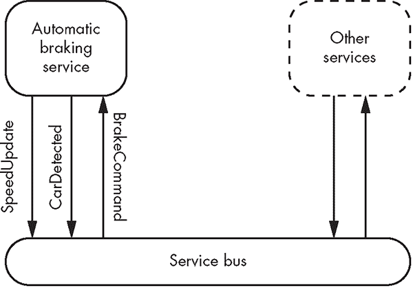

## 第十三章：测试**

*“[电脑]是怎么拿到恩德兄弟的照片并把它放进这个《仙境》程序的图形中的？” “格拉夫上校，我当时不在现场，程序是怎么写的我不知道。我只知道电脑从未带任何人来过这个地方。”*

—奥森·斯科特·卡德，《安德的游戏》


有许多方法可以用来测试你的软件。所有这些测试方法的共同点是，每个测试都会为你的代码提供某种输入，你需要评估测试的输出是否合适。环境的性质、调查的范围和评估的形式在不同的测试类型中差异很大。本章介绍了如何使用几种不同的框架进行测试，但这些内容可以扩展到其他测试方法。在开始之前，让我们快速了解几种不同的测试类型。

### 单元测试

*单元测试*验证一组集中的、凝聚的代码——一个*单元*，比如一个函数或类——是否按程序员的意图正常运行。好的单元测试会将被测试的单元与其依赖项隔离开来。有时这可能会很困难：单元可能依赖于其他单元。在这种情况下，你可以使用模拟（mocks）来代替这些依赖项。*模拟*是你在测试期间专门使用的虚拟对象，用于精确控制单元的依赖项在测试中的表现。模拟还可以记录单元与它们的交互方式，这样你就可以测试单元是否按预期与依赖项交互。你还可以使用模拟来模拟一些罕见事件，比如系统内存不足，通过编程让它们抛出异常。

#### *集成测试*

测试多个单元一起工作被称为*集成测试*。集成测试也可以指测试软件与硬件之间的交互，这是系统程序员常常涉及的内容。集成测试是单元测试之上的一个重要层级，因为它确保你编写的软件能作为一个系统协同工作。这些测试是对单元测试的补充，而不是替代。

#### *验收测试*

*验收测试*确保你的软件符合所有客户的要求。高效的软件团队可以利用验收测试来指导开发。当所有的验收测试通过时，你的软件就可以交付了。因为这些验收测试成为代码库的一部分，所以它们在重构或特性回归时提供了内建的保护，防止在添加新特性时破坏现有功能。

#### *性能测试*

*性能测试*评估软件是否满足有效性要求，例如执行速度或内存/功耗。优化代码本质上是一个经验性的过程。你可以（也应该）有一些关于哪些代码部分可能导致性能瓶颈的想法，但除非你进行测量，否则无法确定。并且，除非你再次进行测量，否则无法知道你为了优化所做的代码修改是否真的提升了性能。你可以使用性能测试来给你的代码添加测量功能，并提供相关的度量。*仪表化*是一种测量产品性能、检测错误并记录程序执行方式的技术。有时，客户有严格的性能要求（例如，计算不能超过 100 毫秒，或系统不能分配超过 1MB 的内存）。你可以自动化测试这些要求，并确保未来的代码更改不会违反它们。

代码测试可能是一个抽象、枯燥的话题。为了避免这种情况，下一部分将介绍一个扩展示例，为讨论提供背景。

### 扩展示例：刹车

假设你正在为一辆自动驾驶汽车编写软件。你们团队的软件非常复杂，涉及数十万行代码。整个软件解决方案由多个二进制文件组成。为了部署你的软件，你必须将二进制文件上传到汽车（这是一个相对耗时的过程）。对代码进行修改、编译、上传并在实际车辆中执行，每次迭代需要几个小时。

写出所有车辆软件的庞大任务被分解为多个团队。每个团队负责一个*服务*，例如方向盘控制、音视频或车辆检测。服务通过服务总线相互交互，其中每个服务发布事件。其他服务根据需要订阅这些事件。这种设计模式被称为*服务总线架构*。

你的团队负责自动刹车服务。该服务必须判断是否即将发生碰撞，如果发生碰撞，便指示汽车刹车。你的服务订阅了两种事件类型：`SpeedUpdate`类，通知你车辆的速度已经变化，以及`CarDetected`类，通知你前方有其他车辆被检测到。每当检测到即将发生碰撞时，你的系统负责向服务总线发布`BrakeCommand`。这些类出现在 Listing 10-1 中。

```
struct SpeedUpdate {
  double velocity_mps;
};

struct CarDetected {
  double distance_m;
  double velocity_mps;
};

struct BrakeCommand {
  double time_to_collision_s;
};
```

*Listing 10-1: 你的服务所交互的 POD 类*

你将使用具有`publish`方法的`ServiceBus`对象发布`BrakeCommand`：

```
struct ServiceBus {
  void publish(const BrakeCommand&);
  --snip--
};
```

首席架构师希望你暴露一个 `observe` 方法，以便你可以订阅服务总线上的 `SpeedUpdate` 和 `CarDetected` 事件。你决定构建一个名为 `AutoBrake` 的类，并在程序的入口点初始化它。`AutoBrake` 类将保留对服务总线 `publish` 方法的引用，并通过其 `observe` 方法订阅 `SpeedUpdate` 和 `CarDetected` 事件，如清单 10-2 所示。

```
template <typename T>
struct AutoBrake {
  AutoBrake(const T& publish);
  void observe(const SpeedUpdate&);
  void observe(const CarDetected&);
private:
  const T& publish;
  --snip--
};
```

*清单 10-2：提供自动刹车服务的 `AutoBrake` 类*

图 10-1 总结了服务总线 `ServiceBus`、自动刹车系统 `AutoBrake` 和其他服务之间的关系。



*图 10-1：服务与服务总线之间交互的高级示意图*

该服务集成到汽车的软件中，生成类似于清单 10-3 中的代码。

```
--snip--
int main() {
  ServiceBus bus;
  AutoBrake auto_brake{ [&bus➊] (const auto& cmd) {
                          bus.publish(cmd); ➋
                      }
  };
  while (true) {  // Service bus's event loop
    auto_brake.observe(SpeedUpdate{ 10L }); ➌
 auto_brake.observe(CarDetected{ 250L, 25L }); ➍
  }
}
```

*清单 10-3：使用 `AutoBrake` 服务的示例入口点*

你通过一个 lambda 来构造 `AutoBrake`，它捕获对 `ServiceBus` 的引用 ➊。`AutoBrake` 何时决定刹车的所有细节对其他团队完全隐藏。服务总线调解所有服务间的通信。你只是将 `AutoBrake` 的任何命令直接传递给 `ServiceBus` ➋。在事件循环中，`ServiceBus` 可以将 `SpeedUpdate` ➌ 和 `CarDetected` 对象 ➍ 传递给你的 `auto_brake` 的 `observe` 方法。

#### *实现 AutoBrake*

实现 `AutoBrake` 的概念上简单的方法是通过编写一些代码、编译生成的二进制文件、将其上传到汽车并手动测试功能来进行迭代。这个方法可能会导致程序（和汽车）崩溃，并浪费大量时间。更好的方法是编写代码、编译单元测试二进制文件，并在桌面开发环境中运行。你可以更快速地在这些步骤之间迭代；一旦你对所编写的代码是否按预期工作有了合理的信心，就可以进行带有实际汽车的手动测试。

*单元测试二进制文件* 将是一个简单的控制台应用程序，针对桌面操作系统。在单元测试二进制文件中，你将运行一套单元测试，将特定输入传递给 `AutoBrake` 并断言它产生预期的结果。

在与管理团队商讨后，你收集了以下需求：

+   `AutoBrake` 将把汽车的初始速度视为零。

+   `AutoBrake` 应该具有可配置的灵敏度阈值，该阈值基于预测的碰撞发生前的秒数。灵敏度不得低于 1 秒，默认灵敏度为 5 秒。

+   `AutoBrake` 必须在 `SpeedUpdate` 观察之间保存汽车的速度。

+   每次 `AutoBrake` 观察到 `CarDetected` 事件时，如果预测的碰撞时间少于配置的灵敏度阈值，它必须发布一个 `BrakeCommand`。

因为你有这样一个完善的需求列表，下一步是尝试使用 *测试驱动开发（TDD）* 实现自动刹车服务。

**注意**

*因为本书是关于 C++ 的，而不是物理学，你的 `AutoBrake` 仅在车子直接在你面前时起作用。*

#### *测试驱动开发*

在单元测试采用的历史过程中，曾有一些勇敢的软件工程师想：“如果我知道我将为这个类编写一堆单元测试，为什么不先编写测试呢？”这种编写软件的方式，被称为 TDD，它是软件工程界一场伟大的宗教战争的基石。Vim 还是 Emacs？制表符还是空格？使用 TDD 还是不使用 TDD？本书谦虚地避免对这些问题发表评论。但我们将使用 TDD，因为它与单元测试的讨论非常契合。

##### TDD 的优势

编写一个测试来编码需求*在*实现解决方案之前，是 TDD 背后的基本理念。支持者认为，以这种方式编写的代码通常更模块化、健壮、清晰且设计良好。编写良好的测试是为其他开发人员记录代码的最佳方式。一个好的测试套件是一个完全可工作的示例集，永远不会失去同步。它可以防止在添加新特性时出现功能回退。

单元测试还可以作为提交 bug 报告的绝佳方式，方法是编写一个失败的单元测试。一旦 bug 被修复，它将始终保持修复状态，因为单元测试和修复 bug 的代码会成为测试套件的一部分。

##### 红-绿-重构

TDD 实践者有一个口号：*红色、绿色、重构*。红色是第一步，它意味着实现一个失败的测试。这么做有几个原因，最主要的是确保你真的在测试某个东西。你可能会惊讶于，设计一个没有任何断言的测试是多么常见。接下来，你实现使测试通过的代码。仅此而已。这将把测试从红色变为绿色。现在，你已经有了工作的代码和通过的测试，你可以重构你的生产代码。重构是指在不改变功能的前提下重组现有代码。例如，你可能会找到一种更优雅的方式来编写相同的代码，或者用第三方库替代你的代码，或者重写你的代码以获得更好的性能特征。

如果你不小心破坏了某些东西，你会立即知道，因为你的测试套件会告诉你。然后，你继续使用 TDD 实现类的其余部分。接下来，你可以开始处理碰撞阈值。

##### 编写一个骨架 AutoBrake 类

在你编写测试之前，你需要编写一个 *骨架类*，它实现了一个接口，但没有提供任何功能。在 TDD 中，这非常有用，因为如果没有你正在测试的类的外壳，你无法编译测试。

请参考 示例 10-4 中的骨架 `AutoBrake` 类。

```
struct SpeedUpdate {
  double velocity_mps;
};

struct CarDetected {
  double distance_m;
  double velocity_mps;
};

struct BrakeCommand {
  double time_to_collision_s;
};

template <typename T>
struct AutoBrake {
  AutoBrake(const T& publish➊) : publish{ publish } { }
  void observe(const SpeedUpdate& cd) { } ➋
  void observe(const CarDetected& cd) { } ➌
  void set_collision_threshold_s(double x) { ➍
    collision_threshold_s = x;
  }
  double get_collision_threshold_s() const { ➎
    return collision_threshold_s;
  }
  double get_speed_mps() const { ➏
    return speed_mps;
  }
private:
  double collision_threshold_s;
  double speed_mps;
  const T& publish;
};
```

*示例 10-4：一个骨架 `AutoBrake` 类*

`AutoBrake`类有一个构造函数，接受模板参数`publish` ➊，并将其保存在一个`const`成员中。一个需求指出，你将使用`BrakeCommand`调用`publish`。使用模板参数`T`允许你针对任何支持用`BrakeCommand`调用的类型编写通用代码。你提供了两个不同的观察函数：每个函数订阅你想要关注的事件类型 ➋➌。由于这只是一个骨架类，函数体中没有任何指令。你只需要一个暴露适当方法并能够编译通过的类。因为这些方法返回`void`，你甚至不需要返回语句。

你实现了一个 setter ➍和 getter ➎方法。这些方法调解与私有成员变量`collision_threshold_s`的交互。一个需求意味着关于`collision_threshold_s`有效值的类不变式。因为该值在构造后可能会发生变化，你不能仅仅通过构造函数来建立类的不变式。你需要一种方式来在整个对象生命周期内强制执行这个类的不变式。你可以使用 setter 方法在类设置成员的值之前进行验证。getter 方法允许你读取`collision_threshold_s`的值，但不允许修改它。这强制执行了一种*外部常量性*。

最后，你有一个`speed_mps` ➏的 getter 方法，但没有对应的 setter 方法。这类似于将`speed_mps`设为公共成员，唯一的重要区别是如果它是公共的，外部类就可以修改`speed_mps`。

##### 断言：单元测试的构建块

单元测试最重要的组成部分是*断言*，它检查某个条件是否满足。如果条件不满足，则相应的测试将失败。

清单 10-5 实现了一个`assert_that`函数，当某个布尔`statement`为`false`时，它会抛出一个带有错误信息的异常。

```
#include <stdexcept>
constexpr void assert_that(bool statement, const char* message) {
  if (!statement➊) throw std::runtime_error{ message }; ➋
}

int main() {
  assert_that(1 + 2 > 2, "Something is profoundly wrong with the universe."); ➌
  assert_that(24 == 42, "This assertion will generate an exception."); ➍
}
--------------------------------------------------------------------------
terminate called after throwing an instance of 'std::runtime_error'
  what():  This assertion will generate an exception. ➍
```

*清单 10-5：一个演示`assert_that`的程序（输出来自 GCC v7.1.1 编译的二进制文件）*

`assert_that`函数检查`statement` ➊参数是否为`false`，如果是，则抛出带有`message`参数 ➋的异常。第一个断言检查`1 + 2 > 2`，该断言通过 ➌。第二个断言检查`24 == 42`，该断言失败并抛出一个未捕获的异常 ➍。

##### 需求：初始速度为零

假设汽车的初始速度为零。在`AutoBrake`中实现此功能之前，你需要编写一个单元测试来编码这一需求。你将把单元测试实现为一个函数，创建一个`AutoBrake`对象，执行类中的方法，并对结果进行断言。清单 10-6 包含了一个编码初始速度为零的需求的单元测试。

```
void initial_speed_is_zero() {
  AutoBrake auto_brake{ [](const BrakeCommand&) {} }; ➊
  assert_that(auto_brake.get_speed_mps() == 0L, "speed not equal 0"); ➋
}
```

*清单 10-6：一个编码初始速度为零的单元测试*

你首先构造一个带有空`BrakeCommand publish`函数的`AutoBrake` ➊。这个单元测试只关心`AutoBrake`的初始车速。因为这个单元测试不关心`AutoBrake`如何或何时发布`BrakeCommand`，你给它提供一个最简单的参数，这样仍然可以编译。

**注意**

*单元测试的一个微妙但重要的特点是，如果你不关心待测试单元的某些依赖项，你可以提供一个空的实现，执行一些无害的默认行为。这个空实现有时被称为*桩（stub）*。*

在`initial_speed_is_zero`中，你只想断言汽车的初速为零，其他什么都不做 ➋。你使用 getter `get_speed_mps`并将返回值与`0`进行比较。就这样；如果初速不是零，`assert`会抛出异常。

现在你需要一种方法来运行单元测试。

##### 测试工具

*测试工具*是执行单元测试的代码。你可以制作一个测试工具，它会调用你的单元测试函数，如`initial_speed_is_zero`，并优雅地处理失败的断言。参考列表 10-7 中的测试工具`run_test`。

```
#include <exception>
--snip--
void run_test(void(*unit_test)(), const char* name) {
  try {
    unit_test(); ➊
    printf("[+] Test %s successful.\n", name); ➋
  } catch (const std::exception& e) {
    printf("[-] Test failure in %s. %s.\n", name, e.what()); ➌
  }
}
```

*列表 10-7：测试工具*

`run_test`工具接受一个名为`unit_test`的函数指针作为单元测试，并在`try`-`catch`语句中调用它 ➊。只要`unit_test`没有抛出异常，`run_test`将打印一条友好的消息，表示单元测试通过，然后返回 ➋。如果抛出任何`exception`，测试失败并打印一条不赞同的消息 ➌。

为了创建一个*单元测试程序*来运行你所有的单元测试，你将`run_test`测试工具放置在新程序的`main`函数中。整个单元测试程序如下所示：列表 10-8。

```
#include <stdexcept>

struct SpeedUpdate {
  double velocity_mps;
};

struct CarDetected {
 double distance_m;
  double velocity_mps;
};

struct BrakeCommand {
  double time_to_collision_s;
};

template <typename T>
struct AutoBrake {
  --snip--
};

constexpr void assert_that(bool statement, const char* message) {
  if (!statement) throw std::runtime_error{ message };
}

void initial_speed_is_zero() {
  AutoBrake auto_brake{ [](const BrakeCommand&) {} };
  assert_that(auto_brake.get_speed_mps() == 0L, "speed not equal 0");
}

void run_test(void(*unit_test)(), const char* name) {
  try {
    unit_test();
    printf("[+] Test %s successful.\n", name);
  } catch (const std::exception& e) {
    printf("[-] Test failure in %s. %s.\n", name, e.what());
  }
}

int main() {
  run_test(initial_speed_is_zero, "initial speed is 0"); ➊
}
--------------------------------------------------------------------------
[-] Test failure in initial speed is 0\. speed not equal 0\. ➊
```

*列表 10-8：单元测试程序*

当你编译并运行这个单元测试二进制文件时，你可以看到单元测试`initial_speed_is_zero`失败，并显示一条有用的消息 ➊。

**注意**

*因为列表 10-8 中的`AutoBrake`成员`speed_mps`没有初始化，所以该程序具有未定义的行为。实际上并不能确定测试是否会失败。当然，解决方案是，你不应该编写具有未定义行为的程序。*

##### 让测试通过

为了让`initial_speed_is_zero`通过，所需的唯一操作是将`speed_mps`在`AutoBrake`的构造函数中初始化为零：

```
template <typename T>
struct AutoBrake {
 AutoBrake(const T& publish) : speed_mps{}➊, publish{ publish } { }
  --snip--
};
```

只需将初始化值设置为零 ➊。现在，如果你更新、编译并运行列表 10-8 中的单元测试程序，你会看到更加愉快的输出：

```
[+] Test initial speed is 0 successful.
```

##### 要求：默认的碰撞阈值为五

默认的碰撞阈值需要是 5。参考列表 10-9 中的单元测试。

```
void initial_sensitivity_is_five() {
  AutoBrake auto_brake{ [](const BrakeCommand&) {} };
  assert_that(auto_brake.get_collision_threshold_s() == 5L,
              "sensitivity is not 5");
}
```

*列表 10-9：一个编码了初速必须为零要求的单元测试*

你可以将此测试插入到测试程序中，如列表 10-10 所示。

```
--snip--
int main() {
  run_test(initial_speed_is_zero, "initial speed is 0");
  run_test(initial_sensitivity_is_five, "initial sensitivity is 5");
}
--------------------------------------------------------------------------
[+] Test initial speed is 0 successful.
[-] Test failure in initial sensitivity is 5\. sensitivity is not 5.
```

*清单 10-10：将`initial-sensitivity-is-5`测试添加到测试工具中*

正如预期的那样，清单 10-10 显示`initial_speed_is_zero`仍然通过，而新的测试`initial_sensitivity_is_five`失败。

现在，让它通过。像清单 10-11 中所示，向`AutoBrake`添加适当的成员初始化器。

```
template <typename T>
struct AutoBrake {
  AutoBrake(const T& publish)
    : collision_threshold_s{ 5 }, ➊
      speed_mps{},
      publish{ publish } { }
  --snip--
};
```

*清单 10-11：更新`AutoBrake`以满足碰撞阈值要求*

新的成员初始化器 ➊ 将`collision_threshold_s`设置为 5。重新编译测试程序后，你可以看到`initial_sensitivity_is_five`现在通过了：

```
[+] Test initial speed is 0 successful.
[+] Test initial sensitivity is 5 successful.
```

接下来，处理类的不变量，即灵敏度必须大于 1。

##### 要求：灵敏度必须始终大于 1

为了使用异常编码灵敏度验证错误，你可以构建一个测试，期望当`collision_threshold_s`被设置为小于 1 的值时抛出异常，正如清单 10-12 所示。

```
void sensitivity_greater_than_1() {
  AutoBrake auto_brake{ [](const BrakeCommand&) {} };
  try {
    auto_brake.set_collision_threshold_s(0.5L); ➊
  } catch (const std::exception&) {
    return; ➋
  }
  assert_that(false, "no exception thrown"); ➌
}
```

*清单 10-12：一个编码灵敏度始终大于 1 要求的测试*

你期望当调用`auto_brake`的`set_collision_threshold_s`方法并传入值 0.5 时，它会抛出异常 ➊。如果它确实抛出异常，你会捕获该异常并立即从测试中返回 ➋。如果`set_collision_threshold_s`没有抛出异常，你会使用`no excep``tion thrown`的消息来失败一个断言 ➌。

接下来，按照清单 10-13 中的示范，将`sensitivity_greater_than_1`添加到测试工具中。

```
--snip--
int main() {
  run_test(initial_speed_is_zero, "initial speed is 0");
  run_test(initial_sensitivity_is_five, "initial sensitivity is 5");
  run_test(sensitivity_greater_than_1, "sensitivity greater than 1"); ➊
}
--------------------------------------------------------------------------
[+] Test initial speed is 0 successful.
[+] Test initial sensitivity is 5 successful.
[-] Test failure in sensitivity greater than 1\. no exception thrown. ➊
```

*清单 10-13：将`set_collision_threshold_s`添加到测试工具中*

正如预期的那样，新的单元测试失败 ➊。

你可以实现验证，使得测试通过，正如清单 10-14 所示。

```
#include <exception>
--snip--
template <typename T>
struct AutoBrake {
  --snip--
  void set_collision_threshold_s(double x) {
    if (x < 1) throw std::exception{ "Collision less than 1." };
    collision_threshold_s = x;
  }
}
```

*清单 10-14：更新`AutoBrake`的`set_collision_threshold`方法以验证其输入*

重新编译并执行单元测试套件后，测试变为绿色：

```
[+] Test initial speed is 0 successful.
[+] Test initial sensitivity is 5 successful.
[+] Test sensitivity greater than 1 successful.
```

接下来，你想确保`AutoBrake`在每次`SpeedUpdate`之间保存汽车的速度。

##### 要求：在更新之间保存汽车的速度

清单 10-15 中的单元测试编码了`AutoBrake`保存汽车速度的要求。

```
void speed_is_saved() {
  AutoBrake auto_brake{ [](const BrakeCommand&) {} }; ➊
  auto_brake.observe(SpeedUpdate{ 100L }); ➋
  assert_that(100L == auto_brake.get_speed_mps(), "speed not saved to 100"); ➌
  auto_brake.observe(SpeedUpdate{ 50L });
  assert_that(50L == auto_brake.get_speed_mps(), "speed not saved to 50");
  auto_brake.observe(SpeedUpdate{ 0L });
  assert_that(0L == auto_brake.get_speed_mps(), "speed not saved to 0");
}
```

*清单 10-15：编码`AutoBrake`保存汽车速度的要求*

在构建了一个`AutoBrake` ➊后，你将`velocity_mps`等于 100 的`SpeedUpdate`传递给它的`observe`方法 ➋。接下来，你通过`get_speed_mps`方法从`auto_brake`中获取速度，并期望它等于 100 ➌。

**注意**

*通常来说，每个测试应该有一个单独的断言。这个测试违反了对规则的最严格解释，但并没有违背其精神。所有的断言都在检查同一个、一致的要求，那就是每当观察到`SpeedUpdate`时，速度都会被保存。*

你以通常的方式将清单 10-15 中的测试添加到测试工具中，正如清单 10-16 所示。

```
--snip--
int main() {
  run_test(initial_speed_is_zero, "initial speed is 0");
  run_test(initial_sensitivity_is_five, "initial sensitivity is 5");
  run_test(sensitivity_greater_than_1, "sensitivity greater than 1");
  run_test(speed_is_saved, "speed is saved"); ➊
}
--------------------------------------------------------------------------
[+] Test initial speed is 0 successful.
[+] Test initial sensitivity is 5 successful.
[+] Test sensitivity greater than 1 successful.
[-] Test failure in speed is saved. speed not saved to 100\. ➊
```

*清单 10-16：将节速单元测试添加到测试工具中*

不出所料，新的测试失败了➊。为了让这个测试通过，你需要实现适当的`observe`函数：

```
template <typename T>
struct AutoBrake {
  --snip--
  void observe(const SpeedUpdate& x) {
    speed_mps = x.velocity_mps; ➊
  }
};
```

你从`SpeedUpdate`中提取`velocity_mps`并将其存储到`speed_mps`成员变量中➊。重新编译测试二进制文件后，单元测试通过了：

```
[+] Test initial speed is 0 successful.
[+] Test initial sensitivity is 5 successful.
[+] Test sensitivity greater than 1 successful.
[+] Test speed is saved successful.
```

最后，你需要确保`AutoBrake`能够计算出正确的碰撞时间，并且在适当的时候，使用`publish`函数发布一个`BrakeCommand`。

##### 需求：当检测到碰撞时，AutoBrake 发布 BrakeCommand

计算碰撞时间的相关方程直接来源于高中物理。首先，你计算你车与检测到的车之间的相对速度：


如果你的相对速度是恒定的且为正，那么车辆最终会发生碰撞。你可以通过以下方式计算碰撞的时间：


如果 Time[Collision]大于零并且小于或等于`collision_threshold_s`，你就会调用`publish`并发布一个`BrakeCommand`。清单 10-17 中的单元测试将碰撞阈值设置为 10 秒，并观察那些指示碰撞的事件。

```
void alert_when_imminent() {
  int brake_commands_published{}; ➊
  AutoBrake auto_brake{
    &brake_commands_published➋ {
      brake_commands_published++; ➌
  } };
  auto_brake.set_collision_threshold_s(10L); ➍
  auto_brake.observe(SpeedUpdate{ 100L }); ➎
  auto_brake.observe(CarDetected{ 100L, 0L }); ➏
  assert_that(brake_commands_published == 1, "brake commands published not
one"); ➐
}
```

*清单 10-17：刹车事件的单元测试*

在这里，你将本地变量`brake_commands_published`初始化为零➊。这个变量用于追踪`publish`回调被调用的次数。你将这个本地变量通过引用传递给用于构造`auto_brake`的 lambda 表达式➋。注意，你会递增`brake_commands_published`➌。由于 lambda 是通过引用捕获的，因此你可以在单元测试中稍后检查`brake_commands_published`的值。接下来，你将`set_collision_threshold`设置为 10 ➍。你将汽车的速度更新为每秒 100 米➎，然后你检测到一辆距离 100 米的车，速度为 0 米每秒（它已经停止）➏。`AutoBrake`类应该能判断出 1 秒后会发生碰撞。这应该会触发一个回调，进而递增`brake_commands_published`。断言 ➐ 确保回调仅发生一次。

在将代码添加到`main`之后，编译并运行，结果是一个新的红色测试：

```
[+] Test initial speed is 0 successful.
[+] Test initial sensitivity is 5 successful.
[+] Test sensitivity greater than 1 successful.
[+] Test speed is saved successful.
[-] Test failure in alert when imminent. brake commands published not one.
```

你可以实现代码来使得这个测试通过。清单 10-18 提供了发布刹车命令所需的所有代码。

```
template <typename T>
struct AutoBrake {
  --snip--
  void observe(const CarDetected& cd) {
    const auto relative_velocity_mps = speed_mps - cd.velocity_mps; ➊
    const auto time_to_collision_s = cd.distance_m / relative_velocity_mps; ➋
    if (time_to_collision_s > 0 &&  ➌
        time_to_collision_s <= collision_threshold_s ➍) {
 publish(BrakeCommand{ time_to_collision_s }); ➎
    }
  }
};
```

*清单 10-18：实现刹车功能的代码*

首先，你计算相对速度➊。接下来，使用这个值来计算碰撞时间➋。如果这个值为正➌且小于或等于碰撞阈值➍，你就发布一个`BrakeCommand`➎。

重新编译并运行单元测试套件后，测试通过了：

```
[+] Test initial speed is 0 successful.
[+] Test initial sensitivity is 5 successful.
[+] Test sensitivity greater than 1 successful.
[+] Test speed is saved successful.
[+] Test alert when imminent successful.
```

最后，你需要检查`AutoBrake`是否不会在碰撞发生时间晚于`collision_threshold_s`时调用`publish`发布`BrakeCommand`。你可以重新利用`alert_when_imminent`单元测试，如清单 10-19 中所示。

```
void no_alert_when_not_imminent() {
  int brake_commands_published{};
  AutoBrake auto_brake{
    &brake_commands_published {
      brake_commands_published++;
  } };
  auto_brake.set_collision_threshold_s(2L);
  auto_brake.observe(SpeedUpdate{ 100L });
  auto_brake.observe(CarDetected{ 1000L, 50L });
  assert_that(brake_commands_published == 0 ➊, "brake command published");
}
```

*清单 10-19：测试如果碰撞不在碰撞阈值内，汽车不会发出`BrakeCommand`*

这改变了设置。你的汽车阈值设置为 2 秒，速度为每秒 100 米。汽车在 1000 米外被检测到，速度为每秒 50 米。`AutoBrake`类应预测 20 秒内发生碰撞，这超过了 2 秒的阈值。你还更改了断言➊。

在将此测试添加到`main`并运行单元测试套件后，你得到了以下结果：

```
[+] Test initial speed is 0 successful.
[+] Test initial sensitivity is 5 successful.
[+] Test sensitivity greater than 1 successful.
[+] Test speed is saved successful.
[+] Test alert when imminent successful.
[+] Test no alert when not imminent successful. ➊
```

对于这个测试用例，你已经拥有了通过此测试所需的所有代码➊。测试一开始没有失败的测试，违背了红、绿、重构的经典法则，但这没关系。这个测试用例与`alert_when_imminent`紧密相关。TDD 的重点不是盲目遵循严格的规则。TDD 是一组合理宽松的指南，帮助你编写更好的软件。

#### *添加一个服务总线接口*

`AutoBrake`类有一些依赖：`CarDetected`、`SpeedUpdated`和一个通用的依赖于可以调用的`publish`对象，它接受一个`BrakeCommand`参数。`CarDetected`和`SpeedUpdated`类是简单的数据类型，直接在单元测试中使用很方便。`publish`对象的初始化稍微复杂一些，但得益于 lambda 表达式，这并不难。

假设你想重构服务总线。你希望接受一个`std::function`来订阅每个服务，如清单 10-20 中的新`IServiceBus`接口所示。

```
#include <functional>

using SpeedUpdateCallback = std::function<void(const SpeedUpdate&)>;
using CarDetectedCallback = std::function<void(const CarDetected&)>;

struct IServiceBus {
  virtual ~IServiceBus() = default;
  virtual void publish(const BrakeCommand&) = 0;
  virtual void subscribe(SpeedUpdateCallback) = 0;
  virtual void subscribe(CarDetectedCallback) = 0;
};
```

*清单 10-20：`IServiceBus`接口*

因为`IServiceBus`是一个接口，你无需了解其实现细节。这是一个很好的解决方案，因为它允许你自己将服务总线接入。但是有一个问题。如何在隔离环境中测试`AutoBrake`？如果你尝试使用生产总线，你就进入了集成测试领域，而你希望的是易于配置的、独立的单元测试。

##### 模拟依赖

幸运的是，你并不依赖于实现：你依赖于接口。你可以创建一个实现了`IServiceBus`接口的模拟类，并在`AutoBrake`中使用它。模拟是你专门为测试依赖于模拟的类而生成的特殊实现。

现在，当你在单元测试中使用`AutoBrake`时，`AutoBrake`与模拟对象交互，而不是生产服务总线。因为你完全控制模拟的实现，而且模拟是专为单元测试设计的类，你可以在测试依赖于接口的类时拥有极大的灵活性：

+   你可以捕捉关于模拟被调用的详细信息。这可以包括参数信息和模拟被调用的次数等。

+   你可以在模拟中执行任意计算。

换句话说，您完全控制着`AutoBrake`的依赖项的输入和输出。当服务总线在`publish`调用中抛出内存溢出异常时，`AutoBrake`如何处理？您可以对这一点进行单元测试。`AutoBrake`注册了多少次`SpeedUpdates`的回调？同样，您可以对这一点进行单元测试。

清单 10-21 展示了一个简单的模拟类，您可以在单元测试中使用它。

```
struct MockServiceBus : IServiceBus {
  void publish(const BrakeCommand& cmd) override {
    commands_published++; ➊
    last_command = cmd; ➋
  }
  void subscribe(SpeedUpdateCallback callback) override {
    speed_update_callback = callback; ➌
  }
  void subscribe(CarDetectedCallback callback) override {
    car_detected_callback = callback; ➍
  }
  BrakeCommand last_command{};
  int commands_published{};
  SpeedUpdateCallback speed_update_callback{};
  CarDetectedCallback car_detected_callback{};
};
```

*清单 10-21：`MockServiceBus`的定义*

`publish`方法记录每次发布`BrakeCommand`的次数 ➊ 和发布的`last_command` ➋。每次`AutoBrake`向服务总线发布命令时，您会看到`MockServiceBus`的成员发生更新。您很快就会发现，这允许您对`AutoBrake`在测试中的行为进行非常强大的断言。您保存了用于订阅服务总线的回调函数 ➌➍。这使您能够通过手动调用这些回调函数来模拟事件。

现在，您可以将注意力集中到重构`AutoBrake`上。

##### 重构 AutoBrake

清单 10-22 用最小的更改更新了`AutoBrake`，以使单元测试二进制文件重新编译（但不一定通过！）。

```
#include <exception>
--snip--
struct AutoBrake { ➊
 AutoBrake(IServiceBus& bus) ➋
    : collision_threshold_s{ 5 },
      speed_mps{} {
  }
  void set_collision_threshold_s(double x) {
    if (x < 1) throw std::exception{ "Collision less than 1." };
    collision_threshold_s = x;
  }
  double get_collision_threshold_s() const {
    return collision_threshold_s;
  }
  double get_speed_mps() const {
    return speed_mps;
  }
private:
  double collision_threshold_s;
  double speed_mps;
};
```

*清单 10-22：重构后的`AutoBrake`骨架，接受`IServiceBus`引用*

请注意，所有的`observe`函数都已被移除。此外，`AutoBrake`不再是一个模板 ➊。相反，它在构造函数中接受一个`IServiceBus`引用 ➋。

您还需要更新您的单元测试，以使测试套件重新编译。一个受 TDD 启发的方法是将所有无法编译的测试注释掉，并更新`AutoBrake`，直到所有失败的单元测试通过。然后，逐个取消注释每个单元测试。使用新的`IServiceBus`模拟重新实现每个单元测试，然后更新`AutoBrake`，使测试通过。

让我们试试吧。

##### 重构单元测试

由于您已更改构造`AutoBrake`对象的方式，您需要重新实现每个测试。前三个很简单：清单 10-23 只需将模拟对象传入`AutoBrake`构造函数中。

```
void initial_speed_is_zero() {
  MockServiceBus bus{}; ➊
  AutoBrake auto_brake{ bus }; ➋
  assert_that(auto_brake.get_speed_mps() == 0L, "speed not equal 0");
}

void initial_sensitivity_is_five() {
  MockServiceBus bus{}; ➊
  AutoBrake auto_brake{ bus }; ➋
  assert_that(auto_brake.get_collision_threshold_s() == 5,
              "sensitivity is not 5");
}

void sensitivity_greater_than_1() {
  MockServiceBus bus{}; ➊
  AutoBrake auto_brake{ bus }; ➋
 try {
    auto_brake.set_collision_threshold_s(0.5L);
  } catch (const std::exception&) {
    return;
  }
  assert_that(false, "no exception thrown");
}
```

*清单 10-23：使用`MockServiceBus`重新实现的单元测试函数*

由于这三个测试处理的功能与服务总线无关，您不需要对`AutoBrake`进行任何重大更改也不足为奇。您需要做的就是创建一个`MockServiceBus` ➊ 并将其传递到`AutoBrake`的构造函数中 ➋。运行单元测试套件后，您将看到以下内容：

```
[+] Test initial speed is 0 successful.
[+] Test initial sensitivity is 5 successful.
[+] Test sensitivity greater than 1 successful.
```

接下来，查看`speed_is_saved`测试。`AutoBrake`类不再暴露`observe`函数，但由于你在模拟的服务总线上保存了`SpeedUpdateCallback`，你可以直接调用回调函数。如果`AutoBrake`正确订阅了，该回调将更新汽车的速度，并且你将在调用`get_speed_mps`方法时看到效果。列表 10-24 包含了重构内容。

```
void speed_is_saved() {
  MockServiceBus bus{};
  AutoBrake auto_brake{ bus };

  bus.speed_update_callback(SpeedUpdate{ 100L }); ➊
  assert_that(100L == auto_brake.get_speed_mps(), "speed not saved to 100"); ➋
  bus.speed_update_callback(SpeedUpdate{ 50L });
  assert_that(50L == auto_brake.get_speed_mps(), "speed not saved to 50");
  bus.speed_update_callback(SpeedUpdate{ 0L });
  assert_that(0L == auto_brake.get_speed_mps(), "speed not saved to 0");
}
```

*列表 10-24：使用`MockServiceBus`重新实现`speed_is_saved`单元测试函数*

这个测试与之前的实现差异不大。你调用了存储在模拟总线上的`speed_update_callback`函数 ➊。你确保`AutoBrake`对象正确更新了汽车的速度 ➋。编译并运行该单元测试套件后，得到如下输出：

```
[+] Test initial speed is 0 successful.
[+] Test initial sensitivity is 5 successful.
[+] Test sensitivity greater than 1 successful.
[-] Test failure in speed is saved. bad function call.
```

请记住，`bad function call`消息来自于`std::bad_func``tion_call`异常。这是预期中的情况：你仍然需要从`AutoBrake`进行订阅，因此当你调用它时，`std::function`会抛出异常。

考虑列表 10-25 中的方法。

```
struct AutoBrake {
  AutoBrake(IServiceBus& bus)
    : collision_threshold_s{ 5 },
    speed_mps{} {
    bus.subscribe(this {
      speed_mps = update.velocity_mps;
    });
  }
  --snip--
}
```

*列表 10-25：将`AutoBrake`订阅到来自`IServiceBus`的速度更新*

多亏了`std::function`，你可以将回调作为 lambda 传递给`bus`的订阅方法，该 lambda 捕获了`speed_mps`。 (注意，你不需要保存`bus`的副本。) 重新编译并运行单元测试套件后，得到如下输出：

```
[+] Test initial speed is 0 successful.
[+] Test initial sensitivity is 5 successful.
[+] Test sensitivity greater than 1 successful.
[+] Test speed is saved successful.
```

接下来，你将执行第一个与警报相关的单元测试`no_alert_when_not_imminent`。列表 10-26 展示了如何根据新架构更新这个测试。

```
void no_alert_when_not_imminent() {
  MockServiceBus bus{};
  AutoBrake auto_brake{ bus };
  auto_brake.set_collision_threshold_s(2L);
  bus.speed_update_callback(SpeedUpdate{ 100L }); ➊
  bus.car_detected_callback(CarDetected{ 1000L, 50L }); ➋
  assert_that(bus.commands_published == 0, "brake commands were published");
}
```

*列表 10-26：使用`IServiceBus`更新`no_alert_when_not_imminent`测试*

如同在`speed_is_saved`测试中，你通过在`bus`模拟对象上调用回调来模拟服务总线上的事件 ➊➋。重新编译并运行单元测试套件时，结果会出现预期的失败。

```
[+] Test initial speed is 0 successful.
[+] Test initial sensitivity is 5 successful.
[+] Test sensitivity greater than 1 successful.
[+] Test speed is saved successful.
[-] Test failure in no alert when not imminent. bad function call.
```

你需要使用`CarDetectedCallback`进行订阅。你可以将其添加到`AutoBus`构造函数中，正如列表 10-27 中展示的那样。

```
struct AutoBrake {
  AutoBrake(IServiceBus& bus)
    : collision_threshold_s{ 5 },
    speed_mps{} {
    bus.subscribe(this {
      speed_mps = update.velocity_mps;
    });
    bus.subscribe(this➊, &bus➋ {
      const auto relative_velocity_mps = speed_mps - cd.velocity_mps;
      const auto time_to_collision_s = cd.distance_m / relative_velocity_mps;
      if (time_to_collision_s > 0 &&
          time_to_collision_s <= collision_threshold_s) {
        bus.publish(BrakeCommand{ time_to_collision_s }); ➌
      }
    });
  }
  --snip--
}
```

*列表 10-27：一个更新后的`AutoBrake`构造函数，将其接入服务总线*

你所做的只是移植了原来的`observe`方法，用于处理`CarDetected`事件。lambda 表达式通过引用捕获了`this` ➊和`bus` ➋。捕获`this`使你能够计算碰撞时间，而捕获`bus`则可以在条件满足时发布`BrakeCommand` ➌。现在，单元测试的二进制文件输出如下内容：

```
[+] Test initial speed is 0 successful.
[+] Test initial sensitivity is 5 successful.
[+] Test sensitivity greater than 1 successful.
[+] Test speed is saved successful.
[+] Test no alert when not imminent successful.
```

最后，开启最后一个测试项`alert_when_imminent`，如列表 10-28 所示。

```
void alert_when_imminent() {
  MockServiceBus bus{};
  AutoBrake auto_brake{ bus };
  auto_brake.set_collision_threshold_s(10L);
  bus.speed_update_callback(SpeedUpdate{ 100L });
  bus.car_detected_callback(CarDetected{ 100L, 0L });
  assert_that(bus.commands_published == 1, "1 brake command was not published");
  assert_that(bus.last_command.time_to_collision_s == 1L,
              "time to collision not computed correctly."); ➊
}
```

*列表 10-28：重构`alert_when_imminent`单元测试*

在`MockServiceBus`中，您实际上将最后发布到总线的`BrakeCommand`保存为一个成员变量。在测试中，您可以使用这个成员变量来验证碰撞时间是否计算正确。如果一辆车以 100 米每秒的速度行驶，它将在 1 秒钟内撞上停在 100 米外的静止汽车。您可以通过引用我们模拟的`bus` ➊上的`time_to_collision_s`字段，检查`BrakeCommand`是否记录了正确的碰撞时间。

重新编译并重新运行，您终于将测试套件恢复到全绿状态：

```
[+] Test initial speed is 0 successful.
[+] Test initial sensitivity is 5 successful.
[+] Test sensitivity greater than 1 successful.
[+] Test speed is saved successful.
[+] Test no alert when not imminent successful.
[+] Test alert when imminent successful.
```

重构现已完成。

##### 重新评估单元测试解决方案

回顾单元测试解决方案，您可以识别出几个与`AutoBrake`无关的组件。这些是通用的单元测试组件，您可以在未来的单元测试中重复使用。回想一下在清单 10-29 中创建的两个辅助函数。

```
#include <stdexcept>
#include <cstdio>

void assert_that(bool statement, const char* message) {
  if (!statement) throw std::runtime_error{ message };
}

void run_test(void(*unit_test)(), const char* name) {
  try {
    unit_test();
    printf("[+] Test %s successful.\n", name);
    return;
  } catch (const std::exception& e) {
    printf("[-] Test failure in %s. %s.\n", name, e.what());
  }
}
```

*清单 10-29：一个简洁的单元测试框架*

这两个函数反映了单元测试的两个基本方面：进行断言和运行测试。自己编写简单的`assert_that`函数和`run_test`框架是可行的，但这种方法扩展性不强。通过依赖单元测试框架，您可以做得更好。

### 单元测试与模拟框架

*单元测试框架*提供了常用的功能和您需要的架构，以便将您的测试组织成一个用户友好的程序。这些框架提供了大量功能，帮助您创建简洁、富有表现力的测试。本节将介绍几种流行的单元测试和模拟框架。

#### *Catch 单元测试框架*

由 Phil Nash 开发的最直观的单元测试框架 Catch 可以在[`github.com/catchorg/Catch2/`](https://github.com/catchorg/Catch2/)找到。因为它是一个仅包含头文件的库，您只需下载单头版本并在每个包含单元测试代码的翻译单元中包含它即可设置 Catch。

**注意**

*在写作时，Catch 的最新版本是 2.9.1。*

##### 定义入口点

告诉 Catch 通过`#define CATCH_CONFIG_MAIN`提供您的测试二进制文件的入口点。Catch 单元测试套件的启动过程如下：

```
#define CATCH_CONFIG_MAIN
#include "catch.hpp"
```

就是这样。在`catch.hpp`头文件中，它会查找`CATCH_CONFIG_MAIN`预处理器定义。存在时，Catch 会自动添加一个`main`函数，您无需手动编写。它会自动获取您定义的所有单元测试，并将其包裹在一个漂亮的测试框架中。

##### 定义测试用例

在“单元测试”一节中，你在 第 282 页 定义了每个单元测试的单独函数。然后你会将该函数的指针作为第一个参数传递给 `run_test`。你将测试的名称作为第二个参数传递，这有点冗余，因为你已经为第一个参数所指向的函数提供了描述性的名称。最后，你还需要实现自己的 `assert` 函数。Catch 会隐式处理所有这些步骤。对于每个单元测试，你使用 `TEST_CASE` 宏，而 Catch 会为你处理所有集成工作。

清单 10-30 演示了如何构建一个简单的 Catch 单元测试程序。

```
#define CATCH_CONFIG_MAIN
#include "catch.hpp"

TEST_CASE("AutoBrake") { ➊
  // Unit test here
}
--------------------------------------------------------------------------
==========================================================================
test cases: 1 | 1 passed ➊
assertions: - none - ➋
```

*清单 10-30：一个简单的 Catch 单元测试程序*

Catch 入口点检测到你声明了一个名为 `AutoBrake` 的测试 ➊。它还提供了一个警告，指出你没有进行任何断言 ➋。

##### 进行断言

Catch 自带了一组内置的断言，它包含两类不同的断言宏：`REQUIRE` 和 `CHECK`。它们的区别在于，`REQUIRE` 会立即使测试失败，而 `CHECK` 会允许测试继续运行（但仍会导致失败）。`CHECK` 在某些情况下非常有用，特别是当一组相关的断言失败时，它能引导程序员进行调试。此外，还有 `REQUIRE_FALSE` 和 `CHECK_FALSE`，它们检查包含的语句是否评估为假，而不是为真。在某些情况下，这可能是表达要求的更自然方式。

你只需要用 `REQUIRE` 宏包装一个布尔表达式。如果表达式评估为假，断言失败。你提供一个 *断言表达式*，如果断言通过则为真，若失败则为假：

```
REQUIRE(assertion-expression);
```

让我们来看一下如何将 `REQUIRE` 与 `TEST_CASE` 结合起来构建单元测试。

**注意**

*因为这是 Catch 中最常用的断言，所以我们在这里使用 `REQUIRE`。有关更多信息，请参考 Catch 文档。*

##### 将 initial_speed_is_zero 测试重构为 Catch

清单 10-31 显示了重构为使用 Catch 的 `initial_speed_is_zero` 测试。

```
#define CATCH_CONFIG_MAIN
#include "catch.hpp"
#include <functional>

struct IServiceBus {
  --snip--
};

struct MockServiceBus : IServiceBus {
  --snip--
};

struct AutoBrake {
  --snip--
};
TEST_CASE➊("initial car speed is zero"➋) {
  MockServiceBus bus{};
  AutoBrake auto_brake{ bus };
  REQUIRE(auto_brake.get_speed_mps() == 0); ➌
}
```

*清单 10-31：将 `initial_speed_is_zero` 单元测试重构为使用 Catch*

你使用 `TEST_CASE` 宏定义一个新的单元测试 ➊。该测试由它的唯一参数 ➋ 描述。在 `TEST_CASE` 宏的主体内，你继续进行单元测试。你还会看到 `REQUIRE` 宏的应用 ➌。要查看 Catch 如何处理失败的测试，注释掉 `speed_mps` 成员初始化器以导致测试失败，并观察程序的输出，如 清单 10-32 所示。

```
struct AutoBrake {
  AutoBrake(IServiceBus& bus)
    : collision_threshold_s{ 5 }/*,
    speed_mps{} */{ ➊
  --snip--
};
```

*清单 10-32：故意注释掉 `speed_mps` 成员初始化器以导致测试失败（使用 Catch）*

适当的成员初始化器 ➊ 被注释掉，导致测试失败。在 清单 10-31 中重新运行 Catch 测试套件，输出结果如 清单 10-33 所示。

```
~~~~~~~~~~~~~~~~~~~~~~~~~~~~~~~~~~~~~~~~~~~~~~~~~~~~~~~~~~~~~~~~~~~~~~~~~~~~~~
catch_example.exe is a Catch v2.0.1 host application.
Run with -? for options

------------------------------------------------------------------------------
initial car speed is zero
------------------------------------------------------------------------------
c:\users\jalospinoso\catch-test\main.cpp(82)
..............................................................................

c:\users\jalospinoso\catch-test\main.cpp(85):➊ FAILED:
  REQUIRE( auto_brake.get_speed_mps()L == 0 ) ➋
with expansion:
  -92559631349317830736831783200707727132248687965119994463780864.0 ➌
  ==
  0

==============================================================================
test cases: 1 | 1 failed
assertions: 1 | 1 failed
```

*示例 10-33：在实现示例 10-31 后运行测试套件的输出*

这是远远优于你在自定义单元测试框架中生成的输出。Catch 会告诉你单元测试失败的确切行号➊，并为你打印出这一行➋。接着，它会展开这行并显示在运行时遇到的实际值。你可以看到`get_speed_mps()`返回的怪异（未初始化的）值显然不是`0` ➌。将这个输出与自定义单元测试的输出进行比较，我相信你会同意使用 Catch 立刻能带来价值。

##### 断言和异常

Catch 还提供了一种特殊的断言，叫做`REQUIRE_THROWS`。这个宏要求包含的表达式必须抛出异常。为了在自定义单元测试框架中实现类似的功能，可以参考这个多行的庞然大物：

```
  try {
    auto_brake.set_collision_threshold_s(0.5L);
  } catch (const std::exception&) {
    return;
  }
  assert_that(false, "no exception thrown");
```

还有其他感知异常的宏。你可以使用`REQUIRE_NOTHROW`和`CHECK_NOTHROW`宏要求某个表达式的求值不能抛出异常。你还可以通过使用`REQUIRE_THROWS_AS`和`CHECK_THROWS_AS`宏来指定你期望抛出的异常类型。这些宏期望第二个参数描述预期的类型。它们的使用方式类似于`REQUIRE`；你只需提供一个必须抛出异常的表达式，才能使断言通过：

```
REQUIRE_THROWS(expression-to-evaluate);
```

如果表达式没有抛出异常，断言将失败。

##### 浮点数断言

`AutoBrake` 类涉及浮点数运算，我们一直在忽略可能非常严重的断言问题。因为浮点数会产生舍入误差，使用`operator==`进行相等性检查并不是一个好主意。更稳健的方法是测试浮点数之间的差异是否足够小。在 Catch 中，你可以轻松处理这些情况，使用`Approx`类，如示例 10-34 所示。

```
TEST_CASE("AutoBrake") {
  MockServiceBus bus{};
  AutoBrake auto_brake{ bus };
  REQUIRE(auto_brake.get_collision_threshold_s() == Approx(5L));
}
```

*示例 10-34：使用`Approx`类重构“将灵敏度初始化为五”的测试*

`Approx` 类帮助 Catch 执行浮点值的容差比较。它可以出现在比较表达式的任意一侧。它有合理的默认容差设置，但你可以精细控制具体的容差设置（请参见 Catch 文档中的`epsilon, margin`和`scale`）。

##### 失败

你可以使用`FAIL()`宏使 Catch 测试失败。当与条件语句结合使用时，这有时会很有用，如下所示：

```
if (something-bad) FAIL("Something bad happened.")
```

如果有合适的`REQUIRE`语句，请使用它。

##### 测试用例和测试部分

Catch 支持测试用例和测试部分的概念，这使得在单元测试中进行常见的设置和拆卸变得更加容易。请注意，每个测试在构造`AutoBrake`时都有一些重复的准备工作：

```
  MockServiceBus bus{};
  AutoBrake auto_brake{ bus };
```

无需一遍又一遍地重复这些代码。Catch 对这个常见设置的解决方案是使用嵌套的 `SECTION` 宏。你可以在基本的使用模式中将 `SECTION` 宏嵌套在 `TEST_CASE` 中，如 清单 10-35 中所示。

```
TEST_CASE("MyTestGroup") {
  // Setup code goes here ➊
  SECTION("MyTestA") { ➋
    // Code for Test A
  }
  SECTION("MyTestB") { ➌
    // Code for Test B
  }
}
```

*清单 10-35：一个包含嵌套宏的 Catch 设置示例*

你可以在`TEST_CASE` ➊的开始时一次性完成所有的设置。当 Catch 看到 `SECTION` 宏嵌套在一个 `TEST_CASE` 内时，它（从概念上讲）会将所有的设置复制并粘贴到每个 `SECTION` 中 ➋➌。每个 `SECTION` 都独立运行，因此通常在 `TEST_CASE` 中创建的对象的副作用不会在 `SECTION` 宏之间互相影响。此外，你可以在另一个 `SECTION` 宏中嵌套一个 `SECTION` 宏。如果你有大量的设置代码用于一组紧密相关的测试，这可能会很有用（尽管将该组测试拆分成单独的 `TEST_CASE` 可能更为合理）。

让我们看看这种方法是如何简化 `AutoBrake` 单元测试套件的。

##### 将 AutoBrake 单元测试重构为 Catch

清单 10-36 将所有单元测试重构为 Catch 风格。

```
#define CATCH_CONFIG_MAIN
#include "catch.hpp"
#include <functional>
#include <stdexcept>

struct IServiceBus {
  --snip--
};

struct MockServiceBus : IServiceBus {
  --snip--
};

struct AutoBrake {
  --snip--
};

TEST_CASE("AutoBrake"➊) {
  MockServiceBus bus{}; ➋
  AutoBrake auto_brake{ bus }; ➌

  SECTION➍("initializes speed to zero"➎) {
    REQUIRE(auto_brake.get_speed_mps() == Approx(0));
  }

  SECTION("initializes sensitivity to five") {
    REQUIRE(auto_brake.get_collision_threshold_s() == Approx(5));
  }

  SECTION("throws when sensitivity less than one") {
    REQUIRE_THROWS(auto_brake.set_collision_threshold_s(0.5L));
  }

  SECTION("saves speed after update") {
    bus.speed_update_callback(SpeedUpdate{ 100L });
    REQUIRE(100L == auto_brake.get_speed_mps());
    bus.speed_update_callback(SpeedUpdate{ 50L });
    REQUIRE(50L == auto_brake.get_speed_mps());
    bus.speed_update_callback(SpeedUpdate{ 0L });
    REQUIRE(0L == auto_brake.get_speed_mps());
  }

  SECTION("no alert when not imminent") {
    auto_brake.set_collision_threshold_s(2L);
    bus.speed_update_callback(SpeedUpdate{ 100L });
    bus.car_detected_callback(CarDetected{ 1000L, 50L });
    REQUIRE(bus.commands_published == 0);
  }

  SECTION("alert when imminent") {
    auto_brake.set_collision_threshold_s(10L);
 bus.speed_update_callback(SpeedUpdate{ 100L });
    bus.car_detected_callback(CarDetected{ 100L, 0L });
    REQUIRE(bus.commands_published == 1);
    REQUIRE(bus.last_command.time_to_collision_s == Approx(1));
  }
}
------------------------------------------------------------------------------
==============================================================================
All tests passed (9 assertions in 1 test case)
```

*清单 10-36：使用 Catch 框架实现单元测试*

在这里，`TEST_CASE` 被重命名为 `AutoBrake`，以反映其更通用的用途 ➊。接下来，`TEST_CASE` 的主体开始于所有 `AutoBrake` 单元测试共享的公共设置代码 ➋➌。每个单元测试都已转换为一个 `SECTION` 宏 ➍。你为每个部分命名 ➎，然后将特定于测试的代码放入 `SECTION` 主体内。Catch 会将设置代码与每个 `SECTION` 主体拼接起来，完成所有的工作。换句话说，每次你都会得到一个新的 `AutoBrake`：`SECTIONS` 的顺序在这里并不重要，它们是完全独立的。

#### *Google Test*

Google Test 是另一个极为流行的单元测试框架。Google Test 遵循 xUnit 单元测试框架的传统，因此，如果你熟悉 Java 的 junit 或 .NET 的 nunit，使用 Google Test 会非常得心应手。使用 Google Test 的一个好处是，Google Mocks（一个模拟框架）已与其合并。

##### 配置 Google Test

Google Test 启动需要一些时间。与 Catch 不同，Google Test 不是一个仅包含头文件的库。你必须从 *[`github.com/google/googletest/`](https://github.com/google/googletest/)* 下载它，将其编译成一组库，并根据需要将这些库链接到你的测试项目中。如果你使用流行的桌面构建系统，如 GNU Make、Mac Xcode 或 Visual Studio，提供了一些模板，可以用来启动相关库的构建。

要了解如何启动和运行 Google Test，请参考仓库中`docs`目录下的 Primer 文档。

**注意**

*截至目前，Google Test 的最新版本是 1.8.1\. 有关将 Google Test 集成到 Cmake 构建中的一种方法，请参阅本书的配套源代码，链接在* [`ccc.codes`](https://ccc.codes)*，*中。*

在你的单元测试项目中，必须执行两个操作来设置 Google Test。首先，确保你的 Google Test 安装目录中的 include 文件夹在单元测试项目的头文件搜索路径中。这将使你能够在测试中使用`#include "gtest/gtest.h"`。其次，你需要指示链接器将`gtest`和`gtest_main`静态库从 Google Test 安装目录中包含进来。确保链接正确的架构和配置设置以匹配你的计算机。

**注意**

*在 Visual Studio 中设置 Google Test 时，常见的一个问题是，Google Test 的 C/C++ > 代码生成 > 运行时库选项必须与你项目的选项匹配。默认情况下，Google Test 将运行时静态编译（即使用/MT 或 MTd 选项）。这个选择与默认的动态编译运行时不同（例如，Visual Studio 中的/MD 或/MDd 选项）。*

##### 定义入口点

当你将`gtest_main`链接到单元测试项目中时，Google Test 会为你提供一个`main()`函数。可以将其看作是 Google Test 对 Catch 中`#define CATCH_CONFIG_MAIN`的类比；它会找到你定义的所有单元测试，并将它们整合成一个良好的测试工具。

##### 定义测试用例

要定义测试用例，你只需使用`TEST`宏提供单元测试，这与 Catch 的`TEST_CASE`非常相似。列表 10-37 展示了一个 Google Test 单元测试的基本设置。

```
#include "gtest/gtest.h" ➊

TEST➋(AutoBrake➌, UnitTestName➍) {
  // Unit test here ➎
}
--------------------------------------------------------------------------
Running main() from gtest_main.cc ➏
[==========] Running 1 test from 1 test case.
[----------] Global test environment set-up.
[----------] 1 test from AutoBrake
[ RUN      ] AutoBrake.UnitTestName
[       OK ] AutoBrake.UnitTestName (0 ms)
[----------] 1 test from AutoBrake (0 ms total)

[----------] Global test environment tear-down
[==========] 1 test from 1 test case ran. (1 ms total)
[  PASSED  ] 1 test. ➐
```

*列表 10-37：一个示例的 Google Test 单元测试*

首先，包含`gtest/gtest.h`头文件➊。这将引入你定义单元测试所需的所有定义。每个单元测试都以`TEST`宏开始➋。你用两个标签定义每个单元测试：一个*测试用例名称*，例如`AutoBrake` ➌，和一个*测试名称*，例如`UnitTestName` ➍。这些大致相当于 Catch 中的`TEST_CASE`和`SECTION`名称。一个测试用例包含一个或多个测试。通常，你将具有共同主题的测试放在一起。框架会将这些测试分组，这在一些更高级的用法中非常有用。不同的测试用例可以有相同名称的测试。

你将单元测试的代码放在大括号➎中。当你运行生成的单元测试二进制文件时，你会看到 Google Test 为你提供了一个入口点➏。由于你没有提供任何断言（或可能抛出异常的代码），所以你的单元测试顺利通过➐。

##### 做出断言

Google Test 的断言比 Catch 的 `REQUIRE` 少了一些魔法。虽然它们也是宏，但 Google Test 的断言需要程序员做更多的工作。在 `REQUIRE` 中，它会解析布尔表达式并确定你是否在测试相等、大于关系等，而 Google Test 的断言不会。你必须分别传递断言的每个组成部分。

Google Test 提供了许多其他选择来编写断言。表 10-1 总结了它们。

**表 10-1：** `Google Test 断言`

| **断言** | **验证** |
| --- | --- |
| `ASSERT_TRUE(`condition`)` | condition 为真。 |
| `ASSERT_FALSE(`condition`)` | condition 为假。 |
| `ASSERT_EQ(`val1, val2`)` | val1 == val2 为真。 |
| `ASSERT_FLOAT_EQ(`val1`,` val2) | val1 `-` val2 是一个舍入误差（`float`）。 |
| `ASSERT_DOUBLE_EQ(`val1`,` val2) | val1 `-` val2 是一个舍入误差（`double`）。 |
| `ASSERT_NE(`val1`,` val2) | val1 `!=` val2 为真。 |
| `ASSERT_LT(`val1`,` val2) | val1 `<` val2 为真。 |
| `ASSERT_LE(`val1`,` val2) | val1 `<=` val2 为真。 |
| `ASSERT_GT(`val1`,` val2) | val1 `>` val2 为真。 |
| `ASSERT_GE(`val1`,` val2) | val1 `>=` val2 为真。 |
| `ASSERT_STREQ(`str1`,` str2) | 两个 C 风格的字符串 `*str1*` 和 `*str2*` 内容相同。 |
| `ASSERT_STRNE(`str1`,` str2) | 两个 C 风格的字符串 `*str1*` 和 `*str2*` 内容不同。 |
| `ASSERT_STRCASEEQ(`str1`,` str2) | 忽略大小写的情况下，两个 C 风格的字符串 `*str1*` 和 `*str2*` 内容相同。 |
| `ASSERT_STRCASENE(`str1`,` str2) | 忽略大小写的情况下，两个 C 风格的字符串 `*str1*` 和 `*str2*` 内容不同。 |
| `ASSERT_THROW(`statement`,` ex_type) | 评估 `*statement*` 会导致抛出类型为 `*ex_type*` 的异常。 |
| `ASSERT_ANY_THROW(`statement) | 评估 `*statement*` 会导致抛出任何类型的异常。 |
| `ASSERT_NO_THROW(`statement) | 评估 `*statement*` 不会抛出任何异常。 |
| `ASSERT_HRESULT_SUCCEEDED(`statement) | `*statement*` 返回的 `HRESULT` 对应一个成功（仅限 Win32 API）。 |
| `ASSERT_HRESULT_FAILED(`statement) | `*statement*` 返回的 `HRESULT` 对应一个失败（仅限 Win32 API）。 |

让我们结合单元测试定义和断言来看看 Google Test 的实际应用。

##### 将 initial_car_speed_is_zero 测试重构为 Google Test

使用故意破坏的 `AutoBrake` 在 清单 10-32 中，你可以运行以下单元测试，看看测试框架的失败信息是什么样的。（回想一下，你注释掉了 `speed_mps` 的成员初始化器。）清单 10-38 使用 `ASSERT_FLOAT_EQ` 来断言汽车的初始速度为零。

```
#include "gtest/gtest.h"
#include <functional>

struct IServiceBus {
  --snip--
};

struct MockServiceBus : IServiceBus {
  --snip--
};

struct AutoBrake {
  AutoBrake(IServiceBus& bus)
    : collision_threshold_s{ 5 }/*,
    speed_mps{} */ {
  --snip--
};
TEST➊(AutoBrakeTest➋, InitialCarSpeedIsZero➌) {
  MockServiceBus bus{};
  AutoBrake auto_brake{ bus };
  ASSERT_FLOAT_EQ➍(0➎, auto_brake.get_speed_mps()➏);
}
--------------------------------------------------------------------------
Running main() from gtest_main.cc
[==========] Running 1 test from 1 test case.
[----------] Global test environment set-up.
[----------] 1 test from AutoBrakeTest
[ RUN      ] AutoBrakeTest.InitialCarSpeedIsZero
C:\Users\josh\AutoBrake\gtest.cpp(80): error: Expected equality of these values:
 0 ➎
 auto_brake.get_speed_mps()➏
 Which is: -inf
[  FAILED  ] AutoBrakeTest➋.InitialCarSpeedIsZero➌ (5 ms)
[----------] 1 test from AutoBrakeTest (5 ms total)

[----------] Global test environment tear-down
[==========] 1 test from 1 test case ran. (7 ms total)
[  PASSED  ] 0 tests.
[  FAILED  ] 1 test, listed below:
[  FAILED  ] AutoBrakeTest.InitialCarSpeedIsZero

 1 FAILED TEST
```

*清单 10-38：故意注释掉 `collision_threshold_s` 成员初始化器以导致测试失败（使用 Google Test）*

你声明一个单元测试 ➊，测试用例名称为 `AutoBrakeTest` ➋，测试名称为 `InitialCarSpeedIsZero` ➌。在测试中，你设置 `auto_brake` 并断言 ➍ 车的初始速度为零 ➎。请注意，常量值是第一个参数，而你正在测试的数量是第二个参数 ➏。

就像示例 10-33 中的 Catch 输出一样，示例 10-38 中的 Google Test 输出也非常清晰。它告诉你测试失败，指出失败的断言，并很好地提示你如何修复问题。

##### 测试夹具

与 Catch 的 `TEST_CASE` 和 `SECTION` 方法不同，Google Test 的方法是在涉及共同设置时，制定 *测试夹具类*。这些夹具是继承自框架提供的 `::testing::Test` 类的类。

你计划在测试中使用的任何成员应标记为 `public` 或 `protected`。如果你需要一些设置或拆卸计算，可以将其放入（默认的）构造函数或析构函数中（分别）。

**注意**

*你也可以将这样的设置和拆卸逻辑放在重写的 `SetUp()` 和 `TearDown()` 函数中，尽管你通常不需要这样做。一个例外是如果拆卸计算可能抛出异常。因为你通常不应该允许未捕获的异常从析构函数中抛出，所以你必须将此类代码放在 `TearDown()` 函数中。（回想一下在第 106 页“析构函数中的抛出”中提到的，当另一个异常已经被抛出时，在析构函数中抛出未捕获的异常会调用 `std::terminate`。）*

如果测试夹具类似于 Catch 的 `TEST_CASE`，那么 `TEST_F` 就像 Catch 的 `SECTION`。与 `TEST` 一样，`TEST_F` 也接受两个参数。第一个 *必须* 是测试夹具类的准确名称。第二个是单元测试的名称。示例 10-39 说明了 Google Test 测试夹具的基本用法。

```
#include "gtest/gtest.h"

struct MyTestFixture➊ : ::testing::Test➋ { };

TEST_F(MyTestFixture➌, MyTestA➍) {
  // Test A here
}

TEST_F(MyTestFixture, MyTestB➎) {
  // Test B here
}
--------------------------------------------------------------------------
Running main() from gtest_main.cc
[==========] Running 2 tests from 1 test case.
[----------] Global test environment set-up.
[----------] 2 tests from MyTestFixture
[ RUN      ] MyTestFixture.MyTestA
[       OK ] MyTestFixture.MyTestA (0 ms)
[ RUN      ] MyTestFixture.MyTestB
[       OK ] MyTestFixture.MyTestB (0 ms)
[----------] 2 tests from MyTestFixture (1 ms total)

[----------] Global test environment tear-down
[==========] 2 tests from 1 test case ran. (3 ms total)
[  PASSED  ] 2 tests.
```

*示例 10-39：Google Test 测试夹具的基本设置*

你声明一个类 `MyTestFixture` ➊，它继承自 Google Test 提供的 `::testing::Test` 类 ➋。你使用该类的名称作为 `TEST_F` 宏的第一个参数 ➌。然后，单元测试可以访问 `MyTestFixture` 中的任何公共或受保护方法，并且你可以使用 `MyTestFixture` 的构造函数和析构函数来执行任何公共的测试设置/拆卸操作。第二个参数是单元测试的名称 ➍➎。

接下来，让我们看看如何使用 Google Test 测试夹具重新实现 `AutoBrake` 单元测试。

##### 使用 Google Test 重构 AutoBrake 单元测试

示例 10-40 将所有 `AutoBrake` 单元测试重新实现到 Google Test 的测试夹具框架中。

```
#include "gtest/gtest.h"
#include <functional>

struct IServiceBus {
  --snip--
};

struct MockServiceBus : IServiceBus {
  --snip--
};

struct AutoBrake {
  --snip--
};

struct AutoBrakeTest : ::testing::Test { ➊
  MockServiceBus bus{};
  AutoBrake auto_brake { bus };
};

TEST_F➋(AutoBrakeTest➌, InitialCarSpeedIsZero➍) {
  ASSERT_DOUBLE_EQ(0, auto_brake.get_speed_mps()); ➎
}

TEST_F(AutoBrakeTest, InitialSensitivityIsFive) {
  ASSERT_DOUBLE_EQ(5, auto_brake.get_collision_threshold_s());
}

TEST_F(AutoBrakeTest, SensitivityGreaterThanOne) {
  ASSERT_ANY_THROW(auto_brake.set_collision_threshold_s(0.5L)); ➏
}
 TEST_F(AutoBrakeTest, SpeedIsSaved) {
  bus.speed_update_callback(SpeedUpdate{ 100L });
  ASSERT_EQ(100, auto_brake.get_speed_mps());
  bus.speed_update_callback(SpeedUpdate{ 50L });
  ASSERT_EQ(50, auto_brake.get_speed_mps());
  bus.speed_update_callback(SpeedUpdate{ 0L });
  ASSERT_DOUBLE_EQ(0, auto_brake.get_speed_mps());
}

TEST_F(AutoBrakeTest, NoAlertWhenNotImminent) {
  auto_brake.set_collision_threshold_s(2L);
  bus.speed_update_callback(SpeedUpdate{ 100L });
  bus.car_detected_callback(CarDetected{ 1000L, 50L });
  ASSERT_EQ(0, bus.commands_published);
}

TEST_F(AutoBrakeTest, AlertWhenImminent) {
  auto_brake.set_collision_threshold_s(10L);
  bus.speed_update_callback(SpeedUpdate{ 100L });
  bus.car_detected_callback(CarDetected{ 100L, 0L });
  ASSERT_EQ(1, bus.commands_published);
  ASSERT_DOUBLE_EQ(1L, bus.last_command.time_to_collision_s);
}
--------------------------------------------------------------------------
Running main() from gtest_main.cc
[==========] Running 6 tests from 1 test case.
[----------] Global test environment set-up.
[----------] 6 tests from AutoBrakeTest
[ RUN      ] AutoBrakeTest.InitialCarSpeedIsZero
[       OK ] AutoBrakeTest.InitialCarSpeedIsZero (0 ms)
[ RUN      ] AutoBrakeTest.InitialSensitivityIsFive
[       OK ] AutoBrakeTest.InitialSensitivityIsFive (0 ms)
[ RUN      ] AutoBrakeTest.SensitivityGreaterThanOne
[       OK ] AutoBrakeTest.SensitivityGreaterThanOne (1 ms)
[ RUN      ] AutoBrakeTest.SpeedIsSaved
[       OK ] AutoBrakeTest.SpeedIsSaved (0 ms)
[ RUN      ] AutoBrakeTest.NoAlertWhenNotImminent
[       OK ] AutoBrakeTest.NoAlertWhenNotImminent (1 ms)
[ RUN      ] AutoBrakeTest.AlertWhenImminent
[       OK ] AutoBrakeTest.AlertWhenImminent (0 ms)
[----------] 6 tests from AutoBrakeTest (3 ms total)

[----------] Global test environment tear-down
[==========] 6 tests from 1 test case ran. (4 ms total)
[  PASSED  ] 6 tests.
```

*示例 10-40：使用 Google Test 实现 `AutoBrake` 单元测试*

首先，你实现测试夹具 `AutoBrakeTest` ➊。这个类封装了所有单元测试中的公共设置代码：构造一个 `MockServiceBus` 并用它构造一个 `AutoBrake`。每个单元测试通过 `TEST_F` 宏来表示 ➋。这些宏需要两个参数：测试夹具，例如 `AutoBrakeTest` ➌，以及测试的名称，例如 `InitialCarSpeedIsZero` ➍。在单元测试的主体中，你有每个断言的正确调用，例如 `ASSERT_DOUBLE_EQ` ➎ 和 `ASSERT_ANY_THROW` ➏。

##### 比较 Google Test 和 Catch

正如你所看到的，Google Test 和 Catch 之间存在几个主要的区别。最显著的初步印象应该是你在安装 Google Test 并使其在你的解决方案中正常工作时所投入的精力。Catch 则处于这个范围的另一端：作为一个仅包含头文件的库，它在你的项目中工作几乎是微不足道的。

另一个主要的区别是断言。对于新手来说，`REQUIRE` 比 Google Test 的断言风格更简单易用。对于另一个 xUnit 框架的资深用户来说，Google Test 可能看起来更自然。失败的消息也有所不同。最终，这取决于你自己判断哪种风格更为合理。

最后是性能。从理论上讲，Google Test 的编译速度会比 Catch 快，因为每个单元测试单元中必须编译 Catch 的所有内容。这是仅包含头文件的库的权衡；你在设置 Google Test 时所做的投入，最终会通过更快的编译速度得到回报。根据单元测试套件的大小，这一点可能会或不会显而易见。

#### *Boost Test*

Boost Test 是一个单元测试框架，它作为 *Boost C++ 库*（简称 *Boost*）的一部分发布。Boost 是一个优秀的开源 C++ 库集合。它有着孵化许多最终被纳入 C++ 标准的想法的历史，尽管并非所有 Boost 库都旨在最终被纳入标准。你会在本书的其余部分看到提到许多 Boost 库，Boost Test 是其中的第一个。有关如何将 Boost 安装到你的环境中的帮助，请参阅 Boost 的主页 [`www.boost.org`](https://www.boost.org) 或查看本书的配套代码。

**注意**

*截至出版时，Boost 库的最新版本是 1.70.0。*

你可以通过三种模式使用 Boost Test：作为仅包含头文件的库（像 Catch），作为静态库（像 Google Test），或者作为共享库，这将在运行时链接 Boost Test 模块。动态库的使用可以在你有多个单元测试二进制文件时节省相当多的磁盘空间。你可以构建一个单一的共享库（如 *.so* 或 *.dll*），然后在运行时加载它，而不是将单元测试框架嵌入到每个单元测试二进制文件中。

正如你在探索 Catch 和 Google Test 时所发现的，每种方法都有其权衡之处。Boost Test 的一个主要优势是它允许你根据自己的需要选择最佳模式。如果项目发生变化，切换模式并不困难，因此一种可能的做法是首先将 Boost Test 用作仅包含头文件的库，并随着需求的变化转向其他模式。

##### 设置 Boost Test

要在仅头文件模式下设置 Boost Test（即 Boost 文档中所称的“单头文件变体”），你只需包含`<boost/test/included/unit_test.hpp>`头文件。为了让这个头文件能够编译，你需要定义一个用户自定义的`BOOST_TEST_MODULE`名称。例如：

```
#define BOOST_TEST_MODULE test_module_name
#include <boost/test/included/unit_test.hpp>
```

不幸的是，如果你有多个翻译单元，就无法采用这种方法。对于这种情况，Boost Test 包含了可以使用的预构建静态库。通过链接这些库，你避免了为每个翻译单元编译相同的代码。当采取这种方法时，你需要在单元测试套件的每个翻译单元中包含`boost/test/unit_test.hpp`头文件：

```
#include <boost/test/unit_test.hpp>
```

在**一个**翻译单元中，你还需要包含`BOOST_TEST_MODULE`定义：

```
#define BOOST_TEST_MODULE AutoBrake
#include <boost/test/unit_test.hpp>
```

你还必须配置链接器，以包含 Boost Test 安装中附带的适当 Boost Test 静态库。所选静态库对应的编译器和架构必须与单元测试项目的其余部分匹配。

##### 设置共享库模式

要在共享库模式下设置 Boost Test，你必须在每个单元测试套件的翻译单元中添加以下行：

```
#define BOOST_TEST_DYN_LINK
#include <boost/test/unit_test.hpp>
```

在**一个**翻译单元中，你还必须定义`BOOST_TEST_MODULE`：

```
#define BOOST_TEST_MODULE AutoBrake
#define BOOST_TEST_DYN_LINK
#include <boost/test/unit_test.hpp>
```

与静态库的使用一样，你必须指示链接器包含 Boost Test。在运行时，单元测试共享库也必须可用。

##### 定义测试用例

你可以使用`BOOST_AUTO_TEST_CASE`宏在 Boost Test 中定义一个单元测试，该宏接受一个参数，表示测试的名称。列表 10-41 展示了基本用法。

```
#define BOOST_TEST_MODULE TestModuleName ➊
#include <boost/test/unit_test.hpp> ➋

BOOST_AUTO_TEST_CASE➌(TestA➍) {
  // Unit Test A here ➎
}
--------------------------------------------------------------------------
Running 1 test case...

*** No errors detected
```

*列表 10-41：使用 Google Test 实现`AutoBrake`单元测试*

测试模块的名称是`TestModuleName` ➊，你将其定义为`BOOST_TEST_MODULE`。你包含`boost/test/unit_test.hpp`头文件 ➋，该文件提供了你所需的所有 Boost Test 组件。`BOOST_AUTO_TEST_CASE`声明 ➌ 表示一个名为`TestA` ➍的单元测试。单元测试的主体位于大括号之间 ➎。

##### 进行断言

Boost 中的断言与 Catch 中的断言非常相似。`BOOST_TEST`宏类似于 Catch 中的`REQUIRE`宏。你只需提供一个表达式，如果断言通过，该表达式的值为 true；如果断言失败，则为 false：

```
BOOST_TEST(assertion-expression)
```

要求某个表达式在求值时抛出异常，可以使用 `BOOST_REQUIRE_THROW` 宏，它类似于 Catch 的 `REQUIRE_THROWS` 宏，但你还必须提供你希望抛出的异常类型。其使用方法如下：

```
BOOST_REQUIRE_THROW(expression, desired-exception-type);
```

如果 `*expression*` 没有抛出 `*desired-exception-type*` 类型的异常，则断言将失败。

让我们看看使用 Boost Test 的 `AutoBrake` 单元测试套件是什么样的。

##### 将 initial_car_speed_is_zero 测试重构为 Boost Test

你将使用 Listing 10-32 中故意破坏的 `AutoBrake`，其缺少 `speed_mps` 的成员初始化器。Listing 10-42 使 Boost Test 处理一个失败的单元测试。

```
#define BOOST_TEST_MODULE AutoBrakeTest ➊
#include <boost/test/unit_test.hpp>
#include <functional>

struct IServiceBus {
  --snip--
};

struct MockServiceBus : IServiceBus {
  --snip--
};

struct AutoBrake {
  AutoBrake(IServiceBus& bus)
    : collision_threshold_s{ 5 }/*,
      speed_mps{} */➋ {
  --snip--
};

BOOST_AUTO_TEST_CASE(InitialCarSpeedIsZero➌) {
  MockServiceBus bus{};
  AutoBrake auto_brake{ bus };
  BOOST_TEST(0 == auto_brake.get_speed_mps()); ➍
}
--------------------------------------------------------------------------
Running 1 test case...
C:/Users/josh/projects/cpp-book/manuscript/part_2/10-testing/samples/boost/
minimal.cpp(80): error: in "InitialCarSpeedIsZero": check 0 == auto_brake.
get_speed_mps() has failed [0 != -9.2559631349317831e+61] ➎
*** 1 failure is detected in the test module "AutoBrakeTest"
```

*Listing 10-42: 故意注释掉 `speed_mps` 成员初始化器以导致测试失败（使用 Boost Test）*

测试模块名称为 `AutoBrakeTest` ➊。在注释掉 `speed_mps` 成员初始化器 ➋ 后，你有了 `InitialCarSpeedIsZero` 测试 ➌。`BOOST_TEST` 断言测试 `speed_mps` 是否为零 ➍。与 Catch 和 Google Test 一样，你会看到一个详细的错误信息，告诉你出了什么问题 ➎。

##### 测试夹具

与 Google Test 类似，Boost Test 使用测试夹具的概念来处理常见的设置代码。使用测试夹具很简单，只需声明一个 RAII 对象，其中测试的设置逻辑包含在该类的构造函数中，拆卸逻辑包含在析构函数中。与 Google Test 不同，你不必在测试夹具中继承父类。测试夹具可以与任何用户定义的结构一起使用。

要在单元测试中使用测试夹具，你使用 `BOOST_FIXTURE_TEST_CASE` 宏，该宏接受两个参数。第一个参数是单元测试的名称，第二个参数是测试夹具类。在宏体内，你实现一个单元测试，就像它是测试夹具类的方法一样，如 Listing 10-43 所示。

```
#define BOOST_TEST_MODULE TestModuleName
#include <boost/test/unit_test.hpp>

struct MyTestFixture { }; ➊

BOOST_FIXTURE_TEST_CASE➋(MyTestA➌, MyTestFixture) {
  // Test A here
}

BOOST_FIXTURE_TEST_CASE(MyTestB➍, MyTestFixture) {
  // Test B here
}
--------------------------------------------------------------------------
Running 2 test cases...

*** No errors detected
```

*Listing 10-43: 说明 Boost 测试夹具的使用*

在这里，你定义一个名为 `MyTestFixture` ➊ 的类，并将其作为 `BOOST_FIXTURE_TEST_CASE` 的第二个参数 ➋。你声明了两个单元测试：`MyTestA` ➌ 和 `MyTestB` ➍。在 `MyTestFixture` 中执行的任何设置操作都会影响每个 `BOOST_FIXTURE_TEST_CASE`。

接下来，你将使用 Boost Test 测试夹具重新实现 `AutoBrake` 测试套件。

##### 使用 Boost Test 重构 AutoBrake 单元测试

Listing 10-44 使用 Boost Test 的测试夹具实现了 `AutoBrake` 单元测试套件。

```
#define BOOST_TEST_MODULE AutoBrakeTest
#include <boost/test/unit_test.hpp>
#include <functional>

struct IServiceBus {
  --snip--
};

struct MockServiceBus : IServiceBus {
  --snip--
};

struct AutoBrakeTest { ➊
  MockServiceBus bus{};
  AutoBrake auto_brake{ bus };
};

BOOST_FIXTURE_TEST_CASE➋(InitialCarSpeedIsZero, AutoBrakeTest) {
  BOOST_TEST(0 == auto_brake.get_speed_mps());
}
BOOST_FIXTURE_TEST_CASE(InitialSensitivityIsFive, AutoBrakeTest) {
  BOOST_TEST(5 == auto_brake.get_collision_threshold_s());
}

BOOST_FIXTURE_TEST_CASE(SensitivityGreaterThanOne, AutoBrakeTest) {
  BOOST_REQUIRE_THROW(auto_brake.set_collision_threshold_s(0.5L),
                      std::exception);
}

BOOST_FIXTURE_TEST_CASE(SpeedIsSaved, AutoBrakeTest) {
  bus.speed_update_callback(SpeedUpdate{ 100L });
  BOOST_TEST(100 == auto_brake.get_speed_mps());
  bus.speed_update_callback(SpeedUpdate{ 50L });
  BOOST_TEST(50 == auto_brake.get_speed_mps());
  bus.speed_update_callback(SpeedUpdate{ 0L });
  BOOST_TEST(0 == auto_brake.get_speed_mps());
}

BOOST_FIXTURE_TEST_CASE(NoAlertWhenNotImminent, AutoBrakeTest) {
  auto_brake.set_collision_threshold_s(2L);
  bus.speed_update_callback(SpeedUpdate{ 100L });
  bus.car_detected_callback(CarDetected{ 1000L, 50L });
  BOOST_TEST(0 == bus.commands_published);
}

BOOST_FIXTURE_TEST_CASE(AlertWhenImminent, AutoBrakeTest) {
  auto_brake.set_collision_threshold_s(10L);
  bus.speed_update_callback(SpeedUpdate{ 100L });
  bus.car_detected_callback(CarDetected{ 100L, 0L });
  BOOST_TEST(1 == bus.commands_published);
  BOOST_TEST(1L == bus.last_command.time_to_collision_s);
}
--------------------------------------------------------------------------
Running 6 test cases...

*** No errors detected
```

*Listing 10-44: 使用 Boost Test 实现单元测试*

你定义了测试夹具类 `AutoBrakeTest` 来执行 `AutoBrake` 和 `MockServiceBus` 的设置 ➊。它与 Google Test 的测试夹具相同，只是你不需要继承任何框架提供的父类。你通过 `BOOST_FIXTURE_TEST_CASE` 宏来表示每个单元测试 ➋。其余的测试使用 `BOOST_TEST` 和 `BOOST_REQUIRE_THROW` 断言宏；否则，这些测试看起来与 Catch 测试非常相似。与 `TEST_CASE` 和 `SECTION` 元素不同，你有一个测试夹具类和 `BOOST_FIXTURE_TEST_CASE`。

#### *总结：测试框架*

尽管本节介绍了三种不同的单元测试框架，但实际上有数十种高质量的选项可供选择。没有任何一个框架是绝对优越的。大多数框架都支持相同的基本功能集，而一些更高级的功能则会有不同的支持程度。总的来说，你应该根据最适合你工作风格和提高生产力的框架来选择单元测试框架。

### 模拟框架

你刚刚探索的单元测试框架适用于各种设置。例如，完全可以使用 Google Test 构建集成测试、验收测试、单元测试，甚至是性能测试。这些测试框架支持广泛的编程风格，它们的创建者对你如何设计软件以使其可测试有着相对保守的看法。

模拟框架比单元测试框架有更多的主观看法。根据不同的模拟框架，你必须遵循一定的设计指南来确定类之间的依赖关系。`AutoBrake` 类使用了一种现代设计模式，叫做 *依赖注入*。`AutoBrake` 类依赖于一个 `IServiceBus`，你通过 `AutoBrake` 的构造函数将其注入。你还将 `IServiceBus` 设为一个接口。也存在其他实现多态行为的方法（如模板），每种方法都有其优缺点。

本节讨论的所有模拟框架都与依赖注入非常兼容。模拟框架在不同程度上减少了定义自己模拟对象的需求。回想一下，你实现了一个 `MockServiceBus` 来允许你单元测试 `AutoBrake`，如 列表 10-45 所示。

```
struct MockServiceBus : IServiceBus {
  void publish(const BrakeCommand& cmd) override {
    commands_published++;
    last_command = cmd;
  };
  void subscribe(SpeedUpdateCallback callback) override {
    speed_update_callback = callback;
  };
  void subscribe(CarDetectedCallback callback) override {
    car_detected_callback = callback;
  };
  BrakeCommand last_command{};
  int commands_published{};
  SpeedUpdateCallback speed_update_callback{};
  CarDetectedCallback car_detected_callback{};
};
```

*列表 10-45：你自己编写的`MockServiceBus`*

每次你想添加一个涉及与`IServiceBus`交互的新单元测试时，你可能需要更新你的`MockServiceBus`类。这是繁琐且容易出错的。此外，你也不清楚是否可以将这个模拟类共享给其他团队：你在其中实现了很多自己的逻辑，这对比如轮胎压力传感器团队可能没有什么用。而且，每个测试可能有不同的要求。模拟框架使你能够定义模拟类，通常通过宏或模板的魔法。在每个单元测试中，你可以根据该测试的需要自定义模拟。这对于单一的模拟定义来说是非常困难的。

模拟声明与模拟特定测试定义的解耦对于两个原因来说非常强大。首先，你可以为每个单元测试定义不同的行为。这允许你例如为某些单元测试模拟异常条件，而不为其他测试模拟。其次，它使得单元测试更加具体。通过将自定义模拟行为放置在单元测试中，而不是在单独的源文件中，开发人员更清楚地了解测试的目标是什么。

使用模拟框架的净效果是它使得模拟变得更加简单。模拟变得容易时，良好的单元测试（以及 TDD）变得可行。如果没有模拟，单元测试可能会非常困难；由于依赖关系的缓慢或易出错，测试可能会变得缓慢、不可靠且脆弱。例如，在你试图使用 TDD 将新功能实现到类中时，通常更倾向于使用模拟数据库连接，而不是完整的生产实例。

本节介绍了两个模拟框架，Google Mock 和 HippoMocks，并简要提到另外两个框架，FakeIt 和 Trompeloeil。由于缺乏编译时代码生成技术，创建模拟框架在 C++中比在大多数其他语言中要困难，尤其是在具有类型反射的语言中，类型反射是一种允许代码程序化推理类型信息的语言特性。因此，有许多高质量的模拟框架，每个框架都有自己的权衡，这些权衡源自模拟 C++的根本困难。

#### *Google Mock*

最流行的模拟框架之一是 Google C++模拟框架（或 Google Mock），它作为 Google Test 的一部分包含在内。它是最古老且功能最丰富的模拟框架之一。如果你已经安装了 Google Test，集成 Google Mock 非常简单。首先，确保你在链接器中包含了`gmock`静态库，就像你为`gtest`和`gtest_main`做的那样。接下来，添加`#include "gmock/gmock.h"`。

如果你使用 Google Test 作为单元测试框架，那么只需要进行上述设置。Google Mock 将与其姐妹库无缝配合工作。如果你使用的是其他单元测试框架，你需要在二进制文件的入口点提供初始化代码，如示例 10-46 所示。

```
#include "gmock/gmock.h"

int main(int argc, char** argv) {
  ::testing::GTEST_FLAG(throw_on_failure) = true; ➊
  ::testing::InitGoogleMock(&argc, argv); ➋
  // Unit test as usual, Google Mock is initialized
}
```

*示例 10-46：将 Google Mock 添加到第三方单元测试框架中*

`GTEST_FLAG`中的`throw_on_failure` ➊ 会导致 Google Mock 在一些 mock 相关的断言失败时抛出异常。调用`InitGoogleMock` ➋ 会消耗命令行参数，并进行必要的定制（更多细节请参见 Google Mock 文档）。

##### Mock 一个接口

对于每个需要 mock 的接口，都有一些不太愉快的仪式。你需要将接口的每个`virtual`函数转换成一个宏。对于非`const`方法，你使用`MOCK_METHOD*`，而对于`const`方法，则使用`MOCK_CONST_METHOD*`，并用函数参数的个数替换`*`。`MOCK_METHOD`的第一个参数是`virtual`函数的名称，第二个参数是函数的原型。例如，为了构建一个 mock 的`IServiceBus`，你需要编写如示例 10-47 所示的定义。

```
struct MockServiceBus : IServiceBus { ➊
  MOCK_METHOD1➋(publish➌, void(const BrakeCommand& cmd)➍);
  MOCK_METHOD1(subscribe, void(SpeedUpdateCallback callback));
  MOCK_METHOD1(subscribe, void(CarDetectedCallback callback));
};
```

*示例 10-47：一个 Google Mock 的`MockServiceBus`*

`MockServiceBus`的定义开头与任何其他`IServiceBus`实现的定义相同 ➊。接下来，你会使用三次`MOCK_METHOD` ➋。第一个参数 ➌ 是`virtual`函数的名称，第二个参数 ➍ 是函数的原型。

自己生成这些定义有点繁琐。在`MockServiceBus`的定义中，并没有比`IServiceBus`中已有的额外信息。无论好坏，这就是使用 Google Mock 的一项成本。你可以通过使用 Google Mock 分发包中的`scripts/generator`文件夹内的`gmock_gen.py`工具来减轻生成这些样板代码的负担。你需要安装 Python 2，并且不能保证在所有情况下都能正常工作。有关更多信息，请参见 Google Mock 文档。

现在你已经定义了一个`MockServiceBus`，可以在单元测试中使用它。与自己定义的 mock 不同，你可以为每个单元测试专门配置一个 Google Mock。你在配置中有极大的灵活性。成功的 mock 配置的关键是使用适当的期望（expectations）。

##### 期望（Expectations）

*期望（expectation）*就像是 mock 对象的断言；它表示 mock 期望在什么情况下被调用以及它应当做出什么响应。所谓的“情况”是通过称为*匹配器（matchers）*的对象来指定的。而“它应该做出什么响应”的部分称为*动作（action）*。接下来的部分将介绍这些概念。

期望通过`EXPECT_CALL`宏来声明。该宏的第一个参数是模拟对象，第二个参数是预期的方法调用。这个方法调用可以选择性地包含每个参数的匹配器。这些匹配器帮助 Google Mock 判断某个特定的方法调用是否符合预期调用。格式如下：

```
EXPECT_CALL(mock_object, method(matchers))
```

有几种方式可以对期望值进行断言，选择哪种方式取决于你对被测试单元与模拟对象交互的要求有多严格。你在乎代码是否调用了你没有预期的模拟函数吗？这实际上取决于应用场景。这就是为什么有三种选择：烦人的、友好的和严格的。

*烦人的模拟对象* 是默认选项。如果烦人模拟对象的函数被调用且没有与之匹配的`EXPECT_CALL`，Google Mock 会打印一个关于“不感兴趣的调用”的警告，但测试并不会因为这个不感兴趣的调用而失败。你可以通过在测试中添加一个`EXPECT_CALL`来快速修复并抑制不感兴趣的调用警告，因为调用就不再是未预期的了。

在某些情况下，可能会有太多不感兴趣的调用。在这种情况下，你应该使用*友好的模拟对象*。友好的模拟对象不会因为不感兴趣的调用而发出警告。

如果你非常担心与模拟对象的任何未考虑到的交互，你可能会使用*严格的模拟对象*。如果任何未包含在`EXPECT_CALL`中的调用发生，严格的模拟对象会使测试失败。

每种模拟对象类型都是一个类模板。实例化这些类的方式非常简单，如 Listing 10-48 中所述。

```
MockServiceBus naggy_mock➊;
::testing::NiceMock<MockServiceBus> nice_mock➋;
::testing::StrictMock<MockServiceBus> strict_mock➌;
```

*Listing 10-48：Google Mock 的三种不同风格*

**烦人的模拟对象** ➊ 是默认选项。每个`::testing::NiceMock` ➋ 和 `::testing::StrictMock` ➌ 都需要一个模板参数，即底层模拟对象的类。这三种选项都可以作为`EXPECT_CALL`的有效第一个参数。

一般来说，你应该使用友好的模拟对象。使用烦人和严格的模拟对象可能导致非常脆弱的测试。当你使用严格的模拟对象时，考虑是否真的有必要对被测试单元与模拟对象的交互做出如此严格的限制。

`EXPECT_CALL`的第二个参数是你预期被调用的方法的名称，后面跟着你期望该方法使用的参数。有时这很简单，其他时候，你可能需要表达更复杂的条件来指定哪些调用匹配，哪些不匹配。在这种情况下，你可以使用匹配器。

##### 匹配器

当模拟对象的方法带有参数时，你可以自由决定调用是否匹配期望。在简单的情况下，你可以使用字面值。如果模拟方法以完全相同的字面值被调用，则调用会匹配期望；否则，不匹配。另一方面，你可以使用 Google Mock 的`::testing::_`对象，它告诉 Google Mock，*任何*值都匹配。

假设，例如，你想调用`publish`，并且不关心参数是什么。Listing 10-49 中的`EXPECT_CALL`将是合适的选择。

```
--snip--
using ::testing::_; ➊

TEST(AutoBrakeTest, PublishIsCalled) {
  MockServiceBus bus;
  EXPECT_CALL(bus, publish(_➋));
  --snip--
}
```

*Listing 10-49: 在期望中使用`::testing::_`匹配器*

为了让单元测试更简洁，你使用了`using`来处理`::testing::_`➊。你使用`_`来告诉 Google Mock，*任何*带有单个参数的`publish`调用都会匹配 ➋。

一个稍微更具选择性的匹配器是类模板`::testing::A`，它仅在方法调用时使用特定类型的参数时才会匹配。这个类型作为`A`的模板参数来表达，因此`A<MyType>`只会匹配`MyType`类型的参数。在 Listing 10-50 中，对 Listing 10-49 的修改展示了一个更严格的期望，它要求`publish`的参数为`BrakeCommand`。

```
--snip--
using ::testing::A; ➊

TEST(AutoBrakeTest, PublishIsCalled) {
  MockServiceBus bus;
  EXPECT_CALL(bus, publish(A<BrakeCommand>()➋));
  --snip--
}
```

*Listing 10-50: 在期望中使用`::testing::A`匹配器*

再次使用`using` ➊，并使用`A<BrakeCommand>`来指定只有`BrakeCommand`类型的参数才能匹配这个期望。

另一个匹配器，`::testing::Field`，允许你检查传递给模拟对象的参数中的字段。`Field`匹配器接受两个参数：一个指向你想要检查的字段的指针，另一个是用来表示该字段是否符合标准的匹配器。假设你想要更加具体地指定对`publish`的调用 ➋：你希望指定`time_to_collision_s`等于 1 秒。你可以通过 Listing 10-49 中重构的代码实现这一任务，该代码在 Listing 10-51 中显示。

```
--snip--
using ::testing::Field; ➊
using ::testing::DoubleEq; ➋

TEST(AutoBrakeTest, PublishIsCalled) {
  MockServiceBus bus;
  EXPECT_CALL(bus, publish(Field(&BrakeCommand::time_to_collision_s➌,
                                 DoubleEq(1L)➍)));
  --snip--
}
```

*Listing 10-51: 在期望中使用`Field`匹配器*

你使用`using`来简化`Field` ➊和`DoubleEq` ➋的期望代码。`Field`匹配器接受指向你关心的字段`time_to_collision_s` ➌的指针，以及决定该字段是否符合标准的匹配器`DoubleEq` ➍。

还有许多其他的匹配器，它们在表 10-2 中进行了总结。但请参考 Google Mock 文档了解它们的所有用法细节。

**表 10-2：** Google Mock 匹配器

| **匹配器** | **当参数是...时匹配** |
| --- | --- |
| `_` | 任何正确类型的值 |
| `A<`type`>)()` | 给定的`*type*`的值 |
| `An<`type`>)()` | 给定的`*type*`的值 |
| `Ge(`value`)` | 大于或等于`*value*` |
| `Gt(value)` | 大于`*value*` |
| `Le(`value`)` | 小于或等于`*value*` |
| `Lt(`value`)` | 小于`*value*` |
| `Ne(`value) | 不等于`*value*` |
| `IsNull()` | 空值 |
| `NotNull()` | 非空值 |
| `Ref`(variable) | `*variable*`的引用 |
| `DoubleEq`(variable) | 一个大致等于`*variable*`的`double`值 |
| `FloatEq`(variable) | 一个大致等于`*variable*`的`float`值 |
| `EndsWith`(str) | 以`*str*`结尾的字符串 |
| `HasSubstr`(str) | 一个包含子字符串`*str*`的字符串 |
| `StartsWith`(str) | 一个以`*str*`开头的字符串 |
| `StrCaseEq`(str) | 一个与`*str*`相等的字符串（忽略大小写） |
| `StrCaseNe`(str) | 一个与`*str*`不相等的字符串（忽略大小写） |
| `StrEq`(str) | 一个与`*str*`相等的字符串 |
| `StrNeq`(string) | 字符串不等于`*str*` |

**注意**

*匹配器的一个有益特性是你可以将它们用作你单元测试中的另一种断言。另一种宏是`EXPECT_THAT`*(`value, matcher`) 或 `*ASSERT_THAT*`(`value, matcher`)。*例如，你可以替换掉该断言*

```
ASSERT_GT(power_level, 9000);
```

*使用更具语法美感的*

```
ASSERT_THAT(power_level, Gt(9000));
```

你可以使用`EXPECT_CALL`与`StrictMock`来强制测试单元与模拟对象的交互方式。但你也可能需要指定模拟对象应如何响应调用的次数。这被称为期望的*基数*。

##### 基数

最常见的指定基数的方法可能是`Times`，它指定模拟对象应该期望被调用的次数。`Times`方法接受一个参数，可以是整数字面量或表 10-3 中列出的函数之一。

**表 10-3：** Google Mock 中基数指定符的列表

| **基数** | **指定一个方法将被调用的次数...** |
| --- | --- |
| `AnyNumber()` | 任意次数 |
| `AtLeast`(n) | 至少 n 次 |
| `AtMost`(n) | 最多 n 次 |
| `Between`(m`,` n) | 在 m 和 n 之间的次数 |
| `Exactly`(n) | 正好 n 次 |

列表 10-52 详细说明了列表 10-51，指明`publish`必须只被调用一次。

```
--snip--
using ::testing::Field;
using ::testing::DoubleEq;

TEST(AutoBrakeTest, PublishIsCalled) {
  MockServiceBus bus;
  EXPECT_CALL(bus, publish(Field(&BrakeCommand::time_to_collision_s,
                                 DoubleEq(1L)))).Times(1)➊;
  --snip--
}
```

*列表 10-52：在期望中使用`Times`基数指定符*

`Times`调用 ➊ 确保`publish`被精确调用一次（无论你使用的是友好、严格还是苛刻的模拟）。

**注意**

*同样，你可以指定 Times(Exactly(1))。*

现在，你已经掌握了一些工具，可以指定预期调用的标准和基数，你可以自定义模拟对象如何响应这些期望。为此，你需要使用动作。

##### 动作

像基数一样，所有的操作都通过`EXPECT_CALL`语句进行链式调用。这些语句有助于澄清模拟期望被调用的次数，每次调用时返回的值，以及它应该执行的任何副作用（如抛出异常）。`WillOnce`和`WillRepeatedly`操作指定了模拟在接收到查询时应该执行的动作。这些操作可能会变得相当复杂，但为了简洁起见，本节只涵盖两种用法。首先，你可以使用`Return`构造返回值给调用者：

```
EXPECT_CALL(jenny_mock, get_your_number()) ➊
  .WillOnce(Return(8675309)) ➋
  .WillRepeatedly(Return(911))➌;
```

你按照常规方式设置一个`EXPECT_CALL`，然后添加一些操作，指定每次调用`get_your_number`时`jenny_mock`将返回什么值 ➊。这些操作按从左到右的顺序读取，因此第一个操作`WillOnce` ➋指定第一次调用`get_your_number`时，`jenny_mock`返回值`8675309`。下一个操作`WillRepeatedly` ➌指定在所有后续调用中，返回值`911`。

因为`IServiceBus`不会返回任何值，所以你需要让操作稍微复杂一些。对于高度可定制的行为，你可以使用`Invoke`构造，它使你能够传递一个`Invocable`，该对象将在模拟方法调用时使用传入的精确参数。假设你想保存对`AutoBrake`通过`subscribe`注册的回调函数的引用。你可以通过`Invoke`轻松实现这一点，正如示例 10-53 所示。

```
CarDetectedCallback callback; ➊
EXPECT_CALL(bus, subscribe(A<CarDetectedCallback>()))
    .Times(1)
    .WillOnce(Invoke(&callback➋ {
      callback = callback_in; ➍
    }));
```

*示例 10-53：使用`Invoke`保存对`AutoBrake`通过`subscribe`注册的回调函数的引用*

当`subscribe`第一次（也是唯一一次）使用`CarDetectedCallback`被调用时，`WillOnce(Invoke(...))`操作将调用作为参数传入的 lambda。这个 lambda 通过引用捕获了声明的`CarDetectedCallback` ➊。根据定义，lambda 具有与`subscribe`函数相同的函数原型，因此你可以使用自动类型推断 ➌ 来确定`callback_in`的正确类型（它是`CarDetectedCallback`）。最后，你将`callback_in`赋值给`callback` ➍。现在，你可以通过调用你的`callback` ➊来将事件传递给任何`subscribe`的对象。`Invoke`构造是操作的瑞士军刀，因为你可以在完全了解调用参数的情况下执行任意代码。*调用参数*是模拟方法在运行时接收到的参数。

##### 将所有内容整合起来

在重新考虑我们的`AutoBrake`测试套件时，你可以将 Google Test 单元测试二进制文件重新实现为使用 Google Mock，而不是手动编写的模拟，正如示例 10-54 所示。

```
#include "gtest/gtest.h"
#include "gmock/gmock.h"
#include <functional>

using ::testing::_;
using ::testing::A;
using ::testing::Field;
using ::testing::DoubleEq;
using ::testing::NiceMock;
using ::testing::StrictMock;
using ::testing::Invoke;

struct NiceAutoBrakeTest : ::testing::Test { ➊
  NiceMock<MockServiceBus> bus;
  AutoBrake auto_brake{ bus };
};

struct StrictAutoBrakeTest : ::testing::Test { ➋
  StrictAutoBrakeTest() {
    EXPECT_CALL(bus, subscribe(A<CarDetectedCallback>())) ➌
      .Times(1)
      .WillOnce(Invoke(this {
        car_detected_callback = x;
      }));
    EXPECT_CALL(bus, subscribe(A<SpeedUpdateCallback>())) ➍
      .Times(1)
      .WillOnce(Invoke(this {
        speed_update_callback = x;
      }));;
  }
  CarDetectedCallback car_detected_callback;
  SpeedUpdateCallback speed_update_callback;
  StrictMock<MockServiceBus> bus;
};

TEST_F(NiceAutoBrakeTest, InitialCarSpeedIsZero) {
  ASSERT_DOUBLE_EQ(0, auto_brake.get_speed_mps());
}

TEST_F(NiceAutoBrakeTest, InitialSensitivityIsFive) {
  ASSERT_DOUBLE_EQ(5, auto_brake.get_collision_threshold_s());
}

TEST_F(NiceAutoBrakeTest, SensitivityGreaterThanOne) {
  ASSERT_ANY_THROW(auto_brake.set_collision_threshold_s(0.5L));
}

TEST_F(StrictAutoBrakeTest, NoAlertWhenNotImminent) {
  AutoBrake auto_brake{ bus };

  auto_brake.set_collision_threshold_s(2L);
  speed_update_callback(SpeedUpdate{ 100L });
  car_detected_callback(CarDetected{ 1000L, 50L });
}

TEST_F(StrictAutoBrakeTest, AlertWhenImminent) {
  EXPECT_CALL(bus, publish(
                       Field(&BrakeCommand::time_to_collision_s, DoubleEq{ 1L
}))
                   ).Times(1);
  AutoBrake auto_brake{ bus };
  auto_brake.set_collision_threshold_s(10L);
  speed_update_callback(SpeedUpdate{ 100L });
  car_detected_callback(CarDetected{ 100L, 0L });
}
```

*示例 10-54：使用 Google Mock 重新实现单元测试，而不是自己编写模拟*

在这里，你实际上有两个不同的测试固定器：`NiceAutoBrakeTest` ➊ 和 `StrictAutoBrakeTest` ➋。`NiceAutoBrakeTest`测试实例化了一个`NiceMock`。这对于`InitialCarSpeedIsZero`、`InitialSensitivityIsFive`和`SensitivityGreaterThanOne`非常有用，因为你不希望测试与模拟对象的任何实际交互；这不是这些测试的重点。但你确实希望关注`AlertWhenImminent`和`NoAlertWhenNotImminent`。每次发布事件或订阅类型时，它可能会对你的系统产生重大影响。在这种情况下，使用`StrictMock`的偏执是有道理的。

在`StrictAutoBrakeTest`的定义中，你可以看到使用`WillOnce`/`Invoke`方法保存每个订阅的回调 ➌➍。这些回调用于`AlertWhenImminent`和`NoAlertWhenNotImminent`，以模拟来自服务总线的事件。即使在后台有大量的模拟逻辑，这也使单元测试看起来简洁、清晰且简短。记住，你甚至不需要一个正常工作的服务总线来进行所有这些测试！

#### *HippoMocks*

Google Mock 是最早的 C++模拟框架之一，至今仍是主流选择。HippoMocks 是由 Peter Bindels 创建的一个替代性模拟框架。作为一个仅包含头文件的库，HippoMocks 的安装非常简单。只需从 GitHub 拉取最新版本（[`github.com/dascandy/hippomocks/`](https://github.com/dascandy/hippomocks/)）。你必须在你的测试中包含`"hippomocks.h"`头文件。HippoMocks 可以与任何测试框架一起使用。

**注意**

*截至发稿时，HippoMocks 的最新版本是 v5.0。*

要使用 HippoMocks 创建模拟对象，首先需要实例化一个`MockRespository`对象。默认情况下，所有从这个`MockRepository`派生的模拟对象都需要*严格的顺序*期望。如果每个期望没有按你指定的确切顺序被调用，测试将会失败。通常，这不是你想要的。要修改这种默认行为，可以将`MockRepository`上的`autoExpect`字段设置为`false`：

```
MockRepository mocks;
mocks.autoExpect = false;
```

现在你可以使用`MockRepository`来生成`IServiceBus`的一个模拟对象。这是通过（成员）函数模板`Mock`完成的。这个函数将返回一个指向你新创建的模拟对象的指针：

```
auto* bus = mocks.Mock<IServiceBus>();
```

`HippoMocks`的一个主要卖点在这里得到了展示：注意你不需要像使用 Google Mock 那样生成任何宏化的样板代码来模拟`IServiceBus`。该框架可以处理普通接口，无需你额外的努力。

设置期望也非常简单。为此，请在`MockRespository`上使用`ExpectCall`宏。`ExpectCall`宏接受两个参数：一个指向你模拟对象的指针和一个指向你期望的方法的指针：

```
mocks.ExpectCall(bus, IServiceBus::subscribe_to_speed)
```

这个示例添加了一个期望，即`bus.subscribe_to_speed`将被调用。你可以向此期望添加几个匹配器，具体如表 10-4 所总结。

**表 10-4：** HippoMocks 匹配器

| **匹配器** | **指定期望匹配的条件 . . .** |
| --- | --- |
| `With`(args) | 调用参数与`*args*`匹配 |
| `Match`(predicate) | 用调用参数调用`*predicate*`时返回 true |
| `After`(expectation) | `*expectation*` 已经满足（这对引用先前注册的调用很有用。） |

你可以定义在响应`ExpectCall`时执行的操作，详情请见表 10-5。

**表 10-5：** HippoMocks 操作

| **Action** | **在调用时执行以下操作：** |
| --- | --- |
| `Return`(value) | 返回 `*value*` 给调用者 |
| `Throw`(exception) | 抛出`*exception*` |
| `Do`(callable) | 使用调用参数执行`*callable*` |

默认情况下，HippoMocks 要求期望准确地满足一次（类似于 Google Mock 的 `.Times(1)` 基数）。

例如，你可以通过以下方式表达期望，即 `publish` 被调用时，`BrakeCommand` 的 `time_to_collision_s` 为 `1.0`：

```
mocks.ExpectCall➊(bus, IServiceBus::publish)
  .Match➋([](const BrakeCommand& cmd) {
    return cmd.time_to_collision_s == Approx(1); ➌
  });
```

你使用`ExpectCall`来指定`bus`应该使用`publish`方法被调用 ➊。你通过`Match`匹配器 ➋来细化这个期望，`Match`接受一个谓词，该谓词接受与`publish`方法相同的参数——一个`const BrakeCommand`引用。如果`BrakeCommand`的`time_to_collision_s`字段为 1.0，你返回`true`；否则，你返回`false` ➌，这是完全兼容的。

**注意**

*从 v5.0 版本开始，HippoMocks 不再内置支持近似匹配器。相反，使用了 Catch 的 `Approx` ➌。*

HippoMocks 支持自由函数的函数重载。它也支持方法的重载，但语法不太美观。如果你使用 HippoMocks，最好避免在接口中使用方法重载，因此最好按以下方式重构 `IServiceBus`：

```
struct IServiceBus {
  virtual ~IServiceBus() = default;
  virtual void publish(const BrakeCommand&) = 0;
  virtual void subscribe_to_speed(SpeedUpdateCallback) = 0;
  virtual void subscribe_to_car_detected(CarDetectedCallback) = 0;
};
```

**注意**

*有一种设计哲学认为，接口中不应有重载方法，因此如果你认同这一点，那么 HippoMocks 不支持重载方法的问题就不再重要了。*

现在`subscribe`不再是重载的，可以使用 HippoMocks。列表 10-55 重构了测试套件，使用 HippoMocks 与 Catch。

```
#include "hippomocks.h"
--snip--
TEST_CASE("AutoBrake") {
  MockRepository mocks; ➊
  mocks.autoExpect = false;
  CarDetectedCallback car_detected_callback;
  SpeedUpdateCallback speed_update_callback;
  auto* bus = mocks.Mock<IServiceBus>();
  mocks.ExpectCall(bus, IServiceBus::subscribe_to_speed) ➋
    .Do(& {
      speed_update_callback = x;
    });
  mocks.ExpectCall(bus, IServiceBus::subscribe_to_car_detected) ➌
    .Do(& {
    car_detected_callback = x;
  });
  AutoBrake auto_brake{ *bus };

  SECTION("initializes speed to zero") {
    REQUIRE(auto_brake.get_speed_mps() == Approx(0));
  }

  SECTION("initializes sensitivity to five") {
    REQUIRE(auto_brake.get_collision_threshold_s() == Approx(5));
  }

  SECTION("throws when sensitivity less than one") {
    REQUIRE_THROWS(auto_brake.set_collision_threshold_s(0.5L));
  }

  SECTION("saves speed after update") {
    speed_update_callback(SpeedUpdate{ 100L }); ➍
    REQUIRE(100L == auto_brake.get_speed_mps());
    speed_update_callback(SpeedUpdate{ 50L });
    REQUIRE(50L == auto_brake.get_speed_mps());
    speed_update_callback(SpeedUpdate{ 0L });
    REQUIRE(0L == auto_brake.get_speed_mps());
  }

  SECTION("no alert when not imminent") {
    auto_brake.set_collision_threshold_s(2L);
    speed_update_callback(SpeedUpdate{ 100L }); ➎
    car_detected_callback(CarDetected{ 1000L, 50L });
  }

  SECTION("alert when imminent") {
    mocks.ExpectCall(bus, IServiceBus::publish) ➏
      .Match([](const auto& cmd) {
        return cmd.time_to_collision_s == Approx(1);
      });

    auto_brake.set_collision_threshold_s(10L);
    speed_update_callback(SpeedUpdate{ 100L });
 car_detected_callback(CarDetected{ 100L, 0L });
  }
}
```

*列表 10-55：重新实现列表 10-54，使用 HippoMocks 和 Catch，而不是 Google Mock 和 Google Test。*

**注意**

*本节将 HippoMocks 与 Catch 配合使用以进行演示，但 HippoMocks 与本章讨论的所有单元测试框架都兼容。*

你创建了 `MockRepository` ➊，并通过设置 `autoExpect` 为 `false` 来放宽严格的调用顺序要求。在声明了两个回调函数后，你创建了一个 `IServiceBusMock`（无需定义模拟类！），然后设置期望 ➋➌，这些期望将把你的回调函数与 `AutoBrake` 关联起来。最后，你使用对模拟总线的引用创建 `auto_brake`。

`initializes speed to zero, initializes sensitivity to five`和`throws when sensitivity less than one`测试不需要与模拟进行进一步交互。事实上，作为一个严格模拟，`bus`不会让任何进一步的交互发生，而不会抱怨。由于 HippoMocks 不允许像 Google Mock 那样的友好模拟，这实际上是 Listing 10-54 和 Listing 10-55 之间的一个根本区别。

在`saves speed after update`测试 ➍中，你发出一系列`speed_update`回调，并像之前一样断言速度被正确保存。因为`bus`是一个严格模拟，你也在隐式地断言没有与服务总线的进一步交互发生。

在`no alert when not imminent`测试中，无需对`speed_update_callback` ➎做任何更改。因为模拟是严格的（且你不期望发布`BrakeCommand`），因此无需其他期望。

**注意**

*HippoMocks 为其模拟提供了`NeverCall`方法，如果被调用，将提高测试和错误的清晰度。*

然而，在`alert when imminent`测试中，你期望程序会在`BrakeCommand`上调用`publish`，因此你设置了这个期望 ➏。你使用`Match`匹配器提供一个谓词，用于检查`time_to_collision_s`是否大约等于`1`。测试的其余部分与之前相同：你向`AutoBrake`发送`SpeedUpdate`事件和随后的`CarDetected`事件，这应导致检测到碰撞。

HippoMocks 是一个比 Google Mock 更精简的模拟框架。它需要的额外设置较少，但灵活性稍差。

**注意**

*HippoMocks 在模拟自由函数方面比 Google Mock 更灵活。HippoMocks 可以直接模拟自由函数和静态类函数，而 Google Mock 则要求你重写代码以使用接口。*

#### *关于其他模拟选项的说明：FakeIt 和 Trompeloeil*

还有许多其他优秀的模拟框架可用。为了避免这一长章节变得更加冗长，让我们简要地看一下另外两个框架：FakeIt（由 Eran Pe’er 开发，可在*[`github.com/eranpeer/FakeIt/`](https://github.com/eranpeer/FakeIt/)*找到）和 Trompeloeil（由 Björn Fahller 开发，可在*[`github.com/rollbear/trompeloeil/`](https://github.com/rollbear/trompeloeil/)*找到）。

FakeIt 在使用模式上与 HippoMocks 相似，并且它是一个仅包含头文件的库。不同之处在于，它在构建期望时遵循默认记录模式。FakeIt 并不像指定期望那样一开始就明确，而是在测试*结束*时验证模拟方法是否正确调用。当然，操作仍然需要在开始时指定。

尽管这种方法完全有效，我更喜欢 Google Mock/HippoMocks 的方法，即在一个简洁的位置提前指定所有期望及其相关操作。

Trompeloeil（来自法语 *trompe-l’œil*，意为“欺骗眼睛”）可以被视为 Google Mock 的现代替代品。与 Google Mock 类似，它需要为每个要模拟的接口编写一些宏定义的模板代码。作为对这些额外工作的回报，您将获得许多强大的功能，包括动作，例如设置测试变量、根据调用参数返回值以及禁止特定的调用。与 Google Mock 和 HippoMocks 一样，Trompeloeil 需要您提前指定期望和操作（更多细节请参见文档）。

### 摘要

本章通过扩展的自动驾驶车辆自动制动系统构建示例，探索了 TDD 的基础知识。您自己编写了测试和模拟框架，然后了解了使用现有测试和模拟框架的许多好处。您了解了 Catch、Google Test 和 Boost Test 作为可能的测试框架。对于模拟框架，您深入了解了 Google Mock 和 HippoMocks（简要提及了 FakeIt 和 Trompeloeil）。每个框架都有其优缺点。选择哪个框架，主要应该由哪个框架能使您工作更高效和富有成效来决定。

**注意**

*在本书的其余部分，示例将以单元测试的形式进行。因此，我必须为这些示例选择一个框架。我选择了 Catch，有几个原因。首先，Catch 的语法最简洁，且非常适合书籍形式。以头文件模式编译时，Catch 比 Boost Test 编译得更快。这可以被视为对该框架的推荐（是的，它是），但我的目的是不鼓励使用 Google Test、Boost Test 或其他任何测试框架。您应该在仔细考虑（并且希望有些实验）的基础上做出这样的决策。*

**练习**

**10-1.** 您的汽车公司已经完成了一个服务的开发，该服务基于观察到的路边标志来检测限速。限速检测团队将定期向事件总线发布以下类型的对象：

```
struct SpeedLimitDetected {
  unsigned short speed_mps;
}
```

服务总线已扩展以包含这种新类型：

```
#include <functional>
--snip--
using SpeedUpdateCallback = std::function<void(const SpeedUpdate&)>;
using CarDetectedCallback = std::function<void(const CarDetected&)>;
using SpeedLimitCallback = std::function<void(const SpeedLimitDetected&)>;

struct IServiceBus {
  virtual ~IServiceBus() = default;
  virtual void publish(const BrakeCommand&) = 0;
  virtual void subscribe(SpeedUpdateCallback) = 0;
  virtual void subscribe(CarDetectedCallback) = 0;
  virtual void subscribe(SpeedLimitCallback) = 0;
};
```

更新服务以支持新接口，并确保测试仍然通过。

**10-2.** 为最后已知的速度限制添加一个私有字段。实现一个该字段的 getter 方法。

**10-3.** 产品负责人希望您将最后已知的速度限制初始化为 39 米每秒。实现一个单元测试，检查一个新构建的 AutoBrake 对象，该对象的最后已知速度限制为 39。

**10-4.** 使单元测试通过。

**10-5.** 实现一个单元测试，在该测试中，使用与 `SpeedUpdate` 和 `CarDetected` 相同的回调技术发布三个不同的 `SpeedLimitDetected` 对象。调用每个回调后，检查 `AutoBrake` 对象上最后已知的速度限制，以确保其匹配。

**10-6.** 使所有单元测试通过。

**10-7.** 实现一个单元测试，其中最后已知的速度限制是每秒 35 米，且当前速度为每秒 34 米。确保`AutoBrake`没有发布任何`BrakeCommand`。

**10-8.** 确保所有单元测试都通过。

**10-9.** 实现一个单元测试，其中最后已知的速度限制是每秒 35 米，然后发布一个速度更新`SpeedUpdate`，速度为每秒 40 米。确保只发布一个`BrakeCommand`。`time_to_collision_s`字段应等于 0。

**10-10.** 确保所有单元测试都通过。

**10-11.** 实现一个新的单元测试，其中最后已知的速度限制是每秒 35 米，然后发布一个速度更新`SpeedUpdate`，速度为每秒 30 米。然后发布一个`SpeedLimitDetected`，其`speed_mps`为每秒 25 米。确保只发布一个`BrakeCommand`。`time_to_collision_s`字段应等于 0。

**10-12.** 确保所有单元测试都通过。

**进一步阅读**

+   *通过实例规范* 由 Gojko Adzic 著（Manning, 2011）

+   *BDD 实践* 由 John Ferguson Smart 著（Manning, 2014）

+   *优化 C++：提高性能的有效技术* 由 Kurt Guntheroth 著（O’Reilly, 2016）

+   *敏捷软件开发与敏捷原则、模式与实践（C#实现）* 由 Robert C. Martin 著（Prentice Hall, 2006）

+   *测试驱动开发：通过实例* 由 Kent Beck 著（Pearson, 2002）

+   *引导测试的面向对象软件开发* 由 Steve Freeman 和 Nat Pryce 著（Addison-Wesley, 2009）

+   “编辑器之战。” *[`en.wikipedia.org/wiki/Editor_war`](https://en.wikipedia.org/wiki/Editor_war)*

+   “制表符与空格：永恒的圣战” 由 Jamie Zawinski 著。 *[`www.jwz.org/doc/tabs-vs-spaces.html`](https://www.jwz.org/doc/tabs-vs-spaces.html)*

+   “TDD 死了吗？” 由 Martin Fowler 著。 *[`martinfowler.com/articles/is-tdd-dead/`](https://martinfowler.com/articles/is-tdd-dead/)*
