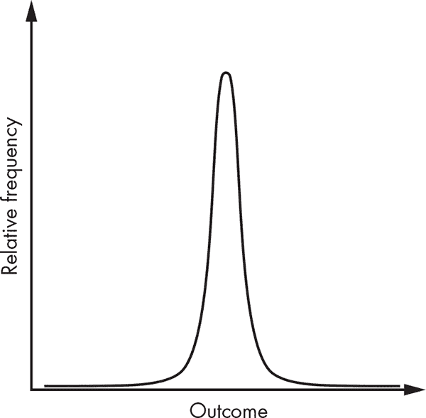
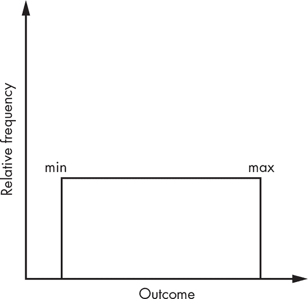

## 实用工具**

“*看，世界上有比我们更强大的东西。但如果你知道怎么搭顺风车，你就能去到任何地方，” Raven 说。

“没错，我完全理解你在说什么。”

— Neal Stephenson，《雪崩》


stdlib 和 Boost 库提供了大量满足常见编程需求的类型、类和函数。合起来，这些五花八门的工具被称为 *实用工具*。除了它们小巧、简洁且专注的特点，实用工具在功能上各不相同。

在本章中，你将学习几种简单的 *数据结构*，它们处理许多常见情境，其中你需要让对象包含其他对象。接下来是关于 *日期和时间* 的讨论，涵盖了若干编码日历和时钟的方式以及测量经过时间的手段。本章的最后，我们将深入了解许多可用的 *数值和数学工具*。

**注意**

*日期/时间和数值/数学的讨论将对某些读者非常有兴趣，而对其他人只是略有兴趣。如果你属于后者，可以随意浏览这些章节。*

### 数据结构

在这些库中，stdlib 和 Boost 提供了一个宝贵的有用的 *数据结构* 集合。*数据结构* 是一种存储对象并允许对这些存储对象进行一组操作的类型。并没有什么神奇的编译器魔法让本节中的实用数据结构工作；你完全可以在足够的时间和精力下实现你自己的版本。但是，为什么要重新发明轮子呢？

#### *tribool*

*tribool* 是一种类似 `bool` 的类型，支持三种状态，而不是两种：真、假和不确定。Boost 提供了 `<boost/logic/tribool.hpp>` 头文件中的 `boost::logic::tribool`。 示例 12-1 演示了如何使用 `true`、`false` 和 `boost::logic::indeterminate` 类型初始化 Boost 的 `tribool`。

```
#include <boost/logic/tribool.hpp>

using boost::logic::indeterminate; ➊
boost::logic::tribool t = true➋, f = false➌, i = indeterminate➍;
```

*示例 12-1：初始化 Boost `tribool`*

为了方便，`using` 声明将 `indeterminate` 从 `boost::logic` 中拉入 ➊。然后，你将 `tribool t` 初始化为 `true` ➋，`f` 初始化为 `false` ➌，`i` 初始化为 `indeterminate` ➍。

`tribool` 类会隐式转换为 `bool`。如果 `tribool` 是 `true`，它将转换为 `true`；否则，转换为 `false`。`tribool` 类还支持 `operator!`，当 `tribool` 为 `false` 时返回 `true`；否则返回 `false`。最后，`indeterminate` 支持 `operator()`，它接受一个 `tribool` 参数，如果该参数是 `indeterminate`，则返回 `true`；否则返回 `false`。

示例 12-2 采样了这些布尔转换。

```
TEST_CASE("Boost tribool converts to bool") {
  REQUIRE(t); ➊
  REQUIRE_FALSE(f); ➋
  REQUIRE(!f); ➌
  REQUIRE_FALSE(!t); ➍
  REQUIRE(indeterminate(i)); ➎
  REQUIRE_FALSE(indeterminate(t)); ➏
}
```

*示例 12-2：将 `tribool` 转换为 `bool`*

这个测试演示了 `bool` 转换 ➊➋、`operator!` ➌➍ 和 `indeterminate` ➍➎ 的基本结果。

##### 布尔操作

`tribool` 类支持所有布尔运算符。每当 `tribool` 表达式不涉及 `indeterminate` 值时，结果与等效的布尔表达式相同。当涉及 `indeterminate` 时，结果可以是 `indeterminate`，正如清单 12-3 所示。

```
TEST_CASE("Boost Tribool supports Boolean operations") {
  auto t_or_f = t || f;
  REQUIRE(t_or_f); ➊
  REQUIRE(indeterminate(t && indeterminate)); ➋
  REQUIRE(indeterminate(f || indeterminate)); ➌
  REQUIRE(indeterminate(!i)); ➍
}
```

*清单 12-3：`boost::tribool` 支持布尔操作。*

由于 `t` 和 `f` 都不是 `indeterminate`，因此 `t || f` 的求值就像普通的布尔表达式一样，所以 `t_or_f` 为 `true` ➊。涉及 `indeterminate` 的布尔表达式可能会得到 `indeterminate`。布尔与 ➋、或 ➌、非 ➍ 操作在没有足够信息的情况下会求值为 `indeterminate`。

##### 何时使用 tribool

除了描述薛定谔的猫的生死状态，你还可以在某些操作可能需要较长时间的设置中使用 `tribool`。在这种情况下，`tribool` 可以描述操作是否成功。一个 `indeterminate` 值可以表示操作仍在进行中。

`tribool` 类使得 `if` 语句变得简洁明了，正如清单 12-4 所示。

```
TEST_CASE("Boost Tribool works nicely with if statements") {
  if (i) FAIL("Indeterminate is true."); ➊
  else if (!i) FAIL("Indeterminate is false."); ➋
  else {} // OK, indeterminate ➌
}
```

*清单 12-4：使用 `if` 语句与 `tribool`*

第一个表达式 ➊ 仅在 `tribool` 为 `true` 时求值，第二个表达式 ➋ 仅在其为 `false` 时求值，第三个表达式 ➌ 仅在 `indeterminate` 情况下执行。

**注意**

*提到 `tribool` 可能会让你不禁皱眉头，心想，为什么不用整数表示，0 为 false，1 为 true，其他值为 indeterminate 呢？你可以这样做，但考虑到 `tribool` 类型支持所有常见的布尔操作，同时能正确传播 `indeterminate` 值。为什么要重新发明轮子呢？*

##### 部分支持的操作列表

表 12-1 提供了最常用的 `boost::tribool` 操作列表。在此表中，`tb` 是一个 `boost::tribool`。

**表 12-1：** 最常用的 `boost::tribool` 操作

| **操作** | **备注** |
| --- | --- |
| `tribool{}` `tribool{ false }` | 构造一个值为 `false` 的 `tribool`。 |
| `tribool{ true }` | 构造一个值为 `true` 的 `tribool`。 |
| `tribool{ indeterminate }` | 构造一个值为 `indeterminate` 的 `tribool`。 |
| tb`.safe_bool()` | 如果 tb 为 `true`，则结果为 `true`，否则为 `false`。 |
| `indeterminate(`tb`)` | 如果 tb 是 `indeterminate`，则结果为 `true`，否则为 `false`。 |
| !tb | 如果 tb 为 `false`，则结果为 `true`，否则为 `false`。 |
| tb1 `&&` tb2 | 如果 tb1 和 tb2 都为 `true`，则结果为 `true`；如果 tb1 或 tb2 为 `false`，则结果为 `false`；否则，结果为 `indeterminate`。 |
| tb1 `&#124;&#124;` tb2 | 如果 tb1 或 tb2 为 `true`，则结果为 `true`；如果 tb1 和 tb2 都为 `false`，则结果为 `false`；否则，结果为 `indeterminate`。 |
| `bool{` tb `}` | 如果 tb 为 true，则结果为 `true`，否则为 `false`。 |

#### *可选*

*optional* 是一个类模板，包含一个可能存在也可能不存在的值。`optional` 的主要使用场景是作为可能失败的函数的返回类型。与其抛出异常或返回多个值，不如让函数返回一个 `optional`，如果函数成功执行，`optional` 会包含一个值。

标准库在 `<optional>` 头文件中提供了 `std::optional`，Boost 在 `<boost/optional.hpp>` 头文件中提供了 `boost::optional`。

考虑 清单 12-5 中的设置。`take` 函数仅在你选择 `Pill::Blue` 时才返回一个 `TheMatrix` 实例；否则，`take` 返回一个 `std::nullopt`，这是一个未初始化状态的标准库提供的 `std::optional` 类型常量。

```
#include <optional>

struct TheMatrix { ➊
  TheMatrix(int x) : iteration { x } { }
  const int iteration;
};

enum Pill { Red, Blue }; ➋

std::optional<TheMatrix>➌ take(Pill pill➍) {
  if(pill == Pill::Blue) return TheMatrix{ 6 }; ➎
  return std::nullopt; ➏
}
```

*清单 12-5：一个返回 `std::optional` 的 `take` 函数*

`TheMatrix` 类型接受一个 `int` 类型的构造函数参数，并将其存储到 `iteration` 成员中 ➊。`enum` 类型 `Pill` 包含 `Red` 和 `Blue` 两个值 ➋。`take` 函数返回一个 `std::optional<TheMatrix>` ➌，并接受一个 `Pill` 类型的参数 ➍。如果传入 `Pill::Blue` 给 `take` 函数，它会返回一个 `TheMatrix` 实例 ➎；否则，它会返回一个 `std::nullopt` ➏。

首先，参考 清单 12-6，你选择了蓝色药丸。

```
TEST_CASE("std::optional contains types") {
  if (auto matrix_opt = take(Pill::Blue)) { ➊
    REQUIRE(matrix_opt->iteration == 6); ➋
    auto& matrix = matrix_opt.value(); 
    REQUIRE(matrix.iteration == 6); ➌
  } else {
    FAIL("The optional evaluated to false.");
  }
}
```

*清单 12-6：测试探索 `std::optional` 类型与 `Pill::Blue` 的使用*

你选择了蓝色药丸，结果是 `std::optional` 结果中包含一个初始化的 `TheMatrix`，因此 `if` 语句的条件表达式会计算为 `true` ➊。清单 12-6 还演示了如何使用 `operator->` ➋ 和 `value()` ➌ 来访问底层值。

那么，选择红色药丸会发生什么呢？参考 清单 12-7。

```
TEST_CASE("std::optional can be empty") {
  auto matrix_opt = take(Pill::Red); ➊
  if (matrix_opt) FAIL("The Matrix is not empty."); ➋
  REQUIRE_FALSE(matrix_opt.has_value()); ➌
}
```

*清单 12-7：测试探索 `std::optional` 类型与 `Pill::Red`*

你选择了红色药丸 ➊，结果是 `matrix_opt` 为空。这意味着 `matrix_opt` 转换为 `false` ➋，并且 `has_value()` 也返回 `false` ➌。

##### 部分支持的操作列表

表 12-2 提供了最常见的 `std::optional` 操作列表。在此表中，`opt` 是 `std::optional<T>` 类型，`t` 是类型为 `T` 的对象。

**表 12-2：** 最常见的 `std::optional` 操作

| **操作** | **备注** |
| --- | --- |
| `optional<T>{}` `optional<T>{std::nullopt}` | 构造一个空的 `optional`。 |
| `optional<T>{` opt `}` | 从 opt 复制构造一个 `optional`。 |
| `optional<T>{ move(`opt`) }` | 从 opt 移动构造一个 `optional`，构造完成后 opt 为空。 |
| `optional<T>{` `t` `}` opt `=` t | 将 t 复制到 `optional` 中。 |
| `optional<T>{ move(``t``) }` opt = `move(`t`)` | 将 t 移动到 `optional` 中。 |
| opt`->`mbr | 成员解引用；访问由 opt 包含的对象的 mbr 成员。 |
| `*`opt opt`.value()` | 返回对 opt 中包含的对象的引用；`value()` 检查是否为空，并抛出 `bad_optional_access` 异常。 |
| opt`.value_or(`T`{ ... })` | 如果 `opt` 包含对象，则返回该对象的副本；否则返回该参数。 |
| `bool{` opt `}` opt`.has_value()` | 如果 `opt` 包含对象，则返回 `true`；否则返回 `false`。 |
| opt1`.swap(`opt2`)` `swap(`opt1`,` opt2`)` | 交换 `opt1` 和 `opt2` 中包含的对象。 |
| opt`.reset()` | 销毁 `opt` 中包含的对象，`opt` 在 `reset` 后为空。 |
| opt`.emplace(...)` | 在原地构造一个类型，将所有参数转发给适当的构造函数。 |
| `make_optional<T>(...)` | 构造 `optional` 的便捷函数；将参数转发给适当的构造函数。 |
| opt1 `==` opt2opt1 `!=` opt2opt1 `>` opt2opt1 `>=` opt2opt1 `<` opt2opt1 `<=` opt2 | 在评估两个 `optional` 对象的相等性时，如果两个都为空或都包含对象且这些对象相等，则返回 `true`；否则返回 `false`。进行比较时，空的 `optional` 总是小于包含值的 `optional`。否则，结果是比较所包含的类型。 |

#### *pair*

*pair* 是一个类模板，包含两个不同类型的对象作为一个整体。对象是有序的，你可以通过 `first` 和 `second` 成员访问它们。`pair` 支持比较运算符，具有默认的复制/移动构造函数，并支持结构化绑定语法。

标准库在 `<utility>` 头文件中有 `std::pair`，而 Boost 在 `<boost/pair.hpp>` 头文件中有 `boost::pair`。

**注意**

*Boost 还在 `<boost/compressed_pair.hpp>` 头文件中提供了 `boost::compressed_pair`。当其中一个成员为空时，它会稍微更高效。*

首先，你创建一些简单的类型来构造一个对，例如清单 12-8 中的简单 `Socialite` 和 `Valet` 类。

```
#include <utility>

struct Socialite { const char* birthname; };
struct Valet { const char* surname; };
Socialite bertie{ "Wilberforce" };
Valet reginald{ "Jeeves" };
```

*清单 12-8：`Socialite` 和 `Valet` 类*

现在你已经拥有了 `Socialite` 和 `Valet` 类型的对象 `bertie` 和 `reginald`，你可以构造一个 `std::pair` 并尝试提取元素。清单 12-9 使用 `first` 和 `second` 成员来访问所包含的类型。

```
TEST_CASE("std::pair permits access to members") {
  std::pair<Socialite, Valet> inimitable_duo{ bertie, reginald }; ➊
  REQUIRE(inimitable_duo.first.birthname == bertie.birthname); ➋
  REQUIRE(inimitable_duo.second.surname == reginald.surname); ➌
}
```

*清单 12-9：`std::pair` 支持成员提取。*

你通过传入想要复制的对象来构造一个 `std::pair` ➊。你可以使用 `std::pair` 的 `first` 和 `second` 成员从 `inimitable_duo` 中提取出 `Socialite` ➋ 和 `Valet` ➌。然后，你可以将它们的 `birthname` 和 `surname` 成员与原始数据进行比较。

清单 12-10 显示了 `std::pair` 成员提取和结构化绑定语法。

```
TEST_CASE("std::pair works with structured binding") {
  std::pair<Socialite, Valet> inimitable_duo{ bertie, reginald };
  auto& [idle_rich, butler] = inimitable_duo; ➊
  REQUIRE(idle_rich.birthname == bertie.birthname); ➋
  REQUIRE(butler.surname == reginald.surname); ➌
}
```

*清单 12-10：`std::pair` 支持结构化绑定语法。*

在这里，你使用结构化绑定语法 ➊ 将 `inimitable_duo` 的 `first` 和 `second` 成员的引用提取到 `idle_rich` 和 `butler` 中。正如清单 12-9 所示，你确保 `birthname` ➋ 和 `surname` ➌ 与原始数据匹配。

##### 支持操作的部分列表

表 12-3 提供了最常见的`std::pair`操作列表。在此表中，`pr`是一个`std::pair<A, B>`，`a`是`A`类型的对象，`b`是`B`类型的对象。

**表 12-3：** 最常见的`std::pair`操作

| **操作** | **说明** |
| --- | --- |
| `pair<...>{}` | 构造一个空的`pair`。 |
| `pair<...>{` pr `}` | 从 pr 进行复制构造。 |
| `pair<...>{ move(`pr`) }` | 从 pr 进行移动构造。 |
| `pair<...>{` a`,` b `}` | 通过复制 a 和 b 构造一个`pair`。 |
| `pair<...>{ move(`a`), move(`b`) }` | 通过移动 a 和 b 构造一个`pair`。 |
| pr1 `=` pr2 | 从 pr2 进行复制赋值。 |
| pr1 = `move(`pr2`)` | 从 pr2 进行移动赋值。 |
| pr`.first` `get<0>(`pr`)` | 返回对`first`元素的引用。 |
| pr`.second` `get<1>(`pr`)` | 返回对`second`元素的引用。 |
| `get<`T`>(`pr`)` | 如果`first`和`second`具有不同类型，返回类型 T 的元素的引用。 |
| pr1`.swap(`pr2`)` `swap(`pr1`,` pr2`)` | 交换 pr1 和 pr2 所包含的对象。 |
| `make_pair<...>(`a`,` b`)` | 构造`pair`的便利函数。 |
| pr1 `==` pr2pr1 `!=` pr2pr1 `>` pr2pr1 `>=` pr2pr1 `<` pr2pr1 `<=` pr2 | 如果`first`和`second`都相等，则相等。大于/小于比较从`first`开始。如果`first`成员相等，则比较`second`成员。 |

#### *tuple*

*tuple*是一个类模板，接受任意数量的异质元素。它是`pair`的泛化，但`tuple`不像`pair`那样暴露其成员为`first`、`second`等。相反，你使用非成员函数模板`get`来提取元素。

标准库提供了`std::tuple`和`std::get`在`<tuple>`头文件中，Boost 提供了`boost::tuple`和`boost::get`在`<boost/tuple/tuple.hpp>`头文件中。

让我们添加一个第三个类，`Acquaintance`，来测试一个`tuple`：

```
struct Acquaintance { const char* nickname; };
Acquaintance hildebrand{ "Tuppy" };
```

要提取这些元素，你有两种使用`get`的方式。在主要情况下，你可以始终提供一个对应于你要提取的元素的零基索引的模板参数。如果`tuple`不包含具有相同类型的元素，你还可以提供一个对应于你要提取的元素类型的模板参数，如列表 12-11 所示。

```
TEST_CASE("std::tuple permits access to members with std::get") {
  using Trio = std::tuple<Socialite, Valet, Acquaintance>;
  Trio truculent_trio{ bertie, reginald, hildebrand };
  auto& bertie_ref = std::get<0>(truculent_trio); ➊
  REQUIRE(bertie_ref.birthname == bertie.birthname);

  auto& tuppy_ref = std::get<Acquaintance>(truculent_trio); ➋
  REQUIRE(tuppy_ref.nickname == hildebrand.nickname);
}
```

*列表 12-11：`std::tuple`支持成员提取和结构绑定语法。*

你可以通过与构建`std::pair`类似的方式构建`std::tuple`。首先，使用`get<0>`提取`Socialite`成员 ➊。由于`Socialite`是第一个模板参数，因此使用 0 作为`std::get`模板参数。然后，使用`std::get<Acquaintance>`提取`Acquaintance`成员 ➋。由于只有一个`Acquaintance`类型的元素，你可以使用这种`get`访问模式。

像`pair`一样，`tuple`也允许使用结构绑定语法。

##### 支持操作的部分列表

表 12-4 列出了最常用的`std::tuple`操作。在此表中，`tp`是一个`std::tuple<A, B>`，`a`是类型为`A`的对象，`b`是类型为`B`的对象。

**表 12-4：** 最常用的`std::tuple`操作

| **操作** | **说明** |
| --- | --- |
| `tuple<...>{` [alc] `}` | 构造一个空的`tuple`。默认使用`std::allocate`作为分配器 alc。 |
| `tuple<...>{` [alc]`,` tp `}` | 从 tp 复制构造。默认使用`std::allocate`作为分配器 alc。 |
| `tuple<...>{` [alc]`,move(`tp`) }` | 从 tp 移动构造。默认使用`std::allocate`作为分配器 alc。 |
| `tuple<...>{` [alc]`,` a`,` b `}` | 通过复制 a 和 b 构造一个`tuple`。默认使用`std::allocate`作为分配器 alc。 |
| `tuple<...>{` [alc]`, move(`a`), move(`b`) }` | 通过移动 a 和 b 构造一个`tuple`。默认使用`std::allocate`作为分配器 alc。 |
| tp1 `=` tp2 | 从 tp2 复制赋值。 |
| tp1 = `move(`tp2`)` | 从 tp2 移动赋值。 |
| `get<`i`>(`tp`)` | 返回第 i 个元素的引用（从零开始）。 |
| `get<`T`>(`tp`)` | 返回类型为 T 的元素的引用。如果有多个元素共享此类型，编译会失败。 |
| tp1`.swap(`tp2`)` `swap(`tp1`,` tp2`)` | 交换 tp1 和 tp2 中包含的对象。 |
| `make_tuple<...>(`a`,` b`)` | 用于构造`tuple`的便捷函数。 |
| `tuple_cat<...>(`tp1`,` tp2`)` | 连接所有作为参数传入的 tuple。 |
| tp1 `==` tp2tp1 `!=` tp2tp1 `>` tp2tp1 `>=` tp2tp1 `<` tp2tp1 `<=` tp2 | 如果所有元素相等，则为相等。大于/小于的比较从第一个元素到最后一个元素进行。 |

#### *any*

*any*是一个类，用于存储任何类型的单个值。它*不是*一个类模板。要将`any`转换为具体类型，你使用*any cast*，它是一个非成员函数模板。任何类型转换都是类型安全的；如果你尝试转换`any`且类型不匹配，将抛出异常。使用`any`，你可以进行某些类型的泛型编程，而*无需模板*。

标准库中有`std::any`（在`<any>`头文件中），而 Boost 库中有`boost::any`（在`<boost/any.hpp>`头文件中）。

要将一个值存储到`any`中，使用`emplace`方法模板。它接受一个模板参数，对应你想要存储到`any`中的类型（即*存储类型*）。你传递给`emplace`的任何参数都会转发到给定存储类型的适当构造函数中。要提取值，使用`any_cast`，它接受一个模板参数，对应`any`当前的存储类型（称为`any`的*状态*）。你将`any`作为唯一参数传递给`any_cast`。只要`any`的状态与模板参数匹配，你就能获得所需的类型。如果状态不匹配，会抛出`bad_any_cast`异常。

列表 12-12 演示了与`std::any`的这些基本交互。

```
#include <any>

struct EscapeCapsule {
  EscapeCapsule(int x) : weight_kg{ x } { }
  int weight_kg;
}; ➊

TEST_CASE("std::any allows us to std::any_cast into a type") {
  std::any hagunemnon; ➋
  hagunemnon.emplace<EscapeCapsule>(600); ➌
  auto capsule = std::any_cast<EscapeCapsule>(hagunemnon); ➍
  REQUIRE(capsule.weight_kg == 600);
  REQUIRE_THROWS_AS(std::any_cast<float>(hagunemnon), std::bad_any_cast); ➎
}
```

*列表 12-12：`std::any`和`std::any_cast`允许你提取具体类型。*

你声明了`EscapeCapsule`类 ➊。在测试中，你构造了一个名为`hagunemnon`的空`std::any`对象 ➋。接下来，你使用`emplace`存储了一个`weight_kg = 600`的`EscapeCapsule`对象 ➌。你可以使用`std::any_cast`将`EscapeCapsule`取回，存储到一个名为`capsule`的新`EscapeCapsule`对象中 ➍。最后，你展示了尝试将`hagunemnon`转换为`float`类型时会导致`std::bad_any_cast`异常的情况 ➎。

##### 支持操作的部分列表

表 12-5 提供了最受支持的`std::any`操作列表。在这个表中，ay 是一个`std::any`对象，t 是类型为 T 的对象。

**表 12-5：** 最受支持的`std::any`操作

| **操作** | **注释** |
| --- | --- |
| `any{}` | 构造一个空的`any`对象。 |
| `any{` ay `}` | 从 ay 进行复制构造。 |
| `any{ move(`ay`) }` | 从 ay 进行移动构造。 |
| `any{ move(`t`) }` | 构造一个包含从 t 原地构造的对象的`any`对象。 |
| ay `=` t | 销毁当前由 ay 包含的对象；复制 t。 |
| ay `= move(`t`)` | 销毁当前由 ay 包含的对象；移动 t。 |
| ay1 `=` ay2 | 从 ay2 进行复制赋值。 |
| ay1 `= move(`ay2`)` | 从 ay2 进行移动赋值。 |
| ay`.emplace<`T`>(...)` | 销毁当前由 ay 包含的对象；在原地构造一个 T 对象，将参数`...`转发给适当的构造函数。 |
| ay`.reset()` | 销毁当前包含的对象。 |
| ay1`.swap(`ay2`)` `swap(`ay1`,` ay2`)` | 交换 ay1 和 ay2 包含的对象。 |
| `make_any<`T`>(...)` | 用于构造`any`的便利函数，在原地构造一个 T 对象，将参数`...`转发给适当的构造函数。 |
| t `= any_cast<`T`>(`ay`)` | 将 ay 转换为类型 T。如果类型 T 与包含对象的类型不匹配，则抛出`std::bad_any_cast`异常。 |

#### *variant*

*variant*是一个类模板，用于存储类型受限于用户定义的模板参数列表的单个值。variant 是类型安全的`union`（参见“Unions”第 53 页）。它与`any`类型共享许多功能，但`variant`要求您明确列举所有要存储的类型。

标准库中在`<variant>`头文件中有`std::variant`，Boost 库中在`<boost/variant.hpp>`头文件中有`boost::variant`。

清单 12-13 演示了创建另一个名为`BugblatterBeast`的类型，以便`variant`可以与`EscapeCapsule`一起包含。

```
#include <variant>

struct BugblatterBeast {
  BugblatterBeast() : is_ravenous{ true }, weight_kg{ 20000 } { }
  bool is_ravenous;
  int weight_kg; ➊
};
```

*清单 12-13：`std::variant`可以包含预定义类型列表中的一个对象。*

除了还包含一个`weight_kg`成员变量 ➊，`BugblatterBeast`与`EscapeCapsule`完全独立。

##### 构造 variant

`variant`只有在满足以下两个条件之一时才能进行默认构造：

+   第一个模板参数是默认可构造的。

+   它是`monostate`，一个旨在表明 variant 可以具有空状态的类型。

因为`BugblatterBeast`是可默认构造的（意味着它有一个默认构造函数），将其作为模板参数列表中的第一个类型，使得你的 variant 也可以默认构造，如下所示：

```
std::variant<BugblatterBeast, EscapeCapsule> hagunemnon;
```

要将一个值存储到`variant`中，你使用`emplace`方法模板。与`any`一样，`variant`接受一个模板参数，表示你希望存储的类型。这个模板参数必须包含在`variant`的模板参数列表中。要提取一个值，你可以使用非成员函数模板`get`或`get_if`。这些函数接受所需类型或模板参数列表中的索引，表示所需类型。如果`get`失败，它会抛出一个`bad_variant_access`异常，而`get_if`返回一个`nullptr`。

你可以使用`index()`成员函数来确定与`variant`当前状态对应的类型，它返回当前对象类型在模板参数列表中的索引。

列出 12-14 展示了如何使用`emplace`来更改`variant`的状态，并使用`index`来确定包含对象的类型。

```
TEST_CASE("std::variant") {
  std::variant<BugblatterBeast, EscapeCapsule> hagunemnon;
  REQUIRE(hagunemnon.index() == 0); ➊

  hagunemnon.emplace<EscapeCapsule>(600); ➋
  REQUIRE(hagunemnon.index() == 1); ➌

  REQUIRE(std::get<EscapeCapsule>(hagunemnon).weight_kg == 600); ➍
  REQUIRE(std::get<1>(hagunemnon).weight_kg == 600); ➎
  REQUIRE_THROWS_AS(std::get<0>(hagunemnon), std::bad_variant_access); ➏
}
```

*列出 12-14：`std::get`允许你从`std::variant`中提取具体类型。*

在默认构造`hagunemnon`之后，调用`index`返回 0，因为这是正确模板参数的索引➊。接下来，你插入一个`EscapeCapsule` ➋，这使得`index`返回 1➌。`std::get<EscapeCapsule>` ➍和`std::get<1>` ➎都展示了提取包含类型的相同方法。最后，尝试调用`std::get`来获取一个与`variant`当前状态不符的类型会导致抛出`bad_variant_access`异常➏。

你可以使用非成员函数`std::visit`将一个可调用对象应用到一个 variant。这有一个优点，即可以派发正确的函数来处理包含的对象，而不必通过`std::get`显式指定类型。列出 12-15 展示了基本用法。

```
TEST_CASE("std::variant") {
  std::variant<BugblatterBeast, EscapeCapsule> hagunemnon;
  hagunemnon.emplace<EscapeCapsule>(600); ➊
  auto lbs = std::visit([](auto& x) { return 2.2*x.weight_kg; }, hagunemnon); ➋
  REQUIRE(lbs == 1320); ➌
}
```

*列出 12-15：`std::visit`允许你将一个可调用对象应用到`std::variant`的包含类型。*

首先，你调用`emplace`将值 600 存储到`hagunemnon` ➊中。因为`BugblatterBeast`和`EscapeCapsule`都有一个`weight_kg`成员，你可以使用`std::visit`在`hagunemnon`上调用一个 lambda，该 lambda 执行正确的转换（每公斤 2.2 磅）到`weight_kg`字段➋并返回结果➌（注意你不需要包含任何类型信息）。

##### 比较 variant 和 any

宇宙足够大，可以容纳`any`和`variant`。通常无法推荐一个优于另一个，因为它们各自有其优缺点。

`any`更为灵活；它可以接受*任何*类型，而`variant`只能包含一个预定类型的对象。它通常避免使用模板，因此一般来说编程更为简单。

`variant` 的灵活性较差，因此更安全。通过使用 `visit` 函数，你可以在编译时检查操作的安全性。使用 `any` 时，你需要构建自己的类似 `visit` 的功能，并且需要在运行时检查（例如，检查 `any_cast` 的结果）。

最后，`variant` 比 `any` 更具性能优势。尽管当包含的类型过大时，`any` 可以执行动态分配，但 `variant` 不会这样做。

##### 部分支持的操作列表

表 12-6 提供了最常见的 `std::variant` 操作列表。在该表中，`vt` 是一个 `std::variant`，`t` 是类型为 `T` 的对象。

**表 12-6：** 最常用的 `std::variant` 操作

| **操作** | **备注** |
| --- | --- |
| `variant<...>{}` | 构造一个空的 `variant` 对象。第一个模板参数必须是可默认构造的。 |
| `variant<...>{` vt `}` | 从 vt 复制构造。 |
| `variant<...>{ move(`vt`) }` | 从 vt 移动构造。 |
| `variant<...>{ move(`t`) }` | 构造一个包含原地构造对象的 `variant` 对象。 |
| vt `=` t | 解构当前由 vt 包含的对象；复制 t。 |
| vt `= move(`t`)` | 解构当前由 vt 包含的对象；移动 t。 |
| vt1 `=` vt2 | 从 vt2 复制赋值。 |
| vt1 `= move(`vt2`)` | 从 vt2 移动赋值。 |
| vt`.emplace<`T`>(...)` | 解构当前由 vt 包含的对象；在原地构造一个 T，并将参数 `...` 转发给适当的构造函数。 |
| vt`.reset()` | 销毁当前包含的对象。 |
| vt`.index()` | 返回当前包含对象类型的零基索引。（顺序由 `std::variant` 的模板参数确定。） |
| vt1`.swap(`vt2`)` `swap(`vt1`,` vt2`)` | 交换 vt1 和 vt2 中包含的对象。 |
| `make_variant<`T`>(...)` | 用于构造 `tuple` 的便捷函数；在原地构造一个 T，并将参数 `...` 转发给适当的构造函数。 |
| `std::visit(`vt`,` callable`)` | 使用包含的对象调用 callable。 |
| `std::holds_alternative<`T`>(`vt`)` | 如果包含的对象类型是 T，则返回 `true`。 |
| `std::get<`I`>(`vt`)` `std::get<`T`>(`vt`)` | 如果包含的对象类型是 T 或第 i 种类型，则返回该对象。否则，抛出 std::bad_variant_access 异常。 |
| `std::get_if<`I`>(&`vt`)` `std::get_if<`T`>(&`vt`)` | 如果包含的对象类型是 T 或第 i 种类型，则返回指向该对象的指针。否则，返回 `nullptr`。 |
| vt1 `==` vt2 vt1 `!=` vt2 vt1 `>` vt2 vt1 `>=` vt2 vt1 `<` vt2 vt1 `<=` vt2 | 比较 vt1 和 vt2 中包含的对象。 |

### 日期和时间

在标准库和 Boost 之间，有许多库可以处理日期和时间。当处理日历日期和时间时，可以查看 Boost 的 DateTime 库。当你需要获取当前时间或测量经过时间时，可以查看 Boost 或标准库的 Chrono 库，以及 Boost 的 Timer 库。

#### *Boost DateTime*

Boost DateTime 库通过一个基于格里历的丰富系统支持日期编程，格里历是全球最广泛使用的民用历法。日历比表面看起来更复杂。例如，考虑以下摘自美国海军天文台的《日历简介》的段落，它描述了闰年的基本知识：

每一个能被 4 整除的年份都是闰年，除了能被 100 整除的年份，但这些世纪年份如果能被 400 整除，则为闰年。例如，1700 年、1800 年和 1900 年不是闰年，但 2000 年是闰年。

与其尝试自己构建太阳历函数，不如包含 DateTime 的日期编程功能，使用以下头文件：

```
#include <boost/date_time/gregorian/gregorian.hpp>
```

你将使用的主要类型是`boost::gregorian::date`，它是日期编程的主要接口。

##### 构造日期

有几种构造`date`的选项。你可以默认构造一个`date`，其值为特殊日期`boost::gregorian::not_a_``date_time`。要构造一个有效日期的`date`，你可以使用一个接受三个位数参数的构造函数：年份、月份和日期。以下语句构造了一个日期为 1986 年 9 月 15 日的`date d`：

```
boost::gregorian::date d{ 1986, 9, 15 };
```

另外，你可以使用`boost::gregorian::from_string`工具函数从字符串构造日期，如下所示：

```
auto d = boost::gregorian::from_string("1986/9/15");
```

如果你传递一个无效的日期，`date`构造函数将抛出一个异常，如`bad_year`、`bad_day_of_month`或`bad_month`。例如，示例 12-16 试图构造一个日期为 1986 年 9 月 32 日的日期。

```
TEST_CASE("Invalid boost::Gregorian::dates throw exceptions") {
  using boost::gregorian::date;
  using boost::gregorian::bad_day_of_month;

  REQUIRE_THROWS_AS(date(1986, 9, 32), bad_day_of_month); ➊
}
```

*示例 12-16：`boost::gregorian::date`构造函数会对无效日期抛出异常。*

因为 9 月 32 日不是一个有效的日期，`date`构造函数会抛出`bad_day_of_month`异常 ➊。

**注意**

*由于 Catch 的限制，你不能在`REQUIRE_THROWS_AS`宏中使用大括号初始化日期* ➊。

你可以通过非成员函数`boost::gregorian::day_clock::local_day`或`boost::gregorian::day_clock::universal_day`来获取当前日期，分别获取基于系统时区设置的本地日期和 UTC 日期：

```
auto d_local = boost::gregorian::day_clock::local_day();
auto d_univ = boost::gregorian::day_clock::universal_day();
```

一旦构造了一个日期，你不能改变它的值（它是*不可变的*）。然而，日期支持复制构造和复制赋值。

##### 访问日期成员

你可以通过日期的许多`const`方法来检查一个`date`的特性。表 12-7 提供了部分列表。在这个表中，`d`是一个`date`。

**表 12-7：** 支持最多的`boost::gregorian::date`访问器

| **访问器** | **说明** |
| --- | --- |
| d`.year()` | 返回`date`的年份部分。 |
| d`.month()` | 返回`date`的月份部分。 |
| d`.day()` | 返回`date`的天数部分。 |
| d`.day_of_week()` | 返回一周中的星期几，作为`greg_day_of_week`类型的`enum`。 |
| d`.day_of_year()` | 返回一年中的第几天（从 1 到 366）。 |
| d`.end_of_month()` | 返回一个设置为 d 所在月份最后一天的日期对象。 |
| d`.is_not_a_date()` | 如果 d 不是一个日期，返回 `true`。 |
| d`.week_number()` | 返回 ISO 8601 周数。 |

清单 12-17 展示了如何构造一个 `date` 并使用 表格 12-7 中的访问器。

```
TEST_CASE("boost::gregorian::date supports basic calendar functions") {
  boost::gregorian::date d{ 1986, 9, 15 }; ➊
  REQUIRE(d.year() == 1986); ➋
  REQUIRE(d.month() == 9); ➌
  REQUIRE(d.day() == 15); ➍
  REQUIRE(d.day_of_year() == 258); ➎
  REQUIRE(d.day_of_week() == boost::date_time::Monday); ➏
}
```

*清单 12-17：`boost::gregorian::date` 支持基本的日历功能。*

在这里，你构造了一个表示 1986 年 9 月 15 日的 `date` ➊。然后，从中提取出年份 ➋、月份 ➌、日期 ➍、年份中的天数 ➎ 和星期几 ➏。

##### 日历运算

你可以对日期进行简单的日历运算。当你将一个日期减去另一个日期时，得到的是一个 `boost::gregorian::date_duration`。`date_duration` 的主要功能是存储一个整数天数，你可以通过 `days` 方法提取出来。清单 12-18 展示了如何计算两个 `date` 对象之间的天数差。

```
TEST_CASE("boost::gregorian::date supports calendar arithmetic") {
  boost::gregorian::date d1{ 1986, 9, 15 }; ➊
  boost::gregorian::date d2{ 2019, 8, 1 }; ➋
  auto duration = d2 - d1; ➌
  REQUIRE(duration.days() == 12008); ➍
}
```

*清单 12-18：减去 `boost::gregorian::date` 对象得到一个 `boost::gregorian::date_duration`。*

在这里，你构造了一个表示 1986 年 9 月 15 日的 `date` ➊ 和一个表示 2019 年 8 月 1 日的 `date` ➋。你将这两个日期相减，得到一个 `date_duration` ➌。使用 `days` 方法，你可以提取这两个日期之间的天数 ➍。

你也可以使用一个表示天数的 `long` 参数来构造一个 `date_duration`。你可以将一个 `date_duration` 加到一个日期上，得到另一个日期，正如 清单 12-19 所展示的那样。

```
TEST_CASE("date and date_duration support addition") {
  boost::gregorian::date d1{ 1986, 9, 15 }; ➊
  boost::gregorian::date_duration dur{ 12008 }; ➋
  auto d2 = d1 + dur; ➌
  REQUIRE(d2 == boost::gregorian::from_string("2019/8/1")); ➍
}
```

*清单 12-19：将一个 `date_duration` 加到一个 `date` 上得到另一个 `date`。*

你构造了一个表示 1986 年 9 月 15 日的 `date` ➊ 和一个表示 12008 天的 `duration` ➋。根据 清单 12-18，你知道这一天加上 12008 天将得到 2019 年 8 月 1 日。因此，将它们相加后 ➌，得到的日期符合预期 ➍。

##### 日期区间

*日期区间* 表示两个日期之间的时间间隔。DateTime 提供了一个 `boost::gregorian::date_period` 类，具有三个构造函数，如 表格 12-8 中所描述。在此表格中，构造函数 `d1` 和 `d2` 是 `date` 类型的参数，`dp` 是一个 `date_period`。

**表格 12-8：** 支持的 `boost::gregorian::date_period` 构造函数

| **访问器** | **说明** |
| --- | --- |
| `date_period{` d1`,` d2 `}` | 创建一个包括 d1 但不包括 d2 的时间段；如果 d2 <= d1，则无效。 |
| `date_period{` d`,` n_days `}` | 创建一个从 d 到 d+n_days 的时间段。 |
| `date_period{` dp `}` | 复制构造函数。 |

`date_period` 类支持许多操作，例如 `contain` 方法，它接受一个 `date` 参数，如果该参数包含在 `period` 中，则返回 `true`。清单 12-20 展示了这个操作。

```
TEST_CASE(+boost::gregorian::date supports periods+) {
  boost::gregorian::date d1{ 1986, 9, 15 }; ➊
  boost::gregorian::date d2{ 2019, 8, 1 }; ➋
  boost::gregorian::date_period p{ d1, d2 }; ➌
  REQUIRE(p.contains(boost::gregorian::date{ 1987, 10, 27 })); ➍
}
```

*清单 12-20：使用 `contains` 方法判断一个日期是否在特定时间区间内，应用于 `boost::gregorian::date_period`*

在这里，你构造了两个日期，1986 年 9 月 15 日 ➊ 和 2019 年 8 月 1 日 ➋，然后用它们构造一个 `date_period` ➌。使用 `contains` 方法，你可以确定 `date_period` 包含了 1987 年 10 月 27 日 ➍ 这个日期。

表 12-9 包含了其他一些 `date_period` 操作的部分列表。在此表中，`p`、`p1` 和 `p2` 是 `date_period` 类，而 `d` 是一个 `date`。

**表 12-9：** 支持的 `boost::gregorian::date_period` 操作

| **访问器** | **说明** |
| --- | --- |
| p`.begin()` | 返回第一个日期。 |
| p`.last()` | 返回最后一天。 |
| p`.length()` | 返回包含的天数。 |
| p`.is_null()` | 如果时间段无效（例如，结束时间在开始时间之前），返回 `true`。 |
| p`.contains(`d`)` | 如果 d 在 p 内，返回 `true`。 |
| p1`.contains(`p2`)` | 如果 p2 的所有部分都在 p1 内，返回 `true`。 |
| p1`.intersects(`p2`)` | 如果 p2 中的任何部分落在 p1 中，返回 `true`。 |
| p`.is_after(`d`)` | 如果 p 在 d 之后，返回 `true`。 |
| p`.is_before(`d`)` | 如果 p 在 d 之前，返回 `true`。 |

### 其他 DateTime 特性

Boost 的 DateTime 库包含了三大类编程：

**日期** 日期编程就是你刚才了解的基于日历的编程。

**时间** 时间编程允许你处理具有微秒分辨率的时钟，位于 `<boost/date_time/posix_time/posix_time.hpp>` 头文件中。其原理与日期编程类似，但你处理的是时钟而非公历。

**本地时间** 本地时间编程仅仅是具有时区意识的时间编程。它位于 `<boost/date_time/time_zone_base.hpp>` 头文件中。

**注意**

*为了简洁起见，本章不会详细讨论时间和本地时间编程。有关信息和示例，请参见 Boost 文档。*

#### *Chrono*

stdlib 的 Chrono 库提供了多种时钟，位于 `<chrono>` 头文件中。当你需要编写依赖时间的程序或对代码进行计时时，通常会使用这些时钟。

**注意**

*Boost 还提供了一个位于 `<boost/chrono.hpp>` 头文件中的 Chrono 库。它是 stdlib Chrono 库的超集，包含了例如进程特定时钟、线程特定时钟以及用户定义的时间输出格式等功能。*

##### 时钟

Chrono 库中有三种时钟可供使用；每种时钟提供不同的保证，且都位于 `std::chrono` 命名空间中：

+   `std::chrono::system_clock` 是系统范围的实时时钟。有时也称为 *挂钟*，即从特定实现的开始日期算起的实际经过时间。大多数实现都指定从 Unix 开始日期 1970 年 1 月 1 日午夜起算。

+   `std::chrono::steady_clock` 保证它的值永远不会减少。这看起来可能是一个荒谬的保证，但计量时间比看起来复杂。比如，系统可能需要处理闰秒或不准确的时钟。

+   `std::chrono::high_resolution_clock` 具有最短的*滴答*周期：滴答是时钟能够测量的最小原子变化。

这三种时钟都支持静态成员函数 `now`，该函数返回一个时间点，表示当前时钟的时间值。

##### 时间点

*时间点* 表示一个特定时刻，Chrono 使用 `std::chrono::time_point` 类型来编码时间点。从用户的角度来看，`time_point` 对象非常简单。它们提供了一个 `time_since_epoch` 方法，返回从时间点到时钟的*纪元*之间经过的时间。这个经过的时间称为*时长*。

纪元是一个实现定义的参考时间点，表示时钟的起始点。Unix 纪元（或 POSIX 时间）从 1970 年 1 月 1 日开始，而 Windows 纪元从 1601 年 1 月 1 日开始（对应于 400 年公历周期的开始）。

`time_since_epoch` 方法并不是从 `time_point` 获取时长的唯一方法。你还可以通过相减两个 `time_point` 对象来获取它们之间的时长。

##### 时长

`std::chrono::duration` 表示两个 `time_point` 对象之间的时间。时长暴露了一个 `count` 方法，用于返回该时长中的时钟滴答数。

清单 12-21 显示了如何从三种可用的时钟中获取当前时间，提取每个时钟纪元以来的时长，并将它们转换为滴答数。

```
TEST_CASE("std::chrono supports several clocks") {
  auto sys_now = std::chrono::system_clock::now(); ➊
  auto hires_now = std::chrono::high_resolution_clock::now(); ➋
  auto steady_now = std::chrono::steady_clock::now(); ➌

  REQUIRE(sys_now.time_since_epoch().count() > 0); ➍
  REQUIRE(hires_now.time_since_epoch().count() > 0); ➎
  REQUIRE(steady_now.time_since_epoch().count() > 0); ➏
}
```

*清单 12-21：`std::chrono` 支持多种类型的时钟。*

你可以从 `system_clock` ➊、`high_resolution_clock` ➋ 和 `steady_clock` ➌ 获取当前时间。对于每个时钟，你都可以使用 `time_since_epoch` 方法将时间点转换为自该时钟纪元以来的时长。接着，你立即调用 `count` 方法，得到一个滴答数，该滴答数应该大于零 ➍ ➎ ➏。

除了通过时间点推导时长外，你还可以直接构造时长。`std::chrono` 命名空间包含了一些辅助函数来生成时长。为了方便起见，Chrono 提供了许多用户自定义的时长字面量，这些字面量位于 `std::literals::chrono_literals` 命名空间中。它们提供了一些语法糖，是便捷的语言语法，旨在简化开发者的工作，用于定义时长字面量。

表 12-10 显示了这些辅助函数及其字面量等价物，每个表达式都对应一个小时的时长。

**表 12-10：** `std::chrono` 辅助函数和用于创建时长的用户定义字面量

| **辅助函数** | **字面量等价物** |
| --- | --- |
| `nanoseconds(3600000000000)` | `3600000000000ns` |
| `microseconds(3600000000)` | `3600000000us` |
| `milliseconds(3600000)` | `3600000ms` |
| `seconds(3600)` | `3600s` |
| `minutes(60)` | `60m` |
| `hours(1)` | `1h` |

例如，清单 12-22 展示了如何使用`std::chrono::seconds`构造 1 秒的持续时间，以及使用`ms`持续时间字面量构造 1,000 毫秒的持续时间。

```
#include <chrono>
TEST_CASE("std::chrono supports several units of measurement") {
  using namespace std::literals::chrono_literals; ➊
  auto one_s = std::chrono::seconds(1); ➋
  auto thousand_ms = 1000ms; ➌
  REQUIRE(one_s == thousand_ms); ➍
}
```

*清单 12-22：`std::chrono`支持多种度量单位，它们是可比较的。*

在这里，你引入`std::literals::chrono_literals`命名空间，以便访问持续时间字面量 ➊。你从`seconds`辅助函数 ➋ 构造了一个名为`one_s`的持续时间，从`ms`持续时间字面量 ➌ 构造了另一个名为`thousand_ms`的持续时间。这两个是等价的，因为一秒包含一千毫秒 ➍。

Chrono 提供了函数模板`std::chrono::duration_cast`，用于将持续时间从一种单位转换为另一种单位。与其他与类型转换相关的函数模板（例如`static_cast`）一样，`duration_cast`接受一个对应目标持续时间的单一模板参数，以及一个对应要转换的持续时间的单一参数。

清单 12-23 展示了如何将`纳秒`持续时间转换为`秒`持续时间。

```
TEST_CASE("std::chrono supports duration_cast") {
  using namespace std::chrono; ➊
  auto billion_ns_as_s = duration_cast<seconds➋>(1'000'000'000ns➌);
  REQUIRE(billion_ns_as_s.count() == 1); ➍
}
```

*清单 12-23：`std::chrono`支持`std::chrono::duration_cast`。*

首先，你引入`std::chrono`命名空间，以便轻松访问`duration_cast`、持续时间辅助函数和持续时间字面量 ➊。接下来，你使用`ns`持续时间字面量来指定一个十亿纳秒的持续时间 ➌，并将其作为参数传递给`duration_cast`。你将`duration_cast`的模板参数指定为秒 ➋，因此结果持续时间`billion_ns_as_s`等于 1 秒 ➍。

##### 等待

有时，你会使用持续时间来指定程序等待的时间段。标准库提供了位于`<thread>`头文件中的并发原语，其中包含了非成员函数`std::this_thread::sleep_for`。`sleep_for`函数接受一个`duration`参数，表示你希望当前执行线程等待或“休眠”的时间长度。

清单 12-24 展示了如何使用`sleep_for`。

```
#include <thread>
#include <chrono>
TEST_CASE("std::chrono used to sleep") {
  using namespace std::literals::chrono_literals; ➊
  auto start = std::chrono::system_clock::now(); ➋
  std::this_thread::sleep_for(100ms); ➌
  auto end = std::chrono::system_clock::now(); ➍
  REQUIRE(end - start >= 100ms); ➎
}
```

*清单 12-24：`std::chrono`与`<thread>`一起使用，以使当前线程休眠。*

如之前所述，你引入了`chrono_literals`命名空间，以便访问持续时间字面量 ➊。你根据`system_clock`记录了当前时间，并将结果`time_point`保存到`start`变量中 ➋。接下来，你调用`sleep_for`，传入一个 100 毫秒的持续时间（即十分之一秒） ➌。然后你再次记录当前时间，将结果`time_point`保存到`end` ➍。因为程序在调用`std::chrono::system_clock`之间休眠了 100 毫秒，所以从`start`减去`end`得到的持续时间应该至少为`100ms` ➎。

##### 计时

为了优化代码，你必须进行准确的测量。你可以使用 Chrono 来衡量一系列操作所需的时间。这让你能够确认某个特定的代码路径实际上是导致观察到的性能问题的原因。它还使你能够为优化工作进展建立一个客观的衡量标准。

Boost 的 Timer 库包含了位于 `<boost/timer/timer.hpp>` 头文件中的 `boost::timer::auto_cpu_timer` 类，这是一个 RAII 对象，它在构造函数中开始计时，在析构函数中停止计时。

你可以仅使用 stdlib Chrono 库构建你自己的简易 `Stopwatch` 类。`Stopwatch` 类可以保存一个 `duration` 对象的引用。在 `Stopwatch` 的析构函数中，你可以通过引用设置 `duration`。列表 12-25 提供了一个实现。

```
#include <chrono>

struct Stopwatch {
  Stopwatch(std::chrono::nanoseconds& result➊)
    : result{ result }, ➋
    start{ std::chrono::high_resolution_clock::now() } { } ➌
  ~Stopwatch() {
    result = std::chrono::high_resolution_clock::now() - start; ➍
  }
private:
  std::chrono::nanoseconds& result;
 const std::chrono::time_point<std::chrono::high_resolution_clock> start;
};
```

*列表 12-25：一个简单的 `Stopwatch` 类，用于计算其生命周期的持续时间*

`Stopwatch` 构造函数需要一个 `nanoseconds` 类型的引用 ➊，你将其存储到 `result` 字段中，使用成员初始化器 ➋。你还通过将 `start` 字段设置为 `now()` 的结果来保存当前的 `high_resolution_clock` 时间 ➌。在 `Stopwatch` 的析构函数中，你再次调用 `now()` 来获取 `high_resolution_clock` 的时间，并用 `start` 减去它，得到 `Stopwatch` 生命周期的持续时间。你使用 `result` 引用来写入 `duration` ➍。

列表 12-26 展示了 `Stopwatch` 的实际应用，在一个循环中执行百万次浮点除法，并计算每次迭代的平均时间。

```
#include <cstdio>
#include <cstdint>
#include <chrono>

struct Stopwatch {
--snip--
};
int main() {
  const size_t n = 1'000'000; ➊
  std::chrono::nanoseconds elapsed; ➋
  {
    Stopwatch stopwatch{ elapsed }; ➌
    volatile double result{ 1.23e45 }; ➍
    for (double i = 1; i < n; i++) {
      result /= i; ➎
    }
  }
  auto time_per_division = elapsed.count() / double{ n }; ➏
  printf("Took %gns per division.", time_per_division); ➐
}
--------------------------------------------------------------------------
Took 6.49622ns per division. ➐
```

*列表 12-26：使用 `Stopwatch` 来估算 `double` 除法所需的时间*

首先，你初始化一个变量 `n` 为一百万，这表示程序将执行的总迭代次数 ➊。然后，你声明了 `elapsed` 变量，用于存储所有迭代过程中所用的时间 ➋。在一个代码块中，你声明了一个 `Stopwatch` 并将 `elapsed` 引用传递给构造函数 ➌。接着，你声明了一个名为 `result` 的 `double` 类型变量，并为其赋一个无意义的初值 ➍。你将这个变量声明为 `volatile`，以防编译器尝试优化掉循环。在循环内，你执行一些任意的浮点除法操作 ➎。

一旦代码块执行完毕，`stopwatch` 将被析构。这会将 `stopwatch` 的持续时间写入 `elapsed`，然后你可以使用它来计算每次循环迭代的纳秒平均数，并将结果存入 `time_per_addition` 变量 ➏。你通过 `printf` 打印 `time_per_division` 来结束程序 ➐。

### 数值运算

本节讨论了如何处理数字，重点是常见的数学函数和常量；如何处理复数；生成随机数、数字极限和转换；以及计算比率。

#### *数值函数*

stdlib 数值和 Boost 数学库提供了大量的数值/数学函数。为了简洁起见，本章仅提供快速参考。有关详细内容，请参见 ISO C++ 17 标准中的 [numerics] 和 Boost 数学文档。

表 12-11 提供了 stdlib 数学库中许多常见的非成员数学函数的部分列表。

**表 12-11：** stdlib 中常用数学函数的部分列表

| **函数** | **计算 . . .** | **整数** | **浮点数** | **头文件** |
| --- | --- | --- | --- | --- |
| `abs(`x`)` | x 的绝对值。 | ✓ |  | `<cstdlib>` |
| `div(`x`,` y`)` | x 除以 y 的商和余数。 | ✓ |  | `<cstdlib>` |
| `abs(`x`)` | x 的绝对值。 |  | ✓ | `<cmath>` |
| `fmod(`x`,` y`)` | x 除以 y 的浮点数余数。 |  | ✓ | `<cmath>` |
| `remainder(`x`,` y`)` | x 除以 y 的带符号余数。 | ✓ | ✓ | `<cmath>` |
| `fma(`x`,` y`,` z`)` | 将前两个参数相乘，并将其乘积加到第三个参数；也称为融合乘法加法；即，x * y `+` z。 | ✓ | ✓ | `<cmath>` |
| `max(`x`,` y`)` | x 和 y 的最大值。 | ✓ | ✓ | `<algorithm>` |
| `min(`x`,` y`)` | x 和 y 的最小值。 | ✓ | ✓ | `<algorithm>` |
| `exp(`x`)` | `e^x` 的值。 | ✓ | ✓ | `<cmath>` |
| `exp2(`x`)` | `2^x` 的值。 | ✓ | ✓ | `<cmath>` |
| `log(`x`)` | x 的自然对数；即，ln x。 | ✓ | ✓ | `<cmath>` |
| `log10(`x`)` | x 的常用对数；即，log10 x。 | ✓ | ✓ | `<cmath>` |
| `log2(`x`)` | x 的以 2 为底的对数；即，log10 x。 | ✓ | ✓ | `<cmath>` |
| `gcd(`x`,` y`)` | x 和 y 的最大公约数。 | ✓ |  | `<numeric>` |
| `lcm(`x`,` y`)` | x 和 y 的最小公倍数。 | ✓ |  | `<numeric>` |
| `erf(`x`)` | x 的高斯误差函数。 | ✓ | ✓ | `<cmath>` |
| `pow(`x`,` y`)` | x^y 的值。 | ✓ | ✓ | `<cmath>` |
| `sqrt(`x`)` | x 的平方根。 | ✓ | ✓ | `<cmath>` |
| `cbrt(`x`)` | x 的立方根。 | ✓ | ✓ | `<cmath>` |
| `hypot(`x`,` y`)` | x² `+` y² 的平方根。 | ✓ | ✓ | `<cmath>` |
| `sin(`x`)``cos(`x`)``tan(`x`)``asin(`x`)``acos(`x`)``atan(`x`)` | 相关的三角函数值。 | ✓ | ✓ | `<cmath>` |
| `sinh(`x`)``cosh(`x`)``tanh(`x`)``asinh(`x`)``acosh(`x`)``atanh(`x`)` | 相关的双曲函数值。 | ✓ | ✓ | `<cmath>` |
| `ceil(`x`)` | 大于或等于 x 的最小整数。 | ✓ | ✓ | `<cmath>` |
| `floor(`x`)` | 小于或等于 x 的最大整数。 | ✓ | ✓ | `<cmath>` |
| `round(`x`)` | 与 x 最接近的整数；在中点情况下远离零。 | ✓ | ✓ | `<cmath>` |
| `isfinite(`x`)` | 如果 x 是有限数，则值为 `true`。 | ✓ | ✓ | `<cmath>` |
| `isinf(`x`)` | 如果 x 是无限大数，则值为 `true`。 | ✓ | ✓ | `<cmath>` |

**注意**

*其他专门的数学函数位于 `<cmath>` 头文件中。例如，用于计算拉盖尔多项式和厄尔米特多项式、椭圆积分、圆柱贝塞尔函数和诺伊曼函数以及黎曼ζ函数的函数都出现在该头文件中。*

#### *复数*

*复数* 的形式为 `a+bi`，其中 `i` 是 *虚数*，它与自身相乘等于负一；即 `i*i=-1`。虚数在控制理论、流体动力学、电气工程、信号分析、数论和量子物理等多个领域都有应用。复数的 `a` 部分称为其 *实部*，`b` 部分称为其 *虚部*。

标准库提供了 `<complex>` 头文件中的 `std::complex` 类模板。它接受一个模板参数，用于指定实部和虚部的底层类型。这个模板参数必须是基本的浮点类型之一。

要构造一个 `complex`，你可以传入两个参数：实部和虚部。`complex` 类还支持拷贝构造和拷贝赋值。

非成员函数 `std::real` 和 `std::imag` 可以分别从 `complex` 中提取实部和虚部，如列表 12-27 所示。

```
#include <complex>

TEST_CASE("std::complex has a real and imaginary component") {
  std::complex<double> a{0.5, 14.13}; ➊
  REQUIRE(std::real(a) == Approx(0.5)); ➋
  REQUIRE(std::imag(a) == Approx(14.13)); ➌
}
```

*列表 12-27：构造一个 `std::complex` 并提取其组成部分*

你构造了一个实部为 0.5，虚部为 14.13 的 `std::complex` ➊。你使用 `std::real` 提取实部 ➋，使用 `std::imag` 提取虚部 ➌。

表 12-12 包含了 `std::complex` 支持的部分操作列表。

**表 12-12：** `std::complex` 操作的部分列表

| **操作** | **备注** |
| --- | --- |
| c1+c2c1-c2c1*c2c1/c2 | 执行加法、减法、乘法和除法。 |
| c+sc-sc*sc/s | 将标量 s 转换为一个复数，其中实部等于标量值，虚部为零。此转换支持上一行中的相应复数操作（加法、减法、乘法或除法）。 |
| `real``(`c`)` | 提取实部。 |
| `imag``(`c`)` | 提取虚部。 |
| `abs``(`c`)` | 计算幅度。 |
| `arg``(`c`)` | 计算相位角。 |
| `norm``(`c`)` | 计算平方幅度。 |
| `conj``(`c`)` | 计算复共轭。 |
| `proj``(`c`)` | 计算黎曼球投影。 |
| `sin``(`c`)` | 计算正弦。 |
| `cos``(`c`)` | 计算余弦。 |
| `tan``(`c`)` | 计算正切。 |
| `asin``(`c`)` | 计算反正弦。 |
| `acos``(`c`)` | 计算反余弦。 |
| `atan``(`c`)` | 计算反正切。 |
| c `= polar(`m`,` a`)` | 计算由幅度 m 和角度 a 确定的复数。 |

#### *数学常数*

Boost 提供了一套常用的数学常数，这些常数定义在 `<boost /math/constants/constants.hpp>` 头文件中。共有超过 70 个常数可用，您可以通过从 `boost::math::float_constants`、`boost::math::double_constants` 和 `boost::math::long_double_constants` 中获取相关的全局变量，分别获得 `float`、`double` 或 `long double` 类型的常数。

其中一个可用常数是 `four_thirds_pi`，它近似为 4`π`/3。计算半径为 *r* 的球体体积的公式是 4π*r³/3，因此您可以引入这个常数，轻松计算这种体积。列表 12-28 说明了如何计算半径为 10 的球体体积。

```
#include <cmath>
#include <boost/math/constants/constants.hpp>

TEST_CASE("boost::math offers constants") {
  using namespace boost::math::double_constants; ➊
  auto sphere_volume = four_thirds_pi * std::pow(10, 3); ➋
  REQUIRE(sphere_volume == Approx(4188.7902047));
}
```

*列表 12-28：`boost::math` 命名空间提供常数*

这里，您引入了命名空间 `boost::math::double_constants`，它带来了所有 Boost 数学常数的 `double` 类型版本 ➊。接下来，您通过计算 `four_thirds_pi` 乘以 10³ 来计算 `sphere_volume` ➋。

表 12-13 提供了一些 Boost 数学库中常用的常数。

**表 12-13：** 一些最常用的 Boost 数学常数

| **常数** | **值** | **近似值** | **备注** |
| --- | --- | --- | --- |
| `half` | 1/2 | 0.5 |  |
| `third` | 1/3 | 0.333333 |  |
| `two_thirds` | 2/3 | 0.66667 |  |
| `three_quarters` | 3/4 | 0.75 |  |
| `root_two` | √2 | 1.41421 |  |
| `root_three` | √3 | 1.73205 |  |
| `half_root_two` | √2 / 2 | 0.707106 |  |
| `ln_two` | ln(2) | 0.693147 |  |
| `ln_ten` | ln(10) | 2.30258 |  |
| `pi` | π | 3.14159 | 阿基米德常数 |
| `two_pi` | 2π | 6.28318 | 单位圆的周长 |
| `four_thirds_pi` | 4π/3 | 4.18879 | 单位球的体积 |
| `one_div_two_pi` | 1/(2π) | 1.59155 | 高斯积分 |
| `root_pi` | √ π | 1.77245 |  |
| `e` | e | 2.71828 | 欧拉常数 e |
| `e_pow_pi` | e^π | 23.14069 | 盖尔方德常数 |
| `root_e` | √e | 1.64872 |  |
| `log10_e` | log10(e) | 0.434294 |  |
| `degree` | π / 180 | 0.017453 | 每度的弧度数 |
| `radian` | 180 / π | 57.2957 | 每弧度的度数 |
| `sin_one` | sin(1) | 0.84147 |  |
| `cos_one` | cos(1) | 0.5403 |  |
| `phi` | (1 + √5) / 2 | 1.61803 | 费迪亚斯黄金比例 φ |
| `ln_phi` | ln(φ) | 0.48121 |  |

#### *随机数*

在一些场景中，生成随机数是常见的需求。在科学计算中，您可能需要基于随机数运行大量模拟。这些随机数需要模拟来自具有特定特性的随机过程，例如来自泊松分布或正态分布的抽取。此外，通常希望这些模拟是可重复的，因此负责生成随机数的代码——即随机数引擎——应在相同输入下生成相同的输出。这类随机数引擎有时被称为伪随机数引擎。

在密码学中，你可能需要随机数来保护信息。在这种情况下，必须几乎不可能有人获得相似的随机数流；因此，偶然使用伪随机数引擎往往会严重破坏本应安全的加密系统。

基于这些原因以及其他原因，*你不应尝试自行构建随机数生成器*。构建一个正确的随机数生成器出乎意料地困难。很容易在你的随机数生成器中引入模式，这可能会对使用你的随机数作为输入的系统造成严重且难以诊断的副作用。

**注意**

*如果你对随机数生成感兴趣，请参考 Brian D. Ripley 的《随机模拟》第二章，了解科学应用，或者 Jean-Philippe Aumasson 的《严肃的密码学》第二章，了解密码学应用。*

如果你需要随机数，可以直接查看标准库中的`<random>`头文件，或者 Boost 中的`<boost/math/...>`头文件中的随机库。

##### 随机数引擎

随机数引擎生成随机位。在 Boost 和标准库之间，有众多候选者可供选择。这里有一个通用规则：如果你需要可重复的伪随机数，可以考虑使用梅森旋转引擎`std::mtt19937_64`。如果你需要密码学上安全的随机数，可以考虑使用`std::random_device`。

梅森旋转引擎具有一些在模拟中理想的统计特性。你为它的构造函数提供一个整数种子值，这完全决定了随机数序列。所有的随机引擎都是函数对象；要获得一个随机数，使用函数调用`operator()`。 清单 12-29 展示了如何使用种子 91586 构造梅森旋转引擎并调用该引擎三次。

```
#include <random>
TEST_CASE("mt19937_64 is pseudorandom") {
  std::mt19937_64 mt_engine{ 91586 }; ➊
 REQUIRE(mt_engine() == 8346843996631475880); ➋
  REQUIRE(mt_engine() == 2237671392849523263); ➌
  REQUIRE(mt_engine() == 7333164488732543658); ➍
}
```

*清单 12-29：`mt19937_64`是一个伪随机数引擎。*

在这里，你构造了一个`mt19937_64`梅森旋转引擎，种子为 91586 ➊。因为它是一个伪随机引擎，所以你每次都会得到相同的随机数序列 ➋ ➌ ➍。这个序列完全由种子决定。

清单 12-30 展示了如何构造一个`random_device`并调用它以获得密码学安全的随机值。

```
TEST_CASE("std::random_device is invocable") {
  std::random_device rd_engine{}; ➊
  REQUIRE_NOTHROW(rd_engine()); ➋
}
```

*清单 12-30：`random_device`是一个函数对象。*

你使用默认构造函数 ➊ 构造一个`random_device`。结果对象`rd_engine` ➋ 是可调用的，但你应该将该对象视为不透明的。与清单 12-29 中的梅森旋转引擎不同，`random_device`是按设计不可预测的。

**注意**

*由于计算机本身是确定性的，`std::random_device`无法对密码学安全性做出任何强有力的保证。*

##### 随机数分布

*随机数分布* 是一个数学函数，它将数字映射到概率密度。大致的思路是，如果你从一个具有特定分布的随机变量中抽取无限样本，并绘制样本值的相对频率，那么该图形将呈现该分布的形状。

分布分为两大类：*离散* 和 *连续*。一个简单的类比是，离散分布映射整数值，而连续分布映射浮点值。

大多数分布接受自定义参数。例如，正态分布是一个连续分布，接受两个参数：均值和方差。其密度呈现一个熟悉的钟形曲线，围绕均值对称，如 图 12-1 所示。离散均匀分布是一个随机数分布，它将均等的概率分配给介于最小值和最大值之间的数字。其密度在最小值到最大值的范围内呈平坦状，如 图 12-2 所示。



*图 12-1：正态分布概率密度函数的表示*



*图 12-2：均匀分布概率密度函数的表示*

你可以使用相同的标准库 Random 库轻松生成来自常见统计分布的随机数，例如均匀分布和正态分布。每个分布在其构造函数中接受一些参数，这些参数对应于基础分布的参数。要从分布中抽取一个随机变量，你可以使用函数调用 `operator()` 并传入一个随机数引擎的实例，例如梅森旋转算法。

`std::uniform_int_distribution` 是一个类模板，位于 `<random>` 头文件中，它接受一个模板参数，指定你希望从分布中抽取的值类型，例如 `int`。你通过将最小值和最大值作为构造函数参数传入来指定均匀分布的范围。范围内的每个数字都有相等的概率。这可能是最常见的分布，出现在一般的软件工程上下文中。

清单 12-31 演示了如何从最小值为 1、最大值为 10 的均匀分布中抽取一百万个样本，并计算样本均值。

```
TEST_CASE("std::uniform_int_distribution produces uniform ints") {
  std::mt19937_64 mt_engine{ 102787 }; ➊
  std::uniform_int_distribution<int> int_d{ 0, 10 }; ➋
  const size_t n{ 1'000'000 }; ➌
  int sum{}; ➍
  for (size_t i{}; i < n; i++)
    sum += int_d(mt_engine); ➎
  const auto sample_mean = sum / double{ n }; ➏
  REQUIRE(sample_mean == Approx(5).epsilon(.1)); ➐
}
```

*清单 12-31：`uniform_int_distribution` 模拟了来自离散均匀分布的抽取。*

你用种子值 102787 ➊ 构造了一个梅森旋转算法实例，然后用最小值 0 和最大值 10 ➋ 构造一个 `uniform_int_distribution`。接着你初始化一个变量 `n` 来存储迭代次数 ➌，并初始化一个变量来保存所有均匀随机变量的 `sum` ➍。在循环中，你通过 `operator()` 从均匀分布中抽取随机变量，并传入梅森旋转算法实例 ➎。

离散均匀分布的均值是最小值与最大值之和除以 2。这里，`int_d`的均值为 5。你可以通过将`sum`除以样本数量`n`来计算样本均值 ➏。你可以有很高的信心断言，这个`sample_mean`大约为 5 ➐。

##### 随机数分布部分列表

表 12-14 包含了`<random>`中随机数分布的部分列表，它们的默认模板参数和构造函数参数。

**表 12-14：** `<random>`中的随机数分布

| **分布** | **说明** |
| --- | --- |
| `uniform_int_distribution<int>{` min`,` max `}` | 具有最小值 min 和最大值 max 的离散均匀分布。 |
| `uniform_real_distribution<double>{` min`,` max `}` | 具有最小值 min 和最大值 max 的连续均匀分布。 |
| `normal_distribution<double>{` m`,` s `}` | 具有均值 m 和标准差 s 的正态分布。通常用于建模多个独立随机变量的加法积。也称为高斯分布。 |
| `lognormal_distribution<double>{` m`,` s `}` | 具有均值 m 和标准差 s 的对数正态分布。通常用于建模多个独立随机变量的乘法积。也称为 Galton 分布。 |
| `chi_squared_distribution<double>{` n `}` | 具有自由度 n 的卡方分布。通常用于推理统计学中。 |
| `cauchy_distribution<double>{` a`,` b `}` | 具有位置参数 a 和尺度参数 b 的 Cauchy 分布。用于物理学中。也称为 Lorentz 分布。 |
| `fisher_f_distribution<double>{` m`,` n `}` | 具有自由度 m 和 n 的 F 分布。通常用于推理统计学中。也称为 Snedecor 分布。 |
| `student_t_distribution<double>{` n `}` | 具有自由度 n 的 T 分布。通常用于推理统计学中。也称为学生 T 分布。 |
| `bernoulli_distribution{` p `}` | 具有成功概率 p 的伯努利分布。通常用于建模单次布尔值结果的实验。 |
| `binomial_distribution<int>{` n`,` p `}` | 具有 n 次试验和成功概率 p 的二项分布。通常用于建模在一系列伯努利实验中有放回抽样时的成功次数。 |
| `geometric_distribution<int>{` p `}` | 具有成功概率 p 的几何分布。通常用于建模在一系列伯努利实验中，第一次成功前发生的失败次数。 |
| `poisson_distribution<int>{` m `}` | 具有均值 m 的泊松分布。通常用于建模固定时间间隔内发生的事件数量。 |
| `exponential_distribution<double>{` l `}` | 具有均值 1/l 的指数分布，其中 l 被称为 lambda 参数。通常用于建模泊松过程中的事件间隔时间。 |
| `gamma_distribution<double>{` a`,` b `}` | 具有形状参数 a 和尺度参数 b 的 Gamma 分布。指数分布和卡方分布的推广。 |
| `weibull_distribution<double>{` k`,` l `}` | 具有形状参数 k 和尺度参数 l 的 Weibull 分布。常用于建模故障时间。 |
| `extreme_value_distribution<double>{` a`,` b `}` | 具有位置参数 a 和尺度参数 b 的极值分布。常用于建模独立随机变量的最大值。也称为 Gumbel 类型-I 分布。 |

**注意**

*Boost Math 提供了更多的随机数分布，位于`<boost/math/...>`系列头文件中，例如 beta 分布、超几何分布、对数分布和反正态分布。*

#### *数值限制*

标准库提供了`std::numeric_limits`类模板，该模板位于`<limits>`头文件中，用于在编译时提供关于各种算术类型的属性信息。例如，如果你想要确定给定类型`T`的最小有限值，可以使用静态成员函数`std::numeric_limits<T>::min()`来获取该值。

示例 12-32 展示了如何使用`min`来促进下溢。

```
#include <limits>
TEST_CASE("std::numeric_limits::min provides the smallest finite value.") {
  auto my_cup = std::numeric_limits<int>::min(); ➊
  auto underfloweth = my_cup - 1; ➋
  REQUIRE(my_cup < underfloweth); ➌
}
```

*示例 12-32：使用`std::numeric_limits<T>::min()`来促进`int`下溢。尽管在本文发布时，主要的编译器生成的代码通过了测试，但该程序包含未定义行为。*

首先，你将`my_cup`变量设置为最小的`int`值，通过使用`std::numeric_limits<int>::min()` ➊。接下来，你故意通过从`my_cup`中减去 1 来引发下溢 ➋。因为`my_cup`是`int`类型可以取的最小值，所以`my_cup`发生了下溢，正如俗话所说的那样。这导致了一个荒谬的情况，即`underfloweth`大于`my_cup` ➌，尽管你是通过从`my_cup`中减去得到`underfloweth`的。

**注意**

*这种静默下溢已成为无数软件安全漏洞的根源。不要依赖这种未定义的行为！*

许多静态成员函数和成员常量可用于`std::numeric_limits`。表 12-15 列出了其中一些最常用的。

**表 12-15：** `std::numeric_limits`中的一些常见成员常量

| 操作 | 说明 |
| --- | --- |
| `numeric_limits<`T`>::is_signed` | 如果 T 是有符号类型，则为`true`。 |
| `numeric_limits<`T`>::is_integer` | 如果 T 是整数，则为`true`。 |
| `numeric_limits<`T`>::has_infinity` | 标识 T 是否可以编码无限值。（通常，所有浮点类型都具有无限值，而整数类型则没有。） |
| `numeric_limits<`T`>::digits10` | 标识 T 可以表示的数字位数。 |
| `numeric_limits<`T`>::min()` | 返回 T 的最小值。 |
| `numeric_limits<`T`>::max()` | 返回 T 的最大值。 |

**注意**

*Boost Integer 提供了一些额外的功能，用于反射整数类型，比如确定最快或最小的整数，或具有至少 *N* 位的最小整数。*

#### *Boost 数值转换*

Boost 提供了数值转换库，其中包含了一组用于在数字对象之间转换的工具。`boost::converter` 类模板位于 `<boost/numeric/conversion/converter.hpp>` 头文件中，封装了从一种类型到另一种类型的特定数值转换代码。你必须提供两个模板参数：目标类型 `T` 和源类型 `S`。你可以指定一个数值转换器，将 `double` 转换为 `int`，通过简单的类型别名 `double_to_int`：

```
#include <boost/numeric/conversion/converter.hpp>
using double_to_int = boost::numeric::converter<int➊, double➋>;
```

要使用你新建的类型别名 `double_to_int` 进行转换，你有几个选择。首先，你可以使用它的静态方法 `convert`，该方法接受一个 `double` ➋ 并返回一个 `int` ➊，正如 列表 12-33 所示。

```
TEST_CASE("boost::converter offers the static method convert") {
  REQUIRE(double_to_int::convert(3.14159) == 3);
}
```

*列表 12-33：`boost::converter` 提供了静态方法 `convert`。*

在这里，你只需调用 `convert` 方法并传入值 3.14159，`boost::convert` 会将其转换为 3。

因为 `boost::convert` 提供了函数调用 `operator()`，你可以构造一个函数对象 `double_to_int` 并使用它来进行转换，正如 列表 12-34 所示。

```
TEST_CASE("boost::numeric::converter implements operator()") {
  double_to_int dti; ➊
  REQUIRE(dti(3.14159) == 3); ➋
  REQUIRE(double_to_int{}(3.14159) == 3); ➌
}
```

*列表 12-34：`boost::converter` 实现了 `operator()`。*

你构造了一个名为 `dti` 的 `double_to_int` 函数对象 ➊，并用相同的参数 3.14159 ➋ 调用它，正如 列表 12-33 所示。结果是相同的。你还可以选择构造一个临时函数对象并直接使用 `operator()`，这将得到相同的结果 ➌。

使用 `boost::converter` 的一个主要优点，相比于 `static_cast` 等替代方案，是运行时边界检查。如果一个转换会导致溢出，`boost::converter` 将抛出 `boost::numeric::positive_overflow` 或 `boost::numeric::negative_overflow` 异常。列表 12-35 展示了当你尝试将一个非常大的 `double` 转换为 `int` 时的这种行为。

```
#include <limits>
TEST_CASE("boost::numeric::converter checks for overflow") {
  auto yuge = std::numeric_limits<double>::max(); ➊
  double_to_int dti; ➋
  REQUIRE_THROWS_AS(dti(yuge)➌, boost::numeric::positive_overflow➍);
}
```

*列表 12-35：`boost::converter` 检查溢出。*

你使用 `numeric_limits` 来获得一个 `yuge` 值 ➊。你构造了一个 `double _``to_int` 转换器 ➋，并用它尝试将 `yuge` 转换为 `int` ➌。这会抛出一个 `positive_overflow` 异常，因为该值太大，无法存储 ➍。

你可以使用模板参数自定义 `boost::converter` 的转换行为。例如，你可以自定义溢出处理，使其抛出一个自定义异常或执行其他操作。你还可以自定义舍入行为，这样就不会从浮动值中截断小数，而是执行自定义的舍入操作。详细信息请参见 Boost 数值转换文档。

如果你对默认的 `boost::converter` 行为满意，你可以使用 `boost::numeric_cast` 函数模板作为快捷方式。该函数模板接受一个模板参数，表示转换目标类型，并接受一个参数，表示源数值。列表 12-36 提供了对 列表 12-35 的更新，使用了 `boost::numeric_cast`。

```
#include <limits>
#include <boost/numeric/conversion/cast.hpp>

TEST_CASE("boost::boost::numeric_cast checks overflow") {
  auto yuge = std::numeric_limits<double>::max(); ➊
  REQUIRE_THROWS_AS(boost::numeric_cast<int>(yuge), ➋
                    boost::numeric::positive_overflow ➌);
}
```

*列表 12-36：`boost::numeric_cast` 函数模板也执行运行时边界检查。*

和以前一样，你使用 `numeric_limits` 获取一个 `yuge` 值 ➊。当你尝试将 `yuge` 转换为 `int` ➋ 时，你会得到一个 `positive_overflow` 异常，因为该值太大，无法存储 ➌。

**注意**

*`boost::numeric_cast` 函数模板是你在 列表 6-6（第 154 页）中自定义的 `narrow_cast` 的合适替代。*

#### *编译时有理数算术运算*

stdlib 中的 `std::ratio`（位于 `<ratio>` 头文件中）是一个类模板，使你能够在编译时进行有理数算术运算。你向 `std::ratio` 提供两个模板参数：一个分子和一个分母。这定义了一个新类型，你可以使用该类型来计算有理数表达式。

你可以通过使用模板元编程技术来执行 `std::ratio` 的编译时计算。例如，要乘以两个 `ratio` 类型，你可以使用 `std::ratio_multiply` 类型，该类型将两个 `ratio` 类型作为模板参数。你可以通过结果类型的静态成员变量来提取分子和分母。

列表 12-37 说明了如何在编译时将 10 乘以 2/3。

```
#include <ratio>

TEST_CASE("std::ratio") {
  using ten = std::ratio<10, 1>; ➊
  using two_thirds = std::ratio<2, 3>; ➋
  using result = std::ratio_multiply<ten, two_thirds>; ➌
  REQUIRE(result::num == 20); ➍
  REQUIRE(result::den == 3); ➎
}
```

*列表 12-37：使用 `std::ratio` 进行编译时有理数算术运算*

你声明了 `std::ratio` 类型的 `ten` ➊ 和 `two_thirds` ➋ 作为类型别名。为了计算 `ten` 和 `two_thirds` 的积，你再次声明了另一个类型 `result`，使用 `std::ratio_multiply` 模板 ➌。通过使用静态成员 `num` 和 `den`，你可以提取结果 20/3 ➍ ➎。

当然，当你能在编译时进行计算时，最好尽量避免在运行时进行计算。这样你的程序将更加高效，因为它们在运行时需要做的计算更少。

##### 随机数分布的部分列表

表 12-16 包含了 stdlib `<ratio>` 库提供的部分操作列表。

**表 12-16：** `<ratio>` 中可用操作的部分列表

| 分布 | 说明 |
| --- | --- |
| `ratio_add<`r1`,` r2`>` | 将 r1 和 r2 相加 |
| `ratio_subtract<`r1`,` r2`>` | 从 r1 中减去 r2 |
| `ratio_multiply<`r1`,` r2`>` | 计算 r1 和 r2 的乘积 |
| `ratio_divide<`r1`,` r2`>` | 将 r1 除以 r2 |
| `ratio_equal<`r1`,` r2`>` | 测试 r1 是否等于 r2 |
| `ratio_not_equal<`r1`,` r2`>` | 测试 r1 是否不等于 r2 |
| `ratio_less<`r1`,` r2`>` | 测试 r1 是否小于 r2 |
| `ratio_greater<`r1`,` r2`>` | 测试 r1 是否大于 r2 |
| `ratio_less_equal<`r1`,` r2`>` | 测试 r1 是否小于或等于 r2 |
| `ratio_greater_equal<`r1`,` r2`>` | 测试 r1 是否大于或等于 r2 |
| `micro` | 字面值：`ratio<1, 1000000>` |
| `milli` | 字面值：`ratio<1, 1000>` |
| `centi` | 字面值：`ratio<1, 100>` |
| `deci` | 字面值：`ratio<1, 10>` |
| `deca` | 字面值：`ratio<10, 1>` |
| `hecto` | 字面值：`ratio<100, 1>` |
| `kilo` | 字面值：`ratio<1000, 1>` |
| `mega` | 字面值：`ratio<1000000, 1>` |
| `giga` | 字面值：`ratio<1000000000, 1>` |

### 总结

在本章中，你学习了一些小巧、简单、聚焦的实用工具，它们服务于常见的编程需求。数据结构，如`tribool`、`optional`、`pair`、`tuple`、`any`和`variant`，处理了许多常见场景，在这些场景中，你需要将对象包含在一个通用的结构中。在接下来的章节中，这些数据结构中的一些将在整个标准库中多次出现。你还学习了日期/时间和数字/数学功能。这些库实现了非常具体的功能，但当你有此类需求时，这些库是无价的。

**练习**

**12-1.** 重新实现 Listing 6-6 中的`narrow_cast`，使其返回一个`std::optional`。如果强制转换会导致精度丢失，请返回一个空的 optional，而不是抛出异常。编写单元测试，确保你的解决方案有效。

**12-2.** 实现一个程序，生成随机字母数字密码并将其写入控制台。你可以将可能字符的字母表存储到一个`char[]`数组中，并使用离散均匀分布，最小值为零，最大值为字母表数组的最后一个索引。使用加密安全的随机数引擎。

**进一步阅读**

+   *ISO 国际标准 ISO/IEC (2017) — C++编程语言*（国际标准化组织；瑞士日内瓦； *[`isocpp.org/std/the-standard/`](https://isocpp.org/std/the-standard/)*）

+   *《Boost C++库》，第 2 版，博里斯·谢林著（XML Press，2014 年）*

+   *《C++标准库：教程与参考》，第 2 版，尼科莱·M·乔苏提斯著（Addison-Wesley Professional，2012 年）*
