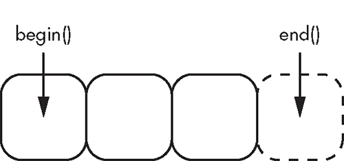
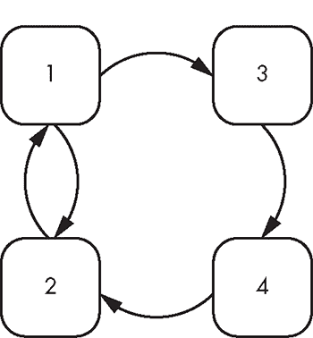

## **13

**容器**

*修复`std::vector`中的 bug 既是喜悦（它是最棒的数据结构）又是恐惧（如果我搞砸了，世界就爆炸）。*

—Stephan T. Lavavej（Visual C++库的首席开发人员）。2016 年 8 月 22 日凌晨 3:11 的推文*


*标准模板库*（*STL*）是 stdlib 的一部分，提供容器以及操作容器的算法，迭代器作为两者之间的接口。在接下来的三章中，你将进一步了解这些组件的更多信息。

*容器*是一种特殊的数据结构，它以有序的方式存储对象，并遵循特定的访问规则。容器有三种类型：

+   序列容器按顺序存储元素，就像数组一样。

+   关联容器存储排序后的元素。

+   无序关联容器存储哈希化对象。

关联容器和无序关联容器提供快速的单个元素查找。所有容器都是 RAII 包装器，围绕它们包含的对象，因此它们管理元素的存储期限和生命周期。此外，每个容器都提供一些成员函数，用于对对象集合执行各种操作。

现代 C++程序总是使用容器。你为特定应用选择哪个容器取决于所需的操作、包含对象的特性以及在特定访问模式下的效率。本章将概述 STL 和 Boost 之间所涵盖的广泛容器领域。由于这些库中有如此多的容器，你将重点探索其中最流行的几种。

### 序列容器

*序列容器*是 STL 容器，允许顺序访问成员。也就是说，你可以从容器的一端开始，迭代到另一端。但除了这一共同点，序列容器是一个多样化且形态各异的队伍。有些容器具有固定长度；而有些容器可以根据程序需求缩小或增大。有些容器允许直接索引进入容器，而其他容器只能顺序访问。此外，每个序列容器具有独特的性能特征，使得它在某些情况下具有优势，而在其他情况下则可能不适用。

使用序列容器应该是直观的，因为你自从在第 42 页上看到内建的或“C 风格”的数组`T[]`后，就已经接触过一个基本的容器。你将从更复杂、更酷的“弟弟”`std::array`开始探索序列容器。

#### *数组*

STL 在 `<array>` 头文件中提供了 `std::array`。`array` 是一个顺序容器，包含固定大小的连续元素序列。它结合了内置数组的极高性能和效率，同时支持复制/移动构造/赋值，知道自身大小，提供边界检查成员访问等现代功能。

在几乎所有情况下，你都应该使用 `array` 而不是内置数组。它支持与 `operator[]` 类似的几乎所有使用模式来访问元素，因此没有很多需要使用内置数组的情况。

**注意**

*Boost 还在 Boost Array 的 `<boost/array.hpp>` 中提供了一个 `boost::array`。除非你使用的是非常旧的 C++ 工具链，否则不需要使用 Boost 版本。*

##### 构造

`array<`T, S > 类模板接受两个模板参数：

+   包含的类型 T

+   数组 S 的固定大小

你可以使用相同的规则来构造 `array` 和内置数组。总结《数组》章节中第 42 页的规则，推荐的方法是使用大括号初始化来构造 `array`。大括号初始化将数组填充为大括号内的值，并将其余元素填充为零。如果省略初始化大括号，`array` 将根据其存储持续时间包含未初始化的值。清单 13-1 展示了几种 `array` 声明的大括号初始化示例。

```
#include <array>

std::array<int, 10> static_array{} ➊

TEST_CASE("std::array") {
  REQUIRE(static_array[0] == 0); ➋

  SECTION("uninitialized without braced initializers") {
    std::array<int, 10> local_array; ➌
    REQUIRE(local_array[0] != 0); ➍
  }

  SECTION("initialized with braced initializers") {
    std::array<int, 10> local_array{ 1, 1, 2, 3 }; ➎
    REQUIRE(local_array[0] == 1);
    REQUIRE(local_array[1] == 1);
    REQUIRE(local_array[2] == 2);
    REQUIRE(local_array[3] == 3);
    REQUIRE(local_array[4] == 0); ➏
  }
}
```

*清单 13-1：初始化一个 `std::array`。你可能会收到来自 `REQUIRE(local_array[0] != 0);` ➍ 的编译器警告，因为 `local_array` 包含未初始化的元素。*

你声明了一个名为 `static_array` 的包含 10 个 `int` 对象的 `array`，它使用静态存储持续时间 ➊。你没有使用大括号初始化，但根据《数组》章节中第 42 页的初始化规则，它的元素仍然被初始化为零 ➋。

接下来，你尝试声明另一个包含 10 个 `int` 对象的 `array`，这次使用自动存储持续时间 ➌。因为你没有使用大括号初始化，`local_array` 包含未初始化的元素（这些元素等于零的概率极低 ➍）。

最后，你使用大括号初始化声明另一个 `array` 并填充前四个元素 ➎。其余所有元素都被设置为零 ➏。

##### 元素访问

你可以通过三种主要方法访问任意的 `array` 元素：

+   `operator[]`

+   `at`

+   `get`

`operator[]` 和 `at` 方法接受一个 `size_t` 类型的参数，表示所需元素的索引。这两者的区别在于边界检查：如果索引参数超出范围，`at` 会抛出一个 `std::out_of_range` 异常，而 `operator[]` 会导致未定义行为。函数模板 `get` 接受一个与之规格相同的模板参数。由于它是一个模板，索引必须在编译时已知。

**注意**

*回想一下在《`size_t`类型》一节中，位于第 41 页的内容，`size_t`对象保证其最大值足以表示所有对象的最大字节大小。正因为如此，`operator[]`和`at`方法使用`size_t`而非`int`，后者并不做出此类保证。*

使用`get`的一个重要优势是，你可以获得编译时的边界检查，正如列表 13-2 所示。

```
TEST_CASE("std::array access") {
   std::array<int, 4> fib{ 1, 1, 0, 3}; ➊

  SECTION("operator[] can get and set elements") {
    fib[2] = 2; ➋
    REQUIRE(fib[2] == 2); ➌
    // fib[4] = 5; ➍
  }

  SECTION("at() can get and set elements") {
    fib.at(2) = 2; ➎
    REQUIRE(fib.at(2) == 2); ➏
    REQUIRE_THROWS_AS(fib.at(4), std::out_of_range); ➐
  }
  SECTION("get can get and set elements") {
    std::get<2>(fib) = 2; ➑
    REQUIRE(std::get<2>(fib) == 2); ➒
    // std::get<4>(fib); ➓
  }
}
```

*列表 13-2：访问`array`元素。取消注释`// fib[4] = 5;`* ➍ *将导致未定义行为，而取消注释`// std::get<4>(fib);`* ➓ *将导致编译失败。*

你声明了一个长度为 4 的数组`fib` ➊。使用`operator[]` ➋你可以设置元素并检索它们 ➌。你注释掉的越界写入将导致未定义行为；`operator[]`没有边界检查 ➍。

你可以使用`at`进行相同的读取 ➎ 和写入 ➏ 操作，并且可以安全地执行越界操作，因为有边界检查 ➐。

最后，你可以使用`std::get`来`设置` ➑ 和`获取` ➒ 元素。`get`元素还会进行边界检查，因此如果取消注释，`// std::get<4>(fib);` ➓ 将无法编译。

你还有`front`和`back`方法，它们分别返回数组的第一个和最后一个元素的引用。如果数组长度为零，调用这些方法将导致未定义行为，正如列表 13-3 所示。

```
TEST_CASE("std::array has convenience methods") {
  std::array<int, 4> fib{ 0, 1, 2, 0 };

  SECTION("front") {
    fib.front() = 1; ➊
    REQUIRE(fib.front() == 1); ➋
    REQUIRE(fib.front() == fib[0]); ➌
  }

  SECTION("back") {
    fib.back() = 3; ➍
    REQUIRE(fib.back() == 3); ➎
    REQUIRE(fib.back() == fib[3]); ➏
  }
}
```

*列表 13-3：在`std::array`上使用便捷方法`front`和`back`*

你可以使用`front`和`back`方法来设置 ➊➍ 和获取 ➋➎ `array`的第一个和最后一个元素。当然，`fib[0]`与`fib.front()` ➌ 完全相同，`fib[3]`与`fib.back()` ➏ 完全相同。`front()`和`back()`方法只是便捷方法。此外，如果你在编写通用代码时，某些容器可能提供`front`和`back`，但不提供`operator[]`，因此最好使用`front`和`back`方法。

##### 存储模型

`array`不进行内存分配；相反，它像内建数组一样，包含其所有元素。这意味着复制通常会很昂贵，因为每个组成元素都需要复制。移动可能会很昂贵，具体取决于`array`的底层类型是否也支持移动构造和移动赋值，而这些操作相对便宜。

每个`array`底层其实就是一个内建数组。实际上，你可以通过四种不同的方法提取指向`array`第一个元素的指针：

+   常用的方法是使用`data`方法。正如其宣传所说，它返回指向第一个元素的指针。

+   其他三种方法涉及使用取地址操作符`&`在第一个元素上，这些元素可以通过`operator[]`、`at`和`front`获得。

你应该使用`data`。如果`array`为空，基于取地址操作的方法将返回未定义行为。

列表 13-4 展示了如何通过这四种方法获得指针。

```
TEST_CASE("We can obtain a pointer to the first element using") {
  std::array<char, 9> color{ 'o',  'c', 't', 'a', 'r', 'i', 'n', 'e' };
  const auto* color_ptr = color.data(); ➊

  SECTION("data") {
    REQUIRE(*color_ptr == 'o'); ➋
  }
  SECTION("address-of front") {
    REQUIRE(&color.front() == color_ptr); ➌
  }
  SECTION("address-of at(0)") {
    REQUIRE(&color.at(0) == color_ptr); ➍
  }
  SECTION("address-of [0]") {
    REQUIRE(&color[0] == color_ptr); ➎
  }
}
```

*代码清单 13-4：获取`std::array`第一个元素的指针*

初始化`array color`后，你可以通过`data`方法 ➊ 获取指向第一个元素的指针，即字母`o`。当你解引用得到的`color_ptr`时，你会如预期得到字母`o` ➋。这个指针与通过`address-of-`加`front` ➌、`at` ➍ 和`operator[]` ➎ 方法获得的指针是相同的。

总结数组时，你可以使用`size`或`max_size`方法查询`array`的大小。（这两个方法对于`array`来说是相同的。）因为`array`的大小是固定的，这些方法的值在编译时就已经确定。

##### 迭代器速成课程

容器与算法之间的接口就是迭代器。迭代器是一种知道容器内部结构的类型，并向容器元素暴露类似指针的简单操作。第十四章专门讲解迭代器，但你在这里需要了解一些基本知识，以便你能够探索如何使用迭代器操作容器，以及容器如何向用户暴露迭代器。

迭代器有不同的种类，但它们都至少支持以下操作：

1.  获取当前元素（`operator*`）

1.  转到下一个元素（`operator++`）

1.  将一个迭代器赋值给另一个迭代器（`operator=`）

你可以通过所有 STL 容器（包括`array`）的`begin`和`end`方法提取迭代器。`begin`方法返回一个指向第一个元素的迭代器，而`end`方法返回指向最后一个元素之后的元素的指针。图 13-1 展示了`begin`和`end`迭代器在一个包含三个元素的数组中的指向位置。



*图 13-1：一个包含三个元素的`array`的半开区间*

在图 13-1 中的排列，其中`end()`指向最后一个元素之后的位置，称为*半开区间*。这可能一开始看起来不太直观——为什么不使用闭区间，让`end()`指向最后一个元素——但半开区间有其优势。例如，如果一个容器为空，`begin()`会返回与`end()`相同的值。这让你能够知道，无论容器是否为空，只要迭代器等于`end()`，就表示你已经遍历了容器。

代码清单 13-5 展示了半开区间迭代器和空容器的行为。

```
TEST_CASE("std::array begin/end form a half-open range") {
  std::array<int, 0> e{}; ➊
  REQUIRE(e.begin()➋ == e.end()➌);
}
```

*代码清单 13-5：对于一个空的`array`，`begin`迭代器等于`end`迭代器。*

在这里，你构造了一个空数组`e` ➊，并且`begin` ➋ 和`end` ➌ 迭代器是相等的。

代码清单 13-6 展示了如何使用迭代器在一个非空的`array`上执行类似指针的操作。

```
TEST_CASE("std::array iterators are pointer-like") {
  std::array<int, 3> easy_as{ 1, 2, 3 }; ➊
  auto iter = easy_as.begin(); ➋
  REQUIRE(*iter == 1); ➌
  ++iter; ➍
  REQUIRE(*iter == 2);
  ++iter;
  REQUIRE(*iter == 3); ➎
  ++iter; ➏
  REQUIRE(iter == easy_as.end()); ➐
}
```

*代码清单 13-6：基本的`array`迭代器操作*

`array easy_as` 包含元素 1、2 和 3 ➊。你在 `easy_as` 上调用 `begin` 来获取指向第一个元素的迭代器 `iter` ➋。解引用操作符返回第一个元素 1，因为这是 `array` 中的第一个元素 ➌。接下来，你递增 `iter`，使其指向下一个元素 ➍。你继续以这种方式进行，直到到达最后一个元素 ➎。最后一次递增指针会让你超出最后一个元素 ➏，因此 `iter` 等于 `easy_as.end()`，表示你已经遍历了整个 `array` ➐。

回忆一下在《范围表达式》章节中提到的内容（见 第 235 页），你可以通过暴露 `begin` 和 `end` 方法来构建自定义类型以用于范围表达式，就像在列表 8-29 中的 `FibonacciIterator` 一样。实际上，容器已经为你做了所有这些工作，这意味着你可以将任何 STL 容器作为范围表达式使用。列表 13-7 通过遍历一个 `array` 来展示这一点。

```
TEST_CASE("std::array can be used as a range expression") {
  std::array<int, 5> fib{ 1, 1, 2, 3, 5 }; ➊
  int sum{}; ➋
  for (const auto element : fib) ➌
    sum += element; ➍
  REQUIRE(sum == 12);
}
```

*列表 13-7：基于范围的 `for` 循环和 `array`s*

你初始化了一个 `array` ➊ 和一个 `sum` 变量 ➋。因为 `array` 是一个有效的范围，你可以在基于范围的 `for` 循环中使用它 ➌。这使你能够累加每个 `element` 的 `sum` ➍。

##### 支持的部分操作列表

表 13-1 提供了部分`array`操作的列表。在此表中，`a`、`a1`和`a2`的类型为`std::array<T, S>`，`t`的类型为`T`，`S`是数组的固定长度，`i`的类型为`size_t`。

**表 13-1：** `std::array` 操作的部分列表

| **操作** | **说明** |
| --- | --- |
| `array<`T`,` S`>{` ... `}` | 执行新构建数组的花括号初始化。 |
| `~array` | 析构数组包含的所有元素。 |
| a1 `=` a2 | 将 a2 的所有成员复制赋值给 a1 的成员。 |
| a.`at`(i) | 返回 a 的第 i 个元素的引用。如果越界，则抛出`std::out_of_range`。 |
| a`[`i`]` | 返回 a 的第 i 个元素的引用。如果越界，行为未定义。 |
| `get<`i`>``(`a`)` | 返回 a 的第 i 个元素的引用。如果越界，编译失败。 |
| a`.front()` | 返回对第一个元素的引用。 |
| a`.back()` | 返回对最后一个元素的引用。 |
| a`.data()` | 返回指向第一个元素的原始指针，如果数组非空。对于空数组，返回一个有效但不可解引用的指针。 |
| a`.empty()` | 如果数组的大小为零，则返回`true`；否则返回`false`。 |
| a.`size()` | 返回数组的大小。 |
| a`.max_size()` | 与 a`.size()` 相同。 |
| a.`fill(`t`)` | 将 t 复制赋值给 a 的每个元素。 |
| a1`.swap(`a2`)``swap(`a1`,` a2`)` | 交换 a1 和 a2 中的每个元素。 |
| a`.begin()` | 返回指向第一个元素的迭代器。 |
| a`.cbegin()` | 返回指向第一个元素的`const`迭代器。 |
| a`.end()` | 返回指向最后一个元素后一个位置的迭代器。 |
| a`.cend()` | 返回指向最后一个元素之后的 `const` 迭代器。 |
| a1 `==` a2a1 `!=` a2a1 `>` a2a1 `>=` a2a1 `<` a2a1 `<=` a2 | 如果所有元素相等，则相等。大于/小于比较从第一个元素到最后一个元素进行。 |

**注意**

*Table 13-1 中的部分操作可以作为快速且合理全面的参考。有关详细信息，请参考免费在线文献 [`cppreference.com/`](https://cppreference.com/) 和 [`cplusplus.com/`](http://cplusplus.com/)，以及 Bjarne Stroustrup 的《C++ 程序设计语言》第 4 版的第三十一章，以及 Nicolai M. Josuttis 的《C++ 标准库》第二版中的第七章](ch07.xhtml#ch07)，8 和 12 。*

#### *Vectors*

在 STL 的 `<vector>` 头文件中，`std::vector` 是一个顺序容器，存储着一个动态大小的、连续的元素序列。`vector` 动态管理其存储，不需要程序员的外部帮助。

`vector` 是顺序数据结构中的工作马。仅有少量开销，你就能获得比 `array` 更多的灵活性。而且，`vector` 支持几乎与 `array` 相同的所有操作，并且增加了许多其他功能。如果你手头有固定数量的元素，你应该强烈考虑使用 `array`，因为它相对于 `vector` 会有一些小的开销减少。在所有其他情况下，你的首选顺序容器是 `vector`。

**注意**

*Boost 容器库还包含了一个位于 `<boost/container/vector.hpp>` 头文件中的 `boost::container::vector`。*

##### 构造

类模板 `std::vector<T, Allocator>` 接受两个模板参数。第一个是元素类型 `T`，第二个是分配器类型 `Allocator`，这是可选的，默认值为 `std::allocator<T>`。

相比数组，你在构造 `vector` 时具有更大的灵活性。`vector` 支持用户定义的分配器，因为 `vector` 需要动态分配内存。你可以默认构造一个不包含任何元素的 `vector`。你可能想构造一个空的 `vector`，以便根据运行时的情况填充一个可变数量的元素。Listing 13-8 展示了默认构造一个 `vector` 并检查它是否包含元素。

```
#include <vector>
TEST_CASE("std::vector supports default construction") {
  std::vector<const char*➊> vec; ➋
  REQUIRE(vec.empty()); ➌
}
```

*Listing 13-8：`vector` 支持默认构造。*

你声明了一个包含 `const char*` 类型元素的 `vector` ➊，名为 `vec`。由于它是默认构造的 ➋，因此 `vector` 不包含任何元素，`empty` 方法返回 `true` ➌。

你可以使用花括号初始化来初始化 `vector`。类似于如何用花括号初始化数组，这种方式会用指定的元素填充 `vector`，如 Listing 13-9 所示。

```
TEST_CASE("std::vector supports braced initialization ") {
    std::vector<int> fib{ 1, 1, 2, 3, 5 }; ➊
    REQUIRE(fib[4] == 5); ➋
}
```

*Listing 13-9：`vector` 支持花括号初始化。*

这里，你构造了一个名为`fib`的`vector`并使用大括号初始化器 ➊。初始化后，`vector`包含五个元素 1、1、2、3 和 5 ➋。

如果你想用许多相同的值来填充一个`vector`，你可以使用其中一个*填充构造函数*。要进行填充构造`vector`，你首先传入一个`size_t`值，表示你要填充的元素数量。你还可以选择传入一个`const`引用对象，以便进行复制。有时，你可能希望将所有元素初始化为相同的值，例如跟踪与特定索引相关的计数。你可能还有一个用于跟踪程序状态的某个用户定义类型的`vector`，你可能需要通过索引来追踪这些状态。

不幸的是，使用大括号初始化构造对象的通用规则在这里失效了。对于`vector`，你必须使用圆括号来调用这些构造函数。对于编译器来说，`std::vector<int>{ 99, 100 }`指定了一个包含 99 和 100 两个元素的初始化列表，这将构造一个包含 99 和 100 两个元素的`vector`。如果你想要一个包含 99 个 100 的副本的`vector`，该怎么办呢？

通常，编译器会尽力将初始化列表视为用于填充`vector`的元素。你可以尝试记住这些规则（参考 Scott Meyers 的《*Effective Modern C++*》第 7 条）或者干脆决定在使用标准库容器构造函数时总是使用圆括号。

清单 13-10 展示了 STL 容器的一般初始化列表/大括号初始化规则。

```
TEST_CASE("std::vector supports") {
  SECTION("braced initialization") {
    std::vector<int> five_nine{ 5, 9 }; ➊
 REQUIRE(five_nine[0] == 5); ➋
    REQUIRE(five_nine[1] == 9); ➌
  }
  SECTION("fill constructor") {
    std::vector<int> five_nines(5, 9); ➍
    REQUIRE(five_nines[0] == 9); ➎
    REQUIRE(five_nines[4] == 9); ➏
  }
}
```

*清单 13-10：一个`vector`支持大括号初始化器和填充构造函数。*

第一个示例使用大括号初始化构造了一个包含两个元素的`vector` ➊：索引 0 处的 5 ➋ 和索引 1 处的 9 ➌。第二个示例使用圆括号调用填充构造函数 ➍，该构造函数将`vector`填充为五个 9 的副本，因此第一个 ➎ 和最后一个 ➏ 元素都是 9。

**注意**

*这种符号冲突是不幸的，并非经过深思熟虑的权衡结果。其原因纯粹是历史原因，并与向后兼容性相关。*

你还可以通过传入目标范围的`begin`和`end`迭代器来从半开区间构造`vector`。在各种编程上下文中，你可能希望从某个范围中提取出一部分子集并将其复制到`vector`中以进行进一步处理。例如，你可以构造一个`vector`，复制一个`array`中包含的所有元素，就像在清单 13-11 中展示的那样。

```
TEST_CASE("std::vector supports construction from iterators") {
  std::array<int, 5> fib_arr{ 1, 1, 2, 3, 5 }; ➊
  std::vector<int> fib_vec(fib_arr.begin(), fib_arr.end()); ➋
  REQUIRE(fib_vec[4] == 5); ➌
  REQUIRE(fib_vec.size() == fib_arr.size()); ➍
}
```

*清单 13-11：从范围构造一个`vector`*

你使用五个元素构造了数组`fib_arr` ➊。要使用`fib_arr`中的元素构造`fib_vec`，你需要调用`fib_arr`的`begin`和`end`方法 ➋。结果是，构造的`vector`包含了`array`的元素副本 ➌，并且具有相同的`size` ➍。

从高层次来看，你可以把这个构造函数理解为接受指向某个目标序列的开始和结束的指针。它将会复制这个目标序列。

##### 移动和复制语义

使用`vector`时，你可以完全支持复制/移动构造和赋值。任何`vector`的复制操作可能非常昂贵，因为这些是逐元素的或深度复制。而移动操作通常非常快速，因为包含的元素位于动态内存中，移动前的`vector`可以简单地将所有权转移到移动后的`vector`；不需要移动包含的元素。

##### 元素访问

`vector`支持与`array`相同的大多数元素访问操作：`at`、`operator[]`、`front`、`back`和`data`。

与`array`一样，你可以使用`size`方法查询`vector`中包含的元素数量。该方法的返回值可能在运行时发生变化。你还可以使用`empty`方法来确定`vector`是否包含任何元素，如果`vector`不包含元素，它返回`true`；否则返回`false`。

##### 添加元素

你可以使用各种方法向`vector`中插入元素。如果你想替换`vector`中的所有元素，可以使用`assign`方法，该方法接受一个初始化列表并替换所有现有元素。如果需要，`vector`将调整大小以容纳更多的元素，如示例 13-12 所示。

```
TEST_CASE("std::vector assign replaces existing elements") {
  std::vector<int> message{ 13, 80, 110, 114, 102, 110, 101 }; ➊
  REQUIRE(message.size() == 7); ➋
  message.assign({ 67, 97, 101, 115, 97, 114 }); ➌
  REQUIRE(message[5] == 114); ➍
  REQUIRE(message.size() == 6); ➎
}
```

*示例 13-12：`vector`的`assign`方法*

在这里，你构造了一个包含七个元素的`vector` ➊。当你赋值一个新的、更小的初始化列表 ➌时，所有元素都会被替换 ➍，并且`vector`的`size`会更新，以反映新的内容 ➎。

如果你想向`vector`中插入一个单一的新元素，可以使用`insert`方法，该方法需要两个参数：一个迭代器和一个要插入的元素。它会在迭代器指向的现有元素之前插入给定元素的副本，如示例 13-13 所示。

```
TEST_CASE("std::vector insert places new elements") {
  std::vector<int> zeros(3, 0); ➊
  auto third_element = zeros.begin() + 2; ➋
  zeros.insert(third_element, 10); ➌
  REQUIRE(zeros[2] == 10); ➍
  REQUIRE(zeros.size() == 4); ➎
}
```

*示例 13-13：`vector`的`insert`方法*

你用三个零初始化了一个`vector` ➊，并生成了一个指向`zeros`第三个元素的迭代器 ➋。接下来，你通过传递迭代器和值 10 来将值 10 插入到第三个元素之前 ➌。现在，`zeros`的第三个元素是 10 ➍。`zeros`向量现在包含四个元素 ➎。

每次使用`insert`时，现有的迭代器都会变得无效。例如，在示例 13-13 中，你不能重新使用`third_element`：`vector`可能已经重新调整大小并在内存中重新定位，导致旧的迭代器悬挂在垃圾内存中。

要将一个元素插入到`vector`的末尾，可以使用`push_back`方法。与`insert`不同，`push_back`不需要迭代器作为参数。只需提供要复制到`vector`中的元素，如示例 13-14 所示。

```
TEST_CASE("std::vector push_back places new elements") {
  std::vector<int> zeros(3, 0); ➊
  zeros.push_back(10); ➋
  REQUIRE(zeros[3] == 10); ➌
}
```

*示例 13-14：`vector`的`push_back`方法*

再次地，你初始化了一个包含三个零的`vector` ➊，但这次你使用`push_back`方法将元素 10 插入到`vector`的末尾 ➋。`vector`现在包含四个元素，最后一个元素是 10 ➌。

你可以使用`emplace`和`emplace_back`方法在原地构造新元素。`emplace`方法是一个变参模板，像`insert`一样，它将一个迭代器作为第一个参数。其余的参数将被转发到适当的构造函数。`emplace_back`方法也是一个变参模板，但像`push_back`一样，它不需要迭代器。它接受任意数量的参数，并将这些参数转发到适当的构造函数。列表 13-15 通过将一些`pair`添加到`vector`中来展示这两种方法。

```
#include <utility>

TEST_CASE("std::vector emplace methods forward arguments") {
  std::vector<std::pair<int, int>> factors; ➊
  factors.emplace_back(2, 30); ➋
  factors.emplace_back(3, 20); ➌
  factors.emplace_back(4, 15); ➍
  factors.emplace(factors.begin()➎, 1, 60);
  REQUIRE(factors[0].first == 1); ➏
  REQUIRE(factors[0].second == 60); ➐
}
```

*列表 13-15：`vector`的`emplace_back`和`emplace`方法*

在这里，你默认构造了一个包含`int`类型`pair`的`vector` ➊。使用`emplace_back`方法，你将三个`pair`推入`vector`中：2，30 ➋；3，20 ➌；以及 4，15 ➍。这些值直接传递给`pair`的构造函数，从而在原地构造了`pair`。接着，你使用`emplace`方法通过传递`factors.begin()`的结果作为第一个参数，向`vector`的开头插入一个新的`pair` ➎。这会导致`vector`中的所有元素向下移动，为新的`pair`腾出空间（1 ➏，60 ➐）。

**注意**

*`std::vector<std::pair<int, int>>`其实没有什么特别的。它和其他的`vector`一样。这个顺序容器中的每个元素恰好是一个`pair`。由于`pair`有一个接受两个参数的构造函数，一个用于`first`，一个用于`second`，`emplace_back`可以通过直接传递这两个值来将一个新元素添加到`pair`中。*

由于`emplace`方法可以原地构造元素，因此它们似乎应该比插入方法更高效。这种直觉通常是正确的，但由于复杂且令人不满意的原因，它并不总是更快。一般来说，使用`emplace`方法。如果你发现性能瓶颈，也可以尝试插入方法。有关详细讨论，请参阅 Scott Meyers 的《*Effective Modern C++*》第 42 条。

##### 存储模型

尽管`vector`的元素在内存中是连续的，像`array`一样，但相似之处仅此而已。`vector`的大小是动态的，因此它必须能够调整大小。`vector`的分配器管理着支撑`vector`的动态内存。

由于内存分配开销较大，`vector`会请求比实际需要的元素数量更多的内存空间。一旦它无法再添加更多元素，它会请求额外的内存。`vector`的内存总是连续的，因此如果现有`vector`的末尾没有足够的空间，它会分配一个全新的内存区域，并将所有元素移动到新区域中。`vector`所包含的元素数量称为它的*大小*，而它在不需要重新调整大小之前理论上能容纳的元素数量称为它的*容量*。图 13-2 展示了一个包含三元素的`vector`，并且额外有三元素的容量。


*图 13-2：`vector`存储模型*

如图 13-2 所示，`vector`在最后一个元素之后继续存在。容量决定了`vector`在这块空间中能容纳多少元素。在此图中，大小是三，容量是六。你可以把`vector`中的内存想象成一个礼堂：它可能有 500 的容量，但观众人数只有 250。

这种设计的结果是，向`vector`末尾插入元素非常快速（除非`vector`需要重新调整大小）。在其他位置插入则会增加额外的开销，因为`vector`需要移动元素以腾出空间。

你可以通过`capacity`方法获取`vector`当前的容量，也可以通过`max_size`方法获取`vector`理论上能扩展到的最大容量。

如果你提前知道自己需要某个容量，可以使用`reserve`方法，它接受一个`size_t`类型的参数，表示你希望为多少个元素预留空间。另一方面，如果你刚刚删除了几个元素，并希望将内存归还给分配器，你可以使用`shrink_to_fit`方法，表示你有多余的容量。分配器可以决定是否减少容量（这是一个非强制性的调用）。

此外，你可以使用`clear`方法删除`vector`中的所有元素，并将其大小设置为零。

代码清单 13-16 展示了所有这些与存储相关的方法，呈现了一个连贯的故事：你创建一个空的`vector`，预留一大块空间，添加一些元素，释放多余的容量，最后清空`vector`。

```
#include <cstdint>
#include <array>

TEST_CASE("std::vector exposes size management methods") {
  std::vector<std::array<uint8_t, 1024>> kb_store; ➊
  REQUIRE(kb_store.max_size() > 0);
  REQUIRE(kb_store.empty()); ➋

  size_t elements{ 1024 };
  kb_store.reserve(elements); ➌
  REQUIRE(kb_store.empty());
  REQUIRE(kb_store.capacity() == elements); ➍

  kb_store.emplace_back();
  kb_store.emplace_back();
  kb_store.emplace_back();
  REQUIRE(kb_store.size() == 3); ➎

  kb_store.shrink_to_fit();
  REQUIRE(kb_store.capacity() >= 3); ➏

  kb_store.clear(); ➐
  REQUIRE(kb_store.empty());
  REQUIRE(kb_store.capacity() >= 3); ➑
}
```

*代码清单 13-16：`vector`的存储管理功能。（严格来说，`kb_store.capacity() >= 3` ➏ ➑不是保证的，因为这个调用是非强制性的。）*

你构建了一个名为`kb_store`的`vector`数组对象，用于存储 1 KiB 的块➊。除非你使用的是没有动态内存的特殊平台，否则`kb_store.max_size()`的值会大于零；因为你对`vector`进行了默认初始化，它是空的➋。

接下来，你为 1,024 个元素保留空间 ➌，这并不会改变 vector 的空状态，但它会增加容量以匹配 ➍。此时，`vector` 已预留了 1,024 × 1 KiB = 1 MiB 的连续空间。保留空间后，你插入了三个数组，并检查`kb_store.size()`是否按预期增加 ➎。

你已经为 1,024 个元素保留了空间。为了将 1,024 - 3 = 1,021 个未使用的元素释放回分配器，你调用了`shrink_to_fit`，它将容量减少为 3 ➏。

最后，你在`vector` ➐上调用了`clear`，它销毁了所有元素并将其大小减少为零。然而，容量保持不变，因为你没有再次调用`shrink_to_fit` ➑。这很重要，因为如果你以后再添加元素，vector 不希望做额外的工作。

##### 支持操作的部分列表

表 13-2 提供了`vector`操作的部分列表。在此表中，`v`、`v1`和`v2`是`std::vector<T>`类型，`t`是`T`类型，`alc`是合适的分配器，`itr`是迭代器。星号(*)表示在某些情况下，该操作会使指向`v`元素的原始指针和迭代器失效。

**表 13-2：** `std::vector`操作的部分列表

| **操作** | **备注** |
| --- | --- |
| `vector<`T`>{ ...,` [alc]} | 执行新构造的 vector 的花括号初始化。默认使用 alc`=std::allocator<`T`>`。 |
| `vector<`T`>(`s`,[`t`], [`alc`])` | 用 t 的 s 个副本填充新构造的 vector。如果没有提供 t，则默认构造 T 的实例。 |
| `vector<`T`>(`v`)` | 对 v 进行深度复制；分配新内存。 |
| `vector<`T`>(move(`v`))` | 获取 v 中元素的内存所有权，不会重新分配内存。 |
| `~vector` | 销毁 vector 包含的所有元素并释放动态内存。 |
| v`.begin()` | 返回指向第一个元素的迭代器。 |
| v`.cbegin()` | 返回指向第一个元素的`const`迭代器。 |
| v`.end()` | 返回指向最后一个元素之后位置的迭代器。 |
| v`.cend()` | 返回指向最后一个元素之后位置的`const`迭代器。 |
| v1 `=` v2 | v1 销毁其元素；复制每个 v2 元素。只有在需要调整大小以适应 v2 的元素时才会分配内存。* |
| v1 `=` `move(`v2`)` | v1 销毁其元素；移动每个 v2 元素。只有在需要调整大小以适应 v2 的元素时才会分配内存。* |
| v`.at(`0`)` | 访问 v 的第 0 个元素。如果越界，抛出`std::out_of_range`异常。 |
| v`[`0`]` | 访问 v 的第 0 个元素。如果越界，行为未定义。 |
| v`.front()` | 访问第一个元素。 |
| v`.back()` | 访问最后一个元素。 |
| v`.data()` | 返回指向第一个元素的原始指针（如果数组非空）。对于空数组，返回一个有效但不可解引用的指针。 |
| v`.assign({` ... `})` | 用元素替换 v 的内容 ....* |
| v`.assign(`s`,` t`)` | 用 s 个 t 的副本替换 v 的内容。* |
| v`.empty()` | 如果 vector 的大小为零，则返回 `true`；否则返回 `false`。 |
| v`.size()` | 返回 vector 中元素的数量。 |
| v`.capacity()` | 返回 vector 可以容纳的最大元素数量，而无需调整大小。 |
| v`.shrink_to_fit()` | 可能会减少 vector 的存储，使 `capacity()` 等于 `size()`。* |
| v`.resize(`s`, [`t`])` | 调整 v 的大小为 s 个元素。如果缩小 v，会销毁末尾的元素。如果扩展 v，则插入默认构造的 T 元素，或者如果提供了 t，则插入 t 的副本。* |
| v`.reserve(`s`)` | 增加 vector 的存储，以便它至少能够容纳 s 个元素。* |
| v`.max_size()` | 返回 vector 可以扩展到的最大可能大小。 |
| v`.clear()` | 删除 v 中的所有元素，但容量保持不变。* |
| v`.insert(`itr`,` t`)` | 在由 itr 指向的元素之前插入 t 的副本；v 的范围必须包含 itr。* |
| v`.push_back(`t`)` | 在 v 的末尾插入 t 的副本。* |
| v`.emplace(`itr`,` ...`)` | 通过将参数 ... 转发给适当的构造函数，在 itr 指向的元素之前就地构造一个 T 元素。* |
| v`.emplace_back(`...`)` | 通过将参数 ... 转发给适当的构造函数，在 v 的末尾就地构造一个 T 元素。* |
| v1`.swap(`v2`)``swap(`v1`,` v2`)` | 交换 v1 和 v2 的每个元素。* |
| v1 `==` v2v1 `!=` v2v1 `>` v2v1 `>=` v2v1 `<` v2v1 `<=` v2 | 如果所有元素相等，则为相等。大于/小于的比较从第一个元素到最后一个元素进行。 |

#### *小众顺序容器*

在大多数需要顺序数据结构的情况下，`vector` 和 `array` 容器是首选。如果你事先知道所需的元素数量，使用 `array`。如果不知道，使用 `vector`。

你可能会遇到一个特殊的情况，在这种情况下，`vector` 和 `array` 无法提供你所需的性能特性。本节重点介绍了一些可能在这种情况下提供更高性能特性的替代顺序容器。

##### 双端队列

*deque*（发音为“deck”）是一个顺序容器，具有快速的插入和删除操作，支持从前端和后端进行操作。Deque 是 **d**ouble*-***e**nded **que**ue 的合成词。STL 实现的 `std::deque` 可通过 `<deque>` 头文件使用。

**注意**

*Boost 容器库还包含了一个 `boost::container::deque`，定义在 `<boost/container/deque.hpp>` 头文件中。*

`vector` 和 `deque` 有非常相似的接口，但它们的内部存储模型完全不同。`vector` 保证所有元素在内存中是连续的，而 `deque` 的内存通常是分散的，类似于 `vector` 和 `list` 的混合体。这使得大规模调整大小操作更加高效，并且支持在容器的前端快速插入/删除元素。

构造和访问成员对 `vector` 和 `deque` 来说是相同的操作。

由于 `deque` 的内部结构复杂，它没有暴露 `data` 方法。作为交换，你可以访问 `push_front` 和 `emplace_front`，它们与 `vector` 中你熟悉的 `push_back` 和 `emplace_back` 相对应。Listing 13-17 展示了如何使用 `push_back` 和 `push_front` 向 `deque` 中插入 `char` 类型的值。

```
#include <deque>

TEST_CASE("std::deque supports front insertion") {
  std::deque<char> deckard;
  deckard.push_front('a'); ➊ //  a
  deckard.push_back('i'); ➋ //  ai
  deckard.push_front('c');   // cai
  deckard.push_back('n');    // cain
  REQUIRE(deckard[0] == 'c'); ➌
  REQUIRE(deckard[1] == 'a');
  REQUIRE(deckard[2] == 'i');
  REQUIRE(deckard[3] == 'n');
}
```

*Listing 13-17：`deque` 支持 `push_front` 和 `push_back`。*

在构造一个空的 `deque` 后，你将交替的字母推送到 `deque` 的前端 ➊ 和后端 ➋，使其包含元素 `c`、`a`、`i` 和 `n` ➌。

**注意**

*例如，尝试提取一个字符串，如 `&deckard[0]`，将是一个非常糟糕的主意，因为 `deque` 对内部布局没有任何保证。*

`deque` 没有实现的 `vector` 方法及其缺失的解释如下：

**`capacity`, `reserve`** 由于内部结构复杂，计算容量可能效率不高。而且，`deque` 的分配相对较快，因为 `deque` 不会重新定位现有元素，因此不需要提前预留内存。

**`data`** `deque` 的元素不是连续存储的。

表 13-3 总结了 `deque` 提供的额外运算符，而 `vector` 没有。在该表中，`d` 的类型是 `std::deque<T>`，`t` 的类型是 `T`。星号（*）表示在某些情况下，此操作会使迭代器失效，指向 `v` 元素的迭代器失效。（指向现有元素的指针保持有效。）

**表 13-3：** `std::deque` 操作的部分列表

| **操作** | **备注** |
| --- | --- |
| d`.emplace_front(`...`)` | 通过将所有参数转发给适当的构造函数，在 d 的前端原地构造一个元素。* |
| d`.push_front(`t`)` | 通过复制 t 在 d 的前端原地构造一个元素。* |
| d`.pop_front()` | 移除 d 的前端元素。* |

### List

*list* 是一种序列容器，具有快速的插入/删除操作，但不支持随机访问元素。STL 实现的 `std::list` 可以通过 `<list>` 头文件使用。

**注意**

*Boost 容器库还包含了 `<boost/container/list.hpp>` 头文件中的 `boost::container::list`。*

`list` 实现为双向链表，这是一种由 *节点* 组成的数据结构。每个节点包含一个元素、一个前向链接（“flink”）和一个后向链接（“blink”）。这与 `vector` 完全不同，后者将元素存储在连续的内存中。因此，你不能使用 `operator[]` 或 `at` 来访问 `list` 中的任意元素，因为这些操作效率非常低。（这些方法在 `list` 中根本不可用，因为它们的性能表现非常差。）其权衡是，在 `list` 中插入和移除元素的速度要快得多。你只需要更新元素邻居的 flinks 和 blinks，而不需要移动可能很大的连续元素范围。

`list` 容器支持与 `vector` 相同的构造函数模式。 |

你可以对列表执行特殊操作，例如使用 `splice` 方法将元素从一个列表拼接到另一个列表，使用 `unique` 方法移除连续的重复元素，甚至使用 `sort` 方法对容器中的元素进行排序。例如，考虑 `remove_if` 方法。`remove_if` 方法接受一个函数对象作为参数，并在遍历 `list` 时对每个元素调用该函数对象。如果返回 `true`，`remove_if` 就会移除该元素。Listing 13-18 说明了如何使用 `remove_if` 方法通过 lambda 谓词删除 `list` 中的所有偶数。

```
#include <list>

TEST_CASE("std::list supports front insertion") {
  std::list<int> odds{ 11, 22, 33, 44, 55 }; ➊
  odds.remove_if([](int x) { return x % 2 == 0; }); ➋
  auto odds_iter = odds.begin(); ➌
  REQUIRE(*odds_iter == 11); ➍
  ++odds_iter; ➎
  REQUIRE(*odds_iter == 33);
  ++odds_iter;
  REQUIRE(*odds_iter == 55);
  ++odds_iter;
  REQUIRE(odds_iter == odds.end()); ➏
}
```

*Listing 13-18：`list` 支持 `remove_if`。*

在此，你使用大括号初始化填充 `int` 类型对象的 `list` ➊。接下来，你使用 `remove_if` 方法移除所有偶数 ➋。因为只有偶数对 2 取余为零，所以这个 lambda 表达式用来测试一个数字是否是偶数。为了验证 `remove_if` 已经移除偶数元素 22 和 44，你创建一个指向列表开头的迭代器 ➌，检查其值 ➍，并递增 ➎，直到达到列表末尾 ➏。

所有 `vector` 方法在 `list` 中没有实现，以及它们未实现的解释如下： |

**`capacity`, `reserve`, `shrink_to_fit`** 由于 `list` 是增量地分配内存，因此不需要定期调整大小。 |

**`operator[]`, `at`** 在 `list` 上随机访问元素代价昂贵。 |

**`data`** 不需要，因为 `list` 元素不是连续存储的。 |

表 13-4 总结了 `list` 提供但 `vector` 不提供的额外操作符。在此表中，`lst`、`lst1` 和 `lst2` 是 `std::list<T>` 类型，`t` 是 `T` 类型。`itr1`、`itr2a` 和 `itr2b` 是 `list` 迭代器。星号 (*) 表示在某些情况下，该操作会使指向 `v` 元素的迭代器无效。（指向现有元素的指针仍然有效。） |

**表 13-4：** `std::list` 操作的部分列表 |

| **操作** | **备注** |
| --- | --- |
| lst`.emplace_front(`...`)` | 通过将所有参数转发给相应的构造函数，在 `d` 的前端构造一个元素。 |
| lst`.push_front(`t`)` | 通过复制 t 在 d 的前端构造一个元素。 |
| lst`.pop_front()` | 移除 d 中位于前端的元素。 |
| lst`.push_back(`t`)` | 通过复制 t 在 d 的末尾构造一个元素。 |
| lst`.pop_back()` | 移除 d 中位于末尾的元素。 |
| lst1`.splice(`itr1`,`lst2`,` [itr2a]`,` [itr2b]`)` | 将 lst2 中的元素转移到 lst1 中的 itr1 位置。可选地，只转移 itr2a 处的元素或从 itr2a 到 itr2b 半开区间内的元素。 |
| lst`.remove(`t`)` | 移除 lst 中所有等于 t 的元素。 |
| lst`.remove_if(`pred`)` | 删除 lst 中符合 pred 条件的元素；pred 接受一个类型为 T 的单一参数。 |
| lst`.unique(`pred`)` | 根据函数对象 pred 消除 lst 中相邻重复的元素，pred 接受两个 T 类型参数并返回 t1 `==` t2。 |
| lst1`.merge(`lst2`,` comp`)` | 根据函数对象 comp 将 lst1 和 lst2 合并，comp 接受两个 T 类型参数并返回 t1 `<` t2。 |
| lst`.sort(`comp`)` | 根据函数对象 comp 对 lst 进行排序。 |
| lst`.reverse()` | 反转 lst 中元素的顺序（会改变 lst）。 |

**注意**

*STL 还在`<forward_list>`头文件中提供了`std::forward_list`，它是一个单向链表，只允许朝一个方向遍历。`forward_list`比`list`稍微高效，且在需要存储极少量（或没有）元素的情况下进行了优化。*

##### 栈

STL 提供了三种*容器适配器*，它们封装了其他 STL 容器，并为特定情况暴露了特殊接口。这些适配器分别是栈（stack）、队列（queue）和优先队列（priority queue）。

*栈*（stack）是一种具有两种基本操作的数据结构：压栈（push）和弹栈（pop）。当你将一个元素压入栈中时，你将该元素插入到栈的末端。当你从栈中弹出一个元素时，你将元素从栈的末端移除。这个排列方式叫做*后进先出*（last-in, first-out）：最后被压入栈的元素是第一个被弹出的元素。

STL 在`<stack>`头文件中提供了`std::stack`。类模板`stack`有两个模板参数，第一个是被封装容器的底层类型，例如`int`，第二个是被封装容器的类型，例如`deque`或`vector`。第二个参数是可选的，默认值为`deque`。

要构造一个`stack`，你可以传递一个`deque`、`vector`或`list`的引用来封装。这样，`stack`会将其操作，如`push`和`pop`，转换为底层容器能够理解的方法，比如`push_back`和`pop_back`。如果没有提供构造函数参数，`stack`默认使用`deque`。第二个模板参数必须与此容器的类型匹配。

要获取`stack`顶部元素的引用，可以使用`top`方法。

清单 13-19 演示了如何使用`stack`来封装`vector`。

```
#include <stack>

TEST_CASE("std::stack supports push/pop/top operations") {
  std::vector<int> vec{ 1, 3 }; ➊  // 1 3
 std::stack<int, decltype(vec)> easy_as(vec); ➋
  REQUIRE(easy_as.top() == 3); ➌
  easy_as.pop(); ➍                 // 1
  easy_as.push(2); ➎               // 1 2
  REQUIRE(easy_as.top() == 2); ➏
  easy_as.pop();                 // 1
  REQUIRE(easy_as.top() == 1);
  easy_as.pop();                 //
  REQUIRE(easy_as.empty()); ➐
}
```

*清单 13-19：使用`stack`封装`vector`*

你构造一个名为`vec`的`int`类型的`vector`，其中包含元素 1 和 3 ➊。接着，你将`vec`传入新`stack`的构造函数，并确保提供第二个模板参数`decltype(vec)` ➋。`stack`中的顶部元素现在是 3，因为这是`vec`中的最后一个元素 ➌。在第一次`pop`之后 ➍，你将新元素 2 压入`stack` ➎。此时，`top`元素是 2 ➏。经过另一次`pop`-`top`-`pop`的操作后，`stack`为空 ➐。

表格 13-5 总结了`stack`的操作。在此表中，`s`、`s1`和`s2`的类型为`std::stack<T>`；`t`的类型为`T`；`ctr`是类型为`ctr_type<T>`的容器。

**表 13-5：** `std::stack`操作概述

| **操作** | **备注** |
| --- | --- |
| `stack<`T, `[`ctr_type<T>`]>([`ctr`])` | 使用 ctr 作为内部容器引用构造 T 类型的栈。如果没有提供容器，则构造一个空的 deque。 |
| s`.empty()` | 如果容器为空，返回`true`。 |
| s`.size()` | 返回容器中元素的数量。 |
| s`.top()` | 返回`stack`顶部元素的引用。 |
| s`.push(t)` | 将 t 的副本放入容器末尾。 |
| s`.emplace(`...`)` | 通过转发...到适当的构造函数，在原地构造一个 T。 |
| s`.pop()` | 移除容器末尾的元素。 |
| s1`.swap(`s2`)``swap(`s1`,`s2`)` | 交换 s1 和 s2 的内容。 |

### 队列

*队列*是一种数据结构，像栈一样，它的基本操作是推入（push）和弹出（pop）。与栈不同，队列是*先进先出*（first-in, first-out）。当你将一个元素推入队列时，你是将元素插入队列的末尾。当你弹出一个元素时，你是从队列的开头移除元素。这样，在队列中待得最久的元素就是最先被弹出的元素。

STL 提供了`std::queue`，它位于`<queue>`头文件中。像`stack`一样，`queue`接受两个模板参数。第一个参数是被包装容器的底层类型，第二个参数是被包装容器的类型，默认为`deque`。

在 STL 容器中，你只能使用`deque`或`list`作为`queue`的底层容器，因为从`vector`的前端推入和弹出元素效率较低。

你可以使用`front`和`back`方法访问队列前端或后端的元素。

列表 13-20 展示了如何使用`queue`来包装`deque`。

```
#include <queue>

TEST_CASE("std::queue supports push/pop/front/back") {
  std::deque<int> deq{ 1, 2 }; ➊
  std::queue<int> easy_as(deq); ➋ // 1 2

  REQUIRE(easy_as.front() == 1); ➌
  REQUIRE(easy_as.back() == 2); ➍
  easy_as.pop(); ➎                // 2
  easy_as.push(3); ➏              // 2 3
  REQUIRE(easy_as.front() == 2); ➐
  REQUIRE(easy_as.back() == 3); ➑
  easy_as.pop();                   // 3
  REQUIRE(easy_as.front() == 3);
  easy_as.pop();                   //
  REQUIRE(easy_as.empty()); ➒
}
```

*列表 13-20: 使用`queue`包装`deque`*

你从一个包含元素 1 和 2 的`deque`开始 ➊，并将其传入一个名为`easy_as`的队列 ➋。使用`front`和`back`方法，你可以验证队列的开头是 1 ➌，结尾是 2 ➍。当你弹出第一个元素 1 时，队列中只剩下单一元素 2 ➎。然后你将 3 推入队列 ➏，此时`front`方法返回 2 ➐，`back`方法返回 3 ➑。再进行两次`pop`-`front`操作后，队列为空 ➒。

表 13-6 总结了`queue`的操作。在这张表中，`q`、`q1`和`q2`是`std::queue<T>`类型；`t`是`T`类型；`ctr`是`ctr_type<T>`类型的容器。

**表 13-6：** `std::queue`操作概述

| **操作** | **备注** |
| --- | --- |
| `queue<`T`, [`ctr_type<T>`]>([`ctr`])` | 使用 ctr 作为内部容器构造 T 类型的队列。如果没有提供容器，则构造一个空的`deque`。 |
| q`.empty()` | 如果容器为空，返回`true`。 |
| q`.size()` | 返回容器中元素的数量。 |
|  q`.front()`  | 返回队列前端元素的引用。 |
| q`.back()` | 返回 `queue` 中最后一个元素的引用。 |
| q`.push(`t`)` | 将 t 的副本放到容器的末尾。 |
| q`.emplace(`...`)` | 通过转发 ... 到适当的构造函数，原地构造一个 T。 |
| q`.pop()` | 移除容器中前面的元素。 |
| q1`.swap(`q2`)` `swap(`q1`,` q2`)` | 交换 q2 和 q1 的内容。 |

### 优先队列（堆）

*优先队列*（也叫堆）是一种支持 `push` 和 `pop` 操作的数据结构，它根据某个用户指定的 *比较器对象* 对元素进行排序。比较器对象是一个函数对象，接受两个参数，并在第一个参数小于第二个参数时返回 `true`。当你从优先队列中 `pop` 一个元素时，你会移除根据比较器对象确定的最大元素。

STL 提供了 `<queue>` 头文件中的 `std::priority_queue`。`priority_queue` 有三个模板参数：

+   包装容器的底层类型

+   包装容器的类型

+   比较器对象的类型

只有底层类型是必需的。包装容器类型默认为 `vector`（可能因为它是最常用的顺序容器），比较器对象类型默认为 `std::less`。

**注意**

*`std::less` 类模板可在 `<functional>` 头文件中找到，如果第一个参数小于第二个参数，则返回 `true`。*

`priority_queue` 的接口与 `stack` 相同。唯一的区别是栈按照后进先出的顺序 `pop` 元素，而优先队列则根据比较器对象的标准来 `pop` 元素。

清单 13-21 展示了 `priority_queue` 的基本用法。

```
#include <queue>

TEST_CASE("std::priority_queue supports push/pop") {
  std::priority_queue<double> prique; ➊
  prique.push(1.0); // 1.0
  prique.push(2.0); // 2.0 1.0
  prique.push(1.5); // 2.0 1.5 1.0
 REQUIRE(prique.top() == Approx(2.0)); ➋
  prique.pop();     // 1.5 1.0
  prique.push(1.0); // 1.5 1.0 1.0
  REQUIRE(prique.top() == Approx(1.5)); ➌
  prique.pop();     // 1.0 1.0
  REQUIRE(prique.top() == Approx(1.0)); ➍
  prique.pop();     // 1.0
  REQUIRE(prique.top() == Approx(1.0)); ➎
  prique.pop();     //
  REQUIRE(prique.empty()); ➏
}
```

*清单 13-21：`priority_queue` 的基本用法*

在这里，你默认构造一个 `priority_queue` ➊，它内部初始化一个空的 `vector` 来存储元素。你将元素 1.0、2.0 和 1.5 推入 `priority_queue`，它会按降序对元素进行排序，因此容器中的元素顺序是 2.0 1.5 1.0。

你确认 `top` 返回的是 2.0 ➋，然后从 `priority_queue` 中移除该元素，再用新元素 1.0 调用 `push`。此时容器中的元素顺序变为 1.5 ➌ 1.0 ➍ 1.0 ➎，你通过一系列的 `top` 和 `pop` 操作验证这一点，直到容器为空 ➏。

**注意**

*`priority_queue` 将其元素存储在树结构中，因此如果你查看其底层容器，内存顺序将与 清单 13-21 所示的顺序不匹配。*

表 13-7 总结了 `priority_queue` 的操作。在此表中，`pq`、`pq1` 和 `pq2` 的类型是 `std::priority_queue<T>`；`t` 的类型是 `T`；`ctr` 是类型为 `ctr_type<T>` 的容器；`srt` 是类型为 `srt_type<T>` 的容器。

**表 13-7：** `std::priority_queue` 操作总结

| **操作** | **说明** |
| --- | --- |
| `priority_queue <`T`,` `[`ctr_type<T>`],` `[`cmp_type`]>([`cmp`], [`ctr`])` | 使用`ctr`作为内部容器，`srt`作为比较器对象，构造一个`priority_queue`。如果没有提供容器，则构造一个空的`deque`，并默认使用`std::less`作为排序器。 |
| pq`.empty()` | 如果容器为空，返回`true`。 |
| pq`.size()` | 返回容器中的元素数量。 |
| pq`.top()` | 返回容器中最大元素的引用。 |
| pq`.push(`t`)` | 将 t 的副本放到容器的末尾。 |
| pq`.emplace(`...`)` | 通过转发...到适当的构造函数来原地构造一个 T。 |
| pq`.pop()` | 移除容器末尾的元素。 |
| pq1`.swap(`pq2`) swap(`pq1`,` pq2`)` | 交换 s2 和 s1 的内容。 |

### Bitsets

*bitset*是一种存储固定大小位序列的数据结构。你可以操作每一位。

STL 提供了`std::bitset`，位于`<bitset>`头文件中。类模板`bitset`接受一个对应所需大小的单一模板参数。你也可以使用`bool 数组`实现类似的功能，但`bitset`在空间效率上进行了优化，并提供了一些特殊的便捷操作。

**注意**

*STL 专门化了`std::vector<bool>`，因此它可能像`bitset`一样从相同的空间效率中受益。（回想一下在第 178 页的“模板特化”中提到的，模板特化是使某些类型的模板实例化更加高效的过程。）Boost 提供了`boost::dynamic_bitset`，它在运行时提供动态大小。*

默认构造的`bitset`包含所有零（假）位。要初始化具有其他内容的`bitset`，你可以提供一个`unsigned long long`值。该整数的按位表示设置`bitset`的值。你可以使用`operator[]`访问`bitset`中的单个位。列表 13-22 展示了如何用整数字面量初始化`bitset`并提取其元素。

```
#include <bitset>

TEST_CASE("std::bitset supports integer initialization") {
  std::bitset<4> bs(0b1010); ➊
  REQUIRE_FALSE(bs[0]); ➋
  REQUIRE(bs[1]); ➌
  REQUIRE_FALSE(bs[2]); ➍
  REQUIRE(bs[3]); ➎
}
```

*列表 13-22：使用整数初始化`bitset`*

你用 4 位*nybble* `0101` ➊初始化一个`bitset`。因此，第一 ➋ 和第三 ➍ 个元素为零，第二 ➌ 和第四 ➎ 个元素为 1。

你还可以提供一个字符串表示所需的`bitset`，如列表 13-23 所示。

```
TEST_CASE("std::bitset supports string initialization") {
  std::bitset<4> bs1(0b0110); ➊
  std::bitset<4> bs2("0110"); ➋
  REQUIRE(bs1 == bs2); ➌
}
```

*列表 13-23：使用字符串初始化`bitset`*

在这里，你使用相同的整数 nybble `0b0110` ➊构造一个名为`bs1`的`bitset`，并使用字符串字面量`0110` ➋构造另一个名为`bs2`的`bitset`。这两种初始化方式生成相同的`bitset`对象 ➌。

表 13-8 总结了`bitset`的操作。在此表中，`bs`、`bs 1`和`bs 2`的类型为`std::bitset<N>`，而`i`是一个`size_t`。

**表 13-8：** `std::bitset`操作总结

| **操作** | **说明** |
| --- | --- |
| `bitset<`N`>([`val`])` | 构造一个初始值为 val 的`bitset`，其中 val 可以是由 0 和 1 组成的字符串或`unsigned long long`。默认构造函数将所有位初始化为零。 |
| bs`[`i`]` | 返回第 i 位的值：1 返回 true；0 返回 false。 |
| bs`.test(`i`)` | 返回第 i 位的值：1 返回 true；0 返回 false。执行边界检查；抛出`std::out_of_range`异常。 |
| bs`.set()` | 将所有位设置为 1。 |
| bs`.set(`i`,` val`)` | 将第 i 位设置为 val。执行边界检查；抛出`std::out_of_range`异常。 |
| bs`.reset()` | 将所有位设置为 0。 |
| bs`.reset(`i`)` | 将第 i 位设置为零。执行边界检查；抛出`std::out_of_range`异常。 |
| bs`.flip()` | 翻转所有位：(0 变为 1；1 变为 0)。 |
| bs`.flip(`i`)` | 翻转第 i 位。执行边界检查；抛出`std::out_of_range`异常。 |
| bs`.count()` | 返回设置为 1 的位数。 |
| bs`.size()` | 返回`bitset`的大小 N。 |
| bs`.any()` | 如果任何位都设置为 1，返回`true`。 |
| bs`.none()` | 如果所有位都设置为 0，返回`true`。 |
| bs`.all()` | 如果所有位都设置为 1，返回`true`。 |
| bs`.to_string()` | 返回`bitset`的`string`表示形式。 |
| bs`.to_ulong()` | 返回`bitset`的`unsigned long`表示形式。 |
| bs`.to_ullong()` | 返回`bitset`的`unsigned long long`表示形式。 |

### 特殊顺序 Boost 容器

Boost 提供了大量的特殊容器，这里没有足够的空间来探讨它们的所有特性。表 13-9 提供了其中一些容器的名称、头文件和简要描述。 |

**注意**

*请参考 Boost 容器文档获取更多信息。*

**表 13-9：** 特殊 Boost 容器

| **类/头文件** | **描述** |
| --- | --- |
| `boost::intrusive::*``<boost/intrusive/*.hpp>` | 入侵式容器对它们所包含的元素有要求（例如，元素必须继承自某个基类）。作为交换，它们提供了显著的性能提升。 |
| `boost::container::stable_vector``<boost/container/stable_vector.hpp>` | 一个没有连续元素的向量，但保证只要元素未被删除（如同`list`一样），迭代器和对元素的引用将保持有效。 |
| `boost::container::slist``<boost/container/slist.hpp>` | 一个带有快速`size`方法的`forward_list`。 |
| `boost::container::static_vector``<boost/container/static_vector.hpp>` | 介于数组和向量之间的混合容器，存储动态数量的元素，最多到固定大小。元素像`array`一样存储在`stable_vector`的内存中。 |
| `boost::container::small_vector``<boost/container/small_vector.hpp>` | 一种类似于`vector`的容器，优化用于存储少量元素。包含一些预分配的空间，避免动态分配。 |
| `boost::circular_buffer``<boost/circular_buffer.hpp>` | 一种固定容量、类似队列的容器，以循环方式填充元素；一旦达到容量，新的元素会覆盖最旧的元素。 |
| `boost::multi_array``<boost/multi_array.hpp>` | 一种类似数组的容器，接受多维度。你可以指定一个三维的 `multi_array` x，而不是例如多个数组的数组，从而允许元素访问，如 x`[5][1][2]`。 |
| `boost::ptr_vector``boost::ptr_list``<boost/ptr_container/*.hpp>` | 拥有智能指针集合可能不是最优的选择。指针向量以更高效和用户友好的方式管理动态对象集合。 |

**注意**

*Boost Intrusive 还包含一些专用的容器，在某些情况下提供性能优势。这些容器主要对于库的实现者有用。*

### 关联容器

*关联容器* 允许非常快速的元素搜索。顺序容器具有某种自然顺序，允许你从容器的开始迭代到结束，并按照特定顺序进行遍历。关联容器略有不同，这个容器家族沿着三个轴进行划分：

+   元素是否包含键（一个集合）或键值对（一个映射）

+   元素是否有序

+   键是否是 *唯一* 的

#### *集合*

STL 中 `<set>` 头文件提供的 `std::set` 是一个关联容器，包含已排序的唯一元素，称为 *键*。因为 `set` 存储的是排序元素，你可以高效地进行插入、删除和查找操作。此外，`set` 支持对其元素进行有序迭代，并且你可以通过比较器对象完全控制键的排序方式。

**注意**

*Boost 还提供了 `<boost/container/set.hpp>` 头文件中的 `boost::container::set`。*

##### 构造

类模板 `set<T, Comparator, Allocator>` 接受三个模板参数：

+   键类型 `T`

+   比较器类型默认为 `std::less`

+   分配器类型默认为 `std::allocator<T>`

构造 `set` 时你有很大的灵活性。以下每个构造函数都接受一个可选的比较器和分配器（其类型必须与相应的模板参数匹配）：

+   一个默认构造函数，初始化一个空的 `set`

+   移动和复制构造函数具有常见的行为

+   一个范围构造函数，将范围内的元素复制到集合中

+   一个大括号初始化器

列表 13-24 展示了这些构造函数的每一个。

```
#include <set>

TEST_CASE("std::set supports") {
  std::set<int> emp; ➊
  std::set<int> fib{ 1, 1, 2, 3, 5 }; ➋
  SECTION("default construction") {
    REQUIRE(emp.empty()); ➌
  }
  SECTION("braced initialization") {
    REQUIRE(fib.size() == 4); ➍
  }
  SECTION("copy construction") {
    auto fib_copy(fib);
    REQUIRE(fib.size() == 4); ➎
    REQUIRE(fib_copy.size() == 4); ➏
  }
  SECTION("move construction") {
    auto fib_moved(std::move(fib));
    REQUIRE(fib.empty()); ➐
    REQUIRE(fib_moved.size() == 4); ➑
 }
  SECTION("range construction") {
    std::array<int, 5> fib_array{ 1, 1, 2, 3, 5 };
    std::set<int> fib_set(fib_array.cbegin(), fib_array.cend());
    REQUIRE(fib_set.size() == 4); ➒
  }
}
```

*列表 13-24：`set` 的构造函数*

你可以默认构造 ➊ 和大括号初始化 ➋ 两个不同的 `set`。默认构造的 `set` 叫做 `emp`，是空的 ➌，而大括号初始化的 `set` 叫做 `fib`，包含四个元素 ➍。你在大括号初始化器中包括了五个元素，那为什么只有四个元素？回想一下，`set` 的元素是唯一的，因此 1 只会出现一次。

接下来，你复制构造了 `fib`，这将导致两个 `set`，其大小为 4 ➎ ➏。另一方面，移动构造函数会清空被移动的 `set` ➐ 并将元素转移到新的 `set` ➑。

然后，你可以从一个区间初始化一个 `set`。你构造了一个包含五个元素的 `array`，然后将其作为区间传递给 `set` 构造函数，使用 `cbegin` 和 `cend` 方法。与之前代码中的花括号初始化一样，`set` 只包含四个元素，因为重复的元素会被丢弃 ➒。

##### 移动与复制语义

除了移动/复制构造函数外，还提供了移动/复制赋值操作符。与其他容器的复制操作一样，`set` 的复制操作可能非常慢，因为每个元素都需要被复制，而移动操作通常很快，因为元素存储在动态内存中。`set` 可以简单地传递所有权，而不干扰元素。

##### 元素访问

你有几种方法可以从 `set` 中提取元素。基本方法是 `find`，它接受一个键的 `const` 引用并返回一个迭代器。如果 `set` 包含与键匹配的元素，`find` 将返回一个指向找到元素的迭代器。如果 `set` 中没有该元素，它将返回指向 `end` 的迭代器。`lower_bound` 方法返回一个指向第一个*不小于*键参数的元素的迭代器，而 `upper_bound` 方法返回第一个*大于*给定键的元素。

`set` 类支持两种额外的查找方法，主要是为了兼容非唯一的关联容器：

+   `count` 方法返回与键匹配的元素的数量。由于 `set` 中的元素是唯一的，`count` 要么返回 0，要么返回 1。

+   `equal_range` 方法返回一个半开区间，其中包含所有与给定键匹配的元素。该区间返回一个 `std::pair` 迭代器，`first` 指向匹配的元素，`second` 指向 `first` 之后的元素。如果 `equal_range` 没有找到匹配的元素，`first` 和 `second` 都会指向第一个大于给定键的元素。换句话说，`equal_range` 返回的 `pair` 等价于 `lower_bound` 的 `first` 和 `upper_bound` 的 `second`。

列表 13-25 演示了这两种访问方法。

```
TEST_CASE("std::set allows access") {
  std::set<int> fib{ 1, 1, 2, 3, 5 }; ➊
  SECTION("with find") { ➋
    REQUIRE(*fib.find(3) == 3);
    REQUIRE(fib.find(100) == fib.end());
  }
  SECTION("with count") { ➌
    REQUIRE(fib.count(3) == 1);
    REQUIRE(fib.count(100) == 0);
  }
  SECTION("with lower_bound") { ➍
    auto itr = fib.lower_bound(3);
    REQUIRE(*itr == 3);
  }
  SECTION("with upper_bound") { ➎
    auto itr = fib.upper_bound(3);
    REQUIRE(*itr == 5);
  }
  SECTION("with equal_range") { ➏
    auto pair_itr = fib.equal_range(3);
    REQUIRE(*pair_itr.first == 3);
    REQUIRE(*pair_itr.second == 5);
  }
}
```

*列表 13-25：`set` 成员访问*

首先，你构造一个包含四个元素 1、2、3、5 的`set` ➊。使用`find`，你可以获取指向元素 3 的迭代器。你也可以确定 8 不在`set`中，因为`find`返回一个指向`end`的迭代器 ➋。你可以使用`count`获取类似的信息，当你传入键 3 时返回 1，当你传入键 8 时返回 0 ➌。当你将 3 传递给`lower_bound`方法时，它返回指向 3 的迭代器，因为这是第一个不小于给定参数的元素 ➍。另一方面，当你将其传递给`upper_bound`时，你得到指向元素 5 的指针，因为这是第一个大于给定参数的元素 ➎。最后，当你将 3 传递给`equal_range`方法时，你得到一对迭代器。`first`迭代器指向 3，`second`迭代器指向 5，即紧跟在 3 后面的元素 ➏。

`set`还通过其`begin`和`end`方法暴露迭代器，因此你可以使用基于范围的`for`循环从最小元素到最大元素遍历`set`。

### 添加元素

当向`set`中添加元素时，你有三种选择：

+   `insert`：将一个现有元素复制到`set`中

+   `emplace`：在`set`中原地构造一个新元素

+   `emplace_hint`：像`emplace`一样原地构造一个新元素（因为添加元素需要排序）。不同之处在于，`emplace_hint`方法将一个迭代器作为第一个参数。这个迭代器是搜索的起点（提示）。如果迭代器接近新插入元素的正确位置，这可以显著提高效率。

    Listing 13-26 展示了将元素插入到`set`中的几种方式。

```
TEST_CASE("std::set allows insertion") {
  std::set<int> fib{ 1, 1, 2, 3, 5 };
  SECTION("with insert") { ➊
    fib.insert(8);
    REQUIRE(fib.find(8) != fib.end());
  }
  SECTION("with emplace") { ➋
    fib.emplace(8);
    REQUIRE(fib.find(8) != fib.end());
  }
  SECTION("with emplace_hint") { ➌
    fib.emplace_hint(fib.end(), 8);
    REQUIRE(fib.find(8) != fib.end());
  }
}
```

*Listing 13-26: 向`set`中插入元素*

`insert` ➊和`emplace` ➋都会将元素 8 添加到`fib`中，因此当你用 8 调用`find`时，你会得到一个指向新元素的迭代器。你可以用`emplace_hint` ➌以更高效的方式实现相同的效果。因为你预先知道新元素 8 大于`set`中的所有其他元素，所以你可以使用`end`作为提示。

如果你尝试将一个已经存在于`set`中的键通过`insert`、`emplace`或`emplace_hint`插入，那么操作将没有任何效果。这三种方法都会返回一个`std::pair<Iterator, bool>`，其中`second`元素表示操作是否导致了插入（`true`）或没有插入（`false`）。`first`指向的迭代器指向的是新插入的元素，或者是阻止插入的现有元素。

##### 移除元素

你可以使用`erase`方法从`set`中移除元素，`erase`被重载以接受一个键、一个迭代器或一个半开区间，如 Listing 13-27 所示。

```
TEST_CASE("std::set allows removal") {
  std::set<int> fib{ 1, 1, 2, 3, 5 };
  SECTION("with erase") { ➊
 fib.erase(3);
    REQUIRE(fib.find(3) == fib.end());
  }
  SECTION("with clear") { ➋
    fib.clear();
    REQUIRE(fib.empty());
  }
}
```

*Listing 13-27: 从`set`中移除元素*

在第一个测试中，你使用键值 3 调用 `erase`，这将从 `set` 中移除相应的元素。当你在 3 上调用 `find` 时，返回一个指向 `end` 的迭代器，表示没有找到匹配的元素 ➊。在第二个测试中，你调用 `clear`，这会从 `set` 中删除所有元素 ➋。

##### 存储模型

集合操作速度很快，因为集合通常是通过 *红黑树* 实现的。这些结构将每个元素当作一个节点。每个节点有一个父节点和最多两个子节点，分别是左子节点和右子节点。每个节点的子节点按顺序排序，所有左子节点都小于右子节点。这样，只要树的分支大致平衡（长度相等），就能比线性遍历更快地进行搜索。红黑树在插入和删除后具有重新平衡分支的附加功能。

**注意**

*有关红黑树的详细信息，请参考 Adam Drozdek 的《C++ 数据结构与算法》。*

##### 部分支持的操作列表

表 13-10 总结了 `set` 的操作。操作 `s`、`s1` 和 `s2` 的类型是 `std::set<T,[cmp_type<T>]>`。`T` 是包含的元素/键类型，`itr`、`beg` 和 `end` 是 `set` 的迭代器。变量 `t` 是一个 `T`。一个十字标记 (†) 表示返回 `std::pair<Iterator, bool>` 的方法，其中迭代器指向结果元素，且 `bool` 等于 `true` 表示方法插入了元素，`false` 表示元素已存在。

**表 13-10：** `std::set` 操作总结

| **操作** | **备注** |
| --- | --- |
| `set<`T`>{` ...`, [`cmp`], [`alc`] }` | 对新构造的 set 执行大括号初始化。默认使用 cmp`=std::less<`T`>` 和 alc`=std::allocator<`T`>`。 |
| `set<`T`>{` beg`,` end`,` `[`cmp`], [`alc`] }` | 范围构造函数，复制从半开区间 beg 到 end 的元素。默认使用 cmp`=std::less<`T`>` 和 alc`=std::allocator<`T`>`。 |
| `set<`T`>(`s`)` | 深拷贝 s；分配新内存。 |
| `set<`T`>(move(`s`))` | 接管内存所有权；元素来自 s。没有分配内存。 |
| `~set` | 析构 set 中包含的所有元素并释放动态内存。 |
| s1 `=` s2 | s1 析构其元素；复制每个 s2 元素。只有在需要调整大小以适应 s2 元素时才会分配内存。 |
| s1 `= move(`s2`)` | s1 析构其元素；移动每个 s2 元素。只有在需要调整大小以适应 s2 元素时才会分配内存。 |
| s`.begin()` | 返回指向第一个元素的迭代器。 |
| s`.cbegin()` | 返回指向第一个元素的 `const` 迭代器。 |
| s`.end()` | 返回指向最后一个元素之后的迭代器。 |
| s`.cend()` | 返回指向最后一个元素之后的 `const` 迭代器。 |
| s`.find(`t`)` | 返回指向匹配 t 的元素的迭代器，如果没有这样的元素则返回 s.`end()`。 |
| s`.count(`t`)` | 如果 set 中包含 t，则返回 1；否则返回 0。 |
| s`.equal_range(`t`)` | 返回一个`pair`类型的迭代器，表示与`t`匹配的半开区间的元素。 |
| s`.lower_bound(`t`)` | 返回一个迭代器，指向第一个不小于`t`的元素，如果没有此类元素，则返回`s.end()`。 |
| s`.upper_bound(`t`)` | 返回一个迭代器，指向第一个大于`t`的元素，如果没有此类元素，则返回`s.end()`。 |
| s`.clear()` | 删除集合中的所有元素。 |
| s`.erase(`t`)` | 删除与`t`相等的元素。 |
| s`.erase(`itr`)` | 删除`itr`指向的元素。 |
| s`.erase(`beg`,` end`)` | 删除从 beg 到 end 的半开区间内的所有元素。 |
| s`.insert(`t`)` | 将`t`的副本插入集合中。 |
| s`.emplace(`...`)` | 通过转发参数构造一个 T。 |
| s`.emplace_hint(`itr`,` ...`)` | 通过转发参数构造一个 T，并使用`itr`作为提示，指示插入新元素的位置。 |
| s`.empty()` | 如果集合的大小为零，返回`true`；否则返回`false`。 |
| s`.size()` | 返回集合中的元素数量。 |
| s`.max_size()` | 返回集合中元素的最大数量。 |
| s`.extract(`t`)`s`.extract(`itr`)` | 获取一个节点句柄，拥有匹配`t`或由`itr`指向的元素。（这是移除仅能移动的元素的唯一方法。） |
| s1`.merge(`s2`)`s1`.merge(move(`s2`))` | 将`s2`中的每个元素合并到`s1`中。如果参数是右值，则将元素移动到`s1`中。 |
| s1`.swap(`s2`)` `swap(`s1`,` s2`)` | 交换`s1`和`s2`中的每个元素。 |

##### 多重集合（Multisets）

STL 的`<set>`头文件中提供的`std::multiset`是一个关联容器，包含排序的、*非唯一*的键。`multiset`支持与`set`相同的操作，但它会存储冗余的元素。这对以下两种方法有重要影响：

+   方法`count`可以返回 0 以外的值。`multiset`的`count`方法会告诉你有多少个元素匹配给定的键。

+   方法`equal_range`可以返回包含多个元素的半开区间。`multiset`的`equal_range`方法将返回一个包含所有匹配给定键的元素的区间。

如果需要存储多个相同键的元素，可能希望使用`multiset`而非`set`。例如，可以通过将地址作为键，并将每个住户作为元素，来存储一个地址的所有居民。如果使用`set`，则只能存储一个居民。

示例 13-28 展示了如何使用`multiset`。

```
TEST_CASE("std::multiset handles non-unique elements") {
  std::multiset<int> fib{ 1, 1, 2, 3, 5 };
  SECTION("as reflected by size") {
    REQUIRE(fib.size() == 5); ➊
  }
  SECTION("and count returns values greater than 1") {
    REQUIRE(fib.count(1) == 2); ➋
  }
  SECTION("and equal_range returns non-trivial ranges") {
    auto [begin, end] = fib.equal_range(1); ➌
    REQUIRE(*begin == 1); ➍
    ++begin;
    REQUIRE(*begin == 1); ➎
    ++begin;
    REQUIRE(begin == end); ➏
  }
}
```

*示例 13-28：访问`multiset`元素*

与 Listing 13-24 中的 `set` 不同，`multiset` 允许多个 1，因此 size 返回 5，即你在大括号初始化器中提供的元素数量 ➊。当你计算 1 的数量时，你会得到 2 ➋。你可以使用 `equal_range` 来遍历这些元素。使用结构化绑定语法，你可以获得 `begin` 和 `end` 迭代器 ➌。你遍历这两个 1 ➎，然后到达半开区间的结束位置 ➏。

表 13-10 中的每个操作都适用于 `multiset`。

**注意**

*Boost 还在 `<boost/container/set.hpp>` 头文件中提供了一个 `boost::container::multiset`。*

#### *无序集合*

STL 中 `<unordered_set>` 头文件提供的 `std::unordered_set` 是一个关联容器，包含 *无序*、唯一的键。`unordered_set` 支持与 `set` 和 `multiset` 相同的大多数操作，但其内部存储模型完全不同。

**注意**

*Boost 还在 `<boost/unordered_set.hpp>` 头文件中提供了一个 `boost::unordered_set`。*

与使用比较器将元素排序到红黑树中不同，`unordered_set` 通常实现为哈希表。在没有自然顺序的键，并且不需要按照特定顺序遍历集合的情况下，你可能会希望使用 `unordered_set`。你可能会发现，在许多情况下，你可以使用 `set` 或 `unordered_set`。尽管它们看起来非常相似，但它们的内部表示方式是根本不同的，因此它们的性能特点也会有所不同。如果性能是一个问题，测量两者的表现，并使用更合适的那一个。

##### 存储模型：哈希表

哈希函数，或称为 *哈希器*，是一个接受键并返回一个唯一的 `size_t` 值，称为哈希码的函数。`unordered_set` 将其元素组织成一个哈希表，哈希表将哈希码与一个或多个元素的集合（称为 *桶*）关联起来。为了查找元素，`unordered_set` 会计算它的哈希码，然后在哈希表中搜索对应的桶。

如果你从未见过哈希表，可能会觉得这信息有些难以理解，那么我们来看一个例子。假设你有一大群人，需要将他们分成一些有意义的组，以便更容易地找到某个人。你可以按照生日将人分组，这样你会得到 365 个组（如果你算上闰年的 2 月 29 日，就有 366 个组）。生日就像是一个哈希函数，为每个人返回 365 个值中的一个。每个值形成一个桶，所有在同一个桶中的人有着相同的生日。在这个例子中，要找到某个人，你首先确定他的生日，这样就能找到正确的桶。然后，你可以在桶中搜索，找到你要找的人。

只要哈希函数足够快速，并且每个桶中的元素数量不太多，`unordered_set` 的性能比它们有序的对等物更为出色：包含的元素数不会增加插入、搜索和删除的时间。当两个不同的键有相同的哈希值时，称为 *哈希冲突*。当发生哈希冲突时，意味着这两个键会在同一个桶中。在前面的生日例子中，许多人会有相同的生日，因此会发生很多哈希冲突。哈希冲突越多，桶的大小越大，查找正确元素时在桶中花费的时间就越多。

哈希函数有几个要求：

+   它接受一个 `Key` 类型并返回一个 `size_t` 的哈希值。

+   它不会抛出异常。

+   相等的键值会产生相等的哈希值。

+   不相等的键值通常会产生不相等的哈希值。（哈希冲突的概率很低。）

STL 在 `<functional>` 头文件中提供了哈希器类模板 `std::hash<T>`，其中包含了基础类型、枚举类型、指针类型、`optional`、`variant`、智能指针等的特化。例如，Listing 13-29 说明了 `std::hash<long>` 如何满足等价性标准。

```
#include <functional>
TEST_CASE("std::hash<long> returns") {
  std::hash<long> hasher; ➊
  auto hash_code_42 = hasher(42); ➋
  SECTION("equal hash codes for equal keys") {
    REQUIRE(hash_code_42 == hasher(42)); ➌
  }
  SECTION("unequal hash codes for unequal keys") {
    REQUIRE(hash_code_42 != hasher(43)); ➍
  }
}
```

*Listing 13-29: `std::hash<long>` 为相等的键返回相等的哈希值，为不相等的键返回不相等的哈希值。*

你构造了一个类型为 `std::hash<long>` 的哈希器 ➊，并用它计算了 42 的哈希值，将结果存储在 `size_t hash_code_42` 中 ➋。当你再次使用 `hasher` 计算 42 的哈希值时，得到相同的结果 ➌。当你用 `43` 调用哈希器时，得到不同的值 ➍。

一旦 `unordered_set` 对一个键进行哈希，它就可以获得一个桶。由于桶是一个可能匹配的元素列表，你需要一个函数对象来确定键与桶元素之间的相等性。STL 在 `<functional>` 头文件中提供了类模板 `std::equal_to<T>`，它简单地调用参数的 `operator==`，正如 Listing 13-30 所示。

```
#include <functional>
TEST_CASE("std::equal_to<long> returns") {
  std::equal_to<long> long_equal_to; ➊
  SECTION("true when arguments equal") {
    REQUIRE(long_equal_to(42, 42)); ➋
  }
  SECTION("false when arguments unequal") {
    REQUIRE_FALSE(long_equal_to(42, 43)); ➌
  }
}
```

*Listing 13-30: `std::equal_to<long>` 调用其参数的 `operator==` 来判断相等性。*

在这里，你初始化了一个名为 `long_equal_to` 的 `equal_to<long>` ➊。当你用相等的参数调用 `long_equal_to` 时，它返回 `true` ➋。当你用不相等的参数调用时，它返回 `false` ➌。

**注意**

*为了简洁，本章不讨论如何实现你自己的哈希和相等性函数，如果你想根据用户定义的键类型构造无序容器，你将需要这些函数。请参阅《C++标准库》第 2 版（Nicolai Josuttis 著）第七章。*

##### 构造

类模板 `std::unordered_set<T, Hash, KeyEqual, Allocator` 需要四个模板参数：

+   键类型 `T`

+   `Hash` 哈希函数类型，默认值为 `std::hash<T>`

+   `KeyEqual` 相等性函数类型，默认值为 `std::equal_to<T>`

+   `Allocator` 分配器类型，默认为 `std::allocator<T>`

`unordered_set` 支持与 `set` 相等的构造函数，只是针对不同的模板参数做了调整（`set` 需要一个 `Comparator`，而 `unordered_set` 需要一个 `Hash` 和 `KeyEqual`）。例如，你可以在示例 13-24 中将 `unordered_set` 作为 `set` 的替代品，因为 `unordered_set` 具有范围构造函数和复制/移动构造函数，并且支持花括号初始化。

##### 支持的集合操作

`unordered_set` 支持表 13-10 中列出的所有 `set` 操作，除了 `lower_bound` 和 `upper_bound`，因为 `unordered_set` 不对其元素进行排序。

##### 桶管理

通常，你选择 `unordered_set` 的原因是其高性能。不幸的是，这种性能是有代价的：`unordered_set` 对象具有一些复杂的内部结构。你可以使用各种控制项和旋钮来检查和修改该内部结构的运行时状态。

你可以通过自定义 `unordered_set` 的桶数量来进行第一步控制（即桶的数量，而不是特定桶中元素的数量）。每个 `unordered_set` 构造函数将 `size_t bucket_count` 作为第一个参数，默认为一些实现定义的值。表 13-11 列出了主要的 `unordered_set` 构造函数。

**表 13-11：** `unordered_set` 构造函数

| **操作** | **备注** |
| --- | --- |
| `unordered_set<`T`>(``[`bck`], [`hsh`], [`keq`], [`alc`])` | 桶大小 bck 有一个实现定义的默认值。默认使用 hsh`=std::hash<`T`>`、keq`=std::equal_to<`T`>` 和 alc`=std::allocator<`T`>`。 |
| `unordered_set<`T`>(`...`,` `[`bck`], [`hsh`], [`keq`], [`alc`])` | 执行新构造的无序集合的花括号初始化。 |
| `unordered_set<`T`>(`beg`,` end `[`bck`],` `[`hsh`], [`keq`], [`alc`])` | 构造一个无序集合，元素范围为从 beg 到 end 的半开区间。 |
| `unordered_set<`T`>(`s`)` | `s` 的深拷贝；分配新内存。 |
| `unordered_set<`T`>(move(`s`))` | 获取内存所有权；`s` 中的元素。没有分配。 |

你可以使用 `bucket_count` 方法检查 `unordered_set` 中桶的数量。你还可以使用 `max_bucket_count` 方法获取最大桶数量。

`unordered_set`在运行时性能中的一个重要概念是其*负载因子*，即每个桶中元素的平均数量。你可以使用`load_factor`方法获取`unordered_set`的负载因子，它等价于`size()`除以`bucket_count()`。每个`unordered_set`都有一个最大负载因子，这会触发桶数量的增加，并可能导致所有包含元素的昂贵重新哈希。*重新哈希*是一个操作，其中元素会被重新组织到新的桶中。这需要为每个元素生成新的哈希值，这可能是一个相对计算昂贵的操作。

你可以通过`max_load_factor`获取最大负载因子，它是重载的，因此你可以设置一个新的最大负载因子（默认值为 1.0）。

为了避免在不合适的时机发生昂贵的重新哈希操作，你可以通过使用`rehash`方法手动触发重新哈希，`rehash`方法接受一个`size_t`类型的参数来指定所需的桶数量。你还可以使用`reserve`方法，该方法接受一个`size_t`类型的参数来指定所需的*元素*数量。

示例 13-31 展示了这些基本的桶管理操作。

```
#include <unordered_set>
TEST_CASE("std::unordered_set") {
  std::unordered_set<unsigned long> sheep(100); ➊
  SECTION("allows bucket count specification on construction") {
    REQUIRE(sheep.bucket_count() >= 100); ➋
    REQUIRE(sheep.bucket_count() <= sheep.max_bucket_count()); ➌
    REQUIRE(sheep.max_load_factor() == Approx(1.0)); ➍
  }
  SECTION("allows us to reserve space for elements") {
    sheep.reserve(100'000); ➎
    sheep.insert(0);
    REQUIRE(sheep.load_factor() <= 0.00001); ➏
    while(sheep.size() < 100'000)
      sheep.insert(sheep.size()); ➐
    REQUIRE(sheep.load_factor() <= 1.0); ➑
  }
}
```

*示例 13-31：`unordered_set`桶管理*

你构造了一个`unordered_set`并指定了 100 的桶数量➊。这样会导致`bucket_count`至少为 100➋，并且必须小于或等于`max_bucket_count`➌。默认情况下，`max_load_factor`为 1.0 ➍。

在下一个测试中，你调用`reserve`方法为十万个元素预留足够的空间➎。插入一个元素后，`load_factor`应该小于或等于百万分之一（0.00001）➏，因为你已经为十万个元素预留了足够的空间。只要低于这个阈值，就不需要重新哈希。插入十万个元素后➐，`load_factor`仍应小于或等于 1 ➑。这表明，由于使用了`reserve`，你不需要重新哈希。

##### 无序多重集合

STL 的`<unordered_set>`头文件中的`std::unordered_multiset`是一个关联容器，包含无序的、*非唯一*的键。`unordered_multiset`支持与`unordered_set`相同的所有构造函数和操作，但它会存储重复的元素。这个关系类似于`unordered_set`与`set`：`equal_range`和`count`的行为有所不同，以考虑键的非唯一性。

**注意**

*Boost 还提供了一个`boost::unordered_multiset`，位于`<boost/unordered_set.hpp>`头文件中。*

#### *映射*

STL 的`<map>`头文件中提供的`std::map`是一个关联容器，包含键值对。`map`的键是排序且唯一的，且`map`支持与`set`相同的所有操作。实际上，你可以将`set`看作是一个特殊类型的`map`，其中包含键和空值。因此，`map`支持高效的插入、删除和查找，并且你可以通过比较器对象控制排序。

使用`map`而不是一对对的集合的主要优势在于，`map`作为*关联数组*工作。关联数组使用键而不是整数值的索引。想想你如何使用`at`和`operator[]`方法访问顺序容器中的索引。因为顺序容器的元素有自然的顺序，所以你用整数来引用它们。关联数组允许你使用除了整数之外的类型来引用元素。例如，你可以使用字符串或`float`作为键。

为了支持关联数组操作，`map`支持许多有用的操作；例如，允许你通过关联的键插入、修改和检索值。

##### 构造

类模板`map<Key, Value, Comparator, Allocator>`包含四个模板参数。第一个是键类型`Key`。第二个是值类型`Value`。第三个是比较器类型，默认为`std::less`。第四个参数是分配器类型，默认为`std::allocator<T>`。

`map`的构造函数与`set`的构造函数直接对应：一个默认构造函数用于初始化一个空的`map`；移动和复制构造函数具有通常的行为；一个范围构造函数将范围中的元素复制到`map`中；以及一个大括号初始化器。主要的区别在于大括号初始化器，因为你需要初始化键值对，而不仅仅是键。为了实现这种嵌套初始化，你使用嵌套的初始化列表，正如列表 13-32 所示。

```
#include <map>

auto colour_of_magic = "Colour of Magic";
auto the_light_fantastic = "The Light Fantastic";
auto equal_rites = "Equal Rites";
auto mort = "Mort";

TEST_CASE("std::map supports") {
  SECTION("default construction") {
    std::map<const char*, int> emp; ➊
    REQUIRE(emp.empty()); ➋
  }
  SECTION("braced initialization") {
    std::map<const char*, int> pub_year { ➌
      { colour_of_magic, 1983 }, ➍
      { the_light_fantastic, 1986 },
      { equal_rites, 1987 },
      { mort, 1987 },
    };
    REQUIRE(pub_year.size() == 4); ➎
  }
}
```

*列表 13-32：`std::map`支持默认构造和大括号初始化。*

在这里，你使用默认构造函数构造一个`map`，其中键的类型是`const char*`，值的类型是`int` ➊。这将导致一个空的`map` ➋。在第二个测试中，你再次使用键类型为`const char*`、值类型为`int`的`map` ➌，但这次使用大括号初始化 ➍将四个元素打包到`map`中 ➎。

##### 移动和复制语义

`map`的移动和复制语义与`set`相同。

##### 存储模型

`map`和`set`使用相同的红黑树内部结构。

##### 元素访问

使用`map`而不是`set`的`pair`对象的主要优点是，`map`提供了两种关联数组操作：`operator[]`和`at`。与支持这些操作的顺序容器（如`vector`和`array`）不同，它们需要一个`size_t`类型的索引参数，`map`需要一个`Key`类型的参数，并返回对应值的引用。与顺序容器一样，`at`会在给定的`key`在`map`中不存在时抛出`std::out_of_range`异常。与顺序容器不同的是，如果`key`不存在，`operator[]`不会导致未定义行为；相反，它会（默默地）默认构造一个`Value`并将对应的键值对插入到 map 中，即使你只打算执行读取操作，如 Listing 13-33 所示。

```
TEST_CASE("std::map is an associative array with") {
  std::map<const char*, int> pub_year { ➊
    { colour_of_magic, 1983 },
    { the_light_fantastic, 1986 },
  };
  SECTION("operator[]") {
    REQUIRE(pub_year[colour_of_magic] == 1983); ➋

    pub_year[equal_rites] = 1987; ➌
    REQUIRE(pub_year[equal_rites] == 1987); ➍

    REQUIRE(pub_year[mort] == 0); ➎
  }
  SECTION("an at method") {
    REQUIRE(pub_year.at(colour_of_magic) == 1983); ➏

    REQUIRE_THROWS_AS(pub_year.at(equal_rites), std::out_of_range); ➐
  }
}
```

*Listing 13-33: `std::map`是一个具有多种访问方法的关联数组。*

你构造了一个名为`map`的`pub_year`，它包含两个元素 ➊。接下来，你使用`operator[]`提取与键`colour_of_magic`对应的值 ➋。你还使用`operator[]`插入新的键值对`equal_rites`，`1987` ➌，然后检索它 ➍。注意，当你尝试检索一个不存在的键`mort`时，map 会默默地为你默认初始化一个`int` ➎。

使用`at`，你仍然可以设置和检索 ➏ 元素，但如果你尝试访问一个不存在的键，会得到`std::out_of_range`异常 ➐。

`map`支持所有类似`set`的元素检索操作。例如，`map`支持`find`，它接受一个`key`参数并返回一个指向键值对的迭代器，或者如果没有找到匹配的键，则返回指向`map`末尾的迭代器。类似地，`map`还支持`count`、`equal_range`、`lower_bound`和`upper_bound`等操作。

##### 添加元素

除了元素访问方法`operator[]`和`at`外，你还可以使用`set`提供的所有`insert`和`emplace`方法。你只需将每个键值对视为`std::pair<Key, Value>`。与`set`一样，`insert`返回一个包含迭代器和`bool`的`pair`。迭代器指向插入的元素，`bool`值表示`insert`是否添加了新元素（`true`）或没有（`false`），如 Listing 13-34 所示。

```
TEST_CASE("std::map supports insert") {
  std::map<const char*, int> pub_year; ➊
  pub_year.insert({ colour_of_magic, 1983 }); ➋
  REQUIRE(pub_year.size() == 1); ➌

  std::pair<const char*, int> tlfp{ the_light_fantastic, 1986 }; ➍
  pub_year.insert(tlfp); ➎
  REQUIRE(pub_year.size() == 2); ➏

  auto [itr, is_new] = pub_year.insert({ the_light_fantastic, 9999 }); ➐
  REQUIRE(itr->first == the_light_fantastic);
  REQUIRE(itr->second == 1986); ➑
  REQUIRE_FALSE(is_new); ➒
  REQUIRE(pub_year.size() == 2); ➓
}
```

*Listing 13-34: `std::map`支持`insert`方法来添加新元素。*

你默认构造了一个`map` ➊，并使用带花括号初始化器的`insert`方法来插入一个`pair` ➋。这个构造大致相当于以下内容：

```
pub_year.insert(std::pair<const char*, int>{ colour_of_magic, 1983 });
```

插入之后，`map`现在包含一个元素 ➌。接下来，你创建了一个独立的`pair` ➍，然后将它作为参数传递给`insert` ➎。这会将一个副本插入到`map`中，因此它现在包含两个元素 ➏。

当你尝试使用相同的 `the_light_fantastic` 键 ➐ 调用 `insert` 插入新元素时，你会得到一个指向你已经插入的元素的迭代器 ➎。键（`first`）和值（`second`）匹配 ➑。返回值 `is_new` 表示没有插入新元素 ➒，你仍然拥有两个元素 ➓。该行为与 `set` 的 `insert` 行为一致。 |

`map` 还提供了 `insert_or_assign` 方法，区别于 `insert`，它会覆盖现有的值。与 `insert` 不同，`insert_or_assign` 接受独立的键和值参数，如 示例 13-35 所示。

```
TEST_CASE("std::map supports insert_or_assign") {
  std::map<const char*, int> pub_year{ ➊
    { the_light_fantastic, 9999 }
  };
  auto [itr, is_new] = pub_year.insert_or_assign(the_light_fantastic, 1986); ➋
  REQUIRE(itr->second == 1986); ➌
  REQUIRE_FALSE(is_new); ➍
}
```

*示例 13-35：`std::map` 支持 `insert_or_assign` 来覆盖现有元素。*

你构造了一个包含单个元素 ➊ 的 `map`，然后调用 `insert_or_assign` 将与键 `the_light_fantastic` 关联的值重新赋值为 1986 ➋。迭代器指向现有元素，当你查询相应的值时，使用 `second` 你会看到值已更新为 1986 ➌。`is_new` 返回值也表明你已经更新了现有元素，而不是插入了新元素 ➍。 |

##### 移除元素

类似于 `set`，`map` 支持 `erase` 和 `clear` 来移除元素，如 示例 13-36 所示。

```
TEST_CASE("We can remove std::map elements using") {
    std::map<const char*, int> pub_year {
      { colour_of_magic, 1983 },
      { mort, 1987 },
    }; ➊
  SECTION("erase") {
    pub_year.erase(mort); ➋
    REQUIRE(pub_year.find(mort) == pub_year.end()); ➌
  }
  SECTION("clear") {
    pub_year.clear(); ➍
    REQUIRE(pub_year.empty()); ➎
  }
}
```

*示例 13-36：`std::map` 支持元素移除。*

你构造了一个包含两个元素 ➊ 的 `map`。在第一次测试中，你对键为 `mort` 的元素调用 `erase` ➋，所以当你尝试 `find` 它时，你会得到 `end` ➌。在第二次测试中，你清空了 `map` ➍，这导致 `empty` 返回 `true` ➎。

##### 支持的操作列表

表 13-12 总结了 `map` 的支持操作。键 `k` 的类型是 `K`。值 `v` 的类型是 `V`。`P` 是类型 `pair<K, V>`，`p` 的类型是 `P`。`map` `m` 的类型是 `map<K, V>`。匕首符号 (†) 表示一个返回 `std::pair<Iterator, bool>` 的方法，其中迭代器指向结果元素，`bool` 为 `true` 表示该方法插入了一个元素，`false` 表示该元素已经存在。 |

**表 13-12：** `map` 操作部分支持列表

| **操作** | **备注** |
| --- | --- |
| `map<`T`>{` ...`, [`cmp`], [`alc`] }` | 执行新构造的 `map` 的大括号初始化。默认使用 cmp`=std::less<`T`>` 和 alc`=std::allocator<`T`>`。 |
| `map<`T`>{` beg`,` end`, [`cmp`], [`alc`] }` | 范围构造函数，将元素从半开区间 beg 到 end 进行复制。默认使用 cmp`=std::less<`T`>` 和 alc`=std::allocator<`T`>`。 |
| `map<`T`>(`m`)` | 对 m 进行深拷贝；分配新的内存。 |
| map`<`T`>(move(`m`))` | 获取内存所有权；元素来自 m。没有内存分配。 |
| `~map` | 销毁 `map` 中的所有元素并释放动态内存。 |
| m1 `=` m2 | m1 销毁其元素；复制每个 m2 元素。仅在需要调整大小以适应 m2 的元素时才会分配内存。 |
| m1 `= move(`m2`)` | m1 销毁其元素；移动每个 m2 元素。仅在需要调整大小以适应 m2 的元素时才会分配内存。 |
| m`.at(`k`)` | 访问与键 k 对应的值。如果未找到该键，则抛出`std::out_of_bounds`异常。 |
| m`[`k`]` | 访问与键 k 对应的值。如果未找到该键，则使用 k 和默认初始化的值插入一个新的键值对。 |
| m`.begin()` | 返回一个迭代器，指向第一个元素。 |
| m`.cbegin()` | 返回一个`const`迭代器，指向第一个元素。 |
| m`.end()` | 返回一个迭代器，指向最后一个元素之后的位置。 |
| m`.cend()` | 返回一个`const`迭代器，指向最后一个元素之后的位置。 |
| m`.find(`k`)` | 返回一个迭代器，指向匹配 k 的元素，如果没有此类元素，则返回 m`.end()`。 |
| m`.count(`k`)` | 如果 map 包含 k，则返回 1；否则返回 0。 |
| m`.equal_range(`k`)` | 返回一个`pair`，其中包含对应于匹配 k 的元素的半开区间的两个迭代器。 |
| m`.lower_bound(`k`)` | 返回一个迭代器，指向第一个不小于 k 的元素，如果没有此类元素，则返回 t.`end()`。 |
| m`.upper_bound(`k`)` | 返回一个迭代器，指向第一个大于 k 的元素，如果没有此类元素，则返回 t`.end()`。 |
| m`.clear()` | 移除 map 中的所有元素。 |
| m`.erase(`k`)` | 移除具有键 k 的元素。 |
| m`.erase(`itr`)` | 移除 itr 指向的元素。 |
| m`.erase(`beg`,` end`)` | 移除从 beg 到 end 的半开区间内的所有元素。 |
| m`.insert(`p`)` | 将 p 对的副本插入到 map 中。† |
| m`.insert_or_assign(`k`,` v`)` | 如果 k 存在，使用 v 覆盖对应的值。如果 k 不存在，将 k，v 对插入到 map 中。† |
| m`.emplace(`...`)` | 通过转发参数`...`在原地构造一个 P。† |
| m`.emplace_hint(`k`, ...)` | 通过转发参数`...`在原地构造一个 P。使用 itr 作为插入新元素的提示位置。† |
| m`.try_emplace(`itr`,` ...`)` | 如果 key k 存在，则不做任何操作。如果 k 不存在，则通过转发参数`...`在原地构造一个 V。 |
| m`.empty()` | 如果 map 的大小为零，返回`true`；否则返回`false`。 |
| m`.size()` | 返回 map 中的元素数量。 |
| m`.max_size()` | 返回 map 中元素的最大数量。 |
| m`.extract(`k`)`m`.extract(`itr`)` | 获取一个节点句柄，该句柄拥有与 k 匹配的元素或 itr 指向的元素。（这是移除仅能移动的元素的唯一方式。） |
| m1`.merge(`m2`)`m1`.merge(move(`m2`))` | 将 m2 的每个元素拼接到 m1 中。如果参数是右值，则将元素移动到 m1 中。 |
| m1`.swap(`m2`)``swap(`m1`,` m2`)` | 交换 m1 和 m2 的每个元素。 |

### 多重映射（Multimaps）

STL 中的 `std::multimap` 位于 `<map>` 头文件中，是一个包含具有 *非唯一* 键的键值对的关联容器。由于键不唯一，`multimap` 不支持 `map` 的关联数组特性。也就是说，不支持 `operator[]` 和 `at`。与 `multiset` 一样，`multimap` 主要通过 `equal_range` 方法提供元素访问，如 清单 13-37 所示。

```
TEST_CASE("std::multimap supports non-unique keys") {
  std::array<char, 64> far_out {
    "Far out in the uncharted backwaters of the unfashionable end..."
  }; ➊
  std::multimap<char, size_t> indices; ➋
  for(size_t index{}; index<far_out.size(); index++)
    indices.emplace(far_out[index], index); ➌

  REQUIRE(indices.count('a') == 6); ➍

  auto [itr, end] = indices.equal_range('d'); ➎
  REQUIRE(itr->second == 23); ➏
  itr++;
  REQUIRE(itr->second == 59); ➐
  itr++;
  REQUIRE(itr == end);
}
```

*清单 13-37：`std::multimap` 支持非唯一键。*

你构造了一个包含消息的 `array` ➊。你还默认构造了一个名为 `indices` 的 `multimap<char, size_t>`，它将用于存储消息中每个字符的索引 ➋。通过遍历数组，你可以将每个字符及其索引作为新元素存储在 `multimap` 中 ➌。由于允许使用非唯一键，你可以使用 `count` 方法来查看以键 `a` 插入的索引数量 ➍。你还可以使用 `equal_range` 方法获取键 `d` 的半开区间 ➎。利用结果中的 `begin` 和 `end` 迭代器，你可以看到消息中字母 `d` 的索引分别是 23 ➏ 和 59 ➐。

除了 `operator[]` 和 `at`，表 13-12 中的每个操作也适用于 `multimap`。（请注意，`count` 方法可以返回除 0 和 1 以外的其他值。）

##### 无序映射和无序多重映射

无序映射和无序多重映射与无序集合和无序多重集合完全类似。`std::unordered_map` 和 `std::unordered_multimap` 可以在 STL 的 `<unordered_map>` 头文件中找到。这些关联容器通常使用像 `set` 那样的红黑树。它们还需要哈希函数和等价性函数，并支持桶接口。

**注意**

*Boost 在 `<boost/unordered_map.hpp>` 头文件中提供了 `boost::unordered_map` 和 `boost::unordered_multimap`。*

#### *特定领域的关联容器*

当需要关联数据结构时，使用 `set`、`map` 及其相关的非唯一和无序对立物作为默认选择。当出现特殊需求时，Boost 库提供了许多专门的关联容器，如 表 13-13 所示。

**表 13-13：** 特殊 Boost 容器

| **类/头文件** | **描述** |
| --- | --- |
| `boost::container::flat_map``<boost/container/flat_map.hpp>` | 类似于 STL 中的 `map`，但它的实现方式像一个有序的向量。这意味着快速的随机元素访问。 |
| `boost::container::flat_set``<boost/container/flat_set.hpp>` | 类似于 STL 中的 `set`，但它的实现方式像一个有序的向量。这意味着快速的随机元素访问。 |
| `boost::intrusive::*``<boost/intrusive/*.hpp>` | 内侵式容器对其包含的元素提出要求（例如要求继承自特定的基类）。作为交换，它们提供了显著的性能提升。 |
| `boost::multi_index_container``<boost/multi_index_container.hpp>` | 允许你创建关联数组，可以使用多个索引，而不仅仅是一个（像 map 一样）。 |
| `boost::ptr_set``boost::ptr_unordered_map``boost::ptr_unordered_set``<boost/ptr_container/*.hpp>` | 拥有智能指针的集合可能效率较低。指针向量以更高效和更友好的方式管理动态对象的集合。 |
| `boost::bimap``<` `boost/bimap.hpp>` | Bimap 是一个关联容器，允许两种类型都作为键使用。 |
| `boost::heap::binomial_heap``boost::heap::d_ary_heap``boost::heap::fibonacci_heap``boost::heap::pairing_heap``boost::heap::priority_queue``boost::heap::skew_heap``<boost/heap/*.hpp>` | Boost 堆容器实现了`priority_queue`的更高级、更具功能性的版本。 |

### 图和属性树

本节讨论了两个专门的 Boost 库，它们在特定领域具有重要作用：建模图和属性树。*图*是一个对象集合，其中某些对象之间存在配对关系。这些对象被称为*顶点*，它们之间的关系称为*边*。图 13-3 展示了一个包含四个顶点和五条边的图。



*图 13-3：一个包含四个顶点和五条边的图*

每个方框代表一个顶点，每个箭头代表一条边。

*属性树*是一个存储嵌套键值对的树形结构。属性树的键值对的层次结构使其成为映射和图的混合体；每个键值对与其他键值对之间存在关系。图 13-4 展示了一个包含嵌套键值对的示例属性树。


*图 13-4：一个示例属性树*

根元素有三个子元素：name、year 和 features。在图 13-4 中，name 的值为 finfisher，year 的值为 2014，features 有三个子元素：process，值为 LSASS，driver，值为 mssounddx.sys，arch，值为 32。

### Boost 图形库

*Boost 图形库*（BGL）是一套用于存储和操作图的集合和算法。BGL 提供了三种表示图的容器：

+   `<boost/graph/adjacency_list.hpp>`头文件中的`boost::adjacency_list`

+   `<boost/graph/adjacency_matrix.hpp>`头文件中的`boost::adjacency_matrix`

+   `<boost/graph/edge_list.hpp>`头文件中的`boost::edge_list`

你使用两个非成员函数来构建图：`boost::add_vertex`和`boost::add_edge`。要向 BGL 图容器中添加一个顶点，你需要将图对象传递给`add_vertex`，该函数会返回新顶点对象的引用。要添加一条边，我们传递源顶点、目标顶点以及图给`add_edge`。

BGL 包含了一些特定于图形的算法。你可以通过将图形对象传递给非成员函数`boost::num_vertices`来计算图中的顶点数，通过`boost::num_edges`来计算边的数量。你还可以查询图中的相邻顶点。如果两个顶点共享一条边，它们是*相邻的*。要获取与特定顶点相邻的顶点，你可以将该顶点和图形对象传递给非成员函数`boost::adjacent_vertices`。这将返回一个半开区间，作为`std::pair`的迭代器。

清单 13-38 展示了如何构建图 13-3 中表示的图，计算其顶点和边，并计算相邻的顶点。

```
#include <set>
#include <boost/graph/adjacency_list.hpp>

TEST_CASE("boost::adjacency_list stores graph data") {
  boost::adjacency_list<> graph{}; ➊
  auto vertex_1 = boost::add_vertex(graph);
  auto vertex_2 = boost::add_vertex(graph);
  auto vertex_3 = boost::add_vertex(graph);
  auto vertex_4 = boost::add_vertex(graph); ➋
  auto edge_12 = boost::add_edge(vertex_1, vertex_2, graph);
  auto edge_13 = boost::add_edge(vertex_1, vertex_3, graph);
  auto edge_21 = boost::add_edge(vertex_2, vertex_1, graph);
  auto edge_24 = boost::add_edge(vertex_2, vertex_4, graph);
  auto edge_43 = boost::add_edge(vertex_4, vertex_3, graph); ➌

  REQUIRE(boost::num_vertices(graph) == 4); ➍
  REQUIRE(boost::num_edges(graph) == 5); ➎

  auto [begin, end] = boost::adjacent_vertices(vertex_1, graph); ➏
  std::set<decltype(vertex_1)> neighboors_1 { begin, end }; ➐
  REQUIRE(neighboors_1.count(vertex_2) == 1); ➑
  REQUIRE(neighboors_1.count(vertex_3) == 1); ➒
  REQUIRE(neighboors_1.count(vertex_4) == 0); ➓
}
```

*清单 13-38：`boost::adjacency_list`存储图形数据。*

在这里，你已经构造了一个名为`graph` ➊的`adjacency_list`，然后使用`add_vertex` ➋添加了四个顶点。接着，使用`add_edge` ➌添加了图 13-3 中表示的所有边。然后，`num_vertices`告诉你已添加了四个顶点 ➍，而`num_edges`告诉你已添加了五条边 ➎。

最后，你已经确定了与`vertex_1`相邻的`adjacent_vertices`，并将其拆解为迭代器`begin`和`end` ➏。你使用这些迭代器构造一个`std::set` ➐，用于显示`vertex_2` ➑和`vertex_3` ➒是相邻的，但`vertex_4` 不是 ➓。

### Boost 属性树

Boost 提供了`boost::property_tree::ptree`，它位于`<boost/property_tree/ptree.hpp>`头文件中。这是一个属性树，它允许我们构建和查询属性树，并支持一些有限的序列化为各种格式。

树`ptree`是默认可构造的。默认构造会构建一个空的`ptree`。

你可以使用`ptree`的`put`方法插入元素，该方法接受路径和数值参数。*路径*是由一个或多个嵌套键组成的序列，键之间由句点（**.**）分隔，*数值*是任意类型的对象。

你可以使用`get_child`方法从`ptree`中获取子树，该方法接受所需子树的路径。如果子树没有任何子项（即所谓的*叶节点*），你还可以使用模板方法`get_value`从键值对中提取相应的值；`get_value`接受一个模板参数，该参数对应所需的输出类型。

最后，`ptree`支持序列化和反序列化为几种格式，包括 Javascript 对象表示法（JSON）、Windows 初始化文件（INI）格式、可扩展标记语言（XML）以及一种名为 INFO 的`ptree`特定格式。例如，要将`ptree`以 JSON 格式写入文件，你可以使用`<boost/property_tree/json_parser.hpp>`头文件中的`boost::property_tree::write_json`函数。`write_json`函数接受两个参数：所需输出文件的路径和一个`ptree`引用。

清单 13-39 通过构建一个表示图 13-4 中属性树的 `ptree`，将其写入文件作为 JSON，并读取回来，展示了这些基本的 `ptree` 函数。

```
#include <boost/property_tree/ptree.hpp>
#include <boost/property_tree/json_parser.hpp>

TEST_CASE("boost::property_tree::ptree stores tree data") {
  using namespace boost::property_tree;
  ptree p; ➊
  p.put("name", "finfisher");
  p.put("year", 2014);
  p.put("features.process", "LSASS");
  p.put("features.driver", "mssounddx.sys");
  p.put("features.arch", 32); ➋
 REQUIRE(p.get_child("year").get_value<int>() == 2014); ➌

  const auto file_name = "rootkit.json";
  write_json(file_name, p); ➍

  ptree p_copy;
  read_json(file_name, p_copy); ➎
  REQUIRE(p_copy == p); ➏
}
--------------------------------------------------------------------------
{
    "name": "finfisher",
    "year": "2014",
    "features": {
        "process": "LSASS",
        "driver": "mssounddx.sys",
        "arch": "32"
    }
} ➍
```

*清单 13-39：`boost::property_tree::ptree` 方法存储树形数据。输出显示了 `rootkit.json` 的内容。*

在这里，你默认构造了一个 `ptree` ➊，并用图 13-4 中显示的键值填充它。具有父级的键（如 `arch` ➋）使用句点表示适当的路径。通过使用 `get_child`，你提取了键 `year` 的子树。因为它是一个叶节点（没有子节点），所以你还调用了 `get_value`，并将输出类型指定为 `int` ➌。

接下来，你将 `ptree` 的 JSON 表示写入文件 `rootkit.json` ➍。为了确保你得到相同的属性树，你默认构造了另一个名为 `p_copy` 的 `ptree`，并将其传递给 `read_json` ➎。这个副本与原始对象等价 ➏，说明序列化-反序列化操作是成功的。

### 初始化列表

你可以通过结合 STL 的 `<initializer_list>` 头文件中的 `std::initializer_list` 容器，在用户定义的类型中接受初始化列表。`initializer_list` 是一个类模板，接受一个模板参数，对应于初始化列表中包含的底层类型。这个模板作为访问初始化列表元素的简单代理。

`initializer_list` 是不可变的，并支持三种操作：

+   `size` 方法返回 `initializer_list` 中元素的数量。

+   `begin` 和 `end` 方法返回常规的半开区间迭代器。

通常，你应该设计函数以值传递的方式接受 `initializer_list`。

清单 13-40 实现了一个 `SquareMatrix` 类，该类存储具有相同行数和列数的矩阵。在内部，该类将元素保存在一个 `vector` 的 `vector` 中。

```
#include <cmath>
#include <stdexcept>
#include <initializer_list>
#include <vector>

size_t square_root(size_t x) { ➊
  const auto result = static_cast<size_t>(sqrt(x));
  if (result * result != x) throw std::logic_error{ "Not a perfect square." };
  return result;
}

template <typename T>
struct SquareMatrix {
  SquareMatrix(std::initializer_list<T> val) ➋
    : dim{ square_root(val.size()) }, ➌
      data(dim, std::vector<T>{}) { ➍
    auto itr = val.begin(); ➎
    for(size_t row{}; row<dim; row++){
      data[row].assign(itr, itr+dim); ➏
      itr += dim; ➐
    }
  }
  T& at(size_t row, size_t col) {
    if (row >= dim || col >= dim)
      throw std::out_of_range{ "Index invalid." }; ➑
    return data[row][col]; ➒
  }
  const size_t dim;
private:
  std::vector<std::vector<T>> data;
};
```

*清单 13-40：一个 `SquareMatrix` 的实现*

在这里，你声明了一个方便的 `square_root` 函数，它用于查找 `size_t` 的平方根，如果参数不是完全平方数，则抛出异常 ➊。`SquareMatrix` 类模板定义了一个构造函数，该构造函数接受一个名为 `val` 的 `std::initializer` ➋。这允许使用大括号进行初始化。

首先，您需要确定`SquareMatrix`的尺寸。使用`square_root`函数计算`val.size()`的平方根➌，并将其存储到`dim`字段中，该字段表示`SquareMatrix`实例的行数和列数。然后，您可以使用`dim`初始化向量的向量`data`，使用其填充构造函数➍。这些`vector`中的每一个都对应于`SquareMatrix`中的一行。接下来，您提取一个指向`initializer_list`中第一个元素的迭代器➎。您迭代`SquareMatrix`中的每一行，将相应的`vector`分配给适当的半开区间➏。您在每次迭代时递增迭代器，以指向下一行➐。

最后，您实现了一个`at`方法来允许元素访问。您执行边界检查➑，然后通过提取适当的`vector`和元素➒返回对所需元素的引用。

列表 13-41 说明了如何使用带花括号初始化生成`SquareMatrix`对象。

```
TEST_CASE("SquareMatrix and std::initializer_list") {
  SquareMatrix<int> mat { ➊
     1,  2,  3,  4,
     5,  0,  7,  8,
     9, 10, 11, 12,
    13, 14, 15, 16
  };
  REQUIRE(mat.dim == 4); ➋
  mat.at(1, 1) = 6; ➌
  REQUIRE(mat.at(1, 1) == 6); ➍
  REQUIRE(mat.at(0, 2) ==  3); ➎
}
```

*列表 13-41：使用带花括号初始化器的`SquareMatrix`*

您使用花括号初始化器设置了`SquareMatrix`➊。因为初始化列表包含 16 个元素，所以最终得到了`dim`为 4➋。您可以使用`at`来获取任何元素的引用，这意味着您可以设置➌和获取➍➎元素。

### 摘要

本章始于讨论两个主要的序列容器，`array`和`vector`，它们在广泛的应用中提供了性能和功能的良好平衡。接下来，您了解了几种序列容器——`deque`、`list`、`stack`、`queue`、`priority_queue`和`bitset`——它们在`vector`无法满足特定应用要求时提供了解决方案。然后，您探讨了主要的关联容器，`set`和`map`，以及它们的无序/多重排列。您还了解了两个小众 Boost 容器，`graph`和`ptree`。本章以简短讨论如何将`initializer_list`集成到用户定义类型中结束。

**练习**

**13-1.** 编写一个程序，用于默认构造一个`std::vector`的无符号长整型。打印`vector`的`capacity`，然后`reserve` 10 个元素。接下来，将斐波那契序列的前 20 个元素追加到`vector`中。再次打印`capacity`。`capacity`是否与`vector`中的元素数量匹配？为什么？打印`vector`的元素，使用 range-based `for`循环。

**13-2.** 使用`std::array`重写列表 2-9，2-10 和 2-11 在第二章中。

**13-3.** 编写一个接受任意数量命令行参数并按字母数字顺序打印它们的程序。使用`std::set<const char*>`存储元素，然后迭代`set`以获取排序结果。您需要实现一个自定义比较器来比较两个 C 风格字符串。

**13-4.** 编写一个程序，默认构造一个无符号长整型的 `std::vector`。打印 `vector` 的 `capacity`，然后 `reserve` 10 个元素。接下来，将 Fibonacci 序列的前 20 个元素追加到该向量中。再次打印 `capacity`。`capacity` 是否与向量中的元素数量相匹配？为什么或为什么不匹配？使用基于范围的 `for` 循环打印 `vector` 的元素。

**13-5.** 考虑以下程序，它对一个计算 Fibonacci 序列和的函数进行性能分析：

```
#include <chrono>
#include <cstdio>
#include <random>

long fib_sum(size_t n) { ➊
  // TODO: Adapt code from Exercise 12.1
  return 0;
}

long random() { ➋
  static std::mt19937_64 mt_engine{ 102787 };
  static std::uniform_int_distribution<long> int_d{ 1000, 2000 };
  return int_d(mt_engine);
}

struct Stopwatch { ➌
  Stopwatch(std::chrono::nanoseconds& result)
    : result{ result },
    start{ std::chrono::system_clock::now() } { }
  ~Stopwatch() {
    result = std::chrono::system_clock::now() - start;
  }
private:
  std::chrono::nanoseconds& result;
  const std::chrono::time_point<std::chrono::system_clock> start;
};

long cached_fib_sum(const size_t& n) { ➍
  static std::map<long, long> cache;
  // TODO: Implement me
  return 0;
}

int main() {

  size_t samples{ 1'000'000 };
  std::chrono::nanoseconds elapsed;
 {
    Stopwatch stopwatch{elapsed};
    volatile double answer;
    while(samples--) {
      answer = fib_sum(random()); ➎
      //answer = cached_fib_sum(random()); ➏
    }
  }
  printf("Elapsed: %g s.\n", elapsed.count() / 1'000'000'000.); ➐
}
```

该程序包含一个计算密集型的函数 `fib_sum` ➊，用于计算给定长度的 Fibonacci 序列的和。从练习 13-1 中改编代码，（a）生成适当的向量，（b）使用基于范围的 `for` 循环计算结果和。`random` 函数 ➋ 返回一个介于 1,000 和 2,000 之间的随机数，`Stopwatch` 类 ➌ 从 Listing 12-25 在 第十二章 中借用，帮助你确定经过的时间。在程序的 `main` 中，你对 `fib_sum` 函数进行百万次评估，使用随机输入 ➎。你会计时并在退出程序 ➐ 前打印结果。编译程序并运行几次，以了解程序的运行时间。（这被称为 *基准线*。）

**13-6.** 接下来，注释掉 ➎ 并取消注释 ➏。实现函数 `cached_fib_sum` ➍，首先检查是否已经为给定的长度计算了 `fib_sum`。(将长度 `n` 视为缓存的键。) 如果缓存中存在该键，则直接返回结果。如果键不存在，则使用 `fib_sum` 计算正确的答案，将新的键值对存入 `cache`，然后返回结果。重新运行程序。它是否更快了？尝试使用 `unordered_map` 而不是 `map`。你能使用 `vector` 吗？你能让程序运行得有多快？

实现一个类似于 Listing 13-38 中的 `SquareMatrix` 的矩阵类。你的 `Matrix` 应该允许行列数不相等。将构造函数的第一个参数设为 `Matrix` 的行数。

**进一步阅读**

+   *ISO 国际标准 ISO/IEC (2017) — 编程语言 C++*（国际标准化组织；瑞士日内瓦； *[`isocpp.org/std/the-standard/`](https://isocpp.org/std/the-standard/)*）

+   *《Boost C++ 库》*，第二版，Boris Schäling 著（XML Press，2014）

+   *《C++ 标准库：教程与参考》*，第二版，Nicolai M. Josuttis 著（Addison-Wesley Professional，2012）
