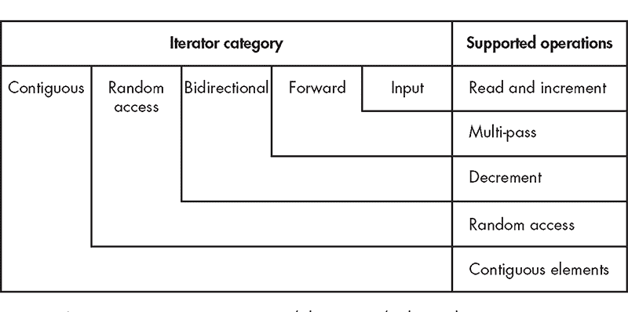
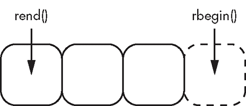

## 迭代器**

*说“朋友”然后进入。

—J.R.R. 托尔金*, 《魔戒》


迭代器是 STL 组件，用于提供容器和算法之间的接口以操作它们。迭代器是一个接口，指向知道如何遍历特定序列的类型，并暴露类似指针的简单操作来访问元素。

每个迭代器至少支持以下操作：

+   访问当前元素（`operator*`）进行读取和/或写入

+   转到下一个元素（`operator++`）

+   拷贝构造

迭代器根据支持的额外操作进行分类。这些类别决定了哪些算法可用，以及你可以在通用代码中对迭代器做什么。在本章中，你将学习这些迭代器类别、便利函数和适配器。

### 迭代器类别

迭代器的类别决定了它支持的操作。这些操作包括读取和写入元素、前向和后向遍历、重复读取和访问随机元素。

由于接受迭代器的代码通常是通用的，因此迭代器的类型通常是一个模板参数，你可以通过概念来编码它，正如你在“概念”一章中学习的那样，见第 163 页。尽管你可能不需要直接与迭代器交互（除非你在编写库），但你仍然需要了解迭代器的类别，以免将算法应用于不合适的迭代器。如果你这么做了，可能会遇到难以理解的编译器错误。回想一下在“模板中的类型检查”一章中提到的内容，见第 161 页，由于模板实例化的方式，从不适当类型参数生成的错误消息通常是难以理解的。

#### *输出迭代器*

你可以使用 *输出迭代器* 来写入并递增，但不能做其他操作。可以将输出迭代器视为一个无底洞，你将数据丢入其中。

使用输出迭代器时，你先写入，再递增，再写入，再递增，一直如此。一旦你向输出迭代器写入内容，在至少递增一次之前不能再写入。同样，向输出迭代器递增之后，在写入之前不能再递增。

要向输出迭代器写入内容，使用解引用操作符（`*`）解引用迭代器，并将值赋给结果引用。要递增输出迭代器，使用 `operator++` 或 `operator++(int)`。

再次强调，除非你在编写 C++ 库，否则不太可能需要*实现*自己的输出迭代器类型；然而，你会*频繁使用*它们。

一个常见的用法是像使用输出迭代器一样写入容器。为此，你可以使用插入迭代器。

##### 插入迭代器

*插入迭代器*（或 *插入器*）是一个输出迭代器，它包装一个容器，并将写操作（赋值）转化为插入操作。STL 的 `<iterator>` 头文件中有三个插入迭代器，作为类模板存在：

+   `std::back_insert_iterator`

+   `std::front_insert_iterator`

+   `std::insert_iterator`

STL 还提供了三个便利函数，用于构建这些迭代器：

+   `std::back_inserter`

+   `std::front_inserter`

+   `std::inserter`

`back_insert_iterator` 将迭代器写入操作转换为对容器 `push_back` 的调用，而 `front_insert_iterator` 则是调用 `push_front`。这两种插入迭代器都公开了一个接受容器引用的构造函数，而它们对应的便利函数只接受一个参数。显然，被包装的容器必须实现相应的方法。例如，`vector` 不适用于 `front_insert_iterator`，而 `set` 也不适用于这两者。

`insert_iterator` 接受两个构造函数参数：一个容器用于包装，另一个是指向该容器中某个位置的迭代器。然后，`insert_iterator` 将写入操作转换为对容器 `insert` 方法的调用，并将你在构造时提供的位置作为第一个参数。例如，你可以使用 `insert_iterator` 将元素插入到顺序容器的中间，或者在 `set` 中带提示地添加元素。

**注意**

*在内部，所有的插入迭代器完全忽略 `operator++`、`operator++(int)` 和 `operator*`。容器不需要在插入之间执行这个中间步骤，但这通常是输出迭代器的一个要求。*

代码示例 14-1 通过向 `deque` 添加元素，展示了三种插入迭代器的基本用法。

```
#include <deque>
#include <iterator>

TEST_CASE("Insert iterators convert writes into container insertions.") {
  std::deque<int> dq;
  auto back_instr = std::back_inserter(dq); ➊
  *back_instr = 2; ➋ // 2
  ++back_instr; ➌
  *back_instr = 4; ➍ // 2 4
  ++back_instr;

  auto front_instr = std::front_inserter(dq); ➎
  *front_instr = 1; ➏ // 1 2 4
  ++front_instr;

  auto instr = std::inserter(dq, dq.begin()+2); ➐
  *instr = 3; ➑ // 1 2 3 4
  instr++;

  REQUIRE(dq[0] == 1);
  REQUIRE(dq[1] == 2);
  REQUIRE(dq[2] == 3);
  REQUIRE(dq[3] == 4); ➒
}
```

*代码示例 14-1：插入迭代器将写入操作转换为容器插入。*

首先，你使用 `back_inserter` 构建一个 `back_insert_iterator` 来包装一个名为 `dq` 的 `deque` ➊。当你向 `back_insert_iterator` 写入时，它会将写入操作转换为 `push_back`，因此 `deque` 只包含一个元素 `2` ➋。因为输出迭代器在再次写入之前需要进行递增操作，所以你接着进行一次递增 ➌。当你向 `back_insert_iterator` 写入 `4` 时，它会再次将写入操作转换为 `push_back`，使得 `deque` 包含元素 `2 4` ➍。

接下来，你可以使用 `front_inserter` 构建一个 `front_insert_iterator` 来包装 `dq` ➎。将 `1` 写入这个新构造的插入器时，它会调用 `push_front`，因此双端队列包含元素 `1 2 4` ➏。

最后，你可以通过传递 `dq` 和一个指向其第三个元素（`4`）的迭代器，使用 `inserter` 构建一个 `insert_iterator`。当你向这个插入器写入 `3` ➑ 时，它会将元素插入到由构造时传入的迭代器所指向元素之前 ➐。最终，`dq` 包含元素 `1 2 3 4` ➒。

表 14-1 总结了插入迭代器。

**表 14-1：** 插入迭代器汇总

| **类** | **便利函数** | **委托函数** | **示例容器** |
| --- | --- | --- | --- |
| `back_insert_iterator` | `back_inserter` | `push_back` | 向量、双端队列、列表 |
| `front_insert_iterator` | `front_inserter` | `push_front` | 双端队列、列表 |
| `insert_iterator` | `inserter` | `insert` | 向量，双端队列，列表，集合 |

##### 支持的输出迭代器操作列表

表 14-2 总结了输出迭代器支持的操作。

**表 14-2：** 输出迭代器支持的操作

| **操作** | **备注** |
| --- | --- |
| `*`itr`=`t | 写入输出迭代器。操作后，迭代器可以递增，但不一定可以解引用。 |
| `++`itr`++` | 递增迭代器。操作后，迭代器要么可以解引用，要么已耗尽（超出末尾），但不一定可以递增。 |
| 迭代器类型`{` itr `}` | 从`itr`拷贝构造一个迭代器。 |

#### *输入迭代器*

你可以使用*输入迭代器*来*读取*、*递增*并检查相等性。它是输出迭代器的对立面。你只能通过输入迭代器遍历一次。

从输入迭代器读取时的常见模式是获取一个半开范围，包含*begin*和*end*迭代器。要遍历这个范围，你使用`operator*`读取`begin`迭代器，然后通过`operator++`递增。接下来，你判断迭代器是否等于`end`。如果是，你已经耗尽了范围。如果不是，你可以继续读取/递增。

**注意**

*输入迭代器是使“基于范围的`for`循环”在第 234 页中讨论的范围表达式工作的魔法。*

输入迭代器的一个典型用法是包装程序的标准输入（通常是键盘）。一旦从标准输入读取一个值，它就消失了。你不能返回开始并重播。这种行为与输入迭代器支持的操作非常契合。

在“迭代器速成课程”中，你学习到每个容器都暴露了具有`begin`/`cbegin`/`end`/`cend`方法的迭代器。所有这些方法*至少*是输入迭代器（并且可能支持额外的功能）。例如，清单 14-2 演示了如何从`forward_list`中提取范围并手动操作迭代器以进行读取。

```
#include <forward_list>

TEST_CASE("std::forward_list begin and end provide input iterators") {
  const std::forward_list<int> easy_as{ 1, 2, 3 }; ➊
  auto itr = easy_as.begin(); ➋
  REQUIRE(*itr == 1); ➌
  itr++; ➍
  REQUIRE(*itr == 2);
  itr++;
  REQUIRE(*itr == 3);
  itr++;
  REQUIRE(itr == easy_as.end()); ➎
}
```

*清单 14-2：与来自`forward_list`的输入迭代器交互*

你创建一个包含三个元素的`forward_list` ➊。容器的常量性意味着元素是不可变的，因此迭代器仅支持读取操作。你通过`forward_list`的`begin`方法提取一个迭代器 ➋。使用`operator*`，你提取由`itr`指向的元素 ➌，并随后执行必要的递增操作 ➍。一旦通过读取/递增耗尽了范围，`itr`等于`forward_list`的`end` ➎。

表 14-3 总结了输入迭代器支持的操作。

**表 14-3：** 输入迭代器支持的操作

| **操作** | **备注** |
| --- | --- |
| `*`itr | 解引用指向的成员。可能是只读的，也可能不是。 |
| itr`->`mbr | 解引用迭代器指向的对象的成员 mbr。 |
| `++`itr itr`++` | 递增迭代器。操作后，迭代器要么可解引用，要么已被耗尽（超出末尾）。 |
| itr1 `==` itr2itr1 `!=` itr2 | 比较迭代器是否相等（是否指向相同元素）。 |
| iterator-type`{` itr `}` | 通过迭代器 itr 复制构造一个新的迭代器。 |

#### *前向迭代器*

*前向迭代器*是一种具备额外功能的输入迭代器：前向迭代器还可以进行多次遍历、默认构造和复制赋值。在所有情况下，你都可以使用前向迭代器代替输入迭代器。

所有 STL 容器都提供前向迭代器。因此，在示例 14-2 中使用的`forward_list`实际上提供了一个前向迭代器（它也是一个输入迭代器）。

示例 14-3 更新了示例 14-2，使其能够多次遍历`forward_list`。

```
TEST_CASE("std::forward_list’s begin and end provide forward iterators") {
  const std::forward_list<int> easy_as{ 1, 2, 3 }; ➊
  auto itr1 = easy_as.begin(); ➋
  auto itr2{ itr1 }; ➌
  int double_sum{};
  while (itr1 != easy_as.end()) ➍
    double_sum += *(itr1++);
  while (itr2 != easy_as.end()) ➎
    double_sum += *(itr2++);
  REQUIRE(double_sum == 12); ➏
}
```

*示例 14-3：双向遍历前向迭代器两次*

同样，你创建了一个包含三个元素的`forward_list` ➊。你通过`forward_list`的`begin`方法提取出一个名为`itr1`的迭代器 ➋，然后创建一个名为`itr2`的副本 ➌。你遍历`itr1` ➍ 和`itr2` ➎，在两次遍历过程中求和。最终的`double_sum`等于 12 ➏。

表 14-4 总结了前向迭代器支持的操作。

**表 14-4：** 前向迭代器支持的操作

| **操作** | **说明** |
| --- | --- |
| `*`itr | 解引用所指向的成员。可能是只读的，也可能不是。 |
| itr`->`mbr | 解引用迭代器 itr 所指向对象的成员 mbr。 |
| `++`itr itr`++` | 递增迭代器，使其指向下一个元素。 |
| itr1 `==` itr2itr1 `!=` itr2 | 比较迭代器是否相等（是否指向相同元素）。 |
| iterator-type`{}` | 默认构造一个迭代器。 |
| iterator-type`{` itr `}` | 通过迭代器 itr 复制构造一个新的迭代器。 |
| itr1 `=` itr2 | 将迭代器 itr2 赋值给 itr1。 |

#### *双向迭代器*

*双向迭代器*是一种前向迭代器，它也可以向后迭代。你可以在所有情况下使用双向迭代器代替前向或输入迭代器。

双向迭代器允许使用`operator--`和`operator—(int)`进行反向迭代。提供双向迭代器的 STL 容器包括`array, list`, `deque, vector`，以及所有有序关联容器。

示例 14-4 展示了如何使用`list`的双向迭代器进行双向遍历。

```
#include <list>

TEST_CASE("std::list begin and end provide bidirectional iterators") {
  const std::list<int> easy_as{ 1, 2, 3 }; ➊
  auto itr = easy_as.begin(); ➋
  REQUIRE(*itr == 1); ➌
  itr++; ➍
  REQUIRE(*itr == 2);
  itr--; ➎
  REQUIRE(*itr == 1); ➏
  REQUIRE(itr == easy_as.cbegin());
}
```

*示例 14-4：`std::list`的方法`begin`和`end`提供双向迭代器。*

在这里，你创建了一个包含三个元素的`list` ➊。你通过`list`的`begin`方法提取出一个迭代器，命名为`itr` ➋。像输入迭代器和前向迭代器一样，你可以解引用 ➌ 并递增 ➍ 该迭代器。此外，你还可以递减迭代器 ➎，以便回到已经遍历过的元素 ➏。

表 14-5 总结了双向迭代器支持的操作。

**表 14-5：** 双向迭代器支持的操作

| **操作** | **说明** |
| --- | --- |
| `*`itr | 解引用指向的成员，可能是只读的，也可能不是。 |
| itr`->`mbr | 解引用迭代器指向对象的成员 mbr。 |
| `++`itritr`++` | 递增迭代器，使其指向下一个元素。 |
| `--`itritr`--` | 递减迭代器，使其指向前一个元素。 |
| itr1 `==` itr2itr1 `!=` itr2 | 比较两个迭代器是否相等（指向相同元素）。 |
| iterator-type`{}` | 默认构造一个迭代器。 |
| iterator-type`{` itr `}` | 从 itr 复制构造一个迭代器。 |
| itr1 `=` itr2 | 将迭代器 itr1 赋值为 itr2。 |

#### *随机访问迭代器*

一个*随机访问迭代器*是一个支持随机元素访问的双向迭代器。你可以在所有情况下使用随机访问迭代器替代双向、前向和输入迭代器。

随机访问迭代器允许使用`operator[]`进行随机访问，还支持迭代器算术运算，比如加法或减法整数值，以及通过减法计算其他迭代器之间的距离。提供随机访问迭代器的 STL 容器有`array`、`vector`和`deque`。列表 14-5 展示了如何通过随机访问迭代器从`vector`访问任意元素。

```
#include <vector>

TEST_CASE("std::vector begin and end provide random-access iterators") {
  const std::vector<int> easy_as{ 1, 2, 3 }; ➊
  auto itr = easy_as.begin(); ➋
  REQUIRE(itr[0] == 1); ➌
  itr++; ➍
  REQUIRE(*(easy_as.cbegin() + 2) == 3); ➎
  REQUIRE(easy_as.cend() - itr == 2); ➏
}
```

*列表 14-5：与随机访问迭代器的交互*

你创建了一个包含三个元素的`vector` ➊。你通过`vector`的`begin`方法提取出一个叫`itr`的迭代器 ➋。由于这是一个随机访问迭代器，你可以使用`operator[]`来解引用任意元素 ➌。当然，你仍然可以使用`operator++`来递增迭代器 ➍。你还可以通过加法或减法来操作迭代器，以访问给定偏移量的元素 ➎➏。

##### 支持的随机访问迭代器操作列表

表 14-6 总结了随机访问迭代器支持的操作。

**表 14-6：** 随机访问迭代器支持的操作

| **操作** | **说明** |
| --- | --- |
| itr`[`n`]` | 解引用索引为 n 的元素。 |
| itr`+`nitr`-`n | 返回位于 itr 偏移量 n 处的迭代器。 |
| itr2`-`itr1 | 计算 itr1 和 itr2 之间的距离。 |
| `*`itr | 解引用指向的成员，可能是只读的，也可能不是。 |
| itr`->`mbr | 解引用迭代器指向对象的成员 mbr。 |
| `++`itritr`++` | 递增迭代器，使其指向下一个元素。 |
| `--`itritr`--` | 递减迭代器，使其指向前一个元素。 |
| itr1 `==` itr2itr1 `!=` itr2 | 比较两个迭代器是否相等（指向相同元素）。 |
| iterator-type`{}` | 默认构造一个迭代器。 |
| iterator-type`{` itr `}` | 从 itr 复制构造一个迭代器。 |
| itr1 `<` itr2itr1 `>` itr2itr1 `<=` itr2itr1 `>=` itr2 | 执行对应的迭代器位置比较。 |

#### *连续迭代器*

*连续迭代器* 是一种随机访问迭代器，其元素在内存中是相邻的。对于一个连续迭代器 `itr`，所有元素 `itr[n]` 和 `itr[n+1]` 对于所有有效的索引 `n` 和偏移量 `i`，都满足以下关系：

```
&itr[n] + i == &itr[n+i]
```

`vector` 和 `array` 容器提供连续的迭代器，但 `list` 和 `deque` 不提供。

#### *可变迭代器*

所有的前向迭代器、双向迭代器、随机访问迭代器和连续迭代器都可以支持只读模式或读写模式。如果一个迭代器支持读写，你可以将值赋给通过解引用迭代器返回的引用。这种迭代器被称为 *可变迭代器*。例如，一个支持读取和写入的双向迭代器被称为可变双向迭代器。

到目前为止，在每个例子中，用于支撑迭代器的容器都是 `const`。这会产生指向 `const` 对象的迭代器，这当然是不可写的。清单 14-6 从一个（非 `const`）`deque` 中提取出一个可变的随机访问迭代器，允许你对容器的任意元素进行写操作。

```
#include <deque>

TEST_CASE("Mutable random-access iterators support writing.") {
  std::deque<int> easy_as{ 1, 0, 3 }; ➊
  auto itr = easy_as.begin(); ➋
  itr[1] = 2; ➌
  itr++; ➍
  REQUIRE(*itr == 2); ➎
}
```

*清单 14-6：一个可变的随机访问迭代器允许写操作。*

你构造一个包含三个元素的 `deque` ➊，然后获取一个指向第一个元素的迭代器 ➋。接下来，你将值 2 写入第二个元素 ➌。然后，你增加迭代器，使其指向刚刚修改的元素 ➍。当你解引用该元素时，你将得到你写入的值 ➎。

图 14-1 说明了输入迭代器与其所有功能更强的后代之间的关系。



*图 14-1：输入迭代器类别及其嵌套关系*

总结来说，输入迭代器仅支持读取和递增。前向迭代器也是输入迭代器，因此它们也支持读取和递增，但还允许你多次迭代它们的范围（“多次遍历”）。双向迭代器也是前向迭代器，但它们额外允许进行递减操作。随机访问迭代器也是双向迭代器，但你可以直接访问序列中的任意元素。最后，连续迭代器是随机访问迭代器，它保证其元素在内存中是连续的。

### 辅助迭代器函数

如果你编写处理迭代器的通用代码，应该使用来自 `<iterator>` 头文件的 *辅助迭代器函数* 来操作迭代器，而不是直接使用支持的操作。这些迭代器函数执行常见的任务，如遍历、交换和计算迭代器之间的距离。使用辅助函数而不是直接操作迭代器的主要优势在于，辅助函数会检查迭代器的类型特征，并确定执行所需操作的最有效方法。此外，辅助迭代器函数使通用代码更加通用，因为它可以适用于更广泛的迭代器。

#### *std::advance*

`std::advance` 辅助迭代器函数允许你按所需的数量递增或递减。此函数模板接受一个迭代器引用和一个整数值，该值对应你希望移动迭代器的距离：

```
void std::advance(InputIterator&➊ itr, Distance➋ d);
```

`InputIterator` 模板参数必须至少是输入迭代器 ➊，而 `Distance` 模板参数通常是一个整数 ➋。

`advance` 函数不执行边界检查，因此必须确保没有超出迭代器位置的有效范围。

根据迭代器的类别，`advance` 将执行最有效的操作来实现所需的效果：

**输入迭代器** `advance` 函数将调用 `itr++` 正确次数；`dist` 不能为负数。

**双向迭代器** 该函数将调用 `itr++` 或 `itr--` 正确次数。

**随机访问迭代器** 它将调用 `itr+=dist`；`dist` 可以是负数。

**注意**

*随机访问迭代器在使用 `advance` 时会比其他类型的迭代器更高效，因此如果你想避免最坏情况（线性时间）的性能，可以考虑使用 `operator+=` 而不是 `advance`。*

示例 14-7 展示了如何使用 `advance` 操作随机访问迭代器。

```
#include <iterator>

TEST_CASE("advance modifies input iterators") {
  std::vector<unsigned char> mission{ ➊
    0x9e, 0xc4, 0xc1, 0x29,
    0x49, 0xa4, 0xf3, 0x14,
    0x74, 0xf2, 0x99, 0x05,
    0x8c, 0xe2, 0xb2, 0x2a
  };
  auto itr = mission.begin(); ➋
  std::advance(itr, 4); ➌
  REQUIRE(*itr == 0x49);
  std::advance(itr, 4); ➍
  REQUIRE(*itr == 0x74);
  std::advance(itr, -8); ➎
  REQUIRE(*itr == 0x9e);
}
```

*示例 14-7：使用 `advance` 操作连续迭代器*

这里，你初始化了一个名为 `mission` 的 `vector`，包含 16 个 `unsigned char` 对象 ➊。接着，你通过 `mission` 的 `begin` 方法提取一个名为 `itr` 的迭代器 ➋，并在 `itr` 上调用 `advance` 将其前进四个元素，使其指向第四个元素（值为 0x49） ➌。再前进四个元素，指向第八个元素（值为 0x74） ➍。最后，你调用 `advance` 将迭代器后退 8 个值，使其再次指向第一个元素（值为 0x9e） ➎。

#### *std::next 和 std::prev*

`std::next` 和 `std::prev` 辅助迭代器函数是函数模板，用于计算相对于给定迭代器的偏移量。它们返回一个指向所需元素的新迭代器，而不会修改原始迭代器，如下所示：

```
ForwardIterator std::next(ForwardIterator& itr➊, Distance d=1➋);
BidirectionalIterator std::prev(BidirectionalIterator& itr➌, Distance d=1➍);
```

`next` 函数接受至少一个前向迭代器 ➊，并且可选地接受一个距离 ➋，它返回一个指向相应偏移量的迭代器。如果 `itr` 是双向迭代器，这个偏移量可以是负数。`prev` 函数模板与 `next` 在反向操作时类似：它至少接受一个双向迭代器 ➌，并且可选地接受一个距离 ➍（这个距离可以是负数）。

`next` 和 `prev` 都不执行边界检查。这意味着你必须确保自己的数学计算是正确的，并且在序列范围内，否则你会遇到未定义的行为。

**注意**

*对于 `next` 和 `prev`，除非是右值，否则 `itr` 保持不变，在这种情况下会使用 `advance` 来提高效率。*

示例 14-8 演示了如何使用 `next` 获取一个新的迭代器，指向给定偏移量处的元素。

```
#include <iterator>

TEST_CASE("next returns iterators at given offsets") {
  std::vector<unsigned char> mission{
    0x9e, 0xc4, 0xc1, 0x29,
    0x49, 0xa4, 0xf3, 0x14,
    0x74, 0xf2, 0x99, 0x05,
    0x8c, 0xe2, 0xb2, 0x2a
  };
  auto itr1 = mission.begin(); ➊
  std::advance(itr1, 4); ➋
  REQUIRE(*itr1 == 0x49); ➌

  auto itr2 = std::next(itr1); ➍
  REQUIRE(*itr2 == 0xa4); ➎

  auto itr3 = std::next(itr1, 4); ➏
  REQUIRE(*itr3 == 0x74); ➐

  REQUIRE(*itr1 == 0x49); ➑
}
```

*示例 14-8：使用 `next` 获取迭代器的偏移量*

如同 示例 14-7 中所示，你初始化一个包含 16 个 `unsigned char` 的 vector，并提取一个指向第一个元素的迭代器 `itr1` ➊。你使用 `advance` 将迭代器递增四个元素 ➋，使其指向值为 0x49 的元素 ➌。第一次使用 `next` 时省略了距离参数，默认为 1 ➍。这会生成一个新的迭代器 `itr2`，它指向 `itr1` 后一个元素 ➎。

你第二次调用 `next`，并传递一个距离参数 4 ➏。这会产生另一个新的迭代器 `itr3`，它指向 `itr1` 后四个元素 ➐。这些调用都不会影响原始的迭代器 `itr1` ➑。

#### *std::distance*

`std::distance` 辅助迭代器函数允许你计算两个输入迭代器 `itr1` 和 `itr2` 之间的距离：

```
Distance std::distance(InputIterator itr1, InputIterator itr2);
```

如果迭代器不是随机访问的，`itr2` 必须指向 `itr1` 后面的元素。确保 `itr2` 在 `itr1` 之后是个好习惯，因为如果你不小心违反了这一要求并且迭代器不是随机访问的，你将遇到未定义的行为。

示例 14-9 演示了如何计算两个随机访问迭代器之间的距离。

```
#include <iterator>

TEST_CASE("distance returns the number of elements between iterators") {
  std::vector<unsigned char> mission{ ➊
    0x9e, 0xc4, 0xc1, 0x29,
    0x49, 0xa4, 0xf3, 0x14,
    0x74, 0xf2, 0x99, 0x05,
    0x8c, 0xe2, 0xb2, 0x2a
  };
  auto eighth = std::next(mission.begin(), 8); ➋
  auto fifth = std::prev(eighth, 3); ➌
  REQUIRE(std::distance(fifth, eighth) == 3); ➍
}
```

*示例 14-9：使用 `distance` 获取迭代器之间的距离*

在初始化 `vector` ➊ 后，你使用 `std::next` ➋ 创建一个指向 `第八` 个元素的迭代器。你在 `第八` 个元素上使用 `std::prev`，通过传递 3 作为第二个参数 ➌ 来获得指向 `第五` 个元素的迭代器。当你将 `第五` 个元素和 `第八` 个元素作为参数传递给 `distance` 时，你会得到 3 ➍。

#### *std::iter_swap*

`std::iter_swap` 辅助迭代器函数允许你交换两个前向迭代器 `itr1` 和 `itr2` 指向的值：

```
Distance std::iter_swap(ForwardIterator itr1, ForwardIterator itr2);
```

迭代器不需要具有相同的类型，只要它们指向的类型可以相互赋值。示例 14-10 演示了如何使用 `iter_swap` 交换两个 `vector` 元素。

```
#include <iterator>

TEST_CASE("iter_swap swaps pointed-to elements") {
  std::vector<long> easy_as{ 3, 2, 1 }; ➊
  std::iter_swap(easy_as.begin()➋, std::next(easy_as.begin(), 2)➌);
  REQUIRE(easy_as[0] == 1); ➍
  REQUIRE(easy_as[1] == 2);
  REQUIRE(easy_as[2] == 3);
}
```

*示例 14-10：使用 `iter_swap` 交换指向的元素*

在构造一个元素为`3 2 1`的`vector`之后 ➊，你对第一个元素 ➋ 和最后一个元素 ➌ 调用`iter_swap`。交换后，`vector`包含元素`1 2 3` ➍。

### 其他迭代器适配器

除了插入迭代器，STL 还提供了移动迭代器适配器和逆向迭代器适配器来修改迭代器行为。

**注意**

*STL 还提供了流迭代器适配器，你将在第十六章中学习它们，内容涉及流。*

#### *移动迭代器适配器*

*移动迭代器适配器*是一个类模板，它将所有迭代器访问转换为移动操作。头文件`<iterator>`中的便利函数模板`std::make_move_iterator`接受一个迭代器参数并返回一个移动迭代器适配器。

移动迭代器适配器的经典用法是将一系列对象移动到一个新的容器中。考虑清单 14-11 中的玩具类`Movable`，它存储一个名为`id`的`int`值。

```
struct Movable{
  Movable(int id) : id{ id } { } ➊
  Movable(Movable&& m) {
    id = m.id; ➋
    m.id = -1; ➌
  }
  int id;
};
```

*清单 14-11：`Movable`类存储一个`int`。*

`Movable`的构造函数接受一个`int`并将其存储到`id`字段中 ➊。`Movable`也是可移动构造的；它将从其移动构造函数参数中偷取`id` ➋，并将其替换为−1 ➌。

清单 14-12 构造了一个`Movable`对象的`vector`，名为`donor`，并将它们移动到一个名为`recipient`的`vector`中。

```
#include <iterator>

TEST_CASE("move iterators convert accesses into move operations") {
  std::vector<Movable> donor; ➊
  donor.emplace_back(1); ➋
  donor.emplace_back(2);
  donor.emplace_back(3);
  std::vector<Movable> recipient{
    std::make_move_iterator(donor.begin()), ➌
    std::make_move_iterator(donor.end()),
  };
  REQUIRE(donor[0].id == -1); ➍
  REQUIRE(donor[1].id == -1);
  REQUIRE(donor[2].id == -1);
  REQUIRE(recipient[0].id == 1); ➎
  REQUIRE(recipient[1].id == 2);
  REQUIRE(recipient[2].id == 3);
}
```

*清单 14-12：使用移动迭代器适配器将迭代器操作转换为移动操作*

在这里，你默认构造一个名为`donor`的`vector` ➊，并用`id`字段为 1、2 和 3 的三个`Movable`对象调用`emplace_back` ➋。然后，你使用`vector`的范围构造函数，传入`donor`的`begin`和`end`迭代器，并将它们传递给`make_move_iterator` ➌。这将所有迭代器操作转换为移动操作，因此会调用`Movable`的移动构造函数。结果，`donor`的所有元素都处于已移动状态 ➍，而`recipient`的所有元素与`donor`之前的元素相匹配 ➎。

#### *逆向迭代器适配器*

*逆向迭代器适配器*是一个类模板，它交换迭代器的增量和递减操作符。其效果是通过应用逆向迭代器适配器，你可以反转算法的输入。一个常见的使用逆向迭代器的场景是从容器的末尾向后搜索。例如，假设你将日志推送到一个`deque`的末尾，并希望查找满足某些条件的最新条目。

几乎所有容器都在第十三章中暴露了逆向迭代器，提供`rbegin`/`rend`/`crbegin`/`crend`方法。例如，你可以创建一个容器，它包含另一个容器的逆序，如清单 14-13 所示。

```
TEST_CASE("reverse iterators can initialize containers") {
  std::list<int> original{ 3, 2, 1 }; ➊
  std::vector<int> easy_as{ original.crbegin(), original.crend() }; ➋
  REQUIRE(easy_as[0] == 1); ➌
  REQUIRE(easy_as[1] == 2);
  REQUIRE(easy_as[2] == 3);
}
```

*清单 14-13：创建一个包含另一个容器元素逆序的容器*

在这里，你创建了一个包含元素`3 2 1`的`list` ➊。接着，你使用`crbegin`和`crend`方法构建了一个反向顺序的`vector` ➋。这个`vector`包含`1 2 3`，是`list`元素的反向顺序 ➌。

尽管容器通常直接暴露反向迭代器，但你也可以手动将正常的迭代器转换为反向迭代器。`<iterator>`头文件中的便利函数模板`std::make_reverse_iterator`接受一个单一的迭代器参数，并返回一个反向迭代器适配器。

反向迭代器设计用于与半开区间配合使用，这些半开区间与正常的半开区间正好相反。在内部，*反向半开区间*有一个`rbegin`迭代器，指向半开区间的`end`后一个位置，并且有一个`rend`迭代器，指向半开区间的`begin`，如图 14-2 所示。



*图 14-2：一个反向半开区间*

然而，这些实现细节对用户是透明的。迭代器会按预期进行解引用。只要区间不为空，你就可以解引用反向开始迭代器，它将返回第一个元素。但你*不能*解引用反向结束迭代器。

为什么要引入这种表示上的复杂性？通过这种设计，你可以轻松地交换半开区间的开始和结束迭代器，以生成一个反向半开区间。例如，列表 14-14 使用`std::make_reverse_iterator`将普通迭代器转换为反向迭代器，实现了与列表 14-13 相同的任务。

```
TEST_CASE("make_reverse_iterator converts a normal iterator") {
  std::list<int> original{ 3, 2, 1 };
  auto begin = std::make_reverse_iterator(original.cend()); ➊
  auto end = std::make_reverse_iterator(original.cbegin()); ➋
  std::vector<int> easy_as{ begin, end }; ➌
  REQUIRE(easy_as[0] == 1);
  REQUIRE(easy_as[1] == 2);
  REQUIRE(easy_as[2] == 3);
}
```

*列表 14-14：`make_reverse_iterator`函数将普通迭代器转换为反向迭代器*

特别注意你从`original`中提取的迭代器。要创建`begin`迭代器，你需要从`original`中提取一个`end`迭代器，并将其传递给`make_reverse_iterator` ➊。反向迭代器适配器会交换递增和递减操作符，但它需要从正确的位置开始。同样，你需要在原始序列的开始处终止，因此你将`cbegin`的结果传递给`make_reverse_iterator`，以生成正确的结束迭代器 ➋。将这些传递给`easy_as`的范围构造器 ➌，会产生与列表 14-13 相同的结果。

**注意**

*所有反向迭代器都暴露一个`base`方法，该方法将反向迭代器转换回普通迭代器。*

### 总结

在这一短小的章节中，你学习了所有的迭代器类别：输出迭代器、输入迭代器、前向迭代器、双向迭代器、随机访问迭代器和连续迭代器。了解每种类别的基本特性为你提供了一个框架，用于理解容器如何与算法连接。该章节还介绍了迭代器适配器，使你能够自定义迭代器行为，以及辅助迭代器函数，帮助你用迭代器编写通用代码。

**练习**

**14-1.** 使用`std::prev`而不是`std::next`，创建一个与清单 14-8 相应的推论。

**14-2.** 编写一个名为`sum`的函数模板，该模板接受一个半开区间的`int`对象并返回该序列的和。

**14-3.** 编写一个程序，使用清单 12-25 中的`Stopwatch`类来确定在给定来自大`std::forward_list`和大`std::vector`的正向迭代器时，`std::advance`的运行时性能。随着容器中元素数量的增加，运行时性能如何变化？（尝试数十万或数百万个元素。）

**进一步阅读**

+   *C++标准库：教程与参考*，第 2 版，作者 Nicolai M. Josuttis（Addison-Wesley Professional，2012 年）

+   *C++模板：完全指南*，第 2 版，作者 David Vandevoorde 等人（Addison-Wesley，2017 年）
