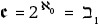
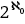

# 第一章：加密字典

# #

## 2013 年

爱德华·斯诺登泄露了关于美国国家安全局（NSA）机密活动的文件的年份，成为密码学的一个转折点。端到端加密突然成为一个引人注目的话题。

## 最常见的 RSA 公钥指数；大到足以保证安全，小到使得指数运算快速，并且具有优化实现速度的形式（65537 = 2¹⁶ + 1）。

# A

## A5/0

早期移动电话标准（GSM）中的三种加密模式之一。A5/0 表示*无加密*；因此，手机通话的音频内容将在手机设备和最近的基站之间以明文形式传输。它的安全性就像早期版本的 TLS 协议中的*空密码*一样。

## A5/1

西方国家默认的 GSM 密码（3G 和 4G 技术之前），用于加密编码的音频移动通信。这是一种基于三个线性反馈移位寄存器不规则时钟驱动的流密码机制，因此寄存器的更新取决于其他两个寄存器中的某些位的值。复杂的密码分析攻击已经破解了 A5/1。但是在实际操作中，最有效的攻击方法相对简单：它是一种时间-内存权衡，利用了 A5/1（64 位）状态短小的特点，并涉及到大型彩虹表的预计算。A5/1 的规范最初是机密的，并且在 1990 年代末被逆向工程之前未公开。

## A5/2

A5/1 的出口版本，一种委婉的说法，意味着其技术要求包括像*必须容易被西方国家的情报机构破解*之类的内容。设计时就有意不安全，A5/2 最终并没有变得极其不安全：在 A5/1 被逆向工程的同时，学术研究人员很快找到了针对 A5/2 的攻击。不过这些攻击在理论上比在实践中更为高效。

## A5/3

最终，手机中终于出现了真正的密码算法。这是对 DIY A5/1 的升级，应用了一个已经公开且经过验证的算法——即块密码 KASUMI。KASUMI 曾在 2G（与 A5/1 一起使用）、3G 中作为 A5/4（与 SNOW 3G 一起使用），而在 4G 中已不再被支持。

参见*KASUMI*。

## A5/4

A5/3，但密钥为 128 位而非 64 位；A5/4 是安全的，而 A5/3 则不安全。

## 自适应攻击

一种攻击方式，攻击者的行为取决于他们在攻击过程中观察到的情况以及协议的执行。例如，在自适应的明文选择攻击中，攻击者发送的明文消息依赖于他们之前查询的响应。在非自适应攻击中，攻击者查询密文的明文列表必须是预先确定的。

## AEAD（带关联数据的认证加密）

一种对称加密算法，通过生成密文和认证标签来加密和认证数据。解密步骤仅在标签有效时成功，这证明密文是由知道密钥的人创建的。为了验证标签，接收方通常通过从加密消息中计算标签并验证计算值是否与接收到的值相同。

## AES（高级加密标准）

由比利时密码学家 Joan Daemen 和 Vincent Rijmen 设计，并赢得 AES 竞赛的广泛应用的块密码，于 2000 年由 NIST 标准化。今天，它在各种操作模式下得到了普遍使用，如 CBC、GCM 和 SIV。

见*Rijndael*。

## AES-CCM

AES 在计数器与 CBC-MAC 模式下，结合了 CTR 加密模式和 CBC-MAC 认证。AES-CCM 是 NIST 标准，并在 TLS 1.3 和其他一些协议中得到支持，包括蓝牙低能耗。但它的流行程度远不如其兄弟 AES-GCM。原因是，AES-CCM 通常比 AES-GCM 慢且使用起来不那么方便。一篇名为“对 CCM 的批评”的研究论文描述了 CCM 模式的局限性。

在嵌入式平台中，AES-CCM 有时比 AES-GCM 更合适，因为它只需要 AES 算法，而不需要额外的逻辑（不像 GCM 的 GMAC）。

## AES-GCM

AES 在 Galois 计数器模式下，是在撰写时最常见的认证加密原语，也是结束 HMAC 身份验证器统治的原语。在 GCM 模式下，消息在 CTR 模式下进行加密，而 Galois MAC（GMAC，也叫 GHASH）则从密文和关联数据块生成认证标签。无进位乘法指令 PCLMULQDQ 是在 2010 年代由英特尔处理器引入的，用以加速 GMAC 计算。

## AES-GCM-SIV

AES-GCM 的一种变体，其中加密 nonce 是通过认证明文（及任何关联数据）计算得到的标签来确定的。AES-GCM-SIV 的 MAC，称为*POLYVAL*，与 GCM 的 GMAC 略有不同：AES-GCM 采用的是加密后认证的形式，而 AES-GCM-SIV 则是认证和加密的构造。与 AES-GCM 相比，AES-GCM-SIV 的主要优势是，即使重复使用相同的 nonce，它仍然保持安全——这一特性被称为*误用抵抗*。

## AES-NI

官方称为 AES 新指令，但通常称为原生指令，可能是更合适的术语。AES-NI 是通过芯片硅中的硬件逻辑计算 AES 的 CPU 指令，而不是使用芯片的 ALU 执行算术操作的组合。2008 年由英特尔推出时，AES-NI 使 AES 软件速度提升约 10 倍，且作为副产品，能够抵抗缓存时间攻击。

## AES-SIV

见*SIV-AES*。

## AIM（高级信息安全机器）

一款由摩托罗拉在 1990 年代末设计的芯片组，其中包括用于红色和黑色操作的独立 FPGA。被夸张宣传为*“密码学史上最革命性的进展之一”*。NSA 使用它来保护机密和敏感的国家安全信息。市面上的 AIM 不包括机密（A 类）算法，但用户可以编程 FPGA 以支持诸如 ACCORDION 或 BATON 等算法。

## 也称为

在 3GPP 标准术语中，指的是在蜂窝网络用户和用户所属网络之间进行的身份验证密钥协商操作，而该网络可能与服务网络不同。

## AKS（阿格拉瓦尔–凯亚尔–萨克森）

第一种确定性素性测试方法，与随机方法相对。2002 年提出的 AKS 算法论文《PRIMES 是 P 类问题》首次证明了素性测试问题属于 P 复杂度类，即存在一个非随机的多项式时间算法来解决该问题。

查看 *PRIMES*。

## 代数密码分析

一种密码分析形式，其中目标问题（通常是密钥恢复，也包括伪造、区分等）被建模为多元方程系统，通过通用或特定技术来求解。代数密码分析已被用于攻击对称和非对称密码系统。一个典型的目标是基于反馈移位寄存器和低代数度逻辑的流密码，从而生成可以通过代数攻击利用的底层方程。

查看 *Gröbner 基*。

## Alice

Bob 的犯罪伙伴，但从未与 Bob 亲自见过面。根据他们在约翰·戈登 1984 年演讲中的官方传记：“Alice 和 Bob 曾尝试欺诈保险公司，他们通过邮件进行过高额扑克赌博，并通过窃听的电话交换过秘密信息。（……）Alice 和 Bob 有许多强大的敌人。其中之一是税务机关，另一个是秘密警察。这真是太遗憾了，因为他们最喜欢讨论的话题是税务欺诈和推翻政府。”

查看 *Bob*。

## 全有或全无变换（AONT）

一种可逆变换，其中你需要输出的每一位才能确定输入的任何一位。当一个加密方案是 AONT 时，如果你错过了一些密文位，那么解密密钥将无法确定明文（除非缺失的位数非常少，可以通过暴力破解）。RSA 加密中使用的 OAEP 构造就是 AONT 的一个例子。CBC 或 GCM 加密模式不是 AONT。

## 匿名签名

一种不会泄露签名者身份（公钥）的签名，因此需要与签名者进行某种交互才能验证它。它意味着隐形性。

查看 *隐形签名*。

## *应用密码学*

由 Bruce Schneier 于 1996 年出版的书籍，在该领域多年一直是主要参考资料；它让许多学生和工程师接触到加密学。以其开头段落而闻名：“这个世界上有两种加密学：一种是能阻止你的小妹妹阅读你的文件的加密学，另一种是能阻止主要政府读取你文件的加密学。这本书讲的是后者。”

发布 25 年后不可避免地已过时，*应用密码学*仍然值得保留在书架上，只要你不盲目遵循其中的所有建议。它也比 Schneier 的两本前书《电子邮件安全》和《保护你的 Macintosh》要少过时。

## 应用加密学

强调直接应用的加密学领域。与此相对，理论加密学更侧重于基础理解和分析，而非工程实践。术语*应用*具有误导性；应用加密学和理论加密学都可以（并且应该？）在实际应用中同样相关。

## ARC4

RC4 流密码的原始名称；也写作 ARCFOUR。在反向工程确认 RC4 才是实际的 RC4 之前，它谨慎地被称为*所谓的 RC4*，并缩写为 ARC4。

## Argon2

一种在密码哈希竞赛期间开发的密码哈希函数，也是处理密码或任何低熵秘密以派生加密密钥或存储验证器的一种事实标准，能够有效防止使用 GPU、FPGA、专用硬件、预计算表格或侧信道攻击进行破解。

与 PBKDF2 不同，Argon2 除了可配置的迭代次数外，还可以强制使用一定量的内存。与 bcrypt 不同，这种内存量可以是任意值，而不是固定的。与 scrypt 及其他两个相比，Argon2 提供了一个用户友好的界面，便于轻松选择时间和内存参数。它也是一个简单的设计，内部仅使用哈希函数 BLAKE2，而不是所有加密学设计的组合。

请参见 *bcrypt*, *scrypt*, *PBKDF2 (基于密码的密钥派生函数 2)*。

## ARX（加法-旋转-异或）

一种缩写，表示加密算法仅进行整数加法、字节位移或旋转，以及异或操作（与例如使用 S 盒的算法相对）。这个术语是由加密学和安全研究员 Ralf-Philipp Weinmann 在 2009 年提出的。

## ASIACRYPT

亚洲顶级的学术加密学会议，自 1990 年以来每年秋季在亚太地区不同地点举行。唯一一场名称中包含*IACR*子串的 IACR 会议。研究人员会展示经过同行评审的研究论文，标题如“结构保持和可重随机化的 RCCA 安全公钥加密及其应用”和“2G/3G 网络中 GSM 加密的密码分析，未使用彩虹表”。

参见 *CHES*，*CRYPTO*，*Eurocrypt*，*FSE*，*PKC*，*Real World Crypto*，*TCC*。

## 非对称加密

参见 *公钥加密*。

## 攻击

在密码分析的上下文中，展示一种技术，通常描述为一种算法，它违反了攻击的原始协议或原语的设计者所做的安全声明。

## 基于属性的加密（ABE）

一种身份基础加密的泛化，扩展从一个属性（身份）到多个属性。它允许你加密一条信息，不是加密给某个特定的接收者，而是加密给一组属性，以使得只有满足有效属性组合的方可以解密该信息。

属性基础加密（ABE）听起来很强大，但尚未找到许多实际应用。据称，原因是其相对复杂的构造（使用椭圆曲线配对）以及需要一个受信任的第三方（持有生成私钥所需的主密钥）。

参见 *基于身份的加密*。

## 认证密码

参见 *AEAD*。

## 阿克苏洛尔（Axolotl）

Signal 应用的端对端消息传递协议的原始名称。

参见 *Signal 协议*。

# B

## 后门

一种绕过算法或协议安全性的隐蔽特性。陷门是用户已知存在的；后门通常不是。后门曾被定义为*允许偷偷访问数据的特性或缺陷*。一个好的后门必须是不可检测的、NOBUS（仅限我们，或仅由其设计者利用）、可重用、不可修改并且可以否认的。

基于这些原因，密码算法中的后门设计困难，并且更容易在实现中加入，尤其是在内部逻辑不公开且难以去混淆时。NSA 在 Dual_EC_DRBG 中的后门是一个显著例外。不幸的是，关于后门的最有趣的研究并未在 IACR 会议上展示。

## 回溯抵抗

术语由 NIST 特别使用，指的是类似于前向保密的概念。它是预测抵抗的对立面。

参见 *前向保密*。

## 后向保密

与前向保密性相对的概念：后向保密性是指当攻击者泄露某些秘密值时，未来的消息仍然能够得到保护。如果一个系统的整个状态被破坏——包括长期和短期的密钥以及任何秘密状态或计数器——后向保密性通常是不可能的。一个例外是伪随机生成器，通过从可靠的熵源中重新播种，可以将不确定性引入系统，从而防止攻击者从系统的过去快照中推测未来的输出位。在安全消息传递的上下文中，一些模型假设攻击者只会泄露某些密钥集，而不一定是整个本地秘密状态：在这种情况下，某种形式的后向保密性可能会得到保证。

参见 *前向保密性*。

## Base64

不是加密。

## BassOmatic

一种最初由 PGP 的创始人 Phil Zimmermann 设计的密码，用于加密 PGP 中的数据。它被发现不安全，并在 1991 年被 IDEA 替代。正如 Zimmermann 在源代码中评论的那样，“BassOmatic 这个名字来自 Dan Aykroyd 的一个老*星期六夜现场*小品，里面有一个搅拌机和一条整鱼。BassOmatic 算法对数据的处理，就像原始的 BassOmatic 对鱼所做的那样。”

## BB84

第一个量子密钥分发（QKD）方案。由 Bennett 和 Brassard 于 1984 年描述，基于一年前提出的量子货币概念。

## bcrypt

哈希算法：它不进行加密。为了应对 1976 年加密工具的过时问题，在 1999 年的论文《未来适应的密码方案》中定义了这一算法。在这篇论文中，作者做出了以下预测：“除非复杂性理论出现重大突破，否则这些算法应该允许基于密码的系统适应硬件改进，并在未来 20 年内保持安全。”

你可以说这个预言是准确的，因为你可以调整 bcrypt 的速度，使其足够慢，从而抵御密码破解。另一方面，bcrypt 的 4KB 内存使用现在过低，无法有效防止破解。

## 双重团体密码分析

一种针对加密算法的攻击，通过搜索双重团体来实现。在图论中，团体是指所有节点彼此相连的节点子集。双重团体由两个节点子集组成；第一个子集中的每个节点与第二个子集中的所有节点相连。

这个概念被应用于改进对 AES 的差分攻击，并导致了理论上执行比暴力搜索更少操作的攻击（2¹²⁶ 而非 2¹²⁷）。在这种情况下使用的双重团体是由来自内部状态的一组位、来自密文的第二组位以及这两组位之间由密钥位条件化的依赖关系组成。攻击的思想是识别出某些密钥位，它们满足双重团体条件（在异或差异方面）。

## BIKE（位翻转密钥封装）

听起来像 SIKE：也是一种 KEM；也是后量子加密，但基于解码问题，而非同伦问题。

查看 *SIKE（超奇异同伦密钥封装）*。

## BIP（比特币改进提案）

误导性的名称，因为最著名的 BIP 已不再仅仅是提案，而是实际上已成为标准，适用于比特币以外的更多加密货币。这些 BIP 包括：

+   BIP 32 定义了一种基于树形结构的机制，用于从一个秘密种子推导出密钥对和地址，从而通过一个单一的秘密值创建多个账户的钱包。

+   BIP 44 定义了 BIP 32 树级别的语义，并为树内路径的语法定义了格式（包括目的、币种类型、账户、地址类型和地址索引）。

+   BIP 39 定义了将一个秘密值表示为高熵的字典单词列表或助记词，随后将其哈希为种子，该种子将成为 BIP 32 账户层级的根。

## 比特黄金

比特币的最接近前身。

## 比特币

一个失控的实验，无论是好是坏。

## 黑色

NSA 行话，指加密的值。黑色密钥是一种加密密钥，使用例如密钥包装机制进行加密，从而可以在低安全性级别的系统或网络上安全分发。在静态数据保护的上下文中，黑色数据是已加密的机密数据，并且使用适当的加密层进行了两次加密。

查看 *EKMS（电子密钥管理系统）*。

## BLAKE

提交到 2008 年 SHA-3 竞赛中的哈希函数。它是五个决赛选手之一，但未被选中（最终获胜者是 Keccak）。BLAKE 重用了 ChaCha 流密码的置换操作，并且旋转方向相反。有人怀疑这是一种高级优化，但事实上，它源自原始 BLAKE 规范中的一个打字错误。

## BLAKE2

BLAKE 的演变版本，提出于 2012 年 SHA-3 竞赛结束后不久。由于其比 SHA-2 和 SHA-3 更快，它被广泛应用于许多软件中。几个加密货币的工作量证明系统使用 BLAKE2。

## BLAKE3

一种结合了简化版 BLAKE2 和梅克尔树构建的哈希函数，使其比 BLAKE2 更快。BLAKE3 于 2020 年 Real World Crypto 大会宣布。

## Bleichenbacher 攻击

填充 oracle 攻击的典型案例。由 Daniel Bleichenbacher 于 1998 年发现，这是一种针对 PKCS#1 v1.5 RSA 加密方法的自适应选择密文攻击。具有讽刺意味的是，Bleichenbacher 的攻击利用了其他攻击的防护措施（强制填充字节）来制造另一种攻击，经过数百万次选择密文查询后，攻击者可以恢复密文的明文。

## 隐形签名

一种签名方案，其中签名者（知道私钥）创建签名，但不知道所签署的数字，以随机化应用私钥操作的值。这在直接的 RSA 盲签名构造中更为清晰：签名者不使用*md* mod *N*，而是计算 *s*[0] = *m*[0]^(*d*)，其中 *m*[0] = (*m* · *r*^(*e*)) mod *N*，*r*是某个随机值。然后，您可以通过将 *s*[0] 除以 *r* 来得到 *m* 的真实签名。详细信息留给您完成练习。

这种构造可能看起来很熟悉，因为它与防止侧信道攻击的盲化防御使用的相同技巧相同，目的是防止攻击者控制私钥操作处理的数据。

## 块密码

一种将数据块转换为另一个相同长度数据块的密码算法，使用密钥作为参数。必须能够解密该数据块。因此，块密码操作必须是双射的（即一一对应且可逆的）。这就是为什么块密码也被称为*有密钥置换*或*伪随机置换*的原因。

要加密多个数据块，通常是 64 位或 128 位的块，您需要使用一种操作模式（通常使用 ECB 模式不是一个好主意，CBC 更好，CTR 或 SIV 可能更好）。

## 区块链

对密码学而言，既是诅咒也是祝福。类似于当一个亚文化走向主流时，其开创者怀念过去的日子，悲伤且痛苦地思考那些可能不最应得的人所获得的财富。

## 块密码

块密码的另一种拼写，由 Phillip Rogaway 在研究论文中提出。

## Blowfish

1990 年代最流行的块密码之一。它的知名度归功于其令人难忘的名字以及设计者 Bruce Schneier。

## BLS（Boneh-Lynn-Shacham）签名

一种利用椭圆曲线配对的签名方案，允许签名比 ECDSA 和 Schnorr 签名更短。原因是每个签名只包含一个群元素。也就是说，对于与 512 位 ECDSA 签名相似的安全等级，BLS 签名只有 256 位长。

BLS 签名具有支持聚合的有用特性，可以将多个公钥和签名合并成一个公钥和一个签名，从而高效地进行批量验证。

结合分布式密钥生成，您可以使用 BLS 签名来构建阈值签名方案，这在加密货币应用中证明对分发交易签名非常有用。

## Bob

颠覆性的股票经纪人，Alice 的共谋者。

参见 *Alice*。

## 布尔函数

一个函数，其参数是二进制值（即 0 或 1），并返回一个单独的 0 或 1 位。例如，*f*(*a*, *b*, *c*) = *a* + *b* + *ac* + *bc* + 1，其中 *a*、*b* 和 *c* 是二进制值，是一个布尔函数。这里，+ 符号表示 XOR 运算（因为布尔函数中只有 0 和 1），而 *ab* 表示 *a* 乘以 *b*，等价于逻辑与运算（当且仅当 *a* = *b* = 1 时，结果为 1）。

## 回旋镖攻击

一种差分密码分析技术，首先将一对具有给定差异的明文输入到密码中。然后你获得两个密文，并在这两个密文中设置另一个差异，从而获得两个新的密文。最后，你通过解密这些密文来*捕获*得到的明文。回旋镖攻击本质上是一种利用只覆盖部分密码的差分特性的小技巧。

## BQP（有界错误量子多项式时间）

量子算法能够有效解决的一类问题，因此，假设存在量子计算机，它能够高效解决这类问题。BQP 包含经典计算机也能高效解决的问题，但也包含目前计算机无法解决的问题。后者是指存在超多项式量子加速的问题。

## 编织群密码学

尝试构建一种使用非交换群元素的新型公钥密码学的方法。这些元素可以视为具有固定数量股线的编织，且群操作在计算上是高效的。作为附加好处，编织群密码系统预计能抵抗量子算法。但由于安全性不足，提出的密钥协商方案在密码学上并未显示出很大的价值。

## Brainpool 曲线

由德国联邦信息安全局（*Bundesamt für Sicherheit in der Informationstechnik*，简称 BSI）设计的椭圆曲线。Brainpool 曲线具有一些次优的安全性特征，但与其他标准不同，它们提供了一个 512 位的曲线（而不是 521 位）。

## 入侵恢复

与后向保密性和不可区分未来保密性相似的概念。该术语是在 Signal 协议的背景下提出的。

见 *后向保密性*。

## 广播加密

一种加密方式，其中相同的密文会广播给一组接收者，只有授权的接收者能够解密，且接收者可以被撤销，从而无法再解密。广播加密的挑战在于防止接收者之间的串通，并最小化密文和密钥的长度。

## 暴力破解攻击

一种攻击方式，试图通过连续尝试该秘密的所有可能值来恢复秘密。你可以对大多数密码发起暴力破解攻击。但只要秘密足够长，攻击将永远不会结束（除非你非常幸运），因为需要尝试的值太多。

## Bulletproof

一种作为加密货币高效范围证明的零知识证明。Bulletproofs 的主要优点是它们不需要可信的设置。具体来说，它们不需要初始化参数或*游戏规则*，这些必须是可信的，以保证协议的安全性。Bulletproofs 特别用于门罗币（Monero）。

参见*范围证明*。

## 拜占庭容错

一个统称，用于描述不直接依赖于挖矿和某种证明的共识协议。pBFT（及其变种）和 Tendermint 是这类协议；它们通过让固定数量的主机共同工作，可靠地维护共同的状态，并在主机之间分配信任。

# C

## 凯撒加密

身份验证加密竞赛：安全性、适用性和鲁棒性，是一场非 NIST 主办的密码学竞赛，举办于 2014 至 2019 年。CAESAR 由 NIST 部分资助，但未受其监督，旨在为多个使用场景识别新的认证加密算法，包括*轻量级应用（资源受限环境）*、*高性能应用*和*深度防御*。

## 凯撒加密法

一种古老的加密方式，通过将消息中的每个字母移位三个位置来加密消息，因此 ABC 变为 EFG，CAESAR 变为 FDHVDU，等等。无需多言，凯撒加密法并不安全。

## CAVP（密码算法验证程序）

NIST 的过程，用于评估算法的实现是否符合该算法的标准规范。是通过 CMVP 进行密码模块验证的前提条件，适用于 FIPS 140-2 认证。CAVP 主要检查测试向量，而 CMVP 则涵盖其他 FIPS 140-2 评估标准。

参见*CMVP（密码模块验证程序）*，*FIPS 140-2*。

## CBC（密码分组链接）

一种用于分组密码的操作模式，与区块链无关。CBC 通过计算 *C*[i]= Enc(*K*, *P*[i]⊕*C*[i][–1])，将一系列块 *P*[i] 加密为密文块 *C*[i]，其中 *i* = 1, . . . , *n*。初始值（IV）为 *C*[0]，它应该是不可预测的，以保证语义安全。CBC 具有有用的属性，即解密是可并行化的（而加密则不可）。不幸的是，CBC 容易受到填充 Oracle 攻击。

## CECPQ（结合椭圆曲线与后量子）

一种混合密钥协商方案，包括椭圆曲线和后量子方案。CECPQ 由谷歌开发，旨在将 TLS 连接的风险对冲量子计算带来的威胁。

第一版 CECPQ1 将 X25519 与基于格的方案 NewHope 结合，并于 2016 年在 Chrome Canary 浏览器中部署了几个月。2019 年宣布的 CECPQ2 用基于 NTRU 的方案 HRSS 替代了 NewHope，而变体 CECPQ2b 则使用基于同态映射的方案 SIKE。

## 元胞自动机

在密码学中无用。它是许多糟糕论文的源头。

## 仪式

一种在生成重要密钥、机密或敏感参数时的程序。仪式包括程序性和技术性的安全控制，确保密钥的安全生成和备份——从而确保相关的软件、硬件、流程和人员的安全。它不仅仅是选择一个合适的伪随机数生成器（PRNG），事实上，这其实是最简单的一部分。例如，仪式涉及参与者的明确角色（如审计员和操作员），预定的操作顺序（称为脚本或故事书），以及详细记录会议纪要。

仪式通常用于生成证书颁发机构的根密钥或金融机构区块链钱包的主密钥（种子）。这些被称为*密钥仪式*。当仪式的目的是生成零知识证明系统的参数时，它们也可以被称为*可信设置*。

## 证书

许多问题的根源，包括编码格式、解析错误、未续期的过期证书、断裂链条、不可信的认证机构、自签名、撤销列表等。但通常，它是我们所拥有的最不坏的解决方案。

## 证书颁发机构（CA）

公钥基础设施中的可信第三方，或者是密码学家尽量避免但又不可避免必须依赖的组件类型。

CA 是你在验证证书有效性时必须最终信任的实体，因为 CA 可以颁发证书以及中间签名证书。如果 CA 被攻破，它可能会向恶意实体颁发证书，从而进行钓鱼或中间人攻击。

即使是一些宣称完全去中心化和分布式的区块链平台，最终也还是依赖于 CA。

## 证书透明度（CT）

谷歌的一项倡议，通过创建一个公开的证书日志，减少来自恶意或被攻破 CA 的风险。证书透明度使得域名拥有者更容易知道是否为其域名颁发了证书。CT 是一种公共账本，但它不是区块链，并且受到了区块链支持者的批评。

## ChaCha20

Salsa20 流密码的一种变种，当前是世界上最常用的流密码之一。这是因为它在最近的 TLS 和 SSH 版本中得到支持，并且在许多协议中作为默认密码，例如 WireGuard。

## CHES（加密硬件与嵌入式系统会议）

所有 IACR 会议中最*现实世界*的会议，在 Real World Crypto 存在之前。它每年在不同地点举行，研究人员展示同行评审的研究论文，题目如《使用拦截器进行电子设备的电磁信息勒索及其对策》和《制造一些噪声，释放卷积神经网络在剖面侧信道分析中的威力》。

请参见 *Asiacrypt*, *CRYPTO*, *Eurocrypt*, *FSE*, *PKC*, *Real World Crypto*, *TCC*。

## CIA

信息安全的三大基本原则：机密性、完整性和可用性。密码学家版本的原则将*可用性*替换为*真实性*。

## 密文偷取

一种使用块密码在 CBC 模式下加密的技术，使得密文与明文具有相同的比特长度。与 PKCS#7 填充不同，它并不是用固定值填充最后一个明文块，而是将前一个块的密文字节附加到当前块中以获得完整块。它还会去掉前一个加密块的字节，以保持原始消息的大小。此技巧仅在消息长度大于一个块时有效。NIST 已对其进行标准化，分为三个版本（CS1、CS2 和 CS3），但由于大多数情况下小的开销是可以接受的，密文偷取在实践中很少使用。

## Clipper

针对复杂问题提出的简单解决方案：Clipper 芯片旨在为美国公民和企业提供加密通信的同时，允许授权方（即政府和执法部门）完全拦截。该方案由 NSA 在 1990 年代初提出，Clipper 芯片是一个密钥托管架构的一部分，每个芯片的秘密密钥也会与美国联邦机构共享。这被称为后门，但严格来说并不算真正的后门，因为这个“门”的存在并不是什么秘密。

除了其可疑的安全架构，Clipper 芯片还因技术执行不佳，并存在若干安全漏洞，帮助其对手阻止了该项目的推进。

## CMVP（加密模块验证计划）

NIST 用于验证提交至 FIPS 140-2 认证的加密模块的流程。为了在 CMVP 中进行评估，一个加密组件必须实现至少一种 NIST 标准算法。

请参见 *CAVP（加密算法验证计划）*, *FIPS 140-2*。

## 基于码的密码学

后量子方案依赖于解码线性码时信息不足的困难性。许多基于码的方案是 1978 年 McEliece 构造的变体，其公钥描述了一个随机线性码。加密过程包括对消息进行编码，同时在码字中加入一些错误。由于存在一个“陷门”，可以将码字转换为另一种可解码的码，因此解密成为可能。

2017 年提交给 NIST 后量子竞赛的*经典 McEliece*几乎与 McEliece1978 年的方案相同。

## 承诺

也叫比特承诺，一种协议，证明者暂时隐藏一个不能更改的消息。证明者通过发布某个值来实现这一点，这个值不会揭示被承诺的值（这一特性称为 *隐藏属性*），同时还必须防止证明者透露与承诺值不同的值（称为 *绑定属性*）。*比特承诺* 这个术语最初指的是硬币翻转协议，其中你只承诺一个比特。但现在它被用来承诺任何大小的值。安全专家神秘地在 Twitter 上发布的哈希值，以便声称先前发现某个 0-day 漏洞，实际上就是基本的承诺。

## 并发零知识

在并发环境中安全的零知识证明，即当攻击者可以观察和干扰多个独立执行的证明协议时。

## 共识协议

一个来自分布式计算领域的古老概念，因其在区块链系统中的作用而重新变得流行。

## 控制字

用于加密付费电视系统中音频和视频内容的密钥。这个密钥在旧版系统中为 48 位，在较新的系统中为 64 位，在最新一代系统中为 128 位。尽管 48 位可能看起来非常短，但当密钥每 5 或 10 秒更换一次时，它就足够长了。

## COPACOBANA（成本优化并行代码破解器）

一种基于 FPGA 的 DES 破解器的学术概念验证。COPACOBANA 于大约 2007 年创建，能够以具有成本效益的方式在一周内破解 56 位的 DES 密钥。

## Cothority（集体权威）

用于创建去中心化协议的框架，其中一个操作涉及多个参与方，因此没有哪个参与方的权力大于其他方。你可以使用 cothorities 执行操作，例如门限签名、共识或分布式公共随机数生成。虽然听起来非常像区块链，但很少有区块链使用 cothorities。

## 密码分析

分析密码学算法以破解它们的实践——也就是说，破坏它们的安全假设——或者理解为什么它们无法被破解。

## 神秘生物

像大脚怪、独角兽、克拉肯或蒙古死亡虫这样的动物。它们与优秀的密码学软件一样稀有。

## 密码学

密码学的简称，有时也指代加密货币。后一种用法往往让传统的密码学家感到恼火，他们高举“密码学是为了密码学”的旗帜。

## 密码学

自 1981 年以来每年夏天在加利福尼亚州圣巴巴拉举行的顶级学术密码学会议。研究人员展示经过同行评审的论文，论文标题如“没有多线性映射的 iO：通过低度弱伪随机生成器和安全性增强的新范式”以及“无籽水果最甜：重新审视随机数生成”。

参见 *Asiacrypt*, *CHES*, *Eurocrypt*, *FSE*, *PKC*, *Real World Crypto*, *TCC*。

## Crypto AG

这家“瑞士”公司在 1970 年至 1994 年间实际上由 CIA 和德国情报部门拥有。它使这些机构能够读取多个世界政府的秘密通信。

## 加密周期

在某些密钥管理系统中的密钥生命周期，例如 NSA 的 EKMS。在付费电视系统中，加密周期是指同一控制字（即秘密密钥）用于加密音视频内容的时间。典型的加密周期为 5 秒和 10 秒。这些周期看起来很短，但并不短到足以防止某些控制字共享攻击，其中一个合法用户的密钥被分发到大量盗版机顶盒中。

## 加密变量

NSA 中密码学密钥的原始名称。直到 NSA 局长决定该机构应该使用“密钥”一词为止。

## 加密战争

一个好战的术语，指的是美国政府（以及一些其他西方国家的政府）与活动家（包括研究人员和隐私倡导者）之间的公开分歧和辩论。一方面，政府希望更多的控制和监视能力，通常通过专有算法、出口管制法规、密钥托管机制等手段；另一方面，活动家则主张支持发展和使用任何密码学机制的权利，以此来支持隐私权。

## 隐生状态

与密码学无关，但仍然引人入胜：某些生物体在应对不利条件时可以进入的濒死状态。当危险消退时，这些生物体可以恢复到原来的代谢状态。缓步动物有时被作为强密码学的寓言，可以进入隐生状态。

## 加密货币

参见 *Crypto*。

## 加密简报

Bruce Schneier 自 1998 年起每月发布的密码学简报。

## 密码学

参见 *Cryptology*。

## *Cryptologia*

可能是关于密码学的最古老学术期刊；自 1977 年以来出版。

## 密码学

参见 *Cryptography*。

## *Cryptonomicon*

一本 1000 页的小说，几乎每隔一页就提到密码学。由尼尔·斯蒂芬森（Neal Stephenson）撰写，1999 年出版。尽管其标题可能暗示如此，但它并不算特别具洛夫克拉夫特风格。

与其他大多数字典中的密码学内容虚构且荒谬不现实不同，*Cryptonomicon*依赖于历史事实和真实的密码学技术。读者可能会记得纸牌密码（由 Bruce Schneier 为本书创作）和 van Eck 窃听技术。

参见 *Solitaire*。

## 隐睾症

一种更应该保密的情况。

## 密码病毒学

由 2004 年书籍*恶意密码学：揭露密码病毒学*推广开来。该书将密码病毒学描述为“密码学的黑暗面——一种为打击木马病毒、密码窃取及其他网络犯罪而开发的设备（...）把用来保护数据的方法转化为颠覆数据的手段的艺术。”

参见*Kleptography*。

## CRYPTREC

日本政府负责制定官方密码学推荐的密码学研究与评估委员会（CRYPTREC）。

## CSIDH（交换超奇异同构 Diffie–Hellman）

读作*seaside*，最古老的基于同构的方案，经过效率优化重新审视。也是唯一一个尽管有一个著名的亚指数量子攻击，仍然吸引了一些兴趣的后量子方案。其加密分析师表示，所提议的参数“提供相对较少的量子安全性”；然而，其支持者则指出，它在后量子领域具有独特的应用，如静态密钥交换。它与 SIDH 不同。

参见*Diffie–Hellman*，*后量子密码学*。

## CTF（夺旗赛）

信息安全社区中流行的一项竞赛。在过去的 15 年里，CTF（Capture The Flag）中呈现的加密挑战已从维热尼尔密码和视觉谜题发展到涉及前沿研究的任务。例如，2020 年 PlaidCTF 的参赛者需要破解基于同态同构（SIDH）的加密系统，并解开一个多变量方程组。

## 立方体攻击

一种更高阶的差分密码分析技术，2008 年被描述用于攻击轻量级流密码。*Cube*（立方体）指的是用于计算高阶差分的位组合，将三维立方体的概念扩展到任意维度。

## Curve25519

作为标准椭圆曲线的可靠替代品，虽然名字有些笨拙：*25519*并不是指数字 25519，而是指 2²⁵⁵ − 19，这是 Curve25519 定义的有限域中的元素个数。因此，有三种类型的密码学家：*twenty-five five nineteen*类型、*two five five nineteen*类型和*two five five one nine*类型。幸运的是，这条曲线的技术设计比它的名字要好得多，因为它的参数经过优化，旨在提高速度并安全实现，而且没有像 NIST 曲线中那样存在无法解释的常数。

你可以使用 Curve25519 进行 Diffie–Hellman 密钥交换、签名或加密（通过 ECIES）。

参见*Ed25519*，*X25519*。

## Curve448

Curve25519 的一个鲜为人知的“小兄弟”。由于使用了一个有 2⁴⁴⁸ − 2²²⁴ − 1 个元素的有限域，它提供 224 位的安全性，而不是 128 位。它的签名和 Diffie–Hellman 原语，Ed448 和 X448，已在 TLS 1.3 中得到支持。

参见*Curve25519*。

## Cypher

在流行文化中对“密码”的另一种拼写。在学术文献中使用它被认为是异端。

# D

## 守护进程

错误拼写了 Joan Daemen 的姓氏，他是 AES 和 SHA-3 的共同设计者。

## Davies–Meyer

从分组密码（或带有密钥的置换）创建压缩函数的最常见技术。它在 MD5、SHA-1 和 SHA-2 中被使用。例如，在这里，分组密码不用于加密`Enc(*K*, *M*)`，而是用于压缩消息块*M*和哈希值*H*，从而得到新的哈希值`Enc(*M*, *H*) ⊕ *H*`，其中*M*作为密码的密钥。单独使用时，压缩函数有些无用，但通过例如 Merkle–Damgård 构造，它可以很容易地转化为一个合适的哈希函数。

实际上，没有合理的理由从分组密码构建自己的哈希（作为一个练习，搞清楚为什么用 AES 在 Davies–Meyer 模式下构建哈希是个坏主意）；然而，分组密码用于构建哈希函数的可能性促使密码分析师研究已知密钥和选择密钥攻击。

## 去中心化私有计算

可信执行与私有区块链代币转移的结合。

## 解密

法语中表示*解密*，当你拥有密钥时。

## 解密

法语中表示*解密*，当你没有密钥时，因此必须使用密码分析。

## 可否认加密

一种随机化的公钥加密方法，若加密方被迫揭示明文及使用的随机性，可以选择不同的有效明文和随机性组合，从而防止自我指控。

可否认加密也可以松散地指那些不同的密钥可以解密为不同的合法明文，从而掩盖真实的明文。

尽管出于潜在现实世界问题的动机，可否认加密通常不是这些问题的解决方案。

## DES（数据加密标准）

第一种现代分组密码，由 NIST 的前身国家标准局标准化。如果你能找到 2⁴³个明文/密文对，它通过线性密码分析比暴力破解更高效。如果找不到，那么由于密钥过短，它现在因设计缺陷而被破解。

## 字典

现在在互联网存在的情况下，这是一本毫无价值的书。

## 字典攻击

一种基于单词列表猜测密码的攻击。由于密码通常由字典单词和常见专有名词组成，它们的熵很低。攻击者可以构建一个候选密码列表，并按受欢迎程度排序，然后逐一尝试，或并行尝试，来找到与从某个密码哈希数据库中获得的值匹配的密码。

## 差分密码分析

这一类密码分析技术研究差异在内部计算中的传播，以利用输出中的某些模式或统计偏差。对称密码算法（如分组密码、哈希函数等）的多数攻击都是某种类型的差分密码分析。

被利用的差异可能出现在两个输入值之间，也可能出现在多个输入值之间，如在高阶密码分析及其变种中（积分密码分析、立方体攻击等）。一种相关技术是线性密码分析，它看起来有点不同，但本质上与差分密码分析相关。此外，线性攻击通常暗示着纯差分攻击的可能性。

## Diffie–Hellman

> 许多从事密码学的人员并未深入关注实际应用问题。他们只是试图发现足够聪明的东西，以便写论文。
> 
> —惠特菲尔德·迪菲

一个相当简单的数学技巧，支撑着大多数密钥交换协议，并间接驱动了许多其他加密系统。

你常常会看到安全证明依赖于 Diffie–Hellman 问题的难度（给定 *g*^(*a*) 和 *g*^(*b*)，找出 *g*^(*ab*)）或其变种。

*可决策的* Diffie–Hellman 问题（DDH）被密码学家 Dan Boneh 称为“金矿”，并被用来构建加密方案（如 Cramer–Shoup 构造）以及复杂的协议，如阈值签名方案。

请参见 *密码学的新方向*。

## 信息披露

当漏洞通过一个巧妙的缩写名称和一个漂亮的网站来命名，并附带问答和标志时，更为有效。研究人员首先采用这种方法来向世界介绍 Heartbleed 漏洞；随后他们用它描述对 SSL/TLS 的攻击。这使得他们能够更好地传达新的漏洞（并花更少的时间回复记者的邮件）。著名的例子包括：

1.  BREACH  通过自适应压缩超文本进行浏览器侦察和信息泄露

1.  CRIME  压缩比信息泄漏轻松实现

1.  DROWN  通过过时和削弱的加密解密 RSA

1.  POODLE  降级遗留加密的填充 Oracle 攻击

1.  ROBOT  Bleichenbacher’s Oracle 威胁的回归

## 离散对数问题

在一个质数 *p* 下，求解 *y* = *x*^(*d*) mod *p* 中的 *d*，或在椭圆曲线点群中求解 *dG* = *P* 的问题。离散对数问题如今已成为密码学中最重要的计算问题，超越了因式分解，因为类似 Diffie–Hellman 的协议已比 RSA 和 Paillier 加密系统更为普遍。

## 区分器

一种在攻击方案的不可区分性时使用的算法。例如，如果你发现伪随机生成器输出中的统计偏差，该偏差将作为区分器，从而破解 PRNG。

请参见 *不可区分性*。

## 分布式随机性

由一组彼此不一定信任的各方生成的随机性；因此，他们不希望任何一方能够影响结果。在这种情况下，像对每个参与者的随机贡献执行异或（XOR）这样的简单协议并不安全。原因在于，最后一个贡献者可以将其值设置为一个值，该值与所有之前值的组合进行异或运算后，得到他们想要返回的结果。提前发布承诺部分解决了这个问题。

## Dolev–Yao 模型

第一个用于定义密码学协议的正式模型，也是描述和分析其安全性的符号框架。密码学家有时提到 Dolev–Yao 模型时指的是*主动攻击者对抗模型*——即攻击者可以窃听、拦截并修改传输的数据的模型。但 Dolev–Yao 模型不仅仅是这样：它是一个通用的符号框架，用于描述和分析协议的安全性。

## 双重棘轮

信号消息传递协议的子协议。它以某种方式确定每条消息的唯一密钥，以便一个在给定时间知道消息密钥的攻击者无法确定过去或未来的消息密钥，从而提供前向保密性和某种形式的后向保密性。

见 *Signal 协议*。

## Dragonfly

PAKE 为 Wi-Fi 安全套件 WPA3 中使用的认证标准 EAP-pwd 定义。攻击者可以通过利用哈希到曲线操作中的时序侧信道，绕过 Dragonfly 的实现。

见 *PAKE（密码认证密钥协商）*。

## DRBG（确定性随机比特生成器）

一个听起来像自相矛盾的术语，指的是一个组件，在给定某些真正随机的值（称为*种子*、*密钥*或有时仅称为*熵*）时，确定性地生成一串看似随机的比特。操作系统的随机生成器通常包括一个熵提取机制，它从某些模拟源中生成一些不可预测的比特，并将这些比特推送到熵池中，DRBG 则从中获取其种子。

DRBG 不同于 PRNG；PRBG 和 DRNG 这两个术语很少使用。

见 *伪随机生成器（PRNG）*。

## DSA（数字签名算法）

由 NSA 设计并专利的公钥签名方案。它于 1991 年作为 DSS（数字签名标准）的一部分被标准化。这个选择引发了一些批评，NIST 在《联邦计算周刊》杂志上对此作出了回应：

NIST 做出了最终决定。我们获得了 NSA 的技术援助，也收到了其他方面的技术输入，但[NIST]做出了最终决定。

当时，对 DSA 的批评主要集中在其效率、不完整性（未指定哈希函数）、专利侵权风险和安全性上。

见 *DSS（数字签名标准）*。

## DSS（数字签名标准）

NIST 关于数字签名的标准名称；而不是某个单一的算法。

1982 年，NIST（当时叫做 NBS）发布了“公钥加密算法征集”。后来，NIST 也对分组密码和哈希函数进行了类似的操作，最终制定了 AES 和 SHA-3 标准。1987 年，应 NSA 的要求，NIST 取消了 DSS 项目。标准化工作随后恢复，并于 1991 年制定了多个标准，包括 NSA 设计的 DSA。

DSS 也是化学化合物三甲基硅烷丙烷磺酸钠（sodium trimethylsilylpropane­sulfonate）的缩写，与密码学某种程度上相关。

## DVB-CSA

公共扰频算法：由数字视频广播联盟标准化的算法，用于保护付费电视系统中的视频内容，通常通过加密 MPEG 传输流数据包来实现。

查看 *控制字*。

# E

## E0

一种用于蓝牙的流加密算法。理论上被攻破，但在实际中并未被破解。较新的蓝牙低能耗标准改用了 AES-CCM。

## ECB（电子密码本模式）

使用分组密码的最直观方式，每个分组独立于其他分组进行处理。ECB 是抵抗重复 IV 和随机数最强的模式。但大家都知道 ECB 不安全，因为你能看到企鹅。

## ECC

一个首字母缩写，表示椭圆曲线密码学或纠错码，具体取决于上下文；这两者之间的混淆可能会导致不幸的情况。

查看 *椭圆曲线密码学*。

## ECDLP（椭圆曲线离散对数问题）

可以说，在密码学安全性方面最重要的计算问题：给定点*P*和*xP*，求出数字*x*，其中乘法在有限域上的椭圆曲线群中进行。

椭圆曲线方案已经取代了许多 RSA 或经典 Diffie–Hellman 的应用，例如，在 TLS 1.3 标准中。

## ECDSA（椭圆曲线数字签名算法）

DSA 的椭圆曲线版本，其安全性依赖于 ECDLP 的困难性，但并不完全等同于 ECDLP。根据我们所知，ECDLP 的困难性仅在一般群体模型中暗示 ECDSA 的安全性（无法伪造性），这个模型是 ECDSA 的抽象，但不完全等同于 ECDSA。

查看 *DSA（数字签名算法）*。

## ECIES（椭圆曲线 IES）

IES 公钥加密方案的椭圆曲线版本。像 IES 一样，ECIES 是一个混合加密方案，因此它需要对称加密算法来实际加密消息。

查看 *IES（集成加密方案）*。

## Ed25519

使用 Curve25519 的 Edwards 表示法而不是 X25519 使用的 Montgomery 格式的 EdDSA 签名，这给开发者带来了很多困扰。

查看 *Curve25519*，*EdDSA*。

## EdDSA

基于 Schnorr 方案的确定性椭圆曲线签名方案。ECDSA 标准的主要替代方案。它在最纯粹的形式下对非碰撞抗性哈希函数具有韧性，并且广泛应用于 Ed25519。

## EKMS（电子密钥管理系统）

由 NSA 设计的传统密钥管理系统，用于保护美国军队及其他组织的通信安全。

## 电子密码本

一种古老的 NSA 术语中的密码。例如：“电子密码本，如高级加密标准（AES），被广泛使用，并且在密码分析上很难攻击。”

## ElGamal

多年来，除了 RSA 之外，唯一被使用和教授的公钥加密方案。该方案在 1985 年《基于离散对数的公钥加密系统和签名方案》一文中被介绍，其中谦虚地开始了以下摘要：

提出了一个新的签名方案，并实现了一个 Diffie–Hellman 密钥分发方案，从而实现了一个公钥加密系统。这两个系统的安全性都依赖于在有限域上计算离散对数的困难性。

最终，ECDSA 超越了签名方案，而目前 ElGamal 加密很少使用。加密学家现在使用 ECIES，除非在必须直接使用公钥加密的应用中（如某些电子投票系统中）。

ElGamal 加密的指数内变体具有两个有趣的特性：它是加法同态的，且解密是不可能的（除非你解决离散对数问题）。尽管后者是一个次优特性，但该版本在门限签名方案中证明了其有用性。

## Elligator

一种将椭圆曲线点编码为看似随机的字符串的方法，使得公钥无法与加密数据区分。

## 椭圆曲线

不是省略号，也不是弯曲的线。平面上满足曲线方程的（*x*，*y*）坐标的点集，通常该方程的形式为 *y*² = *x*³ + *ax* + *b*，其中 *a* 和 *b* 是固定的参数。加密应用仅与坐标属于某个有限域的点一起工作；因此，曲线有一个有限的点集。

## 椭圆曲线加密

依赖于椭圆曲线及相关困难问题（离散对数或其变体）的公钥加密技术。椭圆曲线加密技术几乎可以完成传统公钥加密技术的所有功能，而且通常速度更快，使用的密钥更短。这包括加密、密钥协商和签名。此外，得益于其对配对的支持，你还可以将其应用于更复杂的加密方案。

见 *基于配对的加密*。

## 加密

加密的同义词，强调加密过程中进行的行为和操作。*加密*，如同法语动词*chiffrer*，来源于阿拉伯语رفص（*sifr*，数字零），而*加密*（to encrypt）则源自希腊语*kryptos*（隐蔽的，秘密的）。

## 端到端加密（E2EE）

当只有指定的接收者能够解密消息时，加密被称为端到端加密。听起来很简单，但实际上是一个艰巨的工程问题。

正如加密学中常见的那样，这种系统的难点在于密钥管理和分发，而不是实际的加密过程，这就是为什么许多 E2EE 系统需要一个中央服务器。许多 E2EE 系统还依赖于信任但验证的机制，只有在参与者执行一些手动验证时，如检查对话的指纹，才能保证端到端加密。

此外，E2EE 系统有时最终依赖一个中央证书授权机构（CA）来启用受信任的 TLS 连接（你可以将其看作是仅在传输层上实现的端到端加密，而非应用层加密）。

## 恩尼格玛

纳粹在二战期间使用的机电加密机器。恩尼格玛曾被波兰和英国的密码分析师，包括艾伦·图灵，使用后来重新发现的技术进行分析，这些技术后来被称为差分密码分析、相关密钥攻击和旁路攻击。

## 熵

这一概念由鲁道夫·克劳修斯于 1865 年左右提出，被认为是现代热力学的奠基人。然而，熵这一术语直到他首次正式表述热力学第二定律三年后才被命名（该定律指出，在微观层面上，封闭系统内的熵不能减少）。克劳德·香农的信息熵概念则是在 1948 年他那篇著名的论文中提出的。密码学利用信息熵来评估密码系统的安全性，通过量化其不确定性的程度。

## ePrint

官方称为 Cryptology ePrint Archive，网址为[`eprint.iacr.org/`](https://eprint.iacr.org/)。这是一个加密学研究人员可以在线发布论文的站点，论文在正式的双盲同行评审出版之前就可以确保引起关注。大多数加密学研究人员至少每周检查一次 ePrint 上发布的新论文。

## 埃拉托斯特尼筛法

一种列举所有小于某个上限的质数的方法；这是一种已有 2000 年历史的算法，通常在高中教授。它在 2019 年黑帽大会期间被重新发现。

## eSTREAM

一个密码学竞赛，正式名为*项目*，由欧盟资助的 ECRYPT 项目在 2004 至 2008 年间组织。34 个提交的密码中，8 个进入最终方案，其中包括两个类别：软件（128 位密钥）和硬件（80 位密钥）。eSTREAM 中最成功的设计是 Salsa20，这个密码后来演变成 ChaCha20，并成为 BLAKE 家族哈希函数的核心。其他方案中，Trivium 和 Grain（或其变种）用于一些特定应用，而 F-FCSR 已被攻破。

见 *Grain*, *Salsa20*, *Trivium*.

## 以太坊

一个重要的区块链平台，用于去中心化应用程序，例如代币。以太坊引发了一些最有趣的密码学研究和未解问题，基于其独特去中心化部署、对抗模型和图灵完备功能所面临的新挑战。例如，考虑以下问题，这些问题无疑比另一个新的块加密算法更为激动人心：权益证明安全性、智能合约的形式化验证、原子交换和分片。

## Eurocrypt

欧洲最大的学术密码学会议，自 1987 年以来每年春天在不同的欧洲地点举行。研究人员展示同行评审的研究论文，标题如“没有多线性映射的不可区分混淆：引导和实例化的新方法”和“具有隐私放大应用的量子安全非可篡改提取器”。

见 *Asiacrypt*, *CHES*, *CRYPTO*, *FSE*, *PKC*, *Real World Crypto*, *TCC*.

## Eve

Alice 和 Bob 的宿敌。

见 *Alice*, *Bob*.

## 电子投票

一个密码学家喜欢发布论文讨论的主题，但不愿意看到它在现实中被应用，因为它被认为是不可接受的风险。尽管如此，电子投票在密码学上仍然具有极大吸引力。它涉及复杂的密码学，例如用于加密选票并以隐私保护的方式汇总选票的同态加密方案，以及用于证明投票正确性的非交互式零知识证明。

# F

## 因式分解问题

给定 *n* = *pq*，找出素数 *p* 和 *q*。如果你有足够强大的量子计算机，这个问题很容易解决。

## 反馈移位寄存器

一种数值数组，通常是比特或字节，通过将数值移位并将空位填充为前一个状态数值某个函数的结果来更新。历史上，这种密码机制出现在机电机之后，现代密码算法之前。它仍然在一些硬件导向的算法和移动通信标准 SNOW 3G 中使用。

有两种类型的反馈移位寄存器。在线性反馈移位寄存器（LFSR）中，这种更新函数是线性的，这使得输出可预测，但也能提供保证，确保 LFSR 的周期是最大值。在非线性反馈移位寄存器（NFSR）中，经过几轮更新后，输出值成为初始状态的高度非线性函数，但周期的保证很难计算。具体而言，线性更新函数只进行加法运算，而非线性函数则同时进行加法和乘法运算。

一个好的设计策略是结合 LFSR（线性反馈移位寄存器）和 NFSR（非线性反馈移位寄存器）。

见 *Grain*， *SNOW 3G*， *Trivium*。

## Feistel 网络

一种通过较小的块密码或哈希函数构造块密码的方法。它通过将消息块分成两个部分，*L* 和 *R*，并通过不断替换 (*L*, *R*) 为 (*R*, *L* ⊕ *f*(*R*)) 来更新它，其中 *f*() 是较小的函数，并且可以使用一个秘密值作为参数。Feistel 网络有时被称为 *Luby–Rackoff 构造*，以纪念那些正式分析其安全性的研究人员。XOR 操作可以被另一种群操作替代。

见 *DES（数据加密标准）*， *Lucifer*。

## Фиалка（Фиалка）

苏联在二战后制造的与恩尼格玛机类似的设备。与西方的加密机不同，Фиалка支持西里尔字母。

## Fiat–Shamir

一种通过使用哈希函数将交互式证明（证明者和验证者之间涉及多个回合的协议）转化为非交互式证明（来自证明者的单个消息）的方法。

## FIPS 140-2

一套由 NIST 于 2001 年制定的加密模块（软件或硬件）安全要求。自 2019 年起被 FIPS 140-3 取代。

## FIPS 140-3

自 2019 年以来的 FIPS 140-2 新版本。它引入了针对非侵入性攻击的要求，并定义了*正常操作*和*降级操作*等概念。

见 *FIPS 140-2*。

## 伪造

一种攻击，其目标不是恢复某个秘密，而是创建一个在不知道某些秘密的情况下，表面上难以生成的值。不可伪造性是相应的安全概念，通常与签名和 MACs（消息认证码）相关联。更一般来说，不可伪造性必须适用于任何攻击者应难以生成有效输出的方案。这些包括身份验证加密中的密文和零知识证明协议的记录。

有时候，可伪造性是一个期望的特性（例如，实现可否认性）。

## 正式验证

一种依赖于数学保证的测试形式。应用于安全协议时，形式化验证包括符号验证和计算验证技术，用于评估一个协议是否满足机密性和认证等属性。另一个例子是编程语言，它可以验证一个实现是否与规范功能上保持一致，或者是否没有某些类别的侧信道问题。

高保证应用通常会接受某种形式的形式化验证，例如通用标准安全评估框架中的 EAL7 保障级别。然而，不要被误导，认为形式化验证意味着*证明一个加密实现的所有方面都是安全的*。

## 格式保留加密

一种加密方式，生成与原始消息格式相同的密文。例如，16 位数字的信用卡号码经过格式保留加密后，将生成另一个 16 位数字。格式保留加密通常用于加密那些字段类型必须具有特定格式的数据库条目，如社会安全号码、IP 地址和邮政编码。尽管问题看起来简单，但它需要复杂的技术，尤其是针对从任意值域创建密码的更一般问题。

## 前向保密

如果某个事物在之后的某个时间被泄露或破坏，另一个事物仍然保持安全的概念。*某个事物*、*另一个事物*和*某个之后的时间*的定义取决于具体的上下文。前向保密通常是密钥协议、安全消息传递协议（及其扩展机制）、伪随机生成器、伪随机函数、MACs 和其他有状态对象中相关的安全概念。

实现前向保密通常比后向保密容易，因为在密码学中，擦除过去比使未来不可预测要容易得多。

请参见*后向保密*。

## FOX

请参见*IDEA NXT*。

## FSE（快速软件加密）

一个专注于对称加密原语设计和密码分析的会议，包括慢速和硬件导向的哈希函数。尽管 FSE 很少关注现实世界中的算法，更不用说现实世界的攻击，它有时被视为一个应用密码学会议。

研究人员展示同行评审的论文，标题如《基于 MILP 的安全评估算法对抗差分/线性密码分析的改进：一种分治方法》和《低与深度及高效反演：低延迟掩码 S 盒的指南》。

请参见*Asiacrypt*，*CHES*，*CRYPTO*，*Eurocrypt*，*PKC*，*Real World Crypto*，*TCC*。

## 全同态加密

请参见*同态加密*。

## 功能加密

一种看似神奇的加密方案：当为某个函数 *f*() 设计时，解密 Enc(*M*) 得到的不是 *M*，而是 *f*(*M*)。但与许多神奇的加密方案一样，它在实践中的使用有限，因为它只能高效支持简单的功能。

要构建功能加密方案，密码学家可以利用不可区分混淆的技巧：换句话说，找到 *f*(*M*) 的解密过程将由一个混淆程序组成，该程序首先检索 *M*，然后计算 *f*(*M*)，而不暴露 *M*。

## 未来保密性

在 Signal 协议中创造的术语，指代类似于逆向保密性的概念。与入侵恢复无法区分。

参见 *逆向保密性*。

## 模糊提取器

一种从多个噪声读数中提取某个高熵秘密值的方案，每个读数都有不同的随机误差，进而推导出一个密钥。这听起来像是一个纠错码，但它有所不同：首先，读取的值不是码字（码字包含冗余，因此熵较低），而是一个可能具有最大熵的值；其次，值不是只读取一次，而是读取多次；第三，用于解码秘密的注册数据不能泄露关于该秘密的信息。因此，你可以在没有隐私泄漏的情况下存储它。

你可能会在生物识别认证应用中发现模糊提取器，这些应用必须提取一个唯一标识个人的值。这些应用通常需要从嘈杂的测量中提取这个值，而不依赖于包含敏感数据的数据库，如关于每个人的数据。相反，在传统的认证方法中，你会将新的测量值与注册的测量值进行比较，以识别一个人。

# G

## 广义生日问题

找到值 *X*[1], . . . , *X*[k] 的问题，使得 Hash(*X*[1]) ⊕ · · · ⊕ Hash(*X*[k]) = 0。经典碰撞的特殊情况是找到两个不同的值，使得 Hash(*X*[1]) ⊕ Hash(*X*[2]) = 0。*生日攻击*通过 *O*(2^(*n*)^(/2)) 次查询哈希函数来找到这样的对，其中 *n* 是输出的比特大小。

在广义生日问题中，很容易看出，值 *k* 越大，问题就越容易。更精确地说，碰撞的代价变为 O(*k2*^(n/(1+log[2])^(^(*k*)))) 的时间和空间复杂度，或者对于 *k* = 4，其数量级为 2^(*n*)^(/3)。

## GNFS（广义数域筛法）

用于分解大整数的最佳（非量子）算法。

## GOST

1970 年代设计的苏联国家标准块密码，包含在 GOST 28147-89 标准系列中。与同一时期设计的美国 DES 密码相比，DES 使用的密钥长度仅为 64 位，而 GOST 使用 256 位密钥并配有可定制的 S 盒。与 DES 一样，GOST 采用 Feistel 网络结构，但尚未被有效破解，尽管一些研究论文描述了对其的攻击，这些攻击只需进行少于 2²⁵⁶次操作。俄罗斯当局于 2019 年正式弃用 GOST，其继任者是块密码Кузнечик（Kuznyechik）。

## Grain

一系列极简主义硬件导向的流密码：Grain（80 位密钥）、Grain 128 和 Grain 128a（128 位密钥）。

## Gröbner 基

多元方程组的标准表示形式。计算多元系统的 Gröbner 基是“求解”该系统的可能定义之一，因为它可以用于，例如，找到其数值解。

计算 Gröbner 基的一般问题是 NP-hard 的。为特定方程系统计算 Gröbner 基所需的实际时间和内存通常很大且难以估算：但当它不大时，它会产生惊人的密码分析结果。

## 群签名

一种涉及潜在签名者群体的签名方案。任何群体成员都可以代表该群体签发签名，验证者可以了解群体成员的身份，但无法知道实际签名者的身份。有一个例外：群体必须与一个被信任的实体——称为 *群体管理者*——合作，群体管理者可以追溯签名的原始签名者。环签名没有这种可追溯性特性，也不需要群体管理者。

参见 *环签名*。

## Grover 算法

一种量子算法，理论上可以以 *O*(2^(*n*)^(/2)) 的复杂度破解对称加密，而不是 *O*(2^(*n*)) 复杂度，其中 *n* 是密钥长度。

# H

## 硬核谓词

在一元函数和置换的理论定义中，一个关键概念是：对于某个一元函数 *f*()，硬核谓词是关于输入 *x* 的一些信息，这些信息从 *x* 中很容易计算得到，但从 *f*(*x*) 中很难计算得到。根据定义，你应该能够为任何给定的一元函数及其置换找到一个硬核谓词。

## 哈希函数

最简单的加密对象，乍一看，它是最愚蠢的操作。哈希函数接受任何类型、格式或大小的单一输入，并返回一个固定大小的单一输出，且看起来与其输入毫无关联。然而，凭借这样一个简单的工具，你可以构建安全的对称加密算法、伪随机生成器、密钥派生函数，甚至公钥签名，以及各种安全协议。

## 基于哈希的密码学

最安全但最慢的后量子加密形式。你可以使用哈希函数创建各种加密对象，如流密码或伪随机生成器。但是，当你听到 *基于哈希的加密* 时，它指的是仅由哈希函数构建的公钥签名。

由 Lamport、Merkle 和 Winternitz 在 1970 年代末提出的简单哈希签名具有严重缺点。例如，它们只能使用有限次数，或者只能在非常短的消息上使用。像计算机科学中的许多问题一样，研究人员通过增加树、树，再加更多的树来解决哈希签名的扩展问题。这显著地导致了 SPHINCS 和 XMSS 的设计。

参见 *SPHINCS*, *XMSS*。

## Heartbleed

OpenSSL 中的漏洞重新激发了人们对 TLS 安全性及其实现的关注。最终，Heartbleed 导致了一个更安全的 OpenSSL 版本，并引入了 TLS 1.3 协议。

## 对冲签名

一种签名类型，通过重新引入随机性作为对抗故障攻击的防御措施。故障攻击影响签名方案，如 EdDSA 和确定性 ECDSA，它们在安全性上不需要随机或唯一的值。（相比之下，ECDSA 每个签名都需要一个新的随机秘密值。）这种去随机化签名方案可以防止随机性不足的情况，但已经被证明容易受到故障攻击，这些攻击部分利用其确定性。对冲签名旨在纠正这个问题，同时不允许较低质量的随机性降低方案的安全性。这类对冲签名包括 XEdDSA 变种，以及后量子方案 qTESLA 和 Picnic2。

## HFE（隐式场方程）

一类多变量公钥方案，包括加密和签名方案。正如 1996 年介绍该方案的论文中谦虚地表述的，“HFE 的安全性尚未证明，但 *显然* 它似乎与在有限域上求解多变量二次方程组的问题有关。”

## HMAC（基于哈希的 MAC）

对于许多开发者来说，*MAC* 的同义词。然而，严格来说，HMAC 不是一个 MAC，而是通过哈希函数构造 MAC 的一种方式。

例如，你可以在 SHA-256 上构建一个 MAC，称为 *HMAC-SHA-256*。请记住，HMAC 不是构建 MAC 的唯一方式——也不一定是最好的方式。

## 同态加密

一种加密方式，满足 Dec(Enc(*M*[1]) ⦾Enc(*M*[2])) = *M*[1]⦿*M*[2]，其中某些运算符 ⦾ 和 ⦿ 可能是相同或不同，通常是某种加法或乘法。例如，使用教材中的 RSA 加密消息，通过对某个消息 *M* 执行 *M*^(*d*) mod *n* 进行乘法同态加密：两个密文的乘积是明文乘积的密文。

同态性可以是安全问题，也可以是功能特性，这取决于上下文。例如，某些电子投票系统利用 Paillier 密码系统的同态特性，在不单独解密选票的情况下进行选票汇总。

全同态加密是一种更一般且更强大的特性，但也更难实现：全同态加密可以对密文执行任何操作的同态性，而不仅仅是单一的群操作。

## HPC（哈斯提布丁密码）

一个在 1998 年提交给 AES 竞赛的几乎被遗忘的分组密码。其设计者称其为“第一个全能密码：它可以用任何密钥长度加密任何分组长度。”

## HSM（硬件安全模块）

专门用于执行密码运算和其他安全任务的硬件设备。HSM 可以有不同的外形，比如机架服务器或 USB 加密狗。HSM 不一定通过专用硬件（如专用硅电路）运行密码运算。实际上，大多数时候，它们会在软件中运行所有密码学操作，由通用处理器执行。HSM 中的 S 指的是它实现的功能；它并不意味着 HSM 比普通计算机更安全。

## HTTP/3

请参见 *QUIC (快速 UDP 互联网连接)*。

## 超椭圆曲线密码学

类似于椭圆曲线密码学，但使用一个更高维的对象：超椭圆曲线的 Jacobian。用理查德·费曼的话来说，我们不能用任何普通读者熟悉的东西来解释什么是 Jacobian。

超椭圆曲线的主要优势在于，由于额外的维度，相同的有限域生成的群体比椭圆曲线要大。这种强度也是一种弱点：当维度数变得过高（通常超过三维）时，离散对数变得更容易计算。

# I

## IACR（国际密码学研究协会）

密码学家联盟，一个非营利组织，负责组织最大的学术密码学会议并管理参考预印本平台 ePrint。

## IDEA（国际数据加密算法）

一种 90 年代初的 64 位分组密码。它是少数几种使用 Lai–Massey 构造的分组密码，而不是 Feistel 或置换-替代网络。

尽管采用了相当启发式的设计方法，IDEA 在多年里抵抗了密码分析。直到 2012 年，才出现了第一种攻击方式，它被证明比暴力破解更快。（这是一种双密钥攻击，涉及 2¹²⁶次运算。）

IDEA 是为数不多的使用整数乘法运算的密码之一，这具有一定的安全优势，但也使得防范旁路攻击变得困难。

## IDEA NXT

一种与 IDEA 相似度较小的分组密码，除了它们共享的 Lai–Massey 结构。像 IDEA 一样，它是为 Mediacrypt AG 公司设计并获得专利的。最初名为 FOX 并发布，IDEA NXT 在反盗版行动中非常有用，不仅因为它的密码学优点。

## 基于身份的加密

一种在不知道某人公钥的情况下发送加密消息的方法。例如，当艾丽丝想要将加密消息发送给鲍勃，但不知道他的公钥时，基于身份的加密（IBE）允许她使用名字*Bob*和一些主公钥来计算出公钥。唯一的注意事项是，IBE 需要一个可信的第三方，称为*密钥服务器*，该服务器知道某个主私钥，并用它生成用户的私钥。因此，鲍勃需要向密钥服务器进行身份验证，证明自己是真正的鲍勃，才能接收自己的私钥。

## IES（集成加密方案）

一种公钥加密方案，不涉及公钥加密原语。相反，发送方选择一对随机密钥，通过新生成的私钥和接收方的公钥计算一个 Diffie–Hellman 共享密钥，从中推导出对称密钥，并使用某种认证加密算法加密消息。双方都不进行公钥操作来加密数据。

## 不耐烦的破坏者

在 Dolev–Yao 模型中，一种典型的攻击者，他可以传输数据，但不能接收数据。或者用 Dolev 和 Yao 的话来说，“他只发起对话（并不依赖于被对方讲话）。”

## 不可能性

加密学家 Moti Yung 曾说过，“当一名软件工程师说[一个安全工程问题]是不可能的时，那其实意味着它在密码学上是有趣的。”

## 不可能的差分攻击

一种利用不寻常的不可能事件，而非不寻常的可能事件的差分攻击。差分密码分析通常利用在特定差异的输出与输入之间出现的异常高概率模式。不可能的差分攻击则利用相反类型的模式，即在某些条件下观察不到的模式。如果密码分析师注意到这些模式，他们可以推断出该条件并不成立。这些信息可能有助于恢复密码的秘密密钥或子密钥。

## IND-CCA

在选择密文攻击下的密文不可区分性。加密方案（无论是公钥加密还是对称密钥加密）中最强的安全性概念。选择密文在实际中直观上可能没有太大意义。原因是你很少会遇到攻击者可以解密他们想要的任何密文的系统，但能够做更多的加密系统，实际上能做的也更少。此外，也存在某些情况下确实有解密预言机，例如一些数字版权管理（DRM）系统。

## IND-CPA

在选择明文攻击下的密文不可区分性，也称为语义安全性。这是指密文不应泄露任何关于明文的信息，除了大致的长度，即使面对一个能够检索与其选择的明文相对应的密文的活跃攻击者。

IND-CPA 是对称加密的标准安全概念。例如，如果底层的分组密码是安全的，并且 CTR 的随机数是唯一的或 CBC 的初始值是不可预测的，那么 CTR 或 CBC 模式下的分组密码是安全的。这有很多条件，实际上，这些条件可能导致原本是 IND-CPA 方案的安全漏洞。

## 不可删除性

属于交易或其系列的属性，通常会有隐式或显式的时间戳，且无法回溯或以其他方式更改。加密账本机制，如区块链，通常可以解决这个问题。

## 不可区分性差异化

构造的属性，如哈希函数的构造，保证如果构建块没有安全漏洞，则会导致一个安全的原语。在哈希函数的上下文中，我们谈论的是*与随机神谕的不可区分性*，意味着如果底层的压缩函数或置换是理想的，哈希函数具有与随机神谕相同的结构属性：即，没有结构。

## 不可区分性

一种属性，其中某些看似随机的东西与实际随机的东西看起来相同。如果两者不可区分，你就无法从这个看似随机的东西中提取信息。在加密的情况下，这个看似随机的东西是密文，而你无法提取的信息则是关于明文的。不可区分性同样适用于其他加密功能。

## 不可区分性混淆（iO）

软件混淆的直观概念的数学化。在加密学中，像在软件安全中一样，混淆过程将一个程序作为输入，并生成一个第二个程序，在某种意义上隐藏了第一个程序的工作原理：其内部变量、秘密参数等。与软件安全不同，加密学将程序视为可能的抽象表示之一，最常见的是带有 AND、OR 和 NOT 门的布尔电路。

iO 可以看作是对输入输出关系的原始编码，它隐藏了实现细节，如子过程或中间变量。不可区分性的概念只是一个正式的方式来表达这个观点：给定两个不同但等价的程序的混淆，攻击者不应该能够识别哪一个程序是哪一个。

尽管 iO 听起来像是解决许多问题的方案，但实际上并非如此，因为它的复杂性和低效率。

## 信息论安全

即使是无限的计算能力也无法破坏的安全性。例如，假设你用另一个秘密密钥*K*作为 AES 密钥来加密某个 128 位的秘密密钥*K*[0]。假设攻击者无法验证他们是否得到了有效的*K*[0]。在这种情况下，即使攻击者尝试所有可能的*K*值，他们也无法识别*K*的正确值，因为他们无法识别他们所追寻的*K*[0]。

## INT-CTXT

密文的完整性。适用于认证加密方案的安全概念，即攻击者即使知道许多有效的密文，也应该几乎不可能创建一个有效的密文。

相关定理：如果一个认证加密算法是 IND-CPA 和 INT-CTXT，那么它也是 IND-CCA。我把这个结果的证明留给你去 Google。

## 不可见签名

一种公钥签名，除非签名者同意透露相关信息，否则无法判断其有效或无效。一个不可见签名可能看起来使签名匿名（即，因为签名不会透露签名者的身份或公钥），但这不一定是事实。考虑这个反例：如果你另外用一个非不可见签名方案签署这个签名，方案仍然不可见，但显然不是匿名的。

参见*匿名签名*，*不可否认签名*。

## IOTA

按照它自己的定义，一个没有区块和链的区块链。可能是最被嘲笑的区块链平台，因为它做出了一些不幸的加密选择，例如设计了一个新的哈希函数。

加密学爱好者和 IOTA 支持者发布了数百条关于 IOTA 设计选择值得质疑的激烈推文。以下是辩论的简要总结：加密爱好者大声疾呼，“IOTA 坏了，因为它的签名方案坏了。”作为回应，IOTA 粉丝则回应道，“IOTA 没有坏，因为它无法被利用。”两方都有一定的道理。

## IPES（改进提议加密标准）

IDEA 块密码的另一种名称。

参见*IDEA*。

## IPSec

与 TLS 和 SSH 一起，IPSec 是主要的开放安全通道协议之一。尽管广泛使用，但它在加密学界和工程师中仍然鲜为人知。事实上，如果你正在开发移动或网页应用程序，你不需要了解 IPSec。此外，它的设计和子协议在加密学上看起来比较枯燥。作为 DARPA 和 NSA 资助的努力成果，始于 1970 年代的 IPSec 仍然是网络层安全的标准。此外，除弱的 IKEv1 子协议外，其设计和实现证明比早期的 SSL 和 TLS 版本更为健壮。

## ISO 标准

购买此定义价格为$180。请注意，目前没有纸质格式可用。

## 基于同态映射的密码学

后量子密码学方法中最年轻的一类；起始于 2000 年代初期。同态映射是一种将椭圆曲线上的点映射到另一椭圆曲线上的点的函数，并满足特定的数学性质。然后，你可以绘制一张图，其节点为椭圆曲线，边为它们之间的同态映射，并以伪随机方式在这张图上行走。在对这些对象的研究中投入大量酷炫的数学—图论、四元代数等—你最终会得到一些难度很高的计算问题，可以用来做加密应用。

# J

## *密码学期刊*（JoC）

密码学的*本质*，减去出版费用。

# K

## KASUMI

1995 年块密码 MISTY1 的变体；在 3G 电信标准中作为 A5/3 密码使用。KASUMI 已被破解，因为存在一个实用的密钥恢复攻击。KASUMI 也未被破解，因为该攻击需要在相关密钥模型中进行选择密文查询，这在实际中并不现实。

## Keccak

标准化为 SHA-3 的哈希函数系列；它是根据海绵函数框架由单一置换构建的。Keccak 的置换执行了一种巧妙的 XOR 和逻辑与的组合。它还进行了效率优化，并且容易扩展到不同的宽度。

原始的 Keccak 设计及其海绵模式已衍生出其他几种算法。

参见 *基于置换的密码学*。

## KeeLoq

史上最昂贵的破译密码。为数不多的依赖反馈移位寄存器的块密码之一。

## KEM（密钥封装机制）

一种公钥加密方案，设计用于加密和解密短小的、固定大小的数据块；通常用于封装对称密钥。你可以将 KEM 视为一种密钥协商，其中一方选择密钥；KEM 的加密函数选择一个随机对称密钥并加密它，而 KEM 的解密函数解密它以恢复对称密钥。然后，它可以继续解密使用该密钥加密的任何数据，采用一些对称算法。

## Kerberos

单点登录系统的前身，设计于 1980 年代末，旨在为麻省理工学院的分布式计算平台 Athena 提供安全的身份验证和授权。尽管它是一项较老的技术，但 Kerberos 依然是一个相对较少人知晓的安全协议，尽管它产生了重要影响，并且至今仍在许多地方使用，例如在 Radius 身份验证协议中。实际上，尽管年事已高，Kerberos 依然是一个相当安全的协议。它实现了一些常被遗忘的概念，如在身份验证之前不信任任何一方，以及不明文暴露密码。它也有一些限制；例如，Kerberos 必须依赖于受信任的第三方。但话说回来，最终有多少安全协议不依赖于此呢？Kerberos 有时被称为仅使用对称加密的协议，但它也可以支持公钥加密，以及各种身份验证形式，如一次性密码、硬件令牌和生物识别技术。

## 凯尔科夫斯原则

19 世纪荷兰密码学家奥古斯特·凯尔科夫斯在其文章《军事密码学》（法语）中提出的六项安全原则，或称*必要条件*。

## 密钥派生函数（KDF）

一种将数据哈希化以获得密钥的函数。一个简单的哈希函数并不总是能解决问题，因为要哈希的*数据*通常包含秘密和非秘密值的组合。KDF 的接口有助于安全地处理这些值，以避免不同数据集之间的碰撞。哈希函数不足以解决问题的另一个原因是：KDF 通常必须生成任意大小的密钥，而大多数哈希函数生成的是固定大小的值。

当密钥不仅仅是任意一串比特（如对称密钥的情况），而是公钥/私钥对时，便会出现特殊情况。在这种情况下，通常不会将密钥对作为密钥派生函数（KDF）的一部分来生成，而是会使用第二种算法从种子值中确定性地创建密钥对。

最后但同样重要的是，当要保护的秘密是密码、口令短语或其他低熵值时，你需要一种特殊的 KDF，称为*密码哈希函数*。这些函数具有一些额外的安全要求。

请参见*密码哈希函数*。

## 密钥托管

将组织或实体委托保管秘密密钥及其相关权利的思想，例如用于解密通信。

根据欧洲理事会在 1998 年 5 月的会议上所述：

1995 年 1 月 17 日的欧洲理事会决议承认，依法授权的通信拦截是调查严重犯罪的重要工具。理事会指出，执法机关可能需要在不知情的情况下合法访问加密密钥，以保持此项能力。为此，理事会认为，可能的解决方案之一是促进涉及将加密密钥或其他信息存放在第三方的保密服务。这类服务通常被称为“密钥保管”或“密钥恢复”服务。执法机构也可能需要合法访问加密密钥，以便解密在刑事调查中被扣押的材料。

原则上，密钥保管听起来是一个简单且公平的解决方案，解决了实际问题。但在实践中，密钥保管会引发很多程序性、技术性和政治性问题，其好处可能不值得额外的成本和风险，具体取决于你的评估标准。

参见 *密钥管理*。

## 密钥管理

加密学中最难解决的问题。密钥管理无法通过量子计算机或 NP 神谕来解决。

## 密钥封装

对称加密中，KEMs 就像公钥加密中的作用一样。

## 克利普特加密

一个术语，用来指代用于恶意软件和其他不正当应用中的加密，特别是当其目的是通过隐蔽渠道或混淆等方式窃取信息时。

参见 *加密病毒学*。

## 已知密钥攻击

一种假设攻击者已知某个对称密码的密钥的对抗模型。因此，该攻击的目标不是恢复密钥，而是识别攻击者可能在密码用于哈希函数或其他构造时利用的结构属性，其中其密钥可能不是保密的。

## Kupyna (Купина)

乌克兰国家哈希函数标准；于 2014 年建立，以植物 *Polygonatum multiflorum* 命名。Kupyna 基于一种相当不寻常的压缩函数结构：给定消息块 *M* 和初始哈希值 *H*，下一个哈希值计算为 *H* ⊕ Perm1 ⊕ Perm2，其中 Perm[1] 和 Perm[2] 是类似于 AES 的无密钥置换和更宽的状态。

# L

## 简洁的零知识证明

一种交互式证明协议，证明者向验证者发送极少的比特。

## Lai–Massey

一种构建分组密码的安全方式，尽管比 Feistel 置换-代换网络少见。Lai-Massey 结构被 IDEA 和 FOX 等广泛使用。

## Lamport 签名

第一个基于哈希的签名方案，在其原始形式中，是最简单的签名方案：为了签署一个一位消息，你首先生成一个由两个随机值 *K*[0] 和 *K*[1] 组成的私钥。然后，你会分享公共密钥（Hash(*K*[0]），Hash(*K*[1]））。为了签署消息 *0*，你会附上 *K*[0] 作为签名，反之则附上 *K*[1]。

这种方法有效，但并不非常有用，因为 1）一个密钥对只能签署一条消息，2）密钥的大小与消息的大小成比例。

## 基于格的密码学

就实际应用而言，后量子密码学中最有前景的类别。基于格的密码学通常依赖于某种形式的带错误学习（LWE）问题，特别是它与格问题的关系。它可以提供加密/KEM 和签名方案。由于其在安全保证、性能和构造多样性方面的结合，它通常被认为是最有前景的后量子方案类型。

基于格的方案占 NIST 后量子竞赛第一轮提交的 39%，第二轮选中的 46%，以及决赛选手的 71%。

参见 *带错误学习（LWE）*。

## Le Chiffre

伊恩·弗莱明间谍小说中的一位角色。任何名字代表 *密码* 的人只能是反派：

大多数情况下昂贵，但低调。强烈的性欲。自罚者。高速公路上是驾驶高手。擅长使用小型武器和其他形式的个人战斗，包括刀具。携带三把 Eversharp 剃刀片，分别放在帽带、左鞋跟和烟盒里。精通会计和数学。是个赌术高手。

## 抗泄漏密码学

一种尝试使用计算和内存泄漏的抽象模型来模拟侧信道信息泄漏。这些模型包括有界检索模型、持续内存泄漏、辅助内存泄漏以及仅计算泄漏等。基于这些模型构建安全方案已证明是一个有趣的练习，尽管实际应用性存疑，因为这些模型在很大程度上未能捕捉到侧信道和物理攻击的复杂现实。

## 带错误学习（LWE）

解决一个线性方程组的问题，当方程中包含误差时。LWE 是 *带噪声学习对称* (*LPN*) 问题的推广，使其具有任意的维度和大于 0 与 1 的数字。

基于格的密码学方案通常依赖于某种 LWE 问题的难度。原因在于，平均而言，LWE 与最难的格问题实例一样困难，例如 GapSVP。因此，基于 LWE 的加密构造应至少与 LWE 一样难以破解。

## 长度扩展攻击

某些哈希函数的特性是，给定 Hash(*X*)，且不需要知道*X*，就能轻松计算出 Hash(*X* ||pad|| *Y*)的值，其中 pad 是填充位，后接*X*长度的编码。易受长度扩展攻击的哈希函数包括所有使用 Merkle–Damgård 结构构建的哈希函数，如 SHA-256 和 RIPEMD-160。更新的哈希函数，如 SHA-3 或 BLAKE3，则不易受到长度扩展攻击。  

## 长度保持加密  

创建与其对应的明文大小完全相同的密文的加密方法；例如，将任何 16 字节的明文加密为 16 字节的密文，任何 1 字节的明文加密为 1 字节的密文，任何 2 位的明文加密为 2 位的密文，等等。在负载长度固定的应用中，长度保持加密是加密负载数据所必需的。

长度保持加密不应与*格式保持加密*混淆。  

## LFSR（线性反馈移位寄存器）  

请参见*反馈移位寄存器*。  

## 轻量级加密  

针对物联网设备及其他具有内存和逻辑约束的平台优化的加密算法。但这些受限平台通常有独特的限制，因此需要独特的设计。因此，关于轻量级加密的学术研究在实践中的相关性令人失望，有时是因为嵌入式平台通常包括 AES 逻辑。  

## 线性密码分析  

一种针对对称加密算法的密码分析技术，它利用线性方程中描述的模式，或仅由比特间的 XOR 运算组成的方程。  

线性密码分析看起来与差分密码分析完全不同，但它实际上与后者紧密相关。最成功的线性攻击可以说是对 DES 的攻击。  

## 可链接性  

一种签名方案的属性，允许攻击者确定两个签名是否由同一个签名者发出。当然，标准签名，如 ECDSA 签名，设计上是可链接的，这没问题。但不可链接性是环签名的要求。  

## LM 哈希  

LAN Manager 哈希的缩写，是早期 Microsoft Windows 版本中用于哈希用户密码的函数。LM 哈希是 NT 哈希的前身，NT 哈希是更强的哈希。  

请参见*NT 哈希*。  

## Luby–Rackoff  

请参见*Feistel 网络*。  

## Lucifer  

Horst Feistel 在 IBM 设计的块加密算法，后来成为 DES 标准的基础。它最初并不是一个 Feistel 网络，而是一个类似 AES 的替代-置换网络，使用 32 位、48 位或 128 位的块。Lucifer 最初在 APL（一种编程语言）中实现，代号为*Demonstration*。但 APL 工作空间限制了项目名称的长度，因此*Demonstration*变成了*Demon*，然后变成了*Lucifer*。  

# M  

## MAC（消息认证码）  

不是签名，但非常接近：像公钥签名一样，MAC 应当在没有密钥的情况下无法伪造，但与公钥签名不同，MAC 不提供不可否认性。

理论上，MAC 可以是不可伪造的，但泄露消息信息，但在实践中，大多数 MAC 并不会这样做。

## MAGENTA

在 AES 竞赛中的一次不幸候选，在首次 AES 会议上展示后几分钟内就被破解。会议参与者评论道：“情况糟糕到几位参与者开始进行实时密码分析并提出攻击方法，立刻就能破解这个算法。我惊讶于那位德国人能保持冷静。整个场面相当丢脸。”

## 可变性

一个被低估的安全概念：如果攻击者无法将密文 Enc(*K*, *M*)转换为另一个有效的密文 Enc(*K*, *f*(*M*))（其中*f*()是某个指定函数），则该加密方案是不可变的。因此，不可变的方案比可变的方案更安全。在选择密文模型下，不可变性等同于不可区分性（最强的安全概念）。

## Manger 攻击

针对 RSA 加密在 OAEP 模式下的填充 oracle 攻击。Manger 攻击没有 Bleichenbacher 针对旧版 RSA 加密的攻击那么广为人知，因为它通常更难利用。事实上，正如 Manger 的原始论文所指出的，PKCS 标准已经描述了对他的攻击的部分缓解方法，指出“步骤 4（整数到八位字节转换）和步骤 5（OAEP 解码）中输出的错误信息应该相同。”但是与 Bleichenbacher 的攻击一样，Manger 的攻击也可以通过利用时间泄露，而非错误信息来成功。

## 中间人攻击

一类攻击，攻击者悄悄截获并修改来自两个或更多通信者的流量。FREAK（分解 RSA 导出密钥）攻击 TLS 实现是中间人攻击的一个例子，攻击者修改会话初始化数据，强制使用弱加密套件。

参见*中间人攻击*。

## MASH（模块算术安全哈希）

一种早期尝试的哈希函数，依赖于与 RSA 相同的操作。

参见*VSH（非常平滑哈希）*。

## McEliece 加密方案

参见*基于代码的加密学*。

## MD4

比 MD5 更弱的哈希函数。

## MD5

曾是*校验和*和*哈希函数*的同义词，现在是加密设计不良的标志，因为它不具备抗碰撞性。但 MD5 仍然能抵抗预影像攻击。

## MDC（消息摘要密码）

哈希函数的老式名称。

## MDC-2（修改检测代码 2）

一种将*n*位块加密变成一个具有 2*n*位输出的哈希函数的构造。由此生成的哈希比理想的 2*n*位哈希更不安全，但比*n*位哈希更安全。MDC-2 主要与 DES 一起使用，称为*MDC-2DES*，除了在 IBM 的专利问题上。

## 中间相遇法

一种民间密码分析技术，主要用于攻击对称加密原语。当连续加密层（也称为*轮*或*密码实例*）使用独立密钥时，适用中间相遇法。例如，当将消息 *M* 加密为 *C* = Enc²(*K*[2], Enc¹(*K*[1], *M*))，使用两个 *n*-bit 密钥 *K*[1] 和 *K*[2]，以及两个不同的密码 Enc¹ 和 Enc² 时，你可能期望安全性为 2*n* 位（就像用 2*n* 位密钥加密一样）。但实际安全性更接近 *n* 位：原因是，给定一对 (*C*, *M*)，你可以对所有 2^(*n*) 个 *K* 值计算 *X* = Dec²(*K*, *C*)，然后对所有 2^(*n*) 个 *K'* 值计算 *Y* = Enc¹(*K'*, *M*)。此时，*X* = *Y* 的一对 (*K'*, *K*) 很可能是 (*K*[1], *K*[2])。

你可以将这个技巧视为许多密码分析攻击中的一种常见优化技术。这些攻击包括婴步-巨步算法（用于计算离散对数）、基于 GHS 同伦的 ECDLP 攻击，或对同伦方案的攻击。

参见 *中间人攻击*。

## 默克尔难题

在（安全的）公钥密码学被发明之前，最接近公钥密码学的东西。

## 默克尔树

解决密码学和计算中的许多问题。基本上，它是一个哈希树。例如，它可以用于以紧凑和高效的方式证明某些大数据集的知识：你可以通过展示从该数据的节点（通常是叶节点）计算根节点所需的节点列表来证明数据在树中的存在。这个值列表被称为*认证路径*、*包含证明*和*默克尔证明*。

默克尔树是基于哈希的签名的主要组成部分。

## 默克尔–达姆戈德构造

一种简单的技术，用于对任何长度的消息进行哈希，当使用的哈希函数仅对短消息进行哈希时。它的工作方式是，如果短长度哈希是安全的，那么任何长度的结果哈希也是安全的。这是对称密码学中最早的安全性证明之一。但这个证明仅关于碰撞抗性和预像抗性，而不是关于最绝对意义上的安全性。例如，像 SHA-256 这样的 Merkle–Damgård 哈希函数容易受到长度扩展攻击。

## 梅森旋转器

不是一个密码学伪随机生成器。

## 消息标记

一种协议，用于在端到端加密的对话中报告恶意消息，同时保持可接受的安全性水平。灵感来源于 Facebook 在 Messenger 中部署端到端加密时面临的问题，但允许用户以一种方式向 Facebook 报告消息，使得发送者无法在加密上否认其发送。因此，它需要完全相反的可否认性。

## 米勒–拉宾

最常见的概率素性测试。在某些条件下，你可以欺骗该测试，使其错误地将复合数判断为素数。

见 *PRIMES*。

## MINERVA

见 *Crypto AG*。

## 挖矿

用于赚钱的哈希。

## 误用抗性

深度防御应用于密码学。误用抗性解决了一些密码（如 AES-GCM）仅在你永远不使用相同的随机数两次时才是安全的问题。（随机数是辅助输入，确保你如果使用相同的密钥对相同的明文加密两次时，得到的密文会不同。）误用抗性密码尝试消除这个问题。它们的唯一限制是，如果你使用相同的密钥和随机数对相同的消息加密两次，输出将是相同的。（作为练习，找出为什么这个限制无法避免。）唯一的安全缺陷是攻击者能够知道你是否对相同的消息加密了两次。SIV-AES 是这种密码的一个例子。

误用抗性可以扩展到除对称加密之外的情况。它还适用于 API，以防当调用者忘记阅读文档（如果存在的话）时，造成灾难。

## 混合网络

一种多方协议，通过洗牌一系列密文 *C*[1], *. . .* , *C*[n] 成为另一序列 *C'*[1], *. . .* , *C'*[n] 来提供匿名性，以便对于每个 *C*[i]，都存在一个 *C'*[j]，其值不同但解密后为相同的明文。该协议还可能包括一个零知识证明，展示满足该标准而不泄漏关于置换或明文的任何信息。

## MQV（Menezes–Qu–Vanstone）

强化版的 Diffie–Hellman。1995 年发明，但由于专利的存在，使用较少。它是 HMQV 和 ECMQV 的姊妹算法（曾出现在 NSA 的 Suite B 中）。今天，MQV 或许最为人知的是它在基于密码的密钥协议 OPAQUE 中的应用。

## 多重碰撞

对于哈希函数，多个消息之间的碰撞。在迭代哈希函数（如 SHA-256）上找到多重碰撞所需的时间比在作为黑盒访问的哈希函数上要少。如果迭代哈希的中间链值是 *n* 位的，则可以在 ⌈log[2]*k*⌉ · 2^(*n*)^(/2) 时间内找到一个 *k* 碰撞，对于理想的黑盒哈希，计算为 *k*!^(1/)^(*k*)· 2^(*n*)^(^(*k*) ^(– 1))^(*k*)。

## 多方计算（MPC）

一类密码学技术，用于在不知道输入原始值的情况下计算一个函数的输出。MPC 是一个丰富的研究领域，但直到加密货币钱包的出现，它才有了较大的应用，这些钱包也使用类似 MPC 的门限签名。预计未来会有更多的现实世界 MPC 应用。

## 多元密码学

一类基于求解多变量非线性方程组的困难性的后量子方案。这类问题的困难性与多元二次方程（MQ）问题相关，即求解随机二次方程组的难题，已知是 NP 完全的。

大多数多变量方案是签名方案，能够生成短签名（优点），但需要较长的公钥（缺点）。

# N

## NBS（国家标准局）

NIST 的前身名称。

参见 *NIST（美国国家标准与技术研究院）*。

## NESSIE（新欧洲签名、完整性和加密方案）

该项目从 2000 年运行到 2003 年，由七个欧洲机构主办。它从 42 个提交中挑选出了 17 个推荐算法。

NESSIE 所选的算法并未成为正式标准，而只是非正式的推荐，回头看，这些推荐并未引起太多关注：还有人记得 ACE Encrypt、SHACAL-2 或 SFLASH 吗？

## “密码学新方向”

由 Whitfield Diffie 和 Martin Hellman 于 1976 年 11 月在《IEEE 信息理论杂志》上发表的邀请研究论文。如今，Diffie–Hellman 操作几乎被用于所有执行密码学操作的软件或硬件系统中。

## NFSR（非线性反馈移位寄存器）

参见 *反馈移位寄存器*。

## NIST（美国国家标准与技术研究院）

负责美国联邦技术领域各种标准的机构，包括密码学。NIST 的密码学标准和推荐包括算法（如 DSS、AES、SHA-2、SHA-3 等）、块密码操作模式、SHA-3 变种（如 cSHAKE、KMAC 和 TupleHash）、密钥管理、随机生成和统计测试。

NIST 标准化算法的设计，如 AES 和 SHA-3，采用了全球密码学家的众包方式，通过公开透明的过程进行。这种方法被认为比将密码学算法设计委托给 NSA 更可靠。

## NIZK（非交互式零知识证明）

NIZK 证明是一种零知识证明，它以单一消息的形式呈现，而不是通过证明者和验证者之间的多个消息交互协议。NIZK 证明通常使用 Fiat–Shamir 启发式方法，将交互协议转换为非交互协议。

## Noekeon

一种具有罕见属性的块密码：加密算法与解密算法相同。这在代码、硅或开发时间有限的环境中非常方便。

## Noise

使用 Diffie–Hellman 协议设计协议的框架。Noise 协议有时（但并非总是）可以替代 TLS 实现传输安全。这带来了多个潜在好处，包括更简单的设计、隐藏身份和更低的带宽使用。

## 随机数（Nonce）

在加密学的背景下，*仅使用一次的数字*。某些加密操作的额外输入，其值应始终唯一。这样可以确保即使所有输入相同，该操作也会产生不同的输出。实际上，保证唯一性并不总是那么简单，通常会随机生成 nonce。认证密码算法通常会使用 nonce，确保即使两次加密相同的消息，输出的密文也会不同，从而防止攻击者察觉同一消息被再次加密。

## 非承诺加密

听起来像是可否认的加密，但不一定是可否认的。通过使用非承诺加密，可以创建一个假密文，使其看起来像一个真实的密文。可以通过揭示一对密钥和连接密文与明文的随机位来展示它是从任何明文创建的。

## 不可外包性

一种工作量证明方案的特性，该方案的工作不能在不暴露证明者私钥的情况下外包。因此，它防止了联合挖矿，即第三方执行部分工作并应获得一部分挖矿奖励。此类证明必须能够在没有私钥的情况下高效验证。

## 不可诽谤性

在环签名的背景下，一种安全特性，防止攻击者伪造一个有效的签名，并将其与授权签名者群体中的特定成员关联。尽管以稍微不同的术语表达，不可诽谤性等同于不可伪造性。

## NSA（国家安全局）

加密学家最喜欢的三字母机构。NSA 雇佣了许多加密学家，但从不在同行评审会议上发布成果。然而，它在加密研究方面非常活跃，设计了许多已建立的公共标准（如 DSA、SHA-2 和不幸的 Dual_EC_DRBG）、未分类的候选标准（如 SIMON 和 SPECK 分组密码）、已解密的系统（如 Fortezza 加密卡，包括 Skipjack 分组密码）以及许多分类算法。NSA 的密码分析能力仍然大部分未公开。

见 *Suite A*。

## NT 哈希

通常被称为 NTLM 哈希，这是 MS Windows NT LAN Manager (NTLM) 协议套件中使用的密码哈希函数，是从传统的 LAN Manager 协议升级而来。NT 哈希仅仅是编码后的用户密码的 MD4 哈希。它比 LM 哈希更好，但仍然容易被破解。

见 *LM 哈希*。

## NTRU（*N*次方截断多项式环单元）

第一个基于格的加密系统之一，设计于 1996 年。由于长期未被充分研究，可能是因为它已获得专利并商业化。

对 NTRU 的重新兴趣 culminated 在 2016 年设计了 NTRU Prime，这是 NTRU 的一个变体，其作者简洁地将其定义为“高安全性素数度大伽罗瓦群惰性模数理想格基础加密学的高效实现”，其中“*素数度* 等是三个特性（...）使得攻击者无法使用各种数学工具。”NTRU Prime 被提交给了 NIST 的后量子竞赛。  

## 空密码  

当作为密码套件遇到时，表示*无加密*的术语。例如，早期的 TLS 版本支持空密码。空密码不需要密钥，我想你可以认为它是最快的密码。  

# O  

## OAEP（最优非对称加密填充）  

一种在使用 RSA 或拉宾加密方案进行公钥加密之前，安全地填充消息的方法。计算 *m*^(*e*)mod *n* 确实不是使用 RSA 操作加密消息 *m* 的一种非常安全的方式。相反，OAEP 可以将消息转换为一个随机化字符串，打破普通 RSA 的可变性和同态性。RSA-OAEP 现在是推荐的 RSA 加密方式，符合 PKCS#1 v2.2 标准。  

参见 *全或无变换（AONT）*，*曼格攻击*。  

## 遗忘密钥管理系统（OKMS）  

一种持有主密钥并与客户端交互的服务，用于派生密钥，而不需要知道所派生的密钥，因为用于密钥派生的部分遗忘伪随机函数（PRF）。  

## 遗忘伪随机函数（OPRF）  

一种双方协议，其中服务器知道密钥 *K*，而客户端通过与服务器交互计算 PRF(*K*, *X*)，而无需学习 *K*，服务器必须对 *X* 或 PRF(*K*, *X*) 一无所知。

部分遗忘伪随机函数（pOPRF）是一种变体，其中服务器可以提供额外的非机密输入。  

## 遗忘随机存取存储器（ORAM）  

一种安全内存的抽象模型，设计的目的是使攻击者在观察程序使用的内存内容和访问模式时无法获得任何信息。特别是，攻击者不应该知道正在访问的数据是什么，或者（在某种程度上）是否是读取操作还是存储数据的修改操作。从理论上讲，ORAM 处理的是实际的 RAM——即程序使用的内存——但在实践中更多的是关于 ROM、文件系统或数据库。  

## 遗忘传输  

一种协议，用于在两方之间传输数据，其中接收方从多个数据中选择其想要接收的数据项，但发送方不知道接收方选择的是哪一项。  

假设你想从 No Starch Press 在线商店购买并下载一本电子书，但又不希望出版商 Bill 知道你购买了哪本书。通常，你的电子书购买请求会最终导致向 No Starch 的数据库查询，从某些存储介质向 No Starch 的电子书服务进行文件传输，然后到达你的设备。因此，出版商可以通过监控磁盘活动、数据库查询、文件传输等，发现你购买了哪本书。  

模糊传输防止任何人找出哪个文件被访问，即使他们监视了从存储介质读取的精确数据。此外，模糊传输还保证 No Starch Press 只能获取一个书籍，而不会收集关于其他书籍的信息（这是模糊传输与私人信息检索的主要区别）。

## 模糊性

对于密码学家来说，这是异端。但实际上，当密码学只是更广泛安全系统的一部分时，有时你需要隐藏其逻辑以实现你的安全目标。

## OCB（偏移码本模式）

一种最简单、最有效的块密码认证加密模式，同时也是密码学脆弱性的一个展示。攻击者设法突破了 OCB2（OCB 的第二个版本），尽管有安全证明和标准化。OCB1 和 OCB3 虽然非常相似，但似乎是安全的。

## 一次性密码本

常被描述为加密的典范，或完美密码，因为它在数学上被证明是绝对安全的。但单独使用的一次性密码本实际上是一个弱密码：它显而易见地容易被篡改、未经认证，并且不具备抗滥用能力。

## 单向函数

现代密码学的基石。易于计算但难以反转：一个函数 *f*() 是单向的，如果给定一个随机未知输入 *x* 的 *f*(*x*)，找到一个值 *y* 使得 *f*(*y*) = *f*(*x*) 在计算上是困难的。（正式定义比这更严格。）

如果你只拥有一个单向函数，你可以构造大多数密码学原语；在实践中，许多密码学函数，如哈希函数，似乎是单向的。但理论上，我们没有证明单向函数实际存在。事实上，单向函数的存在意味着 P ≠ NP（证明留给你自己完成）。

## Onion-AE

Tor 洋葱路由背景下的强认证加密概念。在 onion-AE 加密中，消息的真实性仅需在最后（出口）节点检查，但覆盖整个消息的路由，从最初的发送者开始。

## OPAQUE

发音为 *O-PAKE*。O 代表的是 oblivious PRF，这是 OPAQUE 密码认证密钥协商（PAKE）中最有趣的部分。它允许客户端在只知道其中一个值（其密码）的情况下计算两个值组合的哈希。

有一些注意事项：虽然身份验证是关于证明密码的知识，客户端还需要一个传统的公钥对，因此必须保护其私钥。此外，要实现一个完整的 PAKE（密码认证密钥协商协议）和安全的共享密钥协商，它必须与另一个协议结合使用，例如 HMQV。

参见 *Oblivious PRF (OPRF)*。

## OpenSSL

加密软件中最重要的部分之一。主要是一个命令行工具，支持多种加密操作（密钥生成、签名、加密、证书创建、各种格式的编码/解码等），适用于多种算法（分组密码、哈希函数、椭圆曲线等，以及遗留算法）及其参数，并且能在多种 CPU 类型和操作系统上运行。

如果这还不够，OpenSSL 还提供了两个库：一个加密库（libcrypto）和 SSL 与 TLS 协议的实现（libssl），后者使用 libcrypto。

## Oracle（神谕）

类似于水晶球，一个抽象的实体，会响应你的请求，密码学家称之为神谕查询。

密码学神谕的概念来源于复杂性理论中的*神谕*，例如，你试图用一个神谕来解决问题 1，而这个神谕会在给出问题 2 的实例描述后，神奇地给出问题 2 的解决方案。例如，给定一个因数分解神谕，你就能破解 RSA。

Oracle（神谕）是研究论文中用来简化安全论证、证明或密码分析攻击的抽象工具。你可能会遇到加密神谕、解密神谕、分解因子神谕等多种类型。随机神谕最为常见，因为它们在安全证明中的独特作用。

参见 *随机神谕*。

## OTR（Off-the-Record，保密通信）

最初为同步通信设计的端到端加密协议。能够在诸如 XMPP 或 IRC 等消息传递协议之上运行。OTR 的一个独特之处在于其否认性特性，即对等方可以通过泄露用于签名的 MAC 密钥来否认曾发送过某条消息。OTR 是后来成为 Signal 协议基础的协议。

# P

## 填充神谕攻击

一类侧信道攻击，利用有关某些加密消息填充是否合法的信息。攻击者可以通过测量解密执行时间来获得这些信息，而该时间有时取决于填充的正确性。最常见的填充神谕攻击是应用于 CBC 分组密码模式的攻击、对 PKCS#1 v1.5 的 Bleichenbacher 攻击以及对 OAEP（PKCS#1 v2）加密的 Manger 攻击。填充神谕的概念可以推广到格式神谕，它能揭示已解密消息中某些已知模式的存在（例如，特定的编码或字符集）。

开发者有时会不小心部署了对填充神谕攻击的防御措施——即某些实现没有正确检查填充（但这会带来其他问题）。

参见 *Bleichenbacher 攻击*，*CBC（分组密码链模式）*，*Manger 攻击*。

## Paillier 加密系统

一种公钥加密方案，比 RSA、ElGamal 和 IES 更具数学兴趣。Paillier 加密具有稀有的加法同态特性，意味着 Dec(Enc(*M*[1]) × Enc(*M*[2])) = *M*[1] + *M*[2]。其安全性基于因式分解问题的难度，以及一个相关问题的难度——决策复合剩余性问题，这是 Paillier 密码系统引入的，涉及判断是否存在 *x*，使得 *y* = *x*^(*d*)mod *n*²，给定 *n* 和 *y*。

## 配对

在公钥密码学中，与蓝牙配对操作无关。配对是将两个群元素映射到另一个群中的元素，记作 *e*()，并具有以下性质，对于任意的 *R*、*S*、*T*：

*e*(*R* + *S*, *T*) = *e*(*R*, *T*)*e*(*S*, *T*)

这称为双线性，它使得配对在密码学中非常有用。双线性配对还具有以下性质：

*e*(*S*, −*T*) = *e*(−*S*, *T*) = *e*(*S*, *T*)^(−1)

*e*(*aS*, *bT*) = *e*(*S*, *T*)^(*ab*)

*配对的 Diffie–Hellman 问题的双线性对立面如下：给定 *P*、*aP*、*bP*、*cP*，找出 *e*(*P*, *P*)^(*abc*)。对于精心选择的配对类型和椭圆曲线，认为这个问题的难度与其经典版本相当。

## 基于配对的密码学

使用配对的密码学，显然是这样。椭圆曲线上的配对允许创建双线性映射，从而在某些困难假设下构建经典的、基于离散对数的椭圆曲线密码学无法实现的安全功能。这些功能包括单轮三方密钥协商、基于身份的加密、基于属性的加密、短签名和可验证的随机函数。

**## PAKE（密码认证密钥交换）

一种认证密钥协商（或交换）协议，其中客户端的认证依赖于密码的知识。在大多数 PAKE 协议中，服务器不知道密码，而只知道从密码派生出的某些数据。双方都知道密码的 PAKE 协议被称为平衡 PAKE 协议。

PAKE 协议试图防止在“发送密码或其哈希”的密钥交换方法中可能出现的直接密码猜测攻击。但这种小小的好处是以高成本为代价的：PAKE 增加了复杂性和部署成本，这就是它们很少被使用的原因。正如 Matthew Green 所写，“许多人根本不想运行一个 *密钥交换* 协议！他们只是想验证用户是否知道密码。”

## 范式

在密码学中被过度使用的词，尤其是在前面加上 *new* 时。

## 密码哈希函数

一种目标是慢而非快的哈希函数。

## PBKDF2（基于密码的密钥衍生函数 2）

基于密码的密钥衍生函数，标准的第二版。PBKDF2 是一种廉价的密码哈希。在大多数情况下，当通过足够多的迭代进行调整时，它足够好，但它不如 Argon2 那样高级。

## PCT（私密通信技术）

微软的安全通信协议。PCT 在 1990 年代中期与 SSL v3 竞争。PCT 旨在解决 SSL v2 的缺陷，并与其保持一定兼容性。但仅微软使用了该协议，最终被 SSL v3 或 TLS 取代。

## PEP（明文等价证明）

一种协议，用于检查两个密文是否是相同值的加密。参与者无法作弊。

## 完美前向保密性

参见 *前向保密性*。

## 基于置换的密码学

利用单一置换来提供其他功能的加密方案。它基于与 Keccak 哈希函数相关的研究。

## PES（提议加密标准）

在 Eurocrypt 1990 上提出的区块密码。它没有成为标准。

参见 *IDEA*，*IPES*。

## PET（明文等价测试）

一种协议，用于检查两个密文是否是相同值的加密。但参与者可以作弊。

## PFS

一个秘密的高级密码学智囊团。

参见 *前向保密性*。

## PGP（非常好的隐私）

第一款主要的公共密码学软件，开发于 1990 年代初期。PGP 后来成为企业加密产品。目前，pgp.com 已重定向到 broadcom.com，因为赛门铁克收购了 PGP 公司，Broadcom 随后收购了赛门铁克。OpenPGP 消息格式和 GnuPG（GPG）软件是 PGP 的开源遗产。到 2020 年，PGP 仍然是电子邮件加密的事实标准，并被主要的企业和开源电子邮件加密软件所使用。

PGP 常被称为“破损”，主要是因为其 1990 年代的设计没有预见到 2010 年代的安全需求。此外，其软件实现也存在安全漏洞——正如几乎所有软件一样。

## Photuris

萤火虫属的拉丁学名。此外，它也是一种 IPSec 会话密钥管理协议，根据*知情推测*，类似于 NSA 的 FIREFLY 协议（据称属于 Suite A 的一部分并用于 EKMS）。

参见 *Suite A*。

## Picnic

一种后量子签名方案，无法归入任何已建立的后量子方案类别。Picnic 签名证明签名者对区块密码的密钥知识，给定明文-密文对作为公共密钥。

Picnic 通过使用非交互式知识证明和适用于此类证明的区块密码（lowMC）来实现这一点。

## PKC

官方名称为“国际公共密钥密码学实践与理论会议”。PKC 会议在公共密钥密码学领域的地位类似于 FSE 在对称密码学中的地位，但它涵盖了更多的数学和多样化主题。

研究人员发表同行评审的研究论文，题目如《数字中的安全：关于强大 Diffie-Hellman 参数验证的必要性》和《承诺 MPC——通过同态承诺实现恶意安全的多方计算》。

见 *Asiacrypt*，*CHES*，*CRYPTO*，*Eurocrypt*，*FSE*，*Real World Crypto*，*TCC*。

## PKCS（公钥密码学标准）

一系列由 RSA 安全公司在 1990 年代发布的加密标准。在 15 个 PKCS 标准中，最著名的可能是以下几项：

+   PKCS#1，也称 RFC 8017，关于基于 RSA 的加密和签名。早期版本（1.5）定义了一种易受 Bleichenbacher 填充 oracle 攻击的 RSA 加密方案。后来的版本，从 2.0 开始，定义了基于 OAEP 的 RSA 加密，这种加密对填充 oracle 攻击的防御能力更强。

+   PKCS#7，也称 RFC 2315，以其定义的分组密码填充方案而著名，但主要是关于数据格式化和编码。

+   PKCS#11 是一个标准 API，用于与加密模块交互，如 HSM 的模块。

## Poly1305

一种一次性 MAC，最好被称为*ChaChaPoly*认证密码中的认证组件，以及 ChaCha20-Poly1305。它在 TLS、OpenSSH 和许多其他应用程序中得到支持。

## 多项式复杂度

实际复杂性，大多数时候。

## 后泄露安全

主要用于安全消息传递的术语，表示类似于向后保密性的概念。

见 *向后保密性*。

## 后量子密码学

旨在通过量子算法保持不可破解的加密方案。因此，它们能够抵抗未来假设中的量子计算机。也被称为量子安全和量子韧性。

## 后量子 RSA

RSA 大到几乎对量子攻击以及任何实际应用都免疫。后量子 RSA 的公钥大小大约是 1TB。后量子 RSA 已经提交给 NIST 的后量子密码学标准化项目。

## 预测抗性

NIST 特别使用的术语，表示类似于向后保密性的概念。预测抗性是回溯抗性的对立面。

见 *向后保密性*。

## 预映像

哈希函数问题是找到某个*M*，使得 Hash(*M*) = *H*，给定值*H*。如果*H*是通过随机挑选某个*M*[0]（在足够大的有限消息集合中）并计算*H* = Hash(*M*[0])得到的，那么即使拥有无限的计算能力，攻击者也永远无法确定*M*[0]，除非*M*[0]是唯一一个哈希值为*H*的值。

但实际上，我们处理的消息集远大于哈希大小；因此，任何*H*都会有许多预映像。此外，没有人真正拥有无限的计算能力。找到任何预映像的成本是 2^(*n*)，即使哈希值短至*n* = 128 位，实际上也几乎不可能。

## 当前

Serpent 的变体。一种块加密算法，与 Serpent（惊讶）非常相似，但更小。被宣传为*超轻量级密码*，PRESENT 具有类似 DES 的 64 位块，并支持 80 位和 128 位密钥。根据一些非常学术的理解，PRESENT 通过双重密钥密码分析被认为是*已破解*，其复杂度分别为 2^(79.76)和 2^(127.91)。但 PRESENT 仍然安全可用，并且已经通过 ISO 标准化。PRESENT 的一个变体，名为*GIFT*，被描述为*一个小型 PRESENT*。

## PRIMES

判断一个给定整数是否为质数的决策问题。

## 隐私保护

一个广义的限定词，涵盖了尝试最小化隐私敏感数据暴露的技术和方法，例如个人身份信息、地理位置、社交图谱、在线活动等。

## 私密信息检索（PIR）

与隐匿传输类似，只不过检索的信息量不受限制。PIR 和隐匿传输都试图隐藏客户端的活动对数据库主机的影响，但 PIR 假设是*自助服务*，而隐匿传输限制了客户端的访问权限为一对多的访问。

见*隐匿传输*。

## 销毁证明

也许是为共识协议提出的最直接的资源使用证明。销毁证明（Proof of burn）通过使与协议相关的代币或其他数字资产的价值无效，例如将其发送到某个无法花费的地址，即区块链中的`/dev/null`。这与权益证明不同，后者不会销毁所拥有的价值。

## 催化空间证明

一种空间证明的变体，其中空间并非完全浪费，而是可以用来存储与证明无关的数据。这利用了催化空间计算的概念，即程序可以使用已存储数据的内存区域，并在完成任务后将该区域恢复到原始状态。

## 人类工作证明

工作量证明（Proof of work）不是一个计算密集型的任务，而是一个对人类相对容易的任务，但对计算机和人工智能程序来说却很难。这个想法提议依赖于通过混淆程序生成的验证码，以防止生成验证码的机器解决这些验证码。

## 复制证明

存储证明的扩展，用于证明多份数据副本正在被存储，而不仅仅是单一的真实副本及其指针。实现复制证明的一种技术涉及深度鲁棒图，这是一种在内存困难密码哈希的背景下重新发现的图论概念。

## 储备证明

不是与共识协议相关的资源证明，而是证明一个账户或组织拥有一定数量的代币。储备证明可以公开验证，例如通过从控制待验证资金的地址发出特定交易。它也可以是私密的和/或在私人账本上公证，例如通过签署审计人员提供的带有时间戳的信息。

储备证明可以视为一种没有彩票机制且不与任何去中心化协议挂钩的权益证明。

## 安全证明

见 *安全证明*。

## 顺序工作证明

工作量证明，因其并行性无效，操作必须按顺序进行。与可并行化的工作量证明一样，谜题的解决方案必须能够高效验证。

像可验证延迟函数（VDF）一样，顺序工作证明可以用于在去中心化应用中加入无法压缩的延迟。它们也面临将实际时间延迟与一系列操作关联的技术挑战。与 VDF 不同，顺序工作证明不接受唯一的可预计算解，这限制了其应用范围。

见 *时间锁谜题*，*可验证延迟函数 (VDF)*。

## 空间证明

证明证明者拥有一定量内存的演示。例如，证明者可能需要分配一 terabyte 的内存来说服验证者，而验证者不会接受任何分配少于一 terabyte 内存的证明。与工作量证明所浪费的 CPU 时间相比，空间证明所浪费的内存被认为更为生态环保。

## 时空证明

存储证明的扩展，用于高效地证明一段时间内某个数据（或其多个副本）已经被存储。时空证明可以通过结合复制证明来实现。Filecoin 项目使用时空证明，确保为存储数据而获得奖励的主机没有作弊。

## 权益证明

一种环保的工作量证明对照方法，其中持有更多代币的矿工有更大的机会验证交易；他们通过一种类似彩票的系统获得奖励。因此，最富有的人通过做*质押*、运行节点并保持在线，轻松变得更富有。

权益证明区块链通常要求一定数量的押金才能参与网络。

## 存储证明

证明某段数据正在被存储（或者至少是已知的，或者可以生成）。可证明的数据拥有性和可检索性证明就是存储证明的例子。最直接的证明系统是验证者发送某个挑战 *c*，然后证明者返回 Hash(*c*||*M*)，其中 *M* 是要验证存储的数据。

## 有用工作证明

当工作量证明并非完全浪费时，而是计算时间被用来解决某些计算问题。

## 工作量证明

密码学对环境问题的贡献。

## 可证明的安全性

对某些密码学家来说，唯一可接受的安全性——与不科学的、不可接受的风险性启发式安全性相对立。

这种简单的目标现在已经不那么常见了，且可证明的安全性现在被视为一种额外的保险，而不是所有情况下都必须要求的东西。

例如，像 AES 这样的算法并不是*可证明安全*的，公钥方案，如 RSA 或 ECDSA，仅在其基础计算问题难以解决的情况下才被证明是安全的。

## 可证明安全

“如果它是可证明安全的，那么它可能不是安全的，”引用密码学家 Lars Knudsen（当时在区块密码的背景下）。这个流行的格言可能来源于区块密码 COCONUT98，它被证明在一类差分密码分析技术下是安全的，但最终被一种尚未发现的差分攻击类型（回旋镖攻击）破解。

## 代理重加密

一种公钥加密方案，其中 Alice 的密文（使用她的公钥生成）可以在不暴露明文的情况下转换为 Bob 的密文——换句话说，既不解密也不重新加密。例如，代理重加密可以（理论上）通过不可区分性混淆来实现，即创建一个混淆程序，能够在不暴露明文的情况下解密并重新加密密文。

## 伪随机

*伪随机*的连字符拼写。但在英语中，由前缀构成的复合词通常不加连字符（例如，伪科学、加密共产主义者和反社会）。在 IACR ePrint 归档中的研究论文中，*伪随机*的使用频率大约是*伪-随机*的两倍。

## 伪随机函数（PRF）

实际上并不是一个单一的函数，而是许多函数的集合；每个函数都由其秘密密钥索引。PRF 的安全目标是：如果你不知道密钥且只看到输入-输出对，即使选择输入值时，也无法区分它与真正的随机函数。

你可以将 PRF 用作安全的 MAC，但一个安全的 MAC 不一定是安全的 PRF。

## 伪随机数生成器（PRNG）

一个系统生成看似随机的数据，并保证攻击者知道输出位的任何子集时，无法确定其他任何输出位。PRNG 的理论定义与其口语用法有所不同。

理论上，PRNG 是一个（确定性的）算法，它接受一个固定大小的值（种子）作为输入，并返回一个更长的输出值。实际上，PRNG 通常指的是生成伪随机位的所有组件，例如在操作系统的 PRNG 上下文中。这样的 PRNG 通常包括以下组件：

+   来自模拟源的熵收集器，例如用户活动、温度测量和片上传感器——有时被称为真正的随机生成器，尽管它们的（数字）输出很少能够保证在密码学上是安全的，甚至未必均匀分布。

+   存储内部状态的机制，例如*熵池*，包括更新该状态并执行来自熵收集器的*重新播种*操作的逻辑。

+   确定性随机比特生成器（DRBG），它从内部状态衍生的种子中生成任意长度的输出。

## 伪随机置换（PRP）

对置换而言，PRF 就像是对哈希函数。块密码就是 PRP。

## 公钥密码学

所有密码学，除对称密码学外。

## 物理不可克隆函数（PUF）

半导体设备上的物理组件，利用每个平台之间的微小差异生成不可预测的值，例如标识符。尽管有时被宣传为半魔法技术，但许多 PUF 已经证明在密码学上比宣称的要弱。

## 可穿透加密

增强了*穿透*操作的公钥加密。此操作创建一个新的私钥来替代当前的私钥，永久撤销之前的密钥对某些密文的解密能力。这样做的一个动机是能够为某些消息提供前向保密性，即使这些消息是使用相同的公钥加密的。

你可以从可穿透伪随机函数（puncturable PRFs）创建可穿透对称加密。

## 可穿透伪随机函数（PPRF）

类似于可穿透加密。可以更新密钥的伪随机函数，以撤销处理某些值的能力。

# Q

## 量子计算机

根据一些专家的说法，到 2026 年，破解 RSA-2048 的概率为 1/7，到 2031 年为 1/2。实际上，没人知道你是否能在一生中看到量子计算机破解 RSA-2048。

## 量子密码学

依赖于量子现象的密码学操作，并不一定需要量子计算机，例如量子密钥分发。量子密码学恰好是后量子的，但不属于后量子密码学领域。

## 量子加密

量子态的加密与经典位字符串的加密相对。其最基本的形式是量子一次性密钥，你可以将其看作量子传送（传输加密状态）和经典一次性密钥（读取解密状态所需的位）的结合。

量子一次性密钥看起来比其经典对应物效率低，要求每加密一位信息就需要两个经典位的密钥。但它也更强大，因为它可以用于构建安全的同态和多方计算方案。

## 量子密钥分发

有时与后量子密码学混淆，但它是不同的，并且实际价值较低。最著名的是*BB84*密钥协议

见*BB84*。

## 量子签名

一种不可能实现的方案，因为经典意义上的签名不适用于量子态。直观地讲，你应该理解为什么：任何能够了解量子态信息的一方也能修改它。特别是，无法像处理经典消息那样将签名附加到量子态上。更一般地说，量子态无法被认证，除非它们也被加密，这样只有预定的接收者能够解密它们。但尽管量子签名不可行，量子签名加密是可以实现的。

## QUIC（快速 UDP 互联网连接）

一种旨在使 HTTPS 连接在恶劣条件下（如数据包丢失、IP 漫游等）更加可靠的传输安全协议，特别是通过使用 UDP 而非 TCP。使用 UDP 避免了 TCP 握手的延迟成本。它还包括一些机制来缓解 UDP 不可靠性的问题。HTTP-over-QUIC 已由 IETF 正式标准化，并被命名为 HTTP/3。

# R

## Rabin 加密系统

以 2 作为公钥指数的 RSA，有点类似。因为计算模平方根已被证明与因式分解等价，破解 Rabin 加密的难度与因式分解其模数 *n = pq* 的难度相当。展示 RSA 和因式分解之间的等价性更为复杂。

## 彩虹表

一种主要用于破解密码的时间-内存权衡技术，例如 Windows NTLM 密码。彩虹表是预先计算过的一种特定优化类型的查找表，在 *离线* 阶段计算一次，以显著加速密码破解过程（*在线* 阶段）。

彩虹表也被成功应用于破解短时间加密周期（如 10 秒）内的付费电视控制字。它们被设计并且通常也在瑞士制作。

## 随机比特

随机生成的比特。我们常常谈论随机比特，实际上严格来说它们只是伪随机生成的。

## 随机神谕

用于证明协议在理论上是安全的抽象概念：你可以将随机神谕想象为一个函数 *f*()，每次你给它一个输入 *x* 时，它会选择一个随机值 *y* 并返回，同时记录 *f*(*x*) = *y*。这听起来与哈希函数的行为相似，但随机神谕依赖于与安全哈希函数略有不同的假设。假设哈希函数是一个随机神谕可以使得编写安全证明变得更容易。但这样的证明被认为不太可靠，因为与安全哈希函数不同，随机神谕在实践中是无法存在的，但在实际应用中，这并不是一个问题。

## 随机性

加密学中最重要的东西。没有随机性，你就无法生成随机的秘密值，这样就没有秘密密钥，也就没有加密。即使你已经有了密钥，你仍然需要随机性来实现最高的公钥加密安全级别（称为 *语义安全，或 IND-CPA*）。

## 区间证明

证明一个数字位于某个区间内而无需揭示该数字（零知识部分）。例如，一些加密货币使用范围证明来隐藏转账金额，并确保协议执行的正确性。

## RC4

Rivest 密码 4，设计于 1987 年。一个拥有动荡历史的流密码：最初，它是 RSA 安全公司的一种专有算法，后来被逆向工程并于 1994 年发布。尽管其极其简单且缺乏学术同行评审认证，它仍出奇地经受住了密码分析的考验——直到后来，它被发现不安全（因为它生成的前几个字节存在统计偏差）。尽管如此，它仍比那个时代大多数专有算法要不那么不安全。RC4 是 WEP 的基础，WEP 是第一个 Wi-Fi 加密方案，由于 RC4 的特性以及 WEP 设计的缺陷，WEP 最终被攻破。RC4 还被用于 TLS，其中的统计偏差可能被利用来解密使用多种不同密钥加密的数据。由于其小巧的体积，RC4 也被用于恶意软件中，以混淆代码或加密发送到恶意软件服务器的数据。

## RC5

一种与 RC4 唯一相同的是其设计者 Ronald Rivest 的密码；不同于 RC4，RC5 不是流密码，而是块密码。RC5 是少数几种使用数据依赖旋转的密码之一，这个想法最初听起来让密码变得更加复杂。但实际上，它也有助于密码分析，因为攻击者可以控制旋转值。

## RC6

类似于 RC5。它也是一种使用数据依赖旋转的块密码，并由 RSA 安全公司申请专利。由 Ronald Rivest（与其他人一起）设计的 RC6，曾是 AES 竞赛中的候选算法。尽管它没有被 NIST 选为 AES，但后来它在一个据称由 NSA 设计的软件植入中得到了使用。

## 现实世界

学术加密学中的术语，指代现实世界，相对于需要严格分析加密方案安全性的*理想世界*安全模型而言。如果现实世界中的攻击者比理想世界中的攻击者弱，那么纸面上的安全证明就能保证实际的安全。

这个术语经常成为冗词的来源，例如：*先前的工作没有明确说明代码应如何在现实世界中具体实例化*，*现实世界应用*，以及*实际的现实世界协议*。

## 真实世界加密（RWC）

这是一个关注当前加密学应用的加密学会议，与那些较少关注直接应用的研究型会议不同。与会者来自学术界和工业界，是参与人数最多的加密学会议。RWC 会议交替在美国西海岸、东海岸、欧洲和亚太地区举办。演讲者展示贡献性演讲（不一定来自正式的研究论文），例如“Firefox 中的隐私保护遥测”和“莫斯科互联网投票系统的弱点”等。

见*Asiacrypt*、*CHES*、*CRYPTO*、*Eurocrypt*、*FSE*、*PKC*、*TCC*。

## 矩形攻击

一种对 Boomerang 攻击的改进，用于攻击 Serpent 分组密码。

见*Boomerang attack*

## 相关密钥攻击

一种攻击方式，利用修改过的原始密钥的版本对密码实例进行加密或解密查询，因此修改（作为函数）由攻击者选择。例如，针对分组密码的相关密钥攻击可能会发起加密查询 Enc(*K* ⊕*M*, *P*)，其中*M*是攻击者定义的固定值，攻击者并不知晓密钥。

你只能对对称原语使用这种攻击模型，因为它对公钥方案来说太强大且有效。相关密钥攻击在密钥是秘密的情况下并不构成一个很现实的威胁。

## 研究论文

学术研究者为了保住工作必须撰写的内容。IACR 的 ePrint 服务器在 2000 年接收了 69 篇研究论文，2010 年接收了 661 篇，2019 年接收了 1,499 篇。没有人有时间阅读所有这些文章，这也是为什么研究者必须写简明、信息丰富的摘要以及清晰且有吸引力的标题。

## 撤销

理论上已解决但在实践中很少得到应用的问题。

## Rijndael

这是一种在 2000 年赢得 AES 竞赛后被称为 AES 的分组密码。Rijndael 这个名称是其设计者，比利时密码学家 Joan Daemen 和 Vincent Rijmen 姓氏的组合。谷歌搜索*如何发音 rijndael*大约返回 100,000 个结果。

见*AES*。

## 环签名

首次在 Rivest、Shamir 和 Tauman 的论文《如何泄漏一个秘密》中描述。环签名涉及一组签名者，使得任何签名者都可以创建一个签名，该签名在选择的签名者子集中对于验证者是模糊的。换句话说，验证者无法识别签名者；他们只能知道签名者所在的潜在签名者组。与群签名不同，无法对签名者进行去匿名化处理。

见*Group signature*。

## RIPEMD-160

1992 年设计的一种哈希函数。RIPEMD-160 因其在比特币和许多其他加密货币中的使用而得到了“第二次生命”。

## Rivest–Shamir–Adleman

1978 年论文《A Method for Obtaining Digital Signatures and Public-Key Cryptosystems》的作者，该论文描述了 RSA 加密系统。RSA 的独特之处在于用于加密的密钥与用于解密的密钥是不同的。RSA 已发展成标准化的方案，分别用于加密（如 OAEP 标准）和签名（如 PSS 标准）。然而，RSA 的市场份额已下降，而椭圆曲线加密则得到了更广泛的采用。但 RSA 对*本地*、非混合加密的支持以及快速签名验证，有时使其在这些特性必要时成为最佳选择。

## ROBOT（Bleichenbacher’s Oracle Threat 的返回攻击）

Bleichenbacher 的攻击，20 年后。

见 *Bleichenbacher 攻击*

## ROS

过度确定可解线性方程组中的随机不均匀性：所有加密缩写中最难记住的一个。

## RSA

信息安全行业中最大的会议。

## 橡皮棍密码分析

XKCD 漫画 538 中流行的术语。提醒我们，数学加密对抗模型往往无法捕捉到由程序性或人为缺陷带来的更为平凡的风险。

## Rumba20

Salsa20 家族中的唯一哈希函数。Rumba20 是在有关广义生日问题的新结果背景下创建的。

# S

## SAEP（简化版 OAEP）

OAEP 的一种变体，稍微简化，但能实现相同水平的选择密文安全性。

见 *OAEP（最优非对称加密填充）*

## Salsa20

无疑是最具影响力的加密算法之一。它催生了流加密算法 ChaCha20（用于 TLS、SSH 以及许多其他地方）。这又被用于 BLAKE2 哈希函数，这是 Argon2 密码哈希及 WireGuard 等协议的组成部分。更广泛地说，Salsa20 普及了简单、易于实现的加法-旋转-XOR（ARX）结构。几年前，NIST 标准化了一种更复杂的加密算法，其理解需要掌握多项式、矩阵反演和有限域等概念。

Salsa20 中的“20”代表其轮数，这是其设计者最初选择的保守值，后来在一些应用中放宽，降至 12 轮甚至 8 轮。

## 三明治攻击

一种常用于密码分析块密码的 boomerang 攻击的改进。三明治攻击依赖于一个被分成三部分的区分器：“上面是一片厚切（面包），中间是一片薄切（肉），下面是一片厚切（面包）。”它是为了找到对块密码 KASUMI 的第一个实际攻击而发明的。

见 *Boomerang 攻击*

## S 盒

在分组密码中使用查找表来实现具有可测量安全特性的非线性变换（例如非线性度或分支数），尽管 S-box 并不一定实现为查找表。在差分密码分析的背景下，主动 S-box 是指两个（不同的）输入值产生不同的输入值进入 S-box，从而产生不同的输出。

S-box 通常是 4 位（16 值，类似于 Serpent）或 8 位（256 值，类似于 Rijndael/AES）。

## 标量

一个数字，与向量或群元素不同。例如，当你在加密学中听到 *标量乘法* 时，它通常意味着根据椭圆曲线上的加法法则，用一个数字对椭圆曲线上的一个点进行乘法。

## sci.crypt

以及 sci.crypt.research，这是 Usenet 新闻组之一，人们在 Twitter 和 Slack 之前讨论加密学的地方。它因“你能破解我的密码吗？这里是密文”这样的帖子而臭名昭著。

## 加扰器

曾用于电信和音视频内容处理中的加密算法的旧称。这些算法最初在密码学上较弱，因为它们并没有真正加密信号，而仅仅是使其变得不可理解。后来的算法演变为实际的密码学技术。

见 *DVB-CSA*

## scrypt

一种具有可配置时间内存使用的密码哈希函数，发音为 *ess-crypt*。scrypt 开创了内存难度较大的密码哈希，激发了后续设计，并且成为密码哈希竞赛的灵感来源。

scrypt 具有模块化的设计，甚至可以说是极简设计。它包括作为子组件的 PBKDF2 构造，基于 HMAC-SHA-256 以及 Salsa20/8 流密码。

## 可搜索加密

对数据库记录进行加密，使得在加密数据上进行搜索成为可能。例如，它允许通过加密关键词进行搜索，并检索加密的项目，这些项目在解密后包含该关键词。

可能在实际应用中有用的可搜索加密方案会泄漏一些关于加密数据的信息。相比之下，那些具有最高安全保障的方案在功能和性能方面严重受限（例如，使用功能加密、同态加密和不可知内存的方案）。

## secp256k1

比特币、以太坊以及许多其他加密货币用于其交易 ECDSA 签名的椭圆曲线。*k* 表示 Koblitz 曲线。与其他标准曲线，尤其是广泛使用的 secp256r1（也称为 NIST p-256）不同，secp256k1 不依赖于伪随机参数，从原则上讲，更不容易受到操控。Satoshi Nakamoto 或其他人选择使用 secp256k1 的实际原因仍不明确。

## 秘密共享

见 *阈值秘密共享*

## 安全

密码方案中的一个重要方面。纸面上的密码方案安全性并不意味着在现实中也安全（某种程度上，反之亦然）。即使有一个形式上的证明表明一个密码方案是安全的，也不一定意味着它在所有实际条件下都是安全的，因为“实际安全”的定义通常无法用数学术语来定义。

## 安全证明

证明找到一个破坏新密码方案的算法，至少和找到一个破坏其他密码方案或臭名昭著的难数学问题的算法一样困难，或者将一个问题归约为另一个问题。安全证明只能证明一个算法的安全性，前提是其对攻击者能力的假设是准确的。此外，基于它的方案必须在实际中不可破解。其他警告包括：归约可能过于松散而没有意义，而且实际上，破解密码学并不总是攻击一个算法的问题。

## 语义安全

见 *IND-CPA*

## *严谨的密码学*

又一本关于密码学的书。

## Serpent

回顾来看，它本来是作为 AES 标准的一个不错选择：其设计易于理解，因为它不包含有限域、多项式、矩阵乘法或其他数学内容；其实现逻辑与规范非常接近；并且没有缓存时间攻击的风险。但它的安全边际（换句话说，轮数）相比 Rijndael，可能涉及了过多的密码学内容。

见 *PRESENT*

## SHA-0

SHA-1 的初稿。

## SHA-1

如果你只需要预图像抗性，那它是一个安全的哈希函数。从 2005 年的一篇论文中描述的碰撞攻击到 2017 年证明的碰撞，经历了大约 12 年的时间。

## SHA-2

不仅仅是一个，而是四个哈希函数：

+   SHA-256 看起来像 SHA-1，但具有更多的轮次和更复杂的内部结构。

+   SHA-224 是 SHA-256 的变体，输出为 224 位，而不是 256 位。

+   SHA-512 看起来像 SHA-256，但使用 64 位字而不是 32 位字。

+   SHA-384 是 SHA-512 的变体，输出为 384 位，而不是 512 位。

与 SHA-1 不同，SHA-2 算法没有被破解，且不太可能被破解。

## SHA-3

当有人告诉你他们使用 SHA-3 时，你应该问他们使用的是哪一版 SHA-3：可能是 SHA3-224、SHA3-256、SHA3-384、SHA3-512、SHAKE128 或 SHAKE256。如果是后两者之一，你可能想知道他们使用的是哪种输出长度，因为这些不仅仅是简单的哈希函数，而是 XOF（可扩展输出函数）。

见 *Keccak*

## SHA-3 竞赛

官方的 *NIST 哈希函数竞赛*。2008 到 2012 年期间的 SHA-3 选拔过程最终选定了 Keccak，经过最后一轮的竞争，BLAKE、Grøstl、JH 和 Skein 也曾参与其中。在 NIST 收到的 64 个提交中，51 个被接受为有效。

## SHACAL

从 SHA-1 中使用的压缩函数中提取出的区块密码。更准确地说，SHACAL 是 SHA-1 中采用 Davies–Meyer 结构的键控置换。同样，SHACAL-2 是 SHA-256 的区块密码；它被提交到 NESSIE 项目并被选中。

*SHACAL* 发音类似法语中的 *chacal*，意思是豺狼。

## Shamir 的秘密数据库

一份所有素数——因此所有 RSA 私钥——的列表，传闻由 Adi Shamir 创建，用以瞬间破解 RSA。根据我们的了解，这一传闻从未被证实或否认。

## Shor 算法

一种量子算法，可以用实际的复杂度解决因式分解和离散对数问题。Shor 算法是后量子密码学领域存在的原因。

## SHS（安全哈希标准）

FIPS 180-4 文档指定了 SHA-1 和 SHA-2 算法，“用于计算电子数据（消息）的压缩表示”。

SHA-3 在另一个名为《SHA-3 标准：基于置换的哈希和可扩展输出函数》（FIPS 202）的文档中被指定。

## 辅道

任何获取密码学操作信息的方式，除了指定的输出值。

## 辅道攻击

一种利用某些辅道信息的攻击方式，可以是被动的或主动的，本地的或远程的，基于物理或逻辑特性。辅道攻击不一定需要物理访问被攻击模块。

## Sigaba

美国谜题，设计于 1930 年代。它从未被官方破解。

## 信号协议

X3DH 会话初始化协议与双齿轮状态更新和密钥更新协议的结合，Signal 应用中使用此协议。类似的协议被集成到 WhatsApp 和 Facebook Messenger 中，复用了为 Signal 开发的库。Signal 协议背后的密码学研究和工程对安全消息应用产生了重大影响。

见 *双齿轮*, *X3DH*。

## 签名

公钥签名，或数字签名，但不同于电子签名、e-signature 或电磁签名。有时被亵渎地定义为 *用私钥加密*。

## 签密

对公钥密码学的意义，类似于认证加密对对称密码学的意义。换句话说，签密是签名和加密的单一原语。

## SIKE（超奇异同源性密钥封装）

听起来像 BIKE。SIKE 也是一种后量子 KEM，但它基于同源性问题，而非解码问题。

SIKE 基于 SIDH（超奇异同源性 Diffie–Hellman），是主要的基于同源性的密钥协商方案，并且是 NIST 后量子项目中的候选方案。

见 *BIKE（比特翻转密钥封装）*, *基于同源性的密码学*。

## SIMECK

SIMON + SPECK = SIMECK。它是一种分组密码，借鉴了 NSA 设计的 SIMON 和 SPECK 密码，创建了适合软件和硬件受限实现的算法。SIMECK 并非出自 NSA。

## SIMON

与其兄弟 SPECK 一起，设计为轻量级的分组密码，分别针对硬件和软件进行了优化。如果 SIMON 不是由 NSA 设计的，它可能会在许多项目中使用。确实，许多密码学家在斯诺登公开质疑 NSA 的可信度后，反对使用 SIMON 和 SPECK，正如“凯撒的妻子必须无可怀疑”一样。

## SipHash

不是哈希，而是伪随机函数。SipHash 被用作安全的 MAC，并针对短输入值进行了优化。它被设计用来防止哈希表的哈希泛洪攻击。

## SIV-AES

AES 在 SIV 模式下。由于某种原因，它不叫 AES-SIV，而是正式名称为*合成初始化向量*（*SIV*）*基于高级加密标准的认证加密*（*AES*）。不要与 AES-GCM-SIV 混淆。

*## Skipjack

由 NSA 在 1980 年代末设计的分组密码。它因在 Clipper 丑闻中的角色而闻名，目前通常作为密码分析课程中的玩具密码使用。Skipjack 尚未被完全破解或显示出后门。

请参见 *Clipper*

## 滑动攻击

1999 年论文中提出的一种攻击，开头写道：“分组密码设计者普遍认为，即使是一个相对较弱的密码，如果它的轮数非常大，可能会变得非常强大。”

该论文接着描述了一种对分组密码的攻击类型，该攻击不受所使用轮数的影响。

## SM

一套中国国家密码学标准，包括一些公共可用的算法，某些中国产品必须使用这些算法。SM 套件包括椭圆曲线公钥密码学（SM2）、哈希函数（SM3）、分组密码（SM4），以及有趣的基于身份的密码学（SM9）。

## 智能合约

在区块链平台上运行的程序。智能合约中的漏洞往往会带来灾难性的后果。

## 蛇油

Bruce Schneier 在 1999 年的“蛇油警告”今天依然适用：

1.  伪数学胡言乱语

1.  新数学

1.  专有密码学

1.  极度的无知

1.  可笑的密钥长度

1.  一次性密钥

1.  无根据的声明

1.  安全证明

1.  破解竞赛

## SNARK（简洁非交互式知识证明）

一种强大而高效的知识证明类型。它在 2011 年的文章《从可提取碰撞抵抗到简洁的非交互式知识证明，再到回归》中介绍。它是 SNARG（简洁非交互式证明）的变种，因为 SNARK 是*SNARG 的知识证明*。例如，SNARKs 可以用于（非交互式）计算委托，其中一个工人使用 SNARK 来证明他们执行了正确的计算。

当 SNARK 是零知识时，我们称之为 zk-SNARK，它在 Zcash 区块链协议中广泛使用，用于通过证明令牌已经从发送方转移到接收方而不披露双方身份或转移金额，从而匿名化交易。

后量子 SNARKs 存在，但效率低于前量子版本。

## SNIP（秘密共享非交互式证明）

一种零知识协议，具有一个证明者和多个验证者，每个验证者持有正确性证明的一部分。每个验证者持有秘密值的一部分；证明者向每个验证者发送不同的证明字符串，允许验证者合作检查根据预定义条件验证秘密的有效性，而不会泄露任何关于该秘密的信息。SNIP 被引入作为构建隐私保护聚合统计方案的工具。

## SNOW 3G

用于 3G、4G 和 5G 通信中加密语音通信的流密码。与早期的前身 A5/1 类似，SNOW 3G 通过更新由反馈移位寄存器组成的状态来工作，这使得它易于实现且高效。与 A5/1 不同，SNOW 3G 是安全的。2020 年，提出了一个新的 SNOW 3G 版本，名为*SNOW-V*，它在软件中运行更快，因为 5G 比以前的标准更依赖软件和虚拟化环境。

查看*反馈移位寄存器*。

## Solitaire

由 Bruce Schneier 为小说《Cryptonomicon》创建的流密码。小说中的角色在不访问计算机的情况下使用它。正如 Schneier 所描述的：

Solitaire 的安全性来自于洗牌卡组中的固有随机性。通过操作这副卡片，通信者可以创建一个*随机*字母串，然后将其与消息结合。当然，Solitaire 可以在计算机上模拟，但它设计为手工实现。

Solitaire 在今天的学术标准下被认为是破译的（它有统计偏差），但对于笔纸密码来说，它仍然相当安全，而且在正确使用时几乎是安全的。

查看*Cryptonomicon*。

## SPECK

一种 NSA 轻量级密码。

查看*SIMON*。

## SPEKE（简单密码指数密钥交换）

PAKE 在 PAKE 流行之前就被发明了（1996 年）。

## SPHINCS

一种基于哈希的签名方案，与 XMSS 不同，它是无状态的。但它比 XMSS 更复杂。Gravity-SPHINCS 和 SPHINCS+是 SPHINCS 的变种，已提交给 NIST 的后量子竞争。不要与 SPHINX 混合网络混淆。

查看*XMSS*。

## 海绵函数

设计哈希函数的最简单方法。海绵函数仅使用置换算法——与带密钥的置换或块密码不同。由 Keccak 开创，现为 SHA-3，它引领了多种基于置换的方案。

查看*Keccak*，*基于置换的加密学*。

## SRP（安全远程密码）

PAKE 依赖于 Diffie–Hellman 问题。SRP 可以与 TLS 结合使用，特别是在 iCloud Keychain 中有应用。但总体而言，它在应用中相对较少，最可能的原因是早期版本的 SRP 存在漏洞，而且与直接的密码认证相比，SRP 的额外复杂性往往使得其安全收益并不值得。

## SSH（安全外壳协议）

一个基于 TCP 的安全通道。SSH 既不依赖于 PKI 也不依赖于 X.509 证书。相反，它采用了首次使用信任（TOFU）模型。与 TLS 相比，SSH 出现的安全问题较少。

## SSL（安全套接字层）

不是 TLS。SSL 是那个广泛应用的传输安全协议的前身；它是在 1990 年代由 Netscape 设计的，并且有三个版本，第一个版本由于过于不安全未曾发布。SSL v2 与 Netscape Navigator 1.1 一起于 1995 年 3 月发布，而 SSL v3 在此后不久发布，主要是为了缓解中间人攻击（通过降级为弱加密套件进行攻击）。然而，许多系统仍然支持 SSL v2，有时是为了向后兼容。二十年后，DROWN 攻击利用了 SSL v2 的遗留支持来攻击最近的 TLS 版本。

参见 *TLS*。

## STARK（可扩展透明的知识论证）

SNARK 的变体。STARKs 的出现是为了满足要求高效且可扩展的零知识证明应用，这些应用比 SNARKs 有更少的限制。以下是 STARKs 与 SNARKs 之间的主要区别：

+   STARKs 不需要*可信设置*——这一过程必须由可信方执行，以确保后续的证明是安全的。

+   STARKs 可以抵抗量子算法的攻击，而已知的 SNARK 构造通常不能（或有一些限制）。

+   STARKs 在创建时稍快，但验证时稍慢。

参见 *SNARK（简洁非交互式知识论证）*。

## 隐写术

属于信号处理领域的隐蔽通信技术，更多地属于信号处理而非加密学范畴。

## 流加密算法

一种可以看作是通过密钥和（唯一）随机数加密生成的一次性密钥密码。块加密算法 DES 设计于 1970 年代，考虑了硬件实现；后来，流加密算法 RC4 因其面向字节的机制而被设计为适用于软件。然而，在 1990 年代，流加密算法常被认为是*硬件加密算法*，并且通常基于反馈移位寄存器，具有最小的外围逻辑，比如 Grain 或 SNOW 3G。另一方面，块加密算法被认为是软件加密算法，正如 2000 年 AES 竞赛要求所表明的那样。实际上，在*轻量级加密学*这一术语出现之前，你会发现流加密算法常用于小范围、受限的应用场景，当时块加密算法由于成本过高而难以使用。

今天，流密码不再是一个小众市场，现代应用中使用的许多加密模式在技术上是流密码，因为它们以 CTR 模式运行。

## 置换-替代网络（SPN）

在区块密码和哈希函数中使用的置换构造，其中一轮包括两个层次：

+   替代，通常通过 S-盒，将块的块转换为其他块，采用非线性方式（即具有复杂的输入-输出关系）。这种强而局部的变换有时被称为带来 *混淆*。

+   置换，通常通过位的洗牌或矩阵运算来确保每个输出位最终依赖于所有输入位。这是弱的，但逐块变换被认为提供 *扩散*。

在 SPN 中，这两个层次是互补的，职责的分离通常简化了密码分析和某些攻击技术成功率边界的计算。AES、Serpent 和 PRESENT 是 SPN 的例子。

## 吸

按照密码学家 Matthew Green 的定义：“在密码学中，*suck* 是一个纯技术术语，意味着 *慢*、*复杂* 和 *可能不安全*。”

## 糖 beet 拍卖

多方计算（MPC）的唯一已知实际应用多年来一直是糖 beet 拍卖。2008 年在丹麦举行的糖 beet 拍卖得到了奥胡斯大学研究人员的支持。它们在论文《安全多方计算走向现实》中被详细描述，并在许多其他论文中被引用，证明 MPC 并非无用。得益于区块链协议，现在有了更多的 MPC 应用。

## 套件 A

NSA 的一套分类密码学算法和技术。套件 A 例如用于军事安全通信设备。它不向公众开放。

请参见 *NSA (美国国家安全局)*。

## SUPERCOP

与密码学操作和原语相关的统一性能评估系统。它是 BATMAN 和 eBASH 的继任者。

SUPERCOP 通过尝试多种不同的实现，估算一个算法的最佳速度。它还用多种编译器选项编译每个实现，然后多次运行已编译的程序，以可靠地测量其执行时间。截止到 2020 年 5 月，SUPERCOP 已经对超过 1,000 种不同的算法及其超过 2,800 种实现进行了基准测试，并且测试了多种编译器和编译器选项。

在 CPU 使用方面，运行 SUPERCOP 对密码学实现者而言，就像比特币挖矿对加密货币用户一样。

## 超多项式复杂度

根据 Cobham 的论文（以及实证观察），几乎不可能实现的复杂度。

## SVP（最短向量问题）

基于格的密码学中的主要计算问题。SVP 涉及找到一组多维向量的组合，其长度（相对于给定的范数）最小。

许多基于格的密码系统间接利用了类似 SVP 问题（如 GapSVP）的最坏情况难度，这与学习带错误（LWE）问题与 SVP 问题之间的关联结果有关。

## 对称密钥密码学

后量子密码学中最古老的形式。

# T

## TCC

《密码学理论会议》“专注于用于构思、定义并提供解决方案的范式、方法和技术，解决自然密码学问题。”

TCC 确实涵盖了理论密码学——这是一个在智力上很有趣，但在实践中相关性较低的主题，例如，当涉及到量子随机预言机等概念时——以及应用密码学的理论方面，在这些领域，基础性的结果可能具有很高的实践价值。

研究人员发表了同行评审的研究论文，标题如“模糊汉明距离的混淆与子集乘积问题中的合取”以及“全同态 NIZK 和 NIWI 证明”。

参见 *Asiacrypt*，*CHES*，*CRYPTO*，*Eurocrypt*，*FSE*，*PKC*，*Real World Crypto*。

## 测试向量

唉，通常是加密系统实现中唯一能找到的测试。

## Threefish

Blowfish 系列的第三个成员，但与 Blowfish 和 Twofish 非常不同。它没有 Feistel 网络，没有 MDS 矩阵，没有 S-box，而只是一个 ARX 结构，据说灵感来自 ChaCha，后者又启发了 SipHash。

## 阈值加密

严格来说，阈值加密不存在。但阈值解密是存在的。它是将解密密钥在 *N* 个方之间进行阈值共享，必须由 *t* ≤ *N* 的方合作才能解密密文。

## 阈值秘密共享

或者仅仅是秘密共享。一种机制，通过将秘密分成 *N* 个份额，使得恢复秘密需要 *t* ≤ *N* 个份额，而少于 *t* 的份额无法透露有关秘密的信息。Shamir 方法基于多项式插值，是实现秘密共享的标准方式。

可验证秘密共享（VSS）是一种变体，其中各方可以加密验证已恢复的秘密是正确的，并且每个方都提供了正确的份额。

## 阈值签名

一种签名方案，其中签名能力（即密钥）在 *N* 个潜在签名者之间分配，并且签名需要至少 *t* ≤ *N* 个不同签名者的签名。它特别用于某些交易所的冷存储系统中加密货币的保管。

## Time AI™

密码学中的“Fyre Festival”。

## 时间锁加密

一种加密时间胶囊。时间锁加密试图使解密变得不可能——即使拥有解密密钥——直到某个特定日期，届时算法授权进行非交互式解密。像许多加密功能一样，你可以在合理的假设下，利用受信执行环境实现它。也可以通过利用所谓的计算参考时钟（如从区块链中获得的时钟）来创建时间锁定密文。

## 时间锁谜题

*定时释放加密*的首次实例。它在 1996 年被定义为一种“将信息发送到未来”的方式，方法是创建一个问题，其解决方案为创作者所知，但恢复该解决方案则需要大量计算。它后来启发了时间锁加密。

参见 *顺序工作证明*，*可验证延迟函数 (VDF)*。

## 时间攻击

一种攻击方式，利用时间差异来发现秘密，并更广泛地危及加密系统的安全性。有时，算法的运行时间取决于秘密输入的值，这可能触发如 if–then 之类的模式，或者其他变时操作。例如，某些处理器的算术单元，如果一个输入为零，会在更少的周期内执行乘法指令。经典的时间攻击示例是目标为平方乘法（或加法乘法）的指数运算，其中私有指数（或标量）是按位扫描的。

攻击者还可以利用时间泄漏来识别加密操作的结果（例如填充验证），或在没有返回详细错误代码的情况下识别发生的错误类型（如针对 Manger 攻击的缓解措施）。

## TLS（传输层安全）

一种通过 TCP 建立安全通道的协议（通过 UDP 和 DTLS）。TLS 使用 PKI、X.509 证书，并且在 TLS 1.3 之前有太多的密码套件。

参见 *SSL*，*Heartbleed*。

## Tor

在所有加密应用中，Tor 的实际影响与学术贡献和关注的比率最高。Tor 匿名网络，也被称为*洋葱路由器*，如果正确使用，能提供不可追溯的保证。那些对这些保证至关重要的人（如犯罪分子、执法人员，以及一些记者和政治活动家）使用 Tor 来延长他们的生命周期。你也可以使用 Tor 来绕过网络限制（例如政府审查）并减少追踪和监控，这就是为什么在某些地方使用它可能会让你陷入麻烦。

## 叛徒追踪

一种加密方案是不同方拥有不同的解密密钥，用于解密相同的密文。叛徒追踪的目标是，例如，识别内容泄露的来源并撤销访问权限。但在实践中，盗版者可以通过简单的变通方法来应对：重新分发内容而不是密钥。无论如何，大型付费电视部署实际上并未广泛使用纯粹的密码学叛徒追踪方案。

## 超限密码学

超限数的密码学，即像ℵ[0]（可数集合的基数，例如整数ℕ的基数）这样的无限数字，（连续体的基数，即实数集ℝ的基数），或者ℵ[1]（Ω的基数，即所有可数序数的集合——它本身是一个不可数集合）。

超限密码学描述了一个计算模型，用于处理这种无限数字，以及流密码、分组密码和哈希函数的类比，以及使用这些哈希函数的公钥签名（通过 Lamport 的构造）。

一个定义的例子是ℵ[0]单向函数，它是可在ℵ[0]次操作内计算的函数，并且在*实践上* *几乎*不可能通过*仅*ℵ[0]次操作来反转。如果这样的函数以ℵ[0]长度的字符串作为输入，那么会有  种可能的输入，这是一个不可数的数量，阻止了即使拥有无限计算能力的暴力破解。这样的哈希函数尚未被发现，直观上听起来似乎无法定义。

不言而喻，超限密码学只能在一个柏拉图式的数学对象宇宙中实现，而不能在你的计算机或未来的量子计算机上实现。

## 陷门

这不是后门。某个密码函数的陷门是已知存在的一个值，它允许你执行一些否则计算上困难的操作。最著名的例子是 RSA 陷门置换，你只能通过 RSA 私钥来反转它。一个较不为人知的例子是陷门哈希函数，如 VSH，其碰撞只能通过陷门来找到。

## 三重 DES

在 NIST 的官方术语中称为 TDEA。它不是由三次 DES 实例组成，而是由一次 DES 加密、一回 DES 解密和第二次 DES 加密组成。这种设计旨在模拟 DES，因为 Triple DES 引擎为前两次实例设置相同的密钥，这样就能彼此抵消。Triple DES 的密钥最大可以达到 3 × 64 = 192 位。但 Triple DES 并不能提供 192 位的安全性，因为 1）每个 64 位 DES 密钥只有 56 位有效信息，从而将 Triple DES 的安全性限制在 168 位，2）中间人攻击可以通过大约 2^(56 × 2) = 2¹¹² 次操作破解 Triple DES。像 DES 一样，Triple DES 的安全性也受到其 64 位数据块大小的限制。因此，尽管 Triple DES 仍然出现在一些遗留应用中，并且在实际应用中难以被破解，但今天没有理由继续使用它。它更适合放在加密博物馆，而非现代应用中。NIST 于 2018 年退役了 Triple DES。

## Trivium

一种极简的硬件导向流密码，使用 80 位密钥。多年间，其圆形表示被用作 DEFCON 大会网站的横幅。

## 真随机数生成器 (TRNG)

请参阅 *伪随机生成器 (PRNG)*。

## 可信第三方

大多数密码学问题的解决方案。有时可信第三方是不可避免的，密码学家的任务是设计协议，尽量减少所需的信任级别，或者使任何信任破坏都能被检测并恢复。

## 可调块密码

一种块密码，它采用一个额外的参数，称为 *tweak*，以确保它在不同的 tweak 下生成不同的输出。与密钥不同，tweak 不一定是保密的，通常比密钥变化得更频繁。改变 tweak 的值应该只会带来微不足道的性能损失，而不像密钥变化那样需要耗费昂贵的密钥调度操作。可调块密码已经被用于磁盘加密，例如，以及一些需要额外输入的特殊专有结构。

## Twitter

关于密码学讨论中最佳与最差的位置。

## Twofish

AES 候选者及决赛入围者。Twofish 是 Blowfish 的“小弟”，具有 128 位长的数据块，而非 64 位长的数据块。

# U

## 不可否认签名

一种签名，无法在不与签名者合作的情况下进行验证，无论该签名是否有效。验证者不能仅通过与签名者互动来确定签名是否有效，且签名者也不能说服证明者一个有效签名是无效的，反之亦然。

请参阅 *隐形签名*。

## 通用可组合性

一种理论框架，用于分析组合加密组件的安全性，因为组合两个安全协议并不自动导致一个安全协议。这种框架很少应用于实际使用场景。

## 通用哈希函数

一种在密码学中使用的哈希函数，与密码学哈希函数不同。与通用的密码学哈希不同，通用哈希函数由一个秘密密钥进行参数化。因此，它实际上是一个函数族，类似于伪随机函数。

但与伪随机函数不同，通用哈希函数在密码学意义上并不是伪随机的，而只是统计意义上的伪随机：不存在两个输入值 *M*[1] 和 *M*[2]，使得 Hash(*M*[1]) = Hash(*M*[2]) 的概率异常高。

然而，这一特性不应与碰撞抗性混淆。对于通用哈希函数，碰撞通常容易找到。

## 可更新加密

一种加密方案，可以直接将一个密文转换为另一个密文，只能通过新的、不同的密钥解密。可更新加密的目标是在不受信任的系统上执行密钥轮换，作为传统解密-加密方法的替代方案。

# V

## 可验证的延迟函数（VDF）

一种计算无法通过额外的并行性或存储来加速的函数；因此，它必须按顺序计算，像是顺序工作证明。但与后者不同，VDF 只接受一个解。

见 *顺序工作证明*， *时间锁谜题*。

## 可验证随机函数（VRF）

伪随机函数的公钥对应物，其中公钥可用于通过验证与函数输出一起生成的正确性证明来验证输出是否已正确计算。

VRF 与公钥签名类似，但在两个主要方面有所不同：VRF 的结果始终是确定性的（而消息例如可以有多个有效的 ECDSA 签名），并且 VRF 可以生成一个结果和一个证明（其中证明可能是随机的）。

VRF 已被用于构建（理论版本的）彩票系统和交易托管方案，并在多个区块链平台中使用。

## 可验证的不可预测函数（VUF）

一种在签名和 VRF 之间占据某种位置的函数：VUF 类似于 VRF，但不一定是伪随机的，只是不可预测的。但与签名不同，给定消息必须只有一个有效的输出。因此，VUF 方案可以视为一种独特的签名。

见 *可验证随机函数（VRF）*。

## 维吉尼亚密码

一种比凯撒密码更安全的密码。

## VSH（非常平滑的哈希）

一种具有可证明碰撞抗性的哈希函数，基于因数分解整数的难度。但 VSH（第二预影像抗性）并没有那么强的安全保证。

# W

## 钱包

在加密货币中，由单个个人或组织管理的一组账户。每个账户由一个私钥组成，用于签名，以及某种方式从公钥衍生出来的地址。通常，这些账户是从一个或多个种子中层次化组织的，使用 BIP32 或类似的层次化衍生方法。这很方便，因为你只需存储一个秘密，就可以管理几乎无限数量的账户。

扩展来说，钱包指的是任何实现账户管理功能的应用程序或设备。硬件钱包提供了最好的安全感，有时它们的确更安全。不过，话虽如此，它们并不像软件钱包那样能够更好地防范最常见的风险：缺乏可靠的备份。

## 水印

将值嵌入某些模拟信息（如图像、视频或声音）中的做法，通常是在数字编码过程中，以使得该值无法被提取或移除。在最强大的形式中，它还能经受噪声、转码和数字-模拟-数字转换的考验。

## 白盒密码学

在算法层面的混淆。换句话说，就是以一种方式实现，例如 AES，使得对于某个特定密钥的实现并不暴露该密钥。这听起来像是魔法，像真正的魔法一样，它实际上并不存在，尽管先进的技术给人一种它确实存在的错觉。大多数白盒技术确实已经被破解，至少在理论上是这样。但在实际操作中，它们通过软件层面的防御（如软件混淆、防篡改、防调试、设备绑定等）来增加逆向工程的难度。

从根本上讲，白盒密码学就是将对称密码转换为非对称密码。如果这是可行的，那就意味着我们可以通过对称原语创建公钥加密，这将是令人惊讶的（尽管我们可以通过哈希函数构建公钥签名。）

## Winternitz 签名

Lamport 基于哈希的签名的扩展，可以哈希大于 1 的值。例如，要哈希 4 位消息，或者 0 到 15 之间的整数，你将发布 Hash¹⁶(*K*) 作为公钥，然后通过计算 Hash^(*M*)(*K*) 来签署消息 *M* ∈ [0, 15]，其中 *M* 是哈希迭代次数。

这比 Lamport 的二进制方案更有效，但它仍然不具备可扩展性——试想一下签署一个 64 位值所涉及的工作量。

## WireGuard

一种网络层协议，用于点对点的安全通道，源自一个内核 rootkit 项目。WireGuard 的设计目标类似于 SSH 和 VPN 功能。根据其创始人的说法，WireGuard 是“加密上有主张的”，意味着它由一套算法组成，并且具有最小的加密官僚主义。值得注意的是，它排除了证书，因此不涉及 ASN.1 或 X.509 解析。与许多项目不同，WireGuard 将精力集中在加密和实现质量上，代码库比其替代方案小得多。

初始时，WireGuard 受到加密学界的怀疑，但如今其成功和安全记录已经证明了一切。

# X

## X25519

使用 Curve25519 的 Diffie–Hellman。

查看*Curve25519*。

## X3DH

扩展三重 Diffie–Hellman，是 Diffie–Hellman 的一种变体，由于在 Signal 协议中的使用而广为人知。X3DH 结合多个密钥对来计算一个共享密钥，而不是像基本的 Diffie–Hellman 那样每个参与者使用一个密钥对。

## XMSS（扩展的 Merkle 签名方案）

一种仅使用哈希函数和树结构的公钥签名方案。XMSS 的有状态性——即需要跟踪签名操作中的计数器——被称为*一个巨大的大脚炮*。尽管如此，XMSS 已成为 IETF 标准，并且已在 OpenSSH 中进行了实验性集成。

查看*SPHINCS*。

## XOF（可扩展输出函数）

一种哈希函数，其输出可以是可变大小。如果需要，函数还可以扩展输出的长度。与此相对，非可扩展的可变大小输出函数，其输出值的大小完全不同，较短的输出不会是较长输出的前缀。

## XOR

排他性或运算，表示为⊕。XOR 遵循以下规则：true XOR false 等于 true；true XOR true 等于 false；false XOR false 等于 false。当作为二元运算符时，规则会产生以下结果：1 ⊕ 1 = 0 ⊕ 0 = 0，0 ⊕ 1 = 1 ⊕ 0 = 1。扩展到位字符串，你会得到 0111 ⊕ 1101 = 1010，依此类推。

## XOR 加密

一种简单的加密形式，有时在恶意软件中用作混淆层。它类似于一次性密码本，只不过 XOR 后的值并非总是保密的，也不是仅使用一次。

# Z

## Zerocash

继 Zerocoin 之后，但在 Zcash 之前。

## ZKP（零知识证明）

一种协议，证明者让验证者相信他们知道某个数学陈述（例如一个难题的解），而无需透露该陈述。

现在已成为加密爱好者中的主流概念，ZKP 曾经是加密学和理论计算机科学交集中的一个晦涩领域。

零知识是一个广泛且丰富的学科，尽管在应用方面仍处于起步阶段。已经有一些零知识证明（ZKPs）从会议论文推进到现实世界：这些应用包括电子投票和区块链应用，其中非交互式零知识证明帮助保护交易的隐私。零知识证明也是某些冷存储系统中使用的门限签名方案的组成部分。

加密零知识不应与安全工程中的零知识架构概念或客户端加密的市场术语“零知识”混淆。

参见 *NIZK（非交互式零知识）*.

## ZRTP

一种用于 RTP 连接的密钥协议，广泛用于两方之间的语音 IP 连接。最初在 Signal 应用程序中出现，用于启用端到端加密通话，ZRTP 后来被抛弃，取而代之的是从文本消息会话状态中派生的密钥，这被证明更简单且更安全。ZRTP 中的 Z 代表 Phil Zimmermann。

# 术语索引

2013 年

65537

A5/0

A5/1

A5/2

A5/3

A5/4

自适应攻击

AEAD（带关联数据的认证加密）

AES（高级加密标准）

AES-CCM

AES-GCM

AES-GCM-SIV

AES-NI

AES-SIV

AIM（高级信息安全机器）

AKA

AKS（Agrawal–Kayal–Saxena）

代数密码分析

爱丽丝

全或无变换（AONT）

匿名签名

应用密码学

应用密码学

ARC4

Argon2

ARX（加法-旋转-XOR）

ASIACRYPT

非对称密码学

攻击

基于属性的加密（ABE）

认证密码

Axolotl

后门

回溯抗性

后向保密性

Base64

BassOmatic

BB84

bcrypt

双密钥密码分析

BIKE（位翻转密钥封装）

BIP（比特币改进提案）

比特金

比特币

黑

BLAKE

BLAKE2

BLAKE3

Bleichenbacher 攻击

盲签名

分组密码

区块链

分组密码

Blowfish

BLS（Boneh-Lynn-Shacham）签名

Bob

布尔函数

回旋镖攻击

BQP（有界误差量子多项式时间）

编织群密码学

Brainpool 曲线

入侵恢复

广播加密

暴力破解攻击

子弹证明

拜占庭容错

CAESAR

凯撒密码

CAVP（加密算法验证程序）

CBC（密码块链式链接）

CECPQ（组合椭圆曲线与后量子加密）

细胞自动机

仪式

证书

证书颁发机构（CA）

证书透明度（CT）

ChaCha20

CHES（密码学硬件与嵌入式系统会议）

CIA

密文窃取

Clipper

CMVP（加密模块验证程序）

基于代码的加密

承诺

并发零知识

共识协议

控制词

COPACOBANA（成本优化并行代码破解器）

集体授权

密码分析

密码生物

加密

CRYPTO

Crypto AG

加密周期

加密变量

加密战争

Cryptobiosis

加密货币

Crypto-Gram

密码学

*Cryptologia*

密码学

*Cryptonomicon*

隐睾症

密码病毒学

CRYPTREC

CSIDH（交换型超奇异同源 Diffie–Hellman 协议）

CTF（夺旗赛）

立方体攻击

Curve25519

Curve448

密码

守护进程

Davies–Meyer

去中心化私有计算

Déchiffrer

Décrypter

可否认加密

DES（数据加密标准）

字典

字典攻击

差分密码分析

迪菲–赫尔曼

披露

离散对数问题

区分器

分布式随机性

Dolev–Yao 模型

双齿轮

龙卷风

DRBG (确定性随机位生成器)

数字签名算法 (DSA)

DSS (数字签名标准)

DVB-CSA

E0

电子密码本 (ECB)

ECC

ECDLP (椭圆曲线离散对数问题)

ECDSA (椭圆曲线数字签名算法)

ECIES (椭圆曲线集成加密方案)

Ed25519

EdDSA

EKMS (电子密钥管理系统)

电子密码本

ElGamal

Elligator

椭圆曲线

椭圆曲线加密

加密

端到端加密 (E2EE)

恩尼格玛

熵

ePrint

厄尔修斯筛法

eSTREAM

以太坊

Eurocrypt

Eve

电子投票

因式分解问题

反馈移位寄存器

费斯特尔网络

Fialka (Фиалка)

菲亚特–沙米尔

FIPS 140-2

FIPS 140-3

伪造

形式化验证

格式保留加密

前向保密

FOX

FSE (快速软件加密)

完全同态加密

功能加密

未来保密

模糊提取器

广义生日问题

GNFS (广义数域筛法)

GOST

Grain

格尔布纳基

群签名

格罗弗算法

硬核谓词

哈希函数

基于哈希的加密

心脏出血漏洞

对冲签名

HFE (隐藏域方程)

HMAC (基于哈希的消息认证码)

同态加密

HPC (快速布丁密码)

HSM (硬件安全模块)

HTTP/3

超椭圆曲线加密

IACR（国际密码学研究协会）

IDEA（国际数据加密算法）

IDEA NXT

基于身份的加密

IES（集成加密方案）

急功近利的破坏者

不可能性

不可能的差分攻击

IND-CCA

IND-CPA

不可更改性

不可区分性

不可区分性

不可区分性模糊化（iO）

信息论安全

INT-CTXT

隐形签名

IOTA

IPES（改进版加密标准）

IPSec

ISO 标准

基于同态的密码学

*密码学杂志*（JoC）

KASUMI

Keccak

KeeLoq

KEM（密钥封装机制）

Kerberos

Kerckhoffs 原理

密钥派生函数（KDF）

密钥托管

密钥管理

密钥封装

盗版密码学

已知密钥攻击

Kupyna（Купина）

简洁零知识证明

Lai–Massey

Lamport 签名

基于格的密码学

Le Chiffre

抗泄露密码学

带错误学习（LWE）

长度扩展攻击

长度保持加密

LFSR（线性反馈移位寄存器）

轻量级密码学

线性密码分析

可链接性

LM 哈希

Luby–Rackoff

Lucifer

MAC（消息认证码）

MAGENTA

可变性

Manger 攻击

中间人攻击

MASH（模块算术安全哈希）

McEliece 加密方案

MD4

MD5

MDC（消息摘要密码）

MDC-2（修改检测码 2）

中间人攻击

Merkle 谜题

Merkle 树

Merkle–Damgård 结构

梅森旋转器

消息戳记

米勒-拉宾

MINERVA

挖矿

误用抗性

Mixnet

MQV（Menezes–Qu–Vanstone）

多重碰撞

多方计算（MPC）

多元加密

NBS（国家标准局）

NESSIE（新欧洲签名、完整性和加密方案）

《密码学的新方向》

NFSR（非线性反馈移位寄存器）

NIST（国家标准与技术研究院）

NIZK（非交互式零知识证明）

Noekeon

噪声

随机数

非承诺加密

不可外包性

不可诽谤性

NSA（国家安全局）

NT 哈希

NTRU（*N*阶截断多项式环单位）

空密码

OAEP（最优非对称加密填充）

隐式密钥管理系统（OKMS）

隐式伪随机函数（OPRF）

隐式 RAM（ORAM）

隐式传输

模糊性

OCB（偏移代码本模式）

一次性密码本

单向函数

Onion-AE

OPAQUE

OpenSSL

oracle

OTR（非记录模式）

填充 oracle 攻击

Paillier 加密系统

配对

基于配对的加密

PAKE（密码认证密钥交换）

范式

密码哈希函数

PBKDF2（基于密码的密钥派生函数 2）

PCT（私人通信技术）

PEP（明文等价证明）

完美前向保密性

基于置换的加密

PES（提议的加密标准）

PET（明文等价性测试）

PFS（完美前向保密性）

PGP（好隐私）

Photuris

Picnic

PKC

PKCS（公钥加密标准）

Poly1305

多项式复杂度

后妥协安全

后量子密码学

后量子 RSA

预测抗性

预像

PRESENT

PRIMES

隐私保护

私人信息检索（PIR）

燃烧证明

催化空间证明

人类工作证明

复制证明

储备证明

安全证明

顺序工作证明

空间证明

时空证明

权益证明

存储证明

有用工作证明

工作证明

可证明安全

可证明安全的

代理重加密

伪随机

伪随机函数（PRF）

伪随机数生成器（PRNG）

伪随机置换（PRP）

公钥加密

PUF（物理不可克隆函数）

可穿透加密

可穿透伪随机函数（PPRF）

量子计算机

量子密码学

量子加密

量子密钥分发

量子签名

QUIC（快速 UDP 互联网连接）

拉宾加密系统

彩虹表

随机位

随机预言机

随机性

区间证明

RC4

RC5

RC6

现实世界

现实世界加密（RWC）

矩形攻击

相关密钥攻击

研究论文

撤销

Rijndael

环签名

RIPEMD-160

Rivest–Shamir–Adleman

ROBOT（Bleichenbacher’s Oracle Threat 的回归）

ROS

RSA

橡皮管加密分析

Rumba20

SAEP（简化版 OAEP）

Salsa20

三明治攻击

S 盒

标量

sci.crypt

扰乱器

scrypt

可搜索加密

secp256k1

秘密共享

安全性

安全证明

语义安全

*严肃的密码学*

Serpent

SHA-0

SHA-1

SHA-2

SHA-3

SHA-3 竞赛

SHACAL

Shamir 的秘密数据库

Shor 算法

SHS（安全哈希标准）

旁道通道

旁道攻击

Sigaba

Signal 协议

签名

签名加密

SIKE（超奇异同伦密钥封装）

SIMECK

SIMON

SipHash

SIV-AES

Skipjack

滑动攻击

SM

智能合约

蛇油

SNARK（简洁非交互性知识证明）

SNIP（秘密共享非交互式证明）

SNOW 3G

纸牌游戏

SPECK

SPEKE（简单密码指数密钥交换）

SPHINCS

海绵函数

SRP（安全远程密码）

SSH（安全外壳协议）

SSL（安全套接字层）

STARK（可扩展透明知识证明）

隐写术

流密码

替代置换网络（SPN）

Suck

甜菜拍卖

Suite A

SUPERCOP

超多项式复杂度

SVP（最短向量问题）

对称密钥密码学

TCC

测试向量

Threefish

门限加密

门限秘密共享

门限签名

时间 AI

时间锁加密

时间锁谜题

计时攻击

TLS（传输层安全）

Tor

叛徒追踪

超限密码学

陷门

三重 DES

Trivium

真随机数生成器（TRNG）

受信任的第三方

可调块密码

Twitter

Twofish

不可否认签名

通用组合性

通用哈希函数

可更新加密

可验证延迟函数（VDF）

可验证随机函数（VRF）

可验证不可预测函数（VUF）

维吉尼亚密码

VSH（非常平滑哈希）

钱包

水印技术

白盒密码学

Winternitz 签名

WireGuard

X25519

X3DH

XMSS（扩展 Merkle 签名方案）

XOF（可扩展输出函数）

XOR

XOR 加密

Zerocash

ZKP（零知识证明）

ZRTP****
