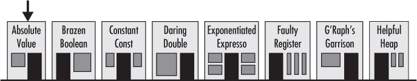
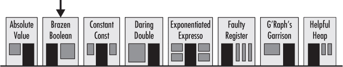
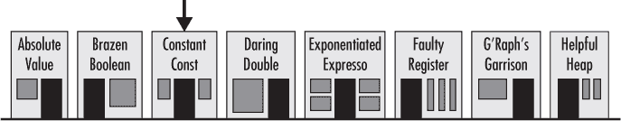
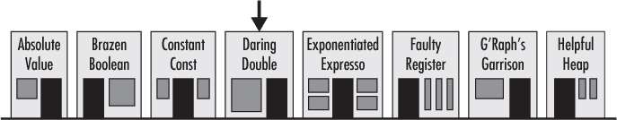
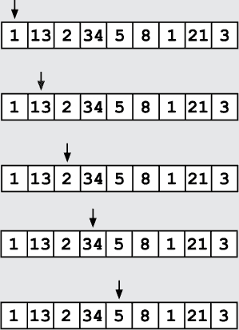

## 第二章：—2—

穷举搜索线人的信息

“高效算法的关键是信息。” 这是德雷克教授的座右铭，每次开始警察算法课时都会怒吼着对学员们说，声音足够响亮，牢牢印在弗兰克的记忆中。“一个好的算法依赖于在数据中找到结构并加以利用。它依赖于信息。”

弗兰克微笑着回想起这个场景，转入三点巷，这是一条坑坑洼洼的泥土路，沿路混杂着低级酒吧和高档咖啡店。他对一对经过的骑士点了点头，那对骑士穿着盔甲，叮当作响，迅速经过，弗兰克心里默默记下，离开之前一定要喝一杯三倍浓缩的浓缩咖啡。首先，他需要信息，一些能帮助他引导搜索的信息。他知道该从哪里开始。

玻璃盒子比利此刻应该已经在某个酒吧里，静静地坐着，听着飘散在房间里的零碎对话。人们并没有故意绕着比利说话，他们只是没注意到他在场。比利天生拥有一个显著的天赋：完全不引人注意。无论他做什么，总有一种魔力让人们根本察觉不到他。也许是他那苍白的皮肤，或者他瘦小的身材；也许是他异常平凡的穿着品味。无论是什么，比利早就决定将他的这一特长用于偷听、收集信息，并把这些信息卖给任何愿意购买的人。

弗兰克目光扫过三点巷里紧挨在一起的八家店铺，心里想着比利会选择哪一家。他在脑海里过了一遍六七种搜索算法，但这毫无意义。弗兰克没有任何信息可以依赖。比利可能在任何一个酒吧或咖啡店里。

他必须使用穷举法——简单地尝试所有可能性，直到找到比利。这让他感到不舒服。多年的侦探和私人调查经验告诉他，几乎总有比穷举法更好的算法，而他讨厌诉诸于如此低效的方式。

弗兰克嘟囔着开始了他的搜索。他走进了街上的第一家酒吧，绝对值酒吧。

酒吧老板，一个名叫艾布的暴躁男人，瞪着弗兰克进来，故意把手放在了被划伤的柜台下方。信息很明确：“我现在拿着武器，猜猜是什么样的。可是，如果你惹我，我会让你近距离看看。”

“我不想惹麻烦，艾布，”弗兰克举起双手说。“我只是来找比利的。”

“比利不在这儿，”酒吧老板说道。

弗兰克差点因松了一口气而微笑。“那我就走了，”他说。

艾布简短地点了点头，看着弗兰克离开，手依然放在柜台下。

弗兰克深吸了几口气，摇了摇头，感受着凉爽的空气。艾布的记仇能力可比他见过的任何人都要强。话说回来，弗兰克曾经逮捕过他的四个兄弟姐妹。

街上的下一个店铺是“无畏布尔值”，一家典型的布尔风格咖啡店——黑白分明。布尔城市的居民以对逻辑绝对概念的狂热奉献而闻名，他们将一切事物视为“真”或“假”。他们是很好的证人。作为镇上唯一的布尔风格咖啡馆，“无畏布尔值”成了外来者的避风港。毕竟，要么你是布尔派，要么你不是。

弗兰克探头进门，向大家问道：“比利在吗？”有片刻的沉默，二十双眼睛小心翼翼地扫视着咖啡馆的每一寸地方。布尔派的人在完全确认之前是不会回答问题的。

“不，”比利精确地回答道。

弗兰克继续他那详尽的搜索。

第三和第四家店铺同样没有收获，虽然明显更加宜人。恒常常量酒吧的酒保热情地迎接了弗兰克，并邀请他一起回忆过去的美好时光，这很奇怪，因为弗兰克只在上个月才见过他。而在“大胆双重”酒吧，那个臭名昭著的巫师聚集地，每个新来的人都会引起一阵欢呼，大家开心地围绕着蒸腾的咖啡杯唱歌。

弗兰克在第五家店，指数级浓缩咖啡店找到了比利。这是街上最嘈杂、最俗气的咖啡店，但因为使用了三倍浓缩的咖啡豆，它却吸引了最多的忠实顾客。在好日子里，每张桌子都会坐满那些神经过敏的人，他们似乎认为，畅聊的关键就是大声说话。

今天早上，指数级浓缩咖啡店接待了一个相对安静的客群。只有几张桌子被占据，而且大多数都是独自喝咖啡的人，他们自己低声喃喃自语，颤抖着。

比利坐在一张中央桌子旁，尴尬地靠向一旁的对话。似乎没有人注意到他。弗兰克在第一次扫视房间时甚至没有看到他。

“比利！”弗兰克叫道。

比利突然慌张地跳了起来。“弗兰克？”他露出笑容，高兴有人注意到他，然后坐回椅子。“拉把椅子坐吧。”

“我在找些信息，”弗兰克解释道，同时坐在比利对面的位置。

“可能我有点记得，”比利说。“最近我记性不好，”他说着，朝着一只可能不属于自己的、早已空了的杯子看了一眼。

弗兰克示意咖啡师，咖啡师很快就把一杯新鲜的咖啡放在桌上。“你记得警察局的盗窃案吗？”弗兰克问比利。

比利的眼睛睁大了，他吓了一跳。“你说是抢劫？”他不太相信地问道。他的眼睛四下扫视，但像往常一样，没有人注意到他。

弗兰克把两枚金币放在桌上，忽视了胃中的不快。他负担不起这种花费，特别是在不知道自己是在付钱买线索还是无聊的闲话时。但他知道这不会便宜。他凑近桌子，低声说道：“两天前，窃贼带走了一大堆文件。”

“听起来不像是健康记住的事情，”比利说。他盯着那些金币。“恐怕你找错人了，弗兰克。”

“那是黄金，”弗兰克咆哮道。

“抱歉，我帮不上忙，”比利说。他再次扫视了一遍房间，才接着说道，“即使我知道一些关于抢劫的事情，那也是我想要忘掉的事情。即使我知道一些小事，比如谁可能帮忙做后勤，那也不值得冒着被人发现自己鞋子里塞满牦牛粪的风险。”

弗兰克盯着他，但比利已经沉默了。对于一个靠分享信息为生的人，比利有个奇怪的习惯，就是不说话。“牦牛粪？”弗兰克问道。

比利点了点头，但没有再说什么。

“你能更具体一点吗？”弗兰克问。“我们说的是北方还是南方的牦牛？”

“这重要吗？”比利问。“关键是，如果我知道是谁安排了交通，我也不会记得。特别是如果那些人恰好有一个位于城外五英里处的大农场，在那里他们能轻易让人消失。而且如果那个农场的家族有违法历史和不健康的幽默感，那就更不值得记住了。绝对不值得记住。”

“可惜，”弗兰克笑着说道。“那下次吧。”他朝金币点了点头。“作为未来记得事情的激励。”

说完，弗兰克站起身，走出了指数快餐店。他转左，继续沿街走。一旦离开三分街，他就能绕过去，前往克拉诺克的农场——唯一一个和比利描述稍微匹配的农场。

当他经过故障登记处时，他注意到一个阴影迅速进入了附近的巷子。他低声

但当他离开城市，走上通往克拉诺克农场的泥土小道时，他发现自己心情不错。比利没给他很多信息，但即便是一点点信息，也可能意味着高效搜索算法和穷举搜索之间的差别。

**警察算法 101：穷举搜索**

***德雷克教授讲座摘录***

穷举搜索算法会在整个搜索空间内搜索每一个可能性，以寻找目标值。最常见的穷举搜索是*线性搜索*，它会按顺序检查所有不同的可能性。

想象一下，当你追赶抢劫者进入一家废弃酒店的二楼走廊时会发生什么。走廊有 30 扇门，所有门都关着。如果你遵循正确的警察程序，你的搭档已经封锁了对面的楼梯，抢劫者被困在那一层。那么，你该怎么找到他呢？你是随机选择门，一次又一次地跑来跑去，直到幸运地找到他吗？不！你沿着走廊逐一踢开每一扇门。

或者考虑一个扫描数字列表（一个*数组*）的算法，用来查找目标值。该算法沿着列表从一个数字扫描到另一个数字，逐个检查每个值，以免遗漏任何一个，直到找到目标值为止。如果我们在数组中查找数字 5，那么搜索的过程如下：

线性搜索算法的优点在于它们实现简单，甚至可以在没有结构化数据的情况下工作。你不需要对抢劫者选择的房间做任何假设；你只需检查每一个房间。缺点是，当数据具有可以利用的结构时，穷举算法往往不是最有效的算法。如果你知道抢劫者去了哪里，通过利用这一信息，你就能避免踢开许多房门。

高效算法的关键是信息！
