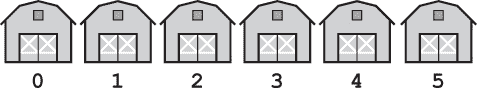
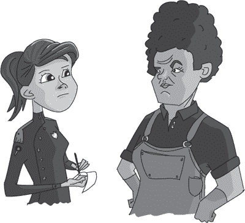
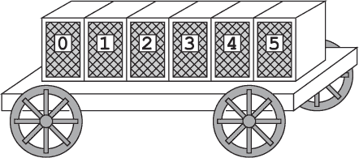
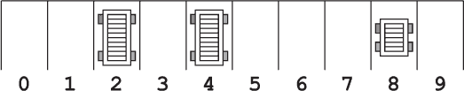
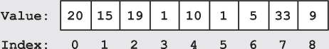

## 第三章：—3—

犯罪分子的农场上的数组与索引

弗兰克看到警察的马栓在克兰诺克家门外时，大声咒骂了一句。既然队长亲自雇用了弗兰克，他本来没想到会遇到任何警员。如果队长不信任他的警员，要么他们涉嫌某事——所以他会把他们调到市区另一头的案件——要么他们根本不够优秀。但从眼前的情况来看，显然有人已经介入了案件，而弗兰克已经落后了。

他穿过开着的前门，走进了大厅，和警员以及克兰诺克先生一起站在那儿。克兰诺克看了他一眼，表情中带着厌恶，但似乎并不意外看到他。那名警员则显得有些措手不及。

“你是谁？”她要求道，转身对他怒视，手里拿着羊皮纸和羽毛笔。

弗兰克忽视了她。“克兰诺克先生，”他说。“很高兴再次见到您。”

“来骚扰我们了吗？”克兰诺克问道。“你不受欢迎，弗兰克。”

“我不是来寻求欢迎的，”弗兰克回答道。“我来是找您的妻子。我有几个简单的问题要问她。”

那名警员盯着他看。“弗兰克？”她问。“弗兰克·运行？前侦探转行做私家侦探？你来这里干什么？是不是丢了什么宠物龙？”她讥讽地笑了。

弗兰克再次忽视了她。“克兰诺克先生，您的妻子在哪儿？我能在哪里找到她？”

那个老人摊开双手。“她什么都没做！她已经改过自新了，你知道的。真的，这次是真心的。”对于一个业余演员来说，他的演技还不错。

弗兰克微笑了一下；他知道这笑容让人不安。果然，克兰诺克皱起了眉头。

“我知道，克兰诺克先生。我来是为了挖掘她的专业知识。或者，我也可以干脆把对话留给……”

“诺塔申警官，”那名年轻的警员冷冷地说道。“而且这是*我的*调查。”

那是个谎言。警员通常是两人一组进行调查。更重要的是，弗兰克从队长给他的值班表上认出了诺塔申的名字。她在案发之夜就在警局。

“诺塔申警官，”弗兰克说道。“谁说我来是为了调查？也许我只是来找丢失的龙而已。”

她皱了皱眉。

从房子后面传来了骚动。有人喊着克兰诺克的名字，但被一声刺耳的长嘶声打断了。“我妻子在马厩里，”克兰诺克不耐烦地说道。“2 号棚。现在快走，滚出我的家！”克兰诺克朝前门挥了挥手，自己则从后门匆匆离开。

“谢谢，”弗兰克边走边喊道。“很高兴见到您，克兰诺克先生。”

诺塔申警官跟着弗兰克穿过院子。她走得很快，愤怒的脚步声敲打着地面。“你知道自己去哪吗？”她问道。

“2 号棚，”弗兰克回答道。

“我知道，”诺塔申愤怒地说道。“但是 2 号棚在哪儿？”

弗兰克停下脚步，转向她。“刚从警校毕业吗，诺塔申？”他问道。

“什么？”

“只有新手才会问这种搜索问题。你没有学过《警察程序》和《数据结构》吗？还是说这些课程已经被一些不那么严格的课程替代了——比如《海龟图形入门》？”

符号似乎有些愣住了。“当然我学过警务程序和数据结构，”她说，虽然听起来有些不确定。“但我的意思是——”

弗兰克打断她的话，“那你肯定知道数组和索引了。”

“是的，不过——”符号开始说道。

“在农场上找一个谷仓是一个足够简单的搜索任务，”弗兰克再次打断道。“我们可以用穷举法检查每个建筑物。*对农场上的每个建筑物：检查它是否是#2 号谷仓*。在我那时，你第一天就会学到这个搜索方法，警务算法课程上。”

“但我们可以做得更好。克拉诺克家族有六个谷仓排成一条整齐的线——就像一个巨大的数组。克拉诺克先生非常友好地提供了谷仓的编号，那个数组的索引。我们只需走到对应的谷仓。”

“那不是我的意思！”符号喊道，挥舞着双臂。“我知道怎么使用数组的索引。我知道我们只需要走到外面有一个巨大的#2 的谷仓。我在数据结构*和*警务算法课程中都以班级第一毕业，所以别来给我讲数组的正确用法。”

“好吧，你问了，”弗兰克回答。

“我问的是：你知道这些美妙的谷仓数组在哪吗？”

“当然是你，”弗兰克说。他开始再次走动。“不过你还是听起来像个菜鸟，拿班级排名说事。”

“谷仓在哪里？”警官喊道，跺脚追上来。

弗兰克回头朝她露出一个微笑。“就在这座山丘之后。”

就像弗兰克多年前学到的那样，克拉诺克家族几乎以狂热的方式拥抱了数组的概念。他们将一切都组织成线性结构，为每个元素标注了清晰的索引。当弗兰克经过#0 号谷仓时，他注意到有 15 个猪槽，每个槽可以存放一份食物。一名农场工人正在沿着一排谷仓循环，给每个数组位置舀入下一餐。

弗兰克和符号警官继续走向#2 号谷仓，门外挂着一个标牌。与之前的遭遇相比，克拉诺克太太冷冰冰的问候几乎显得有些亲切；她甚至什么都没扔出来……至少还没。

“你想要什么？”克拉诺克太太厉声问道。

“克拉诺克太太，”符号在弗兰克抢先问话之前打断了她。“我希望能问你几个问题。”

弗兰克让符号问问题。比利的线索没有提供更多的信息，只是指向了农场，但符号似乎有一套更好的线索。

克拉诺克太太冷笑了一声，吐了一口唾沫。“我什么都没做，”她说。“你知道，我已经改过自新了。”

“我不是来抓你的，”符号说。“我需要问你一些关于某辆驴车——数组车（ArrayCart）的事。”

弗兰克心中闪过一丝怀疑。符号警官会不会是来处理其他案件的？他有些怀疑，但直觉告诉他，她是在找失踪的文件，而他学会了相信自己的直觉。

“ArrayCart，”克兰诺克夫人怀疑地说道，语气中带着一丝自豪，“是我自己发明的。基于数组原理。它有专门的存储隔间，每个隔间只能容纳一只动物。由于每个隔间都有独立的门，你可以走到任何一个隔间，拿出动物或放入动物。轻松访问任何存储位置。省去了几个小时的麻烦。”

“这真是巧妙，”诺泰申警官承认道，“你们找到了一种将数组和索引的概念应用到牲畜运输中的方法。”

“而且这只是个开始，”克兰诺克夫人补充道，“我正在和一个*巫师*合作，开发一种全新的 ArrayCart——带有魔法指针！我敢打赌，它们对于警察局来说简直是完美的。告诉你们的队长，我能给他个好价格。”

弗兰克不得不佩服诺泰申。让克兰诺克开口最有效的方法就是提到数组。

“你现在有几辆 ArrayCart 出租，对吧？”诺泰申警官继续探问。

克兰诺克夫人的眼神瞬间变得冰冷。“这是合法生意。我们按时缴税。”

弗兰克忍住了轻蔑的嗤笑。

“你有没有在两天前租给别人一辆 ArrayCart？”诺泰申警官追问，“一辆小型号的，带六个隔间的。”

“我可能……”克兰诺克夫人说道，她冷冰冰的态度开始变得有些敌对。

“你有记录显示谁租了这辆车吗？”警官问。

“不，”克兰诺克夫人说道，“一旦马车归还，我们就会销毁记录。我不记得是谁租了那辆车。”

看起来比利的暗示确实有效。如果你是一个需要交通工具的罪犯，很少有地方会租给你一辆马车，而且更少的地方会在事后忘记你的名字。克兰诺克夫人可能声称已经改邪归正，但显然，她至少在某种程度上，仍然为她以前的同伙提供着有价值的服务。

“你真的不记得你的客户有什么信息吗？”诺泰申警官追问，但弗兰克知道这是徒劳的。他曾经问过她三小时关于一头被盗的牦牛的事。尽管是她自己被盗，克兰诺克夫人却一声不吭。克兰诺克夫人根本不会说话。

当诺泰申警官反复问了几遍类似的问题时，弗兰克悄悄溜出了马厩，找到了马车停放区。果然，停车场像一个数组一样被组织成 10 个标记清晰的车位。只有#2、#4 和#8 被占用。#2 和#4 的车位上分别有 10 个隔间，因此它们太大，不符合诺泰申的描述。但#8 车位上停着一辆六格的 ArrayCart，车轮上仍然覆盖着新鲜的泥巴。

弗兰克环顾四周，迅速跳上了六格 ArrayCart 的后部。地板上散落着一些稻草，但车厢里除此之外什么都没有。弗兰克逐一打开每个隔间，扫描空荡荡的储物空间，寻找任何线索。然后，他跪下来，翻动稻草，直到找到几片羊皮纸的碎片。

他一共收集了六小块碎片，可能是卷轴在卸货时被钉子勾住的角落。只有两块碎片上有文字，而且看起来是账本的内容。这并不算是一个可靠的线索，但它把这辆车与犯罪事件联系了起来。

弗兰克把搜索移到车厢前部，小心地检查驾驶座周围的所有物品。座椅本身给了他第一个重要线索。他在那儿发现了几根被座椅破损木板卡住的黑色和橙色线头。仅凭颜色的鲜艳程度，弗兰克就能判断出披风一定是新的。他满意地把线头收进口袋，然后从车厢上走下来。

只有当一阵新鲜空气迎面吹来时，他才注意到自己一直在屏住呼吸。车周围弥漫着腐烂鱼的臭味。他轻轻嗅了嗅，顺着味道走，来到泥巴覆盖的车轮旁。他深深地吸了一口气，立刻后悔了。泥土中的腐烂鳗鱼味道浓烈且让人不愉快，辨识度极高。

弗兰克一边勉强笑着，一边作呕着，从车厢旁踉踉跄跄地退开。他可能不知道是谁租了这辆车，但现在他知道它曾经在哪里。

**警察算法 101：数组**

***德雷克教授讲座摘录***

数组是简单的数据结构，允许你存储多个值。数组就像一排箱子，每个箱子可以存储一条信息，如一个数字或一个字符。

数组的结构意味着你可以通过指定其在数组中的位置，或*索引*，来访问数组中的任何值（或元素），无论是写入还是读取。许多编程语言使用从 0 开始的数组，这意味着数组的第一个值位于索引 0，第二个值位于索引 1，以此类推。通常，你会通过*索引*i*来引用数组*A*中的值，表示为*A*[*i*]；例如，数组*A*的第三个元素是*A*[2]，它的值为 19。

你可能从昨天在首都警察局的拘留室初步参观中就已经认识到这种结构。国王亲自建议使用有索引的单人拘留室，以简化囚犯的检索过程。每个警察局配备有四到八个拘留室，具体数量取决于当地的犯罪人口规模。
