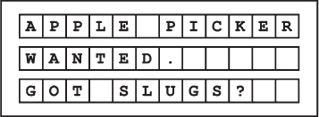
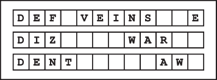

## 第四章：—4—

字符串与隐藏信息

Frank 摆脱了 Notation 警官，走出了农场的后门，那里有一块大牌子面朝着路。多年来，Crannock 家族一直用这块牌子发布关于各种非法活动的密码消息。如今，这里成了犯罪分子参观的景点——恶棍们带着他们年轻的学徒，聚在一起回忆那些总是以“在我那时候……”开头的故事。

这块标牌本身是一个 AnyText 模型。它包含 3 组字母，每组 12 个位置。每个字母、空格或标点符号都占用一个位置，这意味着整个标牌最多可以容纳 36 个字符——足够用来发布一系列非法活动的广告。每周一早晨，Crannock 家族的成员会拖着一篮子字母来到标牌前，逐个将合适的字符放入每个位置。

在刚加入警局的第一周，Frank 的搭档带他来到这里“查看标牌”。当时的信息是——*苹果采摘者招聘。你有蜗牛吗？*——对 Frank 来说听起来无害。Crannock 家族正在寻找一个苹果采摘者来帮助收获，并且提供处理蜗牛的服务。当他这样告诉他的搭档时，这位拥有 20 年经验的侦探笑了。

“那是他们想让你认为的，”侦探 Rossile 解释道。“你必须超越表面意思，看看犯罪分子会怎么解读。这个‘苹果采摘者招聘’意味着他们在试图雇佣一个小偷。一个会从车上偷苹果的人，或者类似的。” 

“那蜗牛呢？”Frank 问道。

“非法蜗牛赛跑，”她回答道。“他们每几个月就在这里举办一次比赛。你会慢慢明白的。”

因此，Frank 学会了每周检查 Crannock 家族的标牌，以便了解犯罪世界的动态。几个月后，他已经学会了破译大部分的密码。*农场工人*指的是打手，如果需要力量、暴力或纯粹的人数，词语后会加上附加修饰。*印刷艺术家*是指伪造者，*声乐艺术家*是指骗子，等等。短语*一群鸡*让 Frank 困惑了好几天，直到 Rossile 将其翻译为“大量热腾腾的身体，四处奔跑发出噪音，制造干扰；不需要智慧”。

到了第一年结束时，Frank 已经成为了阅读标牌的专家。在过去的几年里，唯一一次 Frank 在破译标牌上的犯罪信息时感到困难，是在巫师 Exponentious 攻击王国的时候。Exponentious 施放了“错误索引法术”，使得整个王国的 ArrayDesignBoards 都出现了问题。顾名思义，这个法术改变了索引位置，因此 Mrs. Crannock 认为她设置字母的位置是错误的。在一周的时间里，Crannock 家族的标牌上充满了乱码。

由于魔法只会在数组中打乱字母，而 AnyText 模型是通过三个独立的数组实现的，弗兰克必须逐行解开每个数组。他解开了信息：*需要防御法师*。

然而今天，信息是明确的。事实上，这是他在克兰诺克家族的黑板上见过的最不含蓄的信息。内容是*出租数组车。没有问题*。

**警察算法 101：字符串**

***德雷克教授讲座摘录***

数组不仅仅用来存储数字列表；它们也可以用来存储文本字符的字符串。许多编程语言使用数组来实现字符串。数组中的每个块存储一个字符，可以是字母、数字、符号或空格。与其他数据类型的数组一样，这些字符串中的字符可以通过其在数组中的索引直接访问。

在你作为警察的职业生涯中，你将会非常熟悉这种文本表示方式。所有标准的警察表格都要求警员在每一页顶部的 32 格区域内记录他们的名字。在一个典型的月度里，你将填写超过 400 个这样的区域。
