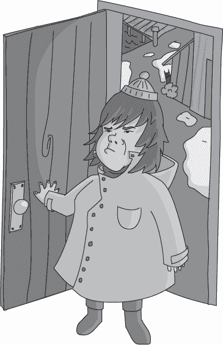
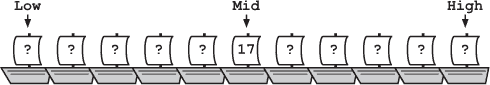
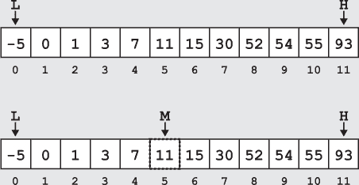
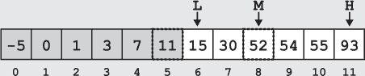

## 第五章：—5—

二分查找走私船

Usb 的港口不过是一个渔村。十几座风化的建筑聚集在一条长长的码头尽头。几个零星的活动点围绕着最新到达的船只，但总体来说，这个小镇安静得令人放心。

弗兰克直接走向“螃蟹之钳”，那是一个以蛤蜊浓汤和每周三晚的海洋民谣比赛闻名的渔民酒吧。运气好的话，他的一个联系人可能会在今天之内出现。毕竟，“螃蟹之钳”是 Usb 唯一的去处。所以，弗兰克坐到了酒吧后角的一张桌子旁，点了浓汤，开始等。

没过多久，一名自由走私者梅维斯走进了这个阴暗的小酒吧。天生小心的梅维斯虽然从未被正式定罪，但众所周知，她曾为了销毁证据而故意纵火烧毁了自己的船。弗兰克和她相处得还不错，至少在他离开警队之后，他们偶尔也会交换一些信息。

弗兰克已经喝了一个小时的浓汤，终于推开了碗，示意梅维斯过来。她在门口犹豫了一下，才挤进了酒吧。

“梅维斯，”弗兰克在她走到角落里时说，“你怎么样？”

“十分钟前我还好多了，”她吐槽道。

在弗兰克能开口之前，诺塔申警官大步走进了房间，举起了双手。“女士们，先生们，”她喊道。“能借我一点时间吗？我在找一辆两天前经过这里的货车。”

弗兰克在心里咒骂了一声。看来他的线索就到此为止了。

“我从黎明航班回来，本想着吃一碗热腾腾的蛤蜊浓汤，享受几分钟的安宁，”梅维斯抱怨道。“结果我遇到了这个警察，整天嚷嚷着驴车的事。”

弗兰克干笑了一声。“直到她走了，你就不能卸货，对吧？”

梅维斯皱了皱眉看着他，但没有反驳。Usb 无论在渔业还是航运业上都没找到什么成功。不过，这个港口确实吸引了那些不愿与麻烦的政府官员打交道的罪犯。弗兰克敢打赌，一个月的租金都能确保这里码头上的每一艘船都在走私某些东西。

“你知道这辆车的事吗？”弗兰克把声音压得几乎听不见。

梅维斯耸耸肩。“码头上总是有货车，弗兰克。这是个港口，人们搬运货物。”

“这是一辆特别的货车，”弗兰克逼问道。“一堆单独的动物栏，就像一个巨大的轮式阵列。”

“听起来很高级，”梅维斯说。“但我没听说过有什么船在搬运动物。我倒是听说过几只小型乌龟的木箱，但没听说有什么大到需要动物栏的。你确定是从这里经过的吗？”

弗兰克点了点头。那股味道就像是厕所里散发的鱼腥空气清新剂，而没有哪个地方的味道比 Usb 更糟糕了。

“那个时候有谁出港吗？”他问。如果小偷已经把被盗的文件运送到这么远的地方，他们应该不会再等下去。

“只有*重试循环*，”梅维斯说。“我告诉你这些只是因为它是公开的。我不知道它运载了什么，也不关心。”

“你知道它什么时候回来吗？”弗兰克问道。

“19 小时前刚刚返回港口，”梅维斯回答道。“那时我也不知道它运载了什么。”

弗兰克露出一个灿烂的笑容。“听起来是时候在城里转一圈了，”他说。

梅维斯心不在焉地对他微笑，并转身招手叫服务员。

弗兰克走了不到 20 米，警官诺泰申便走到他身边。

“Runtime 先生，这是我的调查，”她开始说道。“如果你有信息——”

弗兰克停下脚步，让她也不得不停下来。“诺泰申警官，您究竟在调查什么？”他问道。

结果比弗兰克预期的还要好。诺泰申几次张口又闭口，红色的潮热从脖子向上蔓延。

“船长不知道你在这里，对吧？”弗兰克问。“这可不算是一次*正式的*调查。”

“我不知道你在——”诺泰申警官开口说道，但弗兰克打断了她。

“别装了，”他说。“你一个人出来就是我需要的所有证据。你在用自己的时间独立进行这个调查。问题是，为什么？”

红潮已经完全爬上了诺泰申警官的脸颊。她的耳朵染上了特别鲜明的红色。

“那不关你的事。”她回答道。

“当船长来找我，因为他无法信任自己的官员时，这就成了我的事，”弗兰克平静地回答道。

“*船长*雇了像*你*这样的落魄侦探？”

“是的。因为他能信任*我*。”

警官诺泰申的脸色变得严峻，眼中燃烧着怒火。弗兰克一度以为她会用警棍结束这场对话。但几乎在她的怒火爆发的同时，它也迅速消退了。

“我必须找回那些文件，”她悲伤地说道。“是我的错——那天晚上我负责守卫。”

“我明白了，”弗兰克若有所思地说。

“我必须找回那些文件，”诺泰申警官焦虑地重复道。“我才加入警局几个月，而且——”

弗兰克打断了她，给了她一个他希望能让她安心的微笑。这正是他所预料的。新手在面对第一次错误时很难处理得好，而诺泰申看起来比大多数人都更紧张。“我们在找*重试循环*，”他说。“克兰诺克家的马车在抢劫的那晚在那里卸下了什么东西。那艘船 19 小时前入港。”

当然，弗兰克不信任她，但他想把她留在身边，保持对她的观察。她找到了克兰诺克家，这意味着她知道的比报告中说的要多。她的故事中有遗漏，他需要找出她还知道些什么。

“我们最好开始了，”符号看着码头，神色有些焦虑。“有很多船要检查。我们应该从前面开始吗？”由于港口的大多数船只都属于走私者，因此它们都没有显示身份标识。他们必须逐一询问每艘船的名字。

“我们可以做得更好，”弗兰克解释道。“港务局长对组织有着近乎狂热的追求。他坚持要求停靠的船只按到达时间排序。最新到达的船只停在离市区近的最佳位置，船员可以轻松上下货物，但每当有新船到达，其他船只都必须向后挪动，为新船腾出前面的空间。”

“这太荒谬了，”符号抗议道。“这简直是浪费精力。为什么他要这么做？”

弗兰克笑了。“他说这是为了效率，但任何在 Usb 待过一周的人都知道真相。港务局长受不了腐烂鱼的味道。停靠在港口的船只如果没有销售货物，会变得，嗯……有点‘芳香’。港务局长的组织方案就是把那些停留时间更长的船移到他小屋的远处。”

符号警官盯着他看。“你是认真的吗？”她终于问道。

弗兰克再次笑了。“是的。一旦你在巡逻一段时间后，你也会开始获得这些有用的信息。关键是我们知道船只是按顺序排好的，而*重试循环*已经在这里停了 19 小时，所以我们可以直接做*二分查找*。”

“我们的目标值是 19，我们的算法是二分查找。现在搜索空间就是这一整排船只，所以我们已经有了上限和下限。如果使用包含边界，我们的下限是第一艘船，上限是最后一艘船。如果*重试循环*就在这里，显然它不可能在第一艘船之前或最后一艘船之后。”

“所以我们从中间的船开始，问它停港了多长时间。如果它停得不到 19 小时，那它一定是在*重试循环*之前。这样就能将我们的搜索空间一分为二。然后——”

“如果它已经在那里超过 19 小时，那它一定是在*重试循环*之后，”符号打断了。“我知道二分查找。我刚刚参加完警察算法的期末考试，就在两个月前。”

说完，两人开始寻找*重试循环*。中间的那艘船是一艘黄色的双桅帆船，奇怪地散发着香蕉的气味，它已经在港口停了 17 小时。

这意味着他们可以排除前半部分的船只，包括那艘中间的船。弗兰克将下限调整为那艘*可能*是*重试循环*的船，只比黄色双桅帆船多一艘。

在缩小的搜索空间中，他们选择了一个新的中点。说服下一艘船的船长他们不是卧底海关官员花了一些时间。10 分钟后，诺塔申把她的徽章塞到船长鼻子下，他的语气立即变得愤怒而抱怨，告知他们他的船，*腐败数据包*，已经在港口停了 22 个小时。他要求他们代表他与港务局长交谈。

由于他们的目标是 19 小时，他们知道 *重试循环* 必须出现在 *腐败数据包* 之前。他们再次改变了边界，使得位于 *腐败数据包* 左边的船现在成为了上边界。

这只剩下两艘船在搜索范围内；他们迅速接近搜索的终点。如果这两艘船都不是 *重试循环*，他们可以确定它已经离开了港口，因为一旦搜索空间中没有更多的元素，他们就可以排除整个搜索空间。

由于只剩下两艘船，他们可以选择其中任何一艘作为新的中点。凭着直觉，弗兰克选择了较早的那艘船，这艘船恰好也是他们的下边界。与在码头徘徊的船员聊了几句后，他们确认这艘船就是 *重试循环*，并且已经在港口停了 19 个小时。

“接下来怎么办？”诺塔申警官问道，他们站着看着那艘船。

“我们再次用你的闪亮徽章，”弗兰克回答道。

**警察算法 101：二分查找**

***德雷克教授讲座摘录***

二分查找算法用于在已排序的数组 *A* 中高效地找到目标值 *v*。与线性扫描不同，二分查找利用数据结构的信息使搜索更加高效。高效算法的关键是信息。在这种情况下，我们利用数组按升序排序的事实：

*A*[*i*] ≤ *A*[*j*]，对于任何一对索引 *i* 和 *j*，其中 *i* < *j*

这看起来可能信息不多，但足以让搜索更加高效。

二分查找算法通过反复将搜索空间一分为二，并将搜索限制在其中一个半部分来工作。该算法通过追踪两个边界来限制活动的搜索空间。上边界 (*IndexHigh*) 标记着数组中属于活动搜索空间的最大索引。下边界 (*IndexLow*) 标记着最小索引。在整个算法过程中，如果目标值在数组中，我们保证以下内容：

*A*[*IndexLow*] ≤ *v* ≤ *A*[*IndexHigh*]

在每一步搜索中，我们检查位于上下边界之间的中间值：

然后我们可以将这个中间位置的值 *A*[*IndexMid*] 与目标值 *v* 进行比较。如果中点小于目标值，*A*[*IndexMid*] < *v*，我们知道目标值一定位于中间索引之后。这时我们可以通过将 *IndexLow* = *IndexMid* + 1 再次将搜索范围缩小一半。

如果中间点大于目标值，*A*[*IndexMid*] > *v*，我们知道目标值一定位于中间索引之前，这样我们可以通过将 *IndexHigh* = *IndexMid* – 1 来将搜索范围缩小一半。

当然，如果我们发现 *A*[*IndexMid*] 等于 *v*，我们可以立即得出结论，搜索完成。我们找到了目标值。

让我们考虑在以下（已排序的）数组中搜索值 15。带有虚线框的框对应算法已检查的值，阴影部分是被排除的值。

第一次中点检查找到的值是 11，小于我们目标值 15。由于我们知道数组是按升序排列的，我们可以排除中点及其之前的所有值。我们适当移动下界索引 (*IndexLow* = *IndexMid* + 1)。

同样，在第二次比较后，我们找到的中点值是 52，大于目标值。我们可以排除中点及其之后的所有值。我们将上界索引 (*IndexHigh* = *IndexMid* – 1) 向前移动。

请注意，尽管下界的索引在多次迭代中指向了目标值 (*v* = 15)，我们仍然继续搜索直到中点指向目标值。这是因为我们的搜索仅检查中点的值。在中点指向之前，我们不会检查下界或上界的值。

如果目标值不在数组中会发生什么？随着搜索的进行，边界会越来越接近，直到它们之间没有未探索的值。由于我们始终将一个边界移到中点索引的*之后*，当 *IndexHigh* < *IndexLow* 时，我们可以停止搜索。此时我们可以保证目标值不在数组中。
