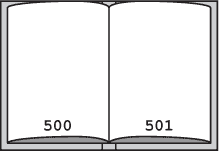
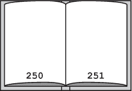
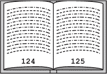
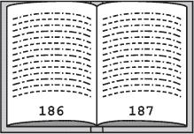
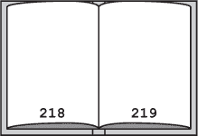
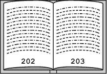
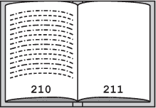
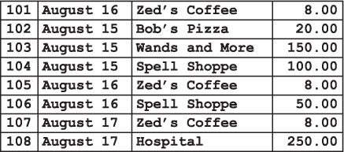

## 第六章：—6—

寻找线索的二分查找

“食品检查员，”弗兰克大声喊道，他和标注官一起走上了狭窄的跳板，登上了船。应弗兰克的要求，标注官挥动着徽章，动作太快，以至于没人能看清。

“食品检查员？”一个船员问道。“我们没有运送任何食品。”

弗兰克打量了一下那人。他不是军官或雇佣保安，可能只是一个在军官们离开时接管了指挥的水手。这并不罕见。走私者很少雇佣保安来看管他们的船，因为这样会引起太多注意。

弗兰克转身对着水手低吼道：“我们走着瞧。我听说这码头上有一批腐烂的鳗鱼，我打算找出来。”

“鳗鱼？”水手显然感到手足无措。

“*腐烂*的鳗鱼，”弗兰克反击道。“我们下去检查一下储藏室。”然后，他毫不等待回应，大步走向通往甲板下方的舱口。

标注赶紧跟了上去。

“我们没多少时间了，他们很快就会抓住船长。我们需要找到航海日志，”弗兰克一边说，一边爬下梯子。航海日志里会包含货物清单和访问过的港口名单。当然，货单会是假的。走私船从不记录真实货物。但如果运气好，他可以从谎言中找到线索。

标注官在货舱后部找到了航海日志并拿了出来。弗兰克查看了一下封面，忍不住骂了一声：

*重试循环*的清单和日志

船长：A. 詹姆斯

本港：Usb

所有者：维内特航运集团有限公司

几个月来，弗兰克成功地避开了维内特人，但他却走进了他们的船上。他本能地扫描着货舱，寻找隐藏的打手、武器化的农用设备或蛞蝓赛车的证据。弗兰克很快排除了最后一种可能——大家都知道蛞蝓不会在船上比赛，因为那和船身周围的盐水有关系。

他摇了摇头，集中精力解决眼前的问题。弗兰克必须在维内特人发现他在船上的时候找到线索，否则他可能再也无法离开了。他转向书的末尾，开始一页一页地翻回前面。

“你在做什么？”标注问道。

“在找最后一条记录，”弗兰克说道。

“一页一页地翻？”标注问道。“这得有一千页吧。为什么不再用一次二分查找？我们才刚用过。”

弗兰克停了下来。他并不在找特定的页码，但他仍然可以用二分查找来找到最后一条记录。他会根据当前页面是否有文字来调整查找范围。

“好的。二分查找，”他同意道。

他再次翻到最后一页，确认这本书共有 1000 页，这让他有了页面 1 的下限和页面 1000 的上限。他将数字相加，除以 2，计算出中点为 500 页。他翻到了那一页。

第 500 页和 501 页都是空白的，所以 Frank 知道最后一页的内容在 499 页或之前——这是他的新上界。再进行一次中点计算后，他翻到 250 页，仍然是空白的。

“看起来像是一本新书，”Notation 补充道，“幸好你没有从后面继续翻。”

Frank 没有回答。下界为 1，上界为 249，他计算出中点为 125。这个时候他发现有内容，于是他相应地将下界调整为 125。

“187，”Notation 在 Frank 还没算出中点之前就补充道。他翻到 187，再次发现有内容，并调整了下界。

“218，”Notation 说道。页面是空白的，于是 Frank 将上下界分别调整为 187 和 217。

“202，”Notation 在 Frank 还没完成上下界的计算时就说。

“你怎么这么快就做到了？”Frank 问。

“练习，”她回答，“我们以前在学院里每当需要休息时，就会举行二分查找比赛。我从未被打败过。”

Frank 摇了摇头，“听起来像是个疯狂的时刻，”他低声说。

第 202 页和 203 页已填满。“210，”Notation 补充道。

在第 210 页，他们终于找到了最后一条记录，详细描述了*重试循环*的最后一次航行。“现在怎么办？”Notation 问。

“我们要搜索一个有趣的包或者端口。在上一次航行中，他们做了大约 70 条记录。我们得扫描它们。”

“穷举搜索？”Notation 问道，“我们不能用更高效的方法吗？记录不是按照取货和交货时间排序的吗？”

“排序在这里帮不上忙，”Frank 回答道，“我们不知道时间。排序数据只有在按有用的维度排序时才有帮助。他们没考虑按可疑度排序。真是搞不懂。”

“哦，是‘天气记录问题’，”Notation 说道。

“什么问题？”Frank 问道。

“这是一个例子，说明按照错误的值排序数据对搜索没有帮助，”Notation 解释道，“Drecker 教授举了一个找出过去 10 年最冷的一天的例子。如果日志按天排序，你可以使用二分查找高效地找到任何具体的一天。但这对我们找到最冷的一天并没有帮助，所以我们还是得扫描所有数据。我没想到会在课外看到这么清晰的例子。”

“欢迎来到现实世界，”Frank 说道，“在这里，你得判断数据结构什么时候对你有用，什么时候没有用。别担心，这是一个常见的新手错误。”

他能看到符号对他的话不满，忍不住不去享受她的反应。每个新兵从学院出来时，都觉得自己什么都懂，而每个人都有很多东西需要学习。符号还算幸运，得到了一场讲座。至于他自己学二分查找时，得花几个小时在猪粪堆里刨来刨去，同时怀疑自己的职业选择。

约三分钟后，他们找到了唯一的线索。*重试循环*最近在泥墙港和破线岛停留过两次，停留时间都很可疑。即使是走私者，这些地方也很奇怪。泥墙港的贸易几乎只限于外围的泥土农场。而破线岛则更加荒凉，这个小而崎岖的岛屿上只有一座建筑——现在已废弃的铁环监狱。

“在那里，”弗兰克指着说道，“那就是他们拿走你文件的地方。可能是泥墙港或破线岛。他们可能在一个港口把文件丢下，在另一个港口拿到付款。”

“你怎么知道？”符号问道，她看起来很怀疑，“难道我们不应该把所有港口都考虑为——”

弗兰克打断了她的话，“没时间检查所有的。”他没有多加解释。他现在正在使用自己的算法，那种曾让他因过于草率的启发式搜索而惹上船长麻烦的方法。但他有一种直觉，而弗兰克学会了信任自己的直觉。

“你确定——”符号开始说话，但被上方传来的声音打断了。

弗兰克听不清楚话语，但他能清楚地辨别出语气。麻烦来了。

**警察算法 101：二分查找 II**

***德雷克教授讲座摘录***

高效算法的关键是信息。以二分查找为例，我们要求数据已经排序，并且我们了解数据的排序方式。为了排除（或剪枝）搜索空间中的大区域，算法必须能够保证目标值不可能出现在该区域。如果我们知道数据在数组中如何变化，我们才能做到这一点。在计算问题中，如果数组中的所有值都是按递增（或递减）顺序排列的，我们就说这个数组是排序过的。

然而，仅仅因为数据按*一个*维度排序，并不意味着你可以沿着另一个维度进行二分查找。假设你正在搜索一本账簿以寻找线索。账簿是按交易编号排序的，交易编号表示交易的*记录时间*。这意味着每条记录的交易编号都小于下一条记录的交易编号。如果当前记录的交易编号是 105，那么我们知道它之前的所有记录的交易编号都会小于 105，之后的记录的交易编号都会大于 105。

然而，这也意味着其他字段中的条目，比如实际交易日期、商家的名称或交易金额，*并未*按排序顺序排列。如果你有兴趣查找超过某个可疑金额的交易，或者找出与已知武器商人相关的交易，这时排序能帮你吗？不，它仍然会让你使用穷举法进行线性搜索。知道交易 105 是在 Zed’s Coffee 发生的，并不能告诉你之前或之后的交易中的商家或金额信息。

同样，如果你按交易金额的升序对账本进行排序，这可以帮助你快速找到所有金额为 250 美元的交易，但它无法帮助你查找特定的交易日期、ID 或商家。
