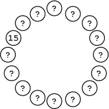
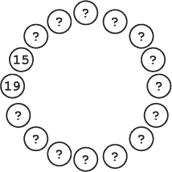
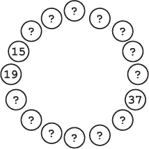
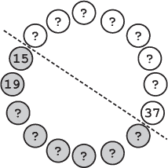
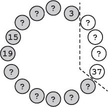
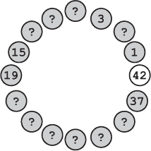

## —7—

适应算法以进行大胆逃脱

沉重的脚步声在甲板上方砰砰作响。Frank 环顾四周，评估着他们有限的选择。唯一的舱口通向甲板和新来的那群人。货舱几乎空了，船员们在抵达 Usb 后已经卸载了货物。躲在这里等于站在角落里小声说“你看不见我”。

当 Frank 列举并排除了每一个可能的选项，包括那种少见但有效的伎俩——躺下装死时，他看到 Notation 拿出徽章并站得笔直。

“你在想什么？”他 hissed。

“我是执法人员，正在进行正式调查。”Notation 解释道。

Frank 难以置信地摇了摇头。“‘以法律的名义停止’这种套路在这里行不通。或者说，大多数地方也行不通。我们是在一艘走私船上，调查警方财产被盗案。你们这边没人知道你在这儿，对吧？我敢打赌，那个从门口进来的人知道这一点。”

Notation 张开嘴想争辩，但停了下来又闭上了嘴。她把徽章滑回夹克里，一群大块头、穿着出奇精致的暴徒涌过门口。他们散开，在货舱里围成一个松散的圈，将 Frank 和 Notation 围在其中。

“各位，”Frank 说道。“我们已经完成检查，看起来你们并没有携带腐烂的鳗鱼。感谢你们的耐心配合，我们将继续努力确保本王国的食物供应安全。我们现在就要离开。”

作为回应，两名较大的暴徒抓住了 Frank 的双臂。他们一起把他抬离地面，并继续把他抬到甲板上。多年的经验让 Frank 为这种反应做好了准备，他已经发展出了一种定位自己的技巧，尽量减少不适感，但他仍然能感觉到在他们强有力的抓握下，淤伤正在形成。

“嘿！”Notation 的喊声表明她也被类似地带到了外面。

Frank 眨了眨眼，他们走出阳光下。那些人把他抬到甲板中间，把他扔到木地板上。Notation 砰地一声摔在他旁边，暴徒们再次围成了一个松散的圈。

Frank 慢慢地将自己推到坐姿，打量着他们的看守。他们随着船的摇晃而晃动，但其他没有动作。看起来他们在等人，也就是说，负责人还没有到。Frank 抓住机会，转向离自己最近的一个暴徒。

“那接下来怎么办？”Frank 问。“把我们关起来？把我们丢到船外？交给你老板的雇主？”

那个男人耸了耸肩。“别看我，我才在这里工作十五天。”

“新手，嗯？”Frank 说道。

Vinettees 对信息的保密非常狂热。他们只与最资深的船员分享计划。新加入的成员需要证明自己的忠诚，并逐步晋升。要获得任何有用的信息，弗兰克需要找到最资深的船员。

弗兰克脑中开始形成一个计划。Vinettees 的船员总是按资历排序的，这与导师制度有关——最初级的船员会作为新人的导师，依此类推。在群体中，他们总是倾向于站在自己导师旁边。

那些暴徒的圈子不过是一个已经弯成环形的排序数组。二分查找几乎可以在这里使用，但必须对数据的组织方式进行适配：是一个环形，而不是一条直线的值。不幸的是，这意味着弗兰克不知道数组的起始和结束位置。他很快就开发出了一个新算法，用来高效地寻找最资深的船员。在这种情况下，高效意味着既要尽量减少与暴徒交谈的次数，又要尽量在他们察觉之前获得答案。

他转向暴徒右边的女人，“你呢？你是这里的资深人物吗？”

“十九天，”她说。

现在，弗兰克预期他已经得到了一个排序——资历从逆时针方向增加。但他还不能确定。尽管这种可能性非常荒谬，十五天和十九天可能分别是最初级和最资深的暴徒。他在选择搜索起点时曾不小心出过差错，结果总是不好。他需要另一个数据点。所以他选择了剩下的暴徒范围中的中间位置。

“你呢？”他问了一个站在十五天对面的女人。

“三十七天，”那个暴徒回答道，“关你什么事？”

得到这个信息后，他的直觉——按逆时针排序——得到了确认。因此，他排除了从十五天到三十七天之前的所有人——如果最资深的暴徒不是三十七天，那么他必定会在三十七天的逆时针方向，但要在十五天之前。

弗兰克抑制住了心头涌上的不满。他从未遇到过如此初级的船员，实际上他感到有些受辱。“这真让人尴尬，”弗兰克对他们的俘虏说，“我们竟然被一群新手抓住了。你们是后备队吧？”

“你在做什么？”Notation 低声问道。

“一种改良的二分查找，”弗兰克咆哮着回答。

Notation 叹了口气。“我早就看出来了。看来你是在寻找最资深的人。你并不算太隐秘。但为什么呢？你怎么知道他们是按顺序站着的？”

弗兰克不理会她。他深吸了一口气，重新集中精力完成手头的任务。他不知道在老板出现之前还有多少时间。他选择了剩余范围中的中间点。“那你呢？”

“这是我的第三天，”那人犹豫地回答道。

“拜托！”弗兰克大喊，“真的吗？”

“三天？你不在培训中吗？”注释员问道，语气中透出真诚的好奇。

弗兰克再次精确地缩小了范围，考虑到最资深的人不可能是三天、十五天，或者介于这两者之间的任何人。

弗兰克再次将剩余范围分成一半。“那你应该是个相对资深的人吧？”弗兰克问道。

“呃……这是我的第一天，先生，”那混混结巴道。当大家的目光集中在他身上时，他开始大汗淋漓。

弗兰克低声咒骂。

“别叫他先生，”十九天大声喊道，“他是我们的囚犯。”

弗兰克现在把搜索范围缩小到了一个非常狭小的窗口。“我猜你这是第一天上班吧？”他问最后一个考虑中的混混。他没掩饰自己心中的轻蔑。

那个女人笑了。“我已经和维内特家族合作一个多月了，”她说，“四十二天的时间，防止好奇的警察插手。”

对了。“真的？”弗兰克说，“那你在这里干什么？”

那个混混皱起了眉头。“你什么意思？”

“维内特家族通常把他们的高级打手安排到更重要的任务上。看守一批走私的卷心菜似乎是浪费你们的时间，”他说，努力回想是否在日志中看到过关于卷心菜的内容。反正这也是一个合理的虚张声势。所有走私者在某个阶段都会涉及卷心菜。最近卷心菜税收的增加几乎使 Usb 黑市贸易翻了一番。

“卷心菜？”那女人嗤笑道，“我第一天就做过卷心菜的工作。现在我们有更重要的任务。”

“真的？”弗兰克说，“直接升到胡萝卜这一层了？”

那个混混的脸涨得通红。尽管蔬菜走私通常占走私者利润的 80%以上，但不知为何，蔬菜走私始终是这个行业中令人尴尬的一部分。

“不，”她说，“比胡萝卜好一百倍。一个私人合同。”

“真的吗？”弗兰克说，“我听说做胡萝卜生意不错，生意好，钱也多。”

“哦，别担心这个，”那个混混傲慢地说道，“联盟为我们的服务支付丰厚报酬。我们被告知——”

“Runtime 先生。”一个熟悉的声音穿透了空气。“别再试图从我的员工那里套取信息了。你会发现，这些信息既没什么用，也难以获得。显然，他们什么有价值的东西都不知道。”

弗兰克抬头看见瑞贝卡·维内特加入了圈子。他的胃一阵紧缩。

“那你是？”维内特问，目光转向了注释员。

“这是来自食品安全局腌制鳗鱼部门的苏珊·波因特，”弗兰克说，“我们正在调查一批不合格的 Usb Greytails 货物。”

瑞贝卡·维内特发出轻微的“啧”声。“不，运行先生。我不这么认为。”她停顿了一下，仔细观察标记。“如果我没搞错的话，这是伊丽莎白·标记警官。刚入警察局一年。”

“我在执行公务——”标记开始说道。

“不，”瑞贝卡·维内特打断道。“你不是在进行官方调查，标记警官。我知道所有目前参与官方调查的警员，从大规模水产盗窃到蠕虫赛跑。我的消息来源让我对这些事情了如指掌，而你并不在他们的名单上。但你确实在我的船上*非法入侵*。所以问题是该如何处理你？”

“我以为问题是‘为什么’？”弗兰克说道。

“运行先生，”瑞贝卡·维内特以夸张的耐心说道，“请不要小看我。我知道原因。我在你之前就知道原因。我还知道谁、什么时候、什么，甚至如何。”

“但问题依然是，如何处理两个多管闲事的警员——哦，抱歉，你不再是警员了，是吗，弗兰克？我该问：我该如何处理一个多管闲事的警员和一个多管闲事的被除名前警员？”

弗兰克紧握拳头，思绪回到了他在警局的最后一个月，以及瑞贝卡被释放时她那嘲弄的笑声。他当时无法建立案情，至少在按照规则行事的情况下是无法建立的，而队长被迫放了她。

“怎么样，用独白把我们无聊死？”弗兰克问道。“为什么不讲讲联盟的事？”

瑞贝卡笑了。“别担心，运行先生，我没打算让你待到足够长的时间来感到无聊。当然，我早就决定了如何处理你，如果你再次挡了我的路。这个问题不过是出于一种好意，给你一种对自己命运有控制感的假象罢了。”

“死亡？”标记尖声问道。

瑞贝卡·维内特点了点头，示意一圈手下，他们开始行动，从昂贵的西装里拿出各种华丽的武器，仿佛魔术师在进行复杂的变魔术。一位高个子男子从领带下拿出了一根三英尺长的带刺大棒；另一名打手则从袖子里滑出一把阔剑。

然后，出乎所有人意料的是，一个桶带着巨大的*咚*声砸在甲板上，随即裂开，腌制的鳗鱼喷洒在木板上。

**警察算法 101：调整你的二分查找**

***德雷克教授讲座摘录***

在你职业生涯中，面对的并非每一个计算问题都会有现成的、打包好的解决方案。当然，学者们花了多年时间研究广泛的问题并写出了解决方案。但在这个领域，你会遇到新的问题和新的变数。如果你仅仅通过背诵一张算法清单从这门课上毕业，那么很快你就会发现自己陷入了深深的困境。

为了处理新颖的问题，理解算法的工作原理以及如何将其应用于新问题是非常重要的。二分查找的基本思想——利用数据结构反复将搜索空间对半分割——比具体应用的细节更加重要。通过这一点直觉，你可以将二分查找应用于查找环形（但仍然有序的）数组，甚至通过不断测试更温暖和更凉的咖啡，直到找到“恰到好处”的温度。
