## —10—

使用广度优先搜索开锁

弗兰克、袜子和符号站在监狱外墙的后门旁。尽管门上确实覆盖了一层令人印象深刻的锈迹，但这道锁门仍然抵抗了弗兰克两次试图踢开的努力。他只成功地将空气弄得一片红尘，还让符号学到了至少六个新的布尔逻辑咒语。

“所以……那不行，”袜子补充道。弗兰克没理他，开始研究锁的机制。这是一个标准的刻花数字键盘，按钮上标有 1、2、3、A、B 和 C，按键排列成一行，下面有一个 ENTER 键。

“我们得老式点做了，”弗兰克说。

“踢开大门不是老式的方法吗？”符号问道。

弗兰克同样没有理会她。“袜子，你知道什么魔法开锁法术吗？”

“不行，”袜子大声抗议。“这些是非法的！”

“那要不试试弱化锁呢？或者也许是铰链？”弗兰克问道。

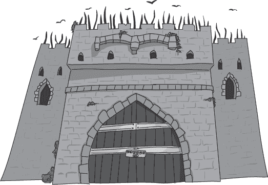

“你要我帮你破坏财产？”袜子露出惊愕的表情。“那比开锁还要糟糕。你知道这会惹多大麻烦吗——”

“那是搜索法术吗？‘全组合法术’或‘广度优先搜索法术’？”符号打断道。自从弗兰克随意询问关于在金币上复制法术的可行性之后——这种魔法明显违反了袜子和她自己的伦理底线——她已经听够了关于正当与不正当法术的讨论。

“我用过几次广度优先搜索法术，”袜子回答。“我真正擅长的是二叉搜索树，但我熟悉一系列计算技术。曾经有一次——”

“广度优先搜索能在锁上起作用吗？”弗兰克打断道。多年来，弗兰克处理过几个不同程度尊重的巫师案件。他见过至少十几种不同的开锁法术，但从未见过通过明确的广度优先搜索打开门锁。

符号微笑着说：“当然！这有点抽象，但我最近在我的《警察算法》课程中看到过类似的问题。想一想，密码锁就是一个搜索问题；你输入一串字符来打开它。搜索空间是所有可以由这些字符组成的可能字符串。每个字符串都是一个有效的搜索选项，从一个字符如 1 或 A 到复杂的序列如 ABC123CBA321。搜索目标是那个打开锁的字符串。”

“但是我们连需要多少个字符都不知道，”袜子抗议道。“那个锁可能有 30 个字符的组合。”

“这就是她建议使用广度优先搜索的原因，”弗兰克边思考边回答袜子的问题。

“我不明白，”袜子说。

符号迅速接过了解释。“你看，广度优先搜索从一个起点开始向外扩展，在解的边界上进行探索。它自然会先尝试较短的解。”

“嗯？”Socks 困惑地问道，显得有些慌张。“我以为广度优先搜索使用的是魔法列表。我一直用的是魔法列表，不是就是魔法列表吗？”

“是的，”Notation 同意道。“广度优先搜索会维护一个待尝试的选项列表，如果当前选项不起作用，我们就会从当前选项出发，寻找新的选项并将它们添加到*列表的末尾*。每次循环时，我们从*列表的前端*挑选一个新的选项尝试。如果那不是我们想要的，我们检查是否有任何新的选项可以从当前选项到达，并把这些未探索的选项添加到*列表的末尾*。”

“你从搜索空间的一个点开始，在这种情况下，从一个长度为零的密码开始。然后，对于每个尝试的密码，你在列表的末尾添加新的搜索可能性。在这种情况下，每次我们尝试一个密码时，我们会把所有的单字符扩展密码添加到列表的末尾。例如，这里我们知道密码只能包含字符 1、2、3 和 A、B、C。一旦我们测试过 3A，就会把 3A1、3A2、3A3、3AA、3AB 和 3AC 添加到我们的列表末尾。”

Socks 皱着脸集中注意力，然后问道，“我们怎么知道该加哪些选项？”

“把它当作一个可能性的树，”Notation 建议道，“每个分支，或者说*节点*，都是我们列表中的一个密码，比如 3A。它下面的相邻选项是那些通过在末尾加一个字符得到的密码。广度优先搜索会先遍历树的每一层，再移动到下一层。”

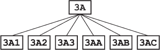

“因为我们把新的、更长的密码添加到列表的*末尾*，所以我们会先尝试所有短的密码，”Frank 补充道，“现在，你能做到吗？”

“这不是一个合适的使用——”

“来吧！真的吗？”Frank 打断道。

“这基本上就是一个开锁魔法，”Socks 回答道。

“对！完全是这个意思！”Frank 喊道。

“算了，”Notation 沮丧地举起双臂说道，“如果他不舒服开锁，我们大喊也改变不了他的想法。”她转身看着石墙，那面墙至少有 10 英尺高。过了一会儿，她继续说道，“Frank，如果你给我一个支撑，我也许可以爬过去。”

Frank 怀疑地看了看墙壁。尽管这堵墙已经被废弃了多年，但墙面没有那种老旧城堡墙上常见的大裂缝和藤蔓，这些往往能帮助登山。工艺相当精湛。显然，有人对建造这堵墙投入了真心，你可以从金属尖刺的艺术性扭曲形状看出来，那些细节显示出不小的工夫。

“也许吧。不过它挺高的，那些尖刺看起来非常锋利，”他说。

“这就像是学院里的障碍赛道，”Notation 说道，“除了坚硬的地面、没有把手的地方和那些大金属尖刺外。”

“那些可能会增添些刺激感，”Frank 插话道。

“闭嘴，给我一个支撑，Frank。”

“不，不。我来做，”Socks 急忙说道。“我会使用广度优先搜索法术。不过我需要一些东西来列出列表，可能需要一卷羊皮纸？”

Frank 和 Notation 互相看了一眼。“不行，小子。用地面吧，泥巴够多的。”

“哦，是的，当然。”

几分钟后，锁开始发光。“来了，”Socks 说道。

ENTER 这个词短暂发光，接着传来点击声。但大门依旧锁住。法术已经尝试了第一个密码，什么都没有。接下来，一系列的数字和字母出现在泥土中：

1, 2, 3, A, B, C

Frank 能想象出这个列表所代表的可能密码树。

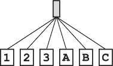

一瞬间，数字 1 发光，随后是 ENTER。再次传来点击声，但大门没有打开。地上的列表发生了变化，显示了新的密码尝试列表，树的第三层被展开。

2, 3, A, B, C

11, 12, 13, 1A, 1B, 1C

但这些条目被加到了列表的末尾。搜索仍然继续进行，保持在当前层级，尝试 2。

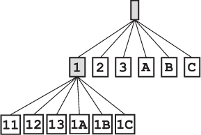

密码 2 没有成功，列表再次增长。

3, A, B, C

11, 12, 13, 1A, 1B, 1C

21, 22, 23, 2A, 2B, 2C

树再次展开了新的可能性，但搜索仍然沿着当前层级前进，尝试所有单字符密码后再向更深层次移动。

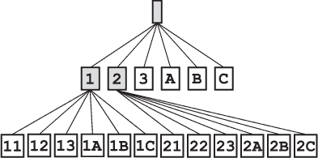

换句话说，搜索在深入到更深层级之前，先探索了每个层级的所有可能。

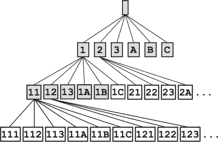

搜索完成了第一层，尝试了密码 3、A、B 和 C，直到 Socks 打破了沉默。“这可能需要一段时间。”

Frank 点点头，眼睛盯着不断增长的数字列表。“Notation，你去前面侦察一下如何？”

“好的，”她同意道，表情显露出极大的宽慰。新手通常不太能应对守夜任务。连续几个小时坐着什么也不做，这不是在军校能学到的技能，尽管 Cloud 教授的《执法哲学》讲座差不多讲到了这个程度。

Notation 离开后五分钟，锁发出了响亮的咔嚓声，大门在生锈的铰链上吱吱作响地打开了。泥土中的列表逐渐消失，搜索算法完成了。

“1111，” Frank 说道，脸上毫无惊讶的表情。保持代码简单到足以让手下记住，通常是个明智的选择。

他用一根棍子在一片泥地上写下代码，并圈出了两次。即使是新手也不可能错过这个信息。然后他转向 Socks，说：“走吧。”

**警察算法 101：广度优先搜索**

***摘自 Drecker 教授的讲座***

广度优先搜索是一种按遇到的顺序探索搜索状态的算法。换句话说，它总是优先探索最早未搜索到的状态。

你可以将广度优先搜索想象为保持一个已知但未探索状态的列表（或更正式地，*队列*）。在每一步中，算法从队列的前端选择下一个要探索的状态。随着算法发现新的选项，它会将它们添加到队列的后端，以确保在继续探索新的选项之前，所有先前的选项都已被探索。

以图的探索方式来描述广度优先搜索是非常有帮助的。图是一种数据结构，由单独的*节点*组成，*边*连接这些节点。如果两个节点通过一条边相连，我们说它们是*邻居*，这意味着你可以在这些节点之间移动。在你的培训过程中，你至少学习过一个图——《王国高速公路地图》。这张地图将每个城市表示为一个节点，将连接它们的高速公路表示为边。确保你拥有一份这张地图的好版本。罪犯有逃离城市的倾向，你需要知道他们最可能前往哪些邻近的城市。

搜索《王国高速公路地图》是一个经典的图搜索问题。我们的搜索状态是图中的节点——地图上的城市。想象一下，A 市发生了一起犯罪，你的任务是找到逃跑的罪犯。

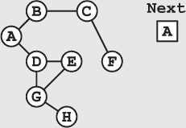

广度优先搜索沿着不断扩展的边界进行探索，首先检查从初始节点出发的*X*步之内的每个节点，然后才会检查距离初始节点*X* + 1 步之内的节点。在你探索完 A 市后，它的两个邻居 B 和 D 会被添加到队列的末尾。队列中没有其他城市，因此 B 是你下一个将要访问的城市。

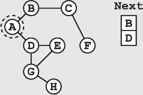

如果每个节点有许多邻居，维护待探索节点的队列可能会占用大量内存。在大型搜索问题中，这种内存需求可能变得非常昂贵。作为一名警官，你可能需要投资购买一些好的笔记本。

在广度优先搜索的每一步，我们都会测试当前节点是否是目标节点。在这个例子中，这意味着要彻底检查城市是否藏有我们的罪犯。如果当前节点不是目标节点，我们只会将其之前未见过的邻居添加到列表中。（*未见过*的节点是指还没有添加到列表中的节点。）因此，我们避免再次添加已经探索过的节点或已经在列表中的未探索节点。例如，在检查完 B 市之后，我们不会再次将 A 市添加到列表中。

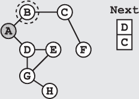

请注意，检查一个邻居是否是未见过的节点需要更多的内存，因为我们必须追踪已见过的节点。然而，这种方法的好处是显著的——我们避免了对已探索节点的循环。再次强调，仔细追踪你的搜索过程可以带来显著的回报。

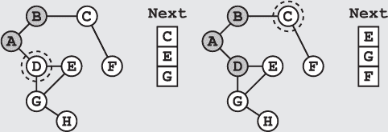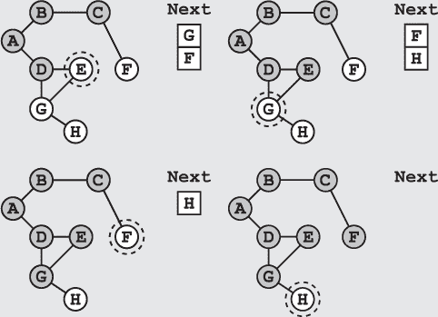

在这个具体的例子中，我们发现我们的嫌疑人藏匿在 H 市。我们可以在这里停止搜索并进行逮捕。

在那些任何两个相邻节点之间的移动具有相同成本（时间、能量等）的搜索问题中，广度优先搜索能够确保找到具有最小总成本的路径。它通过从起始节点向外扩展，先探索*每一个*与起点相距*X*步的节点，才会探索与起点相距*X* + 1 步的节点。

广度优先搜索甚至可以通过保持*回溯指针*来适应返回最短路径。每个节点都会记录前一个节点。然后，在找到目标状态后，可以通过回溯指针来重建路径。

然而，记住这只适用于相邻节点之间的每一次移动具有相同成本的情况。在一般情况下，最小化搜索空间中的步骤数可能与最小化到目标路径的成本有很大不同。例如，如果远足者想要最小化他们的能量消耗（成本），他们可能会更倾向于选择一条更长的路线，以避开穿越山脉的路径。虽然山口的路线更短，且可以说更具观光价值，但它可能需要消耗更多的能量。

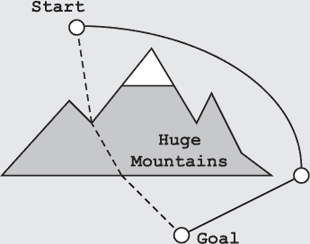
