## 第十一章：—11—

在废弃监狱中的深度优先搜索

踏入监狱的两步，弗兰克就知道他们已经走进了一个迷宫。旧时的计算监狱往往依赖于其奇特的结构，和守卫一样，构成了其防守的核心。潜在的逃脱者在不知道另一边是自由还是守卫的休息室时，会三思而后行，犹豫是否通过一扇门。

“要不要来点光？”弗兰克建议道。

“哦。对，”袜子同意了。他低声念出一个咒语，蓝色的火焰从他法杖的尖端闪烁出来，点亮了这个完全不起眼的房间。

方形的房间、粗糙的石墙和沉重的橡木门足以证实弗兰克已经知道的事情：整个结构是一个房间的网格，每个房间只有一些相邻房间有门。他们必须从一个房间走到另一个房间。但由于他们不知道哪些房间之间有门，他们必须在前进的过程中寻找出一条路径。

“该再搜索一次了，”他说。

“搜索？”袜子问道。“搜索什么？”

“当然是文件，”弗兰克回答道。他毫不怀疑那些文件藏在这里。废弃的监狱提供了一个理想的藏匿赃物的地方，显然比更常用的仓库更合适。可以说，唯一更好的地方是废弃的城堡——前提是它有护城河。现在的问题是，他们能否找到这些文件，之后，如果找到了，这些文件是否能提供任何有价值的线索。

“不是广度优先搜索，”袜子抗议道。

弗兰克考虑了一下这个想法。从理论上讲，广度优先搜索在网格上是行得通的。搜索空间的每个状态都是一个网格方格。一旦你探索了一个网格方格，你就可以将它的未探索相邻方格添加到你要尝试的列表中。弗兰克可以清晰地想象到，搜索会像波浪在水面上扩展，蔓延开来，覆盖整个空旷的网格。

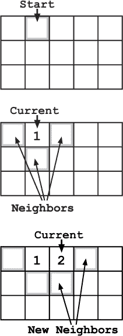

然而，广度优先搜索在物理世界中有一个主要缺点——过多的回溯。因为你总是将新的项目添加到列表的末尾，下一个要探索的方格可能会非常远。即使在一个空的网格上，没有墙壁阻挡你的路，你也可能发现自己不得不走回搜索空间的另一端。

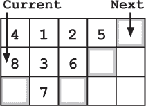

这是弗兰克决定避免的那种不必要的动作。

“没有，”弗兰克说。“回溯太多。我们还是用深度优先搜索比较好。”

“深度优先搜索，深度优先搜索，”袜子低声自言自语，仿佛在将这个咒语刻进他的记忆中。“我—我想我记不住—”

弗兰克挥了挥手，信心十足地朝走廊走去。“这个我们不需要咒语。我从你还在穿尿布的时候就开始在建筑物里做深度优先搜索了。”

“那深度优先搜索就没有回溯吗？”袜子问道。

“大多数搜索算法都有回溯。但是深度优先搜索中的回溯更适合走路。”

“嗯。。。我明白了。”

“不，你不知道，”弗兰克直截了当地说。“如果你不知道算法，就直接问。假装知道算法会导致灾难。我见过太多新手因为糟糕的搜索而被绊倒。像你这样的好孩子。”

“好吧。什么是深度优先搜索？”索克斯问。

“这只是一个简单的算法，”弗兰克解释道。“基本上我们会深入探索每条路径。我们沿着一条路径走，直到遇到死胡同。然后我们回溯到最近一个没有走过的路径，并尝试那条。我们会在找到目标时停止。”

“在这种情况下，我们将使用顺时针顺序。每当我们有多个选项时，我们会尝试北、东、南、西——当然，避开我们已经尝试过的路径。我们会在每个交叉口使用相同的顺序，所以如果可能，我们总是优先选择北边。但在这种情况下我们只有一个选项，所以我们先选择向南走。”

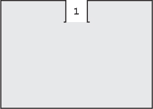

即使弗兰克在说话，他们也已经到达了第一个决策点。弗兰克看了一眼选项。他们是从北边来的，所以他选择了东边——在他的顺序中下一个未探索的方向。在离开交叉口之前，他从口袋里拿出一块粉笔，在墙上做了一个小标记。

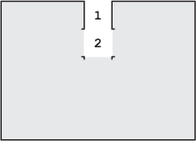

经过两个交叉口——先是向北转，然后向东转——他们达到了第一个死胡同。到目前为止，房间要么完全空荡，要么只包含一些奇怪的监狱单元格——这些单元格是房间内的围栏。由于缺乏其他明显特征，弗兰克在每个房间的墙上标记了一个数字，并在脑海中将这个数字与他在那儿发现的不同霉菌形态联系起来。

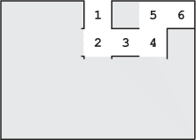

“现在我们回溯到最后一个房间，5 号房，那里有一个看起来像马的霉菌，”弗兰克一边回溯一边解释道。这次他们选择了从 5 号房间出来后唯一未探索的选项，向西走。不幸的是，他们马上又遇到了一个死胡同——一个空房间，墙上布满了复杂的绿色和蓝色毛绒图案。

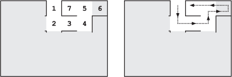

他们回溯到最近一个选项已经被探索完的交叉口，直到他们在房间 4 找到一个新的选项。东边的选项是死胡同，他们已经探索过北边的选项，所以这次他们选择了向南走。

他们走过了两个新的空房间（8 号和 9 号），仅通过一个大橙色霉菌的钟乳石来区分，而他们尽量远离这些霉菌。橙色霉菌的结构稳定性不太好。经过另一个死胡同后，他们发现自己又回到了 2 号房间的第一个交叉口。

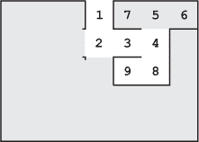

“如果我们错过了怎么办？”索克斯以他那种标准的担忧语气问。“或者如果我们陷入死循环怎么办？我们可能永远卡在这里！”

弗兰克呻吟了一声。“听着，孩子。这不是我第一次做深度优先搜索了。我知道自己在做什么。”

“但死循环。”

“你为什么认为我在标记墙壁？”弗兰克问道。“如果我们避免走已经探索过的通道，就能避免进入死胡同。”

弗兰克在警察算法的练习中学到了这个教训。当全班同学在场时，弗兰克走了六圈树篱迷宫，直到他听到另一位同学大声开玩笑道：“他又来了。”

他们继续深入迷宫，沿着曲折的小路走，不时在死胡同处倒回头。

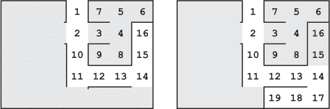

然后，在 23 号房间，他们发现了一个小牢房，里面堆满了羊皮纸卷和账簿。

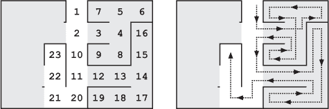

“我们找到了！”袜子兴奋地说道。他的法杖火焰在房间里投射出闪烁的蓝光。

弗兰克感到脖子上的汗毛竖起，他仔细观察眼前的场景。他对比了书堆的高度与他多年来完成的文书堆积，做了几个快速的计算。队长从不避讳把文件堆给他，但弗兰克从未见过如此场面。书堆底部甚至有发霉的页面。一切都让人觉得不对劲。

弗兰克走到最近的书堆前，拿起一张羊皮纸：一则关于使用鸭栅栏的注意事项。日期和车站编号标明这份文件属于被盗的档案。接下来的那张，列出了西部序列港口的噪音投诉，也来自被盗的档案集。它看起来同样随机且无助。

他跪下来，撬开底部附近的缝隙，猛地拉出一本账簿。页面上点缀着三只霉菌蝶的斑点，但弗兰克仍然能清楚地看出城堡卫兵的物资清单。这本账簿只能来自城堡本身。他拿起另一本书，发现上面记录了去年十一月的城堡卫兵轮换情况。

“这不对劲，”他低声说，“这里太多了，还有城堡的账簿。”弗兰克移到旁边的一堆文件，重新从上面开始。

“有规律可循吗？”袜子问道，似乎他刚刚注意到文件堆积的规模。

“我—”弗兰克开始说道，但他停住了脚步，当他翻开另一本账簿，上面写着*转移请求*。账簿中间的四页被撕掉了。

“很奇怪，”弗兰克一边翻阅完好的页面一边说，“这可能是—”

当袜子跌跌撞撞地朝他走来时，弗兰克的话被打断了，袜子挣扎着保持平衡。弗兰克看到背后在昏暗中有动静。直到他听到门铰链发出的生锈尖叫声，他才意识到发生了什么。

“门！”弗兰克大喊道，当年轻的巫师撞进他怀里。

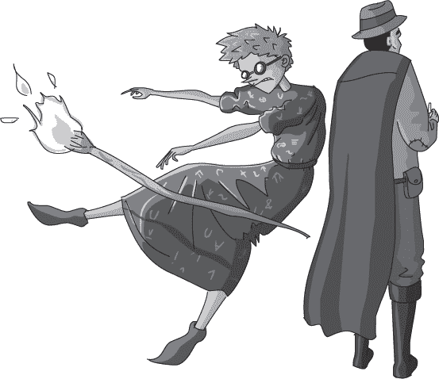

他们俩摔倒在地。门砰的一声关上了。锁扣发出一声响亮的“咔嗒”声，锁定了。袜子的法杖在混乱中掉落，懒洋洋地旋转着，撞入了一堆干羊皮纸。法杖的蓝色火焰似乎比弗兰克记得的要大得多。

弗兰克震惊地躺在石地板上，看着纸张燃起火焰。

**警察算法 101：深度优先搜索**

***来自德雷克教授讲座的摘录***

与广度优先搜索不同，深度优先搜索是一种优先探索最近遇到的搜索状态的算法。该算法沿路径推进，直到找到目标或遇到死胡同。

与广度优先搜索一样，你可以将深度优先搜索想象成保持一个已知但未探索的状态列表（在这种情况下是一个*栈*）。在每一步中，算法从栈的顶部选择下一个状态进行探索。但不同于广度优先搜索，深度优先搜索将新选项添加到*栈顶*。

让我们回顾一下讲座中关于广度优先搜索的图示例子。记住，图是由单独的节点和连接这些节点的边组成的数据结构。它们可以用来表示各种概念，如城市地图、犯罪网络，甚至是城堡的布局。我们将使用讲座中提到的王国高速公路地图，从城市 A（犯罪现场）开始我们的搜索。

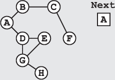

深度优先搜索沿着一条路径深入，直到遇到死胡同（或已经探索过的节点）。通过这种方式，算法优先在路径上进行*深入*探索，而不是像广度优先搜索那样在所有选项中进行*广泛*探索。

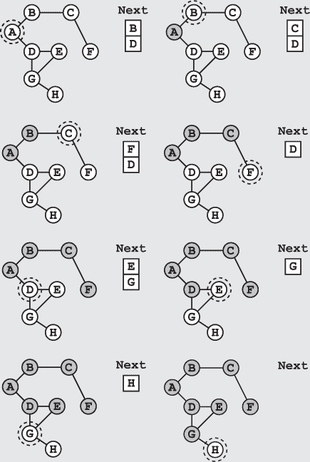

再次，我们在城市 H 找到了嫌疑人隐藏的地方——不过这次我们在搜索过程中走了不同的路径。

与广度优先搜索一样，我们通过跟踪之前访问过的节点来避免重复探索节点。如果你想避免陷入无尽的循环，一直检查相同的节点，这个检查尤为重要。在上面的例子中，我们完全避免将以前见过的节点（无论是已探索的还是未探索的）再次添加到列表中。
