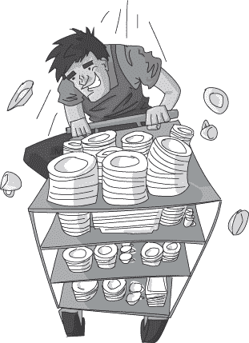
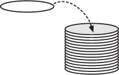
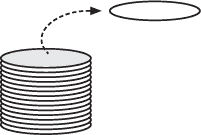
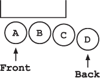
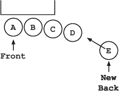
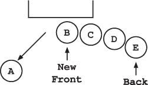
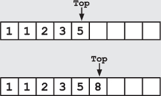
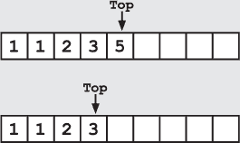
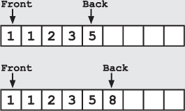
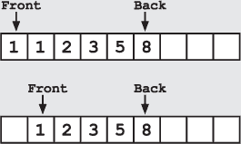

## 第十二章：—12—

自助餐厅的栈与队列

弗兰克蹲下身子，匆忙跑向门口。他一边拉一边推，把门撞得啪啪作响，试图把门打开。他抓住生锈的铁栅栏，用力将自己的全部体重压上去，却只发出更响亮的撞击声。

弗兰克转向索克斯，希望这位年轻的巫师知道一种能弯曲铁条的咒语。考虑到当前的情况，他确信索克斯甚至会同意使用开锁咒语。但当弗兰克的目光扫过那些冒着烟的羊皮纸堆和缭绕的烟雾时，他猛然僵住了。脑海中闪现出一个烟雾弥漫的厨房画面，唤起了他对学院第一年时光的遗忘记忆。几乎能听到厨师的喊声。弗兰克使劲闭上眼睛，试图把那段记忆赶走。

在他进入学术学院的前两个月，弗兰克将课业和在学校自助餐厅的勤工俭学工作安排得井井有条。这个工作并不光鲜亮丽；他们不允许新来的学生洗碗，更别提做饭了。相反，弗兰克每周花 15 小时把清洁过的托盘、盘子和餐具从厨房搬到自助餐厅的各个指定位置。

尽管工作枯燥乏味，弗兰克却发现自己乐在其中。“看看我！我正在逆向操作你们的工作。我是反洗碗工，”他会对三位正在收拾桌子并将脏盘子放进垃圾桶的洗碗工大喊。他曾尝试挑战学校记录，争取在两分钟内搬运最多的盘子，但失败了。他还创造了一个全新的自助餐厅游戏——“甩勺子”。但直到与海普教授的一次偶然相遇，他才从这份工作中真正学到了一些东西。

“唉。有些数据结构根本不适合出现在自助餐厅，”海普教授一边研究餐厅的食物选项，一边大声嘀咕。

下午 2:30，午餐高峰已经过去，弗兰克·运行正忙着将一堆碗运送到汤站。虽然这句话并不是对他说的，但他忍不住问教授：“什么是数据结构？”

“栈，”海普教授抬头看着弗兰克说道，“栈几乎永远不应该出现在自助餐厅里。”

“当然知道，”弗兰克回答时，带着只有新生和真心无知的人才有的那种自信。他低头看着自己正拿着的一堆碗。“碗堆。盘子堆。煎饼堆。”

海普教授做了个不屑的手势，开始走开。“你知道什么是数据结构吗？”

“你到底该怎么摆放盘子？”弗兰克问。“如果把它们一个接一个地摆放，空间太大了。”

教授停下脚步，盯着弗兰克，表情充满了深深的担忧。过了将近一分钟，他问：“你知道栈和队列的区别吗？”

弗兰克摇了摇头。他还没学过《警察数据结构》。

“栈是一种*后进先出*数据结构，”教授解释道，“它有两个操作。你可以把东西*推*到栈的顶部。或者你可以从栈的顶部*弹出*东西。”

他指了指排队前面的那堆盘子。“就像那堆盘子一样。你可以把一个盘子放到堆里去。”

他把空盘子放在了那堆盘子上面。

“或者你可以把盘子从顶端取下来。”他又拿回了自己的盘子。

“而且每次你从栈顶弹出东西时，你得到的都是栈中最新的项目。最旧的项目将一直待在栈底，直到你弹出它上面所有的东西。”

“那又怎样？”弗兰克问。“那有什么问题？”

“如果你正确使用*后进先出*数据结构，它没什么问题。栈在写深度优先搜索时非常好用；你只需不断地把新的搜索选项推到栈里，然后在回溯时一个个弹出。但是自助餐厅已经误用了栈几十年了！”

“拿这堆盘子看看。你知道底下那个盘子已经放了多久了吗？”

弗兰克试图回想上次看到那堆盘子空的时候，但他甚至连那个画面都想不起来。

“五年！”赫平斯教授大喊，“我知道，因为我做了标记。那个底盘已经在那里放了五年，没人用，像你这样的学生把其他干净的盘子堆在上面。它就那样静静地待着，边缘堆满了灰尘。”

“但这还不是最糟糕的。看看他们怎么对待马铃薯泥！”

弗兰克瞥了一眼那个盛 mashed potatoes（马铃薯泥）的木大碗。一名厨师正在给碗里加料，他一只手拿着大锅，兴高采烈地将新鲜的马铃薯泥盛进碗里。过了一会儿，弗兰克才意识到，旧的食物只是在被埋在下面。他感到一阵恶心。

“多久了？”他喉咙里哑着问，实际上他并不想知道答案。

“别担心，他们至少每周会清洗一次盛菜碗，所以那些旧的马铃薯泥也不过一周左右。”

弗兰克并没有感到放心。事实上，他感觉相当不适。快速扫视了一下自助餐厅，发现到处都是*后进先出*模式的应用。当他停在沙拉酱的大桶旁时，他的胃翻腾，混合着恶心和恐慌的感觉。

“我们该怎么办？”他问道。

“队列，”教授回应道，“队列几乎是为了自助餐厅而设计的。”

“队列？”弗兰克问。

“先进先出数据结构，”赫平斯教授解释道，“像栈一样，它们也存储东西，并且有两种操作。你可以通过把某个东西加入到队列的末尾来*入队*。或者你可以通过从队列的前端拿出东西来*出队*。这样，你总是取出最旧的项目。”

弗兰克试图想象总是从栈的底部取盘子。“那怎么取？”

“这就是数据结构的工作方式。看看三明治队伍，它就是一个队列。现在队伍里有四个人，最前面的人等得最久。”

就在赫潘教授说这话的时候，又有一个人加入了队伍。“看，他们从后面入队！”他指出。

他们站着观察着队伍，直到最前面的人拿到她的三明治并离开。

“然后从前面出队，”教授高兴地说道，“这个食堂需要更多的队列。每个食堂都需要更多的队列。”

弗兰克回想起土豆泥的堆叠方式，意识到教授是对的。数据如何存储，确实会对它的访问方式产生重大影响。像土豆泥这种情况，顺序是很重要的。

尽管这个看似简单的启示，弗兰克却花了好几天才将队列融入到食堂的运营中。盘子和碗相对容易解决。他只需将旧的堆叠起来，并把新的盘子滑到下面。说服厨师们改变舀食物的方式则困难得多。厨师们非常喜欢舀起一大勺土豆，微笑着看着土豆团啪嗒一声掉入碗中。弗兰克最终建议了一种双碗方法，将旧的土豆舀到新碗的上面。虽然这不完全算是队列，但保留了舀土豆的乐趣，而且旧食物不会被埋在底部。

不幸的是，当他代替生病的面包师时，灾难降临了。由于没有注意到面包是分批烤制的原因，弗兰克坚持认为后面的面包被最后放进烤箱是不公平的。他设计了一个旋转方案，每隔 25 秒插入一个新的面包，旋转烤箱中的所有面包，并移除最老的面包。

如果烤箱有两个门，一个在前，一个在后，弗兰克的烘焙队列尝试或许能成功。不幸的是，食堂使用的是一个旧款单门烤箱，这使得面包的旋转进出变得非常困难。虽然持续的旋转确保了所有面包有更一致的烤制时间，但弗兰克发现自己跟不上烤制的进度。很快，浓烟从炉膛中冒出，面包变黑了。

当其他厨师拿着水桶冲向火堆时，弗兰克呆呆地盯着焦黑的面包。随着他意识到队列可能并不是解决*每个*食堂问题的答案，绝望的迷茫感悄悄袭来。他仍然有很多关于数据结构的知识需要学习。

**警察算法 101：栈和队列**

***来自德雷克教授讲座的摘录***

栈和队列是两种简单的数据存储结构。乍一看，这两种数据结构似乎不过是数值的列表。然而，它们的区别在于数据是如何被插入和移除的。

栈是一种先进后出（LIFO）的数据结构，操作方式类似于你在每个办公室桌面上看到的文件堆。新元素被*压入*栈顶，而元素则通过从栈顶*弹出*的方式移除。如果五个元素按顺序 1、2、3、4、5 被压入一个空栈，它们将按相反的顺序被弹出，5、4、3、2、1。当然，一旦你的文件堆被清空，你的队长就会给你更多的文件工作。

你可以使用数组和一个单独的变量来实现栈，并跟踪对应栈顶的索引。当你将一个新元素压入栈时，你将其添加到数组中的下一个空槽位：索引 = top + 1。你也需要相应地增加栈顶索引。

当你从栈中弹出一个元素时，你可以再次使用栈顶索引找到正确的元素。然后，你可以将其从数组中移除，并相应地减少栈顶索引。

当然，当你向一个固定大小的数组中添加元素时，必须小心避免超出数组的末端。

队列是一种先进先出（FIFO）的数据结构，类似于一排等待处理的嫌疑人。新元素被*入队*到队列的末尾，元素通过从前端*出队*的方式移除。如果五个元素按顺序 1、2、3、4、5 被入队到一个空队列，它们将按相同的顺序 1、2、3、4、5 被出队。

队列也可以通过数组来实现。在这种情况下，你需要跟踪两个索引——队列中的第一个和最后一个元素。当你将一个新元素入队时，你将其添加到当前最后一个元素后面，并增加后端索引。

当你从队列中出队一个元素时，你移除前面的元素并相应地增加前端索引。

当你在一个固定数组中进行入队和出队操作时，数组的前端会积累一块空闲空间。虽然你可以设计队列使其具有环绕功能，但在入队和出队操作时必须小心，避免索引超出数组的末端。
