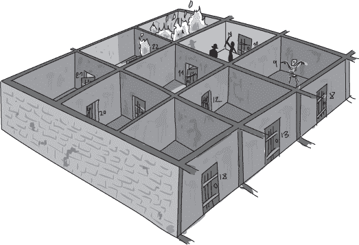
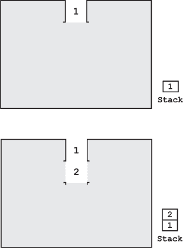
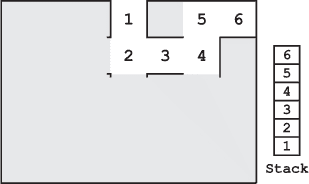
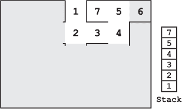
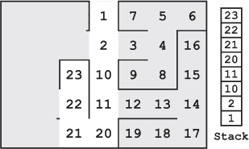
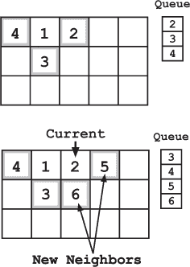

## —13—

搜索的栈和队列

Frank 甩开了脑海中关于烧焦面包的画面，重新回到眼前的困境——被困在一个充满即将燃烧的羊皮纸的小牢房里。火苗还很小，只是烧着堆积物边缘的松散纸张。但一旦大堆纸张完全着火，热量将变得难以忍受。

Socks 爬到门口，靠在门上。“门锁了吗？”他问。

Frank 咽下了好几个带刺的回答，简单地点了点头。“你能打开它吗？”他问。“这是一个老式的双销锁，应该没有那么多组合。”

Socks 摇了摇头。“没有时间了。不过我知道一个咒语可以削弱金属。这样会毁掉门，但是……考虑到现在的情况，我想这也没关系。”

他拿起法杖，立刻开始工作，嘴里念念有词，一只手在栏杆上滑动。锈斑在他手下绽放，慢慢蔓延过金属。不到一分钟后，Socks 站了回去。门看起来已经完全生锈了，虽然依然是金属制的。

“铁栏杆应该已经大大削弱了，”他说道。他退后一步，期待地看着 Frank，仿佛在说，“你现在可以随时撞开门了。”

Frank 退后了几步，打量着门。“有多弱？”他问道。“是像牙签一样弱，还是像厚木板一样弱？”

“嗯……肯定比普通金属弱，”Socks 回答。“我加了很多锈。栏杆很厚，但我想它们现在应该很弱了。”

Frank 呻吟了一声，深吸一口气，猛地冲向门，低下肩膀，撞向门。撞击使他的全身一震，但他突破了。

Frank 躺在地上，周围弥漫着锈屑和烟雾的混合物。

Socks 急忙跑到他身边。“你还好吗？”他回头看了看门，露出了灿烂的笑容。“成功了！”他一脸得意地说道。“它们真的很弱吗？感觉如何？”

“就像一英寸厚的松木，”Frank 说。“真的很疼。”

微笑稍微暗淡了一些。“哦。”

Frank 艰难地站了起来。他的肩膀疼得厉害，明天肯定会有个大淤青，但逃脱火焰死亡的短暂快感很轻松地抵消了那点痛苦。

“该走了，”他说着，走进了下一个房间。

“你记得怎么回去吗？”Socks 问。

“当然，”Frank 回答。“我们用的是深度优先搜索来找到这里。我们可以沿着栈回去。”

“栈？”Socks 一边跟着 Frank 走，一边问道。

“是的，”Frank 说道，仍然沉浸在刚才逃脱的兴奋中。“搜索很容易从它们使用的数据结构角度来看。例如，广度优先搜索使用队列，深度优先搜索使用栈。” 解释像《符号学》教材里的标准答案一样滔滔不绝地从他口中流出。

“其实，深度优先搜索有几种不同的方法来跟踪你的选择。有些人喜欢使用栈来列出*未来*要探索的房间，类似于广度优先搜索中使用队列的方式。我更倾向于另一种方法。”

“你可以用栈来跟踪当前路径上的房间。每当你探索一个新房间时，就将它压入栈中，表示你当前的路径。”

“当你回溯时，你将该房间从栈中弹出，回到之前的那个房间。这样，你总是知道如何回溯。我甚至给房间编号，以便更容易回溯。”

“我以为你总是直接回溯到最后的决策点，”索克斯说道。

“你实际上是这么做的，”弗兰克说。“但是把房间放在栈里会让这个过程变得容易得多。你只需要回溯，直到遇到一个有新路径的房间，再将已完全探索的房间从栈中弹出。”

索克斯看起来印象深刻。“你把我们探索过的房间都写下来了？”

“我在脑海中记住了栈的内容，用粉笔给房间编号，”弗兰克回答道。“正如我所说，这不是我第一次做深度优先搜索。我们得回溯七个房间。”

他们穿过两个黑暗的房间匆忙返回，这时索克斯才想起手中的法杖。他再次低声念出火焰咒语，蓝色的火焰从法杖尖端跃出。

弗兰克警惕地看着工作人员。“这次要牢牢把握住它，”他建议道。

经过三个房间后，索克斯突然问：“队列怎么样？”

“它们怎么了？”弗兰克问道。

“你说它们是用于广度优先搜索的。”

“它们是的，”弗兰克同意道。“你的魔法列表实际上就是一个队列。在*广度*优先搜索中，队列跟踪未探索的选项。你不是将当前状态压入栈中，而是将新邻居添加到队列的末尾。”

“在*深度*优先搜索中，你可以使用列表或栈来跟踪未探索的邻居或当前路径吗？”索克斯问道，他对于在废弃监狱里逃离不明攻击者的情境下，仍显得异常兴奋。

“无论哪种方法，如果你在记账上小心，都会奏效，”弗兰克同意道。

“我以前从未把搜索问题与堆栈和队列联系起来，”索克斯若有所思地说。“我想知道还有哪些数据结构我忽视了。我敢打赌‘解开绳结咒语’就用了几个。”

弗兰克没有理会他的胡言乱语，继续回溯到出口。他们快速行动，优先考虑逃脱而非进一步探索。简单的逻辑告诉弗兰克，攻击者早已离开。没有人试图阻止他们逃跑，而且证据已经被烧毁，犯罪分子也没什么可得益的理由再待下去。

几分钟后，他找到了最后一扇门，他们迅速冲了出去。一股细烟随他们一起飘出。此时火焰应该已经吞噬了纸堆，摧毁了所有线索。

**警察算法 101：栈和队列**

***德雷克教授讲座摘录***

高效算法的关键在于信息。我们如何组织这些信息以及所使用的数据结构，不仅对算法的效率产生重大影响，还会影响算法的实际运作。以数据结构重要性的简单例子来看，考虑之前课程中的广度优先搜索和深度优先搜索。虽然这些算法在概念上相似，但我们是否使用栈或队列来存储我们的线索列表，会显著改变搜索的进程。

在选择数据结构时，你需要小心。数据结构应该有助于算法的实现。想象一下，如果我们将一个已排序的数字列表存储在图中会发生什么。即使我们保持排序的特性，也无法对数据执行高效的二分查找，因为图结构限制了我们访问数据的方式。与数组不同，图没有索引让我们能够访问数据值。相反，我们只能通过图的边缘，沿着从一个节点到另一个节点的路径执行线性扫描。
