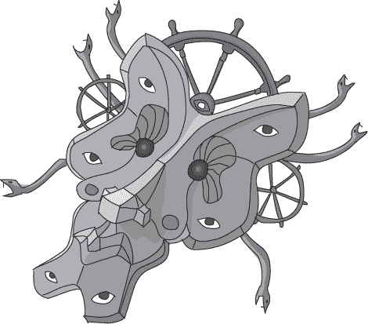

## —14—

分头行动：并行搜索

“发生了什么？”符号警官问道，她站在大门旁边。弗兰克边喘气边打量着她。他在想，她是担心吗？还是困惑？

“我们被攻击了！”袜子急促地说。“我们被困在一个牢房里，周围都是火！但我用了一个金属削弱法术，才得以逃脱。”他说话时看起来很得意。

“攻击？”符号问道。“谁攻击了你？你看到他们了吗？他们长什么样？”

“没有，”袜子承认道。“他悄悄地从我背后接近的。”

“弗兰克？”符号问道，转向弗兰克。

弗兰克摇了摇头。“我只看到袜子朝我飞过来。”

“我敢打赌他很大，”袜子插话道。“一个巨型暴徒。而且他很隐秘，可能是个训练有素的刺客。”

弗兰克翻了个白眼。“抱歉，孩子。他是个业余的。职业刺客不会把人锁在牢房里然后逃跑。”

“但是火灾，”袜子说道。

“你的法杖引发了火灾，”弗兰克提醒道。“你把它掉在了文件上。”

“文件？”符号问道。“你找到日志了吗？你知道他们在找什么吗？”

弗兰克和袜子互相看了看。符号从一个人看向另一个人。最后，弗兰克开口了：“日志不见了。我们的年轻法师把他的法杖掉了，*砰*——火焰四起。任何线索都没了。”

袜子脸红得像个熟透的番茄，低头盯着地面。

“没了？”符号问道。“一切都没了？你确定？”

“是的，”弗兰克说。他朝着门口飘出的烟雾点了点头。

“那攻击你的人呢？”符号问道。

“我没看清楚他长什么样，”弗兰克说。“我猜你也没看到什么吧？”他说道。这个问题说得有些尖锐，但在经历了被攻击、被困在火海中，以及逃离黑暗监狱后，他实在不想再做任何客气。

“没有，”她平静地说。“前面没有任何东西。”

“门附近没有任何脚印吗？”弗兰克问道。“有能给我们提供线索的东西吗？”

符号摇了摇头。“什么也没有，”她说。“看起来好像好几个月没人走到另一边了。”

弗兰克点了点头，但没说话。感觉有些不对劲。要么攻击者巧妙地从符号身边溜过去，利用他们进来的门，要么她没告诉他们什么。她离开大门多久了？为什么她一直待在外面？弗兰克决定不再追问。“好了，咱们回船上去吧。”

“现在怎么办？”袜子问道，边朝水边走去。

“该回溯了，”弗兰克说道。“这里已经没有线索了。”

“回溯到哪里？”

“开放的线索，”弗兰克回答道。“我们调查剩下的线索。”他停了一下，权衡了一下选择。“我觉得现在是时候进行并行搜索了。”

“真的吗？”符号问道。

“并行？”袜子问道。

“这意味着我们分开，探索搜索空间的不同部分，”Notation 回答道。“并行算法将工作分配出去，并且同时进行——也就是在同一时间。例如，工作可能会分配给不同的人。在这种情况下，我们可以将线索分成三组。然后你、Frank 和我可以分别处理一组线索。我们可以同时调查不同的线索，这样就能使我们的工作效率几乎提升三倍。”

“但是，”Socks 反对道，“我不是警察，也不是私人侦探。我不知道该怎么办。我是不是应该和你们中的一个待在一起？”

“不，”Frank 说。“我仍然不确定发生了什么，但我有一种感觉，我们的时间有限。无论我们追踪的是谁，他们现在知道我们已经开始调查，并且知道我们已经追踪到这个地步。如果他们足够聪明，他们会开始销毁剩余的证据。”

“等我们回到 Usb 时会很晚了，”Socks 说道。

“我们今晚可以分开，明天早上在我办公室见面，”Frank 说。“这样应该有足够的时间去追踪线索，可能还可以小睡一会儿。”

“好的，”Notation 同意道。“我们如何分配工作？”

Frank 知道，高效并行算法的关键是确保使用多个工作者的好处值得分工的成本。并行化工作涉及一定的开销。问题需要被分解成多个部分。每个工作者都必须获得任务、准备好执行它，然后真正去做。最后，工作需要重新合并。并行化一个简单的任务有时比直接解决它还要更为昂贵。然而，当问题变得足够复杂时，使用并行化可以极大地加速算法的执行。

“很简单，”Frank 说。“Socks，我需要你去找你的巫师朋友们。问问他们是否知道有一个叫做‘某某联盟’的团体。船上的那些暴徒说他们以前为一个联盟工作，直到 Rebecca Vinettee 打断了他们。根据以往的案例，这个名字应该是类似‘渴望权力的疯子联盟’或者‘黑暗联盟’这样的邪恶名称。邪恶的联盟通常在名字上不会太含蓄。找出你能知道的关于这个团体的所有信息。”

“这信息太少了，”Socks 抱怨道。

“Notation，”Frank 继续说道，“我需要你调取过去六个月的所有警察转移记录。”虽然他不喜欢将这个线索交给 Notation，但她是唯一能够轻松获取这些记录的人。如果他自己去收集，肯定会遇到怀疑的目光和一堆文书工作。首都警察局处理文书工作时的效率，简直可以和设置路障相媲美。

“转移记录？”Notation 问道，显然有些惊讶。“为什么？”

“算是直觉吧，”Frank 撒谎道。“我们明天早上在我办公室见面，汇总我们的信息。”

“那你呢？”Notation 问道。她的语气中带有一丝恼怒。显然，她知道 Frank 没有把所有事情都告诉她。

弗兰克给了她一个无辜的微笑。“我得去购物。”

_____________________

当*TCP Flyer*缓缓地返回 Usb 时，弗兰克在甲板的一个僻静角落找了个地方坐下来思考。这是他最讨厌的调查部分，当有前景的线索开始枯竭，或者在这种情况下，变得破灭时。失去一个关键线索总是让弗兰克感到一种不安——就像他总是落后一大步。弗兰克强迫自己排除心中的怀疑，重新集中精力去关注他手上的线索。前往 Usb 的航程将给他时间回顾自己所见的事物，找到那些他错过的连接。

他闭上眼睛，深吸了一口气。

“哦，抱歉。你在睡觉吗？”Socks 问。

“不，是在思考，”弗兰克说，并为自己没有大喊大叫而感到庆幸。毕竟，那个男孩救了他的命。

当 Socks 没有再说什么时，弗兰克继续问道：“你想要什么，Socks？”

“嗯... 我对这个搜索很好奇，”Socks 回答。

“怎么说？”弗兰克问。

令弗兰克失望的是，Socks 走了过来，坐在了他旁边。

“你觉得我们会找到罪犯吗？”Socks 问。

弗兰克耸了耸肩。“我们还有一些很好的线索，”他说。

“但你觉得我们会赶得及吗？”Socks 问。

警报在弗兰克的脑海里响起。他转身，狠狠地盯着 Socks。“什么时间？”

Socks 差点摔倒后仰。他的眼睛四下 darting，仿佛在寻找一个合适的答案。“他们计划的事情？”他终于结巴地说道。

弗兰克不信。“你还知道什么？”他问。

“没有，”Socks 回答。“至少，没什么确凿的线索。只是推测。不是我的——是我导师 Gretchen 的。她对这些事情有很好的洞察力。”

“哪一种？”

“我真的不应该说什么。这只是推测。”

“*哪一种？*”弗兰克低声咆哮道。

“她认为，不管是谁在幕后，几天后他们会攻击城堡。”

弗兰克猛地站了起来。“你为什么不早点提这个？”他大喊道。

“这只是推测，”Socks 重复道。

“除非这是完全的猜测，否则她一定有某些理由，”弗兰克说。“这是猜测吗？”

“不，完全不是，”Socks 说。“这是基于被盗的面具。魔法物品在满月时最有效，而满月就在两天后。”

“这个面具到底有什么作用？”弗兰克问，开始焦虑地来回走动。

Socks 犹豫了一下。“它是一个极其强大的物品，”他开始说。在看到弗兰克眼中的愤怒神情后，他加快了语速。“它正式叫做组合面具。几百年前的大蛞蝓战争中它失落了。大家都以为它被摧毁了，直到安娜公主在一次探险中找到了它。她找到它——”

“它*能做什么*？”弗兰克继续追问。

“它允许佩戴者看起来像任何其他人。学者们认为它使用了大规模并行搜索。每个特征都会进行自己的搜索，以找到最佳匹配。鼻子会变成目标鼻子的完美匹配。眼睛会变成——”

“一个完美的伪装，”Frank 提供道。

“有的，”Socks 说道。

Frank 咒骂了一声。“那城堡呢？为什么 Gretchen 认为他们会攻击城堡？”

“她没说，”Socks 承认道。“也许那部分*是*猜测，”他补充道，语气没有什么信心。

Frank 也不相信。

“抱歉我没有早点提到这件事，”Socks 提供道。“由于没有确凿的证据……”他停顿了一下，看起来很沮丧。

“你还有什么没告诉我们的吗？”Frank 问道，眼睛盯着 Socks。

Socks 思考了这个问题很长时间，然后回答道：“我想就是这样。”

“全部都吗？”

“我知道的一切，”Socks 补充道。

Frank 深深地吸了一口气，抬头看着帆，心里希望帆能更饱满些。过去一个小时，风力减弱了，*TCP Flyer* 看起来几乎没有向目的地推进。

他在脑海中回顾接下来几天的时间安排，想知道他们是否有足够的时间。即使有三个人同时搜索，也无法保证他们能够覆盖足够的区域。更糟的是，他们甚至无法在 *TCP Flyer* 停靠之前开始并行搜索。在此之前，他们都只能困在船上。

**警察算法 101：并行算法**

***摘自 Drecker 教授的讲座***

并行算法将问题分解成多个部分，同时对这些部分进行计算（大致上是同时），然后在所有部分完成后合并结果。它将工作分配给不同的工人，使他们比单个工人完成任务的速度更快。考虑我们最喜欢的例子：在废弃的建筑物中寻找嫌疑人。你拥有的警察越多，你就能同时检查更多的房间，也能更快找到嫌疑人。如果你有 30 个房间和 30 个警察，他们可以同时踢开所有的门。

高效并行算法的关键是将工作有效地划分成独立的单元，然后再进行合并。有些问题非常容易并行化。例如，如果你在查找一堆卷轴中的某个线索，可以很容易地将工作划分给每个工人一部分卷轴。

然而，其他算法则要难得多，甚至不可能并行化。即使你有 100 个警察，你也无法更快地审问嫌疑人。这是一个固有的串行问题。你需要根据嫌疑人之前的回答来提问。而且，也许更重要的是，嫌疑人每次只能回答一个问题。我曾经看到过 8 个警察同时大声问问题，审讯并没有因此变得更快。

另一个在并行化算法时需要考虑的方面是，效率是否值得付出额外的开销。并行算法需要额外的设置时间来划分工作，并且还需要时间来合并结果。每个任务必须分配给不同的工作者，这通常需要一定的沟通。考虑一下在一个仅包含三个值的未排序数组中进行搜索的任务。在设置完成之前，一个人可能已经能多次扫描整个数组。
