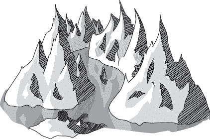
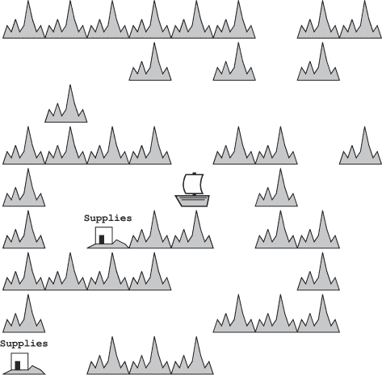
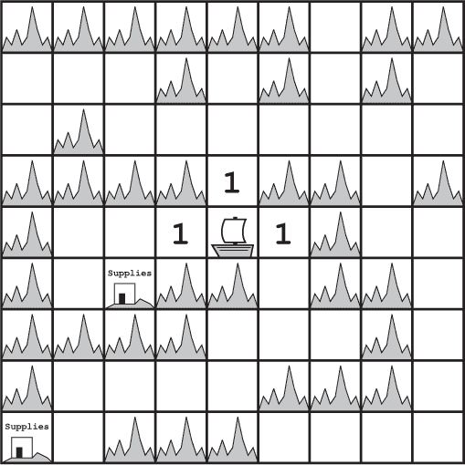
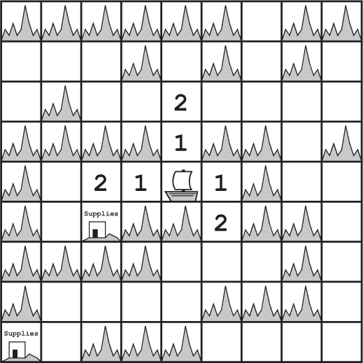
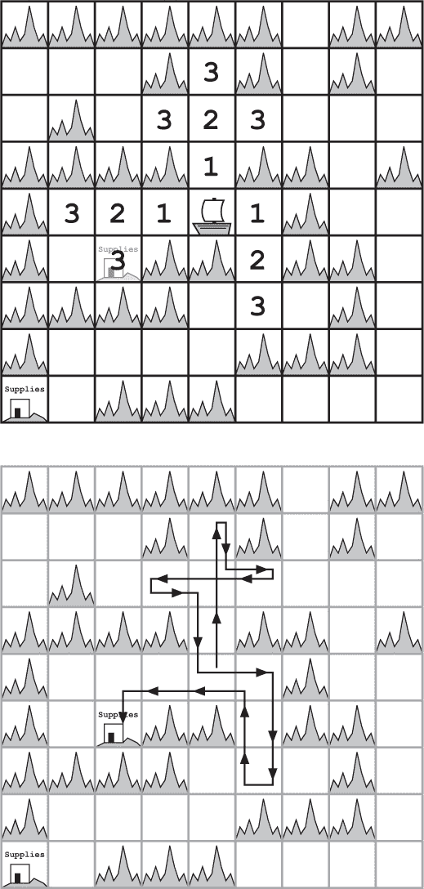
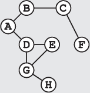
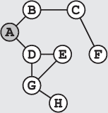
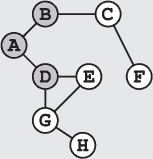
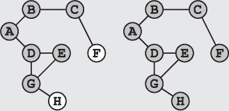

## 第十五章：—15—

迭代加深可以救命

“我知道那个表情，”梅维斯说。弗兰克不耐烦地抬头看了看*TCP Flyer*号的船长。他更喜欢安静地沉思，而这已经是 10 分钟内的第二次打扰了。

“什么表情？”他咆哮道。

“那个表情，”她说着，手指着弗兰克的方向。“你在质疑你的搜索，想知道自己是不是花太多时间在死胡同上。”

“我为什么要这么做？”弗兰克问道。

“我听到那小子说的话了，”梅维斯解释道。“你现在有了紧迫的时间限制，而我们至少还有一个小时才能回到 Usb。”

弗兰克点了点头。“如果这堆破烂——”

“嘿，别这样。你只是质疑自己的搜索，不代表可以侮辱我的船。”

“嗯，我猜是吧。”弗兰克低声道歉。

他一直在脑海中回顾线索，想知道其中是否有能够提供更快答案的。虽然他知道这些日志条目是有效的线索——在这种情况下已经是他能找到的最好线索了，但它们却非常耗时。他几乎花了一整天在*TCP Flyer*号船的各个港口之间旅行。

梅维斯 grunt 了一声，坐到弗兰克旁边。“迭代加深？”

弗兰克耸了耸肩。这个想法曾经在他脑海中闪过。迭代加深算法介于纯深度优先搜索和广度优先搜索之间。该算法分为几轮，每一轮都是深度优先搜索，但搜索的深度有限制。

“我从来不喜欢这样，”弗兰克承认道。他一直无法忍受每次迭代都要重复搜索的一部分工作。很多时候，感觉这些工作就是浪费时间。

梅维斯笑了笑。“那你显然还没遇到足够的死胡同。”

弗兰克挑了挑眉。“你这是在跟一个私人侦探说话。我的工作就是不断地在死胡同和正确路径之间徘徊。”

“有没有因为一个死胡同丢了犯罪嫌疑人？”梅维斯问。

“几次吧，”弗兰克承认道。

“那你应该理解迭代加深的重要性，”梅维斯说。“当我第一次看到它被应用时，我也为每次重启感到烦恼。但它已经救过我不止一次了。”

“一遍又一遍地重启搜索救了你的命？”弗兰克问道。

“限制我沿着错误路径探索的距离救了我的命。”梅维斯纠正道。

“迭代加深什么时候救了你的命？”弗兰克问，语气里无法掩饰怀疑。

梅维斯凝视着远处的大海。“嗯……第一次是在我还是个孩子的时候。我在一艘叫做*Void Star*的货船上当学徒。那是一艘了不起的船，能装下任何东西。总之，我们在‘刀锋脊’中迷路了——那是一系列密集的火山峰，形成了一个巨大的迷宫——而且我们的重要补给已经快没了。”

“水？”弗兰克问道。

“不，”梅维斯回答道。“我们至少有两周的食物和水。咖啡快没了，对船员来说那可不是好消息。没了咖啡一天后，副船长就会变得焦躁不安，唱起忧郁的海上歌曲。”

“听起来还不算太糟。”

“没有咖啡，那人的歌声吸引了八英里范围内所有凶猛的鸟类。”

弗兰克想到这里，不禁皱了皱眉。

“总之，”梅维斯继续说道，“咖啡对船来说至关重要。船长估计我们只有不到两天的时间找到一个有补给站的岛屿。她知道附近一定有一个，但不知道具体位置。你看，我们在一场即兴的纸飞机比赛中丢失了地图。再加上山脊上弥漫着浓雾，我们根本看不见补给站，直到我们站在它的正上方。”

“我们最初是想找一个有咖啡的岛屿。我那时还很年轻，没听说过迭代加深，所以我大胆地建议使用深度优先搜索。船长只是笑了笑，告诉我她永远不会在刀锋山脊上信任深度优先搜索——那里有太多长长的死路。

“嗯。她将海洋划分成一英里见方的块状。每一英里大约是你在雾中能看到的最大距离，因此我们必须处于与补给站相同的格子里才能看到它。然后我们开始使用迭代加深来探索。我们使用了深度优先搜索，但将其限制为单个单元步长。我们采用了经典的北、东、南、西顺序，每次都回溯到起始位置。我们在第一步中没有找到任何东西，但至少我们高效地进行了探索。几个小时内，我们就排除了所有相邻的格子。”

梅维斯摇了摇头。“完全没有发现补给站的踪迹。所以我们重新开始，从原始起点做另一次深度优先搜索。这次我们探测了两步，覆盖了更多的区域。在这个过程中，我们又重新探索了相邻的格子。依然没有补给站的踪迹，但我们很快就排除了所有两步内的格子。”

“那为什么不直接用广度优先搜索呢？”弗兰克问道。“反正你们做的就是这个。你们的搜索是向外扩展，越来越远离起点。”

梅维斯点了点头。“广度优先搜索和迭代加深有很多相似之处。但你忘了一个关键点。*我们丢失了地图*。在没有地图的情况下，使用广度优先搜索来追踪你尚未探索的状态是非常困难的。你怎么记住你的边界？迭代加深让我们能够向外扩展，而不需要显式地记住所有未探索的状态。我们只需要遵循一个深度有限的路径。”

“我想是的，”弗兰克同意道。

“总之，”梅维斯继续说道，“那时我们的咖啡已经快喝完了。一群志愿者，包括船长本人，开始喝脱咖啡因的咖啡。但我们都知道这只能让我们多撑一会儿。我们继续前进。我们又一次重新开始深度优先搜索，这次允许我们探索得更远。”

“你是用长度为三的搜索找到的吗？”弗兰克问道。

“幸运的是，我们成功了，”梅维斯回答道。“在那次迭代中，我们检查了每一个距离一步、两步、三步的地方。那时，军需官，那个完全不需要无咖啡因咖啡的人，已经将咖啡渣重复使用了第十次，但大副已经在唱‘甲板上的海蛞蝓’了。幸运的是，那是他比较愉快的曲调之一。”

弗兰克想了想。“如果你跳过了重复的工作怎么办？如果你直接用了深度优先搜索呢？”

“我们本来会走进一条漫长的死胡同，然后咖啡也没了，”她回答道。“我不是一开始就告诉你，它救了我的命吗？”

“公平。但是那是运气问题。最近的补给站可能需要进行一次深度优先搜索，深度为五。”

“哈！弗兰克，你比这更聪明。总是能遇到幸运或不幸运的问题。迭代加深可以帮助你规避那些极不幸运的情况。它限定了你在每次迭代中能走多远。”

“其他算法也能做到这一点，”他反驳道。

梅维斯皱了皱眉。“我可没说迭代加深是*唯一*能救我们的算法。我只是说这是我们用的那个。而且我从那以后一直在用它。”

“有一次我甚至用了它来追踪一群愤怒的鱿鱼，避免它们在首都港口喷墨。哦，那简直会是场大麻烦。有时候我在想，我是不是应该就让它们这么做。国王的反应一定非常精彩。”

弗兰克沉思了很久，想知道迭代加深是否能在这里为他节省时间。如果早点结束搜索，他本可以回溯并追踪那些线索或神秘的联盟。但那样他就不会跟随最高优先级的线索了。

他摇了摇头。“我还是坚持用我平常的搜索方式，”他说道，最后决定。

梅维斯庄重地点了点头，望着大海。“公平。但是小心，弗兰克。你时间不多，长时间的死胡同会很昂贵。使用任何算法时，至少应该考虑如何保护自己，避免碰上最坏的情况。”

**警察算法 101：迭代加深**

***德雷克教授讲座摘录***

迭代加深是深度优先搜索的一种改进方法，它反复执行有限深度的深度优先搜索。在迭代（或轮次）*k*期间，算法执行一个深度限制为*k*的搜索。

再考虑一下从城市 A 开始寻找嫌疑人的例子。

我们从深度优先搜索开始，但在第一个节点 A 之后就结束了搜索。这相当于将我们自己限制在只搜索犯罪现场。

下一次迭代重新开始深度优先搜索，但允许它探索一座城市的距离。我们覆盖了附近的城市，访问了 A、B 和 D。

随着搜索的进行，我们不得不离犯罪现场越来越远。我们最终会在不同的搜索迭代中多次搜索附近的城市。事实上，我们搜索了 A 四次，B 三次。

虽然重复的工作增加了计算成本，但迭代加深法有其优点。它结合了深度优先搜索较低的内存需求和广度优先搜索在寻找短路径及避免陷入最坏情况问题上的能力。
