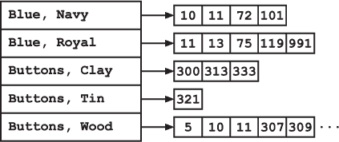
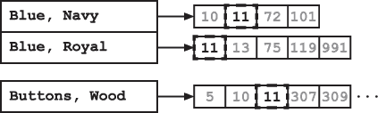
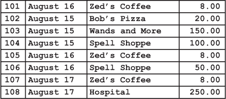

## —16—

倒排索引：搜索变得更加精确

第二天早晨，随着铃声的轻响，弗兰克来到了位于首都中心的“斗篷与更多”商店。商店里几乎每一寸地方都被密密麻麻的斗篷架占据着。弗兰克穿过架子之间狭窄的缝隙，朝后方的柜台走去。

一位小个子秃顶男人透过厚厚的眼镜抬起头。“欢迎光临‘斗篷与更多’，我是吉尔伯特·克洛克斯沃斯。今天我能为您提供什么帮助？”

他上下打量了弗兰克一番。眼睛不断地扫向弗兰克那件破旧的风衣，当他注意到肩膀处的一个补丁时，店主不禁打了个寒战。

“我看你是打算买一件新斗篷了，”他带着那种世界各地高傲店主都擅长的虚假热情说道，“你来对地方了。我们刚收到了一批极好的森林绿旅行斗篷。”

“我在找信息，”弗兰克说道。他从 ArrayCart 中拿出线头，递给店主。“我需要知道这些线头来自哪件斗篷。”

克洛克斯沃斯没有动。“不是新斗篷吗？”

“只是一些信息。”

“真可惜，”克洛克斯沃斯冷冷地说，“但我猜您还是来对地方了。我是这座城市斗篷方面的顶级专家。”店主接过那根线头，仔细观察了一会儿。然后他从柜台下拿出一只大放大镜，仔细地检查了它们。

“黑色和橙色交织的十字形针脚，”克洛克斯沃斯嘀咕道，“质量还算可以。当然，比不上我的标准，但也算合理。”

“你能告诉我其他信息吗？”弗兰克继续问道，“也许有什么有用的？”

店主皱了皱眉，但继续研究着线头。“有烧焦痕迹，”他终于说道。

“是被火烧过吗？”弗兰克问道。

“不。这太复杂了。我一生中只见过几次这种烧焦痕迹。总是在巫师的斗篷上。这个斗篷上施了魔法。”

“你知道是哪种类型吗？”弗兰克问道。

克洛克斯沃斯摇了摇头。“你应该去问问巫师。我是本地区斗篷方面的顶级专家，不是魔法。”

“那颜色怎么样？”弗兰克问道，“我没见过多少斗篷是这种颜色的。你能告诉我它可能来自哪里吗？”

克洛克斯沃斯微笑道：“当然可以。我是王国斗篷方面的顶级专家。”

他转过身，从书架上抽出一本巨大的书，重重地放到柜台上。然后翻到了最后一页。

“你在做什么？”弗兰克问道。

“正在查阅《斗篷与纹章登记册，第五卷》中的这些颜色，”商店老板回答道，“你不是想知道它们来自哪里吗？”

“但是你为什么在读书的后面？”弗兰克说道，“你不应该从目录开始吗？”

克洛克斯沃思终于露出了真诚的微笑。“过去几年，在纹章学追踪方面有了巨大的进展！”他惊叹道，“传统上，我们正如你所建议的那样：扫描目录以寻找感兴趣的主题，然后翻到正确的页面——当然，使用的是二分查找。”

“确实，目录提供了对书本主题的索引。但是，目录的组织方式对于这种类型的搜索完全不合适。它按主题出现的顺序列出内容。如果你想知道接下来是什么，这种顺序很合适，但如果你正在寻找一个非常具体的主题就不行了。王国现在有超过 10,000 种披风样式！光是搜索目录就可能需要很长时间。”

“所以，阿曼达·克洛金顿，《披风与纹章登记册》的作者，也是我的个人英雄，发明了倒排索引。她追踪了重要的术语，比如披风的颜色，并将它们编入书的后面——几乎就像是第二个目录。”

“那有什么帮助呢？”弗兰克问，“她只是在重复目录里的信息。”

“是的。她重复了信息，但用了不同的顺序。她按术语的顺序组织了书后面的索引。然后，对于每个术语，她列出了它出现的页面。”

弗兰克盯着他，等待着。但店主似乎已经讲完了。“那么？”弗兰克促使道。

“你只需要查找你想要的术语，索引会引导你到相应的页面！”他惊呼道，“再也不用在目录中翻来翻去了。你的搜索就变成了查找。”

“但是你还是需要查找索引来找到正确的术语，对吧？”弗兰克问道。

“嗯，是的。但是，由于索引是按术语的字母顺序排序的，你可以直接使用二分查找。”

“如果某个条目出现在很多页面上呢？”

“你需要检查所有的。”克洛克斯沃思承认道。

“如果你要查找几个术语呢？”弗兰克问道，“比如三种不同颜色的线？”

“啊！这才是有趣的地方，”克洛克斯沃思说道，“你只需要检查它们共同的页面。你可以通过*交集*页面号的集合来找到这些页面。这意味着需要逐一浏览列表，找出在*每一个*列表中都出现的元素。如果你有足够的术语，通常可以将它们所在的页面缩小到只有一两页。”

“前几天我不得不查找一件海军蓝和皇家蓝的披风，带有木质扣子。我可以告诉你，这样的披风在世界上不多。事实上，只有一个群体使用这种组合——业余气象预报员协会。直到去年，他们还在使用海军蓝和深绿色，但是他们被迫更换了颜色。半专业气象预报员协会合理地声称，这些颜色与他们的海军蓝和浅绿色太相似了。”

弗兰克思索了一下，点了点头。“有趣的想法，”他表示认可。他立刻看到了如何将这种倒排索引应用于其他信息源。警察记录总是按日期排序。使用这种新技术，你还可以按犯罪类型或地点对其进行索引。这些索引可以使研究效率提高数倍。

“我想知道它是否会被其他书籍采用，”弗兰克沉思道。

“不太可能，”店主嗤笑道。“这个世界上很少有话题复杂到需要索引的程度。不是每个话题都像风衣学那样丰富。”

他说着，店主翻阅着索引，迅速翻动着书本。“警察风衣，”他最后说。“布尔和函数尼亚的部门使用这些颜色。首都警察局的几个部门也使用这些颜色。会计、薪资、记录和咨询标识部门，我记得是这些。设计当然各不相同。我猜这件风衣是新款，考虑到线头的状态。警察往往穿坏风衣，尤其是在咨询标识部门。”

“一件新的警察风衣？”弗兰克确认道。

“很可能吧，”克洛克斯沃斯说道。“我怀疑它是定制设计的。那些颜色 20 年前很流行，但随着浅色调的兴起，它们渐渐失宠了。真的很可惜——那时候有些风衣真是美丽极了。我曾经做过一件骑行风衣，有双重扣带——”

弗兰克打断了他，“你能告诉我关于这些线头的更多信息吗？”

店主看着他说：“除了它们可能来自四个部门中的新警察风衣，而且上面施了魔法咒语之外？”

弗兰克等待着。

“呃……不，”克洛克斯沃斯最终说道。“就这些。”

弗兰克点了点头。“谢谢，”他说。他捡起线头，转身准备离开。门一开，他听到一声轻微的倒吸气声，知道店主已经看到他风衣下摆的破损边缘。

**警察算法 101：倒排索引**

***德雷克教授讲座摘录***

倒排索引是一种计算数据结构，类似于书籍的索引。它提供了一种从目标值到数据中该值出现位置的映射。倒排索引特别有用，当一个特定的值在数据中多次出现或可能出现时。

考虑我们在二分查找讲座中的一个例子——检查会计账簿中与特定商家的交易。账簿按交易号递增排序，表示交易记录的顺序。

虽然这种排序可以帮助我们高效地找到某个交易 ID 的相关信息，但它并不能帮助我们追踪交易到特定的商家。一种选择是按商家名称重新排序条目。然而，这需要我们复制整个账簿，这可能是很昂贵的。

相反，我们可以构建一个额外的数据结构：一个倒排索引，以商户名称为键。对于每个商户，我们只需存储所有相关交易 ID 的列表。由于我们已经知道如何高效地查找任何给定 ID 的交易，现在我们可以通过在索引中进行额外的查找，从商户名称获取交易信息。

倒排索引是一个很好的例子，展示了运行时间与内存使用之间常见的权衡。一个算法可以通过增加内存使用（例如新增一个索引），来换取在新维度上显著更高效的搜索。
