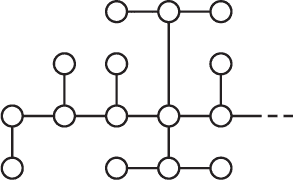
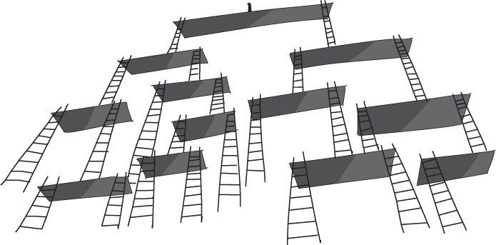
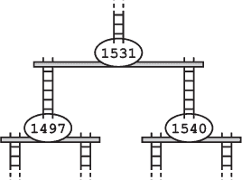
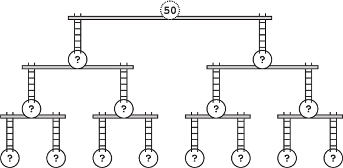
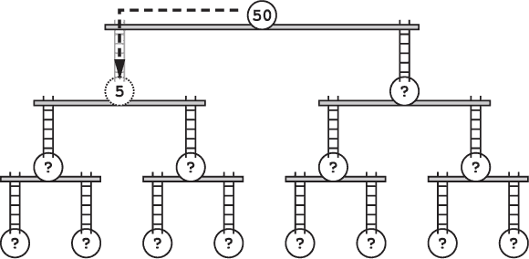
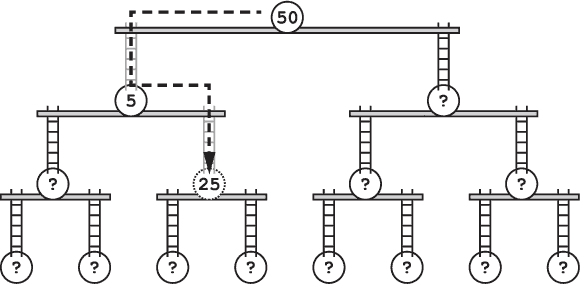
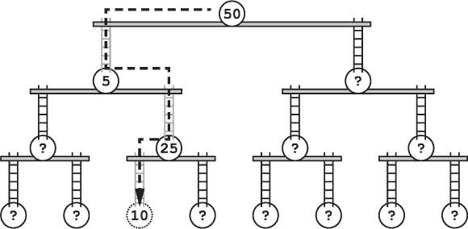
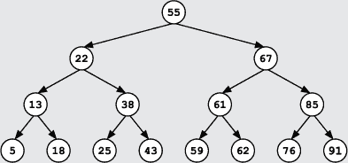
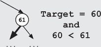
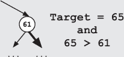

## —17—

一个二叉搜索树陷阱

离 Cloaks and More 不到一个街区的地方，弗兰克发现有个女人在跟踪他。尽管心中涌上了烦躁，他不得不承认她的确很厉害。她始终保持在街道另一侧，保持至少 30 英尺的距离。她更多的时候是依靠商店窗户的反射来观察他。而且她穿了一件毫无特色的旅行斗篷——一种森林绿的颜色，街上的一半人都穿着类似的颜色。

弗兰克突然停下，单膝跪地，假装在系鞋带。这是识别尾随者的第二老方法，第一种是疯狂地朝一个随机方向冲去，看看谁跟着。尽管可以说这种假装系鞋带的方式比疯跑略显低效，但它的好处在于隐蔽，最重要的是，不需要奔跑。

尾随者继续向前走，停在约 10 英尺远的地方，停下来通过一面特别光亮的商店窗户仔细观察一堆卷心菜。

弗兰克站起身，开始朝另一个方向走。走了半个街区后，他穿过街道到她那一侧，忽视了马车司机愤怒的喊声，进入了一条小巷。一旦离开了主街，他转身停下了脚步，等待着。

尾随者几乎撞上了他，她匆忙绕过拐角。

“嗨，”弗兰克说道，“你为什么跟着我？”他尽力让自己的语气听起来像是在闲聊，冷淡自然——即使在正常情况下他也做不到这一点。结果最多也不过是低吼，但他成功避免了大喊大叫。

职业间谍通常会花费相当多的时间来计划如果被发现时该如何反应。他们为各种情况制定复杂的背景故事，解释从跟踪某人到在皇宫里被发现并携带窃听设备和假海龟的所有情节。他们梦想着平稳的收场和轻松的谎言。然而，现实中很少如此顺利，惊讶的喘息反而是相当常见的。在这个案例中，弗兰克甚至曾希望能抓住一瞬间的恐慌来加以利用。

然而，正如预料的那样，尾随者依然保持专业。没有慌乱，也没有惊讶的喘息声。唯一表明出了问题的迹象是她眼中一闪而过的愤怒，紧接着她丢下一颗烟雾弹，消失在空气中。

即使没有烟雾弹，间谍也足够快，弗兰克根本追不上。等他伸手去抓她时，他已经听到她的脚步声在街道上回响。他咒骂一声，扑进烟雾中追了上去。

半个街区之内，弗兰克已决定接受另一次深度优先搜索。他追赶过足够多的小偷，知道情况会如何发展。间谍很可能很快会离开主路，试图消失在人群中。这个策略在大多数情况下并不差，但在这里行不通。这个城市的这一部分几乎没有旁道，而且大多数都是死胡同。

当他奔跑时，他将街道想象成一个图，交叉口和死胡同是节点，他需要在这些地方做出决定，街道之间的路则是图的边——将他从一个决策点带到另一个的路径。

经过快速计算，他认为自己有时间探索五六条小街道，直到落得太远，线索消失。 不幸的是，这就是用深度优先搜索追踪时的风险之一。

前两条街道证明是浪费时间。他所能发现的最接近犯罪活动的，是一群孩子在墙上涂鸦。 他们用一根烧焦的木棍写下了“团队递归”和“递归 4eva”。 他继续搜寻。

几次碰壁之后，弗兰克正在考虑放弃，这时他发现了泥地上一个通往开放排水井盖的脚印。 他靠在墙上，喘了口气。这一定是她的逃生路线。

弗兰克窥视着黑暗的洞口，但什么也看不见。 他把自己放进排水井盖，落在一个木平台上。 他低下身，尽可能地让自己变小，扫描着黑暗的房间。 平台固定在一面粗糙的石墙上，俯瞰着一个至少 50 英尺深的宽阔房间。 唯一的光线从上方的开口射入，像一个巨大的聚光灯照亮远处的地面。 当他观察时，那个间谍快速穿过了光圈，朝着对面墙跑去。 现在她已经远远领先于他。

弗兰克打量着周围的选择。 他脚下有其他平台，相隔约 20 英尺，通过铁梯相连。 当他注意到地板上嵌着一个小铜牌时，他气愤地咒骂了一声。 他站在一座二叉搜索梯子的顶部。

二叉搜索梯子最初由一个古怪的艺术画廊老板阿莱娜·布兰奇设计，用来组织画作。 它们实际上是巨大的二叉搜索树——一种旨在实现高效搜索的数据结构。 该结构像一个倒置的大树，顶部有一个单一平台，技术上称为*根节点*。 每个平台下面最多有两条梯子，分别通向不同的*子节点*——一个位于下一层的另一个平台。 整个结构逐渐分支，提供了多条路径。

对细节狂热的阿莱娜最初使用这一结构来按画作中描绘的草叶数量来组织画作。她实施了一种简单的组织方案：站在任何平台上，你可以保证所有位于左侧梯子下方（在左*子树*中的画作）都比当前平台的画作含有更少的草叶。而所有位于右侧梯子下方（在右*子树*中的画作）则含有更多的草叶。从顶部开始，你甚至可以选择向下的路径，以便找到一幅具有特定草叶数量的画作。

不幸的是，这种二叉搜索梯子在艺术界并未真正流行起来，原因既在于它们的过于庞大，又在于需要不断攀爬，但它们很快被犯罪世界所采纳并改编。二叉搜索梯子陷阱，阿莱娜创作的这一危险实现，是由年轻巫师卡蒂娅·拉德费尔（Katia Ladderfell）在为维内提家族工作时开发的。与画作不同，卡蒂娅在每个平台上放置了一个单一的数字标签，并创建了一个数字密码，允许安全通过这棵树。在设计这棵树并放置标签时，她保持了二叉搜索树的特性——任何节点的左子树中的值总是小于节点本身的值，右子树中的值总是大于节点本身的值。通过这棵新型的武器化二叉搜索树，只有一条路径是安全的，那就是通向最底层节点密码值的路径。如果你知道密码，就可以像执行该值的搜索一样下降树。每一层，你可以将密码的值与当前平台上的值进行比较，然后选择左侧或右侧梯子。因此，维内提家族的打手们只需要记住一个密码，而不需要记住一系列的梯子选择。考虑到这个组织成员的素质，这种简单性至关重要。

如果你不知道密码并选择了错误的梯子，你会触发有时致命、有时只是情感上令人创伤的陷阱。典型的危险包括被诅咒的梯子、有毒的蜘蛛、落石、飞镖枪、摆动的刀片，以及在某些情况下的魔法侮辱——入侵者会因为五层逐渐恶化的侮辱性言辞而感到沮丧，这些言辞针对的是他们的外貌、气味或智力水平。

上一次弗兰克面对维内提家族的二叉搜索梯子时，一个告密者给了他密码——数字 10。这个数字让弗兰克能够悄悄进入藏匿处，出其不意地抓住了三名维内提成员。只有丽贝卡逃脱了。

如果他知道这个陷阱的密码，他或许还有机会抓住那个间谍。

一连串的想法迅速在弗兰克的脑海中闪现。首先，为什么维内特家族的人不重用密码？他们的爪牙通常是些愚笨的人。弗兰克怀疑他们根本记不住几个数字。其次，现在几乎没有恶魔巫师了，所以这个二分查找梯子陷阱肯定是多年前建造的。在巫师 Exponentious 失败图谋推翻王国之后，次等的恶魔巫师们要么已经改邪归正，要么隐匿了起来。事实上，卡蒂亚·拉德菲尔自己已经逃离小镇去开设椰子农场了。最后，弗兰克所在的位置非常高，他的膝盖开始感到虚弱。

弗兰克瞥了一眼他站立的根节点平台上的标签：50。如果他没错，而且维内特家族确实重用了密码，那么他需要沿梯子往下查找 10。由于 10 小于 50，他需要走下左侧子树。

一边低声咒骂，弗兰克朝左边的梯子走去并开始下行。整个过程令人满意地毫无波折。没有蜘蛛。没有摆动的刀片。甚至没有一句侮辱。

在下一个平台上，弗兰克发现了一个标签，标记为 5。由于 10 大于 5，他知道这次应该走右边的路径。他跑向右侧的梯子，信心越来越足。相信他人的无能往往是有回报的。

下一个平台位于地面上方一层，约 20 英尺的高度。弗兰克注意到标签上写着 25，便立即转向左侧。

他下到一半时才意识到有什么不对劲。他听到一声轻微的尖叫声，左脚上方的梯级开始移动。他低头看去，恰好看到梯级撞到下面的横杆，导致他的左脚被梯级夹住。他惊叫了一声。当他观察时，梯级又滑上去，然后又滑了下来，给他的脚带来了一阵新的剧痛。梯子简直是在咬他。他甚至能感觉到金属齿条开始从每个梯级间突出来。

他在一瞬间做出了决定，迅速跳开，避开了梯子在他手指上咬下的一刻。他笨拙地落在了自己被咬过两次的脚上，踉跄了几步后才缓缓地跌坐在地上。

他转过身，怒视着梯子底部的标签。标签上清楚地写着 10。他走对了路。然后，他注意到附近地面上的一小段粉笔标记。上面写着“不要使用，密码已更改。”弗兰克立刻恢复了咒骂。

**警察算法 101：二分查找树**

***德雷克教授讲座摘录***

二叉搜索树是一种数据结构，它以类似于普通二叉搜索的方式组织数据。每个树节点存储一个值，并可以有最多两个子节点：左子节点和右子节点。树节点按照它们包含的值进行组织。左节点（以及所有其子节点）中的数据值将小于当前节点的值。类似地，右节点（以及所有其子节点）中的数据值将大于当前节点的值。

我们可以通过从最上层的节点开始向下遍历来高效地搜索二叉搜索树——这个节点也被称为*根节点*。在每一步中，我们通过比较当前节点的值与目标值，决定是探索左子树还是右子树。如果目标值小于当前值，则搜索会向左进行：

如果目标值大于当前值，则搜索会向右进行：

当目标值被找到或我们到达死胡同时，搜索结束。在后者情况下，我们可以断言目标值不在树中。

我们说，当二叉搜索树是完全平衡的时，每个节点的左子树和右子树中包含的节点数量相同。在这种情况下，每次我们大致将树中的节点数量加倍时，树的深度会增加一。

搜索的计算成本与目标值在树中的深度成正比。树越深，我们需要进行的比较就越多。
