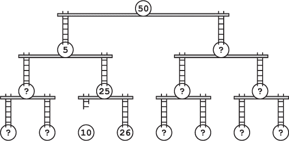
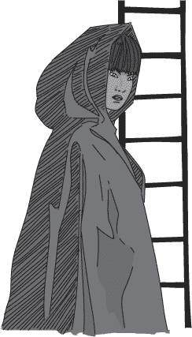
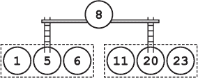
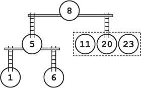
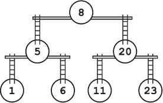
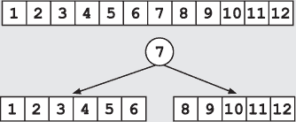
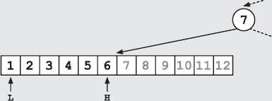

## —18—

构建二分查找梯子

“你难道不认为我们会更改密码吗，运行时先生？”一个声音从弗兰克身后传来。

弗兰克猛地转过头。间谍正悠闲地朝他走来，冷静而不慌不忙。弗兰克试图站起来，但他的左脚突然传来一阵剧痛，他只好屁股着地，绕着爬动，直到面对她。

“我没想到维内特家族居然有能力改变它，”弗兰克承认道，“如今很难找到邪恶的巫师了。我听说他们的上一个巫师现在在卖椰子。”

“确实困难，很多最优秀的邪恶巫师都逃走了，或者选择了中立的商业化位置。然而，找到帮助并非不可能。可以这么说，维内特家族已经达成了一个合适的安排。他们找到了一个愿意提供某些魔法帮助的巫师，以换取他们在其他领域的服务。”

她朝梯子挥了挥手。“坦白说，他在二分查找树陷阱上的才能不如卡蒂娅。她才是真正的艺术家。但他的作品也足够了。”

“信不信由你，你差点就下去了。你差了一个梯子。密码是 26\。显然我们不希望他更改太多梯子——只需要足够多来困住任何试图重用旧密码的人。真是差一点。”

弗兰克保持沉默，但当她没有继续下去时，他问道：“你是谁？”

“我的名字不重要。我为维内特家族工作。”

“间谍？”

她耸了耸肩。“我收集情报。随你怎么称呼。”

“你想对我做什么？”

“我们显然是想让你离开这里。”

弗兰克考虑着这件事的含义。要让他停下来，光靠咬伤的脚是不够的，而间谍肯定知道这一点。这意味着她计划要么杀了他，要么将他囚禁。尽管这两种选择都不让弗兰克感兴趣，但他总是更倾向于选择不涉及死亡的那一个。

仿佛能读懂他的想法，间谍回应道：“我原本希望二分查找梯子陷阱能完成任务，但没有。至少现在还没有。”她走到 26 号梯子旁边，抬手用掌心击打了一根梯级。一声沉闷的钟声充满了房间。接着，她又击打了两下。*钟*。*钟*。

“再见了，运行时先生，”她说道。说完，毫不回头地大步走出房间。

弗兰克困惑地看着她离去。突然，他眼角的余光吸引了他的注意。当他仔细观察时，三根梯级松动并掉落到地上。片刻之后，它们开始向他蠕动，轻轻发出嘶嘶声。蛇形梯级。

弗兰克迅速行动起来。蛇形梯级危险但很慢。如果他能到达 26 号梯子，他还有机会。他趴在地上爬行，依然不敢依赖那只脚。他用梯子拉自己站起来，身体沉重地靠在金属上。毫无疑问，这次爬升会非常疼痛。

蛇形梯级现在离他只有几步之遥了。

弗兰克烦躁地呻吟了一声，伸手开始爬梯子。与其说是爬，更像是跳跃；他必须用健康的脚跳起，拉自己上到下一个梯级。每次移动，他的左脚都剧烈地疼痛。

弗兰克爬上顶端，倒在 25 号平台上，仰躺着喘气，诅咒着二分搜索梯子。曾经他还觉得这些结构很美，甚至很优雅。他在警校时曾去过阿莱娜的几次展览，甚至参加过世界上唯一一次的二分搜索树行为艺术表演。

展览被命名为*抬起梨子*。阿莱娜雇佣了三位巫师，利用魔法实时抬起二分搜索梯子，将一系列画作按其中的梨子数量进行排列。那一年，梨子主题的静物画风靡一时，这一现象后来被归因于苹果作物的质量差。虽然不如次年对吐司雕塑的痴迷那般尴尬，但梨子热潮至今仍只在艺术史课程中提及，且常常是低声讨论，带着相应的厌恶表情。

七位助手，每人拿着一幅描绘梨子的粗糙画作，走进了画廊。他们按照从 1 到 23 个梨的顺序排列，画作挡在脸前，遮掩着他们因这荒谬景象而感到的羞耻。

第一位巫师走了出来。他数了数画作，找到了中间的元素。这幅画描绘了八个梨和一杯牛奶，摆在一张木桌上。

“树根上升，”巫师大喊道。画作的排列立即分成了三组。左侧是少于八个梨的画作；右侧是多于八个梨的画作。而在它们上方，是二分搜索树的新根节点。他已经做出了第一分支。

随后，另外两位巫师递归地将画作分成左右两部分。这个过程总是一样的。巫师选择中间的元素，并根据这个元素将画作分开。在他们工作时，树形结构从根节点向上升起，下面则是分支。

当时，这个展示看起来令人惊叹。现在，坐在这个武器化的数据结构上，弗兰克觉得整个概念相当愚蠢。他不禁想，自己当时是怎么觉得递归分割画作很美的。

嘶嘶的声音把弗兰克拉回了现实。蛇形铃铛的末端探出平台，四处旋转，寻找弗兰克。鉴于它只是一个活动的金属物件，弗兰克不太确定这蛇形铃铛是如何搜索的。它没有眼睛、鼻子或嘴巴，也许是通过震动来感应的。

他考虑踢掉那根蛇形梯子，但最终决定不这么做。蛇形梯子不知为何有毒，尽管它们没有嘴巴。

相反，弗兰克决定继续撤退。他挪动到向上的梯子旁，将自己拉到站立的位置。他脚踝的疼痛已经减轻，下一次的攀爬更像是一个传统的梯子体验，而不是疯狂的跳跃动作。

弗兰克直接向上爬上了下一层，回到了那个刻有 50 的小铜牌的根节点平台。

他停下来低声咒骂了一下二分查找梯子。他现在看来，这些梯子简直是愚蠢的装置。尽管没有任何实际的理由，弗兰克仍然对自己的评估充满信心。满意地点了点头，他把自己拉回到街道上，远离了那条蛇形的梯子。

**警察算法 101：二分查找树**

***德雷克教授讲座摘录***

你可以通过递归地将已排序的数组元素分割成更小的子集来创建二分查找树。在每一层，选择中间值作为该层的节点。如果元素数量为偶数，你可以选择中间的两个元素中的任意一个。

一旦根节点被创建，左子集和右子集将独立地以相同的方式进行拆分。从概念上讲，我们将已排序的数组拆分为左右数组，并在每个数组上应用相同的算法。

注意，在构建过程中，实际上并不需要拆分或复制数组。算法可以通过简单地跟踪当前分支中最低和最高值的索引，使用一个单一的数组。

