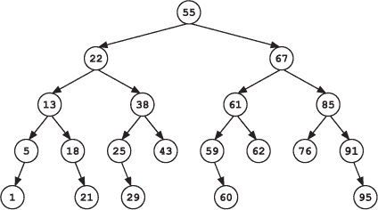
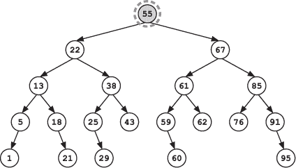
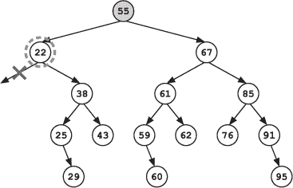
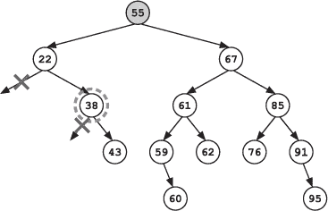
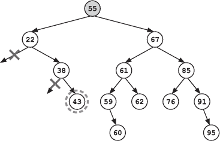
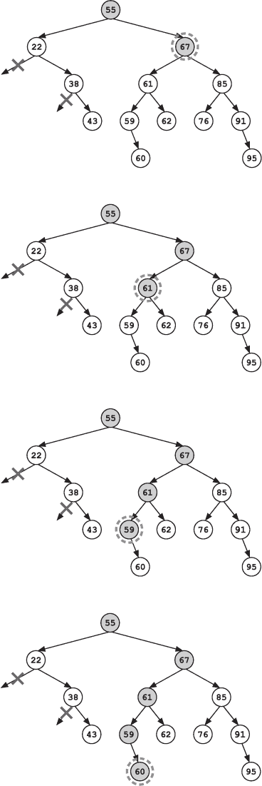
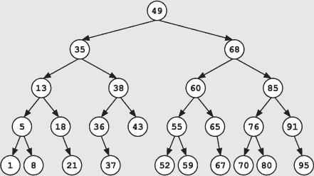
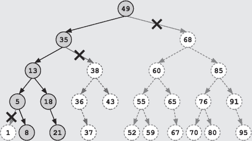
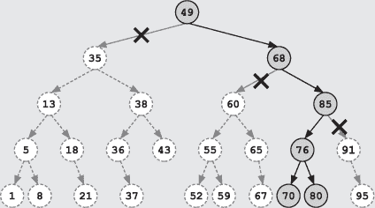

## 第十九章：—19—

《可疑者的二叉搜索树》

Frank 一瘸一拐地回到办公室，看到 Socks 在等着。他发现年轻的巫师坐在 Frank 的椅子上，懒散地转着椅子。Frank 怒视着他，直到 Socks 意识到自己的错误。他低声道了个歉，跳下了椅子。

“你找到什么了吗？”Frank 问道。

Socks 耸了耸肩。“没什么有用的。”

“没有吗？”Frank 催促道。

“没有一个巫师听说过任何新的联盟，”Socks 快速补充道。“上一个成立的巫师联盟是‘魔法糖果商联盟’，他们是在去年为了解决劣质薄荷糖的涌入而成立的。你还记得那些餐厅提供的粗糙薄荷糖吗？最开始它们尝起来像薄荷，但过了几分钟后，嘴里却留下了松针的后味，持续六个小时。就像是在开玩笑。‘魔法糖果商联盟’解决了薄荷糖问题，接着又拓展到了巧克力和太妃糖。现在联盟里有六家糖果店和四辆小推车——”

“没有其他的吗？”Frank 打断道。

Socks 摇了摇头。“我还问了俱乐部和协会的事情，”他提供道，“唯一的新情况是‘巴贝奇维尔巫师保龄球协会’，不过他们只存在了不到一个月。显然，巴贝奇维尔的巫师没几个喜欢打保龄球的。”

Frank 叹了口气。他并没有指望从 Socks 的调查中得到什么好消息，但完全没有进展还是让他感到失望。

“那你呢？”Socks 问道。

“是的，”Frank 回答，“我有了一个新线索。”

“真的吗？那是什么？”

就在 Frank 准备回答时，Notation 警官大声砸门进来，手里抱着一大摞书。她走到 Frank 的桌前，把书堆放下去。桌子在重压下下沉了。

“过去一年的所有转账和分配账目，”她气喘吁吁地说，“现在，你能告诉我为什么我要把这些带来吗？”

“我们需要找到一个转账，”Frank 说道。

“我猜到了，”Notation 说，“不过如果你告诉我是哪一笔转账，我可以直接查出来。”

“我不知道是哪一笔转账，”Frank 解释道。这有一半是真的。即使他知道，他还是会要求 Notation 带来所有记录。他需要在搜索过程中在场，确保没有遗漏任何人。

“好，”Notation 说，“我们在找什么？”

“我们从 50 到 70 天前的任何可疑转账开始，”Frank 说。那些大约是监狱账本中被撕掉的页面的日期。“这是一个范围搜索。我们想找到所有在这一时间段内的转账。”

Notation 呻吟道。“这些请求是按照申请警官的原始位置排序的，然后按警官名字排序。它们没有按请求日期索引。我们必须逐个检查所有请求，得花好几个小时。”

“不会的，”Frank 向她保证，“因为我们会用魔法。”

Socks 惊讶地抬起头。“魔法？”他问，“我不知道什么是范围搜索法术。”

“你知道二叉搜索树，”Frank 回答。

“我是二叉搜索树的专家，”Socks 同意道，“但我不明白这有什么帮助。”

“我们可以构建一个转账请求的二叉搜索树，每个节点的值等于转账发生的时间（从现在算起）。然后我们可以在树上进行范围查询。”

“在树上做范围查询？”Socks 问道。

“为什么要使用树？”Notation 问道。“如果我们只是做一次查询，建树的时间可能比扫描数据还要长。”

Frank 耸了耸肩。“我猜最终我们会进行不止一次搜索。如果 Socks 用魔法构建了这棵树，我们可以多次搜索它。”

“但我不知道怎么做范围查询，”Socks 抗议道。

“把树建起来，我就给你看看。”

“好的，”Socks 说。“这需要一点时间；我只习惯于操作按钮，真正的物理按钮。我以前从未需要组织事实。事实看起来好像会很不稳定。我需要修改这个咒语。”

当 Socks 弯腰伏在 Frank 的桌子上，在一张羊皮纸上写下修改后的咒语时，Notation 面对面地向 Frank 询问。“发生了什么？”她问道。

“没什么，”Frank 说道。

“哦，别装了，”Notation 厉声道。“从监狱出来之后，你一直隐瞒着什么东西。为什么我们要看转账请求？你怎么之前从没提到过它们？你发现了什么？”

“就像我说的，这是个直觉。”

“我不信。你一定瞒着我什么。”

Frank 没有回答。

“明白了，”Socks 喊道。“至少我想是的。我们马上就知道了。”

Socks 转向那堆账本，开始低声念起咒语。他夸张地挥舞着手臂，完全没有必要地在纸上挥舞。随着一道闪光，一棵巨大的二叉搜索树出现在空中，树中的每个节点代表着自那次转账日期以来的天数。节点悬浮在空中，通过电蓝色的线条连接。

“现在我们进行范围查询，”Frank 说道。

“我告诉过你，我不——”Socks 开始说，但 Frank 挥了挥手示意他停止。

“我们将使用修改版的深度优先搜索，”Frank 解释道。“从最上面的节点开始，根节点，沿着树向下探索。”

“怎么探索？”Socks 问道。

“在每个节点，您需要遵循三个步骤。首先，检查节点本身是否落在范围内。如果是，比如说这里的 55 天，那么我们会将其保存到结果列表中。否则，我们忽略它。”

“等一下，”Socks 说。“我会让我们列表中的节点发出不同的颜色光。深绿色怎么样？”

“当然，随便，”Frank 回答道。“在检查当前节点之后，我们检查是否需要探索任何一个子节点。只有当它们可能包含在正确范围内的节点时，我们才会递归地探索左子树和右子树。”

“递归探索？”Socks 问道。

Frank 等待 Notation 插入她的正式定义，但她坚持沉默。Frank 叹了口气，解释道，“*递归*意味着我们将相同的算法应用于子问题。在这种情况下，我们对每个子节点应用相同的搜索方式。我们对它们的处理方式和根节点一样。”

“只需检查是否需要探索子节点，如果需要，按照相同的步骤进行。我们会用一个简单的测试，将*当前*节点的值与我们的范围进行比较。如果当前节点的值*小于*范围的*下限*，那么我们知道左子树中的所有内容都会低于我们的范围，因此可以跳过左子树。反之，如果当前节点的值*大于*范围的*下限*，我们就需要继续在左子节点上进行搜索。”

“右子树也适用相同的逻辑。如果当前节点的值*大于*我们范围的*上限*，那么我们可以跳过右子树。否则，我们会继续在右子节点上进行搜索。”

“在这种情况下，我们的范围是 50 到 70，而左子节点的值最多可以到 55，那个子树中的节点可能会落在我们的范围内，所以我们需要探索左子节点。右子节点的值可以超过 55，这也与我们的范围重叠，因此我们也需要探索右子节点。从左子节点开始。”

“现在我们有 22 天的时间，”Frank 继续说道，“我们不会把它列入我们的列表。因为左子树中的所有内容都必须小于 22，所以我们也不需要沿着这条路径继续探索。”

“我们称这为*修剪*探索，”Notation 补充道。“因为它就像是剪掉树枝。”

当 Frank 转过头看时，她皱起了眉头，意识到自己并不是在和他交谈，便沉默了下来。

“所以我们只探索右子节点，”Frank 说道。

“递归地！”Socks 高兴地补充道。

“是的，递归地，”Frank 干巴巴地同意道。“现在我们得到 38。它不会被加入到列表中，我们可以跳过左分支。”

“但是我们需要递归地探索右分支，”Socks 说道，他完全享受着这个新算法。

Frank 点了点头。

下一个节点没有子节点。这是一个死胡同。

“接下来怎么办？”Socks 问道。

“和深度优先搜索中的情况一样，”Frank 说道，“我们回溯并探索未被探索的路径，直到我们搜索完整个树。在这个案例中，我们已经修剪了很多路径，所以我们需要回溯到根节点。”

搜索继续沿着根节点的右子树进行。新的匹配项被添加到结果列表中，不兼容的路径被修剪，兼容的路径则递归地进行探索。

到最后，他们已经确定了几个符合目标范围的传输。Frank 专心研究着列表，寻找任何可疑的内容。

“什么都没有，”他不敢相信地低声咆哮。“这里什么都没有。”

**警察算法 101：二叉搜索树**

***来自 Drecker 教授讲座的摘录***

在二叉搜索树上的范围搜索算法类似于搜索单一值。算法从顶节点开始，递归地向下探索树。在每个节点上，它根据三个问题做出决策：

1.  **这个节点应该被添加到结果中吗？** 当前值应该被添加到结果中，**前提是**它在范围内。

1.  **应该探索左子树吗？** 如果当前节点有左子节点且当前节点的值*大于*范围内的最小值，算法应该递归地探索左子树。在这种情况下，左子树中*可能*有一个节点在范围内。

1.  **应该探索右子树吗？** 如果当前节点有右子节点且当前节点的值*小于*范围内的最大值，算法应该递归地探索右子树。在这种情况下，右子树中*可能*有一个节点在范围内。

使用二叉搜索树进行范围搜索的优势在于，通过剪枝大量的搜索空间，你可能能够节省计算量。

考虑以下二叉树：

如果你正在搜索范围 [8, 20] 内的所有值，你只需要访问并评估 25 个节点中的 7 个节点（已访问的节点用阴影标出）：

类似地，如果你在搜索范围 [70, 80] 内的值，你只需要访问并评估 25 个节点中的 6 个节点：

需要注意的是，访问一个节点并不一定意味着它会出现在结果列表中。两个示例搜索仍然需要访问范围外的节点，因为这些节点的子树可能包含范围内的值。

与单一值搜索一样，只有在你进行多个搜索时，使用二叉搜索树进行范围搜索才高效。构建二叉搜索树的成本比进行线性扫描数据更高。然而，构建树的成本可以在多次搜索中分摊，从而降低每次搜索的平均成本。
