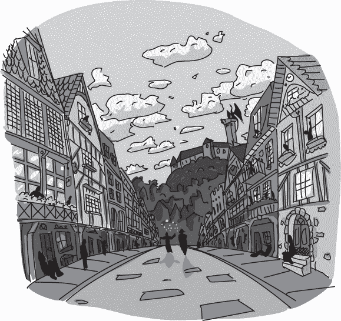
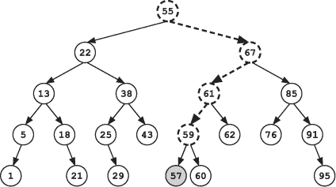
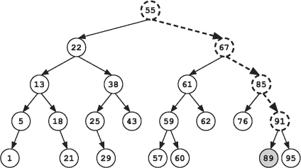
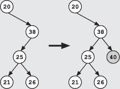
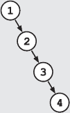

## 第二十章：—20—

向搜索树中添加嫌疑人

弗兰克再看了几分钟转账列表，但并未发现任何可疑之处。最近的转账目的地甚至离首都都远得很，而大多数盗窃案件发生在首都。最近的一次转账是去东斯特维尔市——50 英里远——年轻官员队长列出的“转账原因”是“持续的脚臭。”

“就这些人吗？”弗兰克问，转向标注。

“是的，”标注 defensively 地说。“这是过去一年中所有在不同站点之间调动的官员。”

弗兰克皱了皱眉。那个定义在他听来不对，感觉不完整。“那初步转账怎么办？”弗兰克问。

“是学院的人吗？”标注问。

“是的，”弗兰克说，“那学院的调动呢？”

“嗯，”标注说，“这些是试用期的初步转账，会在不同的账簿中记录。”

弗兰克缓缓点了点头，脑海中飞快地思考着。

“我可以去拿——”标注开始说。

“不需要，”弗兰克打断道。“我答应了队长今天下午会更新情况，到时候我可以拿到账簿。”

“你要去见队长？”标注惊讶地问。

“更新客户情况是私家侦探生活的一部分，”弗兰克说。

“你还可以告诉队长关于格雷琴的理论，”索克斯补充道。

“什么理论？”标注问，眼睛在弗兰克和索克斯之间转来转去。

“弗兰克没告诉你吗？”索克斯问。

“没有，”标注咬牙切齿地说，“他没有。”她的双手紧握成拳，放在身侧，但她的脸上明显写着她更想用其中一个拳头打弗兰克的鼻子。

“我的导师格雷琴认为明晚城堡会遭到袭击，”索克斯说。

“她真这么认为？”标注问道。然后她转向弗兰克，补充道，“那似乎是个有用的信息，为什么你没告诉我？”

“这只是推测，”弗兰克耸耸肩回答，但他避开了她的目光。

“我应该和你一起去见队长，”标注说。

弗兰克愣住了，他没想到会这样。除非能以“好消息！”或“你猜不到我们发现了什么！”来开场，否则人们通常都很害怕向多诺万队长报告进展。带着一个包含无果结局、未探索线索和危及生命的情况的更新去见他，简直是自找麻烦，必定会迎来一番响亮而色彩斑斓的训斥。如果他自己不需要信息，他根本不会考虑去见队长。

“我需要你跟进别的事情，”弗兰克在短短的停顿后说。“平行搜索，记得吗？”他伸手进兜里摸了摸，但只摸到笔记本、几个食品包装袋和一个空的老蜗牛壳。那只壳是他上次案件的纪念品，一个涉及打击乐队和众多噪音投诉的棘手案件。他把它从口袋里拿了出来。

“看看你能不能查到什么关于这个的线索，”他说。

“一个壳？”标注问，“这和案件有什么关系？”

“我不知道，”弗兰克支吾道，“但是玻璃盒比利或许知道。”

不情愿地，Notation 拿起了贝壳，仔细研究了起来。她翻转着贝壳，低声嘀咕：“为什么偏偏是比利？他总是找不到。”

弗兰克转向袜子，只见他盯着贝壳，神情极为困惑。“你能在我们去警局的路上保持二叉搜索树吗？”

“嗯，当然，”袜子说道，“不过直接建一个新的会更简单。”

弗兰克摇了摇头。“我们需要这些账簿才能做到这一点，而我可不想把它们拖到城市另一头去，它们看起来很沉。”

这个时候，Notation 中断了对贝壳的检查，投给他一个不友好的眼神。

_____________________

五十七分钟后，弗兰克和袜子站在警察记录办公室外面。通常这段路程不到 20 分钟，但他们因为袜子前面漂浮的大型发光二叉搜索树而显著变慢。它不仅阻挡了袜子的视线，导致他摔了好几次，还引起了不少路人驻足观看并问个不停，直到弗兰克大喊：“让开！这里有危险的不稳定魔法”，这才得以平静下来。这个警告效果相当不错。

“你不需要和队长说话吗？”袜子问道。

“首先我们找到我们的转移，”弗兰克说。他从不喜欢空手去见客户。

每个警察学院的班级大约培养 20 名新警员，每个警员会被分配到王国的某个警局。因此，过去 10 个班级的初始分配账簿至少有 10 磅重。与其他转移账簿一样，它是按姓名排序的，而不是按日期排序的。

“看起来我们有几百个转移要加到树上，”弗兰克一边说，一边在文件共享室找了个空桌子。由于安保需求和大量文件工作的标准组合，没人被允许在记录库内工作。相反，所有警察局都会有一个或多个紧挨记录室的工作间，里面除了长木桌和个人学习隔间外什么都没有。

“我们不能随便加节点！”袜子大叫道。

“当然可以，”弗兰克说，“向二叉搜索树添加节点很简单。从顶部开始，向下搜索，像是在寻找元素一样，当你遇到死路时，就把新条目加到那个节点下。”

“看这个第一次转移，57 天前。我们从顶部开始。因为 57 大于根节点的值 55，我们往右走。然后我们往左走，因为 57 小于 67。接着我们再往左走，因为 57 小于 61。最后，比较 57 和 59，我们应该继续往左子节点走，但由于没有左子节点，我们无法继续。所以我们将新节点添加为 59 的左子节点。”

袜子看起来十分惊恐。

“看这里，”弗兰克说道，“我再给你演示一次。这次转账发生在 89 天前。我们先往右走，然后再往右走，再走一次右。接着，我们将它作为 91 的左孩子，因为 89 小于 91。”

“这不是我想表达的意思，”袜子坚持道。“如果树失衡了怎么办？”

“这可能会发生，”弗兰克承认道。“当你向二叉搜索树中添加元素时，结果可能会导致树失衡。不过，我们的搜索算法仍然可以正常工作。”

“但是，在失衡的树上，搜索可能会低效，”袜子反对道。

“的确是这样，”弗兰克承认道。

向树中添加节点可能会抵消平衡二叉搜索树的一个主要优势：它使得许多算法变得高效。每当你大约将平衡二叉搜索树中的节点数量加倍时，你只需要增加一个级别。这意味着，对于简单的搜索任务，比如查找一个元素，你可以加倍数据量，同时只增加一步搜索的操作。然而，袜子是对的：这种高效性只适用于树是平衡的情况。在最坏的情况下，树会形成一条长链，你必须沿着它搜索。而当你插入任意值时，无法保证树会保持平衡。

“我们必须冒这个险，”弗兰克终于宣告道。

“可是——”

“如果我们的搜索效率没有达到最佳，我可以接受这个。我愿意为此付出一点代价，而不用带着其他那些书来从头开始构建树。它们看起来很重。”

**警察算法 101：二叉搜索树**

***德雷克教授讲座摘录***

向二叉搜索树中添加节点类似于查找目标值。我们从树的根节点开始，像是查找插入的值一样向下移动。我们根据插入值是小于还是大于当前节点的值来决定是往左走还是往右走。直到我们到达一个死胡同：一个在正确方向上没有子节点的节点。此时，我们可以创建一个新节点，并将其作为（左或右）孩子。

插入单个元素的成本与树的深度呈线性关系。然而，我们无法保证树在插入新节点时会保持平衡。事实上，树很容易因为插入顺序的不同而变得失衡，出现深分支。例如，如果我们按排序顺序插入数字，所有的插入都会沿着同一条分支下去。

