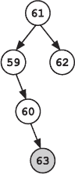

## 第二十一章：—21—

二叉搜索树的特性

“等一下，”弗兰克说道，“这不对。”

袜子刚插入完一个节点，惊讶地抬起头。“什么？”

“你刚刚插入的节点，”弗兰克说道，“它的位置错了。”

袜子盯着树看。“但是 63 大于 60，所以它应该放在右子树里。”

“但它大于它的曾祖父 61，所以应该进入那个节点的右子树。你把它放到了左子树。二叉搜索树的一个关键特性是，*所有*左子树中的节点都比当前节点小，*所有*右子树中的节点都比当前节点大。”

“我知道，”袜子低声说道。

“那么，为什么它在左子树中？”弗兰克问道。

“我犯了个错误，”袜子说道。

“你怎么没看出来 63 大于 61？”弗兰克问道。

“我...我从 60 开始的，”袜子承认道。

“什么？”

“嗯，我最近插入了节点 60...而 63 离 60 很近...所以我从 60 开始，把它放到下面。”

“你没有从根节点开始？”弗兰克厉声道。

“我以为这样会更快，”袜子说道，“我得跳过树的大部分。”

“你最终把它放到了错误的位置。你还采取了多少其他捷径？”

“有几个，”袜子承认道。

弗兰克呻吟了一声，然后，为了更有分量，他低声咒骂了一长串脏话。袜子低头看着地面，明智地什么也没说。

当他终于冷静下来后，弗兰克深吸了几口气，仔细审视着树。

“我们必须做一次穷举搜索，”他说着咬紧牙关，“如果树没有保持二叉搜索树的特性，我们就不能安全地做任何修剪。我们必须检查每一个节点。”

“嘿，”袜子突然说道，“我们在将每个节点放入树中时都要检查，为什么我们不直接做一次穷举搜索呢？”

“摊销成本，”弗兰克说道。“我希望用这棵树来进行未来的多次搜索。我怀疑 50 天到 70 天的范围不会是我们唯一要搜索的范围。随着我们得到更多的证据，可能会进行不同的范围搜索。也许我们甚至需要做一些精确的搜索。树的构建成本会在许多搜索中摊销，整体的工作量会更低——可能会低得多。摊销成本考虑的是多次搜索的总成本，因此将构建树的成本分摊到许多搜索中。”

“哦，”袜子说道，“就像我的魔法按钮树一样。”

弗兰克强忍住摇晃年轻巫师并大声喊道“当然就像按钮树一样！它们都是二叉搜索树。通过一次性的构建成本，它们都能让后续的许多查找变得更快。”相反，他只得出了一个讽刺的回答：“当然。”

“好主意，”袜子说道，“我们以后可以节省很多时间。”

“本来可以节省的，”弗兰克纠正道。

“哦，”袜子说，“对了，我弄坏了树，是吧？”

**警察算法 101：二叉搜索树**

***德雷克教授讲座摘录***

正如我们在本讲中所见，我们可以利用二叉搜索树的结构信息进行高效搜索。不仅如此，我们还可以在树中添加和删除节点。然而，每当我们改变数据结构时，确保不违反我们使用的性质是至关重要的。

对于二叉搜索树，维护*二叉搜索树性质*非常重要。该性质规定：（1）左节点（及其所有子节点）中的数据值小于或等于当前节点的值，（2）右节点（及其所有子节点）中的数据值大于或等于当前节点的值。如果违反此性质，我们就不再拥有一个二叉搜索树，而且在搜索过程中也无法修剪树的分支。
