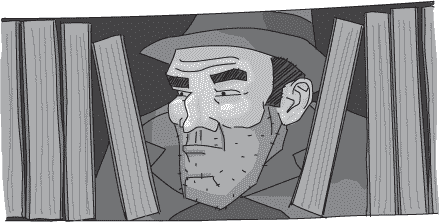
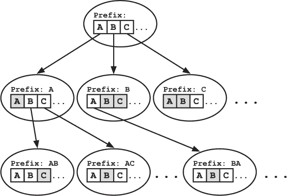
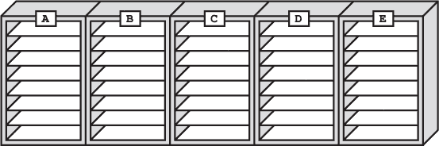
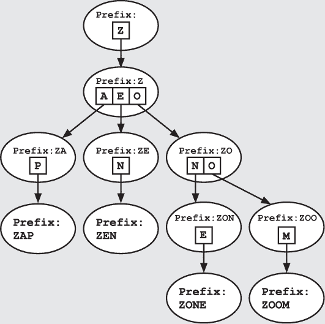
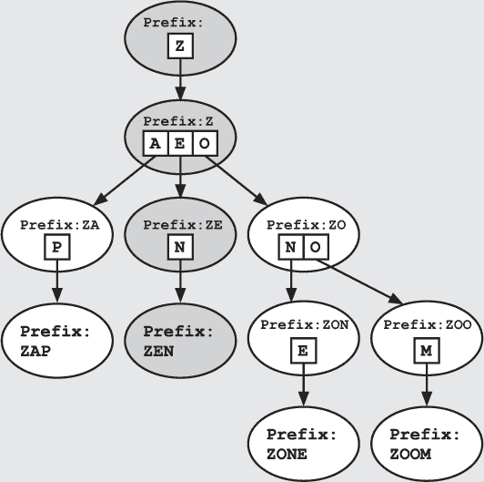

## —22—

试图处理文书工作

经过两次完整的转职文件搜索后，弗兰克仍然没有找到任何可疑的人。更准确地说，他没有找到任何明显参与阴谋的人。弗兰克至少对每个人都有一点怀疑。

“嘿，标注在这里。”Socks 在他们第二次翻阅时说道。

弗兰克叹了口气。“当然，她在这里，Socks。她刚从学院毕业。这是学院警员的账册。”

“她在学校表现得不错，不是吗？”Socks 一边浏览她的转职文件，一边问道。

“集中注意力，Socks。”弗兰克说道，“记住，我们是在寻找任何*可疑的*东西。”

“三个最近毕业的学生转到了城堡。”Socks 说道，“也许我们应该调查其中一个。格雷琴认为——”

“不。”弗兰克摇头打断了他。他已经看过这些转职文件了，都是完全干净的。在他们三个人之间，甚至没有任何一条关于不符合规定长度的脚趾甲的警告。

“这里什么也没有。”弗兰克终于说道。当 Socks 开始抗议时，弗兰克再次打断了他。“你应该回到我的办公室。我 brief 完队长后会在那里见你，然后我们可以一起查看剩下的线索。”

弗兰克觉得他看见 Socks 脸上掠过一丝松了一口气的表情，但不确定是不是自己想象的。他知道有些新手甚至会伪装阑尾炎，做到真的动手术，只为了错过一次每周的简报。

_____________________

弗兰克并没有直接上队长办公室，而是回到了记录室。队长已经把正式报告交给了他，但弗兰克自己还没来得及调查犯罪现场。也许他会幸运地找到线索。

记录员是一个名叫约翰·凯奇的新手，他不情愿地允许弗兰克进入房间，紧随其后用警觉的目光盯着他。也许是在盗窃事件发生后，车站加强了安全措施，尽管凯奇的行为可能只是由于新手的过度热忱。每个新手都会幻想着每周都有一次破案并拯救局面的机会。

在以寻找丢失的龙为借口的幌子下，弗兰克扫视着书架上的书籍。正如预期，这样规模的车站文书工作量巨大。文书工作似乎随着政府机构的规模呈平方增长，而首都警察局的警员人数比任何两个其他局的总和还要多。即使没有被盗的卷轴，这个房间也已经堆得满满的。

幸运的是，记录员们把信息整理得很好。根据国王的规定《大于 10 人以上机构的文书及其他平面工作产品存储管理》，每份文件都按照主题分类并储存。大部分的书架上专门存放着如逮捕报告、费用报告、转职文件、守卫轮班表以及噪音投诉等主题的资料。

房间本身就像一个巨大的*字典树*。字典树，也叫做*前缀树*，是一种数据结构，允许高效地对字符串集合进行查找。它在概念上类似于二叉查找树，字典树从根节点开始，向下分支。不同的是，字典树是针对字符串查找而优化的，而不是数值。每个节点根据“字符串中的*下一个*字母是什么？”来分割数据。因此，字典树中的每个节点可以有许多子节点，每个字母对应一个子节点。这种结构让你通过沿着字典树的单一路径查找目标字符串，高效地进行搜索，每次根据下一个字母来选择下一个节点。

弗兰克曾在一次巫师大会上看到过一个魔法字典树的演示。那个霓虹橙色的树悬浮在空中，存储着卖家携带的千种药水成分的名字。为了简单起见，字典树只显示了非空的分支。顾客可以使用字典树快速确定哪些成分有库存。例如，他们可以通过依次选择 B、A、T、N、I、P 分支看到卖家有*蝙蝠草*。他们还可以迅速发现*婴儿爽身粉*缺货，因为 BA 下的子树没有与 B 对应的分支。

记录室采用了字典树的概念并将其应用于书架。墙上排放着 26 个巨大的书架，每个书架上存放着以某个字母开头的记录。它们是字典树的第一层节点。首先是 A 架子，接着是 B 架子，依此类推。

接下来，每个书架都包含独立的架子，每个架子对应一个学科的第二个字母。这些架子构成了字典树的下一层。

因为大多数两字母组合并没有对应现有的条目，所以书架不需要 26 个独立的架子。弗兰克曾听说过记录员通过创造新主题来填补空白消磨时间的故事。显然，一位高级官员曾因建议将限速文件归档到“极速政策”下，而被队长长时间训斥，强调警察工作的严肃性。今天，Z 书架仍然缺少一个 ZO 架子。

这些架子随后被水平排列，带有标签的书挡代表字典树的第三层。

在走动时，弗兰克扫了一眼 V 架子。在他加入警察队伍的那段时间，他成功地争取到让 Vinettees 拥有一个独立主题的机会。他曾花了许多夜晚钻研 V 书架、I 架子、N 区的文件。

弗兰克停在了 D 书架，找到了 R 架子，A 区。他拿出一本关于龙类注册的书，假装快速翻阅，同时观察着房间的其他部分。

队长对犯罪的描述是准确的。整排的记录架被清空，所有与某些两字母前缀相对应的卷轴都被剥离。其他书架则完全没有受到影响。从他当前的视角，弗兰克能看到 AS、CE、EX、NO、PR 和 RO 的空架子。他在脑中列出了这些前缀。无论小偷在找什么信息，都与这些前缀相关。弗兰克得到了另一个线索。

他放下关于龙注册的书籍，声音洪亮地宣布：“好消息！在首都注册的鸽子食者很少，而且鸽子很多。至少这个可怜的家伙在我找到它之前不会饿死。”

约翰·凯奇对他投来同情的目光，但什么也没说，弗兰克从记录办公室大步走出。

**警察算法 101：Tries**

***德雷克教授讲座摘录***

Trie 是一种基于树的数据结构，允许用户根据字符串的前缀高效地查找字符串。像二叉搜索树一样，Trie 从根节点开始，并随着向下的推进而分支。在 Trie 中，每一个分支决策都基于字符串的下一个元素。因此，Trie 中的节点可以有超过两个子节点。

和二叉树一样，我们只需要包含有数据的节点。这个例子是由单词 *zap*、*zen*、*zone* 和 *zoom* 构建的。由于我们没有包含 *zonk*，所以在 ZON 的 K 分支下不需要有一个子树。

请注意，我们不需要在节点中存储实际的前缀；这些前缀可以从树中的路径中重建。然而，在每个节点中存储一个额外的信息位是有用的：该节点是否表示一个有效单词的结尾。这使我们能够区分插入的单词和插入单词的前缀。例如，我们可以判断单词 *zoo* 是否已被插入到一个同时包含单词 *zoom* 的树中。

搜索 Trie 类似于搜索二叉搜索树。算法从 Trie 的顶部开始，向下推进。在每个节点，算法选择与目标字符串中下一个字母对应的分支。例如，如果我们在搜索 *zen*，我们将从 Z 开始，沿着 E 的分支走，然后是 N 的分支。

如果没有这样的元素，我们就知道感兴趣的值不在树中。因此，如果我们在这棵树中搜索 *zany*，我们将在 ZA 后遇到死胡同。

在执法中，Tries 的一个出人意料的常见应用是编制可能的嫌疑人名单。你会惊讶地发现，举报人拒绝提供完整姓名，却很乐意提供前几个字母。在这种情况下，我们可以在 Trie 中搜索该前缀，并列出对应子树中的所有姓名。根据字母的数量和稀有性，这可能足够限制搜索范围。
