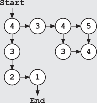
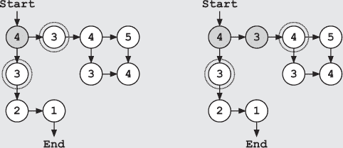
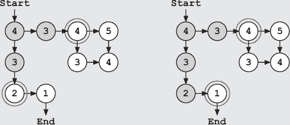
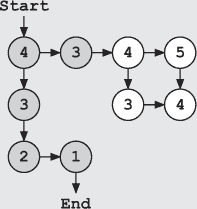

## 第二十三章：—23—

最佳优先搜索：侦探最信赖的工具

多诺万队长的办公室在过去五年里变化不大。桌子依旧坐落在房间中央，表面上除了四个标有“收件”、“外出”、“归档”和“销毁”的文件篮，几乎没有东西。墙上多了一些新的表彰奖状，除了弗兰克已经认得的那一大堆。只有那些家庭照片——队长两个孩子的木炭素描画和一张全家福，才让人感觉到时间的流逝。

“坐下吧，弗兰克。”队长说，头也不抬地继续处理文件。

弗兰克看着队长办公桌前的椅子，回想起上次坐在这个办公室里的情景——他作为警察的最后一天。那时他终于积累了足够的证据，再次准备追查丽贝卡·维内特，尽管他的一些手段*确实*有些接近危险的随机性。可是队长并不这么看，他关注的是弗兰克对规章的公然无视，而不是新出现的证据。将记忆抛到脑后，弗兰克瘫坐在右边的椅子上，等待着。

最终，队长签署了表格，把它放进“外出”篮里，然后与弗兰克对视。“你发现了什么？”

“这远不止是几份丢失的文件。”弗兰克回答道。

队长看起来并不惊讶。“多大？”

弗兰克花了一个小时在脑海中排演这次会面的不同版本，权衡各种可能的应对方式。最终，他决定发挥自己的强项——而圆滑并不在其中。

“你为什么不先告诉我你知道什么？”弗兰克说。“你真正知道的，换句话说。没有更多的谎言，没有更多的遗漏。”

队长看起来毫不动摇。“我从没对你撒过谎，弗兰克，”他说。“我来见你时，把我知道的一切都告诉你了。”弗兰克刚想反驳，但队长举起手制止了他。“不过，后来有了一些新的进展，”他继续说，“最新的消息今天早上才传到我这里。”

“其他的盗窃事件呢？”弗兰克问道。

“除了这些，”队长说。

队长翻阅了他的“外出”文件篮，取出一个标有“交给弗兰克·运行”的信封，递给了弗兰克。“给你，”他说，“我们可以省下跑腿的时间。”

弗兰克打开信封，浏览了文件。他发现了四份事件报告——三份是关于其他警察局的盗窃事件，第四份则是关于军事车队遭遇袭击的报告。他知道这些事件，但细节让他感到吃惊。

“加速腐烂的法术？”他问道。

“我们找来了巫师确认，”队长说。“窃贼们腐蚀了档案室的门，强行闯了进去。”

“那辆护送车队呢？”

“腐烂的弩，”队长说道。“还有一辆马车的车轮——应该是后左侧的。应该在报告里有。”

“那剑呢？斧头呢？”

“你从来没去看过报告。窃贼们也用了加速生锈的法术。这并不是特别先进的魔法，但很有效。”

“这上面没有写他们偷了什么，”弗兰克注意到。“没有提到面具。”

队长挑了挑眉。“你知道面具的事？那可是高度机密。”

弗兰克耸了耸肩。“你雇我来找信息的，”他说，没提袜子只是偶然透露了这个信息。告诉客户成功的原因中有多少是因为别人犯了错，通常没有好处。

“这让人担心，弗兰克，”队长说道。“那是一个强大的神器。再加上我们收到的匿名线索，说城堡可能会遭到袭击，整个警力都处于高度戒备状态。我们已经不得不从其他岗位调人来加强安全。”

“我也听说过关于城堡的事，”弗兰克承认道。他再次翻阅了文件。“关于袭击者的线索呢？”

“我们听到了一些传闻，但没有确凿的证据。至少没有足够确凿的证据能写进报告里。”

“那你的警员呢？”弗兰克问。“你那里有任何嫌疑人吗？”

队长在回答之前仔细观察了他。弗兰克知道，如果队长没有怀疑是内鬼，他绝不会找上自己。但从一般的怀疑到列出一份简短的名单之间，仍然存在相当大的差距。

“不知道，”队长说道。“我还没有找到任何线索。盗窃案之间没有共同的特征。不同的站点、不同的值班警员，甚至不同的部门。”

弗兰克默默点了点头，心里回想着那些盗窃案。他在内部调动的事情上也曾走到过死胡同。每次事件发生时，至少有一名新的调动警员在值班，但从来没有同一名警员重复出现过。弗兰克曾短暂考虑过整个新兵班级有一个广泛的阴谋，但立刻就否定了这个想法。任何能够策划如此大规模背叛的人，应该能够组织出更加微妙的盗窃案，至少是那种不会引起一百英里内每个站点警觉的盗窃。

“那诺泰申警员呢？”弗兰克问。

队长看起来确实有些吃惊。“她呢？”

“她在你的名单上吗？”弗兰克问。

“她当时值班，所以她在我的名单上，”他说。“但她排在最后。诺泰申是个好孩子。她经验不足，但她对警察工作充满热情。”

“你知道她一直在自己调查盗窃案吗？”

队长皱了皱眉。“我想这不应该让我感到惊讶。正如我所说，她很投入。你是在哪儿遇到她的？”

“克兰诺克的农场，”弗兰克说道。“她之后一直跟着一段时间。”

“她说了？然后呢？”

“我不信任她，”弗兰克说道。

“你不信任任何人，弗兰克。”

弗兰克叹了口气。“不仅仅是这些，”他说。“如果你发现有什么异常，告诉我一声。”

“那你呢？”队长问道。“你发现了什么？”

弗兰克简洁地给了他一个总结。他告诉队长，他是如何跟随一个线索来到克兰诺克的农场，并找到一连串的线索，这些线索引领他来到了 Usb、维内特号船和丽贝卡·维内特。

听到这个消息，队长带着笑声打断了他，“又和**Vinettees**撞上了，弗兰克？还有**Rebecca**，我真惊讶你还能走得动。你把多少人关进了监狱？”

“还不够，”弗兰克说道。

“公平，”队长承认道，“你是怎么逃出来的？”

“一个巫师出现，开始扔腌鳗鱼的桶，”弗兰克说得好像这是一件再正常不过的事情。

队长瞪大了眼睛，“什么？”

“一个叫**Socks**的初级巫师，”弗兰克解释道，“他是名为格雷琴的巫师的学徒。显然，国王请来了几位资深巫师来协助处理此事。”

“我没听说过格雷琴，但国王请来巫师的事并不让我感到惊讶，”队长说道，“在对车队的攻击之后，国王动员了他能调动的所有人。连安妮公主也从她最近的任务中回来。她明天就会回到城堡。”

那句话透露了情况的严重性。安妮公主几乎总是外出执行任务、进行探险或关键谈判。如果她回来了，那就说明形势非常严峻。

“安妮公主要回来了？”弗兰克问道。

“她认为这次的攻击可能与不必要复杂联盟有关。”

“不必要复杂联盟？”

“这一切都归结于那个邪恶的巫师**Exponentious**，”队长解释道，“你知道，就是那个试图摧毁王国的家伙。”

弗兰克点了点头。他清楚地记得，当**Exponentious**进攻时，恐怖席卷整个王国。这些日子里，关于他征战的故事总是在篝火旁低声讲述，用来吓唬年轻的巫师和骑士们。

队长继续说道，“自那以后，他被安全地关押在王国监狱，但安妮公主担心他不是孤军作战。也许他有追随者、同伙、仰慕者，类似那种人。她一直在追踪这个神秘的新联盟，显然他们的目标是摧毁王国。到目前为止，他们一直隐藏在阴影中，只进行一些小规模的攻击。但王室很担心。”

弗兰克茫然地盯着队长。难道这就是**Vinettee**暴徒在*Retry Loop*上提到的那个联盟？如果是的话，他究竟陷入了什么样的困境？然后又有一个念头涌上心头。

“对城堡的攻击！这和安妮公主的回归有关系吗？”弗兰克问道，“如果她一直在追捕这个不必要复杂联盟的成员，他们可能会寻找反击的机会。”

“我们考虑过这个，”队长同意道，“她回来的时候，我们会再调集一百名警卫来值班。那样一来，军械库、监狱和警察局的人手就会减少。但我们不能冒险。”

“那面具呢？有人可能会利用它来潜入警卫中。”

“是的，这是一个潜入城堡的绝佳机会，”队长承认道。“即使没有面具，增加一百个新守卫也几乎无法识别所有人。但我们采取了预防措施。皇家巫师马克斯为城堡的守卫们制作了魔法身份徽章。这些徽章几乎无法伪造，如果佩戴者的名字或照片不匹配，徽章会闪烁明亮的红光。”

弗兰克的思绪飞速运转，试图寻找安全漏洞。

“继续说，”队长催促道。“你还发现了什么？”

弗兰克加快了速度，回忆起他们在 *TCP Flyer* 上的一天，以及他们对 Mudwall 和 Frayed Cable Island 的搜查。他描述了监狱中的袭击以及文件丢失的情况。最后，他详细说明了从线索和调动日志中得到的最新进展。

“这就是你为什么需要了解标注（Notation）的原因，”队长说。“她是最近从学院调来的。”

“这也是其中一个原因，”弗兰克承认。“她的名字出现在我的范围搜索中。”

队长思考了片刻，然后说道：“我觉得她不是那种人。直觉告诉我她是个好警察。但现在我不确定该相信谁。她本不该负责这个案件。这个任务不属于她。”

“谢谢你，”弗兰克说道。

“还有其他调动过来的人员我应该留意吗？”

弗兰克摇了摇头。“一些新兵曾在不同的犯罪现场，但没有什么共同点。没有人可能参与过不止一次盗窃。所以除非你有一整个叛徒小组，否则我觉得这就是死胡同。”

“干得不错，弗兰克，”队长说。“这是我这些年来见过的最好的最优先搜索（best-first search）示例之一。”

弗兰克笑了笑。即使在警局里，很少有人会把这种调查方式称作最优先搜索。更多时候，人们会说“我在调查事情”或者“我在跟进一些线索。”

尽管这种方法没有得到广泛认可，最优先搜索却是每个警察的必备工具，与笔记本和舒适的鞋子一样重要。在最优先搜索中，你会列出当前的所有线索，选择最有前景的一个去跟进，然后继续跟进。跟进完这个线索后，你就选择下一个最好的线索，继续调查。途中发现的任何新线索都会被加入列表。这是解决许多案件的最佳工具。

“还有别的事情吗？”队长问道。

弗兰克摇了摇头。

“好吧，”队长说。“那就继续下去。如果‘不必要复杂性联盟’真的存在并且是幕后黑手，那么我们就比我想象的还要深陷其中。弗兰克，你最好小心点。”

“我一直都做得好，”弗兰克回答。他站起身，但停了下来。“再问一个问题。你知道标注（Notation）是怎么知道 ArrayCart 的吗？”

“我不清楚，”队长说，目光越过弗兰克。“为什么不问问她？看起来她正站在我办公室门外。”

**警察算法 101：最优先搜索（Best-First Search）**

***来自德雷克教授讲座的摘录***

如果你从本课程中只记住一个算法，那应该是最佳优先搜索。这一算法将成为你在执法工作中的得力工具。你将会在每个案件中都需要用到它。当然，它也会出现在期末考试中。

最佳优先搜索是一种根据评分或评分函数选择下一个要探索的状态的算法。每个新发现的搜索状态都会获得一个分数，表示算法认为它有多好。例如，你可以根据状态包含目标值的概率（如果你能估算出来）或调查中的线索质量来标记状态。在每一步中，算法都会选择探索得分最高的状态。你可以将最佳优先搜索的操作可视化为保持一个*排序过的*待试状态列表。

最佳优先搜索也可以用来最小化与每个状态相关的成本，例如状态到目标的估计距离。在这种情况下，算法会选择一个能最大程度减少成本的下一个状态。

考虑一个非常简单的迷宫，你知道起点和终点的位置坐标。你可以为搜索空间中的每个状态标注一个成本，成本等于从该状态到目标的距离。例如，你可以使用*曼哈顿距离*——到目标的总垂直距离加上到目标的总水平距离。这个标签并不一定意味着这个状态能够带你到达目标，但它为搜索算法提供了一个信号。

随着搜索的进行，它将探索不同的状态（显示为阴影圆圈），发现新的未探索状态，并将未探索状态加入待试状态列表（用虚线圆圈包围）。在每次迭代中，搜索会根据分数或成本选择最优的未探索状态。在这个例子中，这意味着选择成本最小的状态。

一旦找到终态，我们就可以终止搜索。在这个例子中，我们只需要探索略多于一半的状态。例如，我们从未选择探索距离为 4 的第二个状态，因为我们总是有更好的选择可以先尝试。

当你在现场时，你需要确定如何优先处理线索。根据具体情况，你可能想从最新的线索或最具体的信息开始。无论如何，你应该始终优先考虑你的搜索。
