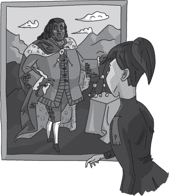

## 第二十四章：—24—

调查的优先队列

“唐纳文船长，”Notation 闯入办公室时说。“我想亲自为在工作时间以外进行未经授权的调查道歉。但这与弗兰克一样是*我的*调查，如果他正在汇报—”

“那么这究竟是如何变成*你的*调查，Notation 警官？”船长打断道。“我记得我已经把你分配到了假冒溜溜球案件。你为什么会在克拉诺克农场调查被盗文件？”

“我在追踪一个线索—”Notation 开始说。

“你在追踪线索？”船长打断道。“我在你的任何报告中都没有看到有关 ArrayCart 的内容。”

“那天早上我突然想到的，”Notation 解释道。

“你决定追踪这个线索而不是向负责调查的侦探报告？”

弗兰克畏缩了一下。船长痴迷于遵循调查的正确程序。在船长的个人可怕违规清单中，未报告线索的错误排名高于使用启发式数据结构，低于拒绝洗澡。从 Notation 近乎恐慌的表情中，他可以看出她也在考虑同样的事情。

“我已经接近农场了，”她说。“而且—”

“那个线索是什么？”弗兰克问道。

Notation 惊讶地转向他，可能是因为他打断了船长的审问，也可能是因为她简单地忘记了他在那里。

“我想起了盗窃当晚的一些事情，”她说。“我刚刚完成了我的夜间报告，当我看到窗外有一辆奇怪的车。当时我没有想太多，因为鱼贩们总是用奇怪的车。我以为那是早晨的鳗鱼送货。”

她转向船长，眼神恳求。“这似乎是一个很大的机会，”她解释道。“我觉得这可能是一条死胡同，那辆车只是一辆送货车。在我了解更多之前，我不想报告它。”

“然后你和弗兰克一起进行了将近两天的调查，”船长说。

“我们找到了一些有希望的线索，”Notation 提供道。

“Notation 警官，”船长厉声说。“我不在乎你是否被前警长的幽灵引导。程序是有原因的。你没有遵循它们。”

Notation 盯着地面看了看。“我明白了，长官。”

“不，”船长说。“我不确定你是否明白。但你会有足够的时间去思考。在另行通知之前，你将被安排在办公桌上。”

Notation 打了个寒颤，但没有抗议。

船长转向弗兰克。“弗兰克，你还有工作要做，”他说，结束了会议。

当她转身离开时，Notation 的目光落在墙上悬挂的弗雷德里克国王肖像上。她似乎陷入了沉思片刻。

“船长，”她突然说。“你有任何优先队列吗？”

弗兰克花了一会儿时间来联系起来，但最终勉强想起了模糊的记忆。他的一位教授曾在课堂上滔滔不绝地讲述弗雷德里克国王是如何推广优先队列的。

在成为国王之前，弗雷德里克会接见并听取王国公民的投诉和关切。由于他日程紧张且民众的投诉数量庞大，他被迫制定了一个优先级排序方案。一个王子一次能容忍的投诉数是有限的。

第一王子弗雷德里克曾试过用投诉栈，先听最新的投诉，但他错过了重要的老投诉。然后他又试过用投诉队列，先听最老的投诉，但结果他错过了重要的最新投诉。最后，他采用了一种新的数据结构——优先队列——使他能够首先处理最重要的投诉。

“优先队列？”队长问道，显然被这个突然的问题弄得有些不知所措。几乎没有人敢在队长的讲座后再开口。他们只是谦虚地走出办公室，或者在某些情况下，花了接下来几个小时蜷缩在黑暗的扫帚柜里。

“数据结构，”Notation 解释道，看起来像是在自动驾驶模式。“它们就像常规队列：你入队和出队。但它们还要求每个项目都有一个优先级分数——即重要性的衡量。当你出队一个项目时，优先队列总是会给你下一个最重要的项目。”

看到队长和弗兰克两人一脸茫然，Notation 继续举了个例子：“如果我插入了四个项目，优先级分别为 1、2、4 和 3，那么我会按照 4、3、2、1 的顺序提取它们。”

“我知道优先队列是什么，”队长说道，“我们用它来存储噪音投诉列表。噪音越大，优先级越高，所以我们总是先处理最严重的情况。我听说他们也在用它来处理污水沼泽附近的异味投诉。虽然似乎那里的所有东西都有一样高的优先级——令人难以忍受。但是你的意思是什么？”

“你有吗？”Notation 问道。

队长摇了摇头，困惑仍在压抑着他的怒气。“没有多余的，”他说，“我们已经在用所有可用的优先队列——一个用于噪音投诉，三个用于不同类型的犯罪，一个用于最想要的名单，还有一个用于度假请求。怎么了？”

“最佳优先搜索，”Notation 说道。

“最佳优先搜索？”队长问道。“弗兰克告诉我他已经在使用最佳优先搜索。”

“没错，”弗兰克确认道。

“优先队列会让它更高效，”Notation 解释道。“每次我们找到一个新线索时，我们可以将其放入优先队列，并附上一个分数，表示这个线索有多重要。然后，当我们准备好去探索下一个线索时，我们从优先队列中取出一个。我们将始终获得下一个最重要的线索。”

Frank 叹了口气，摇了摇头。他足够了解船长，知道这事情将如何发展。船长擅长用他独特的方式进行教育时刻。他不会大声喊叫或骂人，而是冷静地引导新人意识到自己的愚蠢。“你之前是怎么做的？”船长用耐心的语气问道。这事儿注定不会有好结果。

“我把线索记在一本笔记本里，”Notation 回答道。“每次准备探索一个新线索时，我会翻遍所有线索，找出最好的那个。”

“那你有多少条线索？”船长问道。“假设平均来说。”

“平均而言？”Notation 想了一下。“大约在两到五个之间吧。”

“你想让我用部门的优先队列来帮你扫描两个到五个元素的列表？”如果船长用他惯常的低吼语气说这话，可能会显得不那么尖锐。相反，他冷静的耐心让这个问题显得异常刺耳，清楚地表达了他对整个讨论有多么觉得愚蠢。

Notation 脸红了。“嗯，优先队列其实也不贵……”她开口说，但话语渐渐消失。

“看，Notation，”船长说。“我同意优先队列在最佳优先搜索中很有效。会后我可能会为每个侦探配备一套新的优先队列。但你现在不需要一个。首先，你没有足够的线索。更重要的是，*你根本不在这个案子里*。”

Notation 的脸在讲座过程中逐渐变红，现在已经红得像是甜菜汤一样。她深吸一口气，直视着船长的眼睛，低声说：“我明白了，长官。”

Frank 感到一阵同情。Notation 犯了一个经典的新手错误，过度优化解决方案。他不得不佩服她——使用优先队列来追踪线索的想法完全合理。事实上，他这段时间一直在用优先队列。然而，她提这个问题的时机简直糟糕透了。

“Notation，”船长继续说道，“你很有潜力。你聪明、有干劲，而且直觉很好。但你得学会服从命令。不要像 Frank 这样。”

Notation 张口想要反驳。然后她瞥了一眼 Frank，露出苦笑，闭上了嘴巴，没有再争辩。她简短地点了点头，立正敬礼，随后大步走出了办公室。

“而你，Frank，得做点事。开始吧。”

Frank 转身跟着 Notation 走，连点头都懒得做。

_____________________

Frank 等到他们走到楼梯前才开口。

“你知道吗……Orb 区有个巫师可以帮你做一个便宜的优先队列。他的名字是 Heaperous。事实上，我觉得这也是他最初接触数据结构的原因。名字叫 Heaperous，估计也是必然的。无论如何，这个优先队列不太好看，但能用。不过他只在早上工作，所以你得等到明天。”

诺泰森停下脚步，给了他一个怀疑的眼神。“弗兰克，为什么告诉我这些？”

弗兰克强迫自己露出最同情的表情。“我可是经历过许多队长的演讲。更重要的是，我知道在调查过程中，好的数据结构是多么宝贵。”

“如果好的数据结构这么重要，那你为什么不使用优先队列呢？”她反驳道。

弗兰克投给她一个恼火的眼神。“当然我用优先队列。我从一开始就用了。你以为我一直在脑海里记住所有线索吗？我已经老了，做不来那种事。”

“什么？”诺泰森惊叫道。“你一直都在用优先队列？为什么不告诉队长？”

弗兰克对此笑了。“你有很多东西要学，菜鸟。首先，你永远不要在队长大发雷霆时打断他。曾经有个侦探因为打断了队长关于豆腐的漫谈，被安排了一个月的文职。我告诉你，那根本不是一场什么精彩的演讲。他一直在夹杂着豆腐的软乎和没味道之间反复说。”

诺泰森盯着弗兰克，显然不知道该说什么。

“重点是，”弗兰克接着说，“有时候你得亲自动手。如果优先队列能帮上忙，那就别等采购流程了，直接去买一个。”

诺泰森考虑了这些建议。最终，她点了点头。“我想，买我自己的设备应该不会违反任何政策。谢谢你，弗兰克。”

诺泰森脸上的兴奋几乎让弗兰克感到内疚。镇上的任何一家魔法商店都能做出优先队列，而且大多数的价格会和赫帕罗斯的店相匹配。但赫帕罗斯位于市区最远的轨道区，而弗兰克需要确保诺泰森再待一段时间，免得她乱来。

**警察算法 101：优先队列**

***德雷克教授讲座摘录***

在你在警察局的职业生涯中，所有你会遇到的数据结构里，我敢保证，优先队列是最有价值的。像栈和队列一样，优先队列也是一种数据结构，允许你插入数据并按特定顺序移除。栈和队列通过插入元素的顺序来决定顺序，而优先队列则按优先级从高到低排列数据。下一个被移除的元素是队列中优先级最高的元素，无论它是何时插入的。

每个插入优先队列的项都必须有一个优先级或分数。这可以是元素本身的值，或者是由其他函数计算出的值。

考虑这个基于噪音投诉严重程度进行优先排序的例子。如果你按以下顺序插入投诉：

“指数化浓缩咖啡馆的人群” (score = 3)

“螃蟹夹海上歌谣比赛” (score = 6)

“斯温森农场主的兔子” (score = 1)

“斯温森农场主的公鸡” (score = 5)

“斯温森农场主” (score = 7)

你可以从优先级队列中检索它们：

“斯文森农夫”（得分 = 7）

“螃蟹的夹子海哨比赛”（得分 = 6）

“斯文森农夫的公鸡”（得分 = 5）

“指数表达式咖啡馆的人群”（得分 = 3）

“斯文森农夫的兔子”（得分 = 1）

请注意，不能保证数据在优先级队列内部会被排序，只能保证按顺序提取。正如你将在后续讲座中看到的，称为*堆*的数据结构是实现优先级队列的一种高效方式，它不会保持数据完全排序。

首都的车站使用各种优先级功能。正如你所预料的那样，最受争议的队列是度假优先级队列。这个队列仅按照官员未使用的假期天数排序。尽管之前有过请求，但并没有为度假地点的美好程度提供额外的优先级。即将到来的前往冰川、海滩和沼泽的旅行被同等对待。相反，队列根据公平度量来确定优先级。这有助于确保下一个休假的官员是今年休假天数最少的那个。
