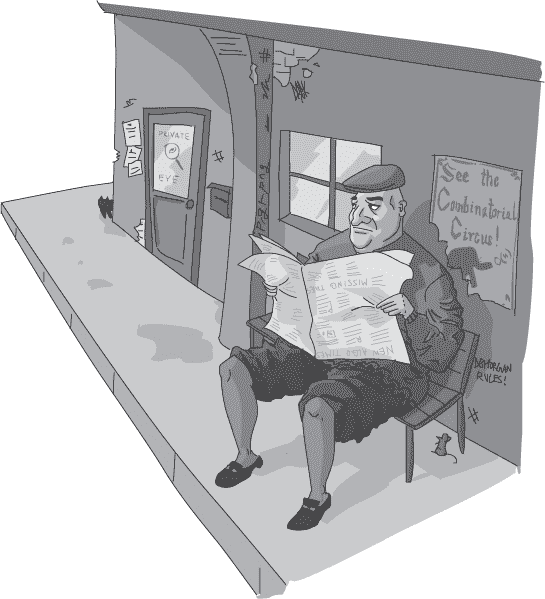

## 第二十五章：—25—

锁匠开锁优先队列

一小群恶棍正等在 Frank 办公室门外。他们试图伪装自己，但 Frank 在一条街外就发现了他们。其中一个坐在长椅上，假装看报纸，但眼睛不停地扫视着街道。其他三个站在角落附近，大声争论着最近的一场体育比赛。Frank 走近时，意识到他们讨论的竟是完全不同的体育项目。一个恶棍在抱怨上一次皇家马球比赛的裁判，另一个插话讨论即将到来的赛马比赛，第三个则只是时不时地说“体育”这两个字。

只有间谍成功地保持了低调。她正站在街对面，悠闲地靠在墙上。如果他之前没有追过她，Frank 可能完全没有注意到她。她很厉害，或者更准确地说，恶棍们实在太差劲了。

Frank 没有停下脚步，他转身并走进了一条旁边的街道。他不能回办公室，那里有一队 Vinettee 的恶棍在等着他。经过片刻思考，他决定去一个旧的警察安全屋。那儿很近，而且已经很多年没人用了。如果他够幸运，或许还能记得锁的密码。

Frank 走了半个街区，听见身后传来喊声和急促的脚步声。间谍一定是已经通知了其他人。

“Frank！”一个特别壮硕的恶棍喊道。“我们只是想谈谈。”

就在这个声明本就足够荒谬的时候，其他恶棍的笑声更是打消了任何怀疑，说明他们的意图不简单。Frank 开始加速跑步，身后的脚步声紧随其后。

Frank 猛地左转，进入了一条狭窄的小巷。他对这片城区很熟悉，确信自己能甩掉追兵。他只需要足够的时间进入安全屋。如果幸运的话，他可能一试就记得密码。

Frank 从小巷出来，走到旗街，迅速做了个 U 型转弯，进入了街角的商店。他假装在浏览婴儿衣物架子，同时通过窗户观察外面的情况。Tike’s Tunics 的衣架提供了一个理想的观察位置。

一分钟之内，恶棍们涌到街上，站成一圈，看上去一脸困惑。间谍跟着出来，开始大声下达命令。她把恶棍们分成两组，分别朝街道两端走去——每边一组——然后她在小巷口等待。

Frank 没有浪费时间。他迅速穿过商店，从一扇通向小巷的后门出去。间谍离他只有 10 英尺远，背对着他。Frank 尽量悄悄地撤退，沿着小巷走向安全屋。如果他足够幸运，而且恶棍们没有想到去问店主有关他的事，那他就争取到了一些时间。

在安全屋的门前，弗兰克摸索着组合锁。他先转到 1，再转到 1，然后最后再转回到 1。说实话，这个密码很简单。锁却没有打开。

弗兰克咒骂了一声。肯定是有人在他上次来这里之后更改了组合密码。他考虑了自己的选择。他可以尝试找到密码，这可能会花很长时间，或者他可以找到另一个藏身之处。由于想不到任何不需要再次经过恶棍的安全地方，他又转向了锁。

由于时间紧迫，弗兰克需要提高效率。锁需要三个数字，每个数字在 1 到 20 之间，因此他面临着 8000 种可能的组合。他没有时间进行广度优先搜索或深度优先搜索。相反，他不得不依赖有限的最佳优先搜索和一些大胆的猜测；他得相信自己的直觉。他从口袋里拿出优先队列，擦干净后开始写下组合。每写一个组合，他就加上一个优先级——他认为成功的可能性有多大。他从一些常见的警用组合开始：

1-2-3

1-1-2

1-3-5

他给这些组合都设置了优先级 10。

接着他转向了其他相同数字的三位组合。如果密码曾经是 1-1-1，为什么不试试 2-2-2 呢？安全屋使用得不够频繁，所以保持密码简单是值得的。他列出了 19 个未尝试的三位数字组合，给它们的优先级设为 5。此时优先队列中总共有 22 种可能性。

然后他迅速回忆起负责安全屋的警官们的生日。这又增加了 6 个组合，他将它们的优先级设为 8。他又想起了其他警官的生日，并将它们的优先级设为 2。

最后，他添加了单词*RUN*，并将其优先级设为 1。他深知，如果他到达了这个选项，那就意味着是时候放弃了。他得找一个新的藏身地方。

现在，优先队列中有 32 个选项。结果是，一长串可能的组合等待尝试。最上面的是优先级最高的组合 1-2-3。弗兰克尝试了它，但什么也没发生。

他咒骂了一声，将组合从优先队列中移除。一个新的最高优先级组合浮现在队列顶部。

在他尝试下一个组合之前，一个念头突然闪过。他想到，或许他们使用了旧组合的某种变体？他知道有不少警官会把自己储物柜的组合密码和行李的密码反过来用。负责安全屋的警官是否也做了类似的事？弗兰克在列表底部加上了 3-2-1，优先级设为 9。

1-1-2 和 1-3-5 都没能打开锁，这也消耗了所有优先级为 10 的组合。弗兰克将它们划去，并将它们的反向组合 2-1-1 和 5-3-1 加到列表的底部。依旧使用优先级 9，他认为反向组合对人们来说容易记住。

他从列表顶部读取了下一个优先级最高的组合 3-2-1。这是他最近添加的一个反向组合。这就是优先级队列的魔力：无论你按什么顺序添加项，下一次总是能得到最优的条目。

锁在 5-3-1 时终于“咔嚓”一声打开了，这是他添加的优先级为 9 的代码之一。弗兰克松了一口气，环顾四周。仍然没有看到 Vinettees 的踪影。现在他暂时是安全的。

**警察算法 101：数据结构与搜索**

***来自德雷克教授讲座的摘录***

正如我们在整个学期的讲座中讨论的那样，我们使用的数据结构不仅会影响算法的功能，还会影响其效率。在关于深度优先搜索和广度优先搜索的讲座中，我们探讨了栈和队列的差异如何影响搜索顺序。使用优先级队列进行最佳优先搜索是另一个很好的例子，展示了数据结构的影响。

从概念上看，最佳优先搜索与广度优先搜索和深度优先搜索相似。在算法的每一步，我们都选择一个新的状态进行探索。关键的区别在于我们如何排序这些新状态的探索顺序。使用优先级队列使得我们能够高效地选择*最有前景的*下一个状态。最佳优先搜索和优先级队列是完美的互补，形成了一个极其高效的数据结构与算法组合。
