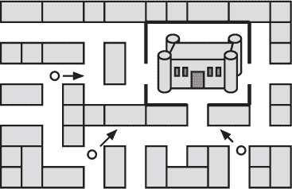

## 第二十六章：—26—

搜索中的启发式

弗兰克整晚交替着回顾线索、在窗户旁警惕着 Vinettee 的暴徒，并哀叹安全屋缺乏食物。很快，他意识到，不仅仅是食物缺乏。公寓里缺少了每个警察局都有的标准设备——空白笔记本、羽毛笔和结实的家具。一旦他想到要找这些，弗兰克很快在窗户上发现了一个大大的“出租”标志。幸好警察还没有租出去或者更换密码。

几个小时后，弗兰克说服自己，Vinettees 应该找不到他。他放弃了窗户，开始在空荡荡的公寓里踱步，集中精力思考案子。“何时”和“何地”很简单——线索表明明晚将会对城堡发动攻击。不幸的是，除了“何时”和“何地”，弗兰克依然没有答案。特别是“谁”、“为什么”、“怎么做”以及“我能偷偷出去找食物而不被 Vinettees 看到吗”这些问题，依旧是悬而未解的重要问题。

在努力填补剩余细节的一个小时内，弗兰克开始怀疑起了“何时”和“何地”。对城堡的攻击似乎太过明显，警察已经做好了准备。甚至连 Socks 也在告诉他认识的每一个人要注意这件事。

弗兰克停下脚步，骂了声脏话，顿时意识到了事情的真相。Socks 肯定参与其中。带着熟悉的*我早知道不该相信任何人*的感觉，弗兰克在脑海中回放了过去几天的事件，这次他认出了其中的迹象。他本该在 Socks 的手下“偶然”点燃牢房里的文件并销毁证据时就发现问题。他本该意识到，是有人泄露了他去斗篷店的消息给了间谍。他本该至少对那次荒谬且恰到好处的救援——用腌鳗鱼桶——产生疑问。但最重要的是，从 Socks 错误地插入二叉树节点的那一刻起，他就应该绝对确信。没有哪个二叉树专家会不小心犯这种错误。虽然他一直有些怀疑，但说到底，弗兰克总是怀疑每个人。

这一发现让他有了更多的疑问。“何时”和“何地”再次没有答案。如果 Socks 一直在给他们提供虚假的信息，弗兰克不得不重新审视一切。巫师们要做什么，他们又怎么做呢？知道“为什么”也不错，但弗兰克发现，每当他破坏了精心策划的阴谋时，作案者总是会在没有任何挑衅的情况下滔滔不绝地说出“为什么”。到此时为止，他也已经放弃了偷偷外出找食物的念头，暂时把这个问题搁置在了一个咕咕叫的肚子里。

“面具是怎么回事？”Frank 自言自语。如果小偷们计划攻击这座城堡，他们还会用到面具吗？或者 Marcus 的身份证明是否会使其失效？他们是否只是需要它来闯入警察局？小偷们究竟想要什么记录？Frank 开始在笔记本上列举这些问题。很快，问题的数量超过了线索。

Frank 思考着他的下一步。由于时间非常有限，他需要深入使用*启发式*方法——这些经验法则能帮助算法朝正确的方向推进。例如，当寻找丢失的乌龟时，Frank 使用了常见的“先检查附近”这一启发式方法，因为乌龟行动缓慢。当他要在车站找到最新的咖啡时，他依赖“检查最满的锅”这一方法，因为那通常是最新冲泡的。而当他在一个陌生的城市寻找一座高塔时，“先朝塔的方向走”通常能让他在绕过几次死胡同后顺利找到目的地。启发式方法并不完美，但它们提供了有用的信息。

在警察局的日子里，Frank 逐渐信任了一个优于其他所有方法的启发式规则：首先追踪最具体的线索。具体的名字和实物证据总是比一般的怀疑和谣言更有价值。

这是 Frank 唯一一次在职业生涯中忽略的启发式方法，当时 Glass Box Billy 提供了关于即将发生的抢劫案的多个线索。首先，Billy 告诉 Frank 逃逸车的确切等待位置、型号和车轮的吱吱声频率。其次，Billy 传递了一则谣言，这是他在观看一场飞镖比赛时听到的，传闻中 Rebecca Vinettee 亲自参与了此次抢劫，而目标与鱼有关。

Frank 忽视了所有好的警察算法，决定直接追查 Rebecca Vinettee。他知道在他们装载逃逸车之前，她会消失，可能会用另一条路返回藏匿处。他必须在她消失之前抓住她。他在距离逃逸车位置仅两个街区的首都鱼类仓库附近守候。

正如队长后来会大声解释的那样，鱼类仓库恰好是在错误的方向走了两个街区。另一方面，Orb Emporium 离逃逸车的地点只有四分之一街区远。一个完全与 Vinettee 家族无关的团伙偷走了 64 颗高质量的圆形玻璃球和 2 颗原型立方体玻璃球，将它们装上逃逸车，然后带着车轮发出和 Glass Box Billy 描述的同样令人烦恼的吱吱声驶离。Frank 对 Billy 提供的线索的描述，以及他坚持增加一个新的启发式方法“总是怀疑 Vinettee 家族”的观点，并没有说服队长。

然而，在当前的情况下，Frank 已经几乎没有任何模糊的线索了。他已经用尽了大部分具体的线索，进入了推测和怀疑的领域。如果他想取得进一步的进展，他需要更多的信息。他转向了自己第二个最信任的启发式方法：当遇到死胡同时，收集更多的信息。他需要更多了解面具的情况，了解它如何使用，以及有哪些魔法防御可以阻止它。在这种情况下，这意味着他需要找到一位专家。

**警察算法 101：启发式方法**

***德雷克教授的讲座摘录***

启发式方法是帮助算法指引正确方向的经验法则。虽然你无疑会听到一些警员将启发式方法视为随机猜测，但你也会看到这些警员会依赖过去曾经有效的技巧和经验法则。重要的是要意识到，启发式方法和所有信息一样，其质量是不同的。

启发式方法最清晰的例子之一是在物理世界中的导航。无论你是在迷宫中漫游，还是在陌生的城市中寻找，或者仅仅是要找到去食堂的路，你都会发现自己使用启发式方法来指导搜索。当面对两条路径时，你会选择哪一条先走？一个常见且通常可靠的启发式方法是根据简化的距离衡量优先选择选项。我最喜欢的是使用“鸟飞的距离”来衡量：如果没有任何障碍物，目标有多远？实际上，这个启发式方法意味着我总是选择看起来能让我更接近目标的路径——至少从一开始就是朝着正确的方向走的路径。我可能会遇到一些死胡同，但总体而言，我发现这个方法是一个不错的启发式方法。

当然，也有许多糟糕的启发式方法。那些在没有充分验证启发式方法的情况下使用新方法的警员，可能会陷入深深的麻烦。几年前，一名年轻的警员创造了一个特别糟糕的启发式方法。在破获了一起走私案件后，他开始认为所有的调查都必须从码头开始。问题是，这个启发式方法是错误的。它并没有帮助他将调查引向正确的方向。事实上，它经常直接把他带到了死胡同。经过 18 次失败的调查后，他的队长把他安排去永久性地巡逻码头。

启发式方法不应该是随机的猜测。它们需要包含一定量的有用信息，并且要针对正确的问题量身定制。
